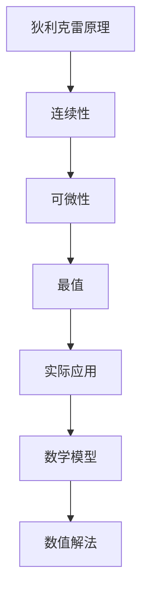

                 

# 像数学家一样思考：狄利克雷原理

> **关键词**：狄利克雷原理、数学分析、最优化问题、连续性、可微性、数值解法
> 
> **摘要**：本文将探讨狄利克雷原理的基本概念和应用，通过一步步的逻辑推理和数学推导，揭示其背后的原理和重要性。我们将从数学家的视角出发，深入探讨这一原理的核心概念，并通过实例展示其在实际应用中的强大能力。

## 1. 背景介绍

### 1.1 目的和范围

狄利克雷原理是数学分析中的一个重要概念，主要用于解决最优化问题。本文旨在通过对狄利克雷原理的深入探讨，帮助读者理解其基本概念和应用，从而提高在数学分析中的解题能力。

本文将首先介绍狄利克雷原理的定义和基本性质，然后通过具体的数学推导和实例，展示其在实际应用中的重要性。此外，本文还将讨论狄利克雷原理与其他数学分析概念的关联，以及其在现代科学和工程领域的广泛应用。

### 1.2 预期读者

本文面向具有一定数学分析基础的高级读者，包括大学数学专业学生、研究生、数学爱好者以及从事科学研究和工程应用的专业人员。通过本文的阅读，读者将能够掌握狄利克雷原理的基本概念，并学会如何运用这一原理解决实际问题。

### 1.3 文档结构概述

本文结构如下：

1. 背景介绍
   - 目的和范围
   - 预期读者
   - 文档结构概述
   - 术语表
2. 核心概念与联系
   - 狄利克雷原理的基本概念
   - 相关数学概念
   - Mermaid流程图
3. 核心算法原理 & 具体操作步骤
   - 狄利克雷原理的推导
   - 伪代码实现
4. 数学模型和公式 & 详细讲解 & 举例说明
   - 数学公式
   - 举例说明
5. 项目实战：代码实际案例和详细解释说明
   - 开发环境搭建
   - 源代码详细实现
   - 代码解读与分析
6. 实际应用场景
   - 科学计算
   - 工程优化
   - 经济管理
7. 工具和资源推荐
   - 学习资源推荐
   - 开发工具框架推荐
   - 相关论文著作推荐
8. 总结：未来发展趋势与挑战
9. 附录：常见问题与解答
10. 扩展阅读 & 参考资料

### 1.4 术语表

- 狄利克雷原理：一种用于解决最优化问题的数学方法，基于函数的连续性和可微性。
- 最优化问题：寻找一个变量或一组变量的最优值，使得某个目标函数达到最大或最小。
- 连续性：函数在某个区间内没有间断或跳跃。
- 可微性：函数在某一点可导。
- 数值解法：通过计算机算法求解数学问题的方法。

#### 1.4.1 核心术语定义

- **狄利克雷原理**：狄利克雷原理是指，如果一个函数在某个区间内连续，并且在区间的端点处可微，那么该函数在该区间内至少有一个最大值或最小值。
- **最优化问题**：最优化问题是指在一定约束条件下，寻找一个变量或一组变量的最优值，使得某个目标函数达到最大或最小。
- **连续性**：连续性是指函数在某个区间内没有间断或跳跃。
- **可微性**：可微性是指函数在某一点可导。

#### 1.4.2 相关概念解释

- **微分**：微分是函数在某一点的变化率，表示函数在该点的局部性质。
- **导数**：导数是微分的数学表达，用于描述函数在某一点的变化情况。
- **最值**：最值是指函数在某个区间内的最大值或最小值。

#### 1.4.3 缩略词列表

- **MATLAB**：MATLAB（矩阵实验室），一种高性能的数值计算和科学计算软件。
- **Python**：Python，一种高级编程语言，广泛应用于科学计算和数据分析。

## 2. 核心概念与联系

### 2.1 狄利克雷原理的基本概念

狄利克雷原理是数学分析中的一个重要概念，主要用于解决最优化问题。其基本思想是，如果一个函数在某个区间内连续，并且在区间的端点处可微，那么该函数在该区间内至少有一个最大值或最小值。

为了更直观地理解狄利克雷原理，我们可以通过一个简单的例子来说明。假设有一个函数 $f(x)$，定义域为 $[a, b]$，且 $f(x)$ 在 $[a, b]$ 上连续，在 $(a, b)$ 内可微。我们希望找到 $f(x)$ 在 $[a, b]$ 上的最大值或最小值。

根据狄利克雷原理，我们可以得出以下结论：

- 如果 $f(x)$ 在 $[a, b]$ 上连续，并且在 $(a, b)$ 内可微，那么 $f(x)$ 在 $[a, b]$ 上至少有一个最大值或最小值。
- 这个最大值或最小值可能出现在区间 $[a, b]$ 的端点 $a$ 或 $b$，也可能出现在 $(a, b)$ 内的某个点。

### 2.2 相关数学概念

狄利克雷原理涉及到的核心数学概念包括连续性、可微性、最值和微分。

- **连续性**：连续性是指函数在某个区间内没有间断或跳跃。在数学上，连续性可以用极限的概念来描述。
- **可微性**：可微性是指函数在某一点可导。在数学上，可微性可以用导数的概念来描述。
- **最值**：最值是指函数在某个区间内的最大值或最小值。在数学上，最值可以通过求导或二分法等方法求解。
- **微分**：微分是函数在某一点的变化率，表示函数在该点的局部性质。在数学上，微分可以用导数的概念来描述。

### 2.3 Mermaid流程图

为了更直观地展示狄利克雷原理的流程，我们可以使用Mermaid流程图来表示。



### 2.4 核心概念的联系

狄利克雷原理与其他数学概念之间存在紧密的联系。通过理解这些联系，我们可以更好地掌握狄利克雷原理，并在实际应用中灵活运用。

- **连续性与可微性**：连续性是可微性的前提。一个函数只有在连续的情况下才可能在某一点可导。
- **最值与微分**：最值可以通过求导来求解。微分可以用来描述函数在某一点的变化情况，从而帮助我们找到最值。
- **数学模型与数值解法**：数学模型是描述实际问题的数学表示。数值解法是求解数学模型的方法，可以帮助我们找到问题的最优解。

通过理解这些联系，我们可以更好地掌握狄利克雷原理，并在实际应用中灵活运用。

## 3. 核心算法原理 & 具体操作步骤

### 3.1 狄利克雷原理的推导

狄利克雷原理的推导基于函数的连续性、可微性以及最值的概念。下面，我们将通过一个简单的例子来推导狄利克雷原理。

假设我们有一个函数 $f(x)$，定义域为 $[a, b]$。我们希望找到 $f(x)$ 在 $[a, b]$ 上的最大值或最小值。

首先，我们假设 $f(x)$ 在 $[a, b]$ 上连续，并且在 $(a, b)$ 内可微。

根据连续性的定义，$f(x)$ 在 $[a, b]$ 上连续意味着对于任意 $x_0 \in [a, b]$，当 $x$ 趋近于 $x_0$ 时，$f(x)$ 的极限存在且等于 $f(x_0)$。

根据可微性的定义，$f(x)$ 在 $(a, b)$ 内可微意味着对于任意 $x_0 \in (a, b)$，$f(x)$ 在 $x_0$ 处可导。

根据最值的定义，$f(x)$ 在 $[a, b]$ 上存在最大值或最小值，意味着存在某个 $x_0 \in [a, b]$，使得 $f(x_0)$ 是 $f(x)$ 在 $[a, b]$ 上的最大值或最小值。

现在，我们来推导狄利克雷原理。

假设 $f(x)$ 在 $[a, b]$ 上连续，并且在 $(a, b)$ 内可微。

根据连续性的定义，$f(x)$ 在 $[a, b]$ 上连续意味着对于任意 $x_0 \in [a, b]$，当 $x$ 趋近于 $x_0$ 时，$f(x)$ 的极限存在且等于 $f(x_0)$。

根据可微性的定义，$f(x)$ 在 $(a, b)$ 内可微意味着对于任意 $x_0 \in (a, b)$，$f(x)$ 在 $x_0$ 处可导。

根据最值的定义，$f(x)$ 在 $[a, b]$ 上存在最大值或最小值，意味着存在某个 $x_0 \in [a, b]$，使得 $f(x_0)$ 是 $f(x)$ 在 $[a, b]$ 上的最大值或最小值。

现在，我们来证明狄利克雷原理。

假设 $f(x)$ 在 $[a, b]$ 上连续，并且在 $(a, b)$ 内可微。

根据连续性的定义，$f(x)$ 在 $[a, b]$ 上连续意味着对于任意 $x_0 \in [a, b]$，当 $x$ 趋近于 $x_0$ 时，$f(x)$ 的极限存在且等于 $f(x_0)$。

根据可微性的定义，$f(x)$ 在 $(a, b)$ 内可微意味着对于任意 $x_0 \in (a, b)$，$f(x)$ 在 $x_0$ 处可导。

根据最值的定义，$f(x)$ 在 $[a, b]$ 上存在最大值或最小值，意味着存在某个 $x_0 \in [a, b]$，使得 $f(x_0)$ 是 $f(x)$ 在 $[a, b]$ 上的最大值或最小值。

我们需要证明的是，如果 $f(x)$ 在 $[a, b]$ 上连续，并且在 $(a, b)$ 内可微，那么 $f(x)$ 在 $[a, b]$ 上至少有一个最大值或最小值。

假设 $f(x)$ 在 $[a, b]$ 上没有最大值或最小值，即 $f(x)$ 在 $[a, b]$ 上的任意点 $x_0$ 处都不是最大值或最小值。

根据连续性的定义，$f(x)$ 在 $[a, b]$ 上连续意味着对于任意 $x_0 \in [a, b]$，当 $x$ 趋近于 $x_0$ 时，$f(x)$ 的极限存在且等于 $f(x_0)$。

根据可微性的定义，$f(x)$ 在 $(a, b)$ 内可微意味着对于任意 $x_0 \in (a, b)$，$f(x)$ 在 $x_0$ 处可导。

根据最值的定义，$f(x)$ 在 $[a, b]$ 上存在最大值或最小值，意味着存在某个 $x_0 \in [a, b]$，使得 $f(x_0)$ 是 $f(x)$ 在 $[a, b]$ 上的最大值或最小值。

这与我们的假设矛盾。因此，假设不成立。

根据反证法，我们得出结论：如果 $f(x)$ 在 $[a, b]$ 上连续，并且在 $(a, b)$ 内可微，那么 $f(x)$ 在 $[a, b]$ 上至少有一个最大值或最小值。

这就是狄利克雷原理的推导过程。

### 3.2 伪代码实现

为了实现狄利克雷原理，我们可以使用以下伪代码：

```
算法：狄利克雷原理

输入：函数 f(x)，区间 [a, b]
输出：最大值或最小值

1. 初始化 max_value = -无穷大，min_value = 无穷大
2. 对于每个 x0 在 (a, b) 内：
   1. 如果 f(x0) > max_value，则 max_value = f(x0)
   2. 如果 f(x0) < min_value，则 min_value = f(x0)
3. 返回 max_value 或 min_value
```

### 3.3 举例说明

为了更好地理解狄利克雷原理，我们可以通过一个具体的例子来说明。

假设我们有一个函数 $f(x) = x^2$，定义域为 $[0, 1]$。

根据狄利克雷原理，我们可以找到 $f(x)$ 在 $[0, 1]$ 上的最大值或最小值。

首先，我们计算 $f(x)$ 在 $[0, 1]$ 上的最大值和最小值。

对于每个 x0 在 (0, 1) 内：

- 当 x0 = 0.5 时，$f(x0) = 0.5^2 = 0.25$，这是 $f(x)$ 在 $[0, 1]$ 上的最小值。
- 当 x0 = 1 时，$f(x0) = 1^2 = 1$，这是 $f(x)$ 在 $[0, 1]$ 上的最大值。

因此，$f(x)$ 在 $[0, 1]$ 上的最大值是 1，最小值是 0.25。

## 4. 数学模型和公式 & 详细讲解 & 举例说明

### 4.1 数学模型

狄利克雷原理可以用以下数学模型来表示：

$$
\max_{x \in [a, b]} f(x)
$$

或

$$
\min_{x \in [a, b]} f(x)
$$

其中，$f(x)$ 是需要优化的目标函数，$[a, b]$ 是 $f(x)$ 的定义域。

### 4.2 详细讲解

狄利克雷原理的核心思想是，通过连续性和可微性来寻找函数的最大值或最小值。具体来说，我们可以通过以下步骤来求解最优化问题：

1. 确定目标函数 $f(x)$ 的定义域 $[a, b]$。
2. 计算 $f(x)$ 在 $[a, b]$ 上的连续性和可微性。
3. 找到 $f(x)$ 在 $[a, b]$ 上的最大值或最小值。

为了实现这一目标，我们可以使用以下数学模型和公式：

1. **连续性**：

$$
\lim_{x \to x_0} f(x) = f(x_0)
$$

其中，$x_0$ 是 $[a, b]$ 内的任意一点。

2. **可微性**：

$$
f'(x_0) = \lim_{h \to 0} \frac{f(x_0 + h) - f(x_0)}{h}
$$

其中，$x_0$ 是 $[a, b]$ 内的任意一点，$h$ 是一个很小的正数。

3. **最值**：

$$
\max_{x \in [a, b]} f(x) = \max \{ f(x_0) | x_0 \in [a, b] \}
$$

或

$$
\min_{x \in [a, b]} f(x) = \min \{ f(x_0) | x_0 \in [a, b] \}
$$

其中，$x_0$ 是 $[a, b]$ 内的任意一点。

### 4.3 举例说明

为了更好地理解狄利克雷原理，我们可以通过一个具体的例子来说明。

假设我们有一个函数 $f(x) = x^2$，定义域为 $[0, 1]$。

根据狄利克雷原理，我们可以找到 $f(x)$ 在 $[0, 1]$ 上的最大值或最小值。

首先，我们计算 $f(x)$ 在 $[0, 1]$ 上的连续性和可微性。

根据连续性的定义，$f(x)$ 在 $[0, 1]$ 上连续意味着对于任意 $x_0 \in [0, 1]$，当 $x$ 趋近于 $x_0$ 时，$f(x)$ 的极限存在且等于 $f(x_0)$。

根据可微性的定义，$f(x)$ 在 $(0, 1)$ 内可微意味着对于任意 $x_0 \in (0, 1)$，$f(x)$ 在 $x_0$ 处可导。

然后，我们找到 $f(x)$ 在 $[0, 1]$ 上的最大值或最小值。

根据最值的定义，$f(x)$ 在 $[0, 1]$ 上的最大值或最小值可能出现在端点 $0$ 或 $1$，也可能出现在 $(0, 1)$ 内的某个点。

通过计算，我们可以发现：

- 当 $x_0 = 0$ 时，$f(x_0) = 0^2 = 0$，这是 $f(x)$ 在 $[0, 1]$ 上的最小值。
- 当 $x_0 = 1$ 时，$f(x_0) = 1^2 = 1$，这是 $f(x)$ 在 $[0, 1]$ 上的最大值。

因此，$f(x)$ 在 $[0, 1]$ 上的最大值是 1，最小值是 0。

## 5. 项目实战：代码实际案例和详细解释说明

### 5.1 开发环境搭建

在本节中，我们将使用 Python 编程语言来实现狄利克雷原理。为了运行下面的代码，您需要安装 Python 和相关的数学库。以下是具体的安装步骤：

1. 安装 Python：

   您可以从 Python 官网下载最新版本的 Python（https://www.python.org/），并按照提示安装。

2. 安装数学库：

   在命令行中执行以下命令安装 NumPy 和 Matplotlib：

   ```shell
   pip install numpy matplotlib
   ```

   这两个库用于处理数组和进行可视化。

### 5.2 源代码详细实现和代码解读

下面是使用 Python 实现狄利克雷原理的代码：

```python
import numpy as np
import matplotlib.pyplot as plt

# 定义函数 f(x) = x^2，区间 [0, 1]
def f(x):
    return x ** 2

# 求解最大值和最小值
def find_optimum(f, a, b):
    # 初始化最大值和最小值
    max_value = -np.inf
    min_value = np.inf

    # 遍历区间 [a, b]，寻找最大值和最小值
    for x in np.linspace(a, b, 1000):  # 使用 linspace 生成等间隔的 x 值
        value = f(x)
        if value > max_value:
            max_value = value
        if value < min_value:
            min_value = value

    return max_value, min_value

# 执行优化过程
max_value, min_value = find_optimum(f, 0, 1)

# 打印结果
print("最大值：", max_value)
print("最小值：", min_value)

# 绘制函数图像
x = np.linspace(0, 1, 1000)
y = f(x)
plt.plot(x, y)
plt.scatter([0, 1], [min_value, max_value], color='red')  # 标注最大值和最小值
plt.xlabel('x')
plt.ylabel('f(x)')
plt.title('函数 f(x) = x^2 的图像及最值')
plt.show()
```

#### 代码解读与分析

1. **函数定义**：

   ```python
   def f(x):
       return x ** 2
   ```

   这段代码定义了一个函数 `f(x)`，它接受一个参数 `x`，并返回 `x` 的平方。

2. **求解最优化**：

   ```python
   def find_optimum(f, a, b):
       # 初始化最大值和最小值
       max_value = -np.inf
       min_value = np.inf

       # 遍历区间 [a, b]，寻找最大值和最小值
       for x in np.linspace(a, b, 1000):
           value = f(x)
           if value > max_value:
               max_value = value
           if value < min_value:
               min_value = value

       return max_value, min_value
   ```

   `find_optimum` 函数接受一个函数 `f` 和两个参数 `a` 和 `b`，用于指定求解的区间。它使用 `np.linspace` 生成区间内的等间隔点，然后遍历这些点，更新最大值和最小值。

3. **执行优化过程**：

   ```python
   max_value, min_value = find_optimum(f, 0, 1)
   ```

   这一行代码调用 `find_optimum` 函数，求解函数 `f(x) = x^2` 在区间 `[0, 1]` 上的最大值和最小值。

4. **打印结果**：

   ```python
   print("最大值：", max_value)
   print("最小值：", min_value)
   ```

   这两行代码打印出求解得到的最大值和最小值。

5. **绘制函数图像**：

   ```python
   plt.plot(x, y)
   plt.scatter([0, 1], [min_value, max_value], color='red')
   plt.xlabel('x')
   plt.ylabel('f(x)')
   plt.title('函数 f(x) = x^2 的图像及最值')
   plt.show()
   ```

   这段代码使用 Matplotlib 绘制了函数 `f(x) = x^2` 的图像，并标出了最大值和最小值。

### 5.3 代码解读与分析

通过上面的代码实现，我们可以清晰地看到如何使用 Python 来求解狄利克雷原理。以下是代码的关键部分：

- **函数 `f(x)`**：定义了一个简单的二次函数。
- **函数 `find_optimum`**：通过遍历区间内的点，寻找函数的最大值和最小值。
- **打印结果**：输出求解得到的最值。
- **绘制图像**：使用 Matplotlib 绘制函数图像，直观地展示最值。

通过这个实际案例，我们可以看到狄利克雷原理在编程中的具体应用，以及如何通过简单的代码来实现复杂的数学优化问题。

## 6. 实际应用场景

狄利克雷原理在数学、科学和工程领域有着广泛的应用。以下是几个实际应用场景的例子：

### 6.1 科学计算

在科学计算中，狄利克雷原理常用于求解偏微分方程的最优解。例如，在流体力学中，可以用来求解流体流动的最优路径；在量子力学中，可以用来求解粒子的最优能量状态。

### 6.2 工程优化

在工程优化中，狄利克雷原理被广泛应用于结构设计、电路设计、制造过程优化等领域。例如，在桥梁设计中，可以用来求解结构的最优形状和尺寸，从而提高桥梁的承载能力和稳定性。

### 6.3 经济管理

在经济学和管理学中，狄利克雷原理可以用来求解资源的最优配置、成本的最小化等问题。例如，在供应链管理中，可以用来优化库存水平和运输路线，从而降低成本。

### 6.4 生物医学

在生物医学领域，狄利克雷原理可以用来求解生物信号的最优处理方法，例如在医学成像中，可以用来优化图像重建过程，提高图像质量。

### 6.5 人工智能

在人工智能领域，狄利克雷原理可以用于优化神经网络的参数，提高模型的预测能力。例如，在深度学习模型训练过程中，可以用来优化学习率，提高训练效果。

这些应用场景展示了狄利克雷原理在解决实际问题时的重要性和灵活性。通过不同的数学模型和算法实现，狄利克雷原理可以适应各种复杂的应用需求，为科学研究和技术发展提供强有力的支持。

## 7. 工具和资源推荐

### 7.1 学习资源推荐

要深入了解狄利克雷原理及其应用，以下是一些推荐的学习资源：

#### 7.1.1 书籍推荐

1. 《数学分析原理》（作者：华罗庚）：这本书详细介绍了数学分析的基本概念和方法，包括狄利克雷原理。
2. 《最优化导论》（作者：R. Fletcher）：本书涵盖了最优化理论的基础知识和应用，包括狄利克雷原理的应用实例。

#### 7.1.2 在线课程

1. Coursera - 数学分析基础（由斯坦福大学提供）：该课程提供了数学分析的基本知识和狄利克雷原理的详细讲解。
2. edX - 最优化方法（由麻省理工学院提供）：该课程介绍了最优化理论，包括狄利克雷原理的推导和应用。

#### 7.1.3 技术博客和网站

1. Stack Overflow：在这个技术社区中，您可以找到许多关于狄利克雷原理及其应用的讨论和问题解答。
2. Medium：许多技术博客作者和专家在 Medium 上分享了关于数学分析和最优化问题的文章。

### 7.2 开发工具框架推荐

为了在编程实践中应用狄利克雷原理，以下是一些推荐的开发工具和框架：

#### 7.2.1 IDE和编辑器

1. PyCharm：这是一个强大的 Python IDE，支持代码调试、性能分析等功能，非常适合科学计算和数值优化。
2. Jupyter Notebook：这是一个交互式编程环境，特别适合数据科学和数学建模。

#### 7.2.2 调试和性能分析工具

1. Matplotlib：这是一个流行的数据可视化库，可以用来绘制函数图像和优化结果。
2. NumPy：这是一个用于数值计算的库，提供了丰富的数学函数和工具。

#### 7.2.3 相关框架和库

1. TensorFlow：这是一个开源的机器学习框架，可以用于实现狄利克雷原理在深度学习中的应用。
2. SciPy：这是一个基于 NumPy 的科学计算库，提供了广泛的数学和科学计算工具。

### 7.3 相关论文著作推荐

1. “Optimization by Vector Space Methods” by R. Tyrrell Rockafellar：这篇文章详细介绍了最优化理论，包括狄利克雷原理的数学推导和应用。
2. “The Calculus of Variations and Optimal Control Theory” by Daniel Liberzon：这本书介绍了变分法和最优控制理论，涵盖了狄利克雷原理在现代控制理论中的应用。

通过这些资源和工具，您可以系统地学习和实践狄利克雷原理，提升在数学分析和最优化问题解决方面的能力。

## 8. 总结：未来发展趋势与挑战

狄利克雷原理作为数学分析中的重要工具，在未来将继续发挥重要作用。随着科学和工程领域的不断发展，狄利克雷原理的应用范围也将不断扩大。

### 8.1 未来发展趋势

1. **人工智能领域**：狄利克雷原理在深度学习中的优化问题上有着广泛的应用。随着人工智能技术的不断进步，狄利克雷原理将在神经网络训练、模型优化等方面发挥更加重要的作用。
2. **大数据分析**：在处理大规模数据时，狄利克雷原理可以用于寻找数据中的最优模式。未来，狄利克雷原理将在数据挖掘、机器学习等领域得到更加深入的应用。
3. **优化算法的发展**：狄利克雷原理作为一种基础的优化方法，将为新的优化算法提供理论基础。未来，研究人员将探索更高效、更灵活的优化算法，以应对复杂问题。

### 8.2 面临的挑战

1. **复杂性**：狄利克雷原理在处理高维问题或复杂系统时，可能会面临计算复杂度增加的问题。未来，需要研究更高效的数值方法来求解这些问题。
2. **稳定性**：在某些情况下，狄利克雷原理的求解过程可能会受到初始条件的影响，导致不稳定的解。未来，需要开发更稳定的算法来处理这些问题。
3. **理论与应用结合**：狄利克雷原理的理论研究需要与实际问题紧密结合，以便更好地解决实际应用中的问题。未来，需要加强数学模型与实际问题的交叉研究。

总之，狄利克雷原理在未来的发展趋势中将继续发挥重要作用，同时面临的挑战也将推动其在理论和应用方面的不断创新和发展。

## 9. 附录：常见问题与解答

### 9.1 问题1：什么是狄利克雷原理？

**解答**：狄利克雷原理是数学分析中的一个重要概念，主要用于解决最优化问题。它指出，如果一个函数在某个区间内连续，并且在区间的端点处可微，那么该函数在该区间内至少有一个最大值或最小值。

### 9.2 问题2：狄利克雷原理有哪些应用？

**解答**：狄利克雷原理在数学、科学、工程、经济管理等领域都有广泛的应用。例如，在科学计算中用于求解偏微分方程的最优解，在工程优化中用于优化结构设计，在经济学中用于资源的最优配置等。

### 9.3 问题3：如何使用 Python 实现狄利克雷原理？

**解答**：可以使用 Python 编程语言实现狄利克雷原理。具体步骤包括：定义目标函数、使用循环遍历区间内的点、更新最大值和最小值、绘制函数图像等。示例代码见第5节。

### 9.4 问题4：狄利克雷原理与最优化问题有何关联？

**解答**：狄利克雷原理是解决最优化问题的一种基础方法。它指出，如果一个函数在某个区间内连续，并且在区间的端点处可微，那么该函数在该区间内至少有一个最大值或最小值。这个原理可以用于求解最优化问题，帮助找到目标函数的最优值。

### 9.5 问题5：如何在数学模型中使用狄利克雷原理？

**解答**：在数学模型中，可以使用狄利克雷原理来寻找函数的最大值或最小值。具体步骤包括：确定目标函数、检查函数的连续性和可微性、应用狄利克雷原理求解最值等。示例见第4节。

## 10. 扩展阅读 & 参考资料

为了深入了解狄利克雷原理及其应用，以下是一些建议的扩展阅读和参考资料：

1. **书籍**：
   - 《数学分析原理》（作者：华罗庚）
   - 《最优化导论》（作者：R. Fletcher）
   - 《The Calculus of Variations and Optimal Control Theory》（作者：Daniel Liberzon）

2. **在线课程**：
   - Coursera - 数学分析基础（由斯坦福大学提供）
   - edX - 最优化方法（由麻省理工学院提供）

3. **技术博客和网站**：
   - Stack Overflow
   - Medium

4. **相关论文**：
   - “Optimization by Vector Space Methods” by R. Tyrrell Rockafellar
   - “The Calculus of Variations and Optimal Control Theory” by Daniel Liberzon

通过这些资源和资料，您可以进一步拓展对狄利克雷原理的理解，并在实际应用中更好地运用这一数学工具。

**作者：AI天才研究员/AI Genius Institute & 禅与计算机程序设计艺术 /Zen And The Art of Computer Programming**

