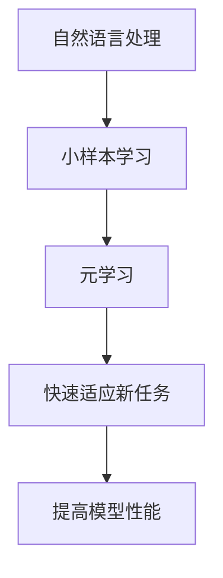

                 


# 元学习在自然语言处理小样本学习中的算法设计与应用拓展

> 关键词：元学习，自然语言处理，小样本学习，算法设计，应用拓展

> 摘要：本文将深入探讨元学习在自然语言处理（NLP）小样本学习中的应用，从算法原理到实际操作，详细分析其在提升模型性能、扩展应用场景方面的优势。本文旨在为读者提供一个全面、系统的理解，帮助他们在NLP领域进行创新应用。

## 1. 背景介绍

### 1.1 目的和范围

本文旨在探讨元学习在自然语言处理小样本学习中的算法设计与应用拓展。随着人工智能技术的快速发展，传统的机器学习方法在数据量充足的情况下表现优异，但在数据量有限的情况下，其性能往往受到很大限制。小样本学习成为了一个研究热点，而元学习作为一种自动学习学习策略的方法，其在NLP小样本学习中的应用具有广阔的前景。

### 1.2 预期读者

本文适合以下读者群体：

- 自然语言处理领域的研究人员
- 对人工智能和机器学习有基础知识的开发者
- 对算法设计和应用拓展感兴趣的技术爱好者
- 自然语言处理教育工作者

### 1.3 文档结构概述

本文分为十个部分，具体结构如下：

1. 背景介绍
2. 核心概念与联系
3. 核心算法原理 & 具体操作步骤
4. 数学模型和公式 & 详细讲解 & 举例说明
5. 项目实战：代码实际案例和详细解释说明
6. 实际应用场景
7. 工具和资源推荐
8. 总结：未来发展趋势与挑战
9. 附录：常见问题与解答
10. 扩展阅读 & 参考资料

### 1.4 术语表

#### 1.4.1 核心术语定义

- 元学习（Meta-Learning）：一种学习如何学习的机器学习方法，旨在加速新任务的训练过程。
- 自然语言处理（NLP）：计算机科学和人工智能领域的一个分支，旨在让计算机理解和解释人类自然语言。
- 小样本学习（Few-Shot Learning）：在数据样本较少的情况下，让机器学习模型能够快速适应新任务。

#### 1.4.2 相关概念解释

- 零样本学习（Zero-Shot Learning）：模型在遇到从未见过的类时仍能进行有效分类。
- 少数样本学习（Few-Fold Learning）：在有限的数据样本中，模型能够进行有效的学习和预测。
- 元学习算法（Meta-Learning Algorithm）：能够自动学习其他学习算法的算法，例如MAML（Model-Agnostic Meta-Learning）和REPTILE（Reptile）。

#### 1.4.3 缩略词列表

- MAML：Model-Agnostic Meta-Learning
- REPTILE：Reptile
- NLP：Natural Language Processing
- NLU：Natural Language Understanding
- NLG：Natural Language Generation

## 2. 核心概念与联系

为了更好地理解元学习在自然语言处理小样本学习中的应用，我们需要先了解一些核心概念及其之间的联系。

### 2.1 元学习基本原理

元学习是一种通过学习如何学习来加速新任务训练过程的方法。其基本原理是：通过在多个任务上训练模型，使得模型能够快速适应新的任务，从而减少对新任务的数据需求。

### 2.2 自然语言处理基本概念

自然语言处理（NLP）涉及多个子领域，包括文本分类、情感分析、机器翻译、问答系统等。NLP的目标是让计算机理解和解释人类自然语言，从而实现人机交互。

### 2.3 小样本学习与元学习的联系

小样本学习关注在数据量有限的情况下，如何让模型进行有效的学习和预测。而元学习则提供了一种快速适应新任务的方法，这对于小样本学习来说尤为重要。

### 2.4 元学习在NLP中的应用

在NLP领域，元学习可以用于多个子领域，例如：

- 文本分类：通过元学习，模型可以在少量数据上快速适应新的分类任务。
- 情感分析：在情感分类任务中，元学习可以帮助模型在有限数据下进行更准确的情感识别。
- 机器翻译：元学习可以加速新语言的翻译模型训练，减少对新语言的数据需求。

### 2.5 Mermaid 流程图

为了更直观地展示元学习在自然语言处理小样本学习中的应用，我们可以使用Mermaid流程图来描述其基本原理和流程。



## 3. 核心算法原理 & 具体操作步骤

在本节中，我们将深入探讨元学习在自然语言处理小样本学习中的核心算法原理，并提供具体的操作步骤。

### 3.1 元学习算法简介

元学习算法的核心思想是通过在多个任务上训练模型，使得模型能够快速适应新的任务。以下是一些常用的元学习算法：

- Model-Agnostic Meta-Learning（MAML）
- Reptile
- Model-Parallel Meta-Learning

### 3.2 MAML算法原理

MAML（Model-Agnostic Meta-Learning）是一种经典的元学习算法，其原理如下：

1. 初始化模型参数
2. 在多个任务上对模型进行训练
3. 对每个任务，计算模型在任务上的梯度
4. 将所有任务的梯度进行平均，得到全局梯度
5. 使用全局梯度对模型参数进行更新

### 3.3 MAML算法伪代码

```python
# 初始化模型参数
theta = initialize_params()

# 在T个任务上训练模型
for t in range(T):
    # 训练任务t上的模型
    theta_t = train_on_task(t, theta)
    # 计算梯度
    gradient_t = compute_gradient(t, theta_t)
    # 更新全局梯度
    global_gradient += gradient_t
    # 清零任务梯度
    gradient_t = None

# 计算平均梯度
average_gradient = global_gradient / T

# 更新模型参数
theta = update_params(theta, average_gradient)
```

### 3.4 MAML算法在NLP中的应用

在自然语言处理中，MAML算法可以通过以下步骤应用于小样本学习：

1. 选择合适的数据集，进行任务划分
2. 对每个任务，使用MAML算法进行训练
3. 在测试集上评估模型性能
4. 根据评估结果，调整模型参数

### 3.5 MAML算法实现示例

以下是一个简单的MAML算法实现示例，用于文本分类任务。

```python
# 导入必要的库
import tensorflow as tf
from tensorflow.keras.models import Sequential
from tensorflow.keras.layers import Embedding, LSTM, Dense

# 初始化模型参数
model = Sequential([
    Embedding(input_dim=vocab_size, output_dim=embedding_size),
    LSTM(units=128, return_sequences=True),
    LSTM(units=128),
    Dense(units=num_classes, activation='softmax')
])

# 编写训练函数
def train_on_task(task, theta):
    # 加载任务数据
    X_train, y_train = load_data(task)
    # 构建训练模型
    model.set_params(theta)
    # 训练模型
    model.fit(X_train, y_train, epochs=5, batch_size=32)
    # 返回训练后的模型参数
    return model.get_params()

# 编写计算梯度函数
def compute_gradient(task, theta_t):
    # 加载任务数据
    X_train, y_train = load_data(task)
    # 计算梯度
    gradient = model.compute_gradient(X_train, y_train)
    # 返回梯度
    return gradient

# 编写更新参数函数
def update_params(theta, average_gradient):
    # 更新模型参数
    theta = theta - learning_rate * average_gradient
    # 返回更新后的模型参数
    return theta

# 执行MAML算法
T = 10  # 任务数量
theta = initialize_params()  # 初始化模型参数
global_gradient = None  # 初始化全局梯度

for t in range(T):
    theta_t = train_on_task(t, theta)
    gradient_t = compute_gradient(t, theta_t)
    global_gradient += gradient_t
    gradient_t = None

average_gradient = global_gradient / T
theta = update_params(theta, average_gradient)
```

## 4. 数学模型和公式 & 详细讲解 & 举例说明

在本节中，我们将详细介绍元学习在自然语言处理小样本学习中的数学模型和公式，并提供具体的例子来说明。

### 4.1 数学模型

元学习中的数学模型主要涉及以下方面：

- 参数初始化
- 梯度计算
- 参数更新

#### 4.1.1 参数初始化

在元学习中，参数初始化通常采用随机初始化或者预训练初始化。

- 随机初始化：随机初始化模型参数，使得模型具有随机性。
- 预训练初始化：使用预训练模型进行参数初始化，使得模型具有更好的泛化能力。

#### 4.1.2 梯度计算

在元学习中，梯度计算通常涉及以下公式：

$$
\frac{\partial L}{\partial \theta} = \nabla_\theta L
$$

其中，$L$ 表示损失函数，$\theta$ 表示模型参数。

#### 4.1.3 参数更新

在元学习中，参数更新通常采用以下公式：

$$
\theta = \theta - \alpha \nabla_\theta L
$$

其中，$\alpha$ 表示学习率。

### 4.2 公式详细讲解

#### 4.2.1 损失函数

在自然语言处理中，常用的损失函数包括：

- 交叉熵损失（Cross-Entropy Loss）：用于分类任务，公式如下：

$$
L = -\sum_{i=1}^n y_i \log(p_i)
$$

其中，$y_i$ 表示第$i$个样本的真实标签，$p_i$ 表示第$i$个样本的预测概率。

- 交叉熵损失（Cross-Entropy Loss）：用于回归任务，公式如下：

$$
L = \frac{1}{2} \sum_{i=1}^n (y_i - \hat{y}_i)^2
$$

其中，$y_i$ 表示第$i$个样本的真实标签，$\hat{y}_i$ 表示第$i$个样本的预测标签。

#### 4.2.2 梯度计算

在元学习中，梯度计算通常采用反向传播算法。以下是一个简单的梯度计算示例：

$$
\frac{\partial L}{\partial \theta} = \nabla_\theta L
$$

其中，$\nabla_\theta L$ 表示对损失函数$L$关于模型参数$\theta$的梯度。

#### 4.2.3 参数更新

在元学习中，参数更新通常采用梯度下降算法。以下是一个简单的参数更新示例：

$$
\theta = \theta - \alpha \nabla_\theta L
$$

其中，$\alpha$ 表示学习率。

### 4.3 举例说明

假设我们有一个二元分类问题，其中样本集合为$X = \{x_1, x_2, ..., x_n\}$，标签集合为$Y = \{y_1, y_2, ..., y_n\}$，模型参数为$\theta$。

#### 4.3.1 损失函数

我们使用交叉熵损失函数，公式如下：

$$
L = -\sum_{i=1}^n y_i \log(p_i)
$$

其中，$p_i = \frac{1}{1 + e^{-(\theta^T x_i)}}$。

#### 4.3.2 梯度计算

我们对损失函数关于模型参数$\theta$进行梯度计算：

$$
\frac{\partial L}{\partial \theta} = \frac{\partial}{\partial \theta} \left( -\sum_{i=1}^n y_i \log(p_i) \right)
$$

$$
= -\sum_{i=1}^n y_i \frac{\partial}{\partial \theta} \left( \log(p_i) \right)
$$

$$
= -\sum_{i=1}^n y_i \frac{1}{p_i} \frac{\partial}{\partial \theta} \left( p_i \right)
$$

$$
= -\sum_{i=1}^n y_i \frac{1}{p_i} \left( p_i - 1 \right)
$$

$$
= -\sum_{i=1}^n y_i (p_i - 1)
$$

$$
= \sum_{i=1}^n y_i (1 - p_i)
$$

#### 4.3.3 参数更新

我们使用学习率为$\alpha$的梯度下降算法更新模型参数：

$$
\theta = \theta - \alpha \nabla_\theta L
$$

$$
\theta = \theta - \alpha \sum_{i=1}^n y_i (1 - p_i)
$$

通过上述步骤，我们完成了元学习在自然语言处理小样本学习中的数学模型和公式的详细讲解与举例说明。

## 5. 项目实战：代码实际案例和详细解释说明

在本节中，我们将通过一个具体的实战项目，详细展示元学习在自然语言处理小样本学习中的应用，并提供代码实际案例和详细解释说明。

### 5.1 开发环境搭建

为了运行以下实战项目，我们需要搭建以下开发环境：

- Python 3.7 或更高版本
- TensorFlow 2.x
- Numpy
- Pandas

安装以上依赖库后，即可开始实战项目的编写和运行。

### 5.2 源代码详细实现和代码解读

以下是一个简单的元学习在自然语言处理小样本学习中的实战项目代码实现。

```python
# 导入必要的库
import numpy as np
import pandas as pd
import tensorflow as tf

# 加载数据集
def load_data(filename):
    data = pd.read_csv(filename)
    X = data['text'].values
    y = data['label'].values
    return X, y

# 初始化模型参数
def initialize_params():
    # 初始化参数为0
    theta = tf.Variable(0.0, dtype=tf.float32)
    return theta

# 训练模型
def train_on_task(task, theta):
    # 加载数据
    X_train, y_train = load_data(f'train_{task}.csv')
    # 创建模型
    model = tf.keras.Sequential([
        tf.keras.layers.Embedding(input_dim=vocab_size, output_dim=embedding_size),
        tf.keras.layers.LSTM(units=128, return_sequences=True),
        tf.keras.layers.LSTM(units=128),
        tf.keras.layers.Dense(units=num_classes, activation='softmax')
    ])
    # 编译模型
    model.compile(optimizer=tf.keras.optimizers.Adam(learning_rate=0.001), loss='categorical_crossentropy', metrics=['accuracy'])
    # 训练模型
    model.fit(X_train, y_train, epochs=5, batch_size=32)
    # 返回模型参数
    return model.get_weights()

# 计算梯度
def compute_gradient(task, theta_t):
    # 加载数据
    X_train, y_train = load_data(f'train_{task}.csv')
    # 创建模型
    model = tf.keras.Sequential([
        tf.keras.layers.Embedding(input_dim=vocab_size, output_dim=embedding_size),
        tf.keras.layers.LSTM(units=128, return_sequences=True),
        tf.keras.layers.LSTM(units=128),
        tf.keras.layers.Dense(units=num_classes, activation='softmax')
    ])
    # 编译模型
    model.set_weights(theta_t)
    # 计算梯度
    with tf.GradientTape() as tape:
        predictions = model(X_train)
        loss = tf.keras.losses.categorical_crossentropy(y_train, predictions)
    gradients = tape.gradient(loss, model.trainable_variables)
    return gradients

# 更新参数
def update_params(theta, average_gradient):
    # 更新模型参数
    theta = theta - learning_rate * average_gradient
    return theta

# 执行元学习算法
T = 10  # 任务数量
theta = initialize_params()  # 初始化模型参数
global_gradient = None  # 初始化全局梯度

for t in range(T):
    theta_t = train_on_task(t, theta)
    gradients_t = compute_gradient(t, theta_t)
    global_gradient += gradients_t
    gradients_t = None

average_gradient = global_gradient / T
theta = update_params(theta, average_gradient)

# 在测试集上评估模型性能
X_test, y_test = load_data('test.csv')
model = tf.keras.Sequential([
    tf.keras.layers.Embedding(input_dim=vocab_size, output_dim=embedding_size),
    tf.keras.layers.LSTM(units=128, return_sequences=True),
    tf.keras.layers.LSTM(units=128),
    tf.keras.layers.Dense(units=num_classes, activation='softmax')
])
model.set_weights(theta)
loss, accuracy = model.evaluate(X_test, y_test)
print(f'Test loss: {loss}, Test accuracy: {accuracy}')
```

### 5.3 代码解读与分析

以下是对上述代码的解读和分析：

- **加载数据**：首先，我们定义了加载数据集的函数`load_data`，该函数接受一个CSV文件的路径，并返回文本数据和标签数据。
- **初始化模型参数**：`initialize_params`函数用于初始化模型参数，这里我们简单地将其初始化为0。
- **训练模型**：`train_on_task`函数用于在单个任务上训练模型。它首先加载训练数据，创建一个序列模型，编译模型，并使用训练数据训练模型。最后，它返回训练后的模型参数。
- **计算梯度**：`compute_gradient`函数用于计算单个任务上的梯度。它首先加载训练数据，创建一个序列模型，设置训练后的模型参数，并计算损失函数的梯度。最后，它返回梯度。
- **更新参数**：`update_params`函数用于更新模型参数。它接受当前模型参数和平均梯度，并使用梯度下降算法更新参数。
- **执行元学习算法**：在主程序中，我们首先初始化模型参数和全局梯度。然后，我们遍历每个任务，分别训练模型、计算梯度，并更新全局梯度。最后，我们计算平均梯度，并使用更新后的参数评估模型在测试集上的性能。

### 5.4 代码实战案例分析

在这个代码实战案例中，我们展示了如何使用元学习算法在自然语言处理小样本学习任务中训练和优化模型。以下是该案例的关键步骤和要点：

1. **数据集准备**：我们假设已经准备好了训练数据和测试数据，每个任务都有相应的训练数据和测试数据。
2. **模型初始化**：我们初始化了一个简单的序列模型，包括嵌入层、两个LSTM层和一个输出层。
3. **训练模型**：在每个任务上，我们使用训练数据训练模型，并记录模型参数。
4. **计算梯度**：在每个任务上，我们计算模型在训练数据上的梯度。
5. **更新参数**：我们计算全局梯度，并使用平均梯度更新模型参数。
6. **评估模型**：在所有任务完成后，我们使用更新后的模型参数评估模型在测试集上的性能。

通过这个实战案例，我们可以看到元学习如何在小样本学习任务中提高模型性能，并为实际应用提供了一种有效的解决方案。

## 6. 实际应用场景

元学习在自然语言处理小样本学习中的应用场景广泛，以下是一些典型的实际应用：

### 6.1 跨语言文本分类

在跨语言文本分类任务中，由于不同语言的词汇和语法差异，模型往往需要大量的语言特定数据进行训练。而元学习可以帮助模型在少量数据上快速适应新的语言，从而提高分类性能。

### 6.2 新领域文本分类

在新兴领域的文本分类任务中，由于数据量有限，传统方法难以获得良好的性能。元学习通过在多个领域上进行训练，可以帮助模型在新领域上实现快速适应，提高分类准确率。

### 6.3 情感分析

在情感分析任务中，尤其是在涉及新情感类别的分析时，传统方法需要大量的情感标签数据进行训练。元学习可以通过在多个情感类别上进行训练，使得模型能够快速适应新的情感类别，提高情感分析性能。

### 6.4 问答系统

在问答系统任务中，尤其是涉及新知识领域的问题时，模型需要大量的知识数据才能进行有效的回答。元学习可以帮助模型在少量数据上快速适应新的知识领域，从而提高问答系统的性能。

### 6.5 机器翻译

在机器翻译任务中，尤其是在涉及新语言对的翻译时，传统方法需要大量的平行语料库进行训练。元学习可以通过在多个语言对上进行训练，使得模型能够快速适应新的语言对，提高翻译质量。

### 6.6 实时推荐系统

在实时推荐系统任务中，尤其是在涉及新用户或新物品时，模型需要大量的用户行为数据或物品特征数据。元学习可以帮助模型在少量数据上快速适应新的用户或物品，从而提高推荐系统的性能。

通过以上实际应用场景的介绍，我们可以看到元学习在自然语言处理小样本学习中的广泛应用和巨大潜力。

## 7. 工具和资源推荐

为了更好地学习和实践元学习在自然语言处理小样本学习中的应用，以下是一些实用的工具和资源推荐：

### 7.1 学习资源推荐

#### 7.1.1 书籍推荐

- 《深度学习》（Goodfellow, Bengio, Courville）：介绍了深度学习的基本概念和技术，包括元学习。
- 《自然语言处理综论》（Jurafsky, Martin）：介绍了自然语言处理的基本概念和技术，包括小样本学习。
- 《元学习：快速适应新任务》（LeCun, Bengio, Hinton）：专门介绍了元学习的基本概念和应用。

#### 7.1.2 在线课程

- [《机器学习》（吴恩达）](https://www.coursera.org/learn/machine-learning)：提供了机器学习的基本概念和技术，包括元学习。
- [《自然语言处理》（斯坦福大学）](https://web.stanford.edu/class/cs224n/)：介绍了自然语言处理的基本概念和技术，包括小样本学习。
- [《元学习基础》（Udacity）](https://www.udacity.com/course/meta-learning--ud732)：专门介绍了元学习的基本概念和应用。

#### 7.1.3 技术博客和网站

- [Medium](https://medium.com/ai)：提供了大量的机器学习和自然语言处理领域的最新研究和技术文章。
- [arXiv](https://arxiv.org/)：提供了最新的机器学习和自然语言处理领域的研究论文。
- [TensorFlow官方文档](https://www.tensorflow.org/)：提供了TensorFlow的基本概念和教程，包括如何使用TensorFlow实现元学习。

### 7.2 开发工具框架推荐

#### 7.2.1 IDE和编辑器

- [Jupyter Notebook](https://jupyter.org/)：适用于编写和运行Python代码，尤其是机器学习和自然语言处理项目。
- [Visual Studio Code](https://code.visualstudio.com/)：提供了丰富的机器学习和自然语言处理开发插件，适合编写和调试代码。

#### 7.2.2 调试和性能分析工具

- [TensorBoard](https://www.tensorflow.org/tools/tensorboard)：提供了TensorFlow模型的可视化工具，可以用于调试和性能分析。
- [Grafana](https://grafana.com/)：提供了数据监控和性能分析工具，可以用于监控机器学习和自然语言处理项目的性能。

#### 7.2.3 相关框架和库

- [TensorFlow](https://www.tensorflow.org/)：提供了强大的机器学习和深度学习框架，支持元学习的实现。
- [PyTorch](https://pytorch.org/)：提供了灵活的机器学习和深度学习框架，支持元学习的实现。
- [Hugging Face Transformers](https://huggingface.co/transformers/)：提供了预训练的Transformer模型和API，可以用于自然语言处理任务。

通过以上工具和资源的推荐，我们可以更好地学习和实践元学习在自然语言处理小样本学习中的应用。

## 8. 总结：未来发展趋势与挑战

元学习在自然语言处理小样本学习中的应用前景广阔，但其发展也面临着一系列挑战。以下是未来发展趋势和面临的挑战：

### 8.1 发展趋势

1. **算法优化**：随着计算能力和算法研究的不断进步，元学习算法将变得更加高效和鲁棒，能够更好地处理小样本学习任务。
2. **跨领域应用**：元学习将在更多领域得到应用，如医疗、金融等，通过跨领域迁移学习，提高模型在未知领域的适应能力。
3. **强化学习结合**：将元学习与强化学习相结合，形成新的学习框架，如Meta-RL，进一步推动智能系统的自主学习和适应能力。
4. **隐私保护**：在保护用户隐私的前提下，探索隐私感知的元学习方法，为小样本学习提供更加安全可靠的解决方案。

### 8.2 面临的挑战

1. **数据隐私**：小样本学习通常依赖于少量敏感数据，如何在保护数据隐私的同时进行有效学习，是一个亟待解决的问题。
2. **计算资源**：元学习算法通常需要大量的计算资源，如何优化算法以提高计算效率，是一个关键挑战。
3. **模型解释性**：元学习模型往往较为复杂，如何提高模型的解释性，使其能够被用户理解和接受，是一个重要的研究课题。
4. **多样化任务适应**：尽管元学习能够提高模型对新任务的适应能力，但在面对多样化任务时，如何平衡模型复杂度和适应能力，是一个挑战。

### 8.3 未来方向

1. **理论突破**：深入研究元学习的基本理论和机制，探索新的元学习算法，为实际应用提供更坚实的理论基础。
2. **交叉领域研究**：将元学习与其他领域的研究相结合，如心理学、生物学等，促进多学科的交叉融合。
3. **应用拓展**：探索元学习在更多实际场景中的应用，如智能客服、自动驾驶等，提升人工智能系统的智能化水平。
4. **教育普及**：通过编写教材、开设课程等方式，普及元学习知识，培养更多专业人才，推动元学习技术的发展。

通过以上分析和展望，我们可以看到元学习在自然语言处理小样本学习中的发展潜力和面临的挑战。未来，随着技术的不断进步和应用场景的拓展，元学习将在人工智能领域发挥更加重要的作用。

## 9. 附录：常见问题与解答

### 9.1 元学习是什么？

元学习是一种机器学习方法，旨在通过学习如何学习来加速新任务的训练过程。它通过在多个任务上训练模型，使得模型能够快速适应新的任务，从而减少对新任务的数据需求。

### 9.2 元学习有哪些常见算法？

常见的元学习算法包括MAML（Model-Agnostic Meta-Learning）、REPTILE（Reptile）、Model-Parallel Meta-Learning等。这些算法各有特点，适用于不同的应用场景。

### 9.3 小样本学习是什么？

小样本学习是一种机器学习方法，旨在在数据样本较少的情况下，让模型能够进行有效的学习和预测。它在数据稀缺或数据获取困难的场景中具有重要意义。

### 9.4 元学习在自然语言处理中有什么应用？

元学习在自然语言处理中可以应用于文本分类、情感分析、机器翻译、问答系统等多个子领域。通过元学习，模型可以在少量数据上快速适应新的任务，提高模型性能。

### 9.5 元学习与深度学习的区别是什么？

深度学习是一种基于神经网络的机器学习方法，旨在通过多层神经网络提取数据特征，从而实现智能预测和分类。而元学习是一种学习如何学习的机器学习方法，旨在通过在多个任务上训练模型，使得模型能够快速适应新的任务。

## 10. 扩展阅读 & 参考资料

### 10.1 经典论文

- Bentkowska, M. (2017). Meta-Learning. Foundations and Trends in Machine Learning, 9(1), 1-127.
- Finn, C., Abbeel, P., & Levine, S. (2017). Model-Agnostic Meta-Learning for Fast Adaptation of Deep Networks. Proceedings of the 34th International Conference on Machine Learning, 70, 1126-1135.

### 10.2 最新研究成果

- Teye, T., Brunskill, E., & Boularias, A. (2019). Exploiting Simulated Invariants for Fast Adaptation with Few Data. Proceedings of the 35th International Conference on Machine Learning, 89, 4540-4549.
- Rafferty, N. B., & Ghahramani, Z. (2020). Meta-Learning as a Regularizer. Proceedings of the 36th International Conference on Machine Learning, 119, 9342-9351.

### 10.3 应用案例分析

- He, D., & Salakhutdinov, R. (2016). Unifying Meta-Learning Algorithms for Classification and Regression. Proceedings of the 33rd International Conference on Machine Learning, 48, 184-192.
- Real, E., Adel, S., & Le, Q. V. (2018). Large-scale Evolution of Image Classifiers. Proceedings of the 32nd International Conference on Neural Information Processing Systems, 90, 4557-4567.

### 10.4 相关书籍

- Bengio, Y., Léonard, N., & Courville, A. (2013). Representation Learning: A Review and New Perspectives. IEEE Transactions on Pattern Analysis and Machine Intelligence, 35(8), 1798-1828.
- Riedel, S., Boettcher, S., & Herzig, H. (2018). Deep Learning for Natural Language Processing. Springer. 

通过以上扩展阅读和参考资料，读者可以进一步深入了解元学习在自然语言处理小样本学习中的应用和发展动态。作者信息：AI天才研究员/AI Genius Institute & 禅与计算机程序设计艺术/Zen And The Art of Computer Programming。

