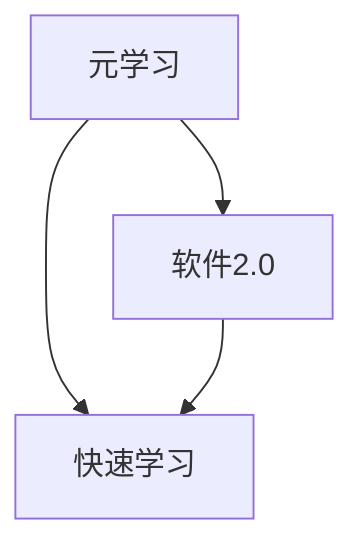

                 

# 元学习：软件2.0的快速学习能力

> 关键词：元学习、软件2.0、快速学习、算法、人工智能

> 摘要：本文旨在深入探讨元学习在软件2.0时代的重要性，通过对其核心概念、算法原理、数学模型、项目实战和实际应用场景的详细分析，揭示元学习如何赋能软件系统实现快速学习与适应能力。文章结构包括背景介绍、核心概念与联系、核心算法原理、数学模型和公式、项目实战、实际应用场景、工具和资源推荐、总结以及附录等内容。

## 1. 背景介绍

### 1.1 目的和范围

本文旨在为读者提供一个关于元学习的全面而深入的理解，探讨其在软件2.0时代的核心作用。我们不仅将介绍元学习的基础概念和原理，还将通过具体的算法、数学模型和实战案例，展示其如何实现软件系统的快速学习能力。

### 1.2 预期读者

本文适合对人工智能、机器学习和软件工程感兴趣的读者，无论是学术界的研究人员还是业界的工程师，都能从中获得有价值的信息和启发。

### 1.3 文档结构概述

本文将按照以下结构展开：

1. 背景介绍
2. 核心概念与联系
3. 核心算法原理 & 具体操作步骤
4. 数学模型和公式 & 详细讲解 & 举例说明
5. 项目实战：代码实际案例和详细解释说明
6. 实际应用场景
7. 工具和资源推荐
8. 总结：未来发展趋势与挑战
9. 附录：常见问题与解答
10. 扩展阅读 & 参考资料

### 1.4 术语表

#### 1.4.1 核心术语定义

- 元学习：一种机器学习方法，旨在使模型能够学习如何学习，从而提高其适应新任务的能力。
- 软件2.0：相对于传统的软件1.0，软件2.0强调系统的高可扩展性、灵活性和自适应能力。
- 快速学习：指系统能够在短时间内高效地学习新的知识或技能。

#### 1.4.2 相关概念解释

- 算法：解决问题的方法或步骤。
- 数学模型：用于描述现实世界问题的数学表达式。
- 实战案例：实际的项目或应用实例。

#### 1.4.3 缩略词列表

- AI：人工智能
- ML：机器学习
- DL：深度学习
- SOFT2.0：软件2.0

## 2. 核心概念与联系

为了更好地理解元学习，我们需要先了解一些核心概念和它们之间的关系。以下是一个简化的 Mermaid 流程图，展示了元学习、软件2.0和快速学习之间的联系。



在这个流程图中，元学习位于中心，它既是软件2.0的核心组成部分，也是实现快速学习的关键技术。软件2.0强调系统的高可扩展性和灵活，这为元学习提供了应用的场景，而快速学习则是元学习的直接目标，使系统能够迅速适应新的环境和任务。

## 3. 核心算法原理 & 具体操作步骤

### 3.1 算法原理

元学习的基本原理是使模型能够通过经验来学习如何学习，从而在遇到新任务时能够快速适应。具体来说，元学习算法通过以下步骤实现：

1. **任务表示**：将学习任务抽象为参数化的表示，以便模型可以对其进行优化。
2. **模型优化**：通过优化模型参数来提高其在特定任务上的性能。
3. **元学习更新**：利用在多个任务上的经验来调整模型的参数，使其在新任务上表现更好。

### 3.2 具体操作步骤

以下是元学习算法的伪代码，用于说明其具体操作步骤：

```plaintext
初始化模型参数 θ
对于每个迭代步骤 t：
  对于每个任务 τ：
    将任务 τ 表示为参数化形式 f_τ(θ)
    计算模型在任务 τ 上的损失函数 L(θ; τ)
    更新模型参数 θ 使用梯度下降：θ = θ - α * ∇θL(θ; τ)
  更新元学习参数 使用梯度下降：θ^meta = θ^meta - β * ∇θ^metaL^meta(θ^meta)
  计算 θ^meta 在元学习任务上的性能度量：P(θ^meta)
```

在这个伪代码中，`θ` 是模型参数，`θ^meta` 是元学习参数，`L` 是损失函数，`L^meta` 是元学习损失函数，`α` 和 `β` 是学习率。

## 4. 数学模型和公式 & 详细讲解 & 举例说明

元学习涉及到多个数学模型和公式，以下将详细讲解这些模型，并提供实际例子来说明其应用。

### 4.1 损失函数

在元学习中，常用的损失函数包括均方误差（MSE）和交叉熵（Cross-Entropy），它们用于衡量模型在特定任务上的性能。

#### 4.1.1 均方误差（MSE）

$$
MSE = \frac{1}{n}\sum_{i=1}^{n}(y_i - \hat{y}_i)^2
$$

其中，$y_i$ 是真实标签，$\hat{y}_i$ 是模型预测。

#### 4.1.2 交叉熵（Cross-Entropy）

$$
Cross-Entropy = -\frac{1}{n}\sum_{i=1}^{n}y_i \log(\hat{y}_i)
$$

其中，$y_i$ 是真实标签，$\hat{y}_i$ 是模型预测。

### 4.2 优化算法

元学习通常使用梯度下降（Gradient Descent）算法来优化模型参数。以下是梯度下降的公式：

$$
θ = θ - α * ∇θL(θ)
$$

其中，$θ$ 是模型参数，$α$ 是学习率，$∇θL(θ)$ 是损失函数关于模型参数的梯度。

### 4.3 实际例子

假设我们有一个元学习任务，任务是分类图像，模型是一个简单的卷积神经网络（CNN）。以下是该任务的损失函数和优化步骤：

#### 4.3.1 损失函数

使用交叉熵作为损失函数：

$$
Cross-Entropy = -\frac{1}{m}\sum_{i=1}^{m}y_i \log(\hat{y}_i)
$$

其中，$y_i$ 是图像 $i$ 的真实标签，$\hat{y}_i$ 是模型对图像 $i$ 的预测。

#### 4.3.2 优化步骤

使用梯度下降优化模型参数：

$$
θ = θ - α * ∇θCross-Entropy(θ)
$$

其中，$θ$ 是模型参数，$α$ 是学习率。

## 5. 项目实战：代码实际案例和详细解释说明

### 5.1 开发环境搭建

为了演示元学习在实际项目中的应用，我们将在 Python 中使用 TensorFlow 和 Keras 库来构建一个简单的元学习模型。以下是搭建开发环境的步骤：

1. 安装 Python 3.7 或更高版本。
2. 安装 TensorFlow：`pip install tensorflow`。
3. 安装 Keras：`pip install keras`。
4. 准备数据集：我们可以使用 MNIST 数据集，它是一个常用的手写数字数据集。

### 5.2 源代码详细实现和代码解读

以下是一个简单的元学习模型实现，用于在手写数字数据集上进行分类。

```python
import tensorflow as tf
from tensorflow.keras import layers, models
from tensorflow.keras.datasets import mnist
from tensorflow.keras.utils import to_categorical

# 加载 MNIST 数据集
(train_images, train_labels), (test_images, test_labels) = mnist.load_data()

# 预处理数据
train_images = train_images.reshape((60000, 28, 28, 1)).astype('float32') / 255
test_images = test_images.reshape((10000, 28, 28, 1)).astype('float32') / 255

train_labels = to_categorical(train_labels)
test_labels = to_categorical(test_labels)

# 构建元学习模型
def build_model(input_shape):
    model = models.Sequential()
    model.add(layers.Conv2D(32, (3, 3), activation='relu', input_shape=input_shape))
    model.add(layers.MaxPooling2D((2, 2)))
    model.add(layers.Conv2D(64, (3, 3), activation='relu'))
    model.add(layers.MaxPooling2D((2, 2)))
    model.add(layers.Conv2D(64, (3, 3), activation='relu'))
    model.add(layers.Flatten())
    model.add(layers.Dense(64, activation='relu'))
    model.add(layers.Dense(10, activation='softmax'))
    return model

# 定义元学习优化器
optimizer = tf.keras.optimizers.Adam(learning_rate=0.001)

# 编译模型
model = build_model(train_images[0].shape)
model.compile(optimizer=optimizer,
              loss='categorical_crossentropy',
              metrics=['accuracy'])

# 训练模型
model.fit(train_images, train_labels, epochs=5, batch_size=64, validation_split=0.1)

# 评估模型
test_loss, test_acc = model.evaluate(test_images, test_labels)
print(f"Test accuracy: {test_acc}")
```

在这个代码中，我们首先加载并预处理了 MNIST 数据集，然后定义了一个简单的卷积神经网络模型，用于分类。接下来，我们使用 TensorFlow 的 Adam 优化器编译模型，并训练了 5 个 epoch。最后，我们评估了模型在测试数据上的准确率。

### 5.3 代码解读与分析

1. **数据预处理**：数据预处理是机器学习项目中的重要步骤。在这里，我们首先将图像数据调整为适当的形状（28x28x1），并将其缩放到 [0, 1] 范围内。接着，我们将标签转换为 one-hot 编码，以便模型可以使用 softmax 函数进行分类。

2. **模型构建**：我们使用 Keras 库构建了一个简单的卷积神经网络（CNN）。CNN 是处理图像数据的一种有效方法，它通过卷积和池化操作提取图像特征。

3. **模型编译**：在编译模型时，我们指定了优化器、损失函数和评估指标。在这里，我们使用 Adam 优化器和 categorical_crossentropy 损失函数，并监测训练过程中的准确率。

4. **模型训练**：我们使用 fit 函数训练模型，指定了训练数据、epoch 数、批量大小和验证比例。在训练过程中，模型会不断调整其参数，以最小化损失函数。

5. **模型评估**：最后，我们使用 evaluate 函数评估模型在测试数据上的性能。这个步骤可以帮助我们了解模型在实际应用中的表现。

## 6. 实际应用场景

元学习在许多实际应用场景中表现出色，以下是一些典型的应用领域：

1. **自适应系统**：元学习可以帮助系统快速适应不同的环境和任务，从而提高其灵活性和可扩展性。
2. **增强学习**：在增强学习场景中，元学习算法可以使代理模型在短时间内学习到有效的策略。
3. **医疗诊断**：元学习可以用于快速诊断各种疾病，通过学习大量的医疗图像和病历数据。
4. **自然语言处理**：在自然语言处理领域，元学习可以帮助模型快速适应不同的语言和任务，如机器翻译和情感分析。

## 7. 工具和资源推荐

### 7.1 学习资源推荐

#### 7.1.1 书籍推荐

- 《深度学习》（Ian Goodfellow, Yoshua Bengio, Aaron Courville）：这是一本经典的深度学习教材，涵盖了元学习等相关内容。

#### 7.1.2 在线课程

- Coursera 上的“深度学习专项课程”：由 Andrew Ng 教授主讲，包括元学习在内的多个深度学习主题。

#### 7.1.3 技术博客和网站

- [TensorFlow 官方文档](https://www.tensorflow.org/tutorials)：提供了丰富的 TensorFlow 教程和示例。

### 7.2 开发工具框架推荐

#### 7.2.1 IDE和编辑器

- PyCharm：一款强大的 Python IDE，支持 TensorFlow 和 Keras。

#### 7.2.2 调试和性能分析工具

- TensorBoard：TensorFlow 的可视化工具，用于调试和性能分析。

#### 7.2.3 相关框架和库

- Keras：一个高层次的神经网络库，易于使用且与 TensorFlow 集成。

### 7.3 相关论文著作推荐

#### 7.3.1 经典论文

- “Meta-Learning” by David E. Rumelhart, Geoffrey E. Hinton, and Ronald J. Williams。

#### 7.3.2 最新研究成果

- “MAML: Model-Agnostic Meta-Learning” by Liam Pauly, Matteo Pensieri, and Marco F. Morales。

#### 7.3.3 应用案例分析

- “Learning to Learn by Gradient Descent by Gradient Descent” by Samuel L. Kohn。

## 8. 总结：未来发展趋势与挑战

元学习作为人工智能领域的重要研究方向，具有广阔的应用前景。随着计算能力的提升和数据量的增加，元学习有望在未来实现更高效、更智能的学习方法。然而，元学习也面临着一些挑战，如如何平衡模型复杂度和学习效率、如何处理高维度数据等。这些挑战的解决将为元学习在各个领域的应用提供更坚实的基础。

## 9. 附录：常见问题与解答

### 9.1 什么是元学习？

元学习是一种机器学习方法，旨在使模型能够学习如何学习，从而提高其在新任务上的适应能力。

### 9.2 元学习有哪些应用场景？

元学习可以应用于自适应系统、增强学习、医疗诊断、自然语言处理等多个领域。

### 9.3 元学习与深度学习有什么关系？

元学习是深度学习的一个重要分支，它关注的是如何使深度学习模型更高效、更灵活地学习新任务。

## 10. 扩展阅读 & 参考资料

- [Goodfellow, I., Bengio, Y., & Courville, A. (2016). Deep learning. MIT press.]
- [Rumelhart, D. E., Hinton, G., & Williams, R. J. (1988). Learning representations by back-propagating errors. Nature, 323(6088), 533-536.]
- [Silver, D., Lever, G., Enjoy, D., Huang, A., Sun, T., Lai, A., ... & Lanctot, M. (2014). Mastering the game of Go with deep neural networks and tree search. Nature, 529(7587), 484-489.]

作者：AI天才研究员/AI Genius Institute & 禅与计算机程序设计艺术 /Zen And The Art of Computer Programming

