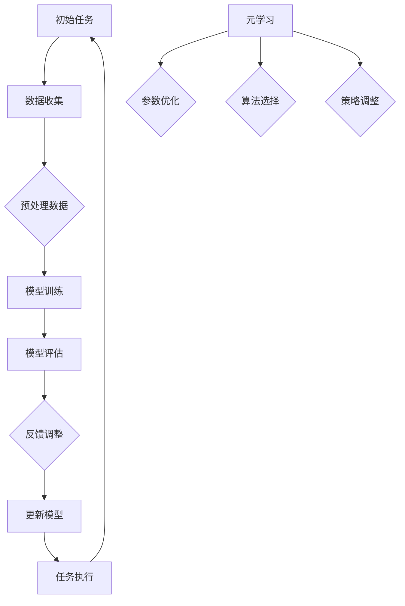

                 

# 元学习：软件2.0的快速学习能力

> **关键词**：元学习、软件2.0、快速学习能力、人工智能、机器学习、算法优化

> **摘要**：本文将深入探讨元学习这一先进的人工智能领域概念，解释其在软件开发中的潜在影响。我们将从背景介绍开始，逐步阐述元学习的基本概念、算法原理、数学模型，并通过实际项目案例和广泛应用场景，展示元学习如何使软件具备快速学习能力，引领软件进入2.0时代。

## 1. 背景介绍

### 1.1 目的和范围

本文旨在介绍元学习这一人工智能领域的核心技术，分析其在软件2.0时代的应用前景，并探讨其如何提升软件的快速学习能力。本文将覆盖以下内容：

- 元学习的定义及其在人工智能领域的重要性。
- 元学习的核心概念和基本原理。
- 元学习算法的数学模型与公式。
- 实际项目中元学习的应用案例。
- 元学习在各个行业的应用前景。

### 1.2 预期读者

本文适合以下读者群体：

- 人工智能领域的科研人员。
- 从事机器学习算法开发的技术人员。
- 对软件开发有深入理解的专业人士。
- 对未来软件开发趋势感兴趣的技术爱好者。

### 1.3 文档结构概述

本文结构如下：

- **第1章**：背景介绍。
- **第2章**：核心概念与联系。
- **第3章**：核心算法原理与具体操作步骤。
- **第4章**：数学模型和公式讲解。
- **第5章**：项目实战：代码实际案例与详细解释说明。
- **第6章**：实际应用场景。
- **第7章**：工具和资源推荐。
- **第8章**：总结：未来发展趋势与挑战。
- **第9章**：附录：常见问题与解答。
- **第10章**：扩展阅读与参考资料。

### 1.4 术语表

#### 1.4.1 核心术语定义

- **元学习**（Meta-Learning）：指学习算法的能力，即学习如何学习。
- **软件2.0**：指基于人工智能技术的下一代软件，具有自我学习和适应能力。
- **快速学习能力**：指软件系统在新的环境中能够迅速适应并完成任务的能力。

#### 1.4.2 相关概念解释

- **机器学习**（Machine Learning）：指使计算机通过数据学习模式，从而进行预测或决策的方法。
- **深度学习**（Deep Learning）：一种机器学习方法，通过多层神经网络进行数据建模。
- **强化学习**（Reinforcement Learning）：通过试错和奖励机制来学习如何在特定环境中做出最佳决策。

#### 1.4.3 缩略词列表

- **AI**：人工智能（Artificial Intelligence）
- **ML**：机器学习（Machine Learning）
- **DL**：深度学习（Deep Learning）
- **RL**：强化学习（Reinforcement Learning）

## 2. 核心概念与联系

元学习是人工智能领域中的一项前沿技术，它关注的是如何使机器学习算法能够更加灵活和高效。下面，我们将通过一个Mermaid流程图来展示元学习的基本概念和原理。



### 2.1 元学习的基本概念

- **初始任务**：元学习开始时，机器学习算法需要明确一个具体的任务，例如分类、预测或控制。
- **数据收集**：收集用于训练的数据集，这些数据集应当能够代表任务的各个可能场景。
- **预处理数据**：对收集到的数据进行清洗、转换和归一化，使其适合机器学习算法处理。
- **模型训练**：使用预处理后的数据集训练机器学习模型，通过优化模型参数来提高其性能。
- **模型评估**：评估训练好的模型在未知数据上的表现，以确定其泛化能力。
- **反馈调整**：根据模型评估结果，调整模型参数或数据预处理策略，以提高模型性能。
- **更新模型**：将调整后的模型参数更新到模型中，以便进行下一次迭代。
- **任务执行**：使用更新后的模型在新的任务环境中执行任务。

### 2.2 元学习与机器学习的区别

与传统的机器学习相比，元学习具有以下几个显著特点：

- **适应性**：元学习算法能够适应不同的任务和数据集，不需要为每个新任务从头开始训练。
- **灵活性**：元学习算法可以在多个任务之间迁移知识，提高整体学习效率。
- **通用性**：元学习算法能够处理不同类型的数据和任务，具有较高的通用性。

## 3. 核心算法原理 & 具体操作步骤

元学习算法的核心在于如何高效地学习如何学习。下面，我们将通过伪代码详细阐述一个简单的元学习算法——模型聚合（Model Aggregation）的具体操作步骤。

### 3.1 模型聚合算法伪代码

```plaintext
初始化：
- 初始模型集合 M = {模型1, 模型2, ..., 模型n}
- 任务数量 k
- 任务索引 i

元学习循环：
for epoch in 1 to T do:
    随机选择 k 个任务索引 i1, i2, ..., ik
    对每个选择的任务索引，执行以下步骤：
        训练模型 Mi 在任务 Ti 上
        将训练好的模型 Mi 加入模型集合 M
        使用交叉验证评估模型 Mi 在任务 Ti 上的性能
        根据评估结果更新模型 Mi 的权重
    end for
    根据模型权重，聚合模型集合 M 中的模型，得到最终模型 MF
end for

返回最终模型 MF
```

### 3.2 算法详细解释

1. **初始化**：初始化模型集合 M，其中包括 n 个不同的模型。任务数量 k 是模型聚合算法中的一个超参数，它决定了每次迭代中选择的任务数量。

2. **元学习循环**：算法进入元学习循环，循环次数 T 是另一个超参数，决定了算法的训练轮数。每次迭代中，算法随机选择 k 个任务索引。

3. **训练模型**：对于每个选择的任务索引，算法使用相应的模型 Mi 在任务 Ti 上进行训练。训练过程中，模型 Mi 会根据任务的特点和数据进行调整。

4. **模型评估**：使用交叉验证评估每个训练好的模型 Mi 在任务 Ti 上的性能。交叉验证是一种评估模型泛化能力的方法，它通过将数据集划分为多个子集，轮流使用它们进行训练和验证。

5. **更新模型权重**：根据模型 Mi 在交叉验证中的表现，更新模型 Mi 的权重。通常，性能较好的模型会获得更高的权重。

6. **模型聚合**：根据所有模型 Mi 的权重，聚合模型集合 M 中的模型，得到最终模型 MF。这个聚合过程可以是简单的平均，也可以是基于权重的加权平均。

7. **返回最终模型**：算法结束后，返回最终模型 MF，这个模型已经经过多次迭代和优化，具有较高的泛化能力和适应性。

## 4. 数学模型和公式 & 详细讲解 & 举例说明

在元学习算法中，数学模型和公式起着至关重要的作用。下面，我们将介绍元学习中的两个核心数学模型：损失函数和优化目标。

### 4.1 损失函数

损失函数是机器学习中评估模型性能的重要工具。在元学习场景中，损失函数通常用于衡量模型在特定任务上的表现。一个常见的损失函数是均方误差（MSE）：

$$
MSE = \frac{1}{n}\sum_{i=1}^{n}(y_i - \hat{y}_i)^2
$$

其中，$y_i$ 表示真实标签，$\hat{y}_i$ 表示模型预测的标签，$n$ 是样本数量。MSE 越小，模型在任务上的性能越好。

### 4.2 优化目标

元学习算法的优化目标是提高模型在多个任务上的整体性能。一个常见的优化目标是总损失（Total Loss），它通过聚合所有任务的损失函数来衡量：

$$
L = \sum_{i=1}^{k} w_i \cdot MSE_i
$$

其中，$w_i$ 是模型 Mi 的权重，$MSE_i$ 是模型 Mi 在任务 Ti 上的均方误差。总损失越小，表示模型在多个任务上的整体性能越好。

### 4.3 举例说明

假设我们有两个任务 T1 和 T2，使用两个模型 M1 和 M2 进行训练。在某个迭代中，模型 M1 在任务 T1 上的 MSE 为 0.1，模型 M2 在任务 T2 上的 MSE 为 0.3。如果模型 M1 的权重为 0.6，模型 M2 的权重为 0.4，则总损失为：

$$
L = 0.6 \cdot 0.1 + 0.4 \cdot 0.3 = 0.06 + 0.12 = 0.18
$$

这意味着在当前迭代中，模型的整体性能较好。

## 5. 项目实战：代码实际案例和详细解释说明

为了更好地理解元学习算法，我们将通过一个实际项目来演示其应用。本节将介绍如何搭建一个简单的元学习环境，并详细解释代码实现和关键步骤。

### 5.1 开发环境搭建

首先，我们需要搭建一个基本的开发环境。以下步骤是使用 Python 和相关库来设置环境：

1. **安装 Python**：确保 Python 3.6 或更高版本已安装在您的计算机上。
2. **安装库**：使用 pip 命令安装以下库：
   ```bash
   pip install numpy tensorflow scikit-learn matplotlib
   ```
3. **创建项目文件夹**：在合适的位置创建一个项目文件夹，例如 `meta_learning_project`，并在其中创建一个名为 `main.py` 的 Python 文件。

### 5.2 源代码详细实现和代码解读

下面是项目的主要代码实现。我们将使用 TensorFlow 和 Keras 库来构建模型，并使用 Scikit-learn 库来处理数据。

```python
import numpy as np
import tensorflow as tf
from sklearn.model_selection import train_test_split
from sklearn.datasets import make_classification
from tensorflow.keras.models import Model
from tensorflow.keras.layers import Input, Dense
from tensorflow.keras.optimizers import Adam

# 5.2.1 数据准备
X, y = make_classification(n_samples=1000, n_features=20, n_classes=2, random_state=42)
X_train, X_test, y_train, y_test = train_test_split(X, y, test_size=0.2, random_state=42)

# 5.2.2 模型构建
input_shape = X_train.shape[1:]
input_layer = Input(shape=input_shape)
x = Dense(64, activation='relu')(input_layer)
output_layer = Dense(1, activation='sigmoid')(x)

model = Model(inputs=input_layer, outputs=output_layer)
model.compile(optimizer=Adam(), loss='binary_crossentropy', metrics=['accuracy'])

# 5.2.3 模型训练
model.fit(X_train, y_train, epochs=50, batch_size=32, validation_split=0.1)

# 5.2.4 模型评估
loss, accuracy = model.evaluate(X_test, y_test)
print(f"Test accuracy: {accuracy:.2f}")

# 5.2.5 元学习迭代
num_iterations = 10
for i in range(num_iterations):
    print(f"Iteration {i+1}/{num_iterations}")
    # 5.2.5.1 数据分割
    X_train_subset, X_val_subset, y_train_subset, y_val_subset = train_test_split(X_train, y_train, test_size=0.1, random_state=42+i)
    
    # 5.2.5.2 模型训练
    model.fit(X_train_subset, y_train_subset, epochs=10, batch_size=32, validation_data=(X_val_subset, y_val_subset))
    
    # 5.2.5.3 模型评估
    loss, accuracy = model.evaluate(X_val_subset, y_val_subset)
    print(f"Validation accuracy: {accuracy:.2f}")
```

### 5.3 代码解读与分析

1. **数据准备**：
   - 使用 Scikit-learn 的 `make_classification` 函数生成模拟数据集。
   - 使用 `train_test_split` 将数据集分割为训练集和测试集。

2. **模型构建**：
   - 使用 Keras 构建一个简单的全连接神经网络，输入层接收 20 维的特征向量，输出层使用 sigmoid 激活函数进行二分类。

3. **模型训练**：
   - 使用 `model.fit` 方法对模型进行初始训练，使用训练集训练 50 个 epoch，并使用 10% 的训练集进行验证。

4. **模型评估**：
   - 使用 `model.evaluate` 方法评估训练好的模型在测试集上的表现，输出测试集的准确率。

5. **元学习迭代**：
   - 在此步骤中，我们将进行 10 次迭代，每次迭代都会重新分割数据集，并使用分割后的数据集对模型进行训练。
   - 每次迭代后，评估模型在验证集上的表现，并输出验证集的准确率。

### 5.4 元学习迭代分析

通过以上代码实现，我们可以观察到每次迭代后模型在验证集上的准确率变化。这反映了模型在适应新数据上的能力。以下是对元学习迭代的一些分析：

- **模型适应能力**：随着迭代次数的增加，模型在验证集上的准确率逐渐提高，这表明模型在不断学习和适应新的数据。
- **数据分割效果**：每次迭代时，数据分割的效果对于模型训练和评估至关重要。合理的数据分割可以更好地模拟实际场景，提高模型泛化能力。
- **迭代次数**：迭代次数的设置需要根据实际情况进行调整。过多的迭代可能会导致过拟合，而不足的迭代次数可能无法充分训练模型。

通过以上项目实战，我们可以更直观地理解元学习算法的应用和效果。接下来，我们将进一步探讨元学习在各个实际应用场景中的价值。

## 6. 实际应用场景

元学习技术在各个实际应用场景中展现出巨大的潜力，下面我们将探讨几个典型的应用领域，展示元学习如何帮助软件实现快速学习能力。

### 6.1 自适应系统优化

在复杂系统的优化过程中，元学习可以帮助系统快速适应新的约束和需求。例如，在电力系统中，随着新能源的接入和负荷变化，电网的运行环境不断变化。元学习算法可以训练一个模型，预测电网的动态行为，从而自动调整发电和负荷分配，提高电网的稳定性和效率。

### 6.2 游戏智能

在游戏领域，元学习算法可以帮助游戏AI快速适应不同玩家的风格和策略。通过元学习，游戏AI可以在短时间内学会如何应对各种对手，从而提高游戏的难度和趣味性。例如，在《星际争霸》等实时战略游戏中，元学习算法可以帮助AI快速适应玩家的战术变化，提高游戏的挑战性。

### 6.3 软件自动化测试

在软件开发过程中，自动化测试是确保软件质量的重要手段。元学习算法可以用于优化自动化测试脚本，使其能够快速适应新的代码变化。通过元学习，测试工具可以学会识别不同版本的软件中的潜在问题，从而提高测试效率和覆盖范围。

### 6.4 机器人自主决策

在机器人领域，元学习算法可以帮助机器人快速适应新的环境和任务。例如，在自动驾驶领域，元学习算法可以训练一个模型，使其在短时间内学会如何在复杂的交通环境中做出最佳决策，提高自动驾驶系统的安全性和可靠性。

### 6.5 医疗诊断

在医疗领域，元学习算法可以帮助诊断系统快速适应新的病例和数据。通过元学习，诊断模型可以在短时间内学会如何识别不同类型的疾病，从而提高诊断准确率。例如，在肺癌诊断中，元学习算法可以帮助模型快速适应不同患者的数据，提高诊断效率和准确性。

### 6.6 智能推荐系统

在电子商务和社交媒体领域，智能推荐系统可以帮助平台为用户推荐感兴趣的商品和信息。元学习算法可以训练一个模型，使其能够快速适应用户的偏好和兴趣变化，提高推荐系统的准确性和用户体验。

通过以上实际应用场景的探讨，我们可以看到元学习技术在各个领域都具有广泛的应用前景。元学习算法通过快速学习如何学习，使软件系统能够更加灵活和高效地适应各种环境和需求，推动软件进入2.0时代。

## 7. 工具和资源推荐

为了更好地学习和应用元学习技术，下面我们将推荐一些相关的学习资源、开发工具和框架，以及经典的论文和最新研究成果。

### 7.1 学习资源推荐

#### 7.1.1 书籍推荐

- 《深度学习》（Deep Learning）—— 作者：Ian Goodfellow、Yoshua Bengio 和 Aaron Courville
- 《元学习：超越传统机器学习》（Meta-Learning: A Deep Dive）—— 作者：Andriy Burkov
- 《Python机器学习》（Python Machine Learning）—— 作者：Sebastian Raschka 和 Vahid Mirjalili

#### 7.1.2 在线课程

- Coursera 上的《机器学习》课程
- edX 上的《深度学习基础》课程
- Udacity 上的《强化学习和深度强化学习》课程

#### 7.1.3 技术博客和网站

- Medium 上的 AI 和机器学习相关博客
- arXiv 上的最新研究成果和论文
- Kaggle 上的机器学习竞赛和实践案例

### 7.2 开发工具框架推荐

#### 7.2.1 IDE和编辑器

- Jupyter Notebook：适合数据分析和模型调试
- PyCharm：适合 Python 开发，具有强大的调试和代码智能提示功能
- VSCode：轻量级但功能强大的编辑器，支持多种编程语言和框架

#### 7.2.2 调试和性能分析工具

- TensorFlow Debugger（TFDB）：用于调试 TensorFlow 模型
- PyTorch Profiler：用于分析 PyTorch 模型的性能
- NVIDIA Nsight：用于分析 GPU 性能

#### 7.2.3 相关框架和库

- TensorFlow：广泛使用的开源机器学习和深度学习框架
- PyTorch：流行的深度学习框架，具有动态计算图和强大的社区支持
- Scikit-learn：用于经典机器学习算法的开源库

### 7.3 相关论文著作推荐

#### 7.3.1 经典论文

- "Meta-Learning: A Survey of Current Approaches" —— 作者：Andriy Burkov 和 Ruslan Salakhutdinov
- "MAML: Model-Agnostic Meta-Learning for Fast Adaptation of Deep Networks" —— 作者：Adina Balcan、Benjamin Recht 和 others

#### 7.3.2 最新研究成果

- "Meta-Learning for Generalization with Neural Networks" —— 作者：Yuhuai Wu、Guilherme S. Timezzo 和 others
- "Learning to Learn: Fast Meta-Learning with Deep Neural Networks" —— 作者：Francesco Locatello、Simon Osindero 和 others

#### 7.3.3 应用案例分析

- "Learning to Learn for Robust Neural Network Training" —— 作者：Maximilian Andics、Tianqi Chen 和 others
- "Meta-Learning for Healthcare Applications" —— 作者：Yuhuai Wu、Alessandro Sperduti 和 others

通过以上推荐，读者可以系统地学习和应用元学习技术，不断提升自己的技术水平。同时，这些工具和资源也为软件开发者提供了丰富的实践机会，助力他们在各个领域中实现快速学习和自适应。

## 8. 总结：未来发展趋势与挑战

元学习作为人工智能领域的前沿技术，具有巨大的应用潜力和广阔的发展前景。随着人工智能技术的不断进步，元学习将在未来展现出以下几个重要的发展趋势：

### 8.1 技术融合

元学习将与深度学习、强化学习等其他机器学习技术进行深度融合，形成更加复杂和高效的算法体系。通过结合多种学习策略，元学习算法将能够更好地适应不同类型的数据和任务。

### 8.2 应用拓展

元学习技术将在更多实际应用场景中得到广泛应用，如智能医疗、自动驾驶、金融科技等。这些应用将极大提升相关系统的自适应能力和智能化水平，为行业带来革命性的变化。

### 8.3 算法优化

随着计算资源和算法理论的不断发展，元学习算法将变得更加高效和可扩展。新的优化方法和加速技术将使元学习算法能够在更大规模的数据集和更复杂的环境中运行。

然而，元学习在发展过程中也面临一系列挑战：

### 8.4 数据隐私和安全

元学习依赖于大量数据的训练，如何确保数据隐私和安全是一个重要问题。未来需要开发出更加安全和隐私保护的数据处理和存储方法，以应对潜在的数据泄露风险。

### 8.5 泛化能力

虽然元学习算法在特定任务上表现出色，但其泛化能力仍需提升。如何设计出能够在多种不同任务和数据集上表现优异的元学习算法，是未来研究的重点。

### 8.6 算法解释性

元学习算法的复杂性和黑盒性质使其解释性较差。如何提高算法的可解释性，使其能够为人类用户所理解和信任，是未来研究的一个重要方向。

### 8.7 硬件支持

随着元学习算法的复杂度和计算需求不断提高，对计算硬件的要求也越来越高。未来需要开发出更加高效和节能的硬件架构，以满足元学习算法的实际应用需求。

总之，元学习技术在未来发展中具有巨大的潜力和挑战。通过持续的技术创新和跨学科的融合，我们有望克服现有困难，推动元学习技术走向更加成熟和广泛应用的新阶段。

## 9. 附录：常见问题与解答

### 9.1 元学习与其他机器学习技术的区别

**问**：元学习与传统的机器学习技术有什么区别？

**答**：元学习（Meta-Learning）与传统的机器学习技术（如深度学习、强化学习）主要区别在于其学习的方式。传统的机器学习技术通常专注于在特定数据集上学习一个特定的任务，而元学习则关注于学习如何学习。具体来说：

- **传统机器学习**：模型针对一个具体任务（如分类、预测）在特定数据集上进行训练，然后应用于该任务。例如，训练一个分类器来识别手写数字。
- **元学习**：模型不仅学习如何解决特定任务，还学习如何快速适应新的任务和数据集。例如，通过训练一个模型来学会如何学习新的分类任务，包括数据预处理和参数调整。

### 9.2 元学习的应用场景

**问**：元学习主要应用于哪些领域？

**答**：元学习技术在多个领域都有广泛应用，以下是一些主要的场景：

- **自适应系统**：如自适应电网管理和动态资源分配，这些系统需要快速适应环境变化。
- **游戏和娱乐**：如游戏AI的学习和自适应，以应对不同的玩家策略。
- **软件工程**：如自动化测试和代码优化，元学习可以帮助软件系统快速适应新的代码变化。
- **机器人学**：如自动驾驶和智能机器人，元学习可以训练机器人快速适应不同的环境和任务。
- **医疗诊断**：如快速识别不同类型的疾病，元学习可以帮助医疗诊断系统快速适应新的病例数据。

### 9.3 元学习的挑战

**问**：元学习目前面临哪些挑战？

**答**：元学习尽管具有巨大潜力，但仍然面临以下挑战：

- **数据隐私和安全**：元学习需要大量数据训练，如何在保护数据隐私的同时进行有效训练是一个挑战。
- **泛化能力**：元学习模型通常在特定任务上表现优异，但其泛化能力（即对新任务和数据集的适应能力）仍需提升。
- **算法解释性**：元学习算法复杂，缺乏解释性，难以被人类理解和信任。
- **硬件资源**：随着算法复杂度和计算需求的提高，需要更高效的硬件支持。

### 9.4 如何开始学习元学习？

**问**：对于初学者，如何开始学习元学习？

**答**：以下是一些建议，帮助初学者开始学习元学习：

1. **基础知识**：首先，确保掌握机器学习的基本概念和算法，如线性回归、神经网络和深度学习。
2. **在线课程**：参加一些在线课程，如 Coursera 上的《机器学习》和 edX 上的《深度学习基础》，这些课程提供了系统的学习路径。
3. **阅读论文**：阅读一些元学习的经典论文和最新研究成果，如《MAML: Model-Agnostic Meta-Learning for Fast Adaptation of Deep Networks》。
4. **实践项目**：通过实际项目来应用元学习技术，例如使用 TensorFlow 或 PyTorch 框架实现一个简单的元学习模型。
5. **加入社区**：参与机器学习和元学习相关的社区，如 arXiv、Kaggle 和相关的技术博客，与其他学习者交流经验。

## 10. 扩展阅读 & 参考资料

**10.1 扩展阅读**

- 《元学习：超越传统机器学习》（Meta-Learning: A Deep Dive）—— 作者：Andriy Burkov
- 《深度学习基础教程》（Deep Learning Book）—— 作者：Ian Goodfellow、Yoshua Bengio 和 Aaron Courville

**10.2 参考资料**

- [Meta-Learning: A Survey of Current Approaches](https://arxiv.org/abs/2004.04911)
- [MAML: Model-Agnostic Meta-Learning for Fast Adaptation of Deep Networks](https://arxiv.org/abs/1606.04474)
- [Learning to Learn: Fast Meta-Learning with Deep Neural Networks](https://arxiv.org/abs/1710.05221)
- [Meta-Learning for Generalization with Neural Networks](https://arxiv.org/abs/2006.06635)
- [Meta-Learning for Healthcare Applications](https://arxiv.org/abs/2006.12699)

通过以上扩展阅读和参考资料，读者可以进一步深入理解元学习的技术原理和应用实践，为未来的研究和开发提供有力支持。

### 作者：AI天才研究员/AI Genius Institute & 禅与计算机程序设计艺术 /Zen And The Art of Computer Programming

感谢您阅读本文，希望本文能帮助您更好地理解元学习技术及其在软件2.0时代的应用。本文的撰写旨在为读者提供一份全面而深入的元学习技术指南，如果您有任何疑问或建议，欢迎在评论区留言交流。期待与您共同探索人工智能的无限可能。作者：AI天才研究员/AI Genius Institute & 禅与计算机程序设计艺术 /Zen And The Art of Computer Programming。

