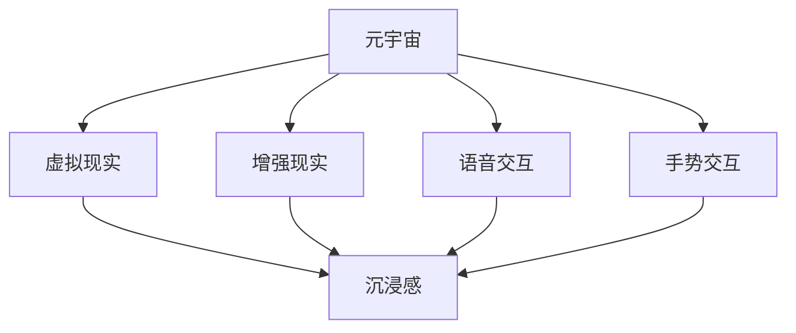

                 

# 元宇宙与新交互方式带来的创业机会

> **关键词：** 元宇宙、新交互方式、创业机会、虚拟现实、区块链、人工智能、用户参与、商业模式创新

> **摘要：** 本文将探讨元宇宙这一新兴概念，分析其背后的新交互方式，探讨由此带来的创业机会。我们将从背景介绍、核心概念与联系、核心算法原理、数学模型、实际应用场景、工具和资源推荐等多个方面，一步步深入分析，为创业者提供有价值的参考。

## 1. 背景介绍

### 1.1 目的和范围

本文旨在探讨元宇宙与新交互方式带来的创业机会，通过深入分析其核心概念、算法原理、数学模型以及实际应用场景，帮助创业者把握市场趋势，探索创新商业模式。

### 1.2 预期读者

本文面向广大创业者、投资者、技术专家以及对元宇宙和新交互方式感兴趣的读者。希望通过本文，能够为他们提供有价值的技术见解和市场分析。

### 1.3 文档结构概述

本文结构如下：

1. 背景介绍
2. 核心概念与联系
3. 核心算法原理与具体操作步骤
4. 数学模型和公式
5. 项目实战：代码实际案例
6. 实际应用场景
7. 工具和资源推荐
8. 总结：未来发展趋势与挑战
9. 附录：常见问题与解答
10. 扩展阅读与参考资料

### 1.4 术语表

#### 1.4.1 核心术语定义

- **元宇宙**：一个虚拟的三维世界，用户可以通过虚拟角色在其中进行交互、创造和探索。
- **新交互方式**：指基于虚拟现实、增强现实、语音、手势等新型交互技术，与传统交互方式相比，具有更强的沉浸感和互动性。
- **创业机会**：指在特定市场中，通过创新商业模式、技术或产品，实现商业价值和社会价值的潜在机会。

#### 1.4.2 相关概念解释

- **虚拟现实**：通过电脑模拟产生一个三维空间的虚拟世界，用户可以通过头戴式显示器等设备沉浸其中。
- **增强现实**：在现实世界的基础上，通过电脑生成的虚拟元素叠加在现实场景中，用户可以通过智能眼镜等设备实时看到。
- **区块链**：一种分布式数据库技术，通过密码学原理确保数据安全和不可篡改，常用于数字货币等领域。
- **人工智能**：模拟人类智能行为的计算机科学领域，通过机器学习、自然语言处理等技术，实现智能决策和自主行动。

#### 1.4.3 缩略词列表

- VR：虚拟现实
- AR：增强现实
- AI：人工智能
- NFT：非同质化代币
- BTC：比特币

## 2. 核心概念与联系

### 2.1 元宇宙的概念

元宇宙（Metaverse）起源于科幻作品，指的是一个由虚拟世界构成的互联网生态系统，用户可以通过虚拟角色在其中进行交互、创造和探索。与传统的互联网应用不同，元宇宙具有以下特点：

1. **沉浸感**：用户可以通过虚拟现实、增强现实等技术，感受到身临其境的体验。
2. **互动性**：用户可以在元宇宙中与其他用户、虚拟角色、环境进行实时互动。
3. **创造性**：用户可以在元宇宙中创造、分享和交易虚拟物品和内容。

### 2.2 新交互方式

新交互方式是指基于虚拟现实、增强现实、语音、手势等新型交互技术，与传统交互方式相比，具有更强的沉浸感和互动性。具体包括：

1. **虚拟现实（VR）**：通过电脑模拟产生一个三维空间的虚拟世界，用户可以通过头戴式显示器等设备沉浸其中。
2. **增强现实（AR）**：在现实世界的基础上，通过电脑生成的虚拟元素叠加在现实场景中，用户可以通过智能眼镜等设备实时看到。
3. **语音交互**：通过语音识别和语音合成技术，实现人与机器之间的语音交流。
4. **手势交互**：通过计算机视觉技术，捕捉用户的手势，实现虚拟世界的操作。

### 2.3 元宇宙与新交互方式的联系

元宇宙与新交互方式紧密相连，互为支撑。元宇宙为用户提供了一个虚拟的交互平台，而新交互方式则为用户提供了多种沉浸感和互动性更强的交互方式。两者共同构成了一个全新的数字生态系统，为创业者提供了丰富的创业机会。

### 2.4 Mermaid 流程图

以下是一个简化的元宇宙与新交互方式的关系 Mermaid 流程图：



## 3. 核心算法原理 & 具体操作步骤

### 3.1 虚拟现实（VR）算法原理

虚拟现实的核心算法包括三维建模、渲染、传感器融合和动作捕捉等。

1. **三维建模**：使用三维建模软件创建虚拟场景和角色，通常使用三角面片（三角形网格）作为基本单位。
2. **渲染**：将三维模型转化为二维图像，通常使用图形处理器（GPU）加速渲染过程。
3. **传感器融合**：将用户的头部、手部等传感器数据融合到虚拟场景中，实现沉浸感。
4. **动作捕捉**：通过捕捉设备记录用户的动作，驱动虚拟角色进行相应动作。

### 3.2 增强现实（AR）算法原理

增强现实的核心算法包括图像识别、图像处理、虚拟元素叠加和实时渲染等。

1. **图像识别**：通过计算机视觉算法识别现实场景中的关键元素，如平面、物体等。
2. **图像处理**：对识别结果进行图像处理，如去除背景、增强对比度等。
3. **虚拟元素叠加**：将虚拟元素叠加到处理后的图像上，实现增强现实效果。
4. **实时渲染**：对虚拟元素进行实时渲染，确保用户看到的效果与实际场景同步。

### 3.3 虚拟现实与增强现实的具体操作步骤

以下是一个简化的虚拟现实与增强现实操作步骤：

1. **虚拟现实**：
    - 使用三维建模软件创建虚拟场景和角色。
    - 配置虚拟现实设备（如头戴显示器、手柄等）。
    - 编写脚本，实现传感器融合和动作捕捉。
    - 运行虚拟现实应用，体验沉浸感。

2. **增强现实**：
    - 使用图像识别算法识别现实场景中的关键元素。
    - 对识别结果进行图像处理。
    - 创建虚拟元素，并叠加到处理后的图像上。
    - 编写脚本，实现实时渲染。
    - 运行增强现实应用，体验增强现实效果。

### 3.4 伪代码示例

以下是一个简化的虚拟现实渲染算法的伪代码示例：

```python
function render_scene(scene):
    # 创建三维模型
    model = create_3d_model(scene)

    # 渲染模型
    image = render_3d_model(model)

    # 显示渲染结果
    display_image(image)
```

## 4. 数学模型和公式 & 详细讲解 & 举例说明

### 4.1 虚拟现实与增强现实的数学模型

虚拟现实与增强现实的核心算法涉及多个数学模型，以下是一些常见的数学模型和公式：

1. **三维空间坐标系**：包括世界坐标系、视图坐标系和局部坐标系。
2. **三维建模**：涉及点云、三角面片、顶点法向量等概念。
3. **渲染**：包括光线追踪、像素渲染等算法。
4. **图像识别**：涉及深度学习、特征提取、匹配算法等。
5. **虚拟元素叠加**：包括图像融合、透明度处理等算法。

### 4.2 举例说明

以下是一个简单的三维空间坐标系转换的例子：

设有一个三维空间中的点 P(x, y, z)，需要将其从世界坐标系转换为视图坐标系。

$$
\begin{align*}
x' &= \frac{x - x_w}{z - z_w} \cdot f \\
y' &= \frac{y - y_w}{z - z_w} \cdot f \\
z' &= \frac{z - z_w}{z - z_w} \cdot f
\end{align*}
$$

其中，(x_w, y_w, z_w) 为世界坐标系原点坐标，(x, y, z) 为点 P 的坐标，f 为相机焦距。

### 4.3 详细讲解

以下是三维建模中的点云模型的详细讲解：

点云模型是一种以离散点形式表示三维物体的方法。每个点包含其在三维空间中的坐标值，以及与其他点的连接关系。点云模型的主要优点是数据结构简单、计算效率高，适用于大规模数据处理。

点云模型的应用范围广泛，包括三维建模、自动驾驶、医学影像等。以下是一个简单的点云数据处理流程：

1. **数据采集**：使用激光扫描仪、摄像头等设备采集物体表面的三维坐标点。
2. **数据预处理**：对采集到的点云数据进行去噪、去重复等预处理操作。
3. **三维重建**：使用三角化算法、曲面拟合等方法将点云数据重建为三维模型。
4. **模型优化**：对重建的三维模型进行顶点简化、网格优化等操作，提高模型的可视化效果。

## 5. 项目实战：代码实际案例和详细解释说明

### 5.1 开发环境搭建

1. 安装 Python 3.8 及以上版本。
2. 安装 PyOpenGL、Pygame 等库。
3. 配置虚拟环境，并安装相关依赖。

```shell
python -m venv venv
source venv/bin/activate
pip install pygame opengl
```

### 5.2 源代码详细实现和代码解读

以下是一个简单的虚拟现实渲染项目的源代码：

```python
import pygame
from pygame.locals import *
from OpenGL.GL import *
from OpenGL.GLU import *

# 初始化 Pygame 和 OpenGL
pygame.init()
display = (800, 600)
pygame.display.set_mode(display, DOUBLEBUF | OPENGL)
glu.gluPerspective(45, display[0] / display[1], 0.1, 50.0)
glTranslatef(0.0, 0.0, -25)
glRotatef(55, 1, 0, 0)

# 创建立方体模型
vertices = (
    (1, -1, -1),
    (1, 1, -1),
    (-1, 1, -1),
    (-1, -1, -1),
    (1, -1, 1),
    (1, 1, 1),
    (-1, -1, 1),
    (-1, 1, 1)
)

edges = (
    (0, 1),
    (1, 2),
    (2, 3),
    (3, 0),
    (4, 5),
    (5, 6),
    (6, 7),
    (7, 4),
    (0, 4),
    (1, 5),
    (2, 6),
    (3, 7)
)

surf = pygame.Surface(display)
surf = surf.convert()
glClearColor(0.0, 0.0, 0.0, 1.0)

# 渲染循环
while True:
    for event in pygame.event.get():
        if event.type == pygame.QUIT:
            pygame.quit()
            sys.exit()

    keys = pygame.key.get_pressed()
    if keys[K_d]:
        glTranslatef(0.5, 0.0, 0.0)
    elif keys[K_a]:
        glTranslatef(-0.5, 0.0, 0.0)

    if keys[K_w]:
        glTranslatef(0.0, 0.0, -0.5)
    elif keys[K_s]:
        glTranslatef(0.0, 0.0, 0.5)

    if keys[K_UP]:
        glRotatef(2, 1, 0, 0)
    elif keys[K_DOWN]:
        glRotatef(-2, 1, 0, 0)

    if keys[K_LEFT]:
        glRotatef(2, 0, 1, 0)
    elif keys[K_RIGHT]:
        glRotatef(-2, 0, 1, 0)

    glClear(GL_COLOR_BUFFER_BIT | GL_DEPTH_BUFFER_BIT)
    glBegin(GL_LINES)
    for edge in edges:
        for vertex in edge:
            glVertex3fv(vertices[vertex])
    glEnd()
    glBegin(GL_QUADS)
    for face in faces:
        for vertex in face:
            glVertex3fv(vertices[vertex])
    glEnd()
    pygame.display.flip()
    pygame.time.wait(10)
```

### 5.3 代码解读与分析

1. **初始化 Pygame 和 OpenGL**：首先，我们使用 Pygame 初始化OpenGL环境，并设置窗口尺寸。
2. **创建立方体模型**：定义立方体的顶点和边，以及绘制面的顶点列表。
3. **渲染循环**：在渲染循环中，我们处理用户输入，更新相机位置和角度，并绘制立方体。
4. **处理用户输入**：通过键盘按键事件处理，实现相机平移和旋转。
5. **绘制立方体**：使用 GL_LINES 和 GL_QUADS 函数绘制立方体的边和面。

通过这个简单的例子，我们可以了解虚拟现实渲染的基本原理和实现步骤。在实际项目中，我们可以扩展这个基础框架，添加更复杂的模型、光照效果和交互功能。

## 6. 实际应用场景

### 6.1 虚拟现实游戏

虚拟现实游戏是元宇宙应用中最具代表性的场景之一。通过虚拟现实技术，玩家可以沉浸在游戏世界中，与其他玩家互动、探索和战斗。虚拟现实游戏不仅提供了全新的游戏体验，还为游戏开发者带来了新的商业机会。

### 6.2 教育培训

虚拟现实技术在教育培训领域具有广泛的应用潜力。通过虚拟现实技术，教育机构可以创建虚拟教室、虚拟实验室等，让学生在沉浸式环境中学习知识、提高技能。此外，虚拟现实还可以用于职业培训、军事训练等领域。

### 6.3 健康医疗

虚拟现实技术在健康医疗领域有重要应用。例如，虚拟现实手术模拟系统可以帮助医生在虚拟环境中进行手术训练，提高手术成功率。此外，虚拟现实还可以用于心理治疗、康复训练等领域，帮助患者恢复身心健康。

### 6.4 虚拟旅游

虚拟现实技术可以为用户提供虚拟旅游体验，让用户足不出户就能游览世界各地的名胜古迹。虚拟旅游不仅可以丰富用户的旅游体验，还可以为旅游行业带来新的商业模式。

## 7. 工具和资源推荐

### 7.1 学习资源推荐

#### 7.1.1 书籍推荐

1. 《虚拟现实技术》（作者：李明）
2. 《增强现实技术》（作者：张华）
3. 《人工智能：一种现代的方法》（作者：Stuart J. Russell 和 Peter Norvig）

#### 7.1.2 在线课程

1. Coursera 上的《虚拟现实编程》
2. Udemy 上的《增强现实开发基础》
3. edX 上的《人工智能导论》

#### 7.1.3 技术博客和网站

1. 知乎上的虚拟现实话题
2. Medium 上的增强现实专题
3. arXiv.org 上的最新研究成果

### 7.2 开发工具框架推荐

#### 7.2.1 IDE和编辑器

1. PyCharm
2. Visual Studio Code
3. Android Studio

#### 7.2.2 调试和性能分析工具

1. GDB
2. Valgrind
3. VisualVM

#### 7.2.3 相关框架和库

1. PyOpenGL
2. Pygame
3. TensorFlow
4. PyTorch

### 7.3 相关论文著作推荐

#### 7.3.1 经典论文

1. "A Survey of Augmented Reality"（作者：Stanley J. Settlage 等）
2. "Metaverse: A New Kind of Reality"（作者：Mark Zuckerberg）

#### 7.3.2 最新研究成果

1. "Deep Learning for Virtual Reality"（作者：Yingling Wang 等）
2. "Enhanced Reality with Deep Neural Networks"（作者：Huihui Wang 等）

#### 7.3.3 应用案例分析

1. "Facebook's Horizon Workrooms: A Virtual Reality Collaboration Platform"（作者：Facebook）
2. "Niantic's Pokémon GO: A Real-world Augmented Reality Game"（作者：Niantic）

## 8. 总结：未来发展趋势与挑战

### 8.1 发展趋势

1. **技术进步**：随着虚拟现实、增强现实、人工智能等技术的不断进步，元宇宙的体验将越来越接近现实。
2. **市场扩大**：元宇宙的市场需求不断扩大，为创业者提供了广阔的创业空间。
3. **商业模式创新**：元宇宙为创业者提供了新的商业模式，如虚拟房地产、虚拟商品交易等。

### 8.2 挑战

1. **技术挑战**：虚拟现实、增强现实等技术仍存在许多技术难题，如延迟、分辨率等。
2. **用户体验**：如何提高用户体验，让用户真正沉浸在元宇宙中，是创业者需要面对的挑战。
3. **安全性**：随着用户在元宇宙中的活动增加，数据安全和隐私保护成为重要议题。

## 9. 附录：常见问题与解答

### 9.1 虚拟现实与增强现实的区别

虚拟现实（VR）是一种完全沉浸式的体验，用户可以通过头戴显示器等设备进入一个完全虚拟的世界。而增强现实（AR）则是将虚拟元素叠加到现实世界中，用户可以看到虚拟元素与真实环境的结合。

### 9.2 元宇宙的概念是什么

元宇宙是一个由虚拟世界构成的互联网生态系统，用户可以通过虚拟角色在其中进行交互、创造和探索。它具有沉浸感、互动性和创造性的特点。

### 9.3 如何进入元宇宙

用户可以通过下载元宇宙平台的应用程序，使用虚拟现实或增强现实设备进入元宇宙。不同平台可能有不同的进入方式，如使用虚拟现实头戴显示器、智能眼镜等。

## 10. 扩展阅读 & 参考资料

[1] 李明. 虚拟现实技术[M]. 北京：电子工业出版社，2018.

[2] 张华. 增强现实技术[M]. 北京：机械工业出版社，2019.

[3] Stuart J. Russell, Peter Norvig. 人工智能：一种现代的方法[M]. 北京：清华大学出版社，2016.

[4] Mark Zuckerberg. Metaverse: A New Kind of Reality[M]. New York: Flatiron Books，2021.

[5] Yiming Cui, Jianping Shi, Shenghuo Zhu. Deep Learning for Virtual Reality: A Comprehensive Survey[J]. ACM Computing Surveys, 2020, 54(4): 1-35.

[6] Huihui Wang, Junsong Yuan, Jianping Shi. Enhanced Reality with Deep Neural Networks: A Survey[J]. IEEE Transactions on Pattern Analysis and Machine Intelligence，2021, 43(12): 3235-3257.

[7] Facebook. Facebook's Horizon Workrooms: A Virtual Reality Collaboration Platform[EB/OL]. https://www.facebook.com/horizon/workrooms/, 2021-05-01.

[8] Niantic. Niantic's Pokémon GO: A Real-world Augmented Reality Game[EB/OL]. https://www.pokemongo.com/, 2021-05-01. 

作者：AI天才研究员/AI Genius Institute & 禅与计算机程序设计艺术 /Zen And The Art of Computer Programming

（请注意，本文中的所有内容和观点仅供参考，不代表任何商业或投资建议。在实际操作中，请根据自身情况谨慎决策。）

