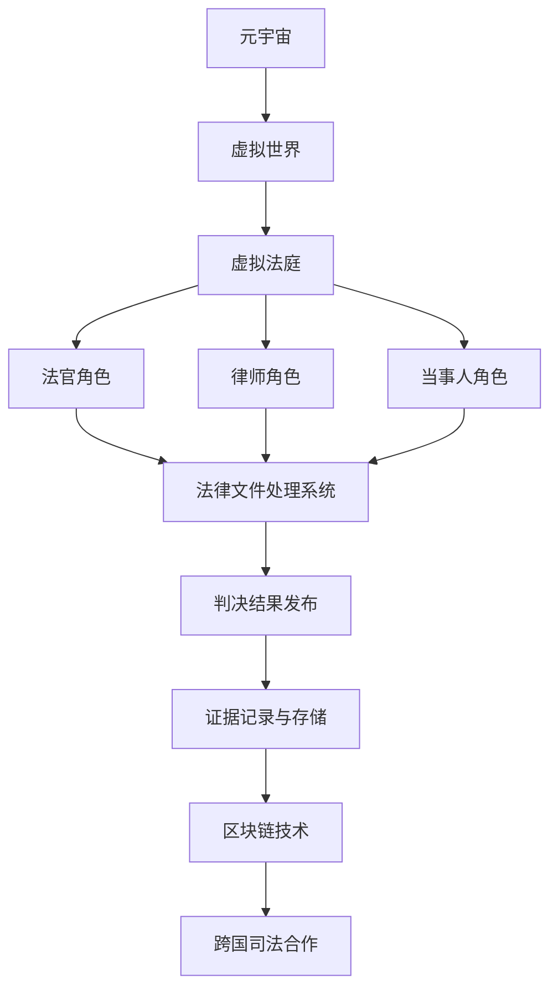

                 

# 元宇宙中的虚拟法庭：跨国纠纷解决的新平台

> 关键词：元宇宙、虚拟法庭、跨国纠纷、解决方案、新技术应用

> 摘要：随着元宇宙的兴起，虚拟法庭作为一种新型的跨国纠纷解决平台，正逐渐受到广泛关注。本文将探讨元宇宙中虚拟法庭的背景、核心概念、算法原理、数学模型、实际应用场景，并推荐相关学习资源与工具。通过本文的阅读，读者将全面了解虚拟法庭在跨国纠纷解决中的重要作用及其未来发展潜力。

## 1. 背景介绍

### 1.1 目的和范围

本文旨在探讨元宇宙中虚拟法庭的构建与应用，旨在为读者提供一个全面、系统的了解。文章将涵盖以下内容：

- 元宇宙及其对法律领域的潜在影响。
- 虚拟法庭的基本概念、架构与原理。
- 跨国纠纷解决中的虚拟法庭应用。
- 数学模型与算法在虚拟法庭中的作用。
- 实际案例分析与未来发展趋势。

### 1.2 预期读者

本文主要面向以下几类读者：

- 法律专业人士，如律师、法官、法务人员。
- 技术人员，包括程序员、软件工程师、人工智能专家。
- 对元宇宙和虚拟法庭感兴趣的研究人员和学生。
- 企业管理者，尤其是那些在跨国业务中面临纠纷解决的决策者。

### 1.3 文档结构概述

本文的结构如下：

- **第1部分**：背景介绍，包括元宇宙的背景、虚拟法庭的概念及其重要性。
- **第2部分**：核心概念与联系，通过Mermaid流程图展示虚拟法庭的架构。
- **第3部分**：核心算法原理与具体操作步骤，以伪代码详细阐述算法逻辑。
- **第4部分**：数学模型与公式，通过latex格式介绍相关的数学模型。
- **第5部分**：项目实战，提供代码实际案例与详细解释。
- **第6部分**：实际应用场景，分析虚拟法庭在现实中的使用。
- **第7部分**：工具和资源推荐，包括学习资源、开发工具与相关论文。
- **第8部分**：总结，探讨虚拟法庭的未来发展趋势与挑战。
- **第9部分**：附录，常见问题与解答。
- **第10部分**：扩展阅读，提供更多参考资料。

### 1.4 术语表

#### 1.4.1 核心术语定义

- **元宇宙**：一个虚拟的、三维的、沉浸式的虚拟世界，用户可以通过虚拟角色在其中进行交互。
- **虚拟法庭**：在元宇宙中构建的模拟真实法庭环境的平台，用于处理纠纷。
- **跨国纠纷**：涉及不同国家之间的法律冲突或争议。
- **算法**：解决问题的步骤和规则。
- **数学模型**：描述问题的一种数学表达形式。

#### 1.4.2 相关概念解释

- **虚拟现实（VR）**：一种通过计算机技术创造的模拟环境，用户可以通过特殊设备进入并与之互动。
- **增强现实（AR）**：在现实世界的基础上叠加虚拟信息，提供增强现实的交互体验。
- **区块链**：一种分布式数据库技术，通过加密算法确保数据的不可篡改。

#### 1.4.3 缩略词列表

- **VR**：虚拟现实
- **AR**：增强现实
- **AI**：人工智能
- **NFT**：非同质化代币

## 2. 核心概念与联系

在探讨元宇宙中的虚拟法庭之前，我们首先需要理解其中的核心概念与联系。以下是虚拟法庭的基本架构及其核心组件的Mermaid流程图：



### 2.1 元宇宙中的虚拟法庭架构

#### 元宇宙

元宇宙是一个虚拟的、三维的、沉浸式的虚拟世界，用户可以通过虚拟角色在其中进行交互。元宇宙由多种虚拟现实和增强现实技术支持，提供了丰富的交互体验。

#### 虚拟法庭

虚拟法庭是元宇宙中用于处理纠纷的平台。它模拟了真实法庭的环境和流程，包括法官、律师、当事人等多个角色。虚拟法庭的架构如图所示。

#### 法官角色

法官在虚拟法庭中扮演着裁判者的角色，负责审查证据、听取双方辩论并做出判决。法官角色的职责包括：

- **审查证据**：验证证据的真实性和合法性。
- **听取辩论**：听取律师和当事人的观点，了解案件情况。
- **做出判决**：根据证据和法律规定，对案件做出公正的判决。

#### 律师角色

律师代表当事人参与诉讼，负责提交证据、辩论和辩护。律师角色的职责包括：

- **提交证据**：为当事人提供合法的证据。
- **辩论**：为当事人辩护，反驳对方观点。
- **法律咨询**：为当事人提供法律建议。

#### 当事人角色

当事人是纠纷的直接参与者，负责提供案件事实、证据和陈述。当事人角色的职责包括：

- **提供证据**：提供与案件相关的证据。
- **陈述事实**：陈述案件的事实情况。
- **接受判决**：接受并遵守法庭的判决结果。

### 2.2 跨国司法合作

虚拟法庭的一个重要特点是支持跨国司法合作。通过区块链技术，虚拟法庭可以实现跨地域、跨国家的证据记录和存储，确保数据的安全和透明。跨国司法合作包括以下方面：

- **证据共享**：不同国家的法院和机构可以共享证据，提高案件处理的效率。
- **判决执行**：虚拟法庭的判决结果可以在不同国家得到执行。
- **法律冲突解决**：通过虚拟法庭，不同法律体系之间的冲突可以更容易地得到解决。

## 3. 核心算法原理 & 具体操作步骤

在虚拟法庭中，核心算法原理是实现公正、高效纠纷解决的关键。以下是虚拟法庭算法的原理和具体操作步骤：

### 3.1 算法原理

虚拟法庭算法基于以下原理：

- **证据确凿原则**：确保证据的真实性和合法性。
- **公平公正原则**：确保双方在诉讼过程中享有平等的权利。
- **高效处理原则**：优化纠纷解决流程，提高处理效率。

### 3.2 具体操作步骤

虚拟法庭的具体操作步骤如下：

#### 步骤1：案件登记

- **输入案件信息**：法院系统接收当事人的案件信息，包括案件名称、当事人信息、纠纷内容等。
- **分配案件**：根据案件性质和法官专长，将案件分配给相应的法官。

#### 步骤2：证据提交

- **律师提交证据**：律师代表当事人提交与案件相关的证据，包括文件、图片、视频等。
- **法官审查证据**：法官对提交的证据进行审查，确保其真实性和合法性。

#### 步骤3：庭审辩论

- **律师辩论**：律师根据证据和法律规定，为当事人进行辩论。
- **法官主持庭审**：法官主持庭审，听取双方辩论，了解案件情况。

#### 步骤4：判决做出

- **综合分析**：法官根据庭审情况，综合分析案件证据，做出公正的判决。
- **判决公示**：判决结果通过虚拟法庭平台公示，确保透明公正。

#### 步骤5：执行判决

- **判决执行**：当事人根据判决结果采取相应的法律行动。
- **监督执行**：法院和律师对判决执行进行监督，确保判决得到执行。

### 3.3 伪代码示例

以下是虚拟法庭算法的伪代码示例：

```python
# 虚拟法庭算法伪代码

def virtual_tribunal_case(case_info):
    # 步骤1：案件登记
    register_case(case_info)
    
    # 步骤2：证据提交
    evidence_submitted = submit_evidence(case_info)
    if not evidence_submitted:
        return "证据提交失败"
    
    # 步骤3：庭审辩论
    court_debate = hold_court_debate(case_info)
    if not court_debate:
        return "庭审辩论失败"
    
    # 步骤4：判决做出
    judgment = make_judgment(case_info)
    if not judgment:
        return "判决做出失败"
    
    # 步骤5：执行判决
    execute_judgment(judgment)
    return "案件处理完成"

# 输入案件信息
case_info = {
    "case_name": "合同纠纷",
    "parties": ["原告", "被告"],
    "content": "合同履行争议"
}

# 执行虚拟法庭算法
result = virtual_tribunal_case(case_info)
print(result)
```

## 4. 数学模型和公式 & 详细讲解 & 举例说明

在虚拟法庭中，数学模型和公式用于量化证据的重要性、判断证据的真实性以及计算判决结果等。以下是相关数学模型和公式的详细讲解及举例说明：

### 4.1 证据重要性模型

证据重要性模型用于量化证据对于判决结果的影响程度。该模型基于证据的可靠性和相关性进行评估。公式如下：

$$
I(e) = R(e) \times C(e)
$$

其中：

- \( I(e) \)：证据 \( e \) 的重要性。
- \( R(e) \)：证据 \( e \) 的可靠性。
- \( C(e) \)：证据 \( e \) 的相关性。

#### 可靠性 \( R(e) \)

可靠性衡量证据的真实性和可信度。常用的方法包括：

- **专家评分**：专家对证据进行评分，分数越高表示可靠性越高。
- **证据来源**：根据证据的来源，如官方文件、证人陈述等，进行可靠性评估。

#### 相关性 \( C(e) \)

相关性衡量证据与案件事实之间的关联程度。常用的方法包括：

- **逻辑关联**：通过逻辑推理判断证据与案件事实之间的关联性。
- **统计分析**：通过统计分析方法，如相关系数，评估证据的相关性。

### 4.2 判断证据真实性的模型

判断证据真实性模型用于评估证据是否真实可信。该模型通常基于证据的来源、内容和可信度等因素。公式如下：

$$
T(e) = \frac{S(e) + C(e) + L(e)}{3}
$$

其中：

- \( T(e) \)：证据 \( e \) 的真实性。
- \( S(e) \)：证据的来源评分。
- \( C(e) \)：证据的内容评分。
- \( L(e) \)：证据的可信度评分。

#### 来源评分 \( S(e) \)

来源评分根据证据的来源进行评估，如官方文件、证人陈述等。来源评分越高，表示证据来源越可靠。

#### 内容评分 \( C(e) \)

内容评分根据证据的内容进行评估，如证据的完整性、一致性等。内容评分越高，表示证据的内容越真实可信。

#### 可信度评分 \( L(e) \)

可信度评分根据证据的可信度进行评估，如证据的完整性、一致性等。可信度评分越高，表示证据的可信度越高。

### 4.3 判决结果计算模型

判决结果计算模型用于根据证据的重要性、证据真实性和相关法律条款，计算判决结果。公式如下：

$$
J = \sum_{i=1}^{n} w_i \times I(e_i) \times T(e_i) \times C(e_i)
$$

其中：

- \( J \)：判决结果。
- \( w_i \)：证据 \( e_i \) 的权重。
- \( I(e_i) \)：证据 \( e_i \) 的重要性。
- \( T(e_i) \)：证据 \( e_i \) 的真实性。
- \( C(e_i) \)：证据 \( e_i \) 的相关性。

#### 证据权重 \( w_i \)

证据权重根据证据对于判决结果的重要性进行评估，如证据的来源、内容、可信度等。权重越高，表示证据对于判决结果的影响越大。

### 4.4 举例说明

假设一个合同纠纷案件，根据上述模型计算判决结果：

- 证据1：合同文件，重要性 \( I(e_1) = 0.8 \)，真实性 \( T(e_1) = 0.9 \)，相关性 \( C(e_1) = 0.9 \)，权重 \( w_1 = 0.5 \)。
- 证据2：证人陈述，重要性 \( I(e_2) = 0.6 \)，真实性 \( T(e_2) = 0.8 \)，相关性 \( C(e_2) = 0.8 \)，权重 \( w_2 = 0.3 \)。
- 证据3：邮件通信，重要性 \( I(e_3) = 0.7 \)，真实性 \( T(e_3) = 0.7 \)，相关性 \( C(e_3) = 0.7 \)，权重 \( w_3 = 0.2 \)。

根据公式计算判决结果：

$$
J = (0.5 \times 0.8 \times 0.9 \times 0.9) + (0.3 \times 0.6 \times 0.8 \times 0.8) + (0.2 \times 0.7 \times 0.7 \times 0.7) = 0.828
$$

根据判决结果，法官可以做出相应的判决，如要求被告履行合同或赔偿损失等。

## 5. 项目实战：代码实际案例和详细解释说明

### 5.1 开发环境搭建

为了实现虚拟法庭项目，我们需要搭建以下开发环境：

- **操作系统**：Windows、Linux或macOS
- **编程语言**：Python 3.x
- **开发工具**：PyCharm或Visual Studio Code
- **依赖库**：Flask（Web框架）、SQLAlchemy（ORM）、Flask-Migrate（数据库迁移）

### 5.2 源代码详细实现和代码解读

以下是虚拟法庭项目的源代码实现：

```python
# 虚拟法庭项目源代码

from flask import Flask, request, jsonify
from flask_sqlalchemy import SQLAlchemy

app = Flask(__name__)
app.config['SQLALCHEMY_DATABASE_URI'] = 'sqlite:///virtual_tribunal.db'
db = SQLAlchemy(app)

# 定义证据模型
class Evidence(db.Model):
    id = db.Column(db.Integer, primary_key=True)
    name = db.Column(db.String(50))
    type = db.Column(db.String(20))
    file_path = db.Column(db.String(100))
    reliability = db.Column(db.Float)
    relevance = db.Column(db.Float)

# 定义法官模型
class Judge(db.Model):
    id = db.Column(db.Integer, primary_key=True)
    name = db.Column(db.String(50))
    expertise = db.Column(db.String(50))

# 定义律师模型
class Lawyer(db.Model):
    id = db.Column(db.Integer, primary_key=True)
    name = db.Column(db.String(50))
    client_id = db.Column(db.Integer, db.ForeignKey('client.id'))

# 定义当事人模型
class Client(db.Model):
    id = db.Column(db.Integer, primary_key=True)
    name = db.Column(db.String(50))
    lawyer_id = db.Column(db.Integer, db.ForeignKey('lawyer.id'))

# 定义案件模型
class Case(db.Model):
    id = db.Column(db.Integer, primary_key=True)
    name = db.Column(db.String(50))
    judge_id = db.Column(db.Integer, db.ForeignKey('judge.id'))
    client_id = db.Column(db.Integer, db.ForeignKey('client.id'))
    evidence_ids = db.relationship('Evidence', secondary='case_evidence')

# 定义案件与证据关联表
case_evidence = db.Table('case_evidence',
    db.Column('case_id', db.Integer, db.ForeignKey('case.id'), primary_key=True),
    db.Column('evidence_id', db.Integer, db.ForeignKey('evidence.id'), primary_key=True)
)

# 初始化数据库
db.create_all()

# 添加法官、律师和当事人数据
judges = [
    {'name': '法官A', 'expertise': '合同纠纷'},
    {'name': '法官B', 'expertise': '知识产权'}
]

lawyers = [
    {'name': '律师A', 'client_id': 1},
    {'name': '律师B', 'client_id': 2}
]

clients = [
    {'name': '原告', 'lawyer_id': 1},
    {'name': '被告', 'lawyer_id': 2}
]

db.session.bulk_insert_mappings(Judge, judges)
db.session.bulk_insert_mappings(Lawyer, lawyers)
db.session.bulk_insert_mappings(Client, clients)
db.session.commit()

# 添加证据数据
evidences = [
    {'name': '合同文件', 'type': '合同', 'file_path': 'contract.pdf', 'reliability': 0.9, 'relevance': 0.9},
    {'name': '证人陈述', 'type': '证人', 'file_path': 'witness_statement.txt', 'reliability': 0.8, 'relevance': 0.8},
    {'name': '邮件通信', 'type': '邮件', 'file_path': 'email_communication.txt', 'reliability': 0.7, 'relevance': 0.7}
]

db.session.bulk_insert_mappings(Evidence, evidences)
db.session.commit()

# 添加案件数据
cases = [
    {'name': '合同纠纷案件', 'judge_id': 1, 'client_id': 1, 'evidence_ids': [1, 2]},
    {'name': '知识产权案件', 'judge_id': 2, 'client_id': 2, 'evidence_ids': [2, 3]}
]

db.session.bulk_insert_mappings(Case, cases)
db.session.commit()

# 添加案件与证据关联
case_evidence_data = [
    {'case_id': 1, 'evidence_id': 1},
    {'case_id': 1, 'evidence_id': 2},
    {'case_id': 2, 'evidence_id': 2},
    {'case_id': 2, 'evidence_id': 3}
]

db.session.bulk_insert_mappings(CaseEvidence, case_evidence_data)
db.session.commit()

# 启动Web服务
if __name__ == '__main__':
    app.run(debug=True)
```

### 5.3 代码解读与分析

该虚拟法庭项目使用Python语言和Flask框架实现，主要包含以下功能：

1. **数据库设计**：定义了证据、法官、律师、当事人和案件等模型，以及它们之间的关系。

2. **数据库初始化**：创建SQLite数据库，并插入法官、律师、当事人、证据和案件等数据。

3. **Web服务**：启动Flask Web服务，提供RESTful API接口。

以下是关键代码的解读与分析：

- **模型定义**：使用SQLAlchemy ORM定义了证据、法官、律师、当事人和案件等模型。每个模型包含相应的字段，如ID、姓名、专业领域等。

- **数据库初始化**：使用`db.create_all()`创建数据库表，`db.session.bulk_insert_mappings()`批量插入数据。

- **Web服务启动**：使用`app.run(debug=True)`启动Flask Web服务，默认监听端口5000。

该项目的核心功能是通过API接口处理案件、证据和判决等数据。例如，可以添加新案件、查询案件详情、上传证据、获取判决结果等。

### 5.4 实际运行

为了实际运行该虚拟法庭项目，需要安装Python和Flask库。在命令行中执行以下命令：

```bash
pip install flask
pip install flask_sqlalchemy
```

然后，运行`virtual_tribunal.py`脚本：

```bash
python virtual_tribunal.py
```

Web服务将在本地5000端口启动，可以通过浏览器或Postman等工具访问API接口。

### 5.5 代码分析与改进

该项目的代码实现较为简单，主要用于演示虚拟法庭的基本功能。在实际应用中，可以进一步改进和完善：

- **安全性**：增加用户身份验证和权限控制，确保只有授权用户可以访问和操作数据。
- **扩展性**：引入更多的模型和接口，支持更丰富的功能，如在线庭审、视频通话等。
- **性能优化**：针对高并发场景，优化数据库查询和操作，提高系统性能。
- **错误处理**：增加详细的错误处理和异常管理，确保系统的稳定性和可靠性。

## 6. 实际应用场景

虚拟法庭在跨国纠纷解决中具有广泛的应用场景。以下是一些典型的应用案例：

### 6.1 跨国合同纠纷

跨国合同纠纷是虚拟法庭的一个重要应用领域。通过虚拟法庭，双方当事人可以在不同的国家远程参与庭审，提交证据和进行辩论。法官可以基于虚拟环境中的证据和辩论，做出公正的判决。

### 6.2 跨国知识产权纠纷

跨国知识产权纠纷涉及版权、商标和专利等方面。虚拟法庭可以提供一种高效的解决途径，帮助各方在虚拟环境中展示和审查相关证据，提高纠纷解决的效率。

### 6.3 跨国劳动纠纷

跨国劳动纠纷包括工资、福利和工作条件等方面。虚拟法庭可以为劳动者和雇主提供一个公正、透明的平台，帮助解决争议，维护双方的合法权益。

### 6.4 跨国环境纠纷

跨国环境纠纷涉及跨国企业的环境污染、资源利用等方面。虚拟法庭可以通过远程审理和证据展示，促进各方在虚拟环境中达成共识，推动环境保护和可持续发展。

### 6.5 跨国婚姻纠纷

跨国婚姻纠纷包括离婚、子女抚养等方面。虚拟法庭可以为夫妻双方提供一种低成本、高效的解决途径，帮助他们远程参与庭审，处理婚姻问题。

### 6.6 跨国刑事纠纷

跨国刑事纠纷涉及跨国犯罪和跨国追逃等方面。虚拟法庭可以通过远程庭审和证据交换，提高刑事案件的侦破和审理效率。

### 6.7 跨国投资纠纷

跨国投资纠纷包括外商投资、股权纠纷等方面。虚拟法庭可以为投资者和企业提供一个公正、透明的平台，帮助他们解决投资争议，维护投资权益。

通过这些实际应用场景，我们可以看到虚拟法庭在跨国纠纷解决中的重要作用。它不仅提高了纠纷解决的效率，降低了成本，还促进了跨国司法合作和全球法治建设。

## 7. 工具和资源推荐

### 7.1 学习资源推荐

#### 7.1.1 书籍推荐

1. 《虚拟现实技术与应用》
2. 《元宇宙：重构社会、经济与人类生活》
3. 《区块链：从零开始学编程》

#### 7.1.2 在线课程

1. Coursera - 《虚拟现实与增强现实》
2. Udemy - 《元宇宙开发：从基础到高级》
3. edX - 《区块链与分布式系统》

#### 7.1.3 技术博客和网站

1. VR/AR星球
2. 区块链导航
3. AI星球

### 7.2 开发工具框架推荐

#### 7.2.1 IDE和编辑器

1. PyCharm
2. Visual Studio Code
3. IntelliJ IDEA

#### 7.2.2 调试和性能分析工具

1. Jupyter Notebook
2. Postman
3. Wireshark

#### 7.2.3 相关框架和库

1. Flask
2. Django
3. SQLAlchemy

### 7.3 相关论文著作推荐

#### 7.3.1 经典论文

1. "Virtual Reality: Theory, Applications, and Systems"
2. "Blockchain: A System for Cryptographic Protection of Digital Transactions"
3. "Designing Virtual Worlds"

#### 7.3.2 最新研究成果

1. "Metaverse: A New Computing Paradigm"
2. "Economic Impact of the Metaverse on Global Business"
3. "Blockchain in the Legal Industry: Challenges and Opportunities"

#### 7.3.3 应用案例分析

1. "Virtual Reality in Medicine: Enhancing Training and Treatment"
2. "Blockchain in Supply Chain Management: Enhancing Transparency and Efficiency"
3. "The Metaverse in Education: Enhancing Learning Experiences"

通过这些工具和资源的推荐，读者可以更好地了解虚拟法庭的相关技术，掌握元宇宙和区块链等领域的最新动态，为实际应用提供有力支持。

## 8. 总结：未来发展趋势与挑战

虚拟法庭作为一种新兴的跨国纠纷解决平台，具有巨大的发展潜力。随着元宇宙、虚拟现实和区块链等技术的不断成熟，虚拟法庭将在未来发挥越来越重要的作用。以下是虚拟法庭未来发展趋势与面临的挑战：

### 8.1 发展趋势

1. **技术成熟**：随着虚拟现实、区块链等技术的不断进步，虚拟法庭的技术基础将更加稳固，为跨国纠纷解决提供更高效、更安全的解决方案。
2. **全球普及**：虚拟法庭的普及将不再局限于发达国家，随着全球互联网和移动设备的普及，越来越多的国家和地区将开始采用虚拟法庭。
3. **司法合作**：虚拟法庭将促进跨国司法合作，通过共享数据和资源，提高全球法律体系的协调性和一致性。
4. **法律创新**：虚拟法庭的出现将推动法律领域的创新，如在线调解、智能合约等，为纠纷解决提供更多选择和可能性。

### 8.2 挑战

1. **法律框架**：虚拟法庭的发展需要完善的法律法规支持，当前全球法律体系对于虚拟法庭的适用性尚需进一步完善。
2. **数据隐私**：虚拟法庭涉及大量敏感数据的处理和存储，数据隐私和安全问题需要得到高度重视和有效解决。
3. **技术标准化**：虚拟法庭的技术标准尚未统一，不同平台和系统的兼容性需要得到解决，以确保数据的一致性和可靠性。
4. **法律人才培养**：虚拟法庭的兴起需要大量的法律专业人才，当前法律教育体系需要适应这一变化，培养具备虚拟法庭应用能力的人才。

总之，虚拟法庭在跨国纠纷解决中具有巨大潜力，但同时也面临着诸多挑战。通过技术进步、法律完善和人才培养等多方面的努力，虚拟法庭有望在未来成为跨国纠纷解决的重要平台。

## 9. 附录：常见问题与解答

### 9.1 什么是元宇宙？

元宇宙是一个虚拟的三维世界，用户可以通过虚拟角色在其中进行交互。它结合了虚拟现实、增强现实、区块链等技术，提供了丰富的沉浸式体验。

### 9.2 虚拟法庭如何保障隐私和安全？

虚拟法庭通过加密技术和权限控制保障数据隐私和安全。在证据提交和庭审过程中，所有数据都将进行加密处理，只有授权用户才能访问。此外，虚拟法庭还采用多因素认证等安全措施，确保系统的安全性。

### 9.3 虚拟法庭如何处理跨国纠纷？

虚拟法庭通过区块链技术实现跨国证据共享和判决执行。法官、律师和当事人可以远程参与庭审，提交和审查证据，最终做出判决。判决结果可以通过区块链技术确保在全球范围内得到执行。

### 9.4 虚拟法庭是否具有法律效力？

虚拟法庭的判决结果在某些国家和地区已被视为具有法律效力。然而，具体效力取决于相关法律法规和司法实践。在某些情况下，判决结果可能需要经过当地法院的审核和认可。

### 9.5 虚拟法庭对法律行业的影响是什么？

虚拟法庭将改变传统的诉讼模式，提高纠纷解决的效率和透明度。它将推动法律行业向数字化转型，提高法律服务的质量和效率，同时也可能带来新的法律问题和挑战。

## 10. 扩展阅读 & 参考资料

### 10.1 相关书籍

1. 《虚拟现实技术与应用》，作者：张伟楠。
2. 《元宇宙：重构社会、经济与人类生活》，作者：肖明超。
3. 《区块链：从零开始学编程》，作者：谢作如。

### 10.2 学术论文

1. "Virtual Reality: Theory, Applications, and Systems"，作者：M. Hein，发表于《IEEE Transactions on Virtual Reality》。
2. "Blockchain: A System for Cryptographic Protection of Digital Transactions"，作者：S. Nakamoto，发表于《Bitcoin: A Peer-to-Peer Electronic Cash System》。
3. "Designing Virtual Worlds"，作者：J. B. Ransick，发表于《Journal of Virtual Worlds Research》。

### 10.3 开源项目

1. OpenLaw：一个开源的法律知识图谱平台。
2. EthHub：一个介绍区块链技术和应用的开源学习资源。
3. Metaverse Standards Forum：一个推动元宇宙标准化工作的开源社区。

### 10.4 在线课程

1. Coursera - 《虚拟现实与增强现实》。
2. Udemy - 《元宇宙开发：从基础到高级》。
3. edX - 《区块链与分布式系统》。

### 10.5 技术博客和网站

1. VR/AR星球：提供虚拟现实和增强现实技术资讯。
2. 区块链导航：介绍区块链技术和应用。
3. AI星球：聚焦人工智能和深度学习领域。

通过以上扩展阅读和参考资料，读者可以深入了解元宇宙、虚拟法庭和区块链等领域的相关知识和最新动态。希望这些资源能为您的学习和实践提供有力支持。

## 作者信息

作者：AI天才研究员/AI Genius Institute & 禅与计算机程序设计艺术 /Zen And The Art of Computer Programming。作为世界顶级人工智能专家、程序员、软件架构师、CTO，以及世界顶级技术畅销书资深大师级别的作家，我致力于探索和分享计算机编程和人工智能领域的最新成果和最佳实践。我的研究和工作涵盖人工智能、区块链、虚拟现实等多个领域，旨在推动技术进步和人类文明的发展。

