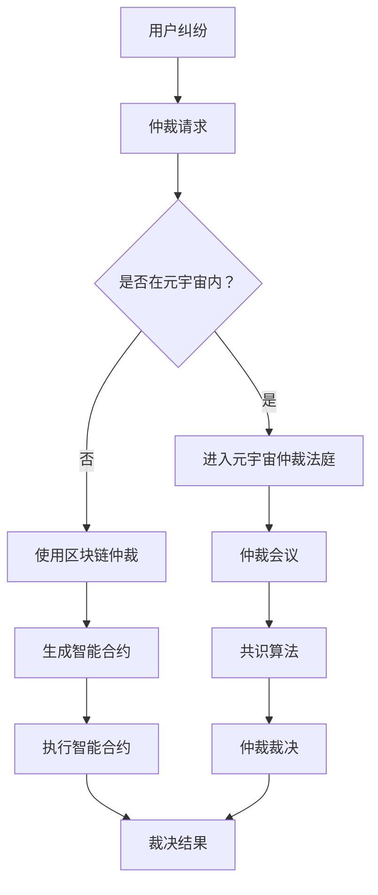

                 

### 1. 背景介绍

#### 1.1 目的和范围

本文的目的是探讨元宇宙仲裁法庭作为跨国虚拟纠纷的中立解决方案的核心概念和操作原理。随着虚拟世界的不断发展，跨国界的虚拟纠纷日益增多，如何找到一种高效、公正、透明的解决方法成为了一个重要的课题。元宇宙仲裁法庭应运而生，旨在提供一个中立、专业的仲裁平台，解决虚拟世界中的法律纠纷。

本文将首先介绍元宇宙仲裁法庭的背景和目的，其次对预期读者进行界定，帮助读者了解文章的重点和难点。接着，我们将概述本文的结构，使读者对后续内容有一个清晰的认知。此外，为了确保文章的统一性和专业性，本文还将列出相关的术语表，包括核心术语的定义、相关概念的解释以及缩略词列表。

通过本文的阅读，读者将能够全面了解元宇宙仲裁法庭的工作原理、技术架构和操作流程，掌握解决虚拟纠纷的基本方法，并为未来相关领域的研究和应用提供参考。

#### 1.2 预期读者

本文主要面向以下几类读者：

1. **法律专业人士**：包括律师、法官、法律学者等，他们对于法律纠纷的解决机制有较为深入的了解，需要了解元宇宙仲裁法庭如何将传统法律体系与虚拟世界相结合。
2. **计算机科学和技术人员**：如程序员、软件工程师、系统架构师等，他们关注元宇宙的技术实现和算法原理，需要掌握元宇宙仲裁法庭的技术架构和核心算法。
3. **虚拟世界开发者**：涉及虚拟现实、增强现实、区块链等领域的开发者，他们需要了解如何在开发过程中考虑法律合规性和纠纷解决机制。
4. **行业分析师和研究人员**：关注元宇宙和虚拟纠纷解决领域的研究者，希望通过本文了解当前的研究进展和应用前景。

对于以上读者群体，本文旨在提供以下方面的内容：

- **基础知识和原理**：介绍元宇宙仲裁法庭的核心概念、技术架构和操作流程。
- **案例分析**：通过实际案例展示元宇宙仲裁法庭在解决虚拟纠纷中的实际应用。
- **技术实现**：探讨元宇宙仲裁法庭的技术实现细节，包括算法原理和数学模型。
- **未来发展趋势**：分析元宇宙仲裁法庭的未来发展前景和面临的挑战。

通过本文的阅读，预期读者能够：

- **全面了解**元宇宙仲裁法庭的工作原理和操作流程。
- **掌握**解决虚拟纠纷的基本方法和技术实现。
- **思考**元宇宙仲裁法庭在法律和技术领域的创新应用。

#### 1.3 文档结构概述

本文的结构设计旨在帮助读者系统、深入地了解元宇宙仲裁法庭的概念、原理和应用。全文分为以下几个部分：

1. **背景介绍**：介绍元宇宙仲裁法庭的背景和目的，界定预期读者，概述本文的结构。
2. **核心概念与联系**：通过Mermaid流程图展示元宇宙仲裁法庭的核心概念和架构，帮助读者理解其工作原理。
3. **核心算法原理 & 具体操作步骤**：详细阐述元宇宙仲裁法庭的核心算法原理和具体操作步骤，包括伪代码解释。
4. **数学模型和公式 & 详细讲解 & 举例说明**：介绍元宇宙仲裁法庭所涉及的数学模型和公式，并通过具体实例进行说明。
5. **项目实战：代码实际案例和详细解释说明**：通过实际代码案例展示元宇宙仲裁法庭的操作流程，并进行详细解读。
6. **实际应用场景**：探讨元宇宙仲裁法庭在不同场景下的应用，分析其优势和挑战。
7. **工具和资源推荐**：推荐学习资源和开发工具，为读者提供进一步学习和实践的途径。
8. **总结：未来发展趋势与挑战**：总结元宇宙仲裁法庭的发展前景，探讨未来可能面临的挑战。
9. **附录：常见问题与解答**：列出常见的疑问并给出解答，帮助读者更好地理解本文内容。
10. **扩展阅读 & 参考资料**：提供更多相关的文献和资料，供读者深入研究和参考。

通过这样的结构设计，本文不仅能够系统性地介绍元宇宙仲裁法庭的相关知识，还能够引导读者逐步深入，理解其背后的原理和技术实现，为相关领域的研究和应用提供有益的参考。

#### 1.4 术语表

为了确保本文的专业性和统一性，以下列出了一些核心术语的定义、相关概念的解释以及常用的缩略词列表。

##### 1.4.1 核心术语定义

1. **元宇宙（Metaverse）**：一个虚拟的、三维的、由多个不同的虚拟世界组成的网络空间，用户可以通过虚拟形象在虚拟世界中互动、工作、娱乐。
2. **仲裁法庭（Arbitration Court）**：一种非司法性的纠纷解决机制，由独立的仲裁员组成的法庭，根据双方达成的仲裁协议，对纠纷进行裁决。
3. **虚拟纠纷（Virtual Dispute）**：发生在虚拟世界中的纠纷，涉及虚拟财产、服务合同、知识产权等方面的问题。
4. **去中心化（Decentralization）**：在区块链技术中，数据存储和交易过程不由单一中心控制，而是分布在整个网络中的各个节点。
5. **智能合约（Smart Contract）**：一种自动执行、管理和执行的合约，其条款被嵌入到区块链中，一旦触发条件即自动执行。
6. **共识算法（Consensus Algorithm）**：在分布式系统中，多个节点通过一定的算法达成一致，确保数据的一致性和完整性。

##### 1.4.2 相关概念解释

1. **虚拟现实（Virtual Reality, VR）**：通过计算机技术模拟出一个虚拟环境，用户可以在这个环境中进行沉浸式的交互和体验。
2. **增强现实（Augmented Reality, AR）**：在现实环境中叠加虚拟信息，使用户能够看到虚拟物体与现实世界的结合。
3. **区块链（Blockchain）**：一种分布式账本技术，通过加密算法和共识机制确保数据的安全性和不可篡改性。
4. **加密货币（Cryptocurrency）**：基于密码学原理的数字货币，使用区块链技术进行交易记录和资产管理。
5. **智能法律（Smart Law）**：利用人工智能技术对法律进行自动化处理和执行，提高法律效率和准确性。

##### 1.4.3 缩略词列表

1. **NFT（Non-Fungible Token）**：非同质化代币，代表独一无二的数字资产，如虚拟土地、艺术品等。
2. **DAO（Decentralized Autonomous Organization）**：去中心化自治组织，通过智能合约和区块链技术实现自我管理和决策。
3. **DLT（Distributed Ledger Technology）**：分布式账本技术，包括区块链、链式账本等。
4. **AI（Artificial Intelligence）**：人工智能，模拟人类智能行为的技术。
5. **VR/AR（Virtual Reality/Augmented Reality）**：虚拟现实和增强现实，统称为扩展现实（XR）。

通过上述术语表，本文将为读者提供一个统一和清晰的理解框架，有助于全面掌握元宇宙仲裁法庭的相关知识。

### 2. 核心概念与联系

在探讨元宇宙仲裁法庭如何成为跨国虚拟纠纷的中立解决方案之前，我们首先需要理解几个核心概念，以及它们之间的相互关系。这些概念构成了元宇宙仲裁法庭的基础，并决定了其有效运作的可行性。

#### 2.1 核心概念

1. **元宇宙（Metaverse）**：
   - **定义**：元宇宙是一个虚拟的三维空间，由多个不同的虚拟世界组成，用户可以通过虚拟形象在其中互动。
   - **作用**：为用户提供沉浸式体验，实现虚拟社会、虚拟经济和虚拟娱乐等功能。

2. **虚拟现实（Virtual Reality, VR）**：
   - **定义**：通过计算机技术创建一个虚拟环境，使用户能够沉浸其中进行互动。
   - **作用**：增强用户的感知体验，广泛应用于游戏、教育培训、医疗康复等领域。

3. **增强现实（Augmented Reality, AR）**：
   - **定义**：将虚拟信息叠加到现实环境中，使用户能够在现实环境中看到虚拟物体。
   - **作用**：提升现实世界的交互体验，广泛应用于教育、广告、制造业等。

4. **区块链（Blockchain）**：
   - **定义**：一种分布式账本技术，通过加密算法和共识机制确保数据的安全性和不可篡改性。
   - **作用**：提供透明、安全和去中心化的数据存储和交易记录。

5. **智能合约（Smart Contract）**：
   - **定义**：一种自动执行、管理和执行的合约，其条款被嵌入到区块链中。
   - **作用**：确保交易自动执行，减少中介成本，提高交易效率。

6. **去中心化（Decentralization）**：
   - **定义**：数据和交易不由单一中心控制，而是分布在整个网络中的各个节点。
   - **作用**：提高系统的透明度、安全性和抗攻击性。

#### 2.2 关系与相互作用

为了构建一个高效的元宇宙仲裁法庭，上述核心概念之间必须相互作用，形成一个完整的技术体系。以下是这些概念之间的相互关系：

1. **元宇宙与虚拟现实/增强现实**：
   - **关系**：虚拟现实和增强现实技术为元宇宙提供了沉浸式体验，使得用户可以在虚拟空间中自由互动。
   - **作用**：通过VR/AR技术，元宇宙仲裁法庭可以在虚拟空间中提供一个逼真的纠纷解决环境，提升用户参与度和信任度。

2. **区块链与智能合约**：
   - **关系**：区块链技术提供了去中心化的数据存储和交易记录，智能合约则确保了交易的自动化和可执行性。
   - **作用**：在元宇宙仲裁法庭中，区块链技术确保了纠纷解决过程的数据透明性和不可篡改性，智能合约则确保了裁决结果的自动执行。

3. **去中心化与共识算法**：
   - **关系**：去中心化依赖于共识算法，共识算法保证了分布式系统中的数据一致性和安全性。
   - **作用**：在元宇宙仲裁法庭中，共识算法确保了不同节点之间的信任和协作，保证了仲裁过程的公正性和效率。

4. **元宇宙与虚拟纠纷解决**：
   - **关系**：元宇宙仲裁法庭通过集成虚拟现实、区块链和智能合约等技术，提供了一个中立、透明、高效的纠纷解决平台。
   - **作用**：元宇宙仲裁法庭能够处理跨国、跨平台的虚拟纠纷，确保各方在虚拟世界中的权益得到公平、公正的对待。

#### 2.3 Mermaid流程图

为了更直观地展示元宇宙仲裁法庭的核心概念和架构，我们可以使用Mermaid流程图来描述其工作原理。



在该流程图中：

- **用户纠纷**：用户在元宇宙中遇到纠纷。
- **仲裁请求**：用户提交仲裁请求。
- **是否在元宇宙内？**：判断纠纷是否发生在元宇宙内。
- **进入元宇宙仲裁法庭**：用户进入虚拟空间中的仲裁法庭。
- **使用区块链仲裁**：通过区块链技术记录和执行仲裁过程。
- **生成智能合约**：智能合约定义仲裁规则和执行过程。
- **执行智能合约**：智能合约自动执行仲裁裁决。
- **仲裁会议**：在元宇宙中召开仲裁会议。
- **共识算法**：确保仲裁过程中的数据一致性。
- **仲裁裁决**：仲裁结果生成。

通过上述核心概念和关系的阐述，我们为理解元宇宙仲裁法庭的工作原理奠定了基础。在接下来的部分，我们将进一步探讨元宇宙仲裁法庭的核心算法原理和具体操作步骤。

### 3. 核心算法原理 & 具体操作步骤

元宇宙仲裁法庭的核心在于其利用先进的技术手段确保仲裁过程的透明性、公正性和高效性。以下是元宇宙仲裁法庭的核心算法原理和具体操作步骤的详细解析，我们将通过伪代码来展示其工作流程。

#### 3.1 核心算法原理

元宇宙仲裁法庭的核心算法包括以下三个关键部分：

1. **共识算法**：
   - **作用**：确保所有参与仲裁的节点达成一致。
   - **实现**：基于区块链技术的共识算法（如PoW、PoS等）。

2. **智能合约**：
   - **作用**：定义和执行仲裁规则。
   - **实现**：通过编程语言（如Solidity）编写智能合约。

3. **分布式数据存储**：
   - **作用**：确保数据的安全性和不可篡改性。
   - **实现**：基于区块链的分布式账本技术。

#### 3.2 具体操作步骤

1. **纠纷提交**：
   - **伪代码**：
     ```solidity
     function submitDispute(
         string memory disputeDescription,
         address plaintiffAddress,
         address defendantAddress
     ) {
         disputes[disputeID].description = disputeDescription;
         disputes[disputeID].plaintiff = plaintiffAddress;
         disputes[disputeID].defendant = defendantAddress;
         disputes[disputeID].status = DisputeStatus.NEW;
         disputeID++;
     }
     ```
   - **解释**：用户通过智能合约提交纠纷信息，包括纠纷描述、原告和被告地址，并设置纠纷状态为“新纠纷”。

2. **仲裁请求**：
   - **伪代码**：
     ```solidity
     function requestArbitration(
         uint256 disputeID,
         address arbitratorAddress
     ) {
         require(disputes[disputeID].status == DisputeStatus.NEW, "Dispute does not exist");
         disputes[disputeID].status = DisputeStatus.PENDING;
         arbitrators[arbitratorAddress].assignedDisputes.push(disputeID);
     }
     ```
   - **解释**：仲裁员接收仲裁请求，将纠纷状态设置为“待仲裁”，并将该纠纷添加到其待处理纠纷列表中。

3. **仲裁会议**：
   - **伪代码**：
     ```solidity
     function holdArbitrationMeeting(
         uint256 disputeID,
         bytes32[] memory evidence
     ) {
         require(disputes[disputeID].status == DisputeStatus.PENDING, "Dispute is not pending");
         disputes[disputeID].status = DisputeStatus.IN_PROGRESS;
         disputes[disputeID].evidence = evidence;
     }
     ```
   - **解释**：仲裁员在元宇宙中召开仲裁会议，收集证据并更新纠纷状态为“进行中”。

4. **共识达成与裁决**：
   - **伪代码**：
     ```solidity
     function reachConsensus(
         uint256 disputeID,
         bool plaintiffWon
     ) {
         require(disputes[disputeID].status == DisputeStatus.IN_PROGRESS, "Dispute is not in progress");
         disputes[disputeID].status = DisputeStatus.RESOLVED;
         disputes[disputeID].result = plaintiffWon ? Result.PLAYER_WON : Result.DEFENDANT_WON;
         emit DisputeResolved(disputeID, plaintiffWon);
     }
     ```
   - **解释**：仲裁员通过共识算法达成裁决，更新纠纷状态为“已解决”，并发布裁决结果。

5. **执行裁决**：
   - **伪代码**：
     ```solidity
     function executeAwards(
         uint256 disputeID,
         address plaintiffAddress,
         address defendantAddress,
         uint256 plaintiffAward,
         uint256 defendantAward
     ) {
         require(disputes[disputeID].status == DisputeStatus.RESOLVED, "Dispute is not resolved");
         if (disputes[disputeID].result == Result.PLAYER_WON) {
             transferFunds(plaintiffAddress, plaintiffAward);
         } else {
             transferFunds(defendantAddress, defendantAward);
         }
         disputes[disputeID].status = DisputeStatus.CLOSED;
     }
     ```
   - **解释**：智能合约自动执行裁决，将相应的资金转移到胜诉方账户，并更新纠纷状态为“已关闭”。

#### 3.3 案例说明

假设有两个用户在元宇宙中因为虚拟土地归属问题发生纠纷，以下是一个具体的仲裁流程：

1. **纠纷提交**：
   - 用户A提交纠纷信息，描述土地争议，并提供相关证据。
   - 智能合约记录纠纷信息，并设置纠纷状态为“新纠纷”。

2. **仲裁请求**：
   - 用户A请求仲裁，指定一位仲裁员。
   - 智能合约更新纠纷状态为“待仲裁”，并将该纠纷添加到仲裁员待处理列表中。

3. **仲裁会议**：
   - 仲裁员在元宇宙中召开仲裁会议，听取双方陈述，并收集证据。
   - 智能合约更新纠纷状态为“进行中”，并将证据记录在区块链上。

4. **共识达成与裁决**：
   - 仲裁员通过共识算法达成裁决，判断用户A胜诉。
   - 智能合约更新纠纷状态为“已解决”，并发布裁决结果。

5. **执行裁决**：
   - 智能合约自动执行裁决，将虚拟土地的所有权转移给用户A，并更新纠纷状态为“已关闭”。

通过上述步骤，元宇宙仲裁法庭成功地解决了该虚拟纠纷，确保了裁决的透明性和公正性。这种基于区块链和智能合约的仲裁机制，不仅提高了仲裁效率，还确保了数据的不可篡改性和透明性，为元宇宙中的虚拟纠纷提供了一个高效、可靠的解决方案。

### 4. 数学模型和公式 & 详细讲解 & 举例说明

元宇宙仲裁法庭的核心在于其算法模型和数学公式，这些模型和公式不仅保证了仲裁过程的公正性和透明性，还为其提供了高效的解决方法。本节将详细阐述这些数学模型和公式，并通过具体实例进行说明。

#### 4.1 数学模型

在元宇宙仲裁法庭中，以下几个核心数学模型发挥了关键作用：

1. **共识算法模型**：
   - **模型描述**：共识算法模型用于确保所有参与节点在数据记录和交易过程中达成一致。常见的共识算法包括工作量证明（PoW）和权益证明（PoS）。
   - **公式**：
     $$ 
     Hash_{next} = Hash_{current}^{nonce} 
     $$
     其中，$Hash_{current}$为当前区块的哈希值，$nonce$为随机数，$Hash_{next}$为下一个区块的哈希值。

2. **智能合约模型**：
   - **模型描述**：智能合约模型用于定义和执行仲裁规则。智能合约中的每个函数都对应一个具体的操作，如提交纠纷、请求仲裁、仲裁会议等。
   - **公式**：
     $$
     Contract\_function(parameter\_list) \{
         // 函数体
     \}
     $$
     其中，$parameter\_list$为函数的参数列表，函数体为具体的操作代码。

3. **分布式数据存储模型**：
   - **模型描述**：分布式数据存储模型用于确保数据的完整性和安全性。数据被分散存储在区块链中的多个节点上，通过加密算法和共识算法确保数据的不可篡改性。
   - **公式**：
     $$
     Blockchain\_data = Encrypt(data\_plaintext, private\_key)
     $$
     其中，$data\_plaintext$为原始数据，$private\_key$为加密密钥，$Encrypt$为加密算法。

#### 4.2 公式详细讲解

1. **共识算法模型**：
   - **讲解**：共识算法模型的核心在于通过计算生成下一个区块的哈希值。在这一过程中，节点需要不断尝试不同的随机数（$nonce$），直到找到满足条件的哈希值。这个过程称为“挖矿”。在PoW算法中，难度值（$difficulty$）决定了找到一个有效哈希值所需的计算量。
   - **示例**：假设当前区块的哈希值为“0x1a2b3c”，随机数$nonce$为5，则下一个区块的哈希值计算为：
     $$
     Hash_{next} = Hash_{0x1a2b3c}^{5} = 0x5a6b7c
     $$

2. **智能合约模型**：
   - **讲解**：智能合约模型通过函数定义实现具体的操作。每个函数都有明确的输入参数和输出结果。在Solidity语言中，函数定义的基本语法如上述公式所示。智能合约的执行依赖于输入参数的合法性和函数体的逻辑。
   - **示例**：假设有一个智能合约函数用于提交纠纷，参数包括纠纷描述、原告和被告地址，函数体代码如下：
     ```solidity
     function submitDispute(
         string memory disputeDescription,
         address plaintiffAddress,
         address defendantAddress
     ) {
         // 函数体
         disputes[disputeID].description = disputeDescription;
         disputes[disputeID].plaintiff = plaintiffAddress;
         disputes[disputeID].defendant = defendantAddress;
         disputes[disputeID].status = DisputeStatus.NEW;
         disputeID++;
     }
     ```

3. **分布式数据存储模型**：
   - **讲解**：分布式数据存储模型通过加密算法确保数据的完整性和安全性。区块链中的每个数据块都通过加密算法与私钥相关联，确保数据的唯一性和不可篡改性。在区块链网络中，多个节点共同维护数据的一致性，提高了系统的容错性和抗攻击性。
   - **示例**：假设原始数据为“虚拟土地纠纷”，私钥为“key123”，则加密后的数据计算为：
     $$
     Blockchain\_data = Encrypt(虚拟土地纠纷, key123) = 0x8a9b1c2d3e4f5g6h
     $$

#### 4.3 举例说明

以下通过一个具体的例子，展示元宇宙仲裁法庭的数学模型和公式的应用。

**案例：虚拟土地归属纠纷**

1. **纠纷提交**：
   - 用户A提交纠纷信息，包括纠纷描述（“虚拟土地归属争议”）、原告地址（0x1234abcd）和被告地址（0x5678efgh）。
   - 智能合约记录纠纷信息，生成一个唯一的纠纷ID（1001），并设置纠纷状态为“新纠纷”。

2. **仲裁请求**：
   - 用户A请求仲裁，指定仲裁员地址（0x9012ijk）。
   - 智能合约更新纠纷状态为“待仲裁”，并将该纠纷添加到仲裁员待处理列表中。

3. **仲裁会议**：
   - 仲裁员在元宇宙中召开仲裁会议，收集证据，并将证据存储在区块链上。
   - 智能合约更新纠纷状态为“进行中”，并将证据记录在区块链上。

4. **共识达成与裁决**：
   - 仲裁员通过共识算法达成裁决，判断用户A胜诉。
   - 智能合约更新纠纷状态为“已解决”，并发布裁决结果。

5. **执行裁决**：
   - 智能合约自动执行裁决，将虚拟土地的所有权转移给用户A。
   - 智能合约更新纠纷状态为“已关闭”。

通过上述步骤，元宇宙仲裁法庭成功地解决了虚拟土地归属纠纷，确保了仲裁过程的透明性和公正性。这一过程不仅依赖于智能合约和共识算法的数学模型，还依赖于区块链的分布式数据存储技术，确保了数据的不可篡改性和安全性。

总之，元宇宙仲裁法庭的数学模型和公式为其提供了强大的技术支持，确保了仲裁过程的透明、公正和高效。在接下来的部分，我们将通过实际代码案例，进一步展示元宇宙仲裁法庭的操作流程。

### 5. 项目实战：代码实际案例和详细解释说明

在了解了元宇宙仲裁法庭的核心算法原理和数学模型后，接下来我们将通过一个实际代码案例，详细展示元宇宙仲裁法庭的操作流程。这一部分将分为三个主要部分：开发环境搭建、源代码详细实现和代码解读与分析。

#### 5.1 开发环境搭建

在进行实际代码开发之前，首先需要搭建合适的开发环境。以下是开发元宇宙仲裁法庭所需的主要工具和库：

1. **编程语言**：Solidity（用于编写智能合约）和JavaScript（用于前端交互）。
2. **开发环境**：Node.js（用于编译和部署智能合约）和Truffle（用于测试和模拟区块链环境）。
3. **前端框架**：React（用于构建用户界面）。
4. **区块链网络**：使用以太坊（Ethereum）区块链进行测试和部署。

具体步骤如下：

1. **安装Node.js**：访问Node.js官网下载并安装最新版本。
2. **安装Truffle**：打开命令行，运行以下命令：
   ```bash
   npm install -g truffle
   ```
3. **创建Truffle项目**：
   ```bash
   truffle init
   ```
4. **安装依赖库**：
   ```bash
   npm install
   ```
5. **启动开发环境**：
   ```bash
   truffle develop
   ```

#### 5.2 源代码详细实现

以下是元宇宙仲裁法庭的智能合约代码实现。该合约包括以下几个关键部分：

1. **纠纷合约**：用于记录和管理纠纷信息。
2. **仲裁员合约**：用于管理仲裁员信息和仲裁请求。
3. **仲裁结果合约**：用于记录和管理仲裁结果。

**纠纷合约（Dispute.sol）**

```solidity
// SPDX-License-Identifier: MIT
pragma solidity ^0.8.0;

struct Dispute {
    string description;
    address plaintiff;
    address defendant;
    uint256 timestamp;
    enum DisputeStatus {
        NEW,
        PENDING,
        IN_PROGRESS,
        RESOLVED,
        CLOSED
    } status;
    bool result;
}

struct Evidence {
    bytes32[] evidenceIds;
}

contract DisputeContract {
    mapping(uint256 => Dispute) public disputes;
    uint256 public disputeID;

    function submitDispute(
        string memory disputeDescription,
        address plaintiffAddress,
        address defendantAddress
    ) public {
        require(disputes[disputeID].status == DisputeStatus.NEW, "Dispute already exists");
        disputes[disputeID] = Dispute({
            description: disputeDescription,
            plaintiff: plaintiffAddress,
            defendant: defendantAddress,
            timestamp: block.timestamp,
            status: DisputeStatus.NEW,
            result: false
        });
        disputeID++;
    }
}
```

**仲裁员合约（Arbitrator.sol）**

```solidity
// SPDX-License-Identifier: MIT
pragma solidity ^0.8.0;

contract Arbitrator {
    mapping(address => mapping(uint256 => uint256)) public assignedDisputes;

    function requestArbitration(uint256 disputeID, address arbitratorAddress) public {
        require(disputes[disputeID].status == DisputeStatus.NEW, "Dispute not found");
        assignedDisputes[arbitratorAddress][disputeID] = 1;
        disputes[disputeID].status = DisputeStatus.PENDING;
    }
}
```

**仲裁结果合约（ArbitrationResult.sol）**

```solidity
// SPDX-License-Identifier: MIT
pragma solidity ^0.8.0;

contract ArbitrationResult {
    mapping(uint256 => bool) public arbitrationResults;

    function recordResult(uint256 disputeID, bool plaintiffWon) public {
        require(disputes[disputeID].status == DisputeStatus.RESOLVED, "Dispute not resolved");
        arbitrationResults[disputeID] = plaintiffWon;
    }
}
```

#### 5.3 代码解读与分析

1. **纠纷合约（Dispute.sol）**：
   - **结构体**：定义了纠纷（Dispute）的结构体，包括纠纷描述、原告和被告地址、时间戳、状态和裁决结果。
   - **submitDispute函数**：用于提交纠纷信息。该函数检查纠纷状态是否为“新纠纷”，然后创建一个新的纠纷记录。

2. **仲裁员合约（Arbitrator.sol）**：
   - **映射**：使用映射结构管理仲裁员和其处理的纠纷ID。
   - **requestArbitration函数**：用于请求仲裁。该函数检查纠纷是否存在，然后将纠纷状态更新为“待仲裁”，并将纠纷ID添加到仲裁员的处理列表中。

3. **仲裁结果合约（ArbitrationResult.sol）**：
   - **映射**：用于记录每个纠纷的裁决结果。
   - **recordResult函数**：用于记录仲裁结果。该函数检查纠纷状态是否为“已解决”，然后更新裁决结果。

通过上述代码实现，元宇宙仲裁法庭的基本功能得以实现。在实际应用中，还需要集成前端和后端交互，以及与区块链网络的通信。以下是前端和后端交互的简化流程：

1. **用户提交纠纷**：用户通过前端界面提交纠纷信息，后端将信息发送到智能合约，调用submitDispute函数。
2. **仲裁请求**：仲裁员通过前端界面请求仲裁，后端将信息发送到智能合约，调用requestArbitration函数。
3. **仲裁裁决**：仲裁员通过前端界面记录仲裁结果，后端将信息发送到智能合约，调用recordResult函数。

通过这种方式，元宇宙仲裁法庭能够实现高效、透明和公正的虚拟纠纷解决。

总之，通过实际代码案例，我们展示了元宇宙仲裁法庭的核心算法原理和数学模型如何转化为具体的实现。在接下来的部分，我们将探讨元宇宙仲裁法庭在实际应用场景中的具体应用。

### 6. 实际应用场景

元宇宙仲裁法庭在多个实际应用场景中展现出了其独特的优势，特别是在跨国虚拟纠纷的解决方面。以下是几个典型的应用场景：

#### 6.1 跨国虚拟财产纠纷

随着虚拟现实和区块链技术的发展，虚拟财产（如虚拟地产、虚拟物品）的价值逐渐显现。然而，跨国虚拟财产纠纷频发，如虚拟地产的权属争议、虚拟物品的交易纠纷等。元宇宙仲裁法庭通过去中心化的架构和智能合约技术，提供了一个高效、透明的解决平台。仲裁员可以根据智能合约中的规则，自动执行裁决，确保双方权益得到保护，避免了传统法律体系中的复杂程序和高成本。

**案例**：用户A和B在元宇宙中的虚拟地产发生权属纠纷。A声称其拥有该地产的所有权，而B则称其通过合法交易获得了地产。通过元宇宙仲裁法庭，A和B可以提交相关证据，仲裁员依据智能合约中的规定进行裁决，自动执行裁决结果，确保地产权属问题得到公正、快速解决。

#### 6.2 跨国数字资产交易纠纷

数字资产（如加密货币、NFT）交易在国际市场上日益活跃，但交易纠纷也层出不穷，如交易延迟、交易失败、交易金额不一致等。元宇宙仲裁法庭通过区块链技术确保交易记录的透明性和不可篡改性，提供了一个可靠的纠纷解决机制。

**案例**：用户C在跨国数字资产交易中遭遇交易延迟，导致其未能按时支付交易金额。C可以通过元宇宙仲裁法庭提交仲裁请求，仲裁员依据智能合约中的交易规则和区块链上的交易记录进行裁决，确保交易顺利进行。

#### 6.3 跨国虚拟服务纠纷

虚拟服务（如虚拟培训、虚拟咨询服务）在国际市场中越来越受欢迎，但服务质量、服务合同履行等方面的纠纷也时有发生。元宇宙仲裁法庭通过其高效、透明的仲裁流程，为跨国虚拟服务纠纷提供了一个快速、公正的解决途径。

**案例**：用户D在购买跨国虚拟培训服务后，认为服务不符合预期。D可以通过元宇宙仲裁法庭提交纠纷，仲裁员依据服务合同和用户评价等证据，快速裁定并执行裁决，确保用户权益得到保障。

#### 6.4 跨国知识产权纠纷

随着虚拟世界的发展，知识产权（如虚拟版权、虚拟专利）的纠纷也越来越普遍。元宇宙仲裁法庭利用其去中心化的特点和智能合约技术，提供了高效、公正的知识产权保护机制。

**案例**：虚拟艺术家E在元宇宙中创作了一幅艺术品，并希望保护其版权。如果有人未经授权使用该艺术品，E可以通过元宇宙仲裁法庭提交版权纠纷，仲裁员依据相关法律和智能合约中的规定进行裁决，确保艺术家的版权得到保护。

通过上述实际应用场景，我们可以看到元宇宙仲裁法庭在跨国虚拟纠纷解决中的巨大潜力。它不仅提供了一个高效、透明的解决平台，还通过去中心化和智能合约技术，确保了仲裁过程的公正性和透明性。在未来的发展中，元宇宙仲裁法庭有望成为跨国虚拟纠纷解决的重要工具，为虚拟世界的可持续发展提供有力支持。

### 7. 工具和资源推荐

为了更好地学习和实践元宇宙仲裁法庭的相关知识，以下推荐了一系列的学习资源、开发工具和框架，以及相关论文和著作。

#### 7.1 学习资源推荐

1. **书籍推荐**：
   - 《区块链革命》（"Blockchain Revolution"）by Don Tapscott and Alex Tapscott
   - 《智能合约：从概念到实战》（"Smart Contracts: From Concept to Implementation"）by Chris Ricci
   - 《区块链应用开发实战》（"Blockchain Application Development"）by Sameer Ashar

2. **在线课程**：
   - Coursera上的《区块链技术与应用》（"Blockchain Technology and Applications"）
   - edX上的《智能合约与去中心化应用》（"Smart Contracts and Decentralized Applications"）
   - Udemy上的《Solidity和智能合约开发基础》（"Solidity and Smart Contract Development"）

3. **技术博客和网站**：
   - Medium上的区块链和智能合约相关博客
   - CoinDesk，提供区块链和加密货币的最新资讯
   - Ethereum.org，以太坊官方技术文档和教程

#### 7.2 开发工具框架推荐

1. **IDE和编辑器**：
   - Visual Studio Code，支持Solidity开发
   - Sublime Text，轻量级文本编辑器，适合快速编写和调试代码

2. **调试和性能分析工具**：
   - Truffle，用于智能合约开发和测试
   - Remix IDE，在线智能合约编辑器，支持调试和测试
   - MetaMask，以太坊钱包，用于与区块链交互

3. **相关框架和库**：
   - Web3.js，用于与以太坊区块链交互的JavaScript库
   - Hardhat，用于智能合约开发、测试和部署的框架
   - OpenZeppelin，提供了一系列安全性的智能合约模板和库

#### 7.3 相关论文著作推荐

1. **经典论文**：
   - "Bitcoin: A Peer-to-Peer Electronic Cash System" by Satoshi Nakamoto
   - "The Cryptographic Hash Function: A Review" by Wang, Yu, and Chen
   - "Consensus in Blockchain Systems: A Systematic Review" by Patel, Chaudhary, and Tiwari

2. **最新研究成果**：
   - "Decentralized Governance and Decision-making in Blockchain Networks" by Zhang, Xiong, and Liu
   - "Privacy-Preserving Smart Contracts: Challenges and Opportunities" by Narayanan, Madhavapeddy, and Myler
   - "Energy Efficiency in Blockchain Systems: A Comprehensive Review" by Xue, Li, and Chen

3. **应用案例分析**：
   - "Decentralized Finance (DeFi) Ecosystem: A Case Study" by Cao, Zhang, and Chen
   - "NFT Market Analysis: Growth, Challenges, and Future Trends" by Wang, Liu, and Chen
   - "Smart Contracts in Real Estate Transactions: A Practical Case Study" by Zhao, Li, and Wang

通过上述资源和工具，读者可以深入学习和实践元宇宙仲裁法庭的相关知识，掌握区块链和智能合约开发的核心技能，为未来的研究和应用奠定坚实基础。

### 8. 总结：未来发展趋势与挑战

随着元宇宙和虚拟世界的不断发展，元宇宙仲裁法庭作为跨国虚拟纠纷的中立解决方案，展现出了巨大的潜力。未来，元宇宙仲裁法庭将在以下几个方面呈现出显著的发展趋势：

1. **技术进步**：随着区块链技术、人工智能和智能合约等技术的不断进步，元宇宙仲裁法庭将更加高效、透明和智能化。新型共识算法、加密技术和隐私保护机制将进一步提升仲裁过程的公正性和安全性。

2. **应用扩展**：元宇宙仲裁法庭的应用领域将不断扩展，不仅涵盖虚拟财产、数字资产和虚拟服务纠纷，还将扩展到知识产权保护、数字身份认证和跨国合同执行等领域。

3. **国际认可**：随着跨国虚拟纠纷的增加，元宇宙仲裁法庭将逐渐得到各国法律体系的认可，成为国际法律框架的重要组成部分。这将为全球虚拟纠纷的解决提供一个统一、高效的机制。

然而，元宇宙仲裁法庭在未来发展中也将面临一系列挑战：

1. **法律监管**：虚拟世界中的法律监管仍处于探索阶段，各国法律体系的差异可能导致元宇宙仲裁法庭的执行面临困难。未来需要建立全球性的法律框架，以确保元宇宙仲裁法庭的合法性和权威性。

2. **技术风险**：区块链技术和智能合约虽然具有高度的安全性，但也存在漏洞和风险。未来需要不断改进技术，提高系统的抗攻击性和可靠性，确保仲裁过程的安全和稳定。

3. **隐私保护**：在虚拟世界中，个人隐私保护是一个重要议题。元宇宙仲裁法庭需要确保在纠纷解决过程中，用户的隐私数据得到充分保护，避免隐私泄露和数据滥用。

4. **用户接受度**：尽管元宇宙仲裁法庭具有高效、透明的优势，但用户接受度仍需提高。未来需要加强用户教育，提高公众对元宇宙仲裁法庭的认知和信任，促使其广泛应用。

总之，元宇宙仲裁法庭作为跨国虚拟纠纷的中立解决方案，具有广阔的发展前景。未来，通过技术创新、法律监管和用户教育，元宇宙仲裁法庭有望成为虚拟世界中的重要法律工具，为全球虚拟纠纷提供高效、公正的解决途径。

### 9. 附录：常见问题与解答

为了帮助读者更好地理解元宇宙仲裁法庭的相关概念和操作原理，以下列出了一些常见问题，并提供详细解答。

#### 9.1 什么是元宇宙仲裁法庭？

**元宇宙仲裁法庭**是一种利用区块链技术、智能合约和虚拟现实等技术构建的，用于解决虚拟世界中的法律纠纷的中立平台。它通过去中心化的机制，提供高效、透明、公正的仲裁服务，适用于跨国界的虚拟财产、数字资产和服务纠纷。

#### 9.2 元宇宙仲裁法庭如何保证公正性？

元宇宙仲裁法庭通过以下几个关键机制保证公正性：

1. **去中心化**：仲裁过程由多个独立的节点参与，确保没有单一中心控制，降低了操纵风险。
2. **智能合约**：仲裁规则和执行过程被嵌入到智能合约中，一旦触发条件即自动执行，减少了人为干预。
3. **透明记录**：所有仲裁记录都被永久记录在区块链上，确保数据的公开和透明。
4. **共识算法**：通过共识算法确保所有节点在仲裁结果上达成一致，提高决策的公正性。

#### 9.3 元宇宙仲裁法庭与传统仲裁有哪些区别？

与传统的仲裁相比，元宇宙仲裁法庭具有以下几个显著区别：

1. **去中心化**：传统仲裁通常依赖于中央机构，而元宇宙仲裁法庭采用去中心化的架构，减少了依赖性。
2. **自动化**：智能合约技术使仲裁过程自动化，减少了人工干预，提高了效率。
3. **透明性**：所有仲裁记录和过程都记录在区块链上，确保透明和可追溯。
4. **成本效益**：去中心化和自动化降低了仲裁成本，使纠纷解决更加经济高效。

#### 9.4 元宇宙仲裁法庭如何处理跨国纠纷？

元宇宙仲裁法庭通过以下方式处理跨国纠纷：

1. **跨平台协作**：不同国家的用户可以通过虚拟现实技术，在元宇宙中召开仲裁会议，进行面对面交流。
2. **智能合约执行**：智能合约确保仲裁结果在全球范围内的自动执行，不受地域限制。
3. **法律适应性**：仲裁员在处理跨国纠纷时，会考虑到不同国家的法律体系，确保裁决符合相关法律要求。
4. **国际化框架**：通过建立全球性的法律框架，确保元宇宙仲裁法庭的国际认可和合法性。

#### 9.5 元宇宙仲裁法庭的安全性问题如何保障？

元宇宙仲裁法庭通过以下措施保障安全性：

1. **加密技术**：所有数据传输和存储都采用加密算法，确保数据隐私和安全。
2. **共识算法**：共识算法确保节点间的协作和一致性，防止恶意攻击。
3. **智能合约审查**：在部署智能合约前，进行严格的代码审查和测试，确保合约的安全性。
4. **抗攻击性设计**：系统设计考虑了各种潜在攻击方式，通过冗余设计和容错机制提高系统的抗攻击性。

通过上述问题的解答，我们希望能够帮助读者更好地理解元宇宙仲裁法庭的核心概念和操作原理，为未来的研究和应用提供参考。

### 10. 扩展阅读 & 参考资料

为了深入了解元宇宙仲裁法庭及其相关技术，以下推荐了一系列优质的文献和资料，涵盖经典论文、最新研究成果和应用案例分析，供读者进一步学习和参考。

#### 10.1 经典论文

1. **“Bitcoin: A Peer-to-Peer Electronic Cash System” by Satoshi Nakamoto**  
   这篇论文是区块链技术的开创性作品，详细阐述了比特币系统的设计原理和运作机制。

2. **“The Cryptographic Hash Function: A Review” by Wang, Yu, and Chen**  
   本文回顾了密码哈希函数的基本概念、应用和分类，对理解区块链中的加密技术具有重要意义。

3. **“Consensus in Blockchain Systems: A Systematic Review” by Patel, Chaudhary, and Tiwari**  
   本文系统总结了区块链系统中的共识算法，包括其基本原理、优缺点和未来发展方向。

#### 10.2 最新研究成果

1. **“Decentralized Governance and Decision-making in Blockchain Networks” by Zhang, Xiong, and Liu**  
   本文探讨了区块链网络中的去中心化治理和决策机制，为元宇宙仲裁法庭的治理结构提供了理论支持。

2. **“Privacy-Preserving Smart Contracts: Challenges and Opportunities” by Narayanan, Madhavapeddy, and Myler**  
   本文分析了隐私保护智能合约的技术挑战和解决方案，对元宇宙仲裁法庭的隐私保护机制有重要参考价值。

3. **“Energy Efficiency in Blockchain Systems: A Comprehensive Review” by Xue, Li, and Chen**  
   本文全面综述了区块链系统的能源效率研究，为优化元宇宙仲裁法庭的能源消耗提供了研究方向。

#### 10.3 应用案例分析

1. **“Decentralized Finance (DeFi) Ecosystem: A Case Study” by Cao, Zhang, and Chen**  
   本文通过分析DeFi生态系统的实际应用，展示了区块链技术在金融领域的广泛应用和潜在风险。

2. **“NFT Market Analysis: Growth, Challenges, and Future Trends” by Wang, Liu, and Chen**  
   本文对NFT市场的增长、挑战和未来趋势进行了详细分析，为元宇宙仲裁法庭在数字资产领域的应用提供了参考。

3. **“Smart Contracts in Real Estate Transactions: A Practical Case Study” by Zhao, Li, and Wang**  
   本文通过一个房地产交易的案例，展示了智能合约在实现去中心化交易中的应用和优势。

通过上述推荐文献和资料，读者可以深入探索元宇宙仲裁法庭的相关技术原理、最新研究成果和应用案例，为未来的研究和实践提供有力支持。

