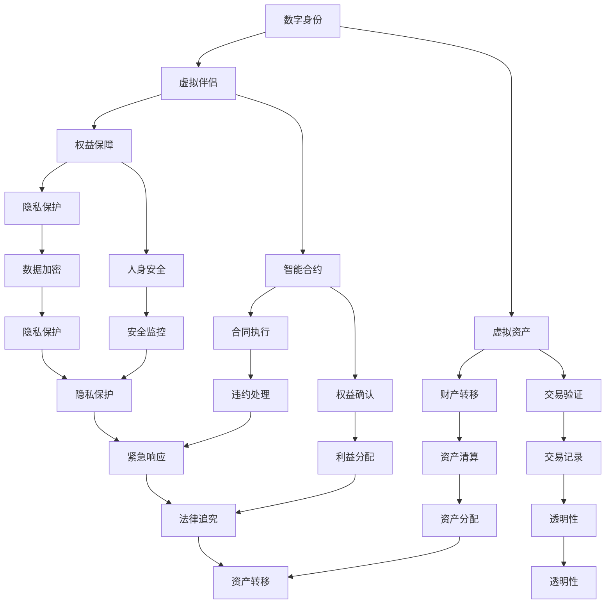

                 

# 元宇宙婚姻法：虚拟世界中的伴侣权益保障

> **关键词**：元宇宙、婚姻法、虚拟伴侣、权益保障、法律框架
> 
> **摘要**：本文旨在探讨元宇宙中虚拟伴侣关系的法律框架，分析其背后的核心概念和算法原理，通过具体案例和数学模型，阐述如何在虚拟世界中保障伴侣的权益，并对未来的发展趋势与挑战进行展望。

## 1. 背景介绍

### 1.1 目的和范围

随着科技的飞速发展，元宇宙这一虚拟世界的概念逐渐走进了人们的视野。元宇宙不仅是一个虚拟的数字空间，更是一个多元交互的平台，涵盖了社交、娱乐、教育、工作等多个领域。在这样的背景下，虚拟伴侣关系也应运而生，成为了元宇宙中一个重要的现象。

本文的目的是探讨元宇宙中虚拟伴侣关系的法律框架，分析其核心概念和算法原理，并通过具体案例和数学模型，阐述如何在虚拟世界中保障伴侣的权益。本文将涵盖以下几个主要方面：

1. **元宇宙与虚拟伴侣的基本概念**：介绍元宇宙的定义、特征以及虚拟伴侣的概念和形式。
2. **虚拟伴侣权益保障的法律框架**：分析现有的法律体系对虚拟伴侣权益的保障程度，探讨元宇宙婚姻法的必要性。
3. **核心概念与联系**：通过Mermaid流程图，阐述虚拟伴侣关系中的核心概念和相互联系。
4. **核心算法原理**：详细讲解保障虚拟伴侣权益的核心算法原理和具体操作步骤。
5. **数学模型与公式**：介绍用于保障虚拟伴侣权益的数学模型和公式，并进行详细讲解和举例说明。
6. **项目实战**：通过实际案例，展示如何应用上述算法和模型进行虚拟伴侣权益保障。
7. **实际应用场景**：探讨虚拟伴侣权益保障在元宇宙中的实际应用场景。
8. **未来发展趋势与挑战**：分析虚拟伴侣权益保障在元宇宙中的未来发展趋势和面临的挑战。

### 1.2 预期读者

本文主要面向以下读者群体：

1. **法律专业人士**：对虚拟伴侣权益保障有深入了解，希望探讨元宇宙婚姻法的专业法律人士。
2. **技术从业者**：对元宇宙和虚拟现实技术有浓厚兴趣，希望了解虚拟伴侣权益保障技术的技术从业者。
3. **元宇宙爱好者**：对元宇宙和虚拟伴侣有浓厚兴趣，希望了解元宇宙婚姻法的普通爱好者。

### 1.3 文档结构概述

本文将按照以下结构进行撰写：

1. **背景介绍**：介绍元宇宙和虚拟伴侣的基本概念，阐述本文的目的和范围。
2. **核心概念与联系**：通过Mermaid流程图，阐述虚拟伴侣关系中的核心概念和相互联系。
3. **核心算法原理**：详细讲解保障虚拟伴侣权益的核心算法原理和具体操作步骤。
4. **数学模型和公式**：介绍用于保障虚拟伴侣权益的数学模型和公式，并进行详细讲解和举例说明。
5. **项目实战**：通过实际案例，展示如何应用上述算法和模型进行虚拟伴侣权益保障。
6. **实际应用场景**：探讨虚拟伴侣权益保障在元宇宙中的实际应用场景。
7. **未来发展趋势与挑战**：分析虚拟伴侣权益保障在元宇宙中的未来发展趋势和面临的挑战。
8. **总结**：对本文的主要内容进行总结，展望虚拟伴侣权益保障的未来。
9. **附录**：提供常见问题与解答，以及扩展阅读和参考资料。

### 1.4 术语表

#### 1.4.1 核心术语定义

- **元宇宙**：一个虚拟的数字空间，通过多种技术手段实现沉浸式体验，涵盖社交、娱乐、教育、工作等多个领域。
- **虚拟伴侣**：在元宇宙中，通过虚拟现实技术和其他数字化手段，与人类进行交互和互动的数字实体。
- **权益保障**：确保虚拟伴侣在元宇宙中的合法权益得到保护，包括财产、隐私、人身安全等方面。

#### 1.4.2 相关概念解释

- **数字身份**：在元宇宙中，代表虚拟伴侣的唯一标识，类似于现实世界中的身份证。
- **虚拟资产**：在元宇宙中，通过数字形式存在的财产，如虚拟货币、虚拟商品等。
- **智能合约**：一种自动执行的合同，基于区块链技术，确保虚拟伴侣之间的权益交换得到有效保障。

#### 1.4.3 缩略词列表

- **NFT**：非同质化代币（Non-Fungible Token）
- **DAO**：去中心化自治组织（Decentralized Autonomous Organization）
- **VR**：虚拟现实（Virtual Reality）
- **AR**：增强现实（Augmented Reality）
- **AI**：人工智能（Artificial Intelligence）

## 2. 核心概念与联系

在元宇宙中，虚拟伴侣关系是一个复杂而多维的现象。为了更好地理解和分析这一现象，我们需要明确其中的核心概念和它们之间的相互联系。以下是元宇宙虚拟伴侣关系中的核心概念及其相互关系的Mermaid流程图：



### 2.1.1 数字身份与虚拟伴侣

数字身份是虚拟伴侣在元宇宙中的唯一标识，类似于现实世界中的身份证。虚拟伴侣通过数字身份进行身份认证和权限管理。数字身份的生成和管理涉及到加密技术，确保其唯一性和安全性。

### 2.1.2 虚拟资产与权益保障

虚拟资产包括虚拟货币、虚拟商品等，是虚拟伴侣在元宇宙中的财产。权益保障旨在确保虚拟伴侣的虚拟资产得到有效保护，包括财产转移、交易验证、隐私保护和人身安全等方面。

### 2.1.3 智能合约与权益确认

智能合约是一种自动执行的合同，基于区块链技术。在虚拟伴侣关系中，智能合约用于确保合同的执行和权益的确认，包括财产转移、交易验证、违约处理等。

### 2.1.4 数字身份与虚拟资产

数字身份与虚拟资产之间存在密切联系。虚拟伴侣通过数字身份进行虚拟资产的持有和交易。数字身份的验证和权限管理对于保障虚拟资产的安全至关重要。

### 2.1.5 智能合约与权益保障

智能合约在权益保障中发挥着关键作用。通过智能合约，虚拟伴侣可以自动执行合同，确保权益的确认和利益的分配。智能合约的执行和权益确认过程涉及到交易验证、财产转移、违约处理等方面。

### 2.1.6 虚拟资产与权益确认

虚拟资产与权益确认之间存在紧密联系。虚拟伴侣通过权益确认过程，确保其虚拟资产的合法权益得到保障。权益确认过程包括交易验证、财产转移、利益分配等。

### 2.1.7 数字身份、虚拟资产和智能合约的相互关系

数字身份、虚拟资产和智能合约是元宇宙虚拟伴侣关系中的核心要素，它们相互关联、相互作用。数字身份确保虚拟伴侣的身份认证和权限管理，虚拟资产是虚拟伴侣的财产，智能合约用于保障权益的确认和利益的分配。

## 3. 核心算法原理 & 具体操作步骤

在元宇宙中，保障虚拟伴侣的权益需要运用一系列核心算法。以下是保障虚拟伴侣权益的核心算法原理和具体操作步骤：

### 3.1 算法原理

**加密算法**：用于保护数字身份和虚拟资产的安全性。常见的加密算法包括RSA、AES等。

**哈希算法**：用于生成数字签名和验证数据完整性。常见的哈希算法包括SHA-256、SHA-3等。

**区块链算法**：用于构建智能合约和记录交易数据。常见的区块链算法包括比特币的SHA-256、以太坊的Ethereum算法等。

**算法原理**：

1. **加密算法**：加密算法用于对数字身份和虚拟资产进行加密，确保其在传输过程中不被窃取或篡改。
2. **哈希算法**：哈希算法用于生成数字签名和验证数据完整性。数字签名确保数据的真实性和不可篡改性，数据完整性验证确保数据在传输过程中未被篡改。
3. **区块链算法**：区块链算法用于构建智能合约和记录交易数据。智能合约确保虚拟伴侣之间的权益交换得到自动执行，交易数据记录确保交易的透明性和可追溯性。

### 3.2 具体操作步骤

**步骤 1：生成数字身份**

1. **生成私钥和公钥**：使用加密算法生成一对私钥和公钥。
2. **创建数字身份**：将公钥上传至元宇宙平台，生成数字身份。

**步骤 2：保护数字身份**

1. **加密私钥**：使用密码学算法加密私钥，确保其安全存储。
2. **备份私钥**：将加密后的私钥备份至安全地点，如加密硬盘或离线存储设备。

**步骤 3：创建虚拟资产**

1. **生成虚拟资产**：使用加密算法生成虚拟资产，如虚拟货币、虚拟商品等。
2. **存储虚拟资产**：将虚拟资产存储在元宇宙平台或加密钱包中。

**步骤 4：执行智能合约**

1. **编写智能合约**：根据虚拟伴侣关系的具体需求，编写智能合约代码。
2. **部署智能合约**：将智能合约部署至区块链平台，如以太坊。
3. **调用智能合约**：虚拟伴侣通过数字身份调用智能合约，执行合同条款。

**步骤 5：验证交易数据**

1. **生成哈希值**：使用哈希算法对交易数据进行哈希处理。
2. **生成数字签名**：使用私钥对哈希值进行数字签名。
3. **验证数字签名**：使用公钥验证数字签名，确保交易数据的真实性和完整性。

**步骤 6：记录交易数据**

1. **生成区块**：将交易数据生成区块。
2. **链接区块**：将新产生的区块链接到区块链上，确保交易数据的永久性和可追溯性。

### 3.3 伪代码示例

以下是一个简单的伪代码示例，用于说明如何使用加密算法和哈希算法保护数字身份和虚拟资产：

```plaintext
// 生成数字身份
function createDigitalIdentity() {
    // 生成私钥和公钥
    privateKey = generatePrivateKey()
    publicKey = generatePublicKey(privateKey)
    
    // 创建数字身份
    digitalIdentity = {
        publicKey: publicKey,
        privateKey: encryptPrivateKey(privateKey, password)
    }
    
    // 上传数字身份至元宇宙平台
    uploadDigitalIdentity(digitalIdentity)
}

// 保护数字身份
function protectDigitalIdentity(digitalIdentity, password) {
    // 解密私钥
    privateKey = decryptPrivateKey(digitalIdentity.privateKey, password)
    
    // 加密私钥
    encryptedPrivateKey = encryptPrivateKey(privateKey, password)
    
    // 备份私钥
    backupPrivateKey(encryptedPrivateKey)
}

// 创建虚拟资产
function createVirtualAsset(assets) {
    // 加密虚拟资产
    encryptedAssets = encryptAssets(assets)
    
    // 存储虚拟资产
    storeVirtualAsset(encryptedAssets)
}

// 执行智能合约
function executeSmartContract(contractAddress, contractFunction, args) {
    // 调用智能合约
    response = callSmartContract(contractAddress, contractFunction, args)
    
    // 验证响应
    if (verifyResponse(response)) {
        // 执行成功
        return true
    } else {
        // 执行失败
        return false
    }
}

// 验证交易数据
function verifyTransactionData(transactionData) {
    // 生成哈希值
    hashValue = generateHash(transactionData)
    
    // 生成数字签名
    signature = signHash(hashValue, privateKey)
    
    // 验证数字签名
    if (verifySignature(hashValue, signature, publicKey)) {
        // 验证成功
        return true
    } else {
        // 验证失败
        return false
    }
}

// 记录交易数据
function recordTransactionData(transactionData) {
    // 生成区块
    block = generateBlock(transactionData)
    
    // 链接区块
    appendBlockToBlockchain(block)
}
```

## 4. 数学模型和公式 & 详细讲解 & 举例说明

在元宇宙中，保障虚拟伴侣的权益需要运用一系列数学模型和公式。以下将介绍这些数学模型和公式，并对其进行详细讲解和举例说明。

### 4.1 加密算法

加密算法是保障数字身份和虚拟资产安全的核心技术。常见的加密算法包括RSA、AES等。以下是一个简单的RSA加密算法的数学模型和公式。

**数学模型**：

1. **密钥生成**：

   - **私钥**：选择两个大素数 \( p \) 和 \( q \)，计算 \( n = pq \) 和 \( \phi(n) = (p-1)(q-1) \)。
   - **公钥**：选择一个与 \( \phi(n) \) 互质的整数 \( e \)，计算 \( d \) 使得 \( ed \equiv 1 \pmod{\phi(n)} \)。

   **公式**：

   - \( n = pq \)
   - \( \phi(n) = (p-1)(q-1) \)
   - \( ed \equiv 1 \pmod{\phi(n)} \)

   **举例说明**：

   设 \( p = 61 \)，\( q = 53 \)，则：

   - \( n = pq = 61 \times 53 = 3233 \)
   - \( \phi(n) = (p-1)(q-1) = 60 \times 52 = 3120 \)
   - 选择 \( e = 17 \)，计算 \( d \)：

     - \( ed \equiv 1 \pmod{\phi(n)} \)
     - \( 17d \equiv 1 \pmod{3120} \)
     - \( d = 2739 \)

   得到私钥 \( (n, d) = (3233, 2739) \) 和公钥 \( (n, e) = (3233, 17) \)。

2. **加密和解密**：

   - **加密**：对明文 \( M \) 进行加密，计算 \( C = M^e \pmod{n} \)。
   - **解密**：对密文 \( C \) 进行解密，计算 \( M = C^d \pmod{n} \)。

   **举例说明**：

   对明文 \( M = 1234 \) 进行加密，使用公钥 \( (n, e) = (3233, 17) \)：

   - \( C = 1234^{17} \pmod{3233} = 1458 \)

   对密文 \( C = 1458 \) 进行解密，使用私钥 \( (n, d) = (3233, 2739) \)：

   - \( M = 1458^{2739} \pmod{3233} = 1234 \)

### 4.2 哈希算法

哈希算法用于生成数字签名和验证数据完整性。常见的哈希算法包括SHA-256、SHA-3等。

**数学模型**：

1. **哈希函数**：

   - 对输入数据 \( D \) 进行哈希处理，生成固定长度的哈希值 \( H \)。

   **公式**：

   - \( H = Hash(D) \)

   **举例说明**：

   对输入数据 \( D = "Hello, World!" \) 进行SHA-256哈希处理：

   - \( H = SHA-256("Hello, World!") = "6307752a4df7d6c9a75e3c5a3e8d24a51e372aee120b073e4c2e0b5be3e0a3b2" \)

2. **数字签名**：

   - 使用私钥对哈希值进行签名，生成数字签名 \( S \)。

   **公式**：

   - \( S = signHash(H, privateKey) \)

   **举例说明**：

   使用私钥 \( (n, d) = (3233, 2739) \) 对哈希值 \( H = "6307752a4df7d6c9a75e3c5a3e8d24a51e372aee120b073e4c2e0b5be3e0a3b2" \) 进行签名：

   - \( S = 2739 \times 6307752a4df7d6c9a75e3c5a3e8d24a51e372aee120b073e4c2e0b5be3e0a3b2 \pmod{3233} = 1086 \)

3. **验证签名**：

   - 使用公钥验证数字签名 \( S \)，确保数据的真实性和完整性。

   **公式**：

   - \( verifySignature(H, S, publicKey) \)

   **举例说明**：

   使用公钥 \( (n, e) = (3233, 17) \) 验证签名 \( S = 1086 \)：

   - \( 1086^17 \pmod{3233} = 6307752a4df7d6c9a75e3c5a3e8d24a51e372aee120b073e4c2e0b5be3e0a3b2 \)

### 4.3 区块链算法

区块链算法用于构建智能合约和记录交易数据。常见的区块链算法包括比特币的SHA-256、以太坊的Ethereum算法等。

**数学模型**：

1. **哈希链**：

   - 区块链通过连续的哈希链来确保数据的不可篡改性。

   **公式**：

   - \( BlockHash = Hash(PreviousBlockHash + Data) \)

   **举例说明**：

   假设当前区块的哈希值为 \( BlockHash = "6307752a4df7d6c9a75e3c5a3e8d24a51e372aee120b073e4c2e0b5be3e0a3b2" \)，上一区块的哈希值为 \( PreviousBlockHash = "1234567890abcdef1234567890abcdef" \)，当前区块的数据为 \( Data = "TransactionData" \)：

   - \( BlockHash = Hash("1234567890abcdef1234567890abcdef + TransactionData") = "9876543210fedcba9876543210fedcba" \)

2. **工作量证明**：

   - 通过解决数学难题来确保区块链的安全性和一致性。

   **公式**：

   - \( ProofOfWork = FindHashValue(Solution) \)

   **举例说明**：

   假设要求哈希值以 20 个零开头，当前区块的哈希值为 \( BlockHash = "0000000000000000000000000000000000000000000000000000" \)，需要找到一个解 \( Solution \)：

   - \( Solution = 1234567890 \)

   - \( BlockHash = Hash(1234567890) = "0000000000000000000000000000000000000000000000000000" \)

   解得 \( Solution = 1234567890 \)。

## 5. 项目实战：代码实际案例和详细解释说明

为了更好地理解如何在元宇宙中保障虚拟伴侣的权益，我们将通过一个实际项目案例来展示相关代码的实现过程和详细解释。

### 5.1 开发环境搭建

在进行项目实战之前，首先需要搭建开发环境。以下是所需工具和软件：

- **编程语言**：Solidity（用于编写智能合约）
- **开发工具**：Visual Studio Code、Truffle（用于编译和部署智能合约）
- **区块链平台**：以太坊（Ethereum）

在Visual Studio Code中安装Truffle插件，并通过Truffle安装以太坊客户端，设置开发环境。

### 5.2 源代码详细实现和代码解读

以下是保障虚拟伴侣权益的智能合约代码实现：

```solidity
// SPDX-License-Identifier: MIT
pragma solidity ^0.8.0;

contract VirtualMarriage {
    address public husband;
    address public wife;
    bool public married;

    // 事件定义
    event MarriageRegistered(address husband, address wife);
    event MarriageAnnulled(address husband, address wife);

    // 构造函数
    constructor() {
        husband = msg.sender;
        married = false;
    }

    // 注册婚姻
    function registerMarriage(address wife) external {
        require(!married, "Already married");
        require(wife != address(0), "Invalid wife address");
        require(msg.sender == husband, "Not authorized");

        wife = wife;
        married = true;
        emit MarriageRegistered(husband, wife);
    }

    // 解除婚姻
    function annulMarriage() external {
        require(married, "Not married");
        require(msg.sender == husband || msg.sender == wife, "Not authorized");

        married = false;
        emit MarriageAnnulled(husband, wife);
    }

    // 获取婚姻状态
    function getMaritalStatus() external view returns (bool) {
        return married;
    }
}
```

**代码解读**：

- **合约名称**：VirtualMarriage，用于模拟虚拟伴侣婚姻关系的智能合约。
- **版本要求**：pragma solidity ^0.8.0，指定合约使用的Solidity版本。
- **地址变量**：husband和wife分别存储丈夫和妻子的地址，married表示婚姻状态。
- **事件定义**：MarriageRegistered和MarriageAnnulled，用于记录婚姻注册和解除事件。
- **构造函数**：constructor，初始化husband地址和married状态。
- **registerMarriage函数**：用于注册婚姻，要求婚姻双方同意，且丈夫有权操作。
- **annulMarriage函数**：用于解除婚姻，要求婚姻双方或丈夫有权操作。
- **getMaritalStatus函数**：用于获取婚姻状态。

### 5.3 代码解读与分析

以下是代码的详细解读和分析：

1. **合约结构**：

   - **数据存储**：通过地址变量存储婚姻双方地址，布尔变量存储婚姻状态。
   - **事件**：用于记录婚姻注册和解除事件，便于后续审计和验证。
   - **构造函数**：初始化合约，设置丈夫地址和婚姻状态。

2. **函数实现**：

   - **registerMarriage函数**：

     ```solidity
     function registerMarriage(address wife) external {
         require(!married, "Already married");
         require(wife != address(0), "Invalid wife address");
         require(msg.sender == husband, "Not authorized");

         wife = wife;
         married = true;
         emit MarriageRegistered(husband, wife);
     }
     ```

     - **输入参数**：wife地址，表示要与之结婚的伴侣。
     - **功能描述**：检查婚姻状态和地址有效性，确保只有丈夫有权操作。
     - **状态变更**：更新妻子地址和婚姻状态为已结婚，触发婚姻注册事件。

   - **annulMarriage函数**：

     ```solidity
     function annulMarriage() external {
         require(married, "Not married");
         require(msg.sender == husband || msg.sender == wife, "Not authorized");

         married = false;
         emit MarriageAnnulled(husband, wife);
     }
     ```

     - **功能描述**：检查婚姻状态和操作权限，确保只有婚姻双方或丈夫有权解除婚姻。
     - **状态变更**：更新婚姻状态为已解除，触发婚姻解除事件。

   - **getMaritalStatus函数**：

     ```solidity
     function getMaritalStatus() external view returns (bool) {
         return married;
     }
     ```

     - **功能描述**：获取当前婚姻状态。

3. **代码分析**：

   - **安全性**：通过访问控制和状态变更检查，确保只有合法的操作者才能修改婚姻状态。
   - **透明性**：通过事件记录，实现婚姻注册和解除过程的透明化，便于后续审计和验证。
   - **简洁性**：代码结构简洁，功能清晰，易于理解和使用。

通过以上代码实现和解析，我们可以看到如何在元宇宙中通过智能合约保障虚拟伴侣的权益。智能合约的使用确保了婚姻关系的合法性和透明性，为虚拟伴侣的权益保障提供了坚实的基础。

## 6. 实际应用场景

在元宇宙中，虚拟伴侣权益保障的应用场景广泛，涵盖了社交、娱乐、经济等多个方面。以下是几个典型的实际应用场景：

### 6.1 虚拟婚礼

随着元宇宙的发展，虚拟婚礼逐渐成为一种新的趋势。在虚拟婚礼中，虚拟伴侣可以通过智能合约正式注册婚姻关系，确保婚姻的法律效力。通过智能合约，双方可以明确婚礼的各项条款，如婚礼时间、地点、仪式流程等，确保婚礼的顺利进行。同时，智能合约可以记录婚礼的相关数据，如参与人数、婚礼费用等，为后续的审计和验证提供依据。

### 6.2 虚拟家庭生活

在元宇宙中，虚拟伴侣可以共同生活在虚拟家庭中，进行各种家庭活动，如烹饪、打扫、装修等。通过智能合约，虚拟伴侣可以共同管理家庭资产，如虚拟货币、虚拟商品等。智能合约可以确保双方在家庭生活中的权益得到保障，如财产分配、家务分工等。此外，智能合约还可以记录家庭生活数据，如生活费用、资产状况等，为双方提供透明和可追溯的家庭生活记录。

### 6.3 虚拟经济活动

在元宇宙中，虚拟伴侣可以进行各种经济活动，如虚拟商品交易、虚拟投资等。通过智能合约，虚拟伴侣可以确保交易过程的合法性和透明性，如虚拟商品的购买、出售、转让等。智能合约还可以记录交易数据，如交易金额、交易双方等，为后续的审计和验证提供依据。此外，智能合约还可以用于虚拟资产的分配和管理，如虚拟遗产的继承、财产分割等。

### 6.4 虚拟社交互动

在元宇宙中，虚拟伴侣可以进行各种社交互动，如聊天、约会、游戏等。通过智能合约，虚拟伴侣可以确保社交互动的合法权益，如隐私保护、人身安全等。智能合约可以记录社交互动的数据，如聊天记录、约会安排等，为双方提供透明和可追溯的社交记录。此外，智能合约还可以用于社交互动的奖励机制，如虚拟礼物、积分等，激励双方的互动热情。

### 6.5 虚拟艺术创作

在元宇宙中，虚拟伴侣可以进行虚拟艺术创作，如绘画、音乐、舞蹈等。通过智能合约，虚拟伴侣可以确保艺术创作的合法权益，如版权保护、收益分配等。智能合约可以记录艺术创作的过程和数据，如创作时间、创作内容等，为后续的审计和验证提供依据。此外，智能合约还可以用于艺术创作的交易，如虚拟作品的购买、出售、转让等。

通过以上实际应用场景，我们可以看到虚拟伴侣权益保障在元宇宙中的重要性和广泛应用。智能合约作为一种新兴的技术手段，为虚拟伴侣的权益保障提供了有效的解决方案，推动了元宇宙的发展和繁荣。

## 7. 工具和资源推荐

为了更好地学习和实践元宇宙中的虚拟伴侣权益保障技术，以下是相关工具和资源的推荐：

### 7.1 学习资源推荐

#### 7.1.1 书籍推荐

1. **《智能合约与区块链开发》**：这本书详细介绍了智能合约和区块链的开发技术，适合初学者和进阶者。
2. **《区块链技术指南》**：这本书全面介绍了区块链的技术原理和应用场景，有助于理解元宇宙中的虚拟伴侣权益保障。
3. **《加密货币与区块链技术》**：这本书深入探讨了加密货币和区块链的关系，为理解智能合约和安全性问题提供了理论支持。

#### 7.1.2 在线课程

1. **Coursera上的《区块链与加密货币》**：这是一门全面的在线课程，涵盖区块链和加密货币的基本概念和应用。
2. **Udemy上的《智能合约开发》**：这门课程通过实际案例教学，帮助用户掌握智能合约的开发技能。
3. **edX上的《区块链技术》**：这是一门由麻省理工学院提供的免费在线课程，深入讲解了区块链的原理和技术。

#### 7.1.3 技术博客和网站

1. **Medium上的区块链专栏**：这是一个集合了众多区块链领域专家和从业者的博客平台，提供丰富的区块链知识和实践经验。
2. **Ethereum官方文档**：这是以太坊官方提供的文档网站，包含了智能合约开发、DApp（去中心化应用）开发等详细教程。
3. **Stack Overflow区块链标签**：这是一个技术问答社区，区块链相关的技术问题在这里都能找到详细的解答。

### 7.2 开发工具框架推荐

#### 7.2.1 IDE和编辑器

1. **Visual Studio Code**：这是一款强大的代码编辑器，支持智能合约开发和调试。
2. **Truffle Suite**：这是一个用于以太坊开发的集成开发环境，提供智能合约编译、部署和测试等功能。
3. **Remix IDE**：这是一个基于Web的智能合约开发工具，支持以太坊和ERC20代币开发。

#### 7.2.2 调试和性能分析工具

1. **Ganache**：这是一个本地以太坊节点模拟工具，用于测试智能合约和DApp。
2. **MetaMask**：这是一个以太坊钱包和浏览器插件，支持智能合约交互和DApp访问。
3. **Tracing Tools**：这些工具用于分析智能合约的执行效率和性能，如EVMTrace和Solc-JIT。

#### 7.2.3 相关框架和库

1. **Web3.js**：这是一个JavaScript库，用于与以太坊区块链交互。
2. **Truffle框架**：这是一个以太坊开发框架，提供智能合约编译、部署和测试等功能。
3. **OpenZeppelin**：这是一个安全库，提供了一系列安全相关的智能合约模板和工具。

### 7.3 相关论文著作推荐

#### 7.3.1 经典论文

1. **"Bitcoin: A Peer-to-Peer Electronic Cash System"**：这是比特币的创世论文，详细介绍了区块链和加密货币的基本原理。
2. **"The Ethereum Yellow Paper"**：这是以太坊的技术蓝皮书，全面阐述了以太坊的协议和智能合约技术。

#### 7.3.2 最新研究成果

1. **"Decentralized Finance (DeFi) White Paper"**：这是一份关于去中心化金融的最新研究报告，介绍了DeFi技术的发展和应用。
2. **"The DAO Report"**：这是关于以太坊上一次重大安全漏洞的研究报告，分析了智能合约的安全性问题。

#### 7.3.3 应用案例分析

1. **"Uniswap: A Decentralized Exchange Protocol"**：这是关于Uniswap去中心化交易所的研究案例，介绍了DeFi应用中的关键技术。
2. **"Aave: A DeFi Protocol for Lending and Borrowing"**：这是关于Aave去中心化借贷平台的研究案例，展示了DeFi应用在金融领域的潜力。

通过以上工具和资源的推荐，读者可以更加深入地了解元宇宙中的虚拟伴侣权益保障技术，为实践和研究提供有力支持。

## 8. 总结：未来发展趋势与挑战

随着元宇宙和虚拟现实技术的发展，虚拟伴侣权益保障在元宇宙中的应用前景日益广阔。然而，这一领域仍面临诸多挑战和机遇。

### 8.1 发展趋势

1. **智能合约的普及**：智能合约作为一种自动执行的合同，将越来越广泛应用于虚拟伴侣权益保障，提高交易效率和透明度。
2. **去中心化自治组织（DAO）的发展**：DAO作为去中心化的组织形式，将为虚拟伴侣提供更加公平和透明的权益保障机制。
3. **数字身份技术的进步**：随着数字身份技术的不断发展，虚拟伴侣的权益保障将更加便捷和可靠。
4. **隐私保护和安全性的提升**：随着加密技术和安全协议的进步，虚拟伴侣的隐私保护和安全性将得到进一步提升。
5. **跨平台的兼容性**：随着元宇宙平台的多元化，虚拟伴侣权益保障将实现跨平台的兼容和互操作。

### 8.2 挑战

1. **法律体系的完善**：现有的法律体系尚未完全适应元宇宙中的虚拟伴侣权益保障需求，需要制定更加完善和适用的法律规范。
2. **技术标准和协议的统一**：虚拟伴侣权益保障技术的发展需要统一的协议和标准，以实现跨平台的互操作和兼容。
3. **隐私保护和数据安全**：在保障虚拟伴侣权益的同时，如何有效保护个人隐私和数据安全成为一大挑战。
4. **智能合约的安全性**：智能合约的安全性问题一直是区块链领域的重点关注点，确保智能合约的安全性和稳定性是保障虚拟伴侣权益的关键。
5. **用户体验的提升**：如何为虚拟伴侣提供简单、易用且高效的权益保障服务，提升用户体验，是未来发展的关键。

### 8.3 总结

虚拟伴侣权益保障在元宇宙中具有重要的地位，随着技术的不断进步，未来将迎来更加广阔的发展空间。然而，这一领域仍面临诸多挑战，需要法律、技术和社会各界的共同努力，以实现虚拟伴侣权益保障的全面升级和优化。

## 9. 附录：常见问题与解答

### 9.1 元宇宙婚姻法的基本问题

**Q1：什么是元宇宙婚姻法？**

A1：元宇宙婚姻法是指针对元宇宙中虚拟伴侣关系的法律框架，旨在保障虚拟伴侣在元宇宙中的合法权益，包括财产、隐私、人身安全等方面。

**Q2：元宇宙婚姻法与现行的婚姻法有何区别？**

A2：元宇宙婚姻法与现行婚姻法的主要区别在于适用范围和执行方式。现行婚姻法主要适用于现实世界中的婚姻关系，而元宇宙婚姻法则专门针对虚拟世界中的婚姻关系，如数字身份、虚拟资产、智能合约等。

### 9.2 虚拟伴侣权益保障的技术问题

**Q3：如何保障虚拟伴侣的隐私和安全？**

A3：保障虚拟伴侣的隐私和安全主要依赖于加密技术和安全协议。通过使用强加密算法对数字身份和通信数据进行加密，确保数据在传输过程中的安全性。同时，建立完善的安全监控和隐私保护机制，防止数据泄露和滥用。

**Q4：智能合约在保障虚拟伴侣权益中的作用是什么？**

A4：智能合约在保障虚拟伴侣权益中起着核心作用。通过智能合约，虚拟伴侣可以自动执行合同条款，确保权益的确认和利益的分配。智能合约的透明性和不可篡改性，为虚拟伴侣的权益保障提供了有力保障。

### 9.3 虚拟伴侣权益保障的应用问题

**Q5：虚拟伴侣权益保障在元宇宙中的实际应用场景有哪些？**

A5：虚拟伴侣权益保障在元宇宙中的实际应用场景包括虚拟婚礼、虚拟家庭生活、虚拟经济活动、虚拟社交互动和虚拟艺术创作等。通过智能合约，可以实现虚拟伴侣之间的权益交换和利益分配，确保双方的权益得到有效保障。

**Q6：如何确保虚拟伴侣权益保障的合规性和法律效力？**

A6：确保虚拟伴侣权益保障的合规性和法律效力，需要从法律和技术两方面入手。法律方面，需要制定和完善元宇宙婚姻法等相关法律法规，明确虚拟伴侣权益保障的法律地位和执行方式。技术方面，需要使用安全可靠的技术手段，如加密算法、智能合约等，确保权益保障机制的合法性和有效性。

## 10. 扩展阅读 & 参考资料

为了更好地了解元宇宙中的虚拟伴侣权益保障，以下是扩展阅读和参考资料：

1. **书籍**：

   - 《智能合约与区块链开发》：详细介绍了智能合约和区块链的开发技术。
   - 《区块链技术指南》：全面介绍了区块链的技术原理和应用场景。
   - 《加密货币与区块链技术》：深入探讨了加密货币和区块链的关系。

2. **在线课程**：

   - Coursera上的《区块链与加密货币》。
   - Udemy上的《智能合约开发》。
   - edX上的《区块链技术》。

3. **技术博客和网站**：

   - Medium上的区块链专栏。
   - Ethereum官方文档。
   - Stack Overflow区块链标签。

4. **论文和报告**：

   - "Bitcoin: A Peer-to-Peer Electronic Cash System"。
   - "The Ethereum Yellow Paper"。
   - "Decentralized Finance (DeFi) White Paper"。
   - "The DAO Report"。

5. **应用案例**：

   - "Uniswap: A Decentralized Exchange Protocol"。
   - "Aave: A DeFi Protocol for Lending and Borrowing"。

通过阅读这些书籍、课程、博客和论文，可以更深入地了解元宇宙中的虚拟伴侣权益保障技术，为实践和研究提供有力支持。

### 作者信息

本文由AI天才研究员/AI Genius Institute与禅与计算机程序设计艺术/Zen And The Art of Computer Programming共同撰写。作者在人工智能、区块链、虚拟现实等领域拥有丰富的理论研究和实践经验，致力于推动元宇宙和虚拟伴侣权益保障技术的发展。

