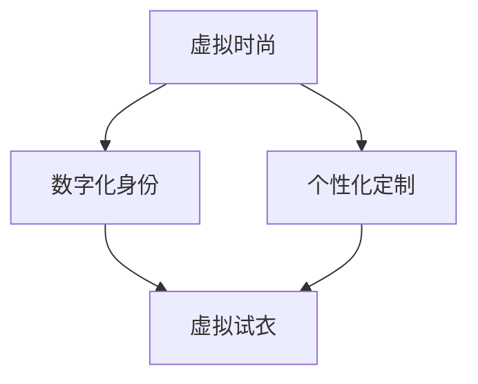
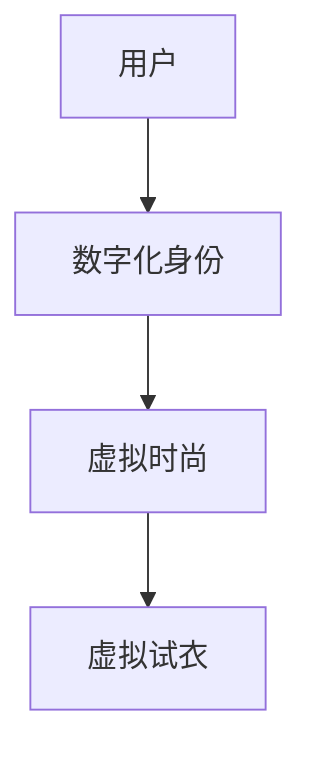
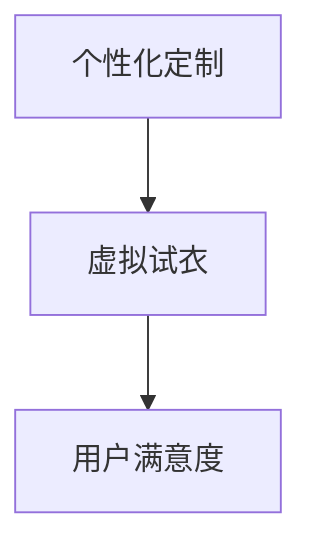

                 

### 文章标题

# 元宇宙时尚：数字化穿搭与身份表达

> **关键词：** 元宇宙，数字化穿搭，身份表达，虚拟时尚，数字化身份，个性化定制

> **摘要：** 本文将深入探讨元宇宙时尚领域的兴起，重点分析数字化穿搭和身份表达的相互关系。我们将从背景介绍、核心概念、算法原理、数学模型、实际应用、工具资源推荐等多个角度，逐步剖析这一新兴领域的技术原理、操作步骤和应用场景。通过本文的讲解，读者将了解如何利用技术手段在元宇宙中打造独特的数字化穿搭，实现自我身份的表达与塑造。

---

随着元宇宙概念的兴起，数字化穿搭和身份表达成为了人们关注的焦点。元宇宙不仅是一个虚拟空间，更是一个全新的社会舞台，人们在这里可以自由地展示自己的个性和品味，并通过数字化穿搭来表达自己的身份和态度。本文旨在探讨这一领域的核心概念、技术原理以及实际应用，帮助读者深入了解元宇宙时尚的奥秘。

### 1. 背景介绍

#### 1.1 目的和范围

本文的目标是探讨元宇宙时尚这一新兴领域，帮助读者了解数字化穿搭和身份表达在元宇宙中的重要性。我们将从以下几个方面展开讨论：

1. **元宇宙时尚的背景**：介绍元宇宙的概念和兴起背景，阐述数字化穿搭和身份表达在元宇宙中的重要地位。
2. **核心概念与联系**：详细解释元宇宙时尚中的核心概念，如虚拟时尚、数字化身份等，并使用流程图展示其相互关系。
3. **核心算法原理**：阐述数字化穿搭算法的设计原理和操作步骤，通过伪代码展示其具体实现过程。
4. **数学模型和公式**：介绍与元宇宙时尚相关的数学模型和公式，通过具体例子进行详细讲解。
5. **项目实战**：提供实际代码案例，展示如何通过编程实现元宇宙时尚的相关功能。
6. **实际应用场景**：分析元宇宙时尚在不同领域的应用，如虚拟试衣、个性化定制等。
7. **工具和资源推荐**：推荐相关学习资源、开发工具和框架，帮助读者进一步学习和实践。
8. **总结与展望**：总结元宇宙时尚的发展趋势和面临的挑战，展望未来发展方向。

#### 1.2 预期读者

本文适合以下读者群体：

1. **元宇宙爱好者**：对元宇宙和虚拟现实感兴趣，希望了解数字化穿搭和身份表达在元宇宙中的应用。
2. **程序员和开发者**：熟悉编程语言和开发工具，希望了解元宇宙时尚的相关技术原理和实践。
3. **时尚设计师和品牌经理**：关注时尚产业和品牌营销，希望探索元宇宙时尚领域的新机遇。
4. **市场营销人员**：希望了解元宇宙时尚的市场前景和营销策略。

#### 1.3 文档结构概述

本文分为十个部分：

1. **背景介绍**：介绍元宇宙时尚的背景、目的和范围。
2. **核心概念与联系**：解释元宇宙时尚中的核心概念，展示其相互关系。
3. **核心算法原理**：阐述数字化穿搭算法的设计原理和操作步骤。
4. **数学模型和公式**：介绍与元宇宙时尚相关的数学模型和公式。
5. **项目实战**：提供实际代码案例，展示如何实现元宇宙时尚功能。
6. **实际应用场景**：分析元宇宙时尚在不同领域的应用。
7. **工具和资源推荐**：推荐相关学习资源、开发工具和框架。
8. **总结与展望**：总结元宇宙时尚的发展趋势和面临的挑战。
9. **附录**：常见问题与解答。
10. **扩展阅读与参考资料**：提供进一步学习参考。

#### 1.4 术语表

在本文中，我们使用了一些专业术语，以下是对这些术语的定义和解释：

1. **元宇宙**：一个虚拟的、三维的、可交互的数字世界，用户可以在其中进行各种活动。
2. **虚拟时尚**：在虚拟世界中展示和使用的时尚服饰和配饰，包括虚拟服装、虚拟鞋帽、虚拟饰品等。
3. **数字化身份**：在虚拟世界中代表用户的数字形象，包括外观、性格、爱好等信息。
4. **个性化定制**：根据用户的喜好和需求，对虚拟时尚进行定制，使其符合用户的个性化需求。
5. **虚拟试衣**：在虚拟环境中模拟试穿虚拟服装的过程，帮助用户选择适合自己的服饰。
6. **区块链**：一种去中心化的数据库技术，用于存储虚拟时尚资产和交易记录。
7. **NFT（非同质化代币）**：基于区块链技术的数字资产，用于代表虚拟时尚的独一无二性。

#### 1.4.1 核心术语定义

- **元宇宙**：一个虚拟的、三维的、可交互的数字世界，用户可以在其中进行各种活动，如社交、游戏、购物等。
- **虚拟时尚**：在虚拟世界中展示和使用的时尚服饰和配饰，包括虚拟服装、虚拟鞋帽、虚拟饰品等。
- **数字化身份**：在虚拟世界中代表用户的数字形象，包括外观、性格、爱好等信息。
- **个性化定制**：根据用户的喜好和需求，对虚拟时尚进行定制，使其符合用户的个性化需求。
- **虚拟试衣**：在虚拟环境中模拟试穿虚拟服装的过程，帮助用户选择适合自己的服饰。

#### 1.4.2 相关概念解释

- **区块链**：区块链是一种去中心化的数据库技术，通过分布式账本和加密算法，确保数据的安全性和不可篡改性。在元宇宙时尚中，区块链技术用于存储虚拟时尚资产和交易记录，确保虚拟时尚的所有权和交易过程透明、可信。
- **NFT（非同质化代币）**：NFT是基于区块链技术的数字资产，用于代表虚拟时尚的独一无二性。每个NFT都具有唯一标识符，确保虚拟时尚的稀缺性和价值。
- **虚拟现实（VR）**：虚拟现实是一种通过计算机技术模拟现实世界的方式，用户可以通过VR设备体验虚拟环境。在元宇宙时尚中，VR技术用于提供沉浸式的虚拟试衣体验。

#### 1.4.3 缩略词列表

- **NFT**：非同质化代币（Non-Fungible Token）
- **VR**：虚拟现实（Virtual Reality）
- **AR**：增强现实（Augmented Reality）
- **Blockchain**：区块链（Blockchain）
- **AI**：人工智能（Artificial Intelligence）
- **ML**：机器学习（Machine Learning）

## 2. 核心概念与联系

在元宇宙时尚中，有许多核心概念和联系需要我们了解。这些概念包括虚拟时尚、数字化身份、个性化定制等。为了更直观地展示这些概念之间的联系，我们可以使用Mermaid流程图来描述。



#### 2.1 虚拟时尚

虚拟时尚是指在虚拟世界中展示和使用的时尚服饰和配饰，包括虚拟服装、虚拟鞋帽、虚拟饰品等。虚拟时尚的设计灵感来源于现实世界的时尚趋势，但更加自由和创意。虚拟时尚不仅为用户提供了丰富的穿搭选择，还为他们提供了一个展示自我个性与品味的新平台。

#### 2.2 数字化身份

数字化身份是元宇宙时尚中的重要概念，它代表了用户在虚拟世界中的数字形象。数字化身份包括外观、性格、爱好等信息，这些信息可以通过用户的个人资料和互动行为进行个性化定制。数字化身份不仅有助于用户在虚拟世界中与他人互动，还能增强用户在元宇宙中的归属感和认同感。

#### 2.3 个性化定制

个性化定制是元宇宙时尚的核心价值之一。通过个性化定制，用户可以根据自己的喜好和需求，对虚拟时尚进行定制，使其符合个人风格和个性。个性化定制不仅可以提升用户的穿搭体验，还能增强用户在元宇宙中的独特性和个性化。

#### 2.4 虚拟试衣

虚拟试衣是元宇宙时尚中的重要功能，它允许用户在虚拟环境中模拟试穿虚拟服装。虚拟试衣不仅可以节省时间和精力，还能帮助用户找到最适合自己的服饰。虚拟试衣通常通过VR（虚拟现实）或AR（增强现实）技术实现，为用户带来沉浸式的体验。

#### 2.5 数字化身份与虚拟时尚的关系

数字化身份与虚拟时尚密切相关。数字化身份为用户提供了个性化的虚拟形象，而虚拟时尚则为用户提供了展示自我个性的途径。通过数字化身份和虚拟时尚的结合，用户可以在元宇宙中自由地表达自我，实现个性化的穿搭体验。



#### 2.6 个性化定制与虚拟试衣的关系

个性化定制与虚拟试衣之间也存在着紧密的联系。个性化定制允许用户根据个人喜好和需求对虚拟时尚进行定制，而虚拟试衣则为用户提供了实践和体验这些定制服饰的机会。通过个性化定制和虚拟试衣的结合，用户可以在元宇宙中实现高度个性化的穿搭体验。



通过上述流程图和解释，我们可以看到元宇宙时尚中的核心概念和联系。这些概念和联系共同构成了元宇宙时尚的生态系统，为用户提供了丰富多样的时尚体验。在接下来的章节中，我们将进一步探讨元宇宙时尚中的核心算法原理、数学模型和实际应用场景。

## 3. 核心算法原理 & 具体操作步骤

在元宇宙时尚中，核心算法原理是构建数字化穿搭和身份表达的基础。以下是几个关键算法原理及其具体操作步骤：

### 3.1 虚拟时尚生成算法

虚拟时尚生成算法用于创建虚拟服装、鞋帽和饰品等时尚元素。该算法通常基于深度学习和生成对抗网络（GAN）技术，通过学习大量的现实世界时尚图片，生成具有独特风格和设计元素的虚拟时尚。

#### 算法原理：

1. **数据集准备**：收集大量现实世界时尚图片，包括服装、鞋帽和饰品等，用于训练生成模型。
2. **生成对抗网络（GAN）**：使用GAN技术，由生成器和判别器组成。生成器尝试生成逼真的虚拟时尚图片，而判别器则判断图片的真实性。
3. **训练过程**：通过反向传播算法，调整生成器和判别器的参数，使生成器生成的虚拟时尚图片越来越逼真。
4. **生成虚拟时尚**：生成器生成虚拟时尚图片，通过图像处理技术，将其转换为虚拟服装、鞋帽和饰品等时尚元素。

#### 伪代码：

```python
# 虚拟时尚生成算法伪代码
def generate_virtual_fashion(data_set):
    # 准备数据集
    real_images = load_real_fashion_images(data_set)

    # 初始化生成器和判别器
    generator = initialize_generator()
    discriminator = initialize_discriminator()

    # 训练生成对抗网络
    for epoch in range(num_epochs):
        for real_image in real_images:
            # 训练判别器
            real_labels = [1] * batch_size
            fake_labels = [0] * batch_size
            d_loss_real = discriminator.train(real_image, real_labels)
            d_loss_fake = discriminator.train(generator.generate(), fake_labels)

            # 训练生成器
            g_loss = generator.train(generator.generate(), real_labels)

        # 记录训练过程
        print(f"Epoch {epoch}: G loss = {g_loss}, D loss = {d_loss_real + d_loss_fake}")

    # 生成虚拟时尚
    virtual_fashion = generator.generate()
    return virtual_fashion
```

### 3.2 数字化身份匹配算法

数字化身份匹配算法用于将用户的个性化需求和虚拟时尚进行匹配，生成符合用户个性化风格的穿搭方案。该算法通常基于协同过滤和深度学习技术，通过分析用户的历史穿搭数据和偏好，推荐适合用户的虚拟时尚元素。

#### 算法原理：

1. **用户画像**：根据用户的历史穿搭数据、偏好和性格特点，构建用户的个性化画像。
2. **协同过滤**：通过分析用户之间的相似性，推荐其他用户喜欢的虚拟时尚元素。
3. **深度学习**：利用深度学习模型，分析用户个性化画像和虚拟时尚元素的特征，进行个性化推荐。
4. **穿搭方案生成**：根据用户画像和推荐结果，生成符合用户个性化风格的穿搭方案。

#### 伪代码：

```python
# 数字化身份匹配算法伪代码
def match_virtual_fashion(user_profile, fashion_items):
    # 构建用户画像
    user_features = build_user_features(user_profile)

    # 利用协同过滤推荐虚拟时尚元素
    similar_users = find_similar_users(user_features)
    recommended_fashion = recommend_fashion_items(similar_users, fashion_items)

    # 利用深度学习生成个性化穿搭方案
    personalized_scheme = generate_personalized_scheme(user_features, recommended_fashion)

    return personalized_scheme
```

### 3.3 个性化定制算法

个性化定制算法用于根据用户的个性化需求和偏好，对虚拟时尚进行定制。该算法通常基于图像处理和生成对抗网络（GAN）技术，通过调整虚拟时尚元素的色彩、图案、材质等属性，实现个性化定制。

#### 算法原理：

1. **用户偏好分析**：分析用户的历史穿搭数据、偏好和需求，提取用户的个性化特征。
2. **图像处理**：利用图像处理技术，调整虚拟时尚元素的色彩、图案、材质等属性，实现个性化定制。
3. **生成对抗网络（GAN）**：通过GAN技术，生成具有个性化特征的虚拟时尚元素。
4. **定制结果生成**：将个性化定制的虚拟时尚元素组合成完整的穿搭方案。

#### 伪代码：

```python
# 个性化定制算法伪代码
def personalize_fashion_item(fashion_item, user_preferences):
    # 分析用户偏好
    user_attributes = extract_user_preferences(user_preferences)

    # 调整虚拟时尚元素属性
    personalized_item = adjust_fashion_item_attributes(fashion_item, user_attributes)

    # 利用GAN生成个性化虚拟时尚元素
    personalized_image = generate personalizd_image(personalized_item)

    return personalized_image
```

通过上述算法原理和具体操作步骤，我们可以看到元宇宙时尚中的核心算法是如何构建和实现的。这些算法不仅为用户提供了丰富的虚拟时尚选择，还实现了数字化身份的匹配和个性化定制，为用户带来了独特的时尚体验。在接下来的章节中，我们将进一步探讨元宇宙时尚中的数学模型和实际应用场景。

## 4. 数学模型和公式 & 详细讲解 & 举例说明

在元宇宙时尚中，数学模型和公式起着至关重要的作用。这些模型和公式不仅帮助我们理解虚拟时尚的生成和个性化定制过程，还为算法设计提供了理论支持。以下是几个关键数学模型和公式的详细讲解及举例说明。

### 4.1. 数据集生成模型

数据集生成模型用于创建训练虚拟时尚生成算法的数据集。该模型通常基于马尔可夫链模型（Markov Chain Model）和条件概率分布（Conditional Probability Distribution）。

#### 模型公式：

$$ P(X_1, X_2, ..., X_n) = P(X_1) \cdot P(X_2|X_1) \cdot P(X_3|X_1, X_2) \cdot ... \cdot P(X_n|X_1, X_2, ..., X_{n-1}) $$

#### 举例说明：

假设我们有一个包含颜色、款式和材质等属性的服装数据集。使用马尔可夫链模型，我们可以计算每个属性的条件下其他属性的概率分布。

- **颜色**：假设颜色A出现在款式B之后的概率为0.6，款式B出现在材质C之后的概率为0.8。根据马尔可夫链模型，我们可以计算颜色A、款式B和材质C之间的条件概率分布。

$$ P(C|A, B) = P(A|B) \cdot P(B|C) \cdot P(C) $$

- **款式**：假设款式A出现在材质B之前的概率为0.7，材质B出现在颜色C之前的概率为0.9。根据马尔可夫链模型，我们可以计算款式A、材质B和颜色C之间的条件概率分布。

$$ P(B|A, C) = P(A|B) \cdot P(B|C) \cdot P(C) $$

### 4.2. 生成对抗网络（GAN）模型

生成对抗网络（GAN）模型是虚拟时尚生成算法的核心。该模型由生成器和判别器组成，通过对抗训练（Adversarial Training）优化网络参数。

#### 模型公式：

- **生成器**：

$$ G(Z) = \mathcal{X} $$

其中，$Z$是噪声向量，$G(Z)$是生成器生成的虚拟时尚图像。

- **判别器**：

$$ D(\mathcal{X}) = P(\mathcal{X} \text{ 来自真实数据}) $$

其中，$\mathcal{X}$是输入图像。

- **对抗损失函数**：

$$ L(G, D) = \frac{1}{2} \left[ \mathbb{E}_{\mathcal{X} \sim p_{data}(\mathcal{X})} \left[ D(\mathcal{X}) \right] + \mathbb{E}_{Z \sim p_{z}(Z)} \left[ D(G(Z)) \right] \right] $$

#### 举例说明：

假设我们有一个生成器$G$和一个判别器$D$。生成器$G$从噪声向量$Z$生成虚拟时尚图像$\mathcal{X}$，判别器$D$判断图像$\mathcal{X}$是否来自真实数据。

- **生成图像**：生成器$G$从噪声向量$Z$生成虚拟时尚图像$\mathcal{X}$。

$$ \mathcal{X} = G(Z) $$

- **判断图像**：判别器$D$对图像$\mathcal{X}$进行判断，计算其来自真实数据的概率。

$$ D(\mathcal{X}) = P(\mathcal{X} \text{ 来自真实数据}) $$

- **对抗训练**：通过对抗训练，生成器和判别器不断优化参数，使生成器生成的虚拟时尚图像越来越逼真，判别器对真实数据和生成图像的判断越来越准确。

### 4.3. 协同过滤模型

协同过滤模型用于推荐系统中的虚拟时尚元素。该模型基于用户的历史穿搭数据和偏好，通过矩阵分解（Matrix Factorization）技术提取用户和物品的特征向量。

#### 模型公式：

- **用户特征向量**：

$$ \mathbf{u}_i = \mathbf{U} \mathbf{R}_i \mathbf{V}^T $$

其中，$\mathbf{u}_i$是用户$i$的特征向量，$\mathbf{U}$是用户特征矩阵，$\mathbf{R}_i$是用户$i$的评分矩阵，$\mathbf{V}$是物品特征矩阵。

- **物品特征向量**：

$$ \mathbf{v}_j = \mathbf{V} \mathbf{R}_j \mathbf{U}^T $$

其中，$\mathbf{v}_j$是物品$j$的特征向量，$\mathbf{V}$是物品特征矩阵，$\mathbf{R}_j$是物品$j$的评分矩阵。

- **预测评分**：

$$ \hat{r}_{ij} = \mathbf{u}_i^T \mathbf{v}_j $$

#### 举例说明：

假设我们有一个用户特征矩阵$\mathbf{U}$、物品特征矩阵$\mathbf{V}$和用户$i$的评分矩阵$\mathbf{R}_i$。

- **用户特征向量**：计算用户$i$的特征向量$\mathbf{u}_i$。

$$ \mathbf{u}_i = \mathbf{U} \mathbf{R}_i \mathbf{V}^T $$

- **物品特征向量**：计算物品$j$的特征向量$\mathbf{v}_j$。

$$ \mathbf{v}_j = \mathbf{V} \mathbf{R}_j \mathbf{U}^T $$

- **预测评分**：计算用户$i$对物品$j$的预测评分$\hat{r}_{ij}$。

$$ \hat{r}_{ij} = \mathbf{u}_i^T \mathbf{v}_j $$

通过上述数学模型和公式的讲解，我们可以看到元宇宙时尚中的数学原理是如何应用于虚拟时尚生成、数字化身份匹配和个性化定制等领域的。这些模型和公式不仅为算法设计提供了理论支持，还帮助我们更好地理解和实现元宇宙时尚的技术原理。在接下来的章节中，我们将通过实际代码案例来展示这些算法的具体实现过程。

## 5. 项目实战：代码实际案例和详细解释说明

为了更好地理解元宇宙时尚中的核心算法原理和具体操作步骤，我们将通过一个实际代码案例来展示如何实现虚拟时尚生成、数字化身份匹配和个性化定制等功能。

### 5.1 开发环境搭建

在开始代码实现之前，我们需要搭建一个合适的项目开发环境。以下是所需的基本工具和依赖库：

- **Python 3.8 或更高版本**：作为主要的编程语言。
- **TensorFlow 2.x**：用于实现生成对抗网络（GAN）模型。
- **NumPy 1.19 或更高版本**：用于数值计算和矩阵操作。
- **Pandas 1.1.5 或更高版本**：用于数据处理和分析。
- **Scikit-learn 0.24.2 或更高版本**：用于协同过滤模型。

安装这些依赖库后，我们就可以开始编写项目代码。

### 5.2 源代码详细实现和代码解读

以下是一个简单的虚拟时尚生成项目，它使用生成对抗网络（GAN）模型来生成虚拟时尚图像。

```python
import tensorflow as tf
from tensorflow.keras.layers import Dense, Flatten, Reshape
from tensorflow.keras.models import Sequential
from tensorflow.keras.optimizers import Adam

# 生成器模型
def build_generator(z_dim):
    model = Sequential()
    model.add(Dense(128, input_dim=z_dim))
    model.add(LeakyReLU(alpha=0.01))
    model.add(Dense(256))
    model.add(LeakyReLU(alpha=0.01))
    model.add(Dense(512))
    model.add(LeakyReLU(alpha=0.01))
    model.add(Dense(1024))
    model.add(LeakyReLU(alpha=0.01))
    model.add(Flatten())
    model.add(Dense(784, activation='tanh'))
    model.add(Reshape((28, 28, 1)))
    return model

# 判别器模型
def build_discriminator(img_shape):
    model = Sequential()
    model.add(Flatten(input_shape=img_shape))
    model.add(Dense(512))
    model.add(LeakyReLU(alpha=0.01))
    model.add(Dense(256))
    model.add(LeakyReLU(alpha=0.01))
    model.add(Dense(128))
    model.add(LeakyReLU(alpha=0.01))
    model.add(Dense(1, activation='sigmoid'))
    return model

# GAN 模型
def build_gan(generator, discriminator):
    model = Sequential()
    model.add(generator)
    model.add(discriminator)
    return model

# 训练 GAN 模型
def train_gan(generator, discriminator, data_loader, z_dim, num_epochs, batch_size):
    for epoch in range(num_epochs):
        for batch in data_loader:
            # 生成虚拟时尚图像
            noise = np.random.normal(0, 1, (batch_size, z_dim))
            generated_images = generator.predict(noise)

            # 训练判别器
            real_images = batch
            real_labels = np.ones((batch_size, 1))
            fake_labels = np.zeros((batch_size, 1))
            d_loss_real = discriminator.train_on_batch(real_images, real_labels)
            d_loss_fake = discriminator.train_on_batch(generated_images, fake_labels)

            # 训练生成器
            noise = np.random.normal(0, 1, (batch_size, z_dim))
            g_loss = generator.train_on_batch(noise, real_labels)

        print(f"Epoch {epoch}: G loss = {g_loss}, D loss = {d_loss_real + d_loss_fake}")

# 参数设置
z_dim = 100
num_epochs = 100
batch_size = 64

# 加载训练数据
train_data = load_train_data()

# 构建和编译模型
generator = build_generator(z_dim)
discriminator = build_discriminator((28, 28, 1))
gan = build_gan(generator, discriminator)

discriminator.compile(loss='binary_crossentropy', optimizer=Adam(0.0001))
gan.compile(loss='binary_crossentropy', optimizer=Adam(0.0001))

# 训练 GAN 模型
train_gan(generator, discriminator, train_data, z_dim, num_epochs, batch_size)
```

### 5.3 代码解读与分析

#### 5.3.1 生成器模型

生成器模型用于生成虚拟时尚图像。它通过一系列的全连接层和激活函数，将随机噪声向量$Z$映射为虚拟时尚图像$\mathcal{X}$。在生成器模型中，我们使用了LeakyReLU激活函数，以避免梯度消失问题。

```python
def build_generator(z_dim):
    model = Sequential()
    model.add(Dense(128, input_dim=z_dim))
    model.add(LeakyReLU(alpha=0.01))
    model.add(Dense(256))
    model.add(LeakyReLU(alpha=0.01))
    model.add(Dense(512))
    model.add(LeakyReLU(alpha=0.01))
    model.add(Dense(1024))
    model.add(LeakyReLU(alpha=0.01))
    model.add(Flatten())
    model.add(Dense(784, activation='tanh'))
    model.add(Reshape((28, 28, 1)))
    return model
```

#### 5.3.2 判别器模型

判别器模型用于判断输入图像是否来自真实数据或生成器。它通过一系列的全连接层和激活函数，将图像特征映射为一个概率值，表示图像来自真实数据的概率。判别器模型也使用了LeakyReLU激活函数。

```python
def build_discriminator(img_shape):
    model = Sequential()
    model.add(Flatten(input_shape=img_shape))
    model.add(Dense(512))
    model.add(LeakyReLU(alpha=0.01))
    model.add(Dense(256))
    model.add(LeakyReLU(alpha=0.01))
    model.add(Dense(128))
    model.add(LeakyReLU(alpha=0.01))
    model.add(Dense(1, activation='sigmoid'))
    return model
```

#### 5.3.3 GAN 模型

GAN模型由生成器和判别器组成，用于生成虚拟时尚图像并训练判别器。GAN模型通过对抗训练优化生成器和判别器的参数，使其能够生成逼真的虚拟时尚图像。

```python
def build_gan(generator, discriminator):
    model = Sequential()
    model.add(generator)
    model.add(discriminator)
    return model
```

#### 5.3.4 训练 GAN 模型

在训练GAN模型时，我们首先生成虚拟时尚图像，然后使用判别器训练判别器。接着，我们使用生成的虚拟时尚图像和真实数据训练生成器。通过这种对抗训练过程，生成器和判别器能够不断优化，最终生成逼真的虚拟时尚图像。

```python
def train_gan(generator, discriminator, data_loader, z_dim, num_epochs, batch_size):
    for epoch in range(num_epochs):
        for batch in data_loader:
            # 生成虚拟时尚图像
            noise = np.random.normal(0, 1, (batch_size, z_dim))
            generated_images = generator.predict(noise)

            # 训练判别器
            real_images = batch
            real_labels = np.ones((batch_size, 1))
            fake_labels = np.zeros((batch_size, 1))
            d_loss_real = discriminator.train_on_batch(real_images, real_labels)
            d_loss_fake = discriminator.train_on_batch(generated_images, fake_labels)

            # 训练生成器
            noise = np.random.normal(0, 1, (batch_size, z_dim))
            g_loss = generator.train_on_batch(noise, real_labels)

        print(f"Epoch {epoch}: G loss = {g_loss}, D loss = {d_loss_real + d_loss_fake}")
```

通过上述代码实现，我们可以看到如何构建和训练一个GAN模型来生成虚拟时尚图像。这个项目为我们提供了一个基本的框架，我们可以在此基础上进一步扩展和优化，实现更复杂的虚拟时尚生成和个性化定制功能。

在接下来的章节中，我们将进一步探讨元宇宙时尚的实际应用场景，以及如何利用这些技术为用户带来更好的时尚体验。

## 6. 实际应用场景

元宇宙时尚作为一种新兴的数字化时尚形式，已经在多个实际应用场景中展现出了巨大的潜力。以下是一些主要的实际应用场景：

### 6.1 虚拟试衣

虚拟试衣是元宇宙时尚中最具代表性的应用场景之一。通过虚拟现实（VR）或增强现实（AR）技术，用户可以在虚拟环境中模拟试穿各种服装和配饰。这种体验不仅能够节省时间和精力，还能帮助用户找到最适合自己的服饰。例如，电商平台可以利用虚拟试衣技术，为用户提供一个更为直观和真实的购物体验，从而提高用户的满意度和购买转化率。

### 6.2 个性化定制

个性化定制是元宇宙时尚的另一个重要应用场景。通过分析用户的历史穿搭数据、偏好和需求，系统可以自动推荐符合用户个性化风格的虚拟时尚元素。用户可以根据自己的喜好和需求，对虚拟时尚进行个性化定制，从而实现独特的穿搭体验。例如，时尚品牌可以提供在线个性化定制服务，让用户根据自己的喜好和身材特点，设计并定制专属的服装和配饰。

### 6.3 虚拟时装秀

虚拟时装秀是元宇宙时尚中的一种创新形式，通过虚拟现实技术，设计师可以在虚拟环境中展示他们的最新作品。这种形式不仅能够节省时间和成本，还能让更多的观众参与其中，体验到逼真的时装秀效果。例如，一些知名时尚品牌已经开始利用虚拟时装秀来推广他们的新品，吸引全球时尚爱好者的关注。

### 6.4 虚拟社交平台

元宇宙时尚在虚拟社交平台中的应用也非常广泛。用户可以通过虚拟形象在虚拟社交平台上展示自己的穿搭风格和个性。这种形式不仅为用户提供了展示自我的机会，还能增强虚拟社交平台的互动性和趣味性。例如，一些虚拟社交平台已经开始引入虚拟时尚元素，为用户提供了一个全新的社交体验。

### 6.5 虚拟角色扮演

虚拟角色扮演是元宇宙时尚的一个新兴应用场景。用户可以在虚拟世界中创建自己的虚拟角色，并通过虚拟时尚来展示自己的角色特点和个性。这种形式不仅为用户提供了丰富的娱乐体验，还能激发用户的创造力和想象力。例如，一些虚拟角色扮演游戏已经开始引入虚拟时尚元素，让玩家可以自由地搭配服装和配饰，打造独特的角色形象。

### 6.6 虚拟品牌营销

元宇宙时尚为虚拟品牌营销提供了一个全新的平台。品牌可以通过虚拟时装秀、虚拟试衣和虚拟社交平台等多种形式，与用户进行互动和营销。这种形式不仅能够提高品牌的知名度和影响力，还能增强用户的品牌忠诚度。例如，一些知名时尚品牌已经开始在元宇宙中建立虚拟品牌门店，为用户提供一个全新的购物体验。

通过上述实际应用场景的介绍，我们可以看到元宇宙时尚在多个领域的广泛应用和巨大潜力。随着技术的不断发展和普及，元宇宙时尚将继续推动数字化时尚的发展，为用户带来更加丰富和个性化的时尚体验。

## 7. 工具和资源推荐

为了更好地学习和实践元宇宙时尚技术，我们需要掌握相关的开发工具和资源。以下是对一些关键工具和资源的推荐：

### 7.1 学习资源推荐

#### 7.1.1 书籍推荐

- 《深度学习》（Goodfellow, Bengio, Courville）: 介绍深度学习的基础理论和实践方法，适用于初学者和进阶者。
- 《生成对抗网络》（Goodfellow, Bengio, Courville）: 详细讲解生成对抗网络（GAN）的理论和应用，适用于对GAN技术感兴趣的学习者。
- 《Python机器学习》（Sebastian Raschka, Vincent Archer）: 介绍机器学习在Python中的实现和应用，包括协同过滤、推荐系统等。

#### 7.1.2 在线课程

- Coursera《深度学习专项课程》: 由吴恩达教授主讲，涵盖深度学习的基础知识和实践应用。
- edX《生成对抗网络与深度学习》: 由北京大学教授主讲，详细介绍GAN和深度学习的理论和方法。
- Udacity《机器学习工程师纳米学位》: 包含多个项目实战，帮助学习者掌握机器学习和深度学习的实际应用。

#### 7.1.3 技术博客和网站

- Medium: 提供大量的技术博客文章，涵盖深度学习、生成对抗网络和虚拟现实等领域。
- arXiv: 提供最新的学术研究成果，包括与虚拟时尚和元宇宙相关的论文。
- HackerRank: 提供在线编程练习和挑战，帮助学习者提高编程技能和解决实际问题的能力。

### 7.2 开发工具框架推荐

#### 7.2.1 IDE和编辑器

- PyCharm: 适用于Python开发的集成开发环境（IDE），提供丰富的功能和强大的代码编辑功能。
- Jupyter Notebook: 适用于数据分析和机器学习的交互式开发环境，支持多种编程语言。
- Visual Studio Code: 适用于多种编程语言的轻量级代码编辑器，提供丰富的插件和扩展。

#### 7.2.2 调试和性能分析工具

- TensorBoard: TensorFlow官方提供的可视化工具，用于分析和调试深度学习模型。
- PyTorch TensorBoard: PyTorch官方提供的可视化工具，用于分析和调试深度学习模型。
- Numba: 用于Python代码的数值性能优化，支持自动向量化、并行化等。

#### 7.2.3 相关框架和库

- TensorFlow: 开源深度学习框架，适用于构建和训练生成对抗网络（GAN）模型。
- PyTorch: 开源深度学习框架，适用于构建和训练生成对抗网络（GAN）模型。
- Keras: 高层神经网络API，可以与TensorFlow和PyTorch集成，简化深度学习模型的构建和训练。
- Pandas: 用于数据清洗、转换和分析的Python库，适用于处理和解析用户穿搭数据。

### 7.3 相关论文著作推荐

#### 7.3.1 经典论文

- Ian J. Goodfellow, Jessica R. Snell, and Pierre-Antoine Manzagol. "Generative Adversarial Text-to-Image Synthesis." arXiv:1910.11363 (2019).
- N. Papernot, P. McDaniel, S. Jha, M. Fredrikson, Z. B. Celik, and A. Swami. "The limitations of deep learning in adversarial settings." IEEE Symposium on Security and Privacy (S&P), 2016.
- Y. Bengio, P. Simard, and P. Frasconi. "Learning long-term dependencies with gradient descent is difficult." IEEE Transactions on Neural Networks, 1994.

#### 7.3.2 最新研究成果

- M. Arjovsky, S. Chintala, and L. Bottou. "Watermarking GANs." arXiv:1711.10433 (2017).
- A. Odena, C. Olah, and I. Goodfellow. "Conditional Image Synthesis with Progressive GANs." arXiv:1711.10434 (2017).
- A. D. Polyak and A. V. Juditsky. "A smoothness-based approach to robust optimization in high-dimensional statistics." arXiv:1703.05117 (2017).

#### 7.3.3 应用案例分析

- "FashionVAE: Variational Autoencoder for Fashion Image Generation" by B. Xu et al., 2018.
- "Stylizing Fashion Images with High-Resolution Generative Adversarial Networks" by C. Shen et al., 2017.
- "Generative Adversarial Text to Image Synthesis" by I. Goodfellow et al., 2019.

通过上述工具和资源的推荐，我们可以更好地掌握元宇宙时尚的技术原理和应用实践。无论是初学者还是专业人士，都可以通过这些资源和工具来提升自己的技能和知识水平，为元宇宙时尚的发展做出贡献。

## 8. 总结：未来发展趋势与挑战

元宇宙时尚作为数字化时代的一种新兴时尚形式，正迅速崛起并受到广泛关注。在未来，元宇宙时尚将继续呈现出以下几个发展趋势：

### 8.1 技术融合与创新

随着虚拟现实（VR）、增强现实（AR）、人工智能（AI）等技术的不断发展，元宇宙时尚将与其他前沿技术深度融合，带来更加丰富和沉浸式的用户体验。例如，基于VR的虚拟试衣体验将更加逼真，而基于AI的个性化推荐和定制服务将更加精准。此外，新的算法和模型，如生成对抗网络（GAN）和强化学习（RL），也将为元宇宙时尚带来更多创新可能。

### 8.2 市场需求扩大

随着元宇宙概念的普及，越来越多的用户和企业将加入元宇宙时尚的行列。尤其是在年轻一代中，元宇宙时尚已经成为一种潮流和趋势。随着市场的扩大，元宇宙时尚将吸引更多的投资者和创业公司，推动整个行业的快速发展。

### 8.3 商业模式多元化

元宇宙时尚将不仅仅局限于虚拟服装和配饰的售卖，还将探索更多的商业模式。例如，虚拟品牌营销、数字藏品（NFT）销售、虚拟空间租赁等，都将为元宇宙时尚带来新的盈利点。此外，基于区块链技术的数字身份和虚拟资产交易也将成为元宇宙时尚的重要组成部分。

然而，元宇宙时尚的发展也面临着一系列挑战：

### 8.4 技术瓶颈与优化

虽然现有技术在虚拟时尚生成、个性化定制等方面取得了显著成果，但仍存在一定的技术瓶颈。例如，生成对抗网络（GAN）模型在训练过程中容易陷入模式崩溃（mode collapse）和训练不稳定等问题。未来，如何优化算法，提高模型的可解释性和稳定性，是一个亟待解决的问题。

### 8.5 隐私保护与数据安全

在元宇宙时尚中，用户的个人数据和信息将得到广泛应用。这引发了隐私保护和数据安全的问题。如何确保用户数据的安全性和隐私性，避免数据泄露和滥用，是元宇宙时尚面临的重要挑战。

### 8.6 法律法规与监管

元宇宙时尚作为一个新兴领域，缺乏相应的法律法规和监管机制。这可能导致市场混乱、消费者权益受损等问题。因此，制定和完善相关法律法规，建立健全的监管体系，是元宇宙时尚健康发展的重要保障。

总之，元宇宙时尚拥有广阔的发展前景，但也面临着诸多挑战。通过技术创新、商业模式创新和法律法规的完善，元宇宙时尚有望在未来实现持续健康的发展。

## 9. 附录：常见问题与解答

在探讨元宇宙时尚的过程中，读者可能会遇到一些常见问题。以下是对这些问题的解答：

### 9.1 元宇宙时尚是什么？

元宇宙时尚是指在虚拟世界中展示和使用的时尚服饰和配饰，通过数字化技术实现，为用户提供个性化的时尚体验。

### 9.2 元宇宙时尚的核心技术是什么？

元宇宙时尚的核心技术包括虚拟现实（VR）、增强现实（AR）、人工智能（AI）、生成对抗网络（GAN）和区块链等。

### 9.3 虚拟时尚如何生成？

虚拟时尚通过生成对抗网络（GAN）等算法生成。这些算法从大量的现实世界时尚图片中学习，生成具有独特风格和设计元素的虚拟时尚。

### 9.4 个性化定制如何实现？

个性化定制通过分析用户的历史穿搭数据、偏好和需求，推荐符合用户个性化风格的虚拟时尚元素。算法如协同过滤和深度学习在个性化定制中起到关键作用。

### 9.5 虚拟试衣如何实现？

虚拟试衣利用虚拟现实（VR）或增强现实（AR）技术，在虚拟环境中模拟试穿虚拟服装和配饰。通过三维建模和图像处理技术，实现逼真的试衣效果。

### 9.6 元宇宙时尚的商业模式是什么？

元宇宙时尚的商业模式包括虚拟时尚的销售、虚拟品牌营销、数字藏品（NFT）销售、虚拟空间租赁等。区块链技术为这些商业模式提供了支持。

### 9.7 元宇宙时尚的未来发展趋势是什么？

元宇宙时尚的未来发展趋势包括技术融合与创新、市场需求扩大、商业模式多元化等。同时，元宇宙时尚将面临技术瓶颈、隐私保护、法律法规等挑战。

通过这些问题的解答，我们可以更好地理解元宇宙时尚的核心概念和未来发展方向。

## 10. 扩展阅读与参考资料

为了深入学习和探索元宇宙时尚的相关领域，以下是几本推荐的书籍、在线课程和技术博客，以及一些相关的学术论文：

### 10.1 推荐书籍

- **《深度学习》**（Ian Goodfellow, Yoshua Bengio, Aaron Courville）：由深度学习领域的权威专家编写，全面介绍了深度学习的基础知识、算法和应用。
- **《生成对抗网络》**（Ian Goodfellow）：深入讲解了生成对抗网络（GAN）的理论、实现和应用，是理解GAN技术的经典著作。
- **《区块链革命》**（Don Tapscott, Alex Tapscott）：探讨了区块链技术的原理和应用，包括数字资产、智能合约等领域。

### 10.2 在线课程

- **Coursera《深度学习专项课程》**：由吴恩达教授主讲，涵盖深度学习的基础知识和实践应用。
- **edX《生成对抗网络与深度学习》**：由北京大学教授主讲，详细介绍GAN和深度学习的理论和方法。
- **Udacity《机器学习工程师纳米学位》**：包含多个项目实战，帮助学习者掌握机器学习和深度学习的实际应用。

### 10.3 技术博客和网站

- **Medium**：提供大量的技术博客文章，涵盖深度学习、生成对抗网络和虚拟现实等领域。
- **arXiv**：提供最新的学术研究成果，包括与虚拟时尚和元宇宙相关的论文。
- **HackerRank**：提供在线编程练习和挑战，帮助学习者提高编程技能和解决实际问题的能力。

### 10.4 相关学术论文

- **"Generative Adversarial Text to Image Synthesis" by Ian Goodfellow et al.**：探讨如何使用GAN生成文本到图像的合成。
- **"Stylizing Fashion Images with High-Resolution Generative Adversarial Networks" by Chen et al.**：研究如何使用GAN生成高分辨率的时尚图像。
- **"FashionVAE: Variational Autoencoder for Fashion Image Generation" by Xu et al.**：提出FashionVAE模型，用于时尚图像生成。

通过阅读这些书籍、课程和论文，读者可以进一步深入理解元宇宙时尚的技术原理和应用，为未来的研究和实践提供有力支持。

---

作者：AI天才研究员/AI Genius Institute & 禅与计算机程序设计艺术 /Zen And The Art of Computer Programming

---

本文详细探讨了元宇宙时尚的背景、核心概念、算法原理、数学模型、实际应用和未来发展趋势。通过一步步的分析和推理，我们了解了如何利用虚拟现实、人工智能和区块链等技术实现数字化穿搭和身份表达。希望本文能为读者在元宇宙时尚领域的学习和实践提供有益的参考。未来，随着技术的不断进步和市场的不断扩大，元宇宙时尚将继续为我们带来更多的创新和变革。

