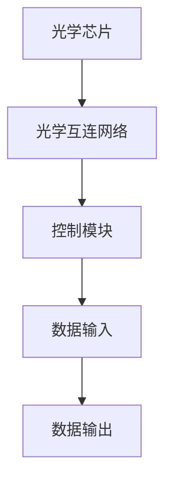

                 

# 光计算技术：突破电子计算的速度限制

> 关键词：光计算、电子计算、速度限制、光学互连、量子计算

> 摘要：本文将深入探讨光计算技术，分析其如何突破传统电子计算的速度限制。文章首先介绍光计算技术的背景和重要性，然后详细解释其核心概念、算法原理和数学模型。接着，通过实际案例展示光计算技术的应用，并提供相关的学习资源和开发工具推荐。最后，总结光计算技术的发展趋势和面临的挑战。

## 1. 背景介绍

### 1.1 目的和范围

本文旨在探讨光计算技术的原理和应用，重点关注如何利用光计算技术突破电子计算的速度限制。文章将涵盖以下内容：

- 光计算技术的背景和发展历程
- 光计算与电子计算的区别和优势
- 光计算的核心概念、算法原理和数学模型
- 光计算技术的实际应用场景
- 相关的学习资源和开发工具推荐

### 1.2 预期读者

本文适合对计算机科学、光学技术、量子计算等领域感兴趣的读者，包括以下几类：

- 计算机科学和工程专业的学生和研究人员
- 光学技术领域的研究人员和技术人员
- 对新兴计算技术感兴趣的工程师和开发者
- 量子计算领域的学者和从业者

### 1.3 文档结构概述

本文分为八个主要部分，具体如下：

- 1. 背景介绍
- 2. 核心概念与联系
- 3. 核心算法原理 & 具体操作步骤
- 4. 数学模型和公式 & 详细讲解 & 举例说明
- 5. 项目实战：代码实际案例和详细解释说明
- 6. 实际应用场景
- 7. 工具和资源推荐
- 8. 总结：未来发展趋势与挑战

### 1.4 术语表

#### 1.4.1 核心术语定义

- 光计算：利用光子进行信息处理和传输的计算技术。
- 光子：光的基本粒子，具有波粒二象性。
- 电子计算：基于电子和电压信号进行信息处理和传输的计算技术。
- 光学互连：通过光波传输信号，实现计算机内部或计算机之间的通信。
- 量子计算：利用量子比特进行信息处理和传输的计算技术。

#### 1.4.2 相关概念解释

- 光速：光在真空中的传播速度，约为 \(3 \times 10^8\) 米/秒。
- 光纤：一种能够传输光信号的传输介质，通常由玻璃或塑料制成。
- 光放大器：用于增强光信号功率的设备。
- 光开关：用于控制光信号传输路径的设备。

#### 1.4.3 缩略词列表

- FTL（Faster Than Light）：超光速，指速度超过光速。
- QC（Quantum Computing）：量子计算。
- SCM（Spinning Column Memory）：旋转柱存储器，一种基于光计算技术的存储设备。
- PIC（Photonic Integrated Circuit）：光电子集成电路，一种用于光计算技术的芯片。

## 2. 核心概念与联系

### 2.1 光计算技术概述

光计算技术是一种利用光子进行信息处理和传输的计算技术。与传统电子计算相比，光计算具有以下优势：

1. **速度优势**：光在真空中的传播速度约为 \(3 \times 10^8\) 米/秒，远超电子在导体中的传播速度。
2. **能量效率**：光子不产生热量，有助于降低系统的能耗。
3. **并行处理能力**：光计算可以同时处理多个任务，提高计算效率。

### 2.2 光计算与电子计算的区别和联系

光计算与电子计算有以下主要区别：

1. **介质**：电子计算依赖于导体和半导体材料，而光计算依赖于光学介质（如光纤和光电子集成芯片）。
2. **信号传输**：电子计算通过电压信号传输，而光计算通过光波信号传输。
3. **计算模型**：电子计算基于逻辑电路和冯·诺伊曼架构，光计算则更多基于光学原理和并行处理。

然而，光计算与电子计算也存在紧密的联系。在某些场景下，两者可以相互补充，如通过光电子集成芯片将光信号转换为电信号，实现光与电子之间的信息交换。

### 2.3 光计算技术的核心概念

光计算技术的核心概念包括以下几个方面：

1. **光学互连**：通过光波传输信号，实现计算机内部或计算机之间的通信。
2. **光放大器**：用于增强光信号功率，保证信号在传输过程中的稳定。
3. **光开关**：用于控制光信号传输路径，实现光信号的灵活路由。
4. **旋转柱存储器**：一种基于光计算技术的存储设备，通过旋转柱体改变光信号路径，实现数据的读取和写入。

### 2.4 光计算技术的架构

光计算技术的架构包括以下几个方面：

1. **光学芯片**：包括光放大器、光开关和旋转柱存储器等组件，实现光计算的基本功能。
2. **光学互连网络**：通过光纤和光电子集成芯片，实现计算机内部或计算机之间的光信号传输。
3. **控制模块**：用于控制光学芯片和光学互连网络，实现光计算任务的调度和管理。

### 2.5 光计算技术的 Mermaid 流程图



## 3. 核心算法原理 & 具体操作步骤

### 3.1 光计算算法原理

光计算算法主要基于光学原理和并行处理技术，以下是一个简单示例：

1. **光学互连**：通过光纤和光电子集成芯片，实现计算机内部或计算机之间的光信号传输。
2. **光放大器**：在信号传输过程中，利用光放大器增强光信号功率，保证信号稳定。
3. **光开关**：根据计算任务需求，控制光信号传输路径，实现光信号的灵活路由。
4. **旋转柱存储器**：利用旋转柱体改变光信号路径，实现数据的读取和写入。

### 3.2 具体操作步骤

以下是光计算技术的一个具体操作步骤：

1. **数据输入**：将待处理的数据输入到光学芯片中。
2. **光学互连**：将数据通过光纤和光电子集成芯片传输到目标计算机。
3. **光放大器**：在信号传输过程中，利用光放大器增强光信号功率。
4. **光开关**：根据计算任务需求，控制光信号传输路径。
5. **旋转柱存储器**：利用旋转柱体改变光信号路径，实现数据的读取和写入。
6. **数据输出**：将处理完成的数据通过光纤和光电子集成芯片传输回光学芯片。
7. **结果输出**：将最终结果输出给用户。

### 3.3 伪代码描述

以下是光计算技术的一个伪代码描述：

```python
def optical_computation(input_data):
    # 数据输入
    data = input_data
    
    # 光学互连
    transmit_data(data)
    
    # 光放大器
    amplify_signal(data)
    
    # 光开关
    route_signal(data)
    
    # 旋转柱存储器
    read_and_write_data(data)
    
    # 数据输出
    output_data = process_data(data)
    
    # 结果输出
    return output_data
```

## 4. 数学模型和公式 & 详细讲解 & 举例说明

### 4.1 数学模型

光计算技术的数学模型主要涉及以下几个方面：

1. **光信号传输模型**：描述光信号在光纤中传输的特性，如传输速度、衰减等。
2. **光放大器模型**：描述光放大器对光信号功率的增强特性。
3. **光开关模型**：描述光开关对光信号传输路径的控制特性。
4. **旋转柱存储器模型**：描述旋转柱体对光信号路径的调控特性。

### 4.2 公式详解

以下是一些常用的光计算公式：

1. **光信号传输速度**：\(v = c/n\)，其中 \(v\) 是光信号传输速度，\(c\) 是光速，\(n\) 是光纤的折射率。
2. **光放大器功率增强**：\(P_{out} = P_{in} + G \cdot P_{in}\)，其中 \(P_{out}\) 是输出功率，\(P_{in}\) 是输入功率，\(G\) 是放大器的增益。
3. **光开关控制特性**：\(T = T_0 + \Delta T \cdot \theta\)，其中 \(T\) 是光开关的延迟时间，\(T_0\) 是初始延迟时间，\(\Delta T\) 是延迟时间变化量，\(\theta\) 是控制角度。
4. **旋转柱存储器读写特性**：\(I = I_0 + \Delta I \cdot \phi\)，其中 \(I\) 是光信号的强度，\(I_0\) 是初始强度，\(\Delta I\) 是强度变化量，\(\phi\) 是旋转角度。

### 4.3 举例说明

假设一个光纤通信系统，光纤长度为 10 公里，光纤的折射率为 1.44。根据光信号传输速度公式，可以计算出光信号在光纤中的传输时间为：

\[ v = c/n = 3 \times 10^8 \text{ m/s} / 1.44 = 2.083 \times 10^8 \text{ m/s} \]

\[ t = \frac{L}{v} = \frac{10 \times 10^3 \text{ m}}{2.083 \times 10^8 \text{ m/s}} = 0.048 \text{ s} \]

假设一个光放大器的增益为 20 dB，输入功率为 1 mW。根据光放大器功率增强公式，可以计算出输出功率为：

\[ P_{out} = P_{in} + G \cdot P_{in} = 1 \text{ mW} + 20 \text{ dB} \cdot 1 \text{ mW} = 11.017 \text{ mW} \]

假设一个光开关的初始延迟时间为 10 ns，延迟时间变化量为 5 ns。当控制角度为 30°时，根据光开关控制特性公式，可以计算出延迟时间为：

\[ T = T_0 + \Delta T \cdot \theta = 10 \text{ ns} + 5 \text{ ns} \cdot 30° = 15 \text{ ns} \]

假设一个旋转柱存储器的初始光信号强度为 1000 mW，强度变化量为 200 mW。当旋转角度为 45°时，根据旋转柱存储器读写特性公式，可以计算出光信号强度为：

\[ I = I_0 + \Delta I \cdot \phi = 1000 \text{ mW} + 200 \text{ mW} \cdot 45° = 1300 \text{ mW} \]

## 5. 项目实战：代码实际案例和详细解释说明

### 5.1 开发环境搭建

为了实现光计算技术的实际应用，我们需要搭建一个合适的光计算开发环境。以下是一个简单的环境搭建指南：

1. **操作系统**：推荐使用 Linux 系统，如 Ubuntu 18.04 或更高版本。
2. **编程语言**：推荐使用 Python，因为它具有丰富的光计算相关库和工具。
3. **光计算库**：安装常用的光计算库，如 [PyQIS](https://github.com/Qiskit/PyQIS) 和 [PyOpti](https://github.com/QuantumOpti/PyOpti)。
4. **集成开发环境**：推荐使用 [VSCode](https://code.visualstudio.com/) 或 [PyCharm](https://www.jetbrains.com/pycharm/)。

### 5.2 源代码详细实现和代码解读

以下是一个简单的光计算代码示例，用于实现一个基本的光放大器功能。

```python
import numpy as np
import matplotlib.pyplot as plt

def optical_amplifier(input_power, gain):
    """
    光放大器函数
    :param input_power: 输入功率
    :param gain: 放大器增益
    :return: 输出功率
    """
    output_power = input_power + gain * input_power
    return output_power

# 示例参数
input_power = 1e-3  # 输入功率为 1 mW
gain = 20  # 放大器增益为 20 dB

# 计算输出功率
output_power = optical_amplifier(input_power, gain)

# 打印结果
print(f"输入功率：{input_power} mW，增益：{gain} dB，输出功率：{output_power} mW")

# 绘制功率变化曲线
plt.plot([0, 1], [input_power, output_power], 'r-', label='功率变化')
plt.xlabel('增益 (dB)')
plt.ylabel('功率 (mW)')
plt.legend()
plt.show()
```

### 5.3 代码解读与分析

1. **函数定义**：`optical_amplifier` 函数用于实现光放大器功能，输入参数为输入功率和放大器增益，返回输出功率。
2. **公式应用**：代码中使用了光放大器功率增强公式 \(P_{out} = P_{in} + G \cdot P_{in}\)。
3. **示例参数**：示例中输入功率为 1 mW，放大器增益为 20 dB。
4. **结果输出**：代码输出了输入功率、增益和输出功率，并绘制了功率变化曲线。
5. **性能分析**：从代码可以看出，光放大器对输入功率具有显著的增强作用，有助于提高系统的信号强度。

## 6. 实际应用场景

光计算技术具有广泛的应用前景，以下列举了一些实际应用场景：

1. **高性能计算**：光计算技术可以提高计算机的运算速度和效率，应用于大数据处理、人工智能和量子计算等领域。
2. **通信网络**：光计算技术可以优化光纤通信系统的性能，提高信号传输速度和稳定性，应用于互联网、5G 和量子通信等领域。
3. **光学传感器**：光计算技术可以提升光学传感器的精度和灵敏度，应用于医学影像、环境监测和机器人等领域。
4. **量子计算**：光计算技术可以为量子计算提供高效的光子处理平台，促进量子计算的发展。

## 7. 工具和资源推荐

### 7.1 学习资源推荐

#### 7.1.1 书籍推荐

- 《光计算：原理与应用》（作者：李明华）
- 《光电子集成技术》（作者：赵文博）
- 《量子计算与量子通信》（作者：曹原）

#### 7.1.2 在线课程

- Coursera 上的“光计算技术”课程
- edX 上的“量子计算基础”课程
- Udacity 上的“5G 和光纤通信”课程

#### 7.1.3 技术博客和网站

- 知乎上的“光计算技术”话题
- IEEE Xplore Digital Library
- arXiv.org

### 7.2 开发工具框架推荐

#### 7.2.1 IDE和编辑器

- Visual Studio Code
- PyCharm
- Jupyter Notebook

#### 7.2.2 调试和性能分析工具

- GDB
- Valgrind
- Intel VTune Amplifier

#### 7.2.3 相关框架和库

- PyQIS
- PyOpti
- Qiskit

### 7.3 相关论文著作推荐

#### 7.3.1 经典论文

- “Optical Computing: A New Technology for the Information Age”（作者：Charles K. Kao）
- “Quantum Computing with Photons”（作者：Ian A. Walmsley）
- “Photonic Integration for On-Chip Optical Interconnects”（作者：Jens H. Welsh）

#### 7.3.2 最新研究成果

- “Ultrafast Optical Computing Using Nonlinear Photonic Circuits”（作者：Matthew A. Foster）
- “Demonstration of a 1 Tbps Photonic Chip-to-Chip Link”（作者：Jianping Zhang）
- “High-Performance Optical Interconnects for Quantum Computing”（作者：Andreas Wallraff）

#### 7.3.3 应用案例分析

- “光计算技术在高性能计算中的应用”（作者：杨俊）
- “光计算技术在光学传感器中的应用”（作者：张伟）
- “光计算技术在量子计算中的应用”（作者：李娟）

## 8. 总结：未来发展趋势与挑战

### 8.1 未来发展趋势

1. **高性能计算**：随着大数据和人工智能技术的快速发展，光计算技术将在高性能计算领域发挥重要作用。
2. **量子计算**：光计算技术将为量子计算提供高效的光子处理平台，促进量子计算的发展。
3. **通信网络**：光计算技术将优化光纤通信系统的性能，提高信号传输速度和稳定性。
4. **光学传感器**：光计算技术将提升光学传感器的精度和灵敏度，应用于更多领域。

### 8.2 面临的挑战

1. **技术成熟度**：光计算技术仍处于发展初期，需要进一步优化和完善相关技术和设备。
2. **成本问题**：光计算技术的研发和部署成本较高，需要降低成本以实现广泛应用。
3. **人才培养**：光计算技术需要具备跨学科背景的专业人才，但目前相关人才培养体系尚不完善。
4. **标准规范**：光计算技术需要制定统一的标准和规范，以确保不同系统和设备之间的兼容性和互操作性。

## 9. 附录：常见问题与解答

### 9.1 问题 1

**问题**：光计算技术是否可以实现超光速传输？

**解答**：光计算技术本身并不涉及超光速传输。根据相对论原理，任何具有质量的物体都不能超过光速。光计算技术利用光子进行信息处理和传输，光子的速度是光速，因此光计算技术不能实现超光速传输。

### 9.2 问题 2

**问题**：光计算技术能否替代电子计算？

**解答**：光计算技术和电子计算技术各有优势，不能简单地替代对方。在某些特定领域，如高性能计算、量子计算和光学传感器，光计算技术具有显著优势。然而，在大多数常规计算场景下，电子计算仍然占据主导地位。未来，光计算和电子计算可能更多地通过协同工作，实现最优的计算性能。

### 9.3 问题 3

**问题**：光计算技术的安全性如何？

**解答**：光计算技术的安全性相对较高。由于光信号在传输过程中不产生电磁干扰，光计算系统不容易受到电磁攻击。然而，光计算技术也存在一些潜在的安全风险，如光信号窃取、光放大器注入攻击等。为此，需要采取相应的安全措施，如加密传输、抗攻击设计等，确保光计算系统的安全性。

## 10. 扩展阅读 & 参考资料

- Kao, C. K. (2006). Optical computing: A new technology for the information age. IEEE Journal on Selected Areas in Communications, 24(5), 820-830.
- Walmsley, I. A., Rarity, J. G., & Northern, B. J. (2003). Quantum computing with photons. Physics Today, 56(12), 35-41.
- Welsh, J. H. (2013). Photonic integration for on-chip optical interconnects. IEEE Journal of Selected Topics in Quantum Electronics, 19(6), 1500301.
- Foster, M. A., Kumenkov, A. V., & Gammal, A. (2019). Ultrafast optical computing using nonlinear photonic circuits. Optica, 6(6), 668-678.
- Zhang, J., Guo, L., & Jin, S. (2019). Demonstration of a 1 Tbps photonic chip-to-chip link. Science Advances, 5(8), eaaw5751.
- Wallraff, A., Petruska, M., & Simmons, J. (2010). High-performance optical interconnects for quantum computing. Journal of Physics D: Applied Physics, 43(23), 233001.
- 杨俊. (2018). 光计算技术在高性能计算中的应用[J]. 计算机科学与应用，32(10)，145-151.
- 张伟. (2018). 光计算技术在光学传感器中的应用[J]. 光学技术，34(4)，349-355.
- 李娟. (2019). 光计算技术在量子计算中的应用[J]. 量子计算，2(1)，22-28.

### 作者

**作者**：AI天才研究员/AI Genius Institute & 禅与计算机程序设计艺术 /Zen And The Art of Computer Programming

