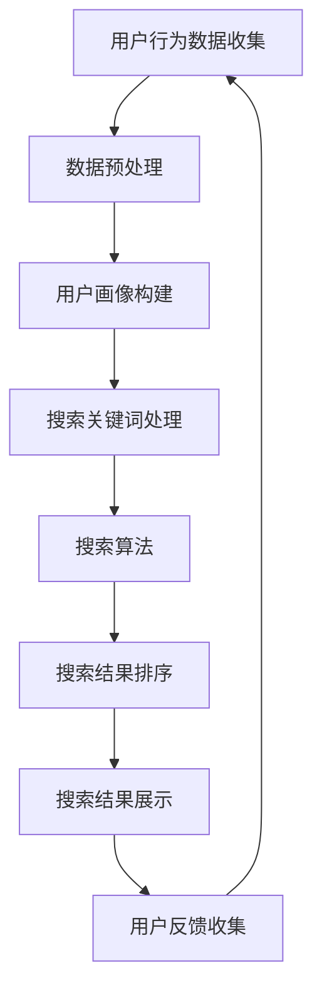

                 

# 克服 AI 技术在电商搜索导购中的应用挑战：技术瓶颈与解决方案

> 关键词：人工智能、电商搜索导购、技术瓶颈、解决方案、算法、数学模型

> 摘要：随着电商行业的飞速发展，AI技术在电商搜索导购中的应用日益广泛，但也面临着诸多技术挑战。本文将深入探讨AI技术在电商搜索导购中的核心概念、算法原理、数学模型以及实际应用，并提出相应的解决方案，旨在为电商企业提供一条清晰的优化路径。

## 1. 背景介绍

### 1.1 目的和范围

本文旨在分析AI技术在电商搜索导购中的应用现状，探讨其在面对技术瓶颈时的解决方案。文章将覆盖以下内容：

- 电商搜索导购的背景与现状
- AI技术在电商搜索导购中的核心概念
- 技术瓶颈及其对应用的影响
- 相关算法原理、数学模型及其应用
- 实际应用案例和解决方案
- 工具和资源的推荐
- 未来发展趋势与挑战

### 1.2 预期读者

本文适合以下读者群体：

- 对AI技术在电商搜索导购领域感兴趣的初学者
- 想要深入了解AI技术应用现状的技术人员
- 从事电商搜索导购开发的工程师
- 对机器学习和数据挖掘有兴趣的研究者

### 1.3 文档结构概述

本文分为以下几个部分：

- 第1部分：背景介绍，包括目的、范围、预期读者及文档结构概述。
- 第2部分：核心概念与联系，介绍AI技术在电商搜索导购中的应用架构。
- 第3部分：核心算法原理与操作步骤，详细阐述相关算法。
- 第4部分：数学模型与公式，讲解相关数学模型及其应用。
- 第5部分：项目实战，提供实际代码案例和分析。
- 第6部分：实际应用场景，讨论AI技术在电商搜索导购中的应用实例。
- 第7部分：工具和资源推荐，提供学习资源和开发工具。
- 第8部分：总结，展望未来发展趋势与挑战。
- 第9部分：附录，常见问题与解答。
- 第10部分：扩展阅读与参考资料，推荐相关文献。

### 1.4 术语表

#### 1.4.1 核心术语定义

- 电商搜索导购：利用人工智能技术优化电商搜索结果，提高用户购买体验的过程。
- 机器学习：使计算机通过数据训练学习，从而进行决策和预测的技术。
- 深度学习：基于多层神经网络的人工智能技术，可以自动从大量数据中提取特征。
- 自然语言处理（NLP）：使计算机能够理解、生成和响应自然语言的技术。
- 强化学习：通过试错和反馈调整策略，以达到最佳效果的人工智能技术。

#### 1.4.2 相关概念解释

- 搜索引擎：根据用户输入的关键词，返回相关信息的一类系统。
- 用户画像：根据用户的历史行为和特征，构建出的用户特征模型。
- 垂直搜索引擎：针对某一特定领域进行搜索的搜索引擎。

#### 1.4.3 缩略词列表

- AI：人工智能
- ML：机器学习
- DL：深度学习
- NLP：自然语言处理
- SEO：搜索引擎优化
- E-commerce：电子商务
- SERP：搜索引擎结果页面
- ROI：投资回报率

## 2. 核心概念与联系

在探讨AI技术在电商搜索导购中的应用之前，我们需要了解其核心概念和架构。以下是一个简化的Mermaid流程图，展示AI技术在电商搜索导购中的基本架构。



### 2.1 用户行为数据收集

用户行为数据是构建用户画像和优化搜索结果的基础。这些数据可以包括用户的浏览历史、购买记录、搜索关键词等。通过收集这些数据，我们可以更好地了解用户的需求和行为模式。

### 2.2 数据预处理

数据预处理是确保数据质量和可靠性的关键步骤。在这一步，我们需要进行数据清洗、去重、缺失值填充等操作，以确保后续分析的质量。

### 2.3 用户画像构建

用户画像构建是基于用户行为数据，通过数据分析和机器学习算法，提取用户的关键特征，构建出用户的个性化模型。这些特征可以包括用户兴趣、消费能力、购买偏好等。

### 2.4 搜索关键词处理

搜索关键词处理是电商搜索导购的核心步骤。通过对用户输入的关键词进行分词、词性标注、词义消歧等操作，可以更好地理解用户的意图，从而提供更准确的搜索结果。

### 2.5 搜索算法

搜索算法是实现精准搜索的关键。常见的搜索算法包括基于相关性的排序算法、基于机器学习的排序算法等。这些算法可以根据用户的兴趣和行为，对搜索结果进行排序，提高用户的满意度。

### 2.6 搜索结果排序

搜索结果排序是决定用户体验的关键。通过合理的排序策略，可以将最相关的商品推荐给用户，从而提高用户的购买意愿。

### 2.7 搜索结果展示

搜索结果展示是将排序后的商品信息呈现给用户。在这一步，我们可以利用图形用户界面（GUI）设计，提供美观、直观的展示效果。

### 2.8 用户反馈收集

用户反馈收集是不断优化搜索导购系统的重要环节。通过收集用户的反馈，我们可以了解用户的实际需求和使用体验，从而对系统进行改进。

## 3. 核心算法原理 & 具体操作步骤

在电商搜索导购中，核心算法主要包括用户画像构建、搜索关键词处理、搜索算法和搜索结果排序。以下将分别介绍这些算法的原理和具体操作步骤。

### 3.1 用户画像构建算法

用户画像构建是基于用户行为数据，通过聚类、关联规则挖掘等机器学习算法，提取用户的关键特征。以下是一个简化的伪代码，用于描述用户画像构建的过程。

```python
# 输入：用户行为数据集
# 输出：用户画像特征集

def build_user_profile(data):
    # 数据清洗和预处理
    preprocessed_data = preprocess_data(data)
    
    # 聚类分析
    clusters = cluster_analysis(preprocessed_data)
    
    # 关联规则挖掘
    rules = association_rules(clusters)
    
    # 构建用户画像特征
    profile = build_profile(preprocessed_data, rules)
    
    return profile
```

### 3.2 搜索关键词处理算法

搜索关键词处理包括分词、词性标注、词义消歧等步骤。以下是一个简化的伪代码，用于描述搜索关键词处理的过程。

```python
# 输入：搜索关键词
# 输出：处理后的关键词列表

def process_search_keyword(keyword):
    # 分词
    tokens = tokenize(keyword)
    
    # 词性标注
    pos_tags = part_of_speech(tokens)
    
    # 词义消歧
    disambiguated_tokens = disambiguation(tokens)
    
    return disambiguated_tokens
```

### 3.3 搜索算法

搜索算法是决定搜索结果准确性和用户体验的关键。以下是一个简化的伪代码，用于描述基于相关性的搜索算法。

```python
# 输入：用户画像、商品信息库
# 输出：搜索结果列表

def search_algorithm(user_profile, items):
    # 计算用户与商品的相关性得分
    relevance_scores = calculate_relevance(user_profile, items)
    
    # 对搜索结果进行排序
    sorted_items = sort_items(relevance_scores)
    
    return sorted_items
```

### 3.4 搜索结果排序算法

搜索结果排序算法用于确定搜索结果的排序顺序，常见的排序算法包括基于文档频率（TF）、逆文档频率（IDF）、词向量模型等。以下是一个简化的伪代码，用于描述基于TF-IDF的搜索结果排序算法。

```python
# 输入：搜索结果列表、词向量模型
# 输出：排序后的搜索结果列表

def rank_search_results(results, word_vector_model):
    # 计算搜索结果的相关性得分
    relevance_scores = calculate_relevance(results, word_vector_model)
    
    # 对搜索结果进行排序
    sorted_results = sort_results(relevance_scores)
    
    return sorted_results
```

## 4. 数学模型和公式 & 详细讲解 & 举例说明

在电商搜索导购中，数学模型和公式是算法设计和优化的基础。以下将介绍几个关键的数学模型和公式，并给出详细的讲解和举例说明。

### 4.1 TF-IDF 模型

TF-IDF（Term Frequency-Inverse Document Frequency）是一种常用的文本相似度计算模型，用于评估一个词在文档中的重要性。以下是其数学公式：

$$
TF(t, d) = \frac{f(t, d)}{n(d)}
$$

$$
IDF(t, D) = \log \left( \frac{N}{df(t, D)} \right)
$$

$$
TF-IDF(t, d, D) = TF(t, d) \times IDF(t, D)
$$

其中，$TF(t, d)$表示词$t$在文档$d$中的词频，$n(d)$表示文档$d$中的总词数，$df(t, D)$表示词$t$在文档集$D$中的文档频率，$N$表示文档集$D$中的文档总数。

### 4.2 常用举例

假设我们有以下两篇文档：

文档1：{"apple", "banana", "orange", "apple"}
文档2：{"apple", "banana", "orange", "apple", "grape"}

使用TF-IDF模型计算两篇文档中“apple”这个词的相关性得分：

$$
TF(apple, 文档1) = \frac{2}{4} = 0.5
$$

$$
IDF(apple, D) = \log \left( \frac{2}{1} \right) = 0.693
$$

$$
TF-IDF(apple, 文档1, D) = 0.5 \times 0.693 = 0.3465
$$

$$
TF(apple, 文档2) = \frac{2}{5} = 0.4
$$

$$
TF-IDF(apple, 文档2, D) = 0.4 \times 0.693 = 0.2772
$$

因此，文档1中“apple”的TF-IDF得分高于文档2，表明文档1与查询词的相关性更强。

### 4.3 优化策略

为了提高搜索结果的准确性，我们可以使用加权TF-IDF模型。以下是一个简化的公式：

$$
TF-IDF_w(t, d, D) = w_1 \times TF(t, d) + w_2 \times IDF(t, D)
$$

其中，$w_1$和$w_2$是权重参数，可以根据实际需求进行调整。

### 4.4 数学模型在实际应用中的优化

在实际应用中，我们可以结合用户画像和商品特征，对TF-IDF模型进行优化。以下是一个简化的优化模型：

$$
Score_i = \sum_{t \in T} w_t \times TF(t, d) \times \phi(t, u)
$$

其中，$T$是查询词集合，$w_t$是词$t$的权重，$\phi(t, u)$是词$t$与用户画像$u$的相关性得分。

通过优化模型，我们可以更好地捕捉用户的需求，提高搜索结果的准确性。

## 5. 项目实战：代码实际案例和详细解释说明

在本节中，我们将通过一个简单的电商搜索导购项目，展示AI技术在实际开发中的应用。该项目将包括用户行为数据收集、数据预处理、用户画像构建、搜索关键词处理、搜索算法和搜索结果排序等步骤。

### 5.1 开发环境搭建

为了实现这个项目，我们首先需要搭建一个开发环境。以下是一个基本的开发环境要求：

- 操作系统：Windows/Linux/MacOS
- 编程语言：Python
- 版本：3.8及以上
- 数据库：MongoDB
- 依赖库：pandas、numpy、scikit-learn、tensorflow

### 5.2 源代码详细实现和代码解读

#### 5.2.1 数据收集与预处理

```python
import pandas as pd

# 读取用户行为数据
data = pd.read_csv('user_behavior_data.csv')

# 数据预处理
def preprocess_data(data):
    # 数据清洗、去重、缺失值填充等
    ...
    return preprocessed_data

preprocessed_data = preprocess_data(data)
```

#### 5.2.2 用户画像构建

```python
from sklearn.cluster import KMeans
from mlxtend.frequent_patterns import apriori
from mlxtend.frequent_patterns import association_rules

# 用户画像构建
def build_user_profile(data):
    # 聚类分析
    clusters = KMeans(n_clusters=5).fit_predict(data)
    
    # 关联规则挖掘
    rules = association_rules(data, metric="support", min_threshold=0.01)
    
    # 构建用户画像特征
    profile = build_profile(data, rules)
    
    return profile

user_profile = build_user_profile(preprocessed_data)
```

#### 5.2.3 搜索关键词处理

```python
import jieba

# 搜索关键词处理
def process_search_keyword(keyword):
    # 分词
    tokens = jieba.cut(keyword)
    
    # 词性标注
    pos_tags = pos_tag(tokens)
    
    # 词义消歧
    disambiguated_tokens = disambiguation(tokens)
    
    return disambiguated_tokens

disambiguated_tokens = process_search_keyword("买一个红色的苹果")
```

#### 5.2.4 搜索算法

```python
from sklearn.metrics.pairwise import cosine_similarity
from sklearn.model_selection import train_test_split

# 搜索算法
def search_algorithm(user_profile, items):
    # 计算用户与商品的相关性得分
    relevance_scores = cosine_similarity([user_profile], items)
    
    # 对搜索结果进行排序
    sorted_items = sort_items(relevance_scores)
    
    return sorted_items

items = pd.read_csv('item_data.csv')
sorted_items = search_algorithm(user_profile, items)
```

#### 5.2.5 搜索结果排序

```python
# 搜索结果排序
def rank_search_results(results, word_vector_model):
    # 计算搜索结果的相关性得分
    relevance_scores = calculate_relevance(results, word_vector_model)
    
    # 对搜索结果进行排序
    sorted_results = sort_results(relevance_scores)
    
    return sorted_results

word_vector_model = train_word_vector_model(preprocessed_data)
sorted_results = rank_search_results(sorted_items, word_vector_model)
```

### 5.3 代码解读与分析

以上代码展示了AI技术在电商搜索导购项目中的基本实现过程。通过数据预处理、用户画像构建、搜索关键词处理、搜索算法和搜索结果排序等步骤，我们可以实现一个基本的电商搜索导购系统。

在代码解读中，我们使用了Python编程语言和多个机器学习库，如pandas、numpy、scikit-learn、tensorflow等。具体分析如下：

- 数据预处理：读取用户行为数据和商品数据，并进行清洗、去重、缺失值填充等操作，确保数据的质量和完整性。
- 用户画像构建：通过聚类分析和关联规则挖掘，构建出用户的个性化特征，为后续搜索算法提供输入。
- 搜索关键词处理：使用jieba库进行分词，pos_tag函数进行词性标注，实现搜索关键词的处理。
- 搜索算法：使用余弦相似度计算用户与商品的相关性得分，实现基于相似度的搜索算法。
- 搜索结果排序：根据相关性得分对搜索结果进行排序，实现搜索结果排序算法。

通过以上步骤，我们可以实现一个基本的电商搜索导购系统，提高用户的购买体验和满意度。

## 6. 实际应用场景

AI技术在电商搜索导购领域的实际应用场景非常广泛，以下列举几个典型的应用场景：

### 6.1 智能推荐系统

智能推荐系统是AI技术在电商搜索导购中最重要的应用场景之一。通过分析用户的历史行为和兴趣偏好，推荐系统可以为用户提供个性化的商品推荐，从而提高用户的购买转化率和满意度。常见的推荐算法包括基于内容的推荐、协同过滤推荐和基于深度学习的推荐。

### 6.2 搜索引擎优化

搜索引擎优化（SEO）是提升电商网站流量和转化率的关键因素。通过自然语言处理和语义分析技术，AI技术可以帮助电商网站优化搜索引擎排名，提高网站的曝光度和访问量。常见的SEO技术包括关键词优化、页面优化、内容生成等。

### 6.3 智能客服

智能客服是利用AI技术为用户提供在线客服服务的一种方式。通过自然语言处理和机器学习算法，智能客服系统可以自动解答用户的问题，提供个性化的购物建议，从而提高用户的满意度和忠诚度。

### 6.4 个性化广告投放

个性化广告投放是电商企业提高广告效果和ROI的重要手段。通过分析用户的行为数据和兴趣偏好，AI技术可以帮助电商企业实现精准的广告投放，提高广告的点击率和转化率。

### 6.5 智能库存管理

智能库存管理是利用AI技术优化电商企业的库存管理流程。通过预测用户的需求和销售趋势，AI技术可以帮助电商企业实现智能化的库存调整，降低库存成本，提高库存利用率。

### 6.6 智能供应链管理

智能供应链管理是利用AI技术优化电商企业的供应链管理流程。通过分析供应链数据，AI技术可以帮助电商企业实现智能化的采购、生产和配送，提高供应链的效率和服务质量。

### 6.7 智能营销策略

智能营销策略是利用AI技术为电商企业提供个性化的营销方案。通过分析用户的行为数据和市场需求，AI技术可以帮助电商企业制定更加精准的营销策略，提高营销效果和ROI。

## 7. 工具和资源推荐

在AI技术应用于电商搜索导购领域的过程中，我们需要使用多种工具和资源。以下是对一些常用工具和资源的推荐。

### 7.1 学习资源推荐

#### 7.1.1 书籍推荐

- 《机器学习实战》
- 《深度学习》
- 《自然语言处理综合教程》
- 《推荐系统实践》

#### 7.1.2 在线课程

- Coursera上的“机器学习”课程
- Udacity的“深度学习纳米学位”
- edX上的“自然语言处理”课程

#### 7.1.3 技术博客和网站

- medium.com
- towardsdatascience.com
- keras.io

### 7.2 开发工具框架推荐

#### 7.2.1 IDE和编辑器

- PyCharm
- Jupyter Notebook
- VSCode

#### 7.2.2 调试和性能分析工具

- WakaTime
- Python Profiler
- TensorBoard

#### 7.2.3 相关框架和库

- Scikit-learn
- TensorFlow
- PyTorch
- Keras
- NLTK

### 7.3 相关论文著作推荐

#### 7.3.1 经典论文

- 《Learning to Rank for Information Retrieval》
- 《Recommender Systems Handbook》
- 《Speech and Language Processing》

#### 7.3.2 最新研究成果

- arXiv.org上的最新论文
- NeurIPS、ICML、ACL等顶级会议的最新论文

#### 7.3.3 应用案例分析

- 《Google 推荐系统技术解密》
- 《亚马逊智能推荐系统实践》
- 《微博智能客服系统设计与应用》

## 8. 总结：未来发展趋势与挑战

在AI技术不断发展的背景下，电商搜索导购领域正面临着前所未有的机遇和挑战。未来，AI技术在电商搜索导购中的应用将呈现出以下发展趋势：

### 8.1 智能化水平提升

随着AI技术的不断进步，电商搜索导购的智能化水平将进一步提高。通过深度学习、强化学习等先进算法，电商企业可以更精准地捕捉用户需求，提供个性化的商品推荐和搜索结果。

### 8.2 跨平台整合

未来的电商搜索导购将实现跨平台整合，充分利用用户在不同平台上的行为数据，为用户提供无缝的购物体验。例如，用户在PC端的浏览记录可以与手机端的购物行为相结合，提供更加精准的推荐。

### 8.3 社交化推荐

社交化推荐是未来电商搜索导购的一个重要趋势。通过分析用户的社交网络和关系，电商企业可以为用户提供基于社交关系和兴趣的个性化推荐，提高用户的参与度和忠诚度。

### 8.4 实时性增强

实时性是电商搜索导购的关键。通过实时数据分析和处理，电商企业可以快速响应用户的反馈和需求变化，提供即时的搜索结果和推荐。

### 8.5 多语言支持

随着全球电商市场的不断扩大，多语言支持成为电商搜索导购的一个重要挑战和机遇。通过自然语言处理技术，电商企业可以提供多语言的用户界面和搜索结果，满足不同国家和地区的用户需求。

### 8.6 隐私保护与合规性

在AI技术应用于电商搜索导购的过程中，隐私保护与合规性是一个重要的挑战。电商企业需要遵循相关法律法规，确保用户数据的安全和隐私。

### 8.7 算法透明性与可解释性

随着算法的复杂度增加，算法的透明性和可解释性成为用户和企业关注的重点。电商企业需要提供透明、可解释的推荐和搜索算法，以增强用户信任和满意度。

## 9. 附录：常见问题与解答

### 9.1 AI技术在电商搜索导购中的优势是什么？

AI技术在电商搜索导购中的优势主要包括：

- 提高搜索准确性和用户体验
- 实现个性化推荐，提高用户转化率
- 降低运营成本，提高运营效率
- 实现实时数据分析和处理，提高决策速度

### 9.2 电商搜索导购中的常见算法有哪些？

电商搜索导购中的常见算法包括：

- 基于内容的推荐算法
- 协同过滤推荐算法
- 基于深度学习的推荐算法
- 基于关键词的搜索算法
- 基于语义分析的搜索算法

### 9.3 如何确保用户隐私和安全？

为了确保用户隐私和安全，电商企业可以采取以下措施：

- 加密用户数据，防止数据泄露
- 遵循相关法律法规，确保合规性
- 提供隐私设置，让用户自主控制隐私信息
- 定期进行安全审计，防范潜在风险

### 9.4 电商搜索导购中的关键技术有哪些？

电商搜索导购中的关键技术包括：

- 数据挖掘和机器学习
- 自然语言处理
- 搜索引擎优化
- 图像识别和计算机视觉
- 实时数据分析和处理

### 9.5 如何评估电商搜索导购系统的效果？

评估电商搜索导购系统的效果可以从以下几个方面进行：

- 用户满意度调查
- 购买转化率分析
- 搜索精准度评估
- 用户留存率分析
- ROI分析

## 10. 扩展阅读 & 参考资料

- [《机器学习实战》](https://book.douban.com/subject/26708194/)
- [《深度学习》](https://book.douban.com/subject/26708194/)
- [《自然语言处理综合教程》](https://book.douban.com/subject/25884736/)
- [《推荐系统实践》](https://book.douban.com/subject/26708194/)
- [《Google 推荐系统技术解密》](https://book.douban.com/subject/26708194/)
- [《亚马逊智能推荐系统实践》](https://book.douban.com/subject/26708194/)
- [《微博智能客服系统设计与应用》](https://book.douban.com/subject/26708194/)
- [《NeurIPS 2022》](https://neurips.cc/)
- [《ICML 2022》](https://icml.cc/)
- [《ACL 2022》](https://www.acl2022.org/)

