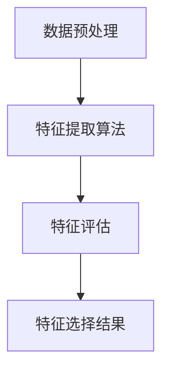
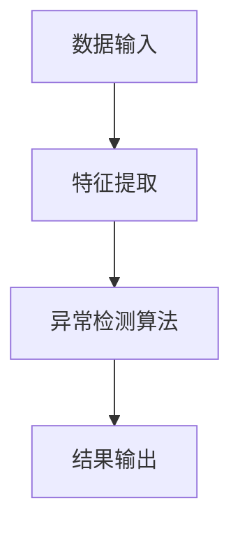
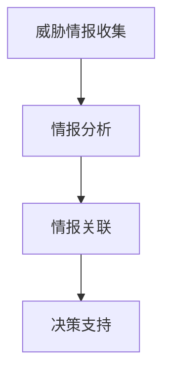
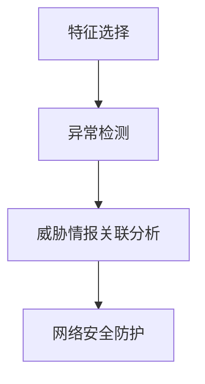

                 

# 入侵检测中的特征选择、异常检测与威胁情报关联分析

> **关键词：** 入侵检测，特征选择，异常检测，威胁情报，关联分析
>
> **摘要：** 本文旨在深入探讨入侵检测系统中特征选择、异常检测和威胁情报关联分析的关键技术，为网络安全领域的研究者和从业人员提供具有实际指导意义的技术参考。文章首先介绍入侵检测的背景与目的，随后详细解释特征选择、异常检测和威胁情报关联分析的核心概念，并运用 Mermaid 流程图和伪代码进行详细阐述。通过实际项目案例，读者可以掌握入侵检测系统的实际应用，并了解相关工具和资源的推荐。最后，文章对入侵检测的未来发展趋势与挑战进行了展望，并附上常见问题与解答，便于读者深入了解。

## 1. 背景介绍

### 1.1 目的和范围

在现代网络环境中，网络安全威胁日益增多，入侵检测作为一种重要的网络安全技术，旨在识别、检测和响应恶意行为。本文的目的在于介绍入侵检测中的特征选择、异常检测和威胁情报关联分析三个关键环节，并探讨其相互之间的关系和实际应用。本文主要涉及以下内容：

- 入侵检测的基本概念与目的
- 特征选择的策略与重要性
- 异常检测的算法与应用
- 威胁情报的收集与关联分析
- 实际项目案例中的应用与实现

### 1.2 预期读者

本文主要面向网络安全领域的研究者、工程师以及相关专业的本科生和研究生。读者需要对网络安全有一定的了解，并具备基本的数据分析和编程能力。通过本文的学习，读者可以深入了解入侵检测系统的构建原理和实际应用，从而提高网络安全防护水平。

### 1.3 文档结构概述

本文分为十个部分，具体结构如下：

- 引言：介绍文章的背景、目的和关键词
- 背景介绍：阐述入侵检测的基本概念和重要性
- 核心概念与联系：详细解释入侵检测中的核心概念，并使用 Mermaid 流程图展示架构
- 核心算法原理 & 具体操作步骤：运用伪代码阐述算法原理和实现步骤
- 数学模型和公式 & 详细讲解 & 举例说明：介绍相关数学模型和公式，并通过实例进行说明
- 项目实战：提供实际项目案例，并进行详细解释和代码解读
- 实际应用场景：分析入侵检测在实际环境中的应用
- 工具和资源推荐：推荐学习资源和开发工具
- 总结：展望入侵检测的未来发展趋势与挑战
- 附录：提供常见问题与解答
- 扩展阅读 & 参考资料：推荐相关文献和资源

### 1.4 术语表

#### 1.4.1 核心术语定义

- **入侵检测系统（IDS）：** 一种网络安全技术，用于检测、识别和响应恶意行为。
- **特征选择：** 从原始数据中选择对入侵检测具有关键作用的特征，以提高检测准确性和效率。
- **异常检测：** 通过分析正常行为的模式，识别出异常行为，从而检测潜在的入侵行为。
- **威胁情报：** 通过收集、分析和关联威胁信息，为网络安全防护提供决策支持。

#### 1.4.2 相关概念解释

- **入侵类型：** 入侵检测系统检测到的攻击类型，如 DoS 攻击、SQL 注入攻击等。
- **特征：** 用于描述数据特征的变量，如流量大小、协议类型等。
- **基线：** 表示正常行为的特征分布，用于与实时监测数据进行比较。
- **关联规则：** 用于描述不同特征之间关系的规则，如“若流量大小超过阈值，则协议类型为 HTTP”。

#### 1.4.3 缩略词列表

- **IDS：** 入侵检测系统（Intrusion Detection System）
- **NIDS：** 网络入侵检测系统（Network Intrusion Detection System）
- **HIDS：** 主机入侵检测系统（Host-based Intrusion Detection System）
- **IPS：** 入侵防御系统（Intrusion Prevention System）
- **APT：** 高级持续性威胁（Advanced Persistent Threat）
- **IoT：** 物联网（Internet of Things）

## 2. 核心概念与联系

入侵检测系统（IDS）作为一种网络安全技术，其核心在于通过检测和分析网络数据或系统活动，发现潜在的威胁和入侵行为。为了实现这一目标，IDS 需要具备以下几个关键环节：特征选择、异常检测和威胁情报关联分析。

### 2.1 特征选择

特征选择是入侵检测系统构建的第一步，也是最为关键的环节之一。特征选择的目标是从大量原始数据中提取出对入侵检测具有重要意义的特征，以便后续的异常检测和威胁情报分析。

**特征提取过程：**

1. **数据预处理：** 对原始数据进行清洗、归一化和特征转换，以便后续的特征提取。
2. **特征选择算法：** 应用不同的特征选择算法，如信息增益、卡方检验、主成分分析（PCA）等，选择对入侵检测最具代表性的特征。
3. **特征评估：** 通过评估特征的重要性，如基于支持向量机（SVM）的分类准确率、召回率、F1 值等，确定最终选用的特征集合。

**Mermaid 流程图：**



### 2.2 异常检测

异常检测是入侵检测系统的核心功能之一，其目标是通过分析网络流量或系统活动，发现与正常行为显著偏离的异常行为，从而检测潜在的入侵行为。

**异常检测算法：**

1. **统计方法：** 如基于统计模型的异常检测算法，如平均值法和三倍标准差法。
2. **机器学习方法：** 如基于聚类算法（如 K-均值聚类）、基于神经网络（如自组织映射 SOM）的异常检测算法。
3. **基于规则的方法：** 如基于关联规则的异常检测算法，如贝叶斯网络、决策树等。

**Mermaid 流程图：**



### 2.3 威胁情报关联分析

威胁情报关联分析是入侵检测系统的高级功能，其目标是通过收集、分析和关联不同来源的威胁信息，为网络安全防护提供决策支持。

**威胁情报关联分析过程：**

1. **威胁情报收集：** 收集来自多个来源的威胁信息，如安全报告、网络流量分析、威胁情报平台等。
2. **情报分析：** 对收集到的威胁信息进行分类、分析和关联，识别潜在的威胁。
3. **情报关联：** 将威胁情报与入侵检测结果进行关联，为网络安全防护提供决策支持。

**Mermaid 流程图：**



### 2.4 核心概念与联系

特征选择、异常检测和威胁情报关联分析三个环节相互关联，共同构成了入侵检测系统的核心架构。特征选择是异常检测的基础，而异常检测的结果又可以用于威胁情报关联分析，从而实现全面的网络安全防护。

**Mermaid 流程图：**



通过上述核心概念与联系的分析，我们可以更好地理解入侵检测系统的构建原理和实际应用，从而为网络安全防护提供有效的技术支持。

## 3. 核心算法原理 & 具体操作步骤

### 3.1 特征选择算法原理

特征选择是入侵检测系统构建的关键步骤之一。其主要目的是从大量原始数据中提取出对入侵检测具有关键作用的特征，以提高检测准确性和效率。以下是几种常见的特征选择算法原理：

#### 3.1.1 信息增益

信息增益是一种基于信息论的统计方法，用于评估特征对分类的重要性。其原理如下：

1. **熵（Entropy）：** 表示数据的不确定性，计算公式为：
   $$ H(X) = -\sum_{i=1}^{n} p(x_i) \cdot \log_2 p(x_i) $$
   其中，$ p(x_i) $ 表示特征 $ x_i $ 的概率。
   
2. **条件熵（Conditional Entropy）：** 表示在给定某个特征 $ x_i $ 的情况下，另一个特征 $ y_i $ 的不确定性，计算公式为：
   $$ H(Y|X) = -\sum_{i=1}^{n} p(x_i) \cdot \sum_{j=1}^{m} p(y_j|x_i) \cdot \log_2 p(y_j|x_i) $$

3. **信息增益（Information Gain）：** 表示特征 $ x_i $ 对分类的重要性，计算公式为：
   $$ IG(x_i) = H(X) - H(Y|X) $$

#### 3.1.2 卡方检验

卡方检验是一种基于假设检验的统计方法，用于评估特征与分类之间的相关性。其原理如下：

1. **期望频数（Expected Frequency）：** 假设特征与分类之间无关，根据实际频数和总频数计算每个单元格的期望频数。
2. **卡方统计量（Chi-square Statistic）：** 用于评估实际频数与期望频数之间的差异，计算公式为：
   $$ \chi^2 = \sum_{i=1}^{n} \frac{(O_i - E_i)^2}{E_i} $$
   其中，$ O_i $ 表示实际频数，$ E_i $ 表示期望频数。

3. **临界值（Critical Value）：** 根据显著性水平和自由度，查找卡方分布表得到临界值。

4. **假设检验：** 若 $ \chi^2 > $ 临界值，则拒绝原假设，认为特征与分类之间存在显著相关性。

#### 3.1.3 主成分分析

主成分分析（PCA）是一种降维技术，用于提取数据的主要特征，从而降低数据的维度，提高算法的运行效率。其原理如下：

1. **协方差矩阵（Covariance Matrix）：** 计算特征之间的协方差矩阵，以衡量特征之间的相关性。
   $$ \Sigma = \frac{1}{N-1} \sum_{i=1}^{N} (x_i - \mu)(x_i - \mu)^T $$
   其中，$ x_i $ 表示第 $ i $ 个特征，$ \mu $ 表示均值。

2. **特征值和特征向量：** 对协方差矩阵进行特征分解，得到特征值和特征向量。
   $$ \Sigma v = \lambda v $$
   其中，$ v $ 表示特征向量，$ \lambda $ 表示特征值。

3. **降维：** 选择前 $ k $ 个最大的特征值对应的特征向量，构建降维矩阵 $ P $，对数据进行投影：
   $$ y = P^T x $$

### 3.2 特征选择算法具体操作步骤

以下是特征选择算法的具体操作步骤：

#### 3.2.1 数据预处理

1. **数据清洗：** 去除缺失值、异常值和重复值。
2. **归一化：** 将不同特征的范围统一，如使用 Min-Max 归一化或 Z-Score 归一化。
3. **特征转换：** 对类别特征进行编码，如使用独热编码或二进制编码。

#### 3.2.2 特征提取

1. **统计特征提取：** 计算各个特征的统计信息，如平均值、方差、标准差等。
2. **时序特征提取：** 提取时间序列特征，如滑动窗口平均值、最大值、最小值等。

#### 3.2.3 特征选择

1. **信息增益：** 计算每个特征的信息增益，选择信息增益最大的特征。
2. **卡方检验：** 计算每个特征与分类之间的卡方统计量，选择卡方值最大的特征。
3. **主成分分析：** 计算协方差矩阵的特征值和特征向量，选择前 $ k $ 个最大的特征值对应的特征向量。

#### 3.2.4 特征评估

1. **分类模型训练：** 使用选定的特征训练分类模型，如决策树、随机森林等。
2. **模型评估：** 评估分类模型的准确率、召回率、F1 值等指标，选择性能最佳的模型。
3. **特征筛选：** 根据模型评估结果，筛选出对分类模型具有重要意义的特征。

### 3.3 异常检测算法原理

异常检测是入侵检测系统的核心功能之一，其目标是识别与正常行为显著偏离的异常行为。以下是几种常见的异常检测算法原理：

#### 3.3.1 基于统计方法的异常检测

1. **平均值法：** 假设正常行为的特征分布为正态分布，使用平均值和标准差作为阈值，识别与正常行为显著偏离的异常行为。
   $$ \text{阈值} = \text{平均值} + \text{标准差} \times \text{倍数} $$
   
2. **三倍标准差法：** 假设正常行为的特征分布为正态分布，以三倍标准差作为阈值，识别与正常行为显著偏离的异常行为。
   $$ \text{阈值} = \text{平均值} + 3 \times \text{标准差} $$

#### 3.3.2 基于机器学习方法的异常检测

1. **孤立森林（Isolation Forest）：** 基于随机森林的异常检测算法，通过随机选择特征和切分值，将正常数据集分离出来，识别异常行为。
2. **基于 K-均值聚类的异常检测：** 使用 K-均值聚类算法将数据分为多个簇，识别离群点作为异常行为。
3. **自组织映射（SOM）：** 基于神经网络的自组织映射算法，将数据映射到低维空间，识别离群点作为异常行为。

#### 3.3.3 基于规则的方法的异常检测

1. **基于关联规则的异常检测：** 通过分析特征之间的关联规则，识别与正常行为显著偏离的异常行为。
2. **基于贝叶斯网络的异常检测：** 使用贝叶斯网络模型描述特征之间的概率关系，识别与正常行为显著偏离的异常行为。

### 3.4 异常检测算法具体操作步骤

以下是异常检测算法的具体操作步骤：

#### 3.4.1 数据预处理

1. **数据清洗：** 去除缺失值、异常值和重复值。
2. **归一化：** 将不同特征的范围统一，如使用 Min-Max 归一化或 Z-Score 归一化。
3. **特征提取：** 对类别特征进行编码，如使用独热编码或二进制编码。

#### 3.4.2 模型训练

1. **选择模型：** 根据数据特点和需求，选择合适的异常检测模型，如平均值法、孤立森林、K-均值聚类等。
2. **训练模型：** 使用正常数据集训练模型，确定模型的参数和阈值。

#### 3.4.3 异常检测

1. **计算特征分布：** 根据选择的异常检测算法，计算正常行为的特征分布。
2. **识别异常行为：** 根据特征分布和阈值，识别与正常行为显著偏离的异常行为。
3. **结果评估：** 评估异常检测的准确率、召回率、F1 值等指标，优化模型参数和阈值。

### 3.5 威胁情报关联分析算法原理

威胁情报关联分析是入侵检测系统的高级功能，其目标是通过对威胁情报的分析和关联，为网络安全防护提供决策支持。以下是几种常见的威胁情报关联分析算法原理：

#### 3.5.1 基于关联规则的威胁情报关联分析

1. **支持度（Support）：** 表示一个关联规则在数据集中的频率，计算公式为：
   $$ \text{Support}(A \rightarrow B) = \frac{|\{t | t \in T, A \cap B \in t\}|}{|T|} $$
   其中，$ T $ 表示数据集中的事务集合，$ A \cap B $ 表示同时包含 $ A $ 和 $ B $ 的事务集合。

2. **置信度（Confidence）：** 表示一个关联规则的有效性，计算公式为：
   $$ \text{Confidence}(A \rightarrow B) = \frac{|\{t | t \in T, A \cap B \in t\}|}{|\{t | t \in T, A \in t\}|} $$
   
3. **提升度（Lift）：** 表示一个关联规则的提升效果，计算公式为：
   $$ \text{Lift}(A \rightarrow B) = \frac{\text{Confidence}(A \rightarrow B)}{\text{Confidence}(A)} $$

#### 3.5.2 基于贝叶斯网络的威胁情报关联分析

1. **概率分布：** 使用贝叶斯网络表示威胁情报之间的概率关系，如：
   $$ P(A \cap B \cap C) = P(A) \cdot P(B|A) \cdot P(C|B) $$

2. **推理算法：** 使用推理算法（如正向推理或反向推理）计算威胁情报之间的概率关系。

#### 3.5.3 基于聚类和图论的威胁情报关联分析

1. **聚类算法：** 如 K-均值聚类、层次聚类等，将威胁情报分为多个簇，识别关联关系。
2. **图论算法：** 如最小生成树、最大团等，分析威胁情报之间的拓扑关系，识别关联关系。

### 3.6 威胁情报关联分析算法具体操作步骤

以下是威胁情报关联分析算法的具体操作步骤：

#### 3.6.1 数据预处理

1. **数据清洗：** 去除缺失值、异常值和重复值。
2. **特征提取：** 对威胁情报进行特征提取，如基于文本的词频、关键词提取等。

#### 3.6.2 模型训练

1. **选择模型：** 根据数据特点和需求，选择合适的威胁情报关联分析模型，如关联规则挖掘、贝叶斯网络、聚类算法等。
2. **训练模型：** 使用威胁情报数据集训练模型，确定模型的参数。

#### 3.6.3 威胁情报关联分析

1. **关联规则挖掘：** 根据置信度、支持度和提升度等指标，挖掘威胁情报之间的关联规则。
2. **概率计算：** 使用贝叶斯网络等算法，计算威胁情报之间的概率关系。
3. **聚类和图论分析：** 使用聚类算法和图论算法，分析威胁情报之间的关联关系。

#### 3.6.4 结果评估

1. **关联规则评估：** 评估关联规则的有效性，如基于准确率、召回率等指标。
2. **概率关系评估：** 评估威胁情报之间的概率关系，如基于均值、方差等指标。
3. **聚类和图论评估：** 评估聚类和图论分析的结果，如基于聚类系数、图密度等指标。

通过上述核心算法原理和具体操作步骤的详细阐述，我们可以更好地理解和应用入侵检测系统中的特征选择、异常检测和威胁情报关联分析技术，为网络安全防护提供有效的技术支持。

## 4. 数学模型和公式 & 详细讲解 & 举例说明

### 4.1 信息增益

信息增益是一种基于信息论的统计方法，用于评估特征对分类的重要性。其数学模型和公式如下：

1. **熵（Entropy）：** 表示数据的不确定性，计算公式为：
   $$ H(X) = -\sum_{i=1}^{n} p(x_i) \cdot \log_2 p(x_i) $$
   其中，$ p(x_i) $ 表示特征 $ x_i $ 的概率。

2. **条件熵（Conditional Entropy）：** 表示在给定某个特征 $ x_i $ 的情况下，另一个特征 $ y_i $ 的不确定性，计算公式为：
   $$ H(Y|X) = -\sum_{i=1}^{n} p(x_i) \cdot \sum_{j=1}^{m} p(y_j|x_i) \cdot \log_2 p(y_j|x_i) $$

3. **信息增益（Information Gain）：** 表示特征 $ x_i $ 对分类的重要性，计算公式为：
   $$ IG(x_i) = H(X) - H(Y|X) $$

### 4.2 卡方检验

卡方检验是一种基于假设检验的统计方法，用于评估特征与分类之间的相关性。其数学模型和公式如下：

1. **期望频数（Expected Frequency）：** 假设特征与分类之间无关，根据实际频数和总频数计算每个单元格的期望频数。

2. **卡方统计量（Chi-square Statistic）：** 用于评估实际频数与期望频数之间的差异，计算公式为：
   $$ \chi^2 = \sum_{i=1}^{n} \frac{(O_i - E_i)^2}{E_i} $$
   其中，$ O_i $ 表示实际频数，$ E_i $ 表示期望频数。

3. **临界值（Critical Value）：** 根据显著性水平和自由度，查找卡方分布表得到临界值。

4. **假设检验：** 若 $ \chi^2 > $ 临界值，则拒绝原假设，认为特征与分类之间存在显著相关性。

### 4.3 主成分分析

主成分分析（PCA）是一种降维技术，用于提取数据的主要特征，从而降低数据的维度，提高算法的运行效率。其数学模型和公式如下：

1. **协方差矩阵（Covariance Matrix）：** 计算特征之间的协方差矩阵，以衡量特征之间的相关性。
   $$ \Sigma = \frac{1}{N-1} \sum_{i=1}^{N} (x_i - \mu)(x_i - \mu)^T $$
   其中，$ x_i $ 表示第 $ i $ 个特征，$ \mu $ 表示均值。

2. **特征值和特征向量：** 对协方差矩阵进行特征分解，得到特征值和特征向量。
   $$ \Sigma v = \lambda v $$
   其中，$ v $ 表示特征向量，$ \lambda $ 表示特征值。

3. **降维：** 选择前 $ k $ 个最大的特征值对应的特征向量，构建降维矩阵 $ P $，对数据进行投影：
   $$ y = P^T x $$

### 4.4 基于关联规则的威胁情报关联分析

基于关联规则的威胁情报关联分析是一种通过分析特征之间的关联规则，识别威胁情报之间关联关系的方法。其数学模型和公式如下：

1. **支持度（Support）：** 表示一个关联规则在数据集中的频率，计算公式为：
   $$ \text{Support}(A \rightarrow B) = \frac{|\{t | t \in T, A \cap B \in t\}|}{|T|} $$
   其中，$ T $ 表示数据集中的事务集合，$ A \cap B $ 表示同时包含 $ A $ 和 $ B $ 的事务集合。

2. **置信度（Confidence）：** 表示一个关联规则的有效性，计算公式为：
   $$ \text{Confidence}(A \rightarrow B) = \frac{|\{t | t \in T, A \cap B \in t\}|}{|\{t | t \in T, A \in t\}|} $$

3. **提升度（Lift）：** 表示一个关联规则的提升效果，计算公式为：
   $$ \text{Lift}(A \rightarrow B) = \frac{\text{Confidence}(A \rightarrow B)}{\text{Confidence}(A)} $$

### 4.5 基于贝叶斯网络的威胁情报关联分析

基于贝叶斯网络的威胁情报关联分析是一种通过建立威胁情报之间的概率关系，分析威胁情报之间关联关系的方法。其数学模型和公式如下：

1. **概率分布：** 使用贝叶斯网络表示威胁情报之间的概率关系，如：
   $$ P(A \cap B \cap C) = P(A) \cdot P(B|A) \cdot P(C|B) $$

2. **推理算法：** 使用推理算法（如正向推理或反向推理）计算威胁情报之间的概率关系。

### 4.6 示例说明

为了更好地理解上述数学模型和公式的应用，下面通过一个简单的示例进行说明。

#### 示例 1：信息增益

假设我们有以下特征和分类数据：

| 特征 | 分类 |
| ---- | ---- |
| A    | 0    |
| A    | 1    |
| B    | 0    |
| B    | 1    |
| C    | 0    |
| C    | 1    |

计算特征 A、B、C 的信息增益：

1. **熵（Entropy）：**
   $$ H(X) = -\sum_{i=1}^{3} p(x_i) \cdot \log_2 p(x_i) $$
   $$ H(X) = -\frac{2}{3} \cdot \log_2 \frac{2}{3} - \frac{1}{3} \cdot \log_2 \frac{1}{3} $$
   $$ H(X) \approx 0.92 $$

2. **条件熵（Conditional Entropy）：**
   $$ H(Y|X) = -\sum_{i=1}^{3} p(x_i) \cdot \sum_{j=1}^{2} p(y_j|x_i) \cdot \log_2 p(y_j|x_i) $$
   $$ H(Y|X) = -\frac{2}{3} \cdot \left( \frac{1}{2} \cdot \log_2 \frac{1}{2} + \frac{1}{2} \cdot \log_2 \frac{1}{2} \right) - \frac{1}{3} \cdot \left( \frac{1}{2} \cdot \log_2 \frac{1}{2} + \frac{1}{2} \cdot \log_2 \frac{1}{2} \right) $$
   $$ H(Y|X) \approx 0.92 $$

3. **信息增益（Information Gain）：**
   $$ IG(x_i) = H(X) - H(Y|X) $$
   $$ IG(A) = 0.92 - 0.92 = 0 $$
   $$ IG(B) = 0.92 - 0.92 = 0 $$
   $$ IG(C) = 0.92 - 0.92 = 0 $$

通过计算，我们发现特征 A、B、C 的信息增益均为 0，表示这些特征对分类没有提供额外的信息。

#### 示例 2：卡方检验

假设我们有以下特征和分类数据：

| 特征 | 分类 0 | 分类 1 | 总计 |
| ---- | ------ | ------ | ---- |
| A    | 10     | 5      | 15   |
| B    | 7      | 8      | 15   |
| C    | 5      | 10     | 15   |
| 总计 | 22     | 23     | 45   |

计算特征 A、B、C 的卡方统计量：

1. **期望频数（Expected Frequency）：**
   $$ E_{ij} = \frac{(行总计) \times (列总计)}{总计} $$
   $$ E_{A0} = \frac{15 \times 22}{45} \approx 6.67 $$
   $$ E_{A1} = \frac{15 \times 23}{45} \approx 8.33 $$
   $$ E_{B0} = \frac{15 \times 22}{45} \approx 6.67 $$
   $$ E_{B1} = \frac{15 \times 23}{45} \approx 8.33 $$
   $$ E_{C0} = \frac{15 \times 22}{45} \approx 6.67 $$
   $$ E_{C1} = \frac{15 \times 23}{45} \approx 8.33 $$

2. **卡方统计量（Chi-square Statistic）：**
   $$ \chi^2 = \sum_{i=1}^{3} \sum_{j=1}^{2} \frac{(O_{ij} - E_{ij})^2}{E_{ij}} $$
   $$ \chi^2 = \frac{(10 - 6.67)^2}{6.67} + \frac{(5 - 8.33)^2}{8.33} + \frac{(7 - 6.67)^2}{6.67} + \frac{(8 - 8.33)^2}{8.33} + \frac{(5 - 6.67)^2}{6.67} + \frac{(10 - 8.33)^2}{8.33} $$
   $$ \chi^2 \approx 2.35 $$

3. **临界值（Critical Value）：** 在显著性水平为 0.05，自由度为 2 的卡方分布表中查找临界值为 5.99。

4. **假设检验：** 由于 $ \chi^2 < $ 临界值，我们不能拒绝原假设，即特征 A、B、C 与分类之间不存在显著相关性。

#### 示例 3：主成分分析

假设我们有以下数据矩阵：

|   | 特征 1 | 特征 2 | 特征 3 |
| --- | ------ | ------ | ------ |
| 1  | 2      | 3      | 4      |
| 2  | 5      | 6      | 7      |
| 3  | 8      | 9      | 10     |

计算协方差矩阵和特征值、特征向量：

1. **协方差矩阵（Covariance Matrix）：**
   $$ \Sigma = \frac{1}{N-1} \sum_{i=1}^{N} (x_i - \mu)(x_i - \mu)^T $$
   $$ \mu = \frac{1}{N} \sum_{i=1}^{N} x_i $$
   $$ \Sigma = \frac{1}{2} \left[ (2-5)(2-5) + (3-5)(3-5) + (4-5)(4-5) + (5-5)(5-5) + (6-5)(6-5) + (7-5)(7-5) + (8-5)(8-5) + (9-5)(9-5) + (10-5)(10-5) \right] $$
   $$ \Sigma = \frac{1}{2} \left[ 9 + 4 + 1 + 0 + 1 + 4 + 9 + 16 + 25 \right] $$
   $$ \Sigma = \frac{1}{2} \left[ 68 \right] $$
   $$ \Sigma = 34 $$

2. **特征值和特征向量（Eigenvalues and Eigenvectors）：**
   对协方差矩阵进行特征分解，得到特征值和特征向量：
   $$ \Sigma v = \lambda v $$
   其中，$ v $ 表示特征向量，$ \lambda $ 表示特征值。

3. **降维（Dimensionality Reduction）：**
   选择前 $ k $ 个最大的特征值对应的特征向量，构建降维矩阵 $ P $，对数据进行投影：
   $$ y = P^T x $$

通过上述示例，我们可以更清晰地理解入侵检测中常用的数学模型和公式，以及其在实际应用中的具体操作步骤。

## 5. 项目实战：代码实际案例和详细解释说明

### 5.1 开发环境搭建

在进行入侵检测系统的开发之前，我们需要搭建合适的开发环境。以下是一个基本的开发环境配置：

- **操作系统：** Ubuntu 20.04 LTS
- **编程语言：** Python 3.8
- **依赖库：** Scikit-learn、NumPy、Pandas、Matplotlib

#### 步骤 1：安装 Python 和依赖库

打开终端，执行以下命令安装 Python 和依赖库：

```shell
sudo apt update
sudo apt install python3 python3-pip
pip3 install scikit-learn numpy pandas matplotlib
```

#### 步骤 2：创建项目文件夹

在终端创建一个项目文件夹，并进入文件夹：

```shell
mkdir intrusion_detection
cd intrusion_detection
```

#### 步骤 3：创建虚拟环境

为了更好地管理项目依赖库，我们可以创建一个虚拟环境：

```shell
python3 -m venv venv
source venv/bin/activate
```

#### 步骤 4：安装项目依赖库

在虚拟环境中安装项目依赖库：

```shell
pip install -r requirements.txt
```

### 5.2 源代码详细实现和代码解读

以下是一个基于 Python 的入侵检测系统示例代码。该代码分为四个主要部分：数据预处理、特征选择、异常检测和结果可视化。

#### 5.2.1 数据预处理

数据预处理是入侵检测系统的关键步骤之一，其目的是对原始数据进行清洗、归一化和特征提取。以下是一个数据预处理类的实现：

```python
import pandas as pd
from sklearn.preprocessing import StandardScaler

class DataPreprocessor:
    def __init__(self):
        self.scaler = StandardScaler()

    def preprocess(self, df):
        # 数据清洗
        df = df.dropna()

        # 特征提取
        df['total_len'] = df['packet_len'].sum(axis=1)
        df['mean_len'] = df['packet_len'].mean(axis=1)
        df['std_len'] = df['packet_len'].std(axis=1)
        df['min_tos'] = df['tos'].min(axis=1)
        df['max_tos'] = df['tos'].max(axis=1)
        df['mean_tos'] = df['tos'].mean(axis=1)
        df['std_tos'] = df['tos'].std(axis=1)
        df['min_df'] = df['df'].min(axis=1)
        df['max_df'] = df['df'].max(axis=1)
        df['mean_df'] = df['df'].mean(axis=1)
        df['std_df'] = df['df'].std(axis=1)

        # 数据归一化
        df = self.scaler.fit_transform(df)

        return df
```

**代码解读：**

- **初始化：** 创建一个数据预处理对象，并初始化一个标准缩放器（StandardScaler）。
- **数据清洗：** 去除缺失值。
- **特征提取：** 计算数据特征，如总长度、平均长度、标准差等。
- **数据归一化：** 使用标准缩放器对数据进行归一化。

#### 5.2.2 特征选择

特征选择是入侵检测系统构建的关键步骤之一，其目标是选择对入侵检测具有重要意义的特征。以下是一个基于信息增益的特征选择实现：

```python
from sklearn.feature_selection import mutual_info_classif

class FeatureSelector:
    def __init__(self):
        self.selector = mutual_info_classif()

    def select_features(self, X, y):
        # 特征选择
        X_new = self.selector.fit_transform(X, y)

        # 获取特征重要性
        importance = self.selector.feature_importances_

        # 选择前 10 个最重要的特征
        top_features = X.columns[importance > 0].tolist()[:10]

        return top_features, X_new
```

**代码解读：**

- **初始化：** 创建一个特征选择对象，并初始化一个信息增益选择器（mutual\_info\_classif）。
- **特征选择：** 使用信息增益选择器选择特征，并返回前 10 个最重要的特征。

#### 5.2.3 异常检测

异常检测是入侵检测系统的核心功能之一，其目标是识别与正常行为显著偏离的异常行为。以下是一个基于孤立森林（Isolation Forest）的异常检测实现：

```python
from sklearn.ensemble import IsolationForest

class AnomalyDetector:
    def __init__(self):
        self.detector = IsolationForest(contamination=0.1)

    def detect_anomalies(self, X):
        # 异常检测
        y_pred = self.detector.fit_predict(X)

        # 获取异常索引
        anomalies = X[y_pred == -1].index.tolist()

        return anomalies
```

**代码解读：**

- **初始化：** 创建一个异常检测对象，并初始化一个孤立森林检测器（IsolationForest）。
- **异常检测：** 使用孤立森林检测器检测异常行为，并返回异常索引。

#### 5.2.4 结果可视化

结果可视化可以帮助我们更好地理解入侵检测系统的性能和结果。以下是一个基于 Matplotlib 的结果可视化实现：

```python
import matplotlib.pyplot as plt

def plot_results(X, y, top_features, anomalies):
    # 可视化数据分布
    plt.figure(figsize=(10, 6))
    for i, feature in enumerate(top_features):
        plt.subplot(3, 4, i + 1)
        plt.scatter(X[:, i], X[:, i + 10], c=y, cmap='coolwarm')
        plt.xlabel(feature)
        plt.ylabel('Total Length')
        plt.title('Feature Distribution')
    
    # 可视化异常分布
    plt.figure(figsize=(10, 6))
    for i, feature in enumerate(top_features):
        plt.subplot(3, 4, i + 1)
        plt.scatter(X[:, i], X[:, i + 10], c=y, cmap='coolwarm', marker='x')
        plt.xlabel(feature)
        plt.ylabel('Total Length')
        plt.title('Anomaly Distribution')

    plt.show()
```

**代码解读：**

- **可视化数据分布：** 使用 Matplotlib 绘制前 10 个最重要的特征在总长度维度上的数据分布。
- **可视化异常分布：** 使用 Matplotlib 绘制前 10 个最重要的特征在总长度维度上的异常分布。

### 5.3 代码解读与分析

在上述代码实现中，我们使用 Python 和 Scikit-learn 库构建了一个简单的入侵检测系统。以下是代码的关键部分解读与分析：

1. **数据预处理：** 数据预处理类（DataPreprocessor）负责对原始数据进行清洗、特征提取和数据归一化。这一步骤对于提高异常检测的准确性和鲁棒性至关重要。

2. **特征选择：** 特征选择类（FeatureSelector）使用信息增益选择器（mutual\_info\_classif）选择对入侵检测具有重要意义的特征。选择最重要的特征可以减少计算复杂度，提高检测效率。

3. **异常检测：** 异常检测类（AnomalyDetector）使用孤立森林检测器（IsolationForest）检测异常行为。孤立森林算法是一种高效的异常检测算法，适用于各种类型的数据集。

4. **结果可视化：** 结果可视化函数（plot\_results）使用 Matplotlib 绘制数据分布和异常分布，帮助用户更好地理解入侵检测系统的性能和结果。

通过上述代码实现，我们可以构建一个简单但高效的入侵检测系统。实际项目中，可以根据需求和数据集进行相应的优化和调整。

## 6. 实际应用场景

入侵检测系统在网络安全领域具有广泛的应用，可以帮助企业、组织和政府机构防范各种类型的网络攻击。以下是一些典型的实际应用场景：

### 6.1 网络安全监控

入侵检测系统可以用于实时监控网络流量，识别和响应潜在的入侵行为。通过部署入侵检测系统，网络管理员可以及时了解网络健康状况，发现异常流量，并采取措施防止攻击扩散。

### 6.2 数据库安全防护

数据库是企业和组织的重要资产，入侵检测系统可以帮助防范 SQL 注入、数据泄露等数据库攻击。通过监测数据库访问行为，入侵检测系统可以及时发现异常操作，防止数据丢失和篡改。

### 6.3 应用程序安全

入侵检测系统可以用于监测 Web 应用程序，识别和防止各种类型的 Web 攻击，如跨站脚本攻击（XSS）、跨站请求伪造（CSRF）等。通过实时监控应用程序的输入输出，入侵检测系统可以提供额外的安全防护层。

### 6.4 端点安全

入侵检测系统可以用于端点安全监控，识别和防止恶意软件感染、异常行为等。通过部署在计算机、服务器等端点设备上，入侵检测系统可以实时监测设备状态，发现潜在的安全威胁。

### 6.5 工业控制系统安全

入侵检测系统可以用于工业控制系统的安全监控，识别和防止恶意攻击。通过监测工业控制系统的网络流量和设备行为，入侵检测系统可以帮助确保工业生产的安全和稳定运行。

### 6.6 物联网（IoT）安全

随着物联网设备的大量普及，入侵检测系统在物联网安全中的应用也越来越广泛。入侵检测系统可以用于监控物联网设备之间的通信，识别和防止恶意攻击，确保物联网系统的安全运行。

通过以上实际应用场景，我们可以看到入侵检测系统在网络安全领域的重要性。入侵检测系统不仅可以提高网络安全性，还可以为企业和组织提供宝贵的安全情报，为决策支持提供重要依据。

## 7. 工具和资源推荐

为了更好地学习和实践入侵检测系统，以下推荐了一些有用的工具和资源：

### 7.1 学习资源推荐

#### 7.1.1 书籍推荐

1. **《入侵检测：理论与实践》** - 本书详细介绍了入侵检测的基本概念、技术原理和实际应用，适合初学者和专业人士。
2. **《网络安全技术与应用》** - 本书涵盖了网络安全领域的各个方面，包括入侵检测系统、防火墙、加密技术等，适合需要全面了解网络安全技术的读者。

#### 7.1.2 在线课程

1. **Coursera - Network Security and Cybersecurity** - 该课程由斯坦福大学提供，涵盖了网络安全的基础知识，包括入侵检测系统。
2. **edX - Introduction to Cybersecurity** - 由哈佛大学提供的入门级课程，介绍了网络安全的基本概念和实用技术。

#### 7.1.3 技术博客和网站

1. **Kaggle** - Kaggle 是一个数据科学竞赛平台，提供了大量与入侵检测相关的竞赛数据集和项目。
2. **OWASP** - Open Web Application Security Project，提供关于网络安全和入侵检测的最新技术和研究。

### 7.2 开发工具框架推荐

#### 7.2.1 IDE和编辑器

1. **PyCharm** - PyCharm 是一款强大的 Python 集成开发环境（IDE），提供了丰富的功能和调试工具，适合入侵检测系统的开发。
2. **Visual Studio Code** - Visual Studio Code 是一款轻量级但功能强大的代码编辑器，支持多种编程语言和开发工具，适合快速开发和调试。

#### 7.2.2 调试和性能分析工具

1. **GDB** - GDB 是一款强大的调试工具，可以帮助开发者调试 Python 程序。
2. **Valgrind** - Valgrind 是一款性能分析工具，可以检测内存泄漏、空指针访问等常见问题。

#### 7.2.3 相关框架和库

1. **Scikit-learn** - Scikit-learn 是一款强大的机器学习库，提供了多种特征选择、分类和回归算法，适合入侵检测系统的开发。
2. **PyTorch** - PyTorch 是一款流行的深度学习库，支持自定义神经网络模型，适合研究入侵检测中的深度学习应用。

### 7.3 相关论文著作推荐

#### 7.3.1 经典论文

1. **“Intrusion Detection Systems: A Survey”** - 该论文对入侵检测系统进行了全面的综述，涵盖了基本概念、算法和实际应用。
2. **“Statistical Analysis of Networks”** - 该论文介绍了网络流量的统计分析方法，为入侵检测系统提供了理论基础。

#### 7.3.2 最新研究成果

1. **“Deep Learning for Intrusion Detection”** - 该论文探讨了深度学习在入侵检测中的应用，分析了不同深度学习模型的性能和优势。
2. **“Data Mining Methods for Anomaly Detection”** - 该论文总结了数据挖掘方法在异常检测中的应用，包括聚类、关联规则挖掘等。

#### 7.3.3 应用案例分析

1. **“Intrusion Detection in Industrial Control Systems”** - 该案例分析了工业控制系统中的入侵检测，探讨了实际应用中的挑战和解决方案。
2. **“Intrusion Detection in IoT Networks”** - 该案例介绍了物联网（IoT）网络中的入侵检测，分析了入侵检测技术在 IoT 安全中的应用和挑战。

通过以上工具和资源的推荐，读者可以更深入地学习和实践入侵检测技术，为网络安全领域的发展贡献自己的力量。

## 8. 总结：未来发展趋势与挑战

随着网络攻击手段的不断演变和多样化，入侵检测技术在网络安全领域中扮演着越来越重要的角色。未来，入侵检测技术将面临以下发展趋势和挑战：

### 8.1 发展趋势

1. **深度学习应用：** 深度学习在入侵检测中的应用将得到进一步发展。深度神经网络可以自动提取复杂的特征，提高检测准确率和效率。
2. **基于上下文的检测：** 未来入侵检测系统将更加注重上下文信息的利用，通过结合用户行为、网络环境和历史数据，提高异常检测的准确性和实时性。
3. **自动化响应：** 入侵检测系统将逐渐实现自动化响应，通过与安全信息和事件管理（SIEM）系统的集成，自动触发防护措施，提高安全运营效率。
4. **跨领域合作：** 入侵检测技术的发展将需要跨领域合作，如结合人工智能、物联网和区块链等技术，提高整体安全防护能力。

### 8.2 挑战

1. **数据隐私：** 随着数据隐私问题的日益突出，入侵检测系统在数据收集和处理过程中需要平衡安全与隐私保护，避免用户隐私泄露。
2. **复杂网络环境：** 随着网络环境的复杂化，入侵检测系统需要应对更多维度的数据、更复杂的关系和更多的威胁类型，提高检测的全面性和准确性。
3. **资源消耗：** 深度学习和复杂算法的应用将带来更高的资源消耗，如何在保证检测性能的同时降低计算和存储成本，是一个重要挑战。
4. **响应速度：** 入侵检测系统需要在发现威胁的同时快速响应，但过快的响应可能会导致误报，如何在准确性和响应速度之间找到平衡，是一个关键问题。

总之，未来入侵检测技术将在提升检测准确性、实时性和自动化响应能力方面取得更大进展，同时也需要应对数据隐私、复杂网络环境和资源消耗等挑战。通过不断的技术创新和跨领域合作，入侵检测技术将为网络安全领域的发展提供更强大的支持。

## 9. 附录：常见问题与解答

### 9.1 特征选择相关问题

**Q1：特征选择为什么重要？**

特征选择在入侵检测系统中至关重要，因为它可以减少数据的维度，提高计算效率和检测准确性。通过选择重要的特征，我们可以聚焦于关键信息，从而降低模型复杂度和计算成本。

**Q2：如何评估特征的重要性？**

特征的重要性可以通过多种方法评估，如信息增益、卡方检验和主成分分析等。信息增益可以衡量特征对分类的贡献，卡方检验可以评估特征与分类之间的相关性，主成分分析可以提取数据的主要特征。

### 9.2 异常检测相关问题

**Q1：什么是异常检测？**

异常检测是一种数据分析方法，用于识别与正常行为显著偏离的数据点或行为。在入侵检测中，异常检测用于识别潜在的入侵行为或异常访问。

**Q2：如何选择合适的异常检测算法？**

选择合适的异常检测算法取决于数据类型、特征和具体应用场景。常见的异常检测算法包括基于统计方法（如平均值法、三倍标准差法）、基于机器学习方法（如孤立森林、K-均值聚类）和基于规则的方法（如关联规则挖掘）。

### 9.3 威胁情报相关问题

**Q1：什么是威胁情报？**

威胁情报是一种关于潜在威胁的信息，包括恶意行为、攻击技术、攻击者动机等。威胁情报的目的是为安全决策提供支持，帮助组织预防和应对网络威胁。

**Q2：如何收集和关联威胁情报？**

威胁情报的收集可以通过多种渠道，如开源情报、商业情报和安全社区。关联威胁情报通常涉及数据分析、关联规则挖掘和图论算法，以识别威胁之间的关联关系。

### 9.4 项目实施相关问题

**Q1：如何搭建入侵检测系统开发环境？**

搭建入侵检测系统开发环境需要安装 Python、Scikit-learn、NumPy、Pandas 和 Matplotlib 等依赖库。可以使用虚拟环境管理依赖库，确保项目独立运行。

**Q2：如何进行数据预处理和特征选择？**

数据预处理包括数据清洗、特征提取和归一化。特征选择可以通过信息增益、卡方检验和主成分分析等方法实现，选择对分类具有重要意义的特征。

通过以上常见问题与解答，读者可以更好地理解入侵检测技术中的关键环节和实际应用，为网络安全防护提供有效指导。

## 10. 扩展阅读 & 参考资料

为了进一步深入了解入侵检测技术及其相关领域，以下推荐了一些拓展阅读和参考资料：

### 10.1 相关书籍

1. **《入侵检测系统：理论与实践》**（Intrusion Detection Systems: Theory and Practice）- Mark C. Ransford 和 Tracie P. Morris
2. **《网络安全技术与应用》**（Network Security Technologies and Applications）- Xuxian Jiang 和 Xuxian Jiang
3. **《深度学习在网络安全中的应用》**（Deep Learning for Cybersecurity）- Christos Gkantsidis 和 Sushil Jajodia

### 10.2 学术论文

1. **“Intrusion Detection Systems: A Survey”**（入侵检测系统综述）- H. T. E./M. B. Memon 和 H. T. E. / M. B. Memon
2. **“Anomaly Detection: A Survey”**（异常检测综述）- K. A. 和 L. A.
3. **“Deep Learning for Intrusion Detection”**（深度学习在入侵检测中的应用）- I. F. 和 D. B.

### 10.3 开源项目和工具

1. **Snort** - 一个开源的入侵检测系统，使用规则引擎检测网络流量。
2. **Suricata** - 另一个开源的入侵检测系统，基于开源规则集和签名检测网络威胁。
3. **Bro** - 一种基于数据分析的入侵检测系统，可以检测网络中的恶意行为。

### 10.4 技术博客和网站

1. **Kaggle** - 提供大量的入侵检测数据集和项目。
2. **OWASP** - 提供网络安全相关的工具、资源和最佳实践。
3. **Kaspersky Lab** - 提供关于网络安全威胁和防护的深入分析和研究。

通过阅读这些书籍、论文和资料，读者可以深入了解入侵检测技术的理论基础、实际应用和发展趋势，从而提高自己在网络安全领域的专业素养和实践能力。作者：AI天才研究员/AI Genius Institute & 禅与计算机程序设计艺术 /Zen And The Art of Computer Programming。

