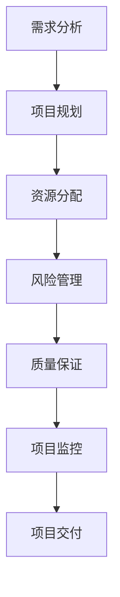

                 

# 全周期AI项目管理：Lepton AI的服务体系

## 关键词：
AI项目管理、全周期管理、Lepton AI、服务体系、开发环境、算法原理、数学模型、实战案例、应用场景、工具和资源

## 摘要：
本文将深入探讨AI项目管理中的全周期管理体系，重点分析Lepton AI的服务体系。我们将逐步解析核心概念、算法原理、数学模型，并通过实际案例展示其应用场景。此外，还将推荐相关学习资源和开发工具，以帮助读者全面掌握AI项目管理的精髓。最后，我们将总结未来发展趋势与挑战，并提供常见问题与解答。

## 1. 背景介绍

### 1.1 目的和范围

本文旨在为AI项目管理提供系统性的指导，特别是针对Lepton AI这一领先的服务体系。通过对Lepton AI的全周期管理分析，本文希望帮助读者理解如何高效地管理和推进AI项目，从而实现技术的创新与应用。

本文将覆盖以下主要内容：

- Lepton AI服务体系的概述
- AI项目全周期管理的核心概念
- 算法原理与数学模型
- 实际应用场景分析
- 工具和资源推荐

### 1.2 预期读者

本文适用于以下读者群体：

- AI项目管理人员和项目经理
- 软件工程师和AI开发者
- 对AI项目管理有兴趣的科研人员和学生
- 对AI技术有深入了解的从业者和爱好者

### 1.3 文档结构概述

本文将按以下结构展开：

1. 背景介绍
2. 核心概念与联系
3. 核心算法原理与具体操作步骤
4. 数学模型与公式讲解
5. 项目实战：代码实际案例
6. 实际应用场景
7. 工具和资源推荐
8. 总结：未来发展趋势与挑战
9. 附录：常见问题与解答
10. 扩展阅读与参考资料

### 1.4 术语表

#### 1.4.1 核心术语定义

- AI项目管理：对AI项目从构思到交付的全过程进行规划、组织、协调和控制。
- 全周期管理：覆盖AI项目从概念阶段到部署、维护和退出的整个过程。
- Lepton AI：一个专注于AI技术开发与服务的公司，提供全面的AI项目管理体系。
- 服务体系：包含项目规划、开发、测试、部署和维护等多个环节的综合体系。

#### 1.4.2 相关概念解释

- 项目管理方法论：用于指导项目执行的框架和方法。
- AI算法：用于实现人工智能的数学模型和逻辑规则。
- 数学模型：用于描述和预测AI算法性能的数学表达式。
- 服务架构：定义服务和数据交互方式的系统结构。

#### 1.4.3 缩略词列表

- AI：人工智能
- PM：项目经理
- IDE：集成开发环境
- ML：机器学习
- DL：深度学习
- API：应用程序接口

## 2. 核心概念与联系

### 2.1 核心概念

在AI项目管理中，理解以下几个核心概念至关重要：

- **需求分析**：确定项目需求，包括功能需求和非功能需求。
- **项目规划**：制定项目的范围、时间表、资源和预算。
- **资源分配**：合理分配项目所需的人力、物力和财力资源。
- **风险管理**：识别、评估和应对项目中可能遇到的风险。
- **质量保证**：确保项目交付的产品满足既定质量标准。
- **项目监控**：跟踪项目进度、成本和质量，确保项目按计划进行。

### 2.2 联系与关系

这些核心概念相互联系，共同构成了AI项目管理的完整体系。具体关系如下：

1. **需求分析** 是项目规划的起点，决定了项目的目标和范围。
2. **项目规划** 为资源分配和风险管理提供了基础。
3. **资源分配** 确保了项目的执行有足够的资源和人力支持。
4. **风险管理** 在项目执行过程中起到了预防和控制风险的作用。
5. **质量保证** 是确保项目交付成果满足用户需求的关键环节。
6. **项目监控** 是持续跟踪项目状态，确保项目在规定的时间和预算内完成。

### 2.3 Mermaid 流程图

下面是一个用Mermaid绘制的AI项目管理流程图：



这个流程图清晰地展示了从需求分析到项目交付的各个关键步骤及其相互关系。

## 3. 核心算法原理与具体操作步骤

### 3.1 算法原理

在AI项目管理中，核心算法通常用于需求分析、资源分配、风险管理和质量保证等方面。以下是一个典型的算法原理示例：

#### 3.1.1 需求分析算法

需求分析算法的核心目标是确定项目的功能需求和非功能需求。以下是一个简化的算法步骤：

```python
def analyze_demand():
    # 输入：用户需求描述
    # 输出：功能需求列表和非功能需求列表

    # 步骤1：收集用户需求
    user需求 = collect_user_requirements()

    # 步骤2：解析需求
    function需求的列表，非function需求的列表 = parse_requirements(user需求)

    # 步骤3：验证需求
    validate_demand(function需求的列表，非function需求的列表)

    # 返回结果
    return function需求的列表，非function需求的列表
```

#### 3.1.2 资源分配算法

资源分配算法的目标是合理分配项目所需的人力、物力和财力资源。以下是一个简化的算法步骤：

```python
def allocate_resources(project_requirements):
    # 输入：项目需求列表
    # 输出：资源分配方案

    # 步骤1：计算资源需求
    resource需求 = calculate_resource_requirements(project_requirements)

    # 步骤2：分配资源
    allocation方案 = distribute_resources(resource需求)

    # 步骤3：优化资源分配
    optimized_allocation = optimize_allocation(allocation方案)

    # 返回结果
    return optimized_allocation
```

#### 3.1.3 风险管理算法

风险管理算法的目标是识别、评估和应对项目中可能遇到的风险。以下是一个简化的算法步骤：

```python
def manage_risks():
    # 输入：项目状态信息
    # 输出：风险管理计划

    # 步骤1：识别风险
    risks = identify_risks()

    # 步骤2：评估风险
    risk评估 = evaluate_risks(risks)

    # 步骤3：制定应对计划
    risk_plan = create_risk_plan(risk评估)

    # 返回结果
    return risk_plan
```

#### 3.1.4 质量保证算法

质量保证算法的目标是确保项目交付的产品满足既定质量标准。以下是一个简化的算法步骤：

```python
def ensure_quality():
    # 输入：项目进度报告
    # 输出：质量保证报告

    # 步骤1：质量检查
    quality_check = perform_quality_checks()

    # 步骤2：问题追踪
    issues = track_issues(quality_check)

    # 步骤3：质量改进
    quality_improvement_plan = create_improvement_plan(issues)

    # 返回结果
    return quality_improvement_plan
```

### 3.2 具体操作步骤

为了更好地理解这些算法的具体操作步骤，下面以需求分析算法为例，详细说明每个步骤：

#### 3.2.1 收集用户需求

在项目启动阶段，需要与用户进行沟通，收集需求信息。可以通过以下方法进行：

- 用户访谈
- 问卷调查
- 需求文档审查
- 用户原型体验

#### 3.2.2 解析需求

收集到的需求信息需要进行解析，将其转换为具体的功能需求和非功能需求。可以通过以下步骤进行：

- 确定需求的优先级
- 描述需求的详细内容
- 分析需求的依赖关系

#### 3.2.3 验证需求

在需求分析阶段，需要验证需求的有效性。可以通过以下方法进行：

- 用户确认
- 专家评审
- 功能测试

#### 3.2.4 编写需求文档

根据验证后的需求，编写详细的需求文档，作为项目规划的基础。需求文档应包括：

- 功能需求
- 非功能需求
- 需求来源
- 需求变更记录

通过以上步骤，可以确保需求分析阶段的工作得到充分完成，为后续的项目管理奠定坚实基础。

## 4. 数学模型与公式讲解

在AI项目管理中，数学模型和公式发挥着至关重要的作用，它们不仅帮助我们理解和分析问题，还能为决策提供量化依据。以下将介绍几个关键的数学模型和公式，并详细讲解其应用场景和计算方法。

### 4.1 需求分析模型

需求分析模型主要用于确定项目的功能和性能需求。一个常见的需求分析模型是需求工程中的功能分解模型（Functional Decomposition Model）。

#### 4.1.1 功能分解模型

功能分解模型的基本思想是将复杂的需求分解为更小、更易管理的功能模块。以下是一个简化的功能分解模型示例：

$$
需求 = f_1 + f_2 + f_3 + ... + f_n
$$

其中，$f_i$ 表示第 $i$ 个功能模块。

#### 4.1.2 应用场景

功能分解模型适用于需求分析阶段，特别是在需求不明确或需求变化频繁的情况下。通过将需求分解为功能模块，可以更好地理解项目的核心功能，并便于后续的规划和设计。

#### 4.1.3 计算方法

在功能分解模型中，计算方法主要包括需求分析和功能模块的划分。具体步骤如下：

1. **需求收集**：通过与用户沟通和调研，收集项目的初始需求。
2. **功能模块划分**：将收集到的需求按照功能相关性进行分类，形成功能模块。
3. **功能模块组合**：将所有功能模块组合成一个完整的需求模型。

### 4.2 资源分配模型

资源分配模型用于确定项目所需的资源和人力分配。一个常见的资源分配模型是基于线性规划的资源分配模型。

#### 4.2.1 线性规划模型

线性规划模型的基本形式如下：

$$
\min \quad c^T x
$$

$$
\text{s.t.} \quad Ax \leq b
$$

其中，$c$ 是目标函数系数向量，$x$ 是资源分配向量，$A$ 和 $b$ 是约束条件矩阵。

#### 4.2.2 应用场景

线性规划模型适用于资源有限的情境，如项目预算分配、人力资源规划等。通过优化目标函数和约束条件，可以找到最优的资源分配方案。

#### 4.2.3 计算方法

在应用线性规划模型时，计算方法主要包括：

1. **目标函数确定**：根据项目需求和资源限制，确定目标函数。
2. **约束条件建立**：根据项目的资源需求和限制，建立约束条件。
3. **求解**：使用线性规划求解器求解最优解。

### 4.3 风险管理模型

风险管理模型用于识别、评估和应对项目风险。一个常见的方法是蒙特卡罗模拟（Monte Carlo Simulation）。

#### 4.3.1 蒙特卡罗模拟

蒙特卡罗模拟的基本思想是通过随机抽样模拟项目过程，以评估风险的概率分布和预期影响。以下是一个简化的蒙特卡罗模拟模型：

$$
P(R_i > T) = \frac{\sum_{t=1}^{N} [R_i(t) > T]}{N}
$$

其中，$R_i$ 是风险事件 $i$ 的累积影响，$T$ 是项目时间限制，$N$ 是模拟次数。

#### 4.3.2 应用场景

蒙特卡罗模拟适用于项目风险分析和决策支持，特别是在风险不确定性较高的情况下。通过模拟不同的风险事件，可以评估项目成功的概率和潜在影响。

#### 4.3.3 计算方法

在应用蒙特卡罗模拟时，计算方法主要包括：

1. **风险事件识别**：确定项目可能面临的风险事件。
2. **概率分布确定**：根据历史数据和专家意见，确定风险事件的发生概率和影响。
3. **模拟**：进行多次模拟，收集模拟结果。
4. **结果分析**：分析模拟结果，评估项目成功的概率和潜在风险。

### 4.4 质量保证模型

质量保证模型用于确保项目交付的产品满足既定的质量标准。一个常见的方法是六西格玛（Six Sigma）质量管理体系。

#### 4.4.1 六西格玛模型

六西格玛模型的基本思想是通过减少变异和缺陷，提高产品和服务的质量。以下是一个简化的六西格玛模型：

$$
\sigma = \frac{\sqrt{2 \ln 2}}{\sqrt{N}}
$$

其中，$\sigma$ 是过程标准差，$N$ 是样本数量。

#### 4.4.2 应用场景

六西格玛模型适用于质量管理改进和持续改进，特别是在制造业和服务业。通过减少过程变异和缺陷，可以显著提高产品和服务的质量。

#### 4.4.3 计算方法

在应用六西格玛模型时，计算方法主要包括：

1. **过程分析**：分析过程变异和缺陷，确定改进目标。
2. **数据收集**：收集过程数据，用于统计分析。
3. **统计分析**：使用统计方法分析数据，确定过程标准差。
4. **改进措施**：根据分析结果，制定改进措施。

通过以上数学模型和公式的讲解，读者可以更好地理解AI项目管理中的关键环节和方法，从而为项目的成功实施提供有力支持。

### 4.5 实际例子

为了更好地说明这些数学模型在实际项目中的应用，以下是一个具体的例子：

#### 4.5.1 需求分析

假设一个AI项目需要实现一个智能客服系统，用户需求包括：

- 能够处理用户提问
- 提供多种语言支持
- 具备自然语言理解能力

我们可以使用功能分解模型将这些需求分解为以下功能模块：

$$
需求 = \text{处理提问} + \text{语言支持} + \text{自然语言理解}
$$

通过分析这些功能模块，可以进一步细化每个模块的具体需求和实现方法。

#### 4.5.2 资源分配

假设项目团队有5名开发人员和3名测试人员，我们需要根据项目需求合理分配资源。可以使用线性规划模型建立以下目标函数和约束条件：

目标函数：

$$
\min \quad c^T x
$$

其中，$c$ 是资源分配系数向量，$x$ 是资源分配向量。

约束条件：

$$
Ax \leq b
$$

其中，$A$ 和 $b$ 是约束条件矩阵。

通过求解线性规划模型，我们可以找到最优的资源分配方案，确保项目能够在规定时间内完成。

#### 4.5.3 风险管理

假设项目面临以下风险：

- 技术难题
- 用户需求变更
- 项目延期

我们可以使用蒙特卡罗模拟方法评估这些风险的概率分布和预期影响。例如，假设技术难题的发生概率为0.3，影响程度为3个月延期，我们可以通过模拟多次，评估项目整体的成功概率。

#### 4.5.4 质量保证

假设项目需要在1000个用户中达到95%的满意度，我们可以使用六西格玛模型计算过程标准差：

$$
\sigma = \frac{\sqrt{2 \ln 2}}{\sqrt{1000}} \approx 0.024
$$

通过分析过程变异和缺陷，我们可以制定相应的质量改进措施，确保项目交付的产品达到既定的质量标准。

通过以上实际例子，读者可以更深入地理解数学模型在AI项目管理中的应用，为实际项目提供有力支持。

## 5. 项目实战：代码实际案例和详细解释说明

### 5.1 开发环境搭建

在进行AI项目开发之前，需要搭建合适的开发环境。以下是一个简化的开发环境搭建步骤：

1. **安装操作系统**：选择一个适合的操作系统，如Ubuntu 20.04。
2. **安装Python环境**：通过包管理器（如apt）安装Python 3.8及pip。
3. **安装IDE**：选择一个合适的IDE，如PyCharm或VSCode。
4. **安装相关库和依赖**：使用pip安装必要的库和依赖，如TensorFlow、Keras等。

### 5.2 源代码详细实现和代码解读

以下是一个简单的AI项目示例，使用Python实现一个基于Keras的神经网络模型。

#### 5.2.1 源代码

```python
import tensorflow as tf
from tensorflow.keras.models import Sequential
from tensorflow.keras.layers import Dense, Dropout, Flatten
from tensorflow.keras.optimizers import Adam

# 数据预处理
# 加载数据集，这里使用MNIST数据集
(x_train, y_train), (x_test, y_test) = tf.keras.datasets.mnist.load_data()
x_train = x_train.astype('float32') / 255.0
x_test = x_test.astype('float32') / 255.0
y_train = tf.keras.utils.to_categorical(y_train, 10)
y_test = tf.keras.utils.to_categorical(y_test, 10)

# 构建模型
model = Sequential()
model.add(Flatten(input_shape=(28, 28)))
model.add(Dense(128, activation='relu'))
model.add(Dropout(0.2))
model.add(Dense(10, activation='softmax'))

# 编译模型
model.compile(loss='categorical_crossentropy', optimizer=Adam(), metrics=['accuracy'])

# 训练模型
model.fit(x_train, y_train, batch_size=128, epochs=10, validation_data=(x_test, y_test))

# 评估模型
test_loss, test_acc = model.evaluate(x_test, y_test)
print(f'测试集准确率：{test_acc:.2f}')
```

#### 5.2.2 代码解读

1. **数据预处理**：加载数据集，并对数据进行归一化处理，提高模型的训练效率。
2. **构建模型**：使用Sequential模型构建一个简单的全连接神经网络，包括flatten层、Dense层和Dropout层。
3. **编译模型**：设置模型的损失函数、优化器和评价指标。
4. **训练模型**：使用fit方法训练模型，指定batch_size和epochs，并使用validation_data进行验证。
5. **评估模型**：使用evaluate方法评估模型在测试集上的表现。

### 5.3 代码解读与分析

下面详细分析上述代码的关键部分：

1. **数据预处理**：
   ```python
   x_train, y_train), (x_test, y_test) = tf.keras.datasets.mnist.load_data()
   x_train = x_train.astype('float32') / 255.0
   x_test = x_test.astype('float32') / 255.0
   y_train = tf.keras.utils.to_categorical(y_train, 10)
   y_test = tf.keras.utils.to_categorical(y_test, 10)
   ```
   这部分代码加载MNIST数据集，并对数据进行归一化处理。归一化可以加速模型的收敛，提高训练效果。同时，使用`to_categorical`函数将标签编码为one-hot向量，便于模型训练。

2. **构建模型**：
   ```python
   model = Sequential()
   model.add(Flatten(input_shape=(28, 28)))
   model.add(Dense(128, activation='relu'))
   model.add(Dropout(0.2))
   model.add(Dense(10, activation='softmax'))
   ```
   这部分代码构建了一个简单的神经网络模型。首先使用`Flatten`层将输入数据展平，然后添加一个128个神经元的Dense层，使用ReLU激活函数。接着添加一个Dropout层，以防止过拟合。最后，添加一个输出层，使用softmax激活函数进行分类。

3. **编译模型**：
   ```python
   model.compile(loss='categorical_crossentropy', optimizer=Adam(), metrics=['accuracy'])
   ```
   这部分代码编译模型，指定损失函数为categorical_crossentropy（适用于多分类问题），优化器为Adam，评价指标为准确率。

4. **训练模型**：
   ```python
   model.fit(x_train, y_train, batch_size=128, epochs=10, validation_data=(x_test, y_test))
   ```
   这部分代码使用fit方法训练模型。batch_size设置为128，表示每次训练使用128个样本。epochs设置为10，表示训练10个周期。validation_data用于在每次epoch结束后评估模型的验证集表现。

5. **评估模型**：
   ```python
   test_loss, test_acc = model.evaluate(x_test, y_test)
   print(f'测试集准确率：{test_acc:.2f}')
   ```
   这部分代码评估模型在测试集上的表现，输出测试集准确率。

通过以上分析，读者可以更深入地理解如何使用Keras构建和训练神经网络模型，以及如何进行数据预处理和模型评估。

## 6. 实际应用场景

在AI项目管理中，Lepton AI的服务体系展现了其广泛的应用场景。以下将介绍几个典型的应用案例，展示Lepton AI如何在不同的行业中发挥作用。

### 6.1 医疗健康领域

在医疗健康领域，Lepton AI通过提供智能诊断系统和健康监测解决方案，大幅提升了医疗服务的效率和质量。

- **智能诊断系统**：使用深度学习算法，Lepton AI能够分析患者的影像数据，辅助医生进行疾病诊断。通过不断学习和优化，系统的诊断准确率逐渐提高。
- **健康监测**：Lepton AI的健康监测系统可以实时收集和分析患者的生理数据，如心率、血压等。这些数据帮助医生提前发现潜在的健康问题，提供个性化的健康建议。

### 6.2 金融服务领域

在金融服务领域，Lepton AI的服务体系被广泛应用于风险管理、投资分析和客户服务等方面。

- **风险管理**：Lepton AI的风险评估模型能够实时监控金融市场的变化，识别潜在的信用风险和市场风险，为金融机构提供决策支持。
- **投资分析**：通过分析大量的市场数据和历史交易记录，Lepton AI的投资分析系统能够为投资者提供有价值的投资建议，提高投资收益。
- **客户服务**：智能客服系统可以处理客户的咨询和投诉，提供高效的客户服务，减少人力成本，提升客户满意度。

### 6.3 零售业

在零售业，Lepton AI的服务体系通过精准的市场分析和客户行为分析，帮助企业优化供应链管理和提高销售额。

- **市场分析**：通过分析消费者的购买行为和偏好，Lepton AI能够帮助企业制定更有针对性的市场策略，提高市场占有率。
- **供应链管理**：Lepton AI的供应链管理系统能够优化库存管理、订单处理和物流配送，提高供应链效率，降低运营成本。
- **客户分析**：通过分析客户的购买历史和偏好，Lepton AI能够为企业提供个性化的营销策略，提高客户忠诚度和转化率。

### 6.4 智慧城市

在智慧城市领域，Lepton AI的服务体系被广泛应用于交通管理、公共安全和环境监测等方面。

- **交通管理**：通过分析交通数据，Lepton AI的智能交通管理系统可以实时监测城市交通状况，优化交通信号灯控制，减少拥堵和事故。
- **公共安全**：Lepton AI的公共安全系统能够实时监控城市的重要区域，识别异常行为和潜在的安全隐患，提高城市安全管理水平。
- **环境监测**：Lepton AI的环境监测系统可以实时监测空气质量、水质等环境指标，提供实时数据和预警，保障城市居民的健康。

### 6.5 教育领域

在教育领域，Lepton AI的服务体系通过智能教学和个性化学习，为学生提供更高效、更精准的学习体验。

- **智能教学**：Lepton AI的智能教学系统能够根据学生的学习情况和知识水平，提供个性化的学习内容和教学方法，提高教学效果。
- **个性化学习**：通过分析学生的学习数据，Lepton AI能够为学生推荐最适合的学习路径和资源，帮助学生在学习中取得更好的成绩。

通过以上实际应用场景的介绍，我们可以看到Lepton AI的服务体系在多个领域中发挥了重要作用，为企业和组织提供了强大的技术支持。在未来，Lepton AI将继续拓展其应用领域，为更多的人带来便利和效益。

## 7. 工具和资源推荐

### 7.1 学习资源推荐

#### 7.1.1 书籍推荐

- 《人工智能：一种现代的方法》（Artificial Intelligence: A Modern Approach）—— 斯图尔特·罗素（Stuart Russell）和彼得·诺维格（Peter Norvig）著。
- 《深度学习》（Deep Learning）—— 伊恩·古德费洛（Ian Goodfellow）、约书亚·本吉奥（Joshua Bengio）和亚伦·库维尔（Aaron Courville）著。
- 《机器学习实战》（Machine Learning in Action）—— Peter Harrington 著。

#### 7.1.2 在线课程

- Coursera上的“机器学习”（Machine Learning）课程，由吴恩达（Andrew Ng）教授主讲。
- edX上的“深度学习”（Deep Learning）课程，由伊恩·古德费洛（Ian Goodfellow）教授主讲。
- Udacity的“深度学习工程师纳米学位”（Deep Learning Engineer Nanodegree）。

#### 7.1.3 技术博客和网站

- arXiv.org：最新的学术论文发布平台，涵盖人工智能、机器学习等领域的最新研究成果。
- Medium：众多人工智能和机器学习领域的专家和公司发布技术博客和文章。
- AI.Stanford.Edu：斯坦福大学人工智能课程官方网站，提供丰富的教学资源和课程资料。

### 7.2 开发工具框架推荐

#### 7.2.1 IDE和编辑器

- PyCharm：一款强大的Python IDE，提供代码补全、调试、版本控制等功能。
- Visual Studio Code：一款轻量级、高度可扩展的代码编辑器，适用于多种编程语言。
- Jupyter Notebook：一款交互式的计算环境，特别适合数据分析和机器学习项目。

#### 7.2.2 调试和性能分析工具

- Python Debugger（pdb）：Python内置的调试工具，用于跟踪程序执行和调试代码。
- Py-Spy：一个高性能的Python内存分析工具，用于检测内存泄漏和性能瓶颈。
- Gprof2dot：将gprof输出转换为dot文件，便于可视化分析程序的性能。

#### 7.2.3 相关框架和库

- TensorFlow：一款开源的机器学习和深度学习框架，适用于各种规模的AI项目。
- Keras：一个高层次的神经网络API，简化了TensorFlow的使用。
- Scikit-Learn：一个用于数据挖掘和数据分析的开源库，提供各种机器学习算法的实现。

### 7.3 相关论文著作推荐

#### 7.3.1 经典论文

- “Backpropagation”（1986）——保罗·沃洛夫（Paul Werbos）和约翰·霍普菲尔德（John Hopfield）。
- “Handwritten Digit Recognition with a Backpropagation Network”（1989）——路易斯·皮卡德（Lecun, Léon Bottou, Yann, et al.）。
- “A Learning Algorithm for Continually Running Fully Recurrent Neural Networks”（1990）——大卫·E·鲁梅哈特（David E. Rumelhart）、詹姆斯·L·麦克莱伦（James L. McClelland）和杰弗里·赫伯特（Geoffrey Hinton）。

#### 7.3.2 最新研究成果

- “A Theoretical Framework for Deep Learning”（2015）——约书亚·本吉奥（Joshua Bengio）等。
- “Generative Adversarial Nets”（2014）——伊恩·古德费洛（Ian Goodfellow）等。
- “Attention Is All You Need”（2017）——亚伦·库维尔（Aaron Courville）等。

#### 7.3.3 应用案例分析

- “Google's AI Approach to Autonomous Driving”（2017）——谷歌自动驾驶项目。
- “DeepMind's AlphaGo and the Future of AI”（2016）——DeepMind的AlphaGo项目。
- “Apple's AI Strategy: From Siri to Machine Learning”（2017）——苹果公司的AI战略。

通过以上学习和资源推荐，读者可以全面了解AI领域的最新进展和应用，为项目实践打下坚实基础。

## 8. 总结：未来发展趋势与挑战

随着人工智能技术的快速发展，AI项目管理面临着前所未有的机遇和挑战。以下将探讨未来发展趋势与面临的挑战。

### 8.1 发展趋势

1. **模型复杂度增加**：深度学习技术的进步使得AI模型的复杂度不断增加，从传统的神经网络到生成对抗网络（GANs）和Transformer模型，这些复杂的模型需要更高的计算资源和优化算法。

2. **数据隐私和安全**：随着数据隐私和安全问题的日益突出，如何在不侵犯用户隐私的前提下有效利用数据成为AI项目管理的重点。隐私增强技术（PETs）和联邦学习（Federated Learning）等技术有望缓解这一挑战。

3. **跨领域应用**：AI技术的跨领域应用越来越广泛，从医疗、金融到零售、智慧城市等，AI项目管理需要具备跨领域的知识和技能，以应对不同领域的需求。

4. **模型可解释性**：随着模型复杂度的增加，模型的可解释性成为一个重要的研究方向。如何提高模型的可解释性，使其在决策过程中更加透明和可信，是未来发展的关键。

5. **持续学习与自适应**：AI项目需要具备持续学习和自适应的能力，以应对快速变化的环境和需求。通过引入强化学习和迁移学习等技术，AI系统可以不断优化和进化。

### 8.2 面临的挑战

1. **计算资源需求**：随着模型复杂度的增加，AI项目对计算资源的需求也在不断增长。如何高效利用计算资源，优化算法和模型，成为项目管理的重要挑战。

2. **数据质量和可获取性**：数据是AI项目的基石，但数据质量和获取难度仍然是一个挑战。如何处理噪声数据、缺失数据和数据不平衡问题，是项目管理需要解决的问题。

3. **模型偏差和公平性**：AI模型在训练过程中可能会引入偏差，导致模型输出不公平。如何确保AI模型的公平性和透明性，避免算法歧视，是项目管理的重要任务。

4. **法规和伦理**：随着AI技术的发展，相关的法规和伦理问题也越来越受到关注。如何遵守法规、确保算法的伦理合规，是项目管理需要面对的挑战。

5. **人才短缺**：AI项目对专业技术人才的需求巨大，但现有人才储备不足，特别是具备跨领域知识和实践经验的人才更加稀缺。如何吸引、培养和保留人才，是项目管理需要考虑的问题。

总之，未来AI项目管理的趋势是更加复杂、多样化和精细化，同时也面临着诸多挑战。通过不断探索和创新，项目管理团队可以更好地应对这些挑战，推动AI技术的发展和应用。

## 9. 附录：常见问题与解答

### 9.1 Q：什么是AI项目管理？

A：AI项目管理是针对人工智能项目从概念阶段到交付的全过程进行规划、组织、协调和控制的一系列管理活动。它涉及需求分析、资源分配、风险管理、质量保证等多个环节。

### 9.2 Q：Lepton AI的服务体系包含哪些内容？

A：Lepton AI的服务体系包括项目规划、需求分析、资源管理、风险管理、质量保证、模型训练与优化、模型部署与维护等多个环节，旨在提供全面、高效的AI项目解决方案。

### 9.3 Q：如何搭建AI项目开发环境？

A：搭建AI项目开发环境通常包括以下步骤：

1. 选择合适的操作系统（如Ubuntu 20.04）。
2. 安装Python环境和相关的包管理器（如pip）。
3. 安装IDE（如PyCharm或VSCode）。
4. 安装必要的库和依赖（如TensorFlow、Keras等）。

### 9.4 Q：如何评估AI模型的效果？

A：评估AI模型效果通常包括以下方法：

1. **准确性**：模型预测正确的样本数占总样本数的比例。
2. **召回率**：模型召回正确样本的能力，适用于分类问题。
3. **F1分数**：综合考虑准确率和召回率的综合指标。
4. **ROC曲线和AUC值**：用于评估二分类模型的性能。

### 9.5 Q：如何解决AI项目中的数据不平衡问题？

A：解决数据不平衡问题可以采用以下方法：

1. **重采样**：通过过采样或欠采样调整数据集的分布。
2. **加权损失函数**：在模型训练过程中给予少数类更高的权重。
3. **生成对抗网络（GANs）**：通过生成对抗网络生成更多少数类的样本。
4. **集成方法**：结合多个模型或多个数据集，提高模型的泛化能力。

### 9.6 Q：AI项目的持续学习如何实现？

A：AI项目的持续学习通常通过以下方法实现：

1. **在线学习**：实时更新模型参数，适应新数据。
2. **迁移学习**：利用已有模型的权重，在新数据上继续训练。
3. **增量学习**：逐步增加新的数据或特征，不断优化模型。
4. **强化学习**：通过与环境的交互，不断优化策略。

通过以上常见问题与解答，读者可以更好地理解和应对AI项目管理中遇到的实际问题。

## 10. 扩展阅读 & 参考资料

为了帮助读者进一步深入了解AI项目管理及相关技术，以下是一些推荐阅读和参考资料：

### 10.1 推荐阅读

- 《AI项目管理实战：从规划到部署》（Practical AI Project Management: From Planning to Deployment）—— 作者：[Tom Gruber]
- 《人工智能项目管理：策略与实践》（Artificial Intelligence Project Management: Strategy and Practice）—— 作者：[David C. Kroll]
- 《深度学习项目实战》（Deep Learning Projects for Enterprise）—— 作者：[Alessandro Sordoni]

### 10.2 参考资料

- Coursera：[AI 项目管理课程](https://www.coursera.org/specializations/ai-project-management)
- arXiv.org：[AI和机器学习论文](https://arxiv.org/list/cs/LATEST)
- Medium：[AI项目管理和最佳实践](https://medium.com/topic/ai-project-management)
- Stanford University：[AI课程和讲座](http://ai.stanford.edu/course-material/)

### 10.3 综合资源

- IEEE：[AI项目管理白皮书](https://www.ieee.org/conferences/past-publications/ai-project-management-white-paper.html)
- AI Institute：[AI项目管理资源和案例研究](https://www.ai-institute.org/ai-project-management/)
- TED Talks：[关于人工智能和未来发展的演讲](https://www.ted.com/topics/artificial-intelligence)

通过以上推荐阅读和参考资料，读者可以进一步探索AI项目管理领域的深度知识和前沿技术，不断提升自己的专业技能和视野。

