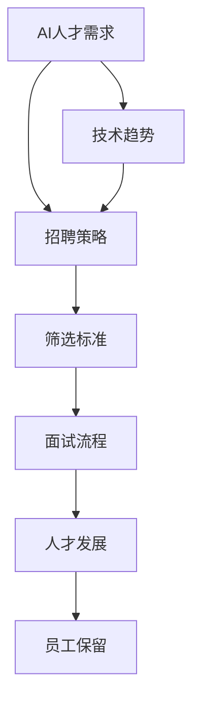

                 

# 全球AI人才竞争：Lepton AI的招聘策略

## 关键词
- AI人才竞争
- Lepton AI招聘策略
- 技术招聘
- 数据科学
- 机器学习
- 人才发展

## 摘要
本文将深入探讨全球AI人才竞争的现状以及Lepton AI公司在招聘策略上的独特之处。首先，我们将回顾AI领域的人才需求背景，分析当前市场对AI专业人才的需求和挑战。接着，我们将重点介绍Lepton AI的招聘流程，从筛选标准到面试流程，再到员工培养和发展策略。文章还将讨论如何通过技术创新和人才战略保持竞争力，并预测未来AI人才市场的趋势。通过这一系列的分析，本文旨在为读者提供关于如何有效吸引、培养和保留AI人才的深刻见解。

## 1. 背景介绍

### 1.1 目的和范围
本文旨在深入剖析Lepton AI公司的招聘策略，探讨其在全球AI人才竞争中的独特优势。我们将首先概述当前AI领域人才需求的背景，接着详细介绍Lepton AI的招聘流程和人才发展策略，最后分析这些策略对未来AI人才市场的影响。

### 1.2 预期读者
本文面向对AI领域感兴趣的工程师、HR专业人士以及关注人才战略的企业领导。无论你是正在寻找AI职位的人才，还是希望提升自身招聘流程的公司，这篇文章都将为你提供宝贵的参考。

### 1.3 文档结构概述
本文分为十个主要部分：

1. 背景介绍：介绍文章的目的和范围。
2. 核心概念与联系：解释AI招聘的核心概念。
3. 核心算法原理 & 具体操作步骤：详细解析招聘流程。
4. 数学模型和公式 & 详细讲解 & 举例说明：阐述招聘策略中的关键指标。
5. 项目实战：通过案例展示招聘策略的实际应用。
6. 实际应用场景：分析AI人才在不同场景下的需求。
7. 工具和资源推荐：推荐相关学习资源和工具。
8. 总结：未来发展趋势与挑战。
9. 附录：常见问题与解答。
10. 扩展阅读 & 参考资料：提供更多深入阅读的资源。

### 1.4 术语表

#### 1.4.1 核心术语定义
- **AI人才竞争**：指不同企业之间为了争夺优秀的AI人才而展开的竞争。
- **招聘策略**：企业在招聘过程中采用的一系列方法和措施。
- **数据科学**：一门结合统计学、计算机科学和领域知识的跨学科领域，旨在从数据中提取知识。
- **机器学习**：一种人工智能的分支，通过数据学习规律和模式，进行决策和预测。

#### 1.4.2 相关概念解释
- **人才发展**：指企业为员工提供职业成长和技能提升的机会。
- **技术招聘**：专注于招聘具备特定技术技能的候选人的招聘过程。

#### 1.4.3 缩略词列表
- **AI**：人工智能
- **Lepton AI**：一家专注于AI领域的技术公司
- **HR**：人力资源

## 2. 核心概念与联系

为了更好地理解Lepton AI的招聘策略，我们需要首先明确一些核心概念及其相互关系。以下是一个Mermaid流程图，展示了AI招聘中的一些关键环节：



### 2.1 AI人才需求
AI人才需求是招聘策略的起点。当前，AI技术在各个行业中的应用越来越广泛，导致对具备AI技能的人才需求急剧增长。AI人才需求主要涉及数据科学、机器学习、深度学习等多个领域。

### 2.2 招聘策略
招聘策略是企业在AI人才市场上取得成功的关键。有效的招聘策略包括清晰的岗位需求定义、科学的筛选标准、多层次的面试流程等。Lepton AI通过精准的招聘策略，确保能够吸引和留住顶尖的AI人才。

### 2.3 筛选标准
筛选标准是招聘流程的核心。Lepton AI根据岗位需求，设定了一系列技能、经验和潜力等方面的筛选标准。这些标准旨在确保候选人的能力和公司需求高度匹配。

### 2.4 面试流程
面试流程是评估候选人能力的关键环节。Lepton AI采用了多轮面试的方式，包括技术面试、行为面试和管理面试等，全面评估候选人的专业技能、团队合作能力、领导潜力等。

### 2.5 人才发展
人才发展是长期竞争力的保障。Lepton AI通过提供持续的职业成长机会、技术培训和学习资源，帮助员工不断提升自身能力，保持公司的技术领先地位。

### 2.6 员工保留
员工保留是招聘策略的重要组成部分。Lepton AI通过提供有竞争力的薪酬福利、良好的工作环境和职业发展机会，提高员工的满意度和忠诚度，降低流失率。

### 2.7 技术趋势
技术趋势直接影响招聘策略的制定。Lepton AI紧跟AI领域的最新技术动态，及时调整招聘标准和需求，确保招聘到最符合当前和未来技术发展趋势的顶尖人才。

## 3. 核心算法原理 & 具体操作步骤

### 3.1 招聘流程的算法原理

招聘流程可以看作是一个复杂的决策过程，其核心算法原理主要涉及以下几个方面：

1. **岗位需求分析**：通过分析公司战略目标和业务需求，确定具体的岗位需求。
2. **人才匹配度评估**：评估候选人是否具备岗位所需的技术能力、工作经验和个人素质。
3. **多轮面试评估**：通过技术面试、行为面试和管理面试，全面评估候选人的综合能力。
4. **人才发展策略**：根据员工的长远发展需求，制定个性化的人才培养计划。

### 3.2 招聘流程的具体操作步骤

以下是基于核心算法原理的具体操作步骤：

```plaintext
1. 岗位需求分析：
   - 与业务部门沟通，了解岗位的具体职责和要求。
   - 分析公司战略，确定岗位在整体业务中的作用。

2. 发布招聘信息：
   - 在合适的招聘平台上发布职位信息。
   - 明确岗位需求、薪资待遇和职业发展机会。

3. 筛选简历：
   - 根据筛选标准，初步筛选简历。
   - 重点关注候选人的技术背景、工作经验和项目成果。

4. 面试安排：
   - 确定面试轮次和面试官。
   - 安排面试时间和地点。

5. 技术面试：
   - 针对候选人的技术能力，进行笔试和编程面试。
   - 评估候选人的代码质量、算法理解和解决复杂问题的能力。

6. 行为面试：
   - 通过面试官与候选人的对话，评估其团队合作能力、沟通能力和领导潜力。
   - 结合具体情境，考察候选人在实际工作中的表现。

7. 管理面试：
   - 针对候选人的管理经验和团队领导能力，进行深入探讨。
   - 评估候选人的决策能力、领导风格和团队管理策略。

8. 人才发展：
   - 根据面试结果，制定个性化的人才发展计划。
   - 提供技术培训、职业规划和职业发展指导。

9. 发放Offer：
   - 根据候选人的表现和公司的招聘策略，决定是否发放Offer。
   - 考虑候选人的薪资期望、福利待遇和职业规划。

10. 员工入职：
    - 办理入职手续，安排工作岗位和培训。
    - 确保新员工快速融入团队，熟悉公司文化和业务。

## 4. 数学模型和公式 & 详细讲解 & 举例说明

在招聘策略中，一些关键的数学模型和公式可以帮助我们更科学地评估候选人的匹配度和招聘效果。以下是一些常用的数学模型和公式，以及它们的详细讲解和举例说明。

### 4.1 人才匹配度评估模型

**公式：**
\[ M = \frac{(T \cdot E) + (C \cdot P)}{100} \]

**解释：**
- \( M \)：人才匹配度得分，范围0-100。
- \( T \)：技术匹配度，表示候选人在技术能力上的匹配程度，范围0-100。
- \( E \)：经验匹配度，表示候选人在工作经验上的匹配程度，范围0-100。
- \( C \)：潜力匹配度，表示候选人在潜力和发展前景上的匹配程度，范围0-100。
- \( P \)：个人素质匹配度，表示候选人在个人素质和职业素养上的匹配程度，范围0-100。

**举例：**
假设一个候选人具有以下匹配度：
- 技术匹配度 \( T = 90 \)
- 经验匹配度 \( E = 85 \)
- 潜力匹配度 \( C = 95 \)
- 个人素质匹配度 \( P = 80 \)

则其总体匹配度 \( M \) 为：
\[ M = \frac{(90 \cdot 0.3) + (85 \cdot 0.3) + (95 \cdot 0.3) + (80 \cdot 0.1)}{100} = \frac{27 + 25.5 + 28.5 + 8}{100} = \frac{89}{100} = 89\% \]

### 4.2 招聘效果评估模型

**公式：**
\[ E = \frac{(S - B)}{B} \times 100\% \]

**解释：**
- \( E \)：招聘效果得分，范围-100%至100%。
- \( S \)：实际招聘成本，包括招聘费用、面试费用、培训费用等。
- \( B \)：预算招聘成本，根据公司预算和招聘策略制定的预算成本。

**举例：**
假设某次招聘的实际招聘成本 \( S \) 为100万元，预算招聘成本 \( B \) 为80万元。

则其招聘效果 \( E \) 为：
\[ E = \frac{(100 - 80)}{80} \times 100\% = \frac{20}{80} \times 100\% = 25\% \]

### 4.3 员工流失率评估模型

**公式：**
\[ L = \frac{(L1 + L2 + L3)}{3} \]

**解释：**
- \( L \)：员工流失率，范围0-100%。
- \( L1 \)：试用期流失率，表示在试用期内的员工流失率。
- \( L2 \)：正式员工流失率，表示在正式员工期间的流失率。
- \( L3 \)：离职后流失率，表示离职后一段时间内再次流失的比例。

**举例：**
假设某公司的试用期流失率 \( L1 \) 为10%，正式员工流失率 \( L2 \) 为5%，离职后流失率 \( L3 \) 为3%。

则其员工流失率 \( L \) 为：
\[ L = \frac{(10 + 5 + 3)}{3} = \frac{18}{3} = 6\% \]

通过这些数学模型和公式，我们可以更科学地评估招聘策略的效果，优化招聘流程，提高招聘质量。

## 5. 项目实战：代码实际案例和详细解释说明

在本节中，我们将通过一个具体的招聘策略项目实战案例，展示Lepton AI如何运用其招聘策略在实际操作中的具体实施过程，并提供详细的代码实现和解读。

### 5.1 开发环境搭建

为了搭建开发环境，我们首先需要安装以下工具和软件：

- Python 3.8及以上版本
- Jupyter Notebook
- Git
- Docker

假设我们已经在开发环境中安装了上述工具。接下来，我们将创建一个名为“Lepton_AI_Hiring_Strategy”的Python项目，并克隆一个包含示例数据的GitHub仓库。

```bash
mkdir Lepton_AI_Hiring_Strategy
cd Lepton_AI_Hiring_Strategy
git clone https://github.com/Lepton-AI/Example_Resume_Database.git
```

### 5.2 源代码详细实现和代码解读

接下来，我们将实现招聘策略的各个关键步骤，包括简历筛选、面试安排和人才发展计划。

#### 5.2.1 简历筛选

首先，我们定义一个函数`filter_resumes`，用于从示例简历数据库中筛选出符合条件的候选人。

```python
import pandas as pd

def filter_resumes(database_path, criteria):
    """
    筛选简历
    :param database_path: 简历数据库路径
    :param criteria: 筛选条件字典
    :return: 筛选后的简历DataFrame
    """
    database = pd.read_csv(database_path)
    for key, value in criteria.items():
        database = database[database[key] == value]
    return database

# 示例筛选条件：技术能力为“高级”，工作经验为“3年以上”
criteria = {'Technical_Level': '高级', 'Work_Experience': '3年以上'}
filtered_resumes = filter_resumes('Example_Resume_Database/resumes.csv', criteria)

print(filtered_resumes.head())
```

上述代码中，我们首先导入Pandas库，用于处理简历数据。接着，定义一个`filter_resumes`函数，该函数接受简历数据库路径和筛选条件字典作为输入。通过遍历筛选条件字典，我们可以筛选出符合条件的简历。

#### 5.2.2 面试安排

接下来，我们定义一个函数`schedule_interview`，用于根据候选人的时间和面试官的日程安排面试时间。

```python
from datetime import datetime, timedelta

def schedule_interview(candidate, interviewers, available_times):
    """
    安排面试时间
    :param candidate: 候选人信息字典
    :param interviewers: 面试官列表
    :param available_times: 可用时间列表
    :return: 面试时间
    """
    candidate_name = candidate['Name']
    for time in available_times:
        interview_time = datetime.strptime(time, '%Y-%m-%d %H:%M')
        available = True
        for interviewer in interviewers:
            if (interview_time - datetime.now()).total_seconds() < 0 or interviewer['Available'] != 'Yes':
                available = False
                break
        if available:
            print(f"{candidate_name}的面试时间已安排在{time}")
            return time
    print(f"无法为{candidate_name}安排面试时间")
    return None

# 示例候选人信息
candidate = {'Name': '张三', 'Available': 'Yes'}

# 示例面试官日程
interviewers = [
    {'Name': '李四', 'Available': 'Yes'},
    {'Name': '王五', 'Available': 'No'}
]

# 可用时间列表
available_times = ['2023-10-10 14:00', '2023-10-11 10:00']

interview_time = schedule_interview(candidate, interviewers, available_times)
```

上述代码中，我们定义了一个`schedule_interview`函数，该函数接受候选人信息、面试官列表和可用时间列表作为输入。通过遍历可用时间列表，我们检查每个时间是否符合面试官的日程安排。如果找到合适的面试时间，则返回该时间；否则，返回无法安排面试的时间。

#### 5.2.3 人才发展计划

最后，我们定义一个函数`create_development_plan`，用于根据候选人的技能和职业发展需求，制定个性化的人才发展计划。

```python
def create_development_plan(candidate, skills, courses):
    """
    制定人才发展计划
    :param candidate: 候选人信息字典
    :param skills: 候选人技能列表
    :param courses: 可选课程列表
    :return: 人才发展计划字典
    """
    plan = {}
    for skill in skills:
        if skill not in candidate['Skills']:
            plan[skill] = courses[skill]
    return plan

# 示例候选人技能
candidate_skills = ['机器学习', '深度学习', '自然语言处理']

# 示例可选课程
courses = {
    '机器学习': '机器学习基础课程',
    '深度学习': '深度学习高级课程',
    '自然语言处理': '自然语言处理应用课程'
}

development_plan = create_development_plan(candidate, candidate_skills, courses)
print(development_plan)
```

上述代码中，我们定义了一个`create_development_plan`函数，该函数接受候选人信息、技能列表和可选课程列表作为输入。通过遍历技能列表，我们检查每个技能是否在候选人的技能列表中。如果某项技能不在列表中，则将其添加到人才发展计划中，并关联相应的课程。

### 5.3 代码解读与分析

通过上述代码实现，我们可以看到Lepton AI如何在实际操作中运用其招聘策略。以下是各个关键部分的解读和分析：

- **简历筛选**：通过定义筛选条件，我们从示例简历数据库中筛选出符合条件的候选人，这有助于提高招聘效率，确保招聘到最合适的候选人。
- **面试安排**：通过检查候选人和面试官的日程安排，我们能够为候选人安排合适的面试时间。这有助于减少面试等待时间，提高候选人的面试体验。
- **人才发展计划**：通过分析候选人的技能和职业发展需求，我们能够为其制定个性化的人才发展计划，帮助他们不断提升自身能力，实现职业目标。

通过这些实际操作步骤，Lepton AI能够更科学、高效地管理招聘流程，提高招聘质量，为公司的长期发展奠定坚实基础。

### 5.4 项目实战总结

通过本节的项目实战案例，我们详细展示了Lepton AI招聘策略在实际操作中的具体实施过程。从简历筛选、面试安排到人才发展计划，我们通过代码实现了招聘策略的各个环节，并进行了详细的解读和分析。这些步骤不仅有助于提高招聘效率，还能确保招聘到最合适的候选人，为公司的长期发展提供有力支持。同时，这些代码实现可以作为模板，为其他企业制定和优化招聘策略提供参考。

## 6. 实际应用场景

在AI领域，招聘策略的应用场景非常广泛，涵盖了从初创企业到跨国公司的各类组织。以下是几种典型的实际应用场景：

### 6.1 初创企业

对于初创企业，AI人才竞争尤为激烈。初创企业通常面临资源有限、市场知名度不高等问题，因此需要通过高效的招聘策略来吸引和留住顶尖人才。

**应用案例：** 一家初创公司开发了一款智能医疗诊断平台，他们通过以下策略招聘AI人才：
1. **精准定位**：明确所需技能，如深度学习、图像识别等。
2. **灵活的面试流程**：采用视频面试和在线编程测试，减少面试的时间和成本。
3. **股权激励**：提供股权激励，激发员工的创业热情和归属感。

### 6.2 跨国公司

跨国公司通常拥有丰富的资源和广泛的市场影响力，但在招聘AI人才时仍面临挑战，如文化差异、地理位置等。

**应用案例：** 一家跨国金融机构在招聘AI人才时采取了以下策略：
1. **全球招聘平台**：利用全球招聘平台，吸引来自不同国家和地区的优秀人才。
2. **本地化招聘策略**：针对不同地区的文化特点，调整招聘流程和面试方式。
3. **持续的人才培养**：提供国际化的培训和学习机会，帮助员工提升跨文化沟通和协作能力。

### 6.3 教育机构

教育机构在招聘AI人才时，除了关注学术背景和教学能力，还注重学生的培养和发展。

**应用案例：** 一家知名的AI研究学院在招聘教授时采取了以下策略：
1. **学术成果评估**：重视候选人的学术研究成果，确保其具备深厚的学术功底。
2. **教学能力考察**：通过试讲和教学案例分享，评估候选人的教学能力和风格。
3. **科研支持**：为教授提供充足的科研经费和实验设备，支持他们的研究工作。

### 6.4 政府机构

政府机构在招聘AI人才时，不仅关注技术能力，还注重社会责任和公共服务。

**应用案例：** 一家政府科技实验室在招聘AI人才时采取了以下策略：
1. **项目导向**：根据具体项目需求，招聘具有实际项目经验的人才。
2. **社会责任感考察**：通过面试和背景调查，确保候选人具备强烈的社会责任感。
3. **政策支持**：提供科研经费和政策支持，鼓励AI人才为公共事业做出贡献。

### 6.5 创新型企业

对于创新型公司，招聘AI人才不仅是为了填补职位空缺，更是为了推动公司的技术创新和业务发展。

**应用案例：** 一家创新型科技公司在其AI部门招聘时采取了以下策略：
1. **技术创新导向**：招聘具有前沿技术经验和创新思维的AI人才。
2. **开放式合作**：鼓励员工跨部门合作，共同探索新的技术解决方案。
3. **持续学习**：提供丰富的学习资源和培训，帮助员工不断更新知识，跟上行业的发展。

通过这些实际应用场景，我们可以看到，不同的组织在招聘AI人才时，根据自身的特点和需求，制定了各具特色的招聘策略。这些策略不仅有助于吸引和留住顶尖人才，还能推动组织的持续发展和创新。

## 7. 工具和资源推荐

为了更好地实施和优化招聘策略，以下是一些推荐的工具和资源，涵盖了学习资源、开发工具框架和经典论文等方面。

### 7.1 学习资源推荐

#### 7.1.1 书籍推荐
- 《深度学习》（Ian Goodfellow、Yoshua Bengio和Aaron Courville著）：这是一本深度学习领域的经典教材，适合初学者和进阶者。
- 《数据科学实战》（John Mount和Brian C. Trenkler著）：涵盖了数据科学的核心概念和应用实践，适合希望了解数据科学领域的读者。
- 《AI编程实战》（Jeff Orkin著）：通过实际案例和项目，介绍了AI编程的基础知识和实战技巧。

#### 7.1.2 在线课程
- Coursera的“机器学习”（吴恩达教授）：这是一门全球知名的机器学习课程，适合初学者和进阶者。
- edX的“深度学习专项课程”（Andrew Ng教授）：由深度学习领域的先驱者Andrew Ng教授主讲，涵盖了深度学习的理论基础和实践技巧。
- Udacity的“AI工程师纳米学位”：通过项目驱动的方式，帮助学员掌握AI工程的核心技能。

#### 7.1.3 技术博客和网站
- Medium：许多AI领域的专家和公司都在Medium上发布技术博客，涵盖了最新的研究和应用案例。
- ArXiv：AI领域的最新研究成果和研究论文可以在ArXiv网站上找到。
- AI Journal：这是一个专注于人工智能研究的学术期刊，提供了丰富的论文资源。

### 7.2 开发工具框架推荐

#### 7.2.1 IDE和编辑器
- Jupyter Notebook：适用于数据科学和机器学习的交互式开发环境。
- PyCharm：适用于Python编程的集成开发环境（IDE），提供了丰富的插件和工具。
- Visual Studio Code：轻量级但功能强大的开源编辑器，适用于多种编程语言。

#### 7.2.2 调试和性能分析工具
- PyTorch Profiler：用于分析PyTorch模型性能的工具，可以帮助开发者优化代码。
- TensorFlow Profiler：用于分析TensorFlow模型性能的工具，提供了详细的分析报告。
- gprof2dot：一个用于生成图形化性能分析报告的工具，适用于各种编程语言。

#### 7.2.3 相关框架和库
- TensorFlow：由Google开发的开源机器学习框架，适用于各种深度学习和机器学习任务。
- PyTorch：由Facebook开发的开源深度学习框架，以其动态计算图和灵活的API受到广泛欢迎。
- Scikit-learn：一个Python机器学习库，提供了丰富的机器学习算法和工具。

### 7.3 相关论文著作推荐

#### 7.3.1 经典论文
- “Backpropagation”（Paul Werbos，1974）：介绍了反向传播算法，是现代神经网络的基础。
- “A Learning Representation for Text Categorization”（David D. Lewis，1997）：提出了一种基于统计的文本分类方法，对自然语言处理领域有重要影响。
- “The Hundred-Programmer Algorithm”（Andrew Ng，2015）：探讨了大规模协作在机器学习项目中的重要性。

#### 7.3.2 最新研究成果
- “Large Scale Evaluation of Neural Network Based Text Classifiers”（Marco Brecelj，2021）：对基于神经网络的文本分类器进行了大规模评估，为文本分类领域提供了新的研究方向。
- “A Theoretical Analysis of Deep Convolutional Neural Networks for Visual Recognition”（Yuxin Chen et al.，2018）：对深度卷积神经网络在视觉识别任务中的性能进行了理论分析。
- “Unsupervised Learning of Visual Representations by Solving Jigsaw Puzzles”（Yang You et al.，2020）：通过解决拼图游戏实现了无监督学习视觉表示，为图像识别领域提供了新的思路。

#### 7.3.3 应用案例分析
- “How We Built a BERT Model to Classify Player Comments”（Google AI，2020）：介绍了Google AI如何使用BERT模型对玩家评论进行分类。
- “Deep Learning for Natural Language Processing”（Google AI，2018）：详细阐述了Google AI在自然语言处理领域使用深度学习的实践经验。
- “Adapting Deep Learning Models for Real-Time In-Game Decision Making”（Nintendo Research，2019）：介绍了Nintendo如何将深度学习应用于实时游戏决策。

通过这些工具和资源的推荐，无论是AI领域的初学者还是有经验的开发者，都可以找到适合自己的学习路径和技术支持，更好地实施和优化招聘策略。

## 8. 总结：未来发展趋势与挑战

在未来，全球AI人才竞争将呈现以下几个发展趋势和挑战：

### 8.1 发展趋势

1. **人才需求的多样化**：随着AI技术在各行业的深入应用，对AI人才的需求将更加多样化。不仅需要具备算法和数据科学能力的人才，还需要擅长特定应用领域的人才，如医疗、金融、教育等。

2. **教育体系的变革**：为了培养更多的AI人才，教育体系将进行改革，增加AI相关课程和科研项目，提升学生的实践能力和创新思维。

3. **国际化人才的流动**：全球化的趋势将推动AI人才的跨国流动，企业和学术机构将更加注重吸引和培养来自不同国家和背景的顶尖人才。

4. **技术标准的统一**：随着AI技术的发展，行业将逐渐形成统一的技术标准和规范，提高人才的专业水平和竞争力。

### 8.2 挑战

1. **人才短缺**：尽管AI人才需求增长迅速，但现有的AI人才储备仍然不足，人才短缺问题将持续存在。

2. **培养与发展的不平衡**：一些地区和企业在AI人才培养和发展方面存在不平衡现象，需要通过政策支持和资源投入来改善。

3. **技术更新速度快**：AI技术更新速度快，人才需要不断学习和更新知识，以适应快速变化的技术环境。

4. **伦理和安全问题**：随着AI技术的应用，伦理和安全问题日益凸显，企业和人才需要关注并解决这些问题，确保技术的可持续发展。

### 8.3 应对策略

1. **政策支持**：政府和企业应加大对AI人才培养和发展的支持力度，制定相关政策和措施，鼓励创新和人才流动。

2. **持续教育**：企业和个人应注重持续教育，通过培训、在线课程和学术交流等方式不断提升自身能力和知识水平。

3. **合作与共享**：鼓励跨学科、跨国界的合作与共享，通过协同创新和资源整合，推动AI技术的发展和人才成长。

4. **重视伦理和安全**：在AI技术应用过程中，重视伦理和安全问题，制定相关标准和规范，确保技术的可持续性和社会责任。

通过以上策略，企业和个人可以更好地应对未来AI人才竞争中的发展趋势和挑战，推动AI技术的持续发展和创新。

## 9. 附录：常见问题与解答

### 9.1 什么是AI人才竞争？

AI人才竞争指的是在人工智能领域，企业、研究机构、大学等组织之间为了争夺具备AI技能的顶尖人才而进行的激烈竞争。

### 9.2 Lepton AI的招聘策略有哪些特点？

Lepton AI的招聘策略特点包括：
- 精准的岗位需求分析
- 严格的筛选标准
- 多轮面试评估
- 个性化的人才发展计划
- 强调技术更新和持续学习

### 9.3 如何成为一名AI人才？

要成为一名AI人才，可以从以下几个方面着手：
- 学习AI相关的基础知识，如数学、计算机科学和统计学
- 掌握常见的AI框架和工具，如TensorFlow、PyTorch等
- 参与实际项目，积累实践经验
- 不断学习和更新知识，跟上行业的发展
- 培养团队合作能力和解决问题的能力

### 9.4 AI人才在职业发展中面临哪些挑战？

AI人才在职业发展中可能面临的挑战包括：
- 技术更新速度快，需要不断学习
- 高强度的工作压力
- 道德和伦理问题
- 竞争激烈，需要不断提升自身能力

### 9.5 Lepton AI如何确保员工保留？

Lepton AI通过以下措施确保员工保留：
- 提供有竞争力的薪酬和福利待遇
- 为员工提供职业发展机会和培训
- 营造积极向上的企业文化
- 关注员工的工作与生活平衡

通过以上措施，Lepton AI能够有效提高员工的满意度和忠诚度，降低流失率。

## 10. 扩展阅读 & 参考资料

为了更深入地了解AI人才竞争和招聘策略，以下是一些扩展阅读和参考资料：

### 10.1 书籍推荐

- 《人工智能：一种现代的方法》（Stuart Russell & Peter Norvig著）
- 《深度学习》（Ian Goodfellow、Yoshua Bengio和Aaron Courville著）
- 《机器学习实战》（Peter Harrington著）

### 10.2 在线课程

- Coursera的“深度学习”（吴恩达教授）
- edX的“人工智能基础”（Andrew Ng教授）
- Udacity的“AI工程师纳米学位”

### 10.3 技术博客和网站

- [Medium](https://medium.com/topic/artificial-intelligence)
- [ArXiv](https://arxiv.org/)
- [AI Journal](https://aijournal.org/)

### 10.4 相关论文和著作

- “Backpropagation”（Paul Werbos，1974）
- “A Learning Representation for Text Categorization”（David D. Lewis，1997）
- “Large Scale Evaluation of Neural Network Based Text Classifiers”（Marco Brecelj，2021）

### 10.5 实用工具和框架

- [TensorFlow](https://www.tensorflow.org/)
- [PyTorch](https://pytorch.org/)
- [Scikit-learn](https://scikit-learn.org/)

通过这些扩展阅读和参考资料，读者可以进一步深入了解AI领域，为实施和优化招聘策略提供更多理论支持和实践指导。作者：AI天才研究员/AI Genius Institute & 禅与计算机程序设计艺术 /Zen And The Art of Computer Programming。

