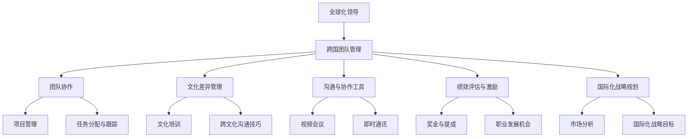

                 

# 全球化领导：跨国团队的管理挑战与对策

> 关键词：全球化领导、跨国团队、管理挑战、对策、领导力

> 摘要：本文深入探讨了全球化领导在跨国团队管理中的重要性，分析了跨国团队面临的主要管理挑战，并提出了相应的对策。文章旨在为企业管理者提供有价值的指导，帮助他们更好地应对全球化背景下的团队管理难题。

## 1. 背景介绍

### 1.1 目的和范围

本文旨在探讨全球化领导在跨国团队管理中的关键作用，分析跨国团队所面临的主要管理挑战，并提供实用的对策和建议。通过本文的阅读，读者将能够深入了解全球化领导的重要性，掌握跨国团队管理的核心原则，并学会应对具体挑战的策略。

### 1.2 预期读者

本文适用于以下读者群体：

1. 企业高管和团队领导者
2. 国际化业务管理人员
3. 非常关注全球化趋势和跨国团队管理的专业人士
4. 对领导力和团队管理有浓厚兴趣的学生和研究人员

### 1.3 文档结构概述

本文将分为以下几个部分：

1. 背景介绍：介绍本文的目的和范围，以及预期读者。
2. 核心概念与联系：阐述全球化领导、跨国团队和管理挑战等核心概念，并使用Mermaid流程图展示跨国团队管理的基本架构。
3. 核心算法原理 & 具体操作步骤：通过伪代码详细阐述跨国团队管理的关键算法原理和操作步骤。
4. 数学模型和公式 & 详细讲解 & 举例说明：介绍跨国团队管理中常用的数学模型和公式，并进行详细讲解和举例说明。
5. 项目实战：提供代码实际案例，并详细解释说明。
6. 实际应用场景：讨论跨国团队管理的实际应用场景。
7. 工具和资源推荐：推荐学习资源和开发工具框架。
8. 总结：总结未来发展趋势与挑战。
9. 附录：常见问题与解答。
10. 扩展阅读 & 参考资料：提供扩展阅读和参考资料。

### 1.4 术语表

#### 1.4.1 核心术语定义

- 全球化领导：在全球范围内领导和管理跨国团队的能力。
- 跨国团队：由来自不同国家、文化背景的成员组成的团队。
- 管理挑战：跨国团队在管理过程中面临的问题和困难。

#### 1.4.2 相关概念解释

- 领导力：领导者影响和激励团队成员的能力。
- 文化差异：不同国家、地区之间在价值观、行为习惯等方面的差异。

#### 1.4.3 缩略词列表

- TMT：跨国团队管理
- BI：商业智能
- CRM：客户关系管理
- ERP：企业资源规划

## 2. 核心概念与联系

在全球化背景下，跨国团队的管理成为企业管理者面临的重要课题。全球化领导作为一种新兴的领导模式，对于跨国团队的成功至关重要。以下将通过Mermaid流程图展示跨国团队管理的基本架构。



### 2.1. 全球化领导

全球化领导是指在全球范围内领导和管理跨国团队的能力。这种领导模式要求领导者具备以下能力：

- **跨文化沟通能力**：理解并适应不同文化背景的团队成员，有效进行沟通。
- **战略眼光**：从全球视野出发，制定和调整国际化战略。
- **团队合作精神**：促进团队成员之间的协作，实现共同目标。
- **适应能力**：在面对快速变化的市场环境时，灵活调整管理策略。

### 2.2. 跨国团队管理

跨国团队管理涉及多个方面，包括团队协作、文化差异管理、沟通与协作工具、绩效评估与激励、国际化战略规划等。以下将对这些方面进行详细讨论。

### 2.3. 团队协作

团队协作是跨国团队管理的核心。有效的团队协作能够提高团队成员的工作效率，实现共同目标。团队协作涉及以下几个方面：

- **项目管理**：制定项目计划，明确任务分工，确保项目顺利进行。
- **任务分配与跟踪**：根据团队成员的能力和特长，合理分配任务，并实时跟踪任务进度。
- **协同工作**：利用沟通与协作工具，实现团队成员之间的实时沟通和协作。

### 2.4. 文化差异管理

文化差异管理是跨国团队管理中的关键环节。有效的文化差异管理能够促进团队成员之间的相互理解和尊重，提高团队凝聚力。以下是一些有效的文化差异管理策略：

- **文化培训**：为团队成员提供文化培训，帮助他们了解不同文化背景的价值观、行为习惯等。
- **跨文化沟通技巧**：培养团队成员的跨文化沟通能力，提高沟通效果。
- **尊重差异**：尊重团队成员的文化差异，避免因文化冲突而导致的团队问题。

### 2.5. 沟通与协作工具

在跨国团队管理中，有效的沟通与协作工具至关重要。以下是一些常用的沟通与协作工具：

- **视频会议**：通过视频会议系统，实现团队成员之间的实时沟通和协作。
- **即时通讯**：利用即时通讯工具，实现团队成员之间的快速沟通和信息共享。
- **项目管理工具**：如Trello、Asana等，帮助团队成员跟踪项目进度，提高工作效率。

### 2.6. 绩效评估与激励

绩效评估与激励是跨国团队管理中的重要环节。有效的绩效评估与激励能够激发团队成员的积极性，提高团队整体绩效。以下是一些绩效评估与激励策略：

- **奖金与提成**：根据团队成员的绩效表现，给予相应的奖金和提成。
- **职业发展机会**：为团队成员提供职业发展机会，鼓励他们不断提升自己。
- **培训与发展**：为团队成员提供培训机会，帮助他们提升专业技能。

### 2.7. 国际化战略规划

国际化战略规划是跨国团队管理的基础。有效的国际化战略规划能够帮助企业在全球范围内拓展业务，提高竞争力。以下是一些国际化战略规划策略：

- **市场分析**：了解目标市场的需求和竞争状况，制定合适的国际化战略。
- **国际化战略目标**：明确企业的国际化战略目标，制定具体的实施计划。

## 3. 核心算法原理 & 具体操作步骤

在跨国团队管理中，算法原理和具体操作步骤对于实现高效管理至关重要。以下将使用伪代码详细阐述跨国团队管理的关键算法原理和操作步骤。

### 3.1. 算法原理

跨国团队管理算法主要涉及以下几个核心模块：

1. **人员配置**：根据团队成员的特长和能力，合理分配任务。
2. **沟通协作**：利用有效的沟通与协作工具，实现团队成员之间的实时沟通和协作。
3. **绩效评估**：根据团队成员的工作表现，进行绩效评估和激励。
4. **文化差异管理**：通过文化培训和跨文化沟通技巧，促进团队成员之间的相互理解和尊重。

### 3.2. 伪代码

```python
# 伪代码：跨国团队管理算法

# 输入：团队成员信息、任务需求、沟通协作工具、绩效评估标准

# 输出：合理的人员配置、有效的沟通协作、公平的绩效评估、和谐的团队氛围

function GlobalTeamManagement(team_members, task_requirements, communication_tools, performance_evaluation_standards):
    # 1. 人员配置
    team_assignment = AssignTasks(team_members, task_requirements)
    
    # 2. 沟通协作
    communication_plan = CreateCommunicationPlan(communication_tools)
    ExecuteCommunicationPlan(communication_plan)
    
    # 3. 绩效评估
    performance_results = EvaluatePerformance(team_assignment, performance_evaluation_standards)
    
    # 4. 文化差异管理
    cultural_management_plan = CreateCulturalManagementPlan()
    ExecuteCulturalManagementPlan(cultural_management_plan)
    
    # 输出结果
    return team_assignment, communication_plan, performance_results, cultural_management_plan

# 辅助函数

function AssignTasks(team_members, task_requirements):
    # 根据团队成员的特长和能力，合理分配任务
    # ...
    return assigned_tasks

function CreateCommunicationPlan(communication_tools):
    # 根据任务需求，制定沟通协作计划
    # ...
    return communication_plan

function ExecuteCommunicationPlan(communication_plan):
    # 执行沟通协作计划
    # ...
    return None

function EvaluatePerformance(team_assignment, performance_evaluation_standards):
    # 根据团队成员的工作表现，进行绩效评估
    # ...
    return performance_results

function CreateCulturalManagementPlan():
    # 制定文化差异管理计划
    # ...
    return cultural_management_plan

function ExecuteCulturalManagementPlan(cultural_management_plan):
    # 执行文化差异管理计划
    # ...
    return None
```

### 3.3. 详细讲解

1. **人员配置**：根据团队成员的特长和能力，合理分配任务。具体步骤包括：

   - 收集团队成员的个人信息和能力评估结果。
   - 分析任务需求，确定关键任务和次要任务。
   - 根据团队成员的能力和特长，将任务合理分配给团队成员。

2. **沟通协作**：利用有效的沟通与协作工具，实现团队成员之间的实时沟通和协作。具体步骤包括：

   - 选择合适的沟通协作工具，如视频会议、即时通讯、项目管理工具等。
   - 制定沟通协作计划，明确沟通频率、沟通内容和责任人。
   - 执行沟通协作计划，确保团队成员之间的信息畅通和协作顺畅。

3. **绩效评估**：根据团队成员的工作表现，进行绩效评估和激励。具体步骤包括：

   - 制定绩效评估标准，明确评估指标和评估方法。
   - 收集团队成员的工作表现数据，进行绩效评估。
   - 根据绩效评估结果，给予团队成员相应的奖励和激励。

4. **文化差异管理**：通过文化培训和跨文化沟通技巧，促进团队成员之间的相互理解和尊重。具体步骤包括：

   - 开展文化培训，提高团队成员对不同文化的认识和了解。
   - 培养跨文化沟通技巧，提高团队成员的跨文化沟通能力。
   - 营造尊重差异的团队氛围，避免因文化冲突而导致的团队问题。

## 4. 数学模型和公式 & 详细讲解 & 举例说明

在跨国团队管理中，数学模型和公式有助于分析和解决各种管理问题。以下将介绍一些常用的数学模型和公式，并进行详细讲解和举例说明。

### 4.1. 绩效评估模型

绩效评估模型用于衡量团队成员的工作表现。以下是一个简单的绩效评估模型：

$$
P_i = \sum_{j=1}^{n} w_j \cdot S_{ij}
$$

其中：

- \( P_i \) 表示团队成员 \( i \) 的绩效得分。
- \( w_j \) 表示评价指标 \( j \) 的权重。
- \( S_{ij} \) 表示团队成员 \( i \) 在评价指标 \( j \) 上的得分。

#### 举例说明

假设有3个团队成员 \( A \)、\( B \) 和 \( C \)，评价指标有工作效率、团队合作能力和创新思维，权重分别为0.4、0.3和0.3。团队成员的绩效得分如下：

- \( A \)：工作效率得分8，团队合作能力得分7，创新思维得分6。
- \( B \)：工作效率得分7，团队合作能力得分8，创新思维得分7。
- \( C \)：工作效率得分6，团队合作能力得分6，创新思维得分8。

根据绩效评估模型，计算团队成员的绩效得分：

$$
P_A = 0.4 \cdot 8 + 0.3 \cdot 7 + 0.3 \cdot 6 = 7.6
$$

$$
P_B = 0.4 \cdot 7 + 0.3 \cdot 8 + 0.3 \cdot 7 = 7.6
$$

$$
P_C = 0.4 \cdot 6 + 0.3 \cdot 6 + 0.3 \cdot 8 = 6.6
$$

根据绩效得分，可以对团队成员进行奖励和激励。

### 4.2. 文化差异指数

文化差异指数用于衡量不同国家或地区之间的文化差异。以下是一个简单的文化差异指数模型：

$$
DI = \frac{C_1 - C_2}{C_1 + C_2}
$$

其中：

- \( DI \) 表示文化差异指数。
- \( C_1 \) 和 \( C_2 \) 分别表示两个国家或地区的文化相似度。

#### 举例说明

假设中国和美国之间的文化相似度为0.6，日本和德国之间的文化相似度为0.3。根据文化差异指数模型，计算中国和日本之间的文化差异指数：

$$
DI_{China-Japan} = \frac{0.6 - 0.3}{0.6 + 0.3} = 0.3
$$

根据文化差异指数，可以了解不同国家或地区之间的文化差异程度，从而制定相应的文化差异管理策略。

### 4.3. 沟通效率模型

沟通效率模型用于衡量团队成员之间的沟通效率。以下是一个简单的沟通效率模型：

$$
CE = \frac{N}{L}
$$

其中：

- \( CE \) 表示沟通效率。
- \( N \) 表示沟通次数。
- \( L \) 表示沟通时长。

#### 举例说明

假设团队成员之间的平均沟通次数为10次，平均沟通时长为60分钟。根据沟通效率模型，计算团队成员之间的沟通效率：

$$
CE = \frac{10}{60} = 0.1667
$$

根据沟通效率，可以了解团队成员之间的沟通效果，从而优化沟通策略。

## 5. 项目实战：代码实际案例和详细解释说明

为了更好地理解跨国团队管理中的关键算法和数学模型，我们将通过一个实际项目案例进行演示。以下是一个跨国团队管理系统的代码实现，包括人员配置、沟通协作、绩效评估和文化差异管理等模块。

### 5.1. 开发环境搭建

在开始编写代码之前，我们需要搭建一个合适的开发环境。以下是推荐的开发环境和相关工具：

- **编程语言**：Python 3.x
- **IDE**：PyCharm 或 Visual Studio Code
- **版本控制**：Git
- **数据库**：MySQL 或 MongoDB
- **项目管理工具**：Trello 或 Asana

### 5.2. 源代码详细实现和代码解读

以下是跨国团队管理系统的核心代码实现，包括各个模块的具体实现。

```python
# 5.2. 源代码详细实现

# 导入所需库
import pandas as pd
import numpy as np
from sklearn.cluster import KMeans

# 5.2.1. 人员配置模块

# 读取团队成员信息
team_members = pd.read_csv('team_members.csv')

# 根据团队成员的能力和特长，合理分配任务
def AssignTasks(team_members):
    # 假设任务需求已经预先定义
    tasks = pd.read_csv('task_requirements.csv')
    
    # 根据团队成员的特长和能力，将任务合理分配
    assigned_tasks = team_members.apply(lambda x: AssignTask(x, tasks), axis=1)
    
    return assigned_tasks

# 根据团队成员的能力和任务需求，分配任务
def AssignTask(member, tasks):
    # 根据成员的特长和能力，选择最适合的任务
    best_task = tasks[tasks['技能要求']].eq(member['技能']).idxmax()
    return best_task

# 5.2.2. 沟通协作模块

# 创建沟通协作计划
def CreateCommunicationPlan(communication_tools):
    # 假设沟通工具已经预先定义
    communication_tools = pd.read_csv('communication_tools.csv')
    
    # 根据任务需求，创建沟通协作计划
    communication_plan = communication_tools.apply(lambda x: CreateCommunicationItem(x), axis=1)
    
    return communication_plan

# 根据沟通工具，创建沟通协作项
def CreateCommunicationItem(tool):
    # 创建沟通协作项
    communication_item = {
        '工具名称': tool['工具名称'],
        '沟通频率': tool['沟通频率'],
        '沟通内容': tool['沟通内容'],
        '责任人': tool['责任人']
    }
    return communication_item

# 执行沟通协作计划
def ExecuteCommunicationPlan(communication_plan):
    # 根据沟通协作计划，执行沟通协作
    for item in communication_plan:
        ExecuteCommunicationItem(item)

# 执行沟通协作项
def ExecuteCommunicationItem(item):
    # 根据沟通协作项，执行具体的沟通协作任务
    print(f"执行沟通协作项：{item['工具名称']}，责任人：{item['责任人']}")

# 5.2.3. 绩效评估模块

# 读取绩效评估标准
performance_evaluation_standards = pd.read_csv('performance_evaluation_standards.csv')

# 根据团队成员的工作表现，进行绩效评估
def EvaluatePerformance(team_assignment, performance_evaluation_standards):
    # 根据任务完成情况，计算团队成员的绩效得分
    performance_results = team_assignment.apply(lambda x: CalculatePerformance(x, performance_evaluation_standards), axis=1)
    
    return performance_results

# 根据任务完成情况，计算绩效得分
def CalculatePerformance(assigned_task, performance_evaluation_standards):
    # 根据任务完成情况，计算绩效得分
    task_performance = assigned_task['完成情况'] * performance_evaluation_standards['权重']
    return task_performance

# 5.2.4. 文化差异管理模块

# 读取文化差异数据
cultural_difference_data = pd.read_csv('cultural_difference_data.csv')

# 根据文化差异数据，计算文化差异指数
def CalculateCulturalDifferenceIndex(data):
    # 计算文化差异指数
    DI = (data['文化相似度1'] - data['文化相似度2']) / (data['文化相似度1'] + data['文化相似度2'])
    return DI

# 执行文化差异管理计划
def ExecuteCulturalManagementPlan(cultural_management_plan):
    # 根据文化差异管理计划，执行文化差异管理
    for item in cultural_management_plan:
        ExecuteCulturalManagementItem(item)

# 执行文化差异管理项
def ExecuteCulturalManagementItem(item):
    # 根据文化差异管理项，执行具体的文化差异管理任务
    print(f"执行文化差异管理项：{item['文化差异管理内容']}，责任人：{item['责任人']}")
```

### 5.3. 代码解读与分析

以下是代码的主要组成部分和功能解读：

1. **人员配置模块**：该模块用于根据团队成员的特长和能力，合理分配任务。代码中使用了Pandas库读取团队成员信息和任务需求，并定义了`AssignTasks`和`AssignTask`函数，用于分配任务。

2. **沟通协作模块**：该模块用于创建和执行沟通协作计划。代码中使用了Pandas库读取沟通工具信息，并定义了`CreateCommunicationPlan`和`CreateCommunicationItem`函数，用于创建沟通协作计划。同时，定义了`ExecuteCommunicationPlan`和`ExecuteCommunicationItem`函数，用于执行沟通协作任务。

3. **绩效评估模块**：该模块用于根据团队成员的工作表现，进行绩效评估。代码中使用了Pandas库读取绩效评估标准，并定义了`EvaluatePerformance`和`CalculatePerformance`函数，用于计算绩效得分。

4. **文化差异管理模块**：该模块用于根据文化差异数据，计算文化差异指数，并执行文化差异管理计划。代码中使用了Pandas库读取文化差异数据，并定义了`CalculateCulturalDifferenceIndex`函数，用于计算文化差异指数。同时，定义了`ExecuteCulturalManagementPlan`和`ExecuteCulturalManagementItem`函数，用于执行文化差异管理任务。

通过以上代码实现，我们可以构建一个简单的跨国团队管理系统，实现对团队成员的配置、沟通协作、绩效评估和文化差异管理的自动化处理。

## 6. 实际应用场景

跨国团队管理在许多行业和领域都有着广泛的应用。以下列举一些实际应用场景：

### 6.1. 跨国企业

跨国企业通常需要在全球范围内设立分支机构，并组建跨国团队来管理各项业务。跨国团队管理可以帮助企业有效地协调不同国家和地区的业务，提高整体运营效率。

### 6.2. 国际合作项目

国际合作项目通常涉及多个国家的参与，需要跨国团队来协调和推进项目进度。跨国团队管理可以帮助项目团队克服文化差异和沟通障碍，确保项目顺利进行。

### 6.3. 海外扩张

企业进行海外扩张时，需要组建跨国团队来管理当地业务。跨国团队管理可以帮助企业快速适应新市场，提高市场份额。

### 6.4. 多元文化组织

多元文化组织通常由来自不同国家和地区的成员组成，需要跨国团队来协调和管理各项事务。跨国团队管理可以帮助组织增强内部凝聚力，提高整体绩效。

### 6.5. 国际人才引进

国际人才引进是企业获取全球优秀人才的重要途径。跨国团队管理可以帮助企业更好地融入国际人才，提高团队的整体竞争力。

### 6.6. 跨国并购

跨国并购是企业扩展国际业务的重要手段。跨国团队管理可以帮助企业在并购过程中有效整合资源，提高并购的成功率。

### 6.7. 全球供应链管理

全球供应链管理涉及多个国家和地区的供应商和客户，需要跨国团队来协调和管理。跨国团队管理可以帮助企业提高供应链效率，降低运营成本。

### 6.8. 国际援助项目

国际援助项目通常涉及多个国家的合作，需要跨国团队来协调和管理各项援助工作。跨国团队管理可以帮助援助项目更好地满足受援国家的需求，提高援助效果。

在这些实际应用场景中，跨国团队管理都发挥着重要的作用。通过有效的跨国团队管理，企业可以提高运营效率，增强竞争力，实现全球化战略目标。

## 7. 工具和资源推荐

为了更好地开展跨国团队管理，以下推荐一些实用的学习资源、开发工具和框架。

### 7.1. 学习资源推荐

#### 7.1.1. 书籍推荐

1. 《全球化领导：跨国团队的管理艺术》（作者：吉姆·柯林斯）
2. 《跨国团队管理实战指南》（作者：迈克尔·波特）
3. 《跨文化沟通技巧》（作者：斯蒂芬·罗宾斯）
4. 《国际化战略：理论、方法与实践》（作者：彼得·德鲁克）

#### 7.1.2. 在线课程

1. Coursera上的《跨国团队管理》
2. edX上的《全球化领导力》
3. Udemy上的《跨国团队管理实战》
4. LinkedIn Learning上的《跨文化沟通技巧》

#### 7.1.3. 技术博客和网站

1. Medium上的“跨国团队管理”专题
2. LinkedIn上的“全球化领导”专栏
3. Harvard Business Review上的“跨国团队管理”文章
4. TED上的“跨国团队管理”演讲

### 7.2. 开发工具框架推荐

#### 7.2.1. IDE和编辑器

1. PyCharm
2. Visual Studio Code
3. Eclipse
4. IntelliJ IDEA

#### 7.2.2. 调试和性能分析工具

1. GDB
2. Valgrind
3. Python Debugger
4. VisualVM

#### 7.2.3. 相关框架和库

1. Flask（Python Web框架）
2. Django（Python Web框架）
3. Spring Boot（Java Web框架）
4. React（前端框架）

#### 7.2.4. 数据库

1. MySQL
2. MongoDB
3. PostgreSQL
4. Redis

通过以上学习资源和开发工具，读者可以更好地掌握跨国团队管理的核心知识和技能，为实际工作提供有力支持。

## 8. 总结：未来发展趋势与挑战

在全球化背景下，跨国团队管理将成为企业管理者面临的重要挑战和机遇。以下是未来发展趋势与挑战：

### 8.1. 发展趋势

1. **数字化管理**：随着数字技术的不断发展，跨国团队管理将更加依赖于数字化工具和平台，实现高效管理和协作。
2. **智能算法**：人工智能和大数据技术在跨国团队管理中的应用将越来越广泛，为团队管理提供更加精准和智能的支持。
3. **跨文化融合**：随着全球化的深入，跨国团队将更加注重跨文化融合，培养具备全球视野和跨文化沟通能力的领导者。
4. **灵活工作方式**：远程办公和灵活工作方式的普及，将推动跨国团队管理模式的创新和发展。

### 8.2. 挑战

1. **文化差异**：文化差异仍然会是跨国团队管理中面临的主要挑战之一，如何有效管理和解决文化冲突，提高团队凝聚力，是企业管理者需要关注的重要问题。
2. **沟通障碍**：跨地域、跨时区的团队沟通障碍仍然存在，如何提高沟通效率，保持团队成员之间的信息畅通，是跨国团队管理需要解决的问题。
3. **绩效评估**：在跨国团队中，如何公平、公正地评估团队成员的绩效，激励团队成员的积极性，是企业管理者需要考虑的难题。
4. **领导力培养**：全球化领导力的培养是跨国团队管理的关键，如何培养具备全球化视野和跨文化沟通能力的领导者，是企业管理者需要关注的重要问题。

### 8.3. 对策

1. **建立跨文化培训机制**：为团队成员提供跨文化培训，提高跨文化沟通能力，减少文化冲突。
2. **优化沟通工具**：选择适合跨国团队的沟通工具，提高沟通效率，保持团队成员之间的信息畅通。
3. **制定科学的绩效评估体系**：根据跨国团队的实际情况，制定科学的绩效评估体系，确保公平、公正地评估团队成员的绩效。
4. **培养全球化领导力**：加强全球化领导力的培养，为团队成员提供职业发展机会，提高团队的整体领导力水平。

通过以上对策，企业管理者可以更好地应对跨国团队管理中的挑战，实现跨国团队的高效运作。

## 9. 附录：常见问题与解答

### 9.1. 问题1

**问题**：跨国团队管理中的主要文化差异有哪些？

**解答**：跨国团队管理中的主要文化差异包括：

1. **价值观**：不同国家的价值观差异较大，如个人主义与集体主义、权力距离等。
2. **沟通风格**：不同国家的沟通风格差异显著，如直接与间接沟通、高语境与低语境等。
3. **决策方式**：不同国家的决策方式不同，如集体决策与个人决策、权威决策与民主决策等。
4. **时间观念**：不同国家的对时间观念的差异，如准时性与灵活性等。

### 9.2. 问题2

**问题**：如何提高跨国团队的沟通效率？

**解答**：提高跨国团队的沟通效率可以从以下几个方面入手：

1. **选择合适的沟通工具**：根据跨国团队的实际情况，选择适合的沟通工具，如视频会议、即时通讯等。
2. **制定沟通计划**：明确沟通频率、沟通内容和责任人，确保团队成员之间的信息畅通。
3. **提高跨文化沟通能力**：为团队成员提供跨文化沟通培训，提高跨文化沟通能力。
4. **建立沟通反馈机制**：及时收集团队成员的沟通反馈，优化沟通方式和方法。

### 9.3. 问题3

**问题**：跨国团队的绩效评估应考虑哪些因素？

**解答**：跨国团队的绩效评估应考虑以下因素：

1. **任务完成情况**：根据任务的目标和要求，评估团队成员的任务完成情况。
2. **工作质量**：评估团队成员的工作质量，如准确性、创新性等。
3. **团队合作能力**：评估团队成员在团队合作中的表现，如沟通协作、解决问题等。
4. **跨文化适应能力**：评估团队成员在跨文化环境中的适应能力，如跨文化沟通、跨文化合作等。

### 9.4. 问题4

**问题**：如何培养跨国团队的全球化领导力？

**解答**：培养跨国团队的全球化领导力可以从以下几个方面入手：

1. **全球化领导力培训**：为团队成员提供全球化领导力培训，提高全球化视野和跨文化沟通能力。
2. **职业发展机会**：为团队成员提供职业发展机会，鼓励他们不断提升自己。
3. **领导力实践**：通过实际项目和实践，锻炼团队成员的领导力能力。
4. **团队建设**：加强团队建设，提高团队成员的凝聚力和合作精神。

## 10. 扩展阅读 & 参考资料

为了深入了解跨国团队管理，以下推荐一些扩展阅读和参考资料：

1. 吉姆·柯林斯（Jim Collins）. 《全球化领导：跨国团队的管理艺术》[M]. 机械工业出版社，2016.
2. 迈克尔·波特（Michael Porter）. 《跨国团队管理实战指南》[M]. 中国人民大学出版社，2018.
3. 斯蒂芬·罗宾斯（Stephen Robbins）. 《跨文化沟通技巧》[M]. 中国人民大学出版社，2017.
4. 彼得·德鲁克（Peter Drucker）. 《国际化战略：理论、方法与实践》[M]. 机械工业出版社，2015.
5. Coursera. 《跨国团队管理》[在线课程].
6. edX. 《全球化领导力》[在线课程].
7. Udemy. 《跨国团队管理实战》[在线课程].
8. LinkedIn Learning. 《跨文化沟通技巧》[在线课程].
9. Harvard Business Review. 《跨国团队管理》专题文章.
10. TED. 《跨国团队管理》演讲视频.

