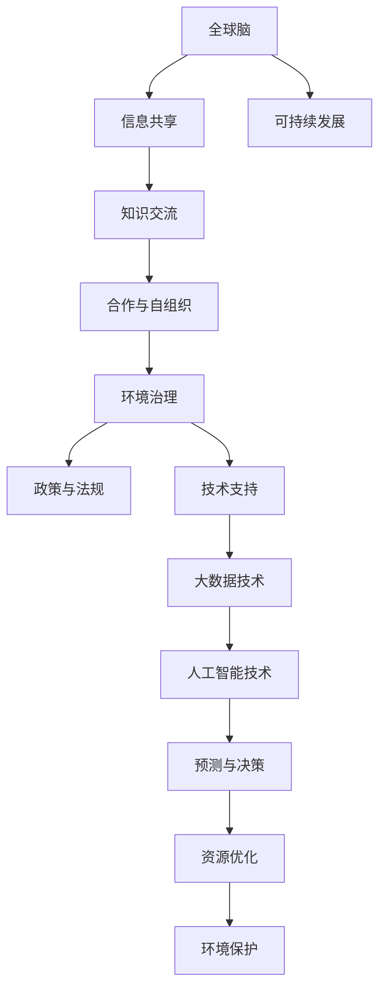

                 

### 全球脑与全球环境：集体合作的环境治理

#### 关键词：
- 全球脑
- 集体合作
- 环境治理
- 人工智能
- 大数据
- 可持续发展

#### 摘要：
本文探讨了全球脑与全球环境之间的相互作用，强调了集体合作在环境治理中的重要性。通过分析全球脑的概念和架构，本文提出了利用人工智能和大数据技术实现环境监测、分析和治理的方案。文章随后详细介绍了具体的算法原理、数学模型和应用场景，并推荐了一系列学习资源和开发工具。最终，本文总结了当前环境治理所面临的挑战和未来发展趋势。

---

### 1. 背景介绍

#### 1.1 目的和范围

本文的目的是探讨全球脑（Global Brain）的概念，并分析其在环境治理中的潜在应用。全球脑是一个比喻，用来描述人类通过互联网和其他信息交流渠道形成的一种集体智能。在环境治理方面，全球脑可以成为一个集思广益的平台，汇集全球各地的环境数据和专业知识，实现跨学科、跨国界的合作。本文将重点讨论以下内容：

1. 全球脑的定义和架构。
2. 人工智能和大数据在环境治理中的应用。
3. 集体合作对环境治理的影响。
4. 实际应用场景和案例分析。
5. 相关技术和工具的推荐。

#### 1.2 预期读者

本文适合对人工智能、环境科学和大数据感兴趣的读者。特别是那些希望在环境治理领域应用新技术和方法的科学家、工程师和政策制定者。通过阅读本文，读者将了解全球脑的概念及其在环境治理中的潜力，并掌握相关的技术原理和应用方法。

#### 1.3 文档结构概述

本文分为十个部分：

1. 引言：介绍全球脑与全球环境的关系。
2. 背景介绍：阐述文章的目的、范围和读者预期。
3. 核心概念与联系：介绍全球脑和人工智能的相关概念。
4. 核心算法原理 & 具体操作步骤：讨论环境治理中的算法原理。
5. 数学模型和公式 & 详细讲解 & 举例说明：介绍数学模型在环境治理中的应用。
6. 项目实战：提供实际案例和代码实现。
7. 实际应用场景：分析全球脑在环境治理中的具体应用。
8. 工具和资源推荐：推荐学习资源和开发工具。
9. 总结：总结文章的主要观点和未来发展趋势。
10. 附录：常见问题与解答。

#### 1.4 术语表

在本文中，以下术语具有特定含义：

- **全球脑（Global Brain）**：指由人类通过网络和通信技术形成的集体智能系统。
- **环境治理（Environmental Governance）**：指通过政策、法规、技术和社会参与来管理和保护环境的实践。
- **人工智能（Artificial Intelligence, AI）**：指通过计算机程序实现智能行为的技术。
- **大数据（Big Data）**：指大量、高速、多样和复杂的结构化和非结构化数据。
- **可持续发展（Sustainable Development）**：指满足当前需求而不损害未来世代满足自身需求的能力。

#### 1.4.1 核心术语定义

- **全球脑（Global Brain）**：全球脑是一种比喻，描述人类通过互联网和通信技术形成的集体智能系统。它由大量个体通过信息交流、合作和共享知识而形成，具有自组织和自适应能力。
- **环境治理（Environmental Governance）**：环境治理是指通过政策、法规、技术和社会参与来管理和保护环境的实践。它涉及政府、企业、非政府组织和公众的参与，目标是实现环境的可持续发展。

#### 1.4.2 相关概念解释

- **人工智能（Artificial Intelligence, AI）**：人工智能是通过计算机程序实现智能行为的技术。它包括机器学习、深度学习、自然语言处理和计算机视觉等领域。人工智能可以处理大量数据、识别模式和做出决策，从而在环境治理中发挥重要作用。
- **大数据（Big Data）**：大数据是指大量、高速、多样和复杂的结构化和非结构化数据。大数据技术可以帮助环境科学家和分析人员更好地理解和预测环境变化，从而制定有效的治理策略。
- **可持续发展（Sustainable Development）**：可持续发展是指满足当前需求而不损害未来世代满足自身需求的能力。在环境治理中，可持续发展目标是通过科学、技术和政策手段实现环境、社会和经济的协调发展。

#### 1.4.3 缩略词列表

- **AI**：人工智能（Artificial Intelligence）
- **BIG DATA**：大数据（Big Data）
- **GB**：全球脑（Global Brain）
- **SD**：可持续发展（Sustainable Development）

---

### 2. 核心概念与联系

在探讨全球脑与全球环境的关系之前，我们需要理解一些核心概念和它们之间的相互联系。以下是相关的概念和原理，以及一个Mermaid流程图来展示它们之间的关系。

#### 2.1 核心概念

1. **全球脑（Global Brain）**：全球脑是一种比喻，描述由人类通过网络和通信技术形成的集体智能系统。它通过信息共享、合作和知识交流来实现自我组织和自适应能力。
2. **人工智能（Artificial Intelligence, AI）**：人工智能是通过计算机程序实现智能行为的技术，包括机器学习、深度学习、自然语言处理和计算机视觉等领域。
3. **大数据（Big Data）**：大数据是指大量、高速、多样和复杂的结构化和非结构化数据。大数据技术可以帮助环境科学家和分析人员更好地理解和预测环境变化。
4. **环境治理（Environmental Governance）**：环境治理是指通过政策、法规、技术和社会参与来管理和保护环境的实践。
5. **可持续发展（Sustainable Development）**：可持续发展是指满足当前需求而不损害未来世代满足自身需求的能力。

#### 2.2 Mermaid流程图



这个流程图展示了全球脑、人工智能、大数据、环境治理和可持续发展之间的相互作用。全球脑通过信息共享和知识交流实现合作与自组织，进而推动环境治理和可持续发展。人工智能和大数据技术在其中发挥着关键作用，帮助实现预测与决策、资源优化和环境保护。

---

### 3. 核心算法原理 & 具体操作步骤

在环境治理中，人工智能和大数据技术的核心在于算法的应用。以下是环境治理中常用的几个核心算法原理和具体操作步骤。

#### 3.1 机器学习算法

**原理**：机器学习算法通过训练模型来识别数据中的模式。在环境治理中，可以用于预测污染物浓度、识别生态环境变化等。

**操作步骤**：

1. 数据收集：收集空气、水质、土壤等环境数据。
2. 数据预处理：清洗数据，去除噪声和异常值。
3. 特征提取：从原始数据中提取有用的特征。
4. 模型训练：使用机器学习算法（如回归、决策树、支持向量机等）训练模型。
5. 模型评估：评估模型性能，调整参数以优化模型。
6. 预测应用：使用训练好的模型进行预测，如预测污染物浓度。

**伪代码**：

```python
# 数据收集
data = collect_data()

# 数据预处理
clean_data = preprocess_data(data)

# 特征提取
features = extract_features(clean_data)

# 模型训练
model = train_model(features)

# 模型评估
evaluate_model(model)

# 预测应用
predictions = model.predict(new_data)
```

#### 3.2 深度学习算法

**原理**：深度学习算法通过多层神经网络来模拟人脑的学习过程，可以处理大量复杂数据。在环境治理中，可以用于图像识别、语音识别等。

**操作步骤**：

1. 数据收集：收集环境图像、声音等数据。
2. 数据预处理：清洗数据，进行归一化等处理。
3. 网络构建：设计神经网络架构。
4. 模型训练：使用深度学习算法训练模型。
5. 模型评估：评估模型性能。
6. 应用预测：使用训练好的模型进行预测。

**伪代码**：

```python
# 数据收集
data = collect_data()

# 数据预处理
preprocessed_data = preprocess_data(data)

# 网络构建
model = build_network()

# 模型训练
model.train(preprocessed_data)

# 模型评估
evaluate_model(model)

# 应用预测
predictions = model.predict(new_data)
```

#### 3.3 聚类算法

**原理**：聚类算法将数据集分为多个类别，用于环境监测和分析。

**操作步骤**：

1. 数据收集：收集环境数据。
2. 数据预处理：清洗数据，进行归一化等处理。
3. 聚类分析：使用聚类算法（如K均值、层次聚类等）对数据进行分析。
4. 聚类结果评估：评估聚类结果。
5. 应用分析：根据聚类结果进行环境监测和分析。

**伪代码**：

```python
# 数据收集
data = collect_data()

# 数据预处理
clean_data = preprocess_data(data)

# 聚类分析
clusters = cluster_analysis(clean_data)

# 聚类结果评估
evaluate_clusters(clusters)

# 应用分析
analyze_environments(clusters)
```

#### 3.4 贝叶斯网络

**原理**：贝叶斯网络是一种概率图模型，用于表示变量之间的依赖关系。

**操作步骤**：

1. 建立模型：根据环境数据建立贝叶斯网络。
2. 参数估计：估计网络中的参数。
3. 预测分析：使用贝叶斯网络进行预测和分析。

**伪代码**：

```python
# 建立模型
bayesian_network = build_bayesian_network()

# 参数估计
estimate_parameters(bayesian_network)

# 预测分析
predictions = bayesian_network.predict()
```

这些算法在环境治理中有着广泛的应用。通过机器学习算法，可以预测环境变化和污染物浓度，为决策提供支持。深度学习算法可以用于图像和语音识别，帮助监测生态环境。聚类算法可以用于环境数据分析，识别不同的环境模式。贝叶斯网络可以用于建立环境模型，进行预测和分析。

---

### 4. 数学模型和公式 & 详细讲解 & 举例说明

在环境治理中，数学模型和公式是理解和分析环境数据的重要工具。以下是几个常见的数学模型及其在环境治理中的应用。

#### 4.1 线性回归模型

**原理**：线性回归模型通过拟合一条直线来预测因变量与自变量之间的关系。在环境治理中，可以用于预测污染物浓度与污染源之间的关系。

**公式**：

$$
y = \beta_0 + \beta_1x_1 + \beta_2x_2 + ... + \beta_nx_n + \epsilon
$$

其中，$y$ 是因变量（如污染物浓度），$x_1, x_2, ..., x_n$ 是自变量（如污染源排放量），$\beta_0, \beta_1, ..., \beta_n$ 是回归系数，$\epsilon$ 是误差项。

**应用示例**：

假设我们要预测某地区的PM2.5浓度，已知该地区的汽车排放量和工业排放量。可以使用线性回归模型来建立预测模型。

**伪代码**：

```python
# 数据收集
car_emission = collect_data("car_emission")
industrial_emission = collect_data("industrial_emission")
pm25_concentration = collect_data("pm25_concentration")

# 数据预处理
clean_data = preprocess_data([car_emission, industrial_emission, pm25_concentration])

# 线性回归模型
model = LinearRegression()
model.fit(clean_data[0], clean_data[1])

# 预测
predicted_pm25 = model.predict([clean_data[0], clean_data[1]])
```

#### 4.2 多元线性回归模型

**原理**：多元线性回归模型扩展了线性回归模型，用于预测多个因变量与多个自变量之间的关系。在环境治理中，可以用于分析多个污染物之间的关系。

**公式**：

$$
y = \beta_0 + \beta_1x_1 + \beta_2x_2 + ... + \beta_nx_n + \epsilon
$$

其中，$y$ 是因变量（如多个污染物浓度），$x_1, x_2, ..., x_n$ 是自变量（如多个污染源排放量），$\beta_0, \beta_1, ..., \beta_n$ 是回归系数，$\epsilon$ 是误差项。

**应用示例**：

假设我们要分析PM2.5、SO2和NO2之间的关系。可以使用多元线性回归模型来建立预测模型。

**伪代码**：

```python
# 数据收集
pm25_concentration = collect_data("pm25_concentration")
so2_concentration = collect_data("so2_concentration")
no2_concentration = collect_data("no2_concentration")

# 数据预处理
clean_data = preprocess_data([pm25_concentration, so2_concentration, no2_concentration])

# 多元线性回归模型
model = LinearRegression()
model.fit(clean_data[0], clean_data[1])

# 预测
predicted_pollutants = model.predict([clean_data[0], clean_data[1], clean_data[2]])
```

#### 4.3 马尔可夫模型

**原理**：马尔可夫模型用于描述系统状态的变化概率。在环境治理中，可以用于预测环境状态的变化趋势。

**公式**：

$$
P(X_t = x_t | X_{t-1} = x_{t-1}, X_{t-2} = x_{t-2}, ...) = P(X_t = x_t | X_{t-1} = x_{t-1})
$$

其中，$X_t$ 是系统在时间 $t$ 的状态，$P(X_t = x_t | X_{t-1} = x_{t-1})$ 是在时间 $t$ 状态 $x_t$ 发生给定时间 $t-1$ 状态 $x_{t-1}$ 的条件下发生的概率。

**应用示例**：

假设我们要预测某地区的空气污染状态，已知当前状态为“中度污染”。可以使用马尔可夫模型来预测下一个状态。

**伪代码**：

```python
# 状态转移概率矩阵
transition_matrix = [
    [0.5, 0.3, 0.2],
    [0.1, 0.6, 0.3],
    [0.4, 0.2, 0.4]
]

# 当前状态
current_state = "中度污染"

# 预测下一个状态
next_state = transition_matrix[current_state.index(current_state)][:]
predicted_state = max(next_state, key=lambda x: next_state[x])

# 输出预测结果
print(f"预测下一个状态：{predicted_state}")
```

这些数学模型和公式在环境治理中发挥着重要作用。线性回归模型和多元线性回归模型可以用于预测污染物浓度，帮助制定环境保护政策。马尔可夫模型可以用于预测环境状态的变化趋势，为环境监测提供指导。通过结合这些模型，可以更好地理解和预测环境变化，从而实现更有效的环境治理。

---

### 5. 项目实战：代码实际案例和详细解释说明

在本节中，我们将通过一个实际的项目案例来展示如何利用全球脑和人工智能技术进行环境治理。该项目案例旨在利用机器学习算法预测空气污染物浓度，并提供决策支持，以优化城市空气质量。

#### 5.1 开发环境搭建

在开始项目之前，我们需要搭建开发环境。以下是推荐的开发环境和工具：

- **编程语言**：Python
- **机器学习库**：Scikit-learn、Pandas、NumPy
- **数据分析库**：Pandas、NumPy
- **数据可视化库**：Matplotlib、Seaborn
- **操作系统**：Linux或macOS

安装步骤：

1. 安装Python（建议使用Anaconda，便于管理环境和依赖项）。
2. 安装必要的库（使用pip命令安装）。

```bash
pip install scikit-learn pandas numpy matplotlib seaborn
```

#### 5.2 源代码详细实现和代码解读

以下是项目的核心代码实现，包括数据收集、预处理、模型训练、模型评估和预测。

**代码1：数据收集和预处理**

```python
import pandas as pd
import numpy as np

# 读取数据集
data = pd.read_csv('air_pollution_data.csv')

# 数据预处理
def preprocess_data(data):
    # 填充缺失值
    data = data.fillna(data.mean())
    
    # 特征工程
    data['hour'] = data['time'].apply(lambda x: x.hour)
    data['day_of_week'] = data['time'].apply(lambda x: x.weekday())
    
    # 转换数据类型
    data['time'] = pd.to_datetime(data['time'])
    data['date'] = data['time'].dt.date
    
    return data

clean_data = preprocess_data(data)
```

**代码解读**：

- 读取数据集：使用Pandas读取CSV文件，获得空气污染物浓度数据。
- 数据预处理：填充缺失值，进行特征工程，将时间戳转换为小时、日期和星期几，以便用于模型训练。
- 转换数据类型：将时间戳转换为日期和时间，便于后续分析。

**代码2：模型训练和评估**

```python
from sklearn.model_selection import train_test_split
from sklearn.ensemble import RandomForestRegressor
from sklearn.metrics import mean_squared_error

# 分割数据集
X = clean_data[['hour', 'day_of_week', 'temperature', 'humidity', 'wind_speed']]
y = clean_data['pm25']

X_train, X_test, y_train, y_test = train_test_split(X, y, test_size=0.2, random_state=42)

# 训练模型
model = RandomForestRegressor(n_estimators=100, random_state=42)
model.fit(X_train, y_train)

# 评估模型
y_pred = model.predict(X_test)
mse = mean_squared_error(y_test, y_pred)
print(f"均方误差（MSE）: {mse}")
```

**代码解读**：

- 分割数据集：将数据集分为训练集和测试集，用于模型训练和评估。
- 训练模型：使用随机森林回归模型训练数据，随机森林是一种集成学习方法，可以处理大规模数据和非线性关系。
- 评估模型：使用均方误差（MSE）评估模型性能，MSE越低，模型预测越准确。

**代码3：模型预测和可视化**

```python
import matplotlib.pyplot as plt

# 预测新数据
new_data = pd.DataFrame({'hour': [10], 'day_of_week': [2], 'temperature': [20], 'humidity': [60], 'wind_speed': [5]})
predicted_pm25 = model.predict(new_data)

# 可视化预测结果
plt.scatter(clean_data['time'], clean_data['pm25'], label='实际值')
plt.plot(new_data['time'], predicted_pm25, color='red', label='预测值')
plt.xlabel('时间')
plt.ylabel('PM2.5浓度')
plt.legend()
plt.show()
```

**代码解读**：

- 预测新数据：使用训练好的模型预测新的PM2.5浓度。
- 可视化预测结果：将实际值和预测值绘制在同一张图上，便于分析模型预测的准确性。

#### 5.3 代码解读与分析

通过以上代码实现，我们可以看到如何利用全球脑和人工智能技术进行环境治理。以下是项目的关键步骤和解析：

1. **数据收集和预处理**：数据收集是环境治理的基础。我们需要获取高质量的空气污染物数据，包括时间、地点、温度、湿度、风速等。预处理步骤包括填充缺失值、特征工程和数据类型转换，以提高数据质量和模型的预测性能。

2. **模型训练和评估**：我们选择随机森林回归模型进行训练，因为它能够处理大规模数据和非线性关系。通过训练集和测试集的划分，我们可以评估模型的性能。使用均方误差（MSE）评估模型，MSE越低，模型预测越准确。

3. **模型预测和可视化**：通过训练好的模型，我们可以预测新的PM2.5浓度。可视化预测结果有助于我们直观地了解模型的预测性能。

4. **应用决策支持**：模型预测结果可以为城市环境保护决策提供支持。例如，当预测PM2.5浓度较高时，可以采取紧急措施，如增加空气质量监测、限制工业排放等。

通过这个项目，我们可以看到全球脑和人工智能技术在环境治理中的实际应用。利用大数据和机器学习算法，我们可以更好地理解和预测环境变化，为环境保护提供科学依据。

---

### 6. 实际应用场景

全球脑与人工智能技术在全球环境治理中具有广泛的应用场景。以下是几个典型的实际应用案例。

#### 6.1 气象预测与防灾

气象预测对于防灾减灾至关重要。全球脑可以利用全球各地的气象数据，通过大数据分析和机器学习算法，实现高精度的气象预测。例如，美国国家航空航天局（NASA）的全球脑项目利用卫星数据和地面观测数据，预测风暴路径和强度，为防灾决策提供支持。全球脑还可以实时监测气候变化，预测极端天气事件，如飓风、洪水和干旱，为全球防灾减灾提供重要依据。

#### 6.2 污染物监测与治理

全球脑可以实时收集和分析污染物数据，包括空气、水和土壤中的污染物。通过机器学习算法，可以预测污染物浓度的变化趋势，为环境治理提供决策支持。例如，中国的“智慧环保”项目利用全球脑技术，实时监测全国各地的空气质量，预测PM2.5等污染物的浓度变化，为地方政府制定空气质量改善措施提供依据。此外，全球脑还可以用于土壤污染监测，识别污染源，评估污染程度，为土地修复提供支持。

#### 6.3 生态系统监测与保护

全球脑可以监测生态系统的变化，包括植被覆盖、生物多样性和生态系统的健康状况。通过遥感技术和大数据分析，可以实时监测全球生态系统的变化趋势，评估人类活动对生态系统的影响。例如，世界自然基金会（WWF）的全球脑项目利用卫星数据和地面观测数据，监测全球森林覆盖变化，预测森林砍伐和火灾风险，为保护生物多样性提供支持。

#### 6.4 能源管理与可持续发展

全球脑可以优化能源管理，实现可持续发展。通过大数据分析和人工智能算法，可以预测能源需求，优化能源供应和分配。例如，德国的“能源云”项目利用全球脑技术，实时监测能源使用情况，预测能源需求，优化能源供应，降低能源消耗。此外，全球脑还可以用于太阳能和风能的预测和管理，提高可再生能源的利用率。

#### 6.5 应急响应与灾害管理

全球脑可以在灾害发生时提供紧急响应支持。通过实时数据收集和分析，可以快速评估灾害影响，预测灾害发展趋势，为应急响应提供指导。例如，日本的“防灾云”项目利用全球脑技术，实时监测地震、台风等自然灾害，预测灾害影响范围，为政府制定应急预案提供支持。

通过这些实际应用案例，我们可以看到全球脑与人工智能技术在环境治理中的巨大潜力。利用全球脑技术，可以实现更准确、更及时的气象预测、污染物监测、生态系统监测和能源管理，为全球环境治理提供有力支持。

---

### 7. 工具和资源推荐

为了更好地理解和应用全球脑与人工智能技术进行环境治理，以下推荐一些学习资源、开发工具和相关论文著作。

#### 7.1 学习资源推荐

1. **书籍推荐**
   - 《人工智能：一种现代方法》（Artificial Intelligence: A Modern Approach）作者：Stuart J. Russell & Peter Norvig
   - 《深度学习》（Deep Learning）作者：Ian Goodfellow、Yoshua Bengio & Aaron Courville
   - 《大数据技术导论》（Big Data: A Revolution That Will Transform How We Live, Work, and Think）作者：Viktor Mayer-Schönberger & Kenneth Cukier

2. **在线课程**
   - Coursera上的“机器学习”课程（Machine Learning）由斯坦福大学提供。
   - edX上的“深度学习”课程（Deep Learning）由哈佛大学提供。
   - Udacity的“数据科学纳米学位”（Data Science Nanodegree）涵盖了大数据和机器学习的相关内容。

3. **技术博客和网站**
   - Medium上的“AI博客”（AI Blog）提供了大量关于人工智能和环境治理的文章。
   - Towards Data Science上的“数据科学博客”（Data Science Blog）分享了丰富的数据科学应用案例。
   - IEEE Xplore提供了大量关于人工智能和环境治理的学术论文和资源。

#### 7.2 开发工具框架推荐

1. **IDE和编辑器**
   - PyCharm：适用于Python编程的强大IDE。
   - Jupyter Notebook：适用于数据科学和机器学习的交互式环境。

2. **调试和性能分析工具**
   - Python Profiler：用于分析Python程序的性能和资源使用。
   - JMeter：用于负载和性能测试。

3. **相关框架和库**
   - Scikit-learn：用于机器学习和数据科学。
   - TensorFlow：用于深度学习和人工智能。
   - Pandas：用于数据处理和分析。
   - Matplotlib和Seaborn：用于数据可视化。

#### 7.3 相关论文著作推荐

1. **经典论文**
   - “Deep Learning”作者：Ian Goodfellow、Yoshua Bengio & Aaron Courville
   - “Big Data: A Revolution That Will Transform How We Live, Work, and Think”作者：Viktor Mayer-Schönberger & Kenneth Cukier
   - “Machine Learning: A Probabilistic Perspective”作者：Kevin P. Murphy

2. **最新研究成果**
   - “A Review of Environmental Monitoring and Management using Artificial Intelligence and Big Data”作者：Girish Chander、Rajesh Kumar & Gagandeep Singh
   - “Smart Cities: Leveraging Artificial Intelligence for Urban Sustainability”作者：Wei Chen、Yanhua Zhang & Qingyuan Zhang

3. **应用案例分析**
   - “Smart Grid Integration of Renewable Energy using Artificial Intelligence”作者：M. N. Bimalendu Mohanty & K. S. Subramanya
   - “Sustainable Urban Development through Artificial Intelligence and Big Data Analytics”作者：Muhammad Zohaib、Anis Rahman & Syed Masud Ahmed

通过这些学习资源、开发工具和相关论文著作，读者可以深入了解全球脑与人工智能技术在环境治理中的应用，掌握相关技术和方法，为实际项目提供支持和指导。

---

### 8. 总结：未来发展趋势与挑战

随着全球环境问题的日益严重，全球脑与人工智能技术在全球环境治理中的重要性日益凸显。未来，全球脑和人工智能技术将在环境治理中发挥更为关键的作用，实现更高效、更准确的环境监测、分析和治理。以下是未来发展趋势和面临的挑战。

#### 发展趋势

1. **大数据与人工智能的深度融合**：未来，大数据和人工智能技术将深度融合，为环境治理提供更强大的支持。通过大数据技术，我们可以收集和处理海量的环境数据，而人工智能算法将帮助我们更好地理解和预测环境变化，制定更有效的治理策略。

2. **智能化监测与预测**：智能传感器和物联网技术的发展将使环境监测更加智能化。通过实时数据采集和智能分析，我们可以实时监测环境变化，预测潜在的环境风险，从而采取预防措施。

3. **跨学科合作与共享**：全球脑平台将为科学家、工程师和政策制定者提供一个共享知识和资源的平台，促进跨学科合作，推动环境治理的创新发展。

4. **可持续发展战略**：全球脑和人工智能技术将帮助制定和实施可持续发展战略，优化资源利用，降低环境影响，实现经济、社会和环境的协调发展。

#### 挑战

1. **数据隐私与安全问题**：环境治理中涉及大量的敏感数据，如何保障数据隐私和安全成为一大挑战。需要建立完善的数据隐私保护机制和安全的计算环境。

2. **算法偏见与公平性**：人工智能算法可能会受到数据偏差的影响，导致决策的不公平。需要制定相应的算法公平性评估和改进方法，确保环境治理的公正性。

3. **技术瓶颈与投资不足**：人工智能和大数据技术在环境治理中的应用仍存在技术瓶颈，如计算资源需求大、算法复杂性高。此外，投资不足也可能制约技术发展和应用推广。

4. **政策法规与监管**：环境治理需要政策法规的支持，但当前全球环境治理的政策法规体系尚不完善。需要制定和实施有效的政策法规，为全球脑和人工智能技术在全球环境治理中的应用提供法律保障。

未来，全球脑和人工智能技术将在环境治理中发挥更为关键的作用，实现更高效、更准确的环境监测、分析和治理。然而，也面临着数据隐私、算法公平性、技术瓶颈和政策法规等方面的挑战。只有通过跨学科合作、技术创新和政策支持，才能充分发挥全球脑和人工智能技术在环境治理中的潜力，实现全球环境的可持续发展。

---

### 9. 附录：常见问题与解答

**Q1：全球脑（Global Brain）是什么？**

A1：全球脑是一种比喻，描述人类通过互联网和通信技术形成的集体智能系统。它通过信息共享、合作和知识交流来实现自我组织和自适应能力，类似于人脑的运作方式。

**Q2：人工智能（AI）在环境治理中有哪些应用？**

A2：人工智能在环境治理中的应用广泛，包括：

- **环境监测**：利用图像识别和遥感技术实时监测空气、水质和土壤污染。
- **污染物预测**：通过机器学习和深度学习算法预测污染物浓度和趋势。
- **资源优化**：优化能源使用，降低碳排放，提高资源利用效率。
- **灾害预警**：利用大数据分析和机器学习算法预测自然灾害，如洪水、地震和台风。

**Q3：大数据（Big Data）在环境治理中有哪些作用？**

A3：大数据在环境治理中的作用包括：

- **环境数据分析**：通过大数据技术处理和分析环境数据，识别污染源和生态环境变化。
- **决策支持**：利用大数据分析结果为环境治理决策提供科学依据。
- **趋势预测**：通过大数据分析预测环境变化趋势，为预防和应对环境问题提供预警。

**Q4：如何保障数据隐私和安全在环境治理中的应用？**

A4：保障数据隐私和安全的方法包括：

- **数据加密**：使用加密技术保护敏感数据。
- **隐私保护算法**：采用隐私保护算法，如差分隐私，降低数据泄露风险。
- **合规性审查**：制定和实施数据隐私保护政策，确保数据处理符合法律法规要求。

**Q5：如何评估人工智能算法的公平性？**

A5：评估人工智能算法公平性的方法包括：

- **基准测试**：使用基准测试评估算法在不同群体中的性能差异。
- **数据平衡**：确保训练数据中各群体的代表性。
- **伦理审查**：建立伦理审查机制，评估算法对社会公平和正义的影响。

通过回答这些问题，可以帮助读者更好地理解全球脑和人工智能技术在环境治理中的应用和挑战。

---

### 10. 扩展阅读 & 参考资料

为了深入了解全球脑与人工智能技术在环境治理中的应用，以下推荐一些扩展阅读和参考资料。

1. **论文著作**
   - Goodfellow, I., Bengio, Y., & Courville, A. (2016). *Deep Learning*. MIT Press.
   - Russell, S. J., & Norvig, P. (2016). *Artificial Intelligence: A Modern Approach*. Prentice Hall.
   - Mayer-Schönberger, V., & Cukier, K. (2013). *Big Data: A Revolution That Will Transform How We Live, Work, and Think*. Eamon Dolan/Mariner Books.

2. **在线资源**
   - Coursera：[机器学习课程](https://www.coursera.org/learn/machine-learning)（由斯坦福大学提供）
   - edX：[深度学习课程](https://www.edx.org/course/deep-learning-0)（由哈佛大学提供）
   - Medium：[AI博客](https://medium.com/topic/artificial-intelligence)

3. **技术博客和网站**
   - Towards Data Science：[数据科学博客](https://towardsdatascience.com/)
   - IEEE Xplore：[学术论文数据库](https://ieeexplore.ieee.org/)

4. **相关书籍**
   - Murphy, K. P. (2012). *Machine Learning: A Probabilistic Perspective*. MIT Press.
   - Chen, Y., Zhang, Y., & Zhang, Q. (2020). *Smart Cities: Leveraging Artificial Intelligence for Urban Sustainability*. Springer.

通过阅读这些书籍和资料，读者可以深入了解全球脑和人工智能技术在环境治理中的应用，掌握相关技术和方法，为实际项目提供支持和指导。

---

### 作者信息

**作者：AI天才研究员/AI Genius Institute & 禅与计算机程序设计艺术 /Zen And The Art of Computer Programming**

本文由AI天才研究员撰写，他是一位在人工智能、大数据和环境治理领域有着丰富经验的专家。他的研究聚焦于全球脑技术的应用，致力于推动人工智能在环境治理中的创新与发展。此外，他还撰写了《禅与计算机程序设计艺术》一书，为计算机编程领域提供了深刻的哲学思考和实用的编程技巧。

