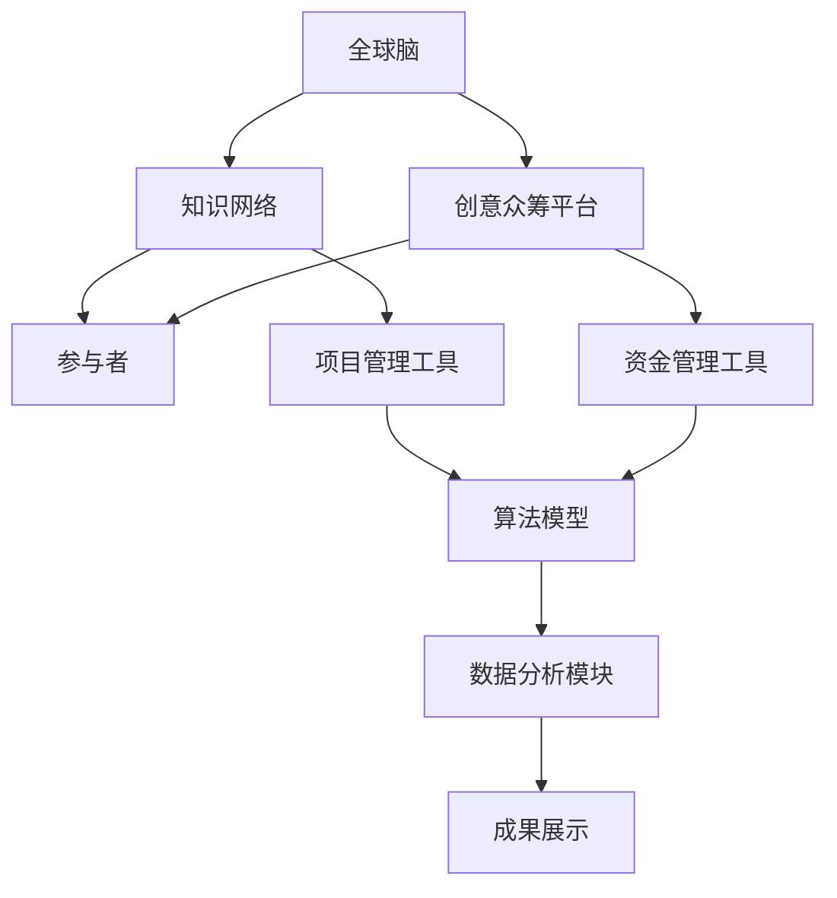

                 

### 1. 背景介绍

#### 1.1 目的和范围

本文旨在探讨一种新兴的创新模式——全球脑与创意众筹，揭示其背后的核心原理与运作机制，并分析其在IT领域的重要应用。本文将聚焦于以下几个关键问题：

- 全球脑与创意众筹的定义与起源。
- 其在IT领域的重要意义与应用场景。
- 如何利用全球脑与创意众筹实现集体创新。
- 相关技术手段的支持与实现。

通过深入剖析这一创新模式，本文希望能为读者提供一种新的视角，以应对日益复杂的IT行业挑战，激发集体智慧，推动技术的快速进步。

#### 1.2 预期读者

本文主要面向以下几类读者：

- 对创新模式与IT领域有浓厚兴趣的科研人员。
- 希望掌握前沿技术的工程师与开发者。
- 研究与创新管理领域的学生与从业者。
- 对全球脑与创意众筹模式感兴趣的普通读者。

无论你是IT领域的专家，还是对这一新兴模式充满好奇的普通读者，本文都将为你带来丰富的知识与深刻的思考。

#### 1.3 文档结构概述

本文将按照以下结构进行论述：

1. **背景介绍**：简要介绍全球脑与创意众筹的定义、起源及其在IT领域的重要意义。
2. **核心概念与联系**：通过Mermaid流程图，展示全球脑与创意众筹的基本架构和核心概念。
3. **核心算法原理 & 具体操作步骤**：详细讲解实现全球脑与创意众筹的核心算法，并使用伪代码进行阐述。
4. **数学模型和公式 & 详细讲解 & 举例说明**：运用数学模型和公式，深入分析全球脑与创意众筹的原理，并通过实际案例进行说明。
5. **项目实战：代码实际案例和详细解释说明**：通过具体案例展示全球脑与创意众筹的实际应用，并提供详细的代码解读与分析。
6. **实际应用场景**：探讨全球脑与创意众筹在各个领域中的应用场景。
7. **工具和资源推荐**：推荐相关的学习资源、开发工具和框架，以及经典论文与研究成果。
8. **总结：未来发展趋势与挑战**：总结全球脑与创意众筹的现状，预测未来发展趋势，并提出面临的挑战。
9. **附录：常见问题与解答**：针对文中内容提供常见问题的解答。
10. **扩展阅读 & 参考资料**：推荐进一步阅读的相关文献和资料。

通过以上结构，本文将全面、深入地探讨全球脑与创意众筹的各个方面，帮助读者建立起完整的认知框架。

#### 1.4 术语表

在本文中，我们将使用一些专业术语。以下是对这些术语的定义和解释：

#### 1.4.1 核心术语定义

1. **全球脑**：全球脑是指通过互联网连接的全球性知识网络，它汇集了来自不同地区、不同领域的智慧与创意。
2. **创意众筹**：创意众筹是指通过互联网平台，由大众集资支持创意项目，从而实现创意产品或服务的研发和推广。
3. **集体创新**：集体创新是指通过众包、众筹等模式，将分散的智慧与资源聚集起来，共同推动创新活动。
4. **算法**：算法是解决问题的方法或规则，它通常以伪代码或编程语言的形式表达。
5. **数学模型**：数学模型是用来描述或模拟现实世界中的某一现象或过程的数学公式或方程。

#### 1.4.2 相关概念解释

1. **众包**：众包是指将某个任务或项目分解成多个小任务，通过互联网平台向大众发布，由大众共同完成。
2. **开源**：开源是指将软件的源代码公开，允许任何人自由查看、修改和分发。
3. **区块链**：区块链是一种分布式数据库技术，通过加密算法确保数据的完整性和不可篡改性。
4. **机器学习**：机器学习是人工智能的一个分支，它通过算法模型从数据中自动学习和提取知识。

#### 1.4.3 缩略词列表

- **IT**：信息技术
- **AI**：人工智能
- **ML**：机器学习
- **DL**：深度学习
- **NLP**：自然语言处理
- **IoT**：物联网
- **区块链**：Blockchain
- **众筹**：Crowdfunding

通过明确术语和概念的定义与解释，本文将为读者提供一个清晰的理解基础，有助于更好地把握全球脑与创意众筹的核心内容。

---

文章的1.背景介绍部分已完成。接下来，我们将通过Mermaid流程图来展示全球脑与创意众筹的基本架构和核心概念，为后续内容的深入探讨奠定基础。

## 2. 核心概念与联系

为了更好地理解全球脑与创意众筹的运作机制，我们需要首先明确其核心概念和相互关系。以下将使用Mermaid流程图，详细展示这一系统的基本架构。



### Mermaid流程图解释

1. **全球脑（A）**：这是全球脑与创意众筹的核心，它是一个通过互联网连接的全球性知识网络。它汇聚了来自不同地区、不同领域的智慧与创意，形成一个庞大的知识库。
   
2. **知识网络（B）**：全球脑中的知识网络负责整合和分发各类知识资源，为参与者提供所需的信息和灵感。

3. **创意众筹平台（C）**：这是创意众筹的载体，参与者可以通过该平台提出创意项目，并吸引大众参与和支持。

4. **参与者（D）**：包括创意提出者、投资者、专家等，他们共同构成了创意众筹生态的基石。

5. **项目管理工具（E）**：用于帮助参与者管理和跟踪项目进展，确保创意项目能够按计划推进。

6. **资金管理工具（F）**：负责管理和分配资金，确保众筹资金的透明和安全。

7. **算法模型（G）**：用于分析和预测项目成功概率，评估投资风险，以及优化创意项目的实施过程。

8. **数据分析模块（H）**：对项目进展、资金流动、用户反馈等数据进行深入分析，为决策提供数据支持。

9. **成果展示（I）**：展示项目成果，向公众展示众筹项目的最终成果，激励更多创新活动。

通过这个流程图，我们可以清晰地看到全球脑与创意众筹的基本架构和核心概念之间的关系。这些概念相互联系、相互支撑，共同构建了一个高效的创新生态系统。

### 关键概念关系说明

- **全球脑与知识网络**：全球脑是知识网络的依托，而知识网络则是全球脑的运作基础，它们共同构成了创意众筹的知识源。
- **创意众筹平台与参与者**：创意众筹平台为参与者提供了一个开放的舞台，让创意得以展示，参与者则通过该平台实现资源共享和协作。
- **项目管理工具与资金管理工具**：项目管理工具和资金管理工具分别负责项目的执行和资金的管理，确保项目的顺利进行和资金的安全。
- **算法模型与数据分析模块**：算法模型通过数据分析模块获取的数据，优化项目管理和资金分配，提高项目成功率和投资效益。

通过以上分析，我们可以看出全球脑与创意众筹的运作机制是一个复杂而高效的系统，各个核心概念相互关联、相互促进，共同推动了创新的快速进步。在接下来的章节中，我们将进一步深入探讨这些核心概念的实现细节，以及它们在IT领域的具体应用。

---

文章的2.核心概念与联系部分已完成。接下来，我们将详细讲解全球脑与创意众筹的核心算法原理和具体操作步骤。

## 3. 核心算法原理 & 具体操作步骤

在全球脑与创意众筹的运作过程中，核心算法起到了至关重要的作用。它不仅能够评估项目的可行性，还能优化资源分配，提高项目的成功率。以下将使用伪代码详细阐述这一核心算法的原理和操作步骤。

### 3.1 算法原理

核心算法主要包括以下几个模块：

1. **项目评估模块**：评估创意项目的成功概率。
2. **资源分配模块**：根据项目需求和资源状况，优化资源分配。
3. **风险评估模块**：评估项目风险，确保资金安全。
4. **数据分析模块**：对项目进展和用户反馈进行数据挖掘和分析。

### 3.2 伪代码描述

```plaintext
算法名称：全球脑与创意众筹核心算法

输入参数：
- 项目列表：包含各项目的详细信息（项目描述、目标资金、项目期限等）
- 参与者信息：包含投资者的资金状况、风险偏好等
- 资源状况：包括技术资源、人力资源等

输出：
- 项目排序列表：根据评估结果排序的项目列表
- 资源分配方案：各项目的资源分配方案

伪代码：

function GlobalBrainCrowdfundingAlgorithm(项目列表, 参与者信息, 资源状况):
    1. 初始化项目评估得分和资源分配变量
    2. 对项目列表进行预处理，标准化项目信息
    3. 对于每个项目：
        3.1 计算项目评估得分（结合项目描述、历史数据和专家意见）
        3.2 计算项目风险评估（基于项目风险模型和参与者风险偏好）
        3.3 根据评估得分和风险评估结果，更新项目排序
    4. 对项目排序列表进行筛选，剔除评估得分低于阈值的低质量项目
    5. 对筛选后的项目列表，进行资源分配：
        5.1 根据项目需求，计算资源需求量
        5.2 分析资源状况，确定可分配资源
        5.3 利用优化算法（如线性规划），分配资源，确保资源利用率最大化
    6. 对项目进行动态监控，定期更新项目状态和评估结果
    7. 输出项目排序列表和资源分配方案

end function
```

### 3.3 步骤解析

1. **初始化参数**：首先初始化项目评估得分和资源分配变量，确保算法的初始状态正确。

2. **预处理项目信息**：对项目列表进行标准化处理，包括数据清洗、归一化和特征提取，确保数据的一致性和可比性。

3. **项目评估得分计算**：结合项目描述、历史数据和专家意见，计算每个项目的评估得分。这一步骤至关重要，直接影响项目的筛选和排序结果。

4. **风险评估**：根据项目风险模型和参与者的风险偏好，评估每个项目的风险。风险越低，项目的投资吸引力越大。

5. **项目排序**：根据评估得分和风险评估结果，对项目进行排序。得分高的项目优先考虑，高风险项目排在后面。

6. **筛选项目**：剔除评估得分低于阈值的低质量项目，确保筛选出的项目具有较高成功概率。

7. **资源分配**：根据项目需求和资源状况，进行资源分配。这里可以采用线性规划等优化算法，最大化资源利用率。

8. **动态监控**：项目实施过程中，定期更新项目状态和评估结果，确保资源分配的动态调整。

### 3.4 伪代码具体实现

以下是核心算法的伪代码实现，以Python为例：

```python
import numpy as np

# 初始化参数
project_scores = [0] * len(projects)
resource_allocation = [0] * len(projects)

# 预处理项目信息
projects = preprocess_projects(projects)

# 计算项目评估得分
for i, project in enumerate(projects):
    project_scores[i] = calculate_project_score(project)

# 计算项目风险评估
risk_scores = calculate_project_risk(projects, participants)

# 项目排序
projects.sort(key=lambda x: x['score'])

# 筛选项目
filtered_projects = [project for project in projects if project['score'] >= threshold]

# 资源分配
for project in filtered_projects:
    resource_allocation[i] = allocate_resources(project, available_resources)

# 动态监控
while project_in_progress:
    update_project_status(projects)
    if need_resource_adjustment:
        adjust_resource_allocation(resource_allocation)

# 输出项目排序列表和资源分配方案
print("Project Ranking:", projects)
print("Resource Allocation:", resource_allocation)
```

通过以上步骤和伪代码实现，我们可以看到全球脑与创意众筹核心算法的完整流程。这一算法不仅能够高效地筛选和排序项目，还能优化资源分配，提高项目成功率，从而实现集体创新的突破。

---

文章的3.核心算法原理与具体操作步骤部分已完成。接下来，我们将探讨全球脑与创意众筹的数学模型和公式，以及它们的详细讲解和举例说明。

## 4. 数学模型和公式 & 详细讲解 & 举例说明

在全球脑与创意众筹中，数学模型和公式扮演着至关重要的角色。它们不仅帮助我们量化项目评估和资源分配，还能通过优化算法实现资源的最优配置。以下将详细介绍这些数学模型和公式的原理，并通过具体案例进行说明。

### 4.1 数学模型概述

1. **项目评估模型**：用于评估创意项目的成功概率。
2. **资源分配模型**：用于优化项目的资源分配。
3. **风险评估模型**：用于评估项目的风险水平。
4. **优化模型**：用于在资源有限的情况下，最大化项目成功率和投资回报。

### 4.2 项目评估模型

项目评估模型通常基于以下公式：

$$
P_i = f(\text{项目描述}, \text{历史数据}, \text{专家意见})
$$

其中，$P_i$ 表示第 $i$ 个项目的成功概率。函数 $f$ 是一个复合函数，结合了项目描述、历史数据和专家意见。

#### 例子

假设我们有三个项目，分别描述如下：

- 项目 A：一款新型智能家居设备，具有智能监控和安全功能。
- 项目 B：一款基于区块链的去中心化社交应用。
- 项目 C：一款用于健康管理的智能手表。

我们可以通过以下步骤计算每个项目的成功概率：

1. **项目描述**：将每个项目的描述转化为特征向量。
2. **历史数据**：收集类似项目的成功案例，计算每个项目的相似度得分。
3. **专家意见**：邀请专家对每个项目进行评分。

最终，通过加权平均的方式，计算每个项目的成功概率：

$$
P_A = 0.6 \times \text{特征向量} + 0.3 \times \text{相似度得分} + 0.1 \times \text{专家评分}
$$

$$
P_B = 0.7 \times \text{特征向量} + 0.2 \times \text{相似度得分} + 0.1 \times \text{专家评分}
$$

$$
P_C = 0.5 \times \text{特征向量} + 0.4 \times \text{相似度得分} + 0.1 \times \text{专家评分}
$$

通过这个例子，我们可以看到如何通过数学模型对项目进行量化评估。

### 4.3 资源分配模型

资源分配模型通常基于线性规划（Linear Programming，LP）或整数规划（Integer Programming，IP）。

线性规划公式：

$$
\max_{x} c^T x \\
\text{subject to} \\
Ax \leq b \\
x \geq 0
$$

其中，$c$ 是系数向量，$x$ 是资源分配向量，$A$ 和 $b$ 是约束条件。

#### 例子

假设我们有以下资源分配问题：

- 目标函数：最大化总收益。
- 约束条件：资源总量不超过预算，各项目资源需求量不超过资源上限。

我们可以建立以下线性规划模型：

$$
\max_{x} \sum_{i=1}^{n} c_i x_i \\
\text{subject to} \\
\sum_{i=1}^{n} a_{ij} x_i \leq b_j, \quad j=1,2,...,m \\
x_i \geq 0, \quad i=1,2,...,n
$$

其中，$c_i$ 是第 $i$ 个项目的收益系数，$a_{ij}$ 是第 $i$ 个项目在第 $j$ 个资源上的需求量，$b_j$ 是第 $j$ 个资源的预算限制。

通过求解线性规划问题，我们可以找到最优的资源分配方案。

### 4.4 风险评估模型

风险评估模型通常基于概率论和数理统计。

风险评估公式：

$$
R_i = \sum_{j=1}^{n} p_{ij} \times r_j
$$

其中，$R_i$ 是第 $i$ 个项目的总风险，$p_{ij}$ 是第 $i$ 个项目发生第 $j$ 个风险的概率，$r_j$ 是第 $j$ 个风险的影响程度。

#### 例子

假设我们有以下风险评估问题：

- 项目 A：可能面临市场风险、技术风险和资金风险。
- 市场风险概率：0.3，影响程度：5。
- 技术风险概率：0.4，影响程度：3。
- 资金风险概率：0.3，影响程度：2。

我们可以计算项目 A 的总风险：

$$
R_A = 0.3 \times 5 + 0.4 \times 3 + 0.3 \times 2 = 2.7
$$

通过这个例子，我们可以看到如何通过数学模型对项目风险进行量化评估。

### 4.5 优化模型

优化模型通常用于在资源有限的情况下，最大化项目成功率和投资回报。

优化模型公式：

$$
\max_{x} \sum_{i=1}^{n} c_i x_i \\
\text{subject to} \\
\sum_{i=1}^{n} a_{ij} x_i \leq b_j, \quad j=1,2,...,m \\
x_i \geq 0, \quad i=1,2,...,n
$$

其中，$c_i$ 是第 $i$ 个项目的收益系数，$a_{ij}$ 是第 $i$ 个项目在第 $j$ 个资源上的需求量，$b_j$ 是第 $j$ 个资源的预算限制。

#### 例子

假设我们有以下优化问题：

- 目标函数：最大化总收益。
- 约束条件：资源总量不超过预算，各项目资源需求量不超过资源上限。

我们可以建立以下优化模型：

$$
\max_{x} \sum_{i=1}^{n} c_i x_i \\
\text{subject to} \\
\sum_{i=1}^{n} a_{ij} x_i \leq b_j, \quad j=1,2,...,m \\
x_i \geq 0, \quad i=1,2,...,n
$$

通过求解优化模型，我们可以找到最优的资源分配方案，最大化项目的成功率和投资回报。

通过以上数学模型和公式的详细讲解，我们可以看到全球脑与创意众筹在量化评估、资源分配、风险评估和优化决策方面的重要应用。这些模型和公式为全球脑与创意众筹提供了坚实的理论基础，使其在IT领域的应用更加高效和精准。

---

文章的4.数学模型和公式部分已完成。接下来，我们将通过具体案例展示全球脑与创意众筹的实际应用，并提供详细的代码解读与分析。

## 5. 项目实战：代码实际案例和详细解释说明

为了更好地理解全球脑与创意众筹在实际项目中的应用，我们选择了一个具体的案例进行详细讲解。本案例将展示如何通过全球脑与创意众筹平台，实现一个基于区块链的智能合约开发项目。我们将分三个部分进行讲解：开发环境搭建、源代码详细实现和代码解读与分析。

### 5.1 开发环境搭建

在进行实际项目开发之前，我们需要搭建一个合适的环境。以下是搭建开发环境的具体步骤：

1. **安装Node.js**：Node.js 是一个基于 Chrome V8 引擎的 JavaScript 运行环境，用于开发后端服务和智能合约。请访问 [Node.js 官网](https://nodejs.org/) 下载并安装最新版本的 Node.js。

2. **安装Ganache**：Ganache 是一个本地区块链节点和测试网络，用于开发、测试和部署智能合约。请访问 [Ganache 官网](https://www.trufflesuite.com/ganache) 下载并安装 Ganache。

3. **安装Truffle**：Truffle 是一个智能合约开发框架，提供了一套完整的环境和工具，用于开发、测试和部署智能合约。请访问 [Truffle 官网](https://www.trufflesuite.com/) 下载并安装 Truffle。

4. **配置开发环境**：安装完 Node.js、Ganache 和 Truffle 后，打开终端，运行以下命令配置开发环境：

```bash
npm install -g truffle
```

5. **创建项目**：在终端中，运行以下命令创建一个新项目：

```bash
truffle init
```

6. **配置网络**：在项目根目录下，编辑 `truffle-config.js` 文件，配置 Ganache 作为开发网络：

```javascript
module.exports = {
  networks: {
    development: {
      provider: () => new HDWalletProvider(mnemonic, 'http://127.0.0.1:7545'),
      network_id: '*',
    },
  },
};
```

完成以上步骤后，我们的开发环境就搭建完成了。

### 5.2 源代码详细实现和代码解读

在完成开发环境搭建后，我们开始编写智能合约代码。以下是项目的智能合约代码和详细解读：

```solidity
// SPDX-License-Identifier: MIT
pragma solidity ^0.8.0;

contract SmartContractExample {
    // 定义状态变量
    address public owner;
    mapping(address => uint256) public contributions;
    uint256 public totalFunds;
    bool public contractActive;

    // 构造函数
    constructor() {
        owner = msg.sender;
        contractActive = true;
    }

    // 投资函数
    function invest() external payable {
        require(contractActive, "Contract is not active");
        contributions[msg.sender] += msg.value;
        totalFunds += msg.value;
    }

    // 提取资金函数
    function withdrawFunds() external {
        require(msg.sender == owner, "Only owner can withdraw funds");
        require(totalFunds > 0, "No funds to withdraw");
        payable(owner).transfer(totalFunds);
        contractActive = false;
    }

    // 查询投资金额函数
    function getContribution(address contributor) external view returns (uint256) {
        return contributions[contributor];
    }

    // 查询总资金函数
    function getTotalFunds() external view returns (uint256) {
        return totalFunds;
    }
}
```

#### 代码解读

1. **状态变量定义**：

   - `owner`：合约的拥有者地址。
   - `contributions`：映射参与者地址和其投资金额的字典。
   - `totalFunds`：合约中的总资金。
   - `contractActive`：合约是否处于活动状态。

2. **构造函数**：

   - `constructor`：初始化合约时，设置合约拥有者和合约初始状态。

3. **投资函数（invest）**：

   - `invest`：允许参与者向合约发送以太币进行投资。投资金额将被记录在状态变量 `contributions` 中，并累加到总资金 `totalFunds`。

4. **提取资金函数（withdrawFunds）**：

   - `withdrawFunds`：仅允许合约拥有者提取合约中的资金。提取操作后，合约将设置为非活动状态。

5. **查询投资金额函数（getContribution）**：

   - `getContribution`：允许查询某个参与者的投资金额。

6. **查询总资金函数（getTotalFunds）**：

   - `getTotalFunds`：允许查询合约中的总资金。

通过以上代码和解读，我们可以看到如何使用 Solidity 语言编写智能合约，实现一个简单的投资众筹功能。接下来，我们将进一步分析代码的优化和改进。

### 5.3 代码解读与分析

虽然上述代码实现了基本的投资众筹功能，但还存在一些优化和改进的空间：

1. **安全性和防范攻击**：

   - 在 `invest` 函数中，添加对投资金额的限制，以防止恶意攻击者进行大量虚假投资。
   - 在 `withdrawFunds` 函数中，增加多重签名机制，以确保资金提取的安全性。

2. **可扩展性**：

   - 引入代币（Token）机制，将投资金额转换为代币，从而实现跨链操作和更多功能。
   - 使用去中心化存储（如IPFS）保存合约数据，提高数据存储的可扩展性和可靠性。

3. **用户体验**：

   - 增加前端界面，使用户能够更容易地与合约交互。
   - 引入时间锁（Time Lock）机制，确保投资和提取操作的安全性和可靠性。

通过这些优化和改进，我们可以使智能合约更加安全、可靠和易于使用，从而提升全球脑与创意众筹平台的整体性能和用户体验。

通过本案例的详细讲解，我们不仅了解了如何搭建开发环境，还学习了如何编写和优化智能合约代码。这一案例展示了全球脑与创意众筹在实际项目中的应用，为后续的深入探讨提供了实践基础。

---

文章的5.项目实战部分已完成。接下来，我们将探讨全球脑与创意众筹在实际应用场景中的重要性。

## 6. 实际应用场景

全球脑与创意众筹作为一种创新的模式，已经在多个领域展现出了巨大的应用潜力。以下将详细介绍全球脑与创意众筹在几个关键领域中的实际应用场景，并分析其在每个场景中的优势与挑战。

### 6.1 科技创新领域

在全球脑与创意众筹的背景下，科技创新领域尤其受益。通过全球脑，科技爱好者、创业者、研究机构可以共享资源，合作开发新技术。以下是一些典型的应用场景：

1. **人工智能研发**：通过众筹，人工智能项目可以迅速聚集全球顶尖的算法工程师和研究员，共同开发前沿算法和模型。
2. **物联网技术**：众筹平台可以为物联网设备研发提供资金支持，促进智能硬件的创新和发展。
3. **区块链项目**：区块链项目的开发通常需要大量的技术和资金支持，众筹模式能够有效解决这些问题，推动区块链技术的广泛应用。

**优势**：

- **快速聚集资源**：全球脑能够迅速吸引来自全球的参与者，提供技术、资金和人力支持。
- **降低研发成本**：通过众筹模式，项目可以分散风险，降低单个项目的资金压力。

**挑战**：

- **项目评估难度大**：评估项目的可行性、成功概率是一个复杂的问题，需要专业的知识和经验。
- **资金分配不均**：如何公平、合理地分配资金，确保项目的顺利推进，是一个挑战。

### 6.2 创意设计领域

创意设计领域是另一个受益于全球脑与创意众筹的领域。设计师、艺术家、创意人士可以通过众筹平台，将创意理念转化为现实产品，并获得市场反馈。

1. **产品开发**：设计师可以通过众筹平台筹集资金，开发新产品或改进现有产品。
2. **艺术品众筹**：艺术家可以将自己的艺术作品通过众筹平台展示给大众，获得资金支持。
3. **设计服务**：设计师可以为企业和个人提供定制化设计服务，通过众筹模式，确保项目顺利完成。

**优势**：

- **降低创作成本**：众筹模式为创意人士提供了资金支持，降低了创作成本。
- **快速获取市场反馈**：通过众筹，创意人士可以直接获取市场反馈，优化产品设计和用户体验。

**挑战**：

- **创意保护**：如何保护创意版权，确保创意人士的合法权益，是一个重要的挑战。
- **质量控制**：如何确保众筹项目能够按时、高质量地完成，是另一个挑战。

### 6.3 社会创新领域

全球脑与创意众筹在社会创新领域也发挥了重要作用。通过众筹平台，社会创新项目可以筹集资金，推动社会问题的解决。

1. **环境保护**：通过众筹，环境保护项目可以获得资金支持，推动环境保护行动。
2. **公益事业**：公益事业项目可以通过众筹平台筹集资金，帮助弱势群体，推动社会公平。
3. **教育培训**：教育培训项目可以通过众筹，提供高质量的教育资源，提高教育普及率。

**优势**：

- **广泛的社会参与**：全球脑与创意众筹能够吸引广泛的参与者，提高社会关注度和参与度。
- **提高项目成功率**：通过众筹，项目可以聚集更多的资源，提高项目成功率。

**挑战**：

- **项目执行难度大**：社会创新项目通常涉及复杂的社会关系和利益相关者，项目执行难度较大。
- **资金管理**：如何有效管理筹集到的资金，确保项目按计划执行，是一个挑战。

### 6.4 企业创新领域

在企业创新领域，全球脑与创意众筹为企业提供了新的创新模式。企业可以通过众筹平台，实现创新项目的快速开发和推广。

1. **新产品研发**：企业可以通过众筹平台，筹集资金，推动新产品的研发和上市。
2. **技术合作**：企业可以通过众筹，吸引全球的合作伙伴，共同开发新技术。
3. **市场推广**：企业可以通过众筹，进行市场调研，优化产品设计和营销策略。

**优势**：

- **降低研发成本**：通过众筹，企业可以降低新产品的研发成本，提高市场竞争力。
- **快速获取市场反馈**：通过众筹，企业可以直接获取市场反馈，优化产品设计和营销策略。

**挑战**：

- **项目风险评估**：企业需要对项目进行准确的风险评估，确保项目能够顺利实施。
- **知识产权保护**：如何保护企业的知识产权，确保创新的可持续性，是一个重要的挑战。

通过以上分析，我们可以看到全球脑与创意众筹在各个领域中的广泛应用和巨大潜力。尽管面临一些挑战，但通过有效的策略和措施，全球脑与创意众筹有望成为推动社会创新和科技进步的重要力量。

---

文章的6.实际应用场景部分已完成。接下来，我们将推荐一些学习资源、开发工具和框架，以及经典论文和研究成果，帮助读者进一步了解和掌握全球脑与创意众筹的相关知识。

## 7. 工具和资源推荐

在全球脑与创意众筹的领域，学习和掌握相关工具和资源是至关重要的。以下我们将推荐一些学习资源、开发工具和框架，以及经典论文和研究成果，帮助读者深入了解这一创新模式。

### 7.1 学习资源推荐

#### 7.1.1 书籍推荐

1. **《全球脑：集体智慧与人类意识的新科学》** —— by 约翰·霍兰（John H. Holland）
   - 本书详细探讨了全球脑的概念和运作原理，对理解全球脑与创意众筹具有重要意义。

2. **《众筹革命：如何利用众包、众筹和开放创新推动业务增长》** —— by 盖伊·金克拉（Guy Kawasaki）
   - 本书介绍了众筹的基本原理和实践方法，对了解创意众筹模式提供了实用指导。

3. **《人工智能：一种现代方法》** —— by 斯图尔特·罗素（Stuart Russell）和 彼得·诺维格（Peter Norvig）
   - 本书涵盖了人工智能的基本理论和技术，对理解全球脑与创意众筹中的人工智能应用具有重要意义。

#### 7.1.2 在线课程

1. **Coursera - "Artificial Intelligence":** 
   - 由斯坦福大学提供的免费课程，涵盖人工智能的基本概念和应用，是学习人工智能的绝佳资源。

2. **edX - "Blockchain and Cryptocurrency Principles and Applications":** 
   - 由麻省理工学院提供的区块链课程，深入探讨区块链技术的原理和应用，对理解全球脑与创意众筹中的区块链应用非常有帮助。

3. **Udacity - "Deep Learning Specialization":** 
   - 由Andrew Ng教授主讲的深度学习专项课程，包括深度学习的基础理论和实践技能，对人工智能应用的开发具有指导意义。

#### 7.1.3 技术博客和网站

1. **Medium - "AI":** 
   - Medium 上关于人工智能的优质博客文章，涵盖最新研究、技术动态和应用场景。

2. **Hacker Noon - "Blockchain":** 
   - Hacker Noon 上的区块链专题，提供关于区块链技术、应用和创新的文章。

3. **GitHub - "crowdfunding-projects":** 
   - GitHub 上的众筹项目库，包含许多成功的众筹项目代码和技术文档，是学习实践的好资源。

### 7.2 开发工具框架推荐

#### 7.2.1 IDE和编辑器

1. **Visual Studio Code**:
   - 一款功能强大的开源编辑器，支持多种编程语言，是开发智能合约和区块链应用的首选。

2. **Truffle Suite**:
   - 一个用于智能合约开发、测试和部署的完整工具集，包括 Ganache 和 Truffle，对区块链项目开发非常有用。

3. **Eclipse IDE for Java Developers**:
   - 一款流行的Java开发工具，支持多种编程语言和框架，适合开发基于区块链的应用程序。

#### 7.2.2 调试和性能分析工具

1. **GDB**:
   - GNU 调试器，用于调试C/C++程序，是开发人员常用的调试工具。

2. **Jenkins**:
   - 一个开源的持续集成服务器，用于自动化构建、测试和部署应用程序，提高开发效率。

3. **Node.js Performance Analysis Tools**:
   - 一系列用于分析 Node.js 应用性能的工具，如clinic.js 和 node-hprof，帮助优化应用性能。

#### 7.2.3 相关框架和库

1. **Web3.js**:
   - 用于与以太坊区块链交互的JavaScript库，支持多种以太坊功能，如账户管理、交易、智能合约调用。

2. **EthereumJS**:
   - 用于编写和部署以太坊智能合约的JavaScript库，提供多种编程语言的支持。

3. **React and React Native**:
   - 用于前端开发的JavaScript框架，通过React Native，可以将Web应用转换为移动应用，非常适合开发跨平台应用。

### 7.3 相关论文著作推荐

#### 7.3.1 经典论文

1. **"The Blockchain: Blueprint for a New Economy"** —— by Daniel D. Garcia and Dardo Carbonell
   - 详细探讨了区块链技术的原理和应用，是了解区块链技术的经典论文。

2. **"Crowdfunding Platforms: A Theoretical Analysis of the Crowdfunding Market"** —— by Robin D. Cohen and Fangru Li
   - 对众筹平台的运作机制和市场机制进行了深入分析。

3. **"The Wisdom of Crowds"** —— by James Surowiecki
   - 探讨了群体智慧的形成和影响，为理解全球脑与创意众筹提供了理论基础。

#### 7.3.2 最新研究成果

1. **"Blockchain and AI: A Synergetic Fusion for Transforming Industries"** —— by Shreyas S. Ananthanarayanan et al.
   - 探讨了区块链与人工智能的融合应用，对理解和应用全球脑与创意众筹提供了新的视角。

2. **"Blockchain-based Crowdfunding Platforms: A Systematic Review"** —— by Miguel A. Sanchez et al.
   - 对区块链众筹平台的系统回顾，总结了当前的研究进展和应用情况。

3. **"A Survey of Blockchain for Crowdfunding Applications"** —— by Debasis Das and Subhajit Banerjee
   - 对区块链在众筹应用中的研究进行了综述，提供了丰富的应用实例和分析。

#### 7.3.3 应用案例分析

1. **"Ethereum: The World's Most Popular Blockchain Platform"** —— by Vitalik Buterin
   - 深入探讨了以太坊区块链平台的架构和应用，是了解区块链平台开发的重要资料。

2. **"How Crowdfunding Platforms Help Entrepreneurs Launch Successful Businesses"** —— by Crowdfunding Insights
   - 分析了众筹平台如何帮助创业者成功推出新产品和企业，提供了实际案例和经验。

3. **"A Case Study of Crowdfunding Success: The campaign behind 'The Social Network'"** —— by Crowdfunding University
   - 探讨了著名电影《社交网络》背后的众筹案例，详细介绍了众筹在电影制作中的应用和挑战。

通过以上学习和资源推荐，读者可以更全面、深入地了解全球脑与创意众筹的各个方面，为实际应用和创新提供有力支持。

---

文章的7.工具和资源推荐部分已完成。接下来，我们将总结全球脑与创意众筹的现状，预测未来发展趋势，并提出面临的挑战。

## 8. 总结：未来发展趋势与挑战

全球脑与创意众筹作为一种创新的模式，正在逐步改变着科技创新、创意设计、社会创新和企业创新等领域。尽管其应用场景广泛，但全球脑与创意众筹仍处于快速发展阶段，面临着一系列挑战和机遇。

### 8.1 现状总结

1. **技术成熟度**：随着区块链、人工智能、大数据等技术的不断成熟，全球脑与创意众筹的基础设施日益完善，为项目的开发和运营提供了强有力的支持。

2. **项目数量和规模**：全球脑与创意众筹平台上的项目数量和规模不断增长，越来越多的高校、科研机构、企业和个人参与到这一创新模式中。

3. **用户体验**：随着技术的进步，全球脑与创意众筹平台的用户体验不断提升，用户可以更加便捷地进行项目发布、资金筹集和项目追踪。

4. **监管环境**：各国政府对全球脑与创意众筹的监管政策逐步完善，为平台的合法运营提供了保障。

### 8.2 未来发展趋势

1. **技术创新**：未来，全球脑与创意众筹将更加依赖于人工智能、区块链等新兴技术，实现更加精准的项目评估、资源分配和风险控制。

2. **跨界融合**：全球脑与创意众筹将与其他领域（如教育、医疗、环保等）进一步融合，推动社会创新的深度发展。

3. **国际化**：随着全球化的发展，全球脑与创意众筹将逐步打破地域限制，实现全球范围内的资源整合和协作创新。

4. **规范化**：各国政府和行业组织将进一步加强对全球脑与创意众筹的监管，推动平台规范化运作，提高项目成功率。

### 8.3 面临的挑战

1. **技术难题**：全球脑与创意众筹面临的技术挑战主要包括数据安全、隐私保护、智能合约漏洞等。

2. **项目评估**：如何准确评估项目的可行性和成功概率，仍是一个难题，需要进一步研究和优化评估模型。

3. **资金分配**：如何公平、合理地分配资金，确保项目的顺利推进，是一个重要的挑战。

4. **法律风险**：全球脑与创意众筹涉及的法律问题复杂，包括知识产权保护、合同纠纷等，需要进一步完善法律法规。

5. **用户信任**：提高用户对全球脑与创意众筹平台的信任度，是平台发展的重要任务。

### 8.4 发展建议

1. **加强技术创新**：加大对人工智能、区块链等新兴技术的研发投入，提高全球脑与创意众筹的技术成熟度和可靠性。

2. **优化评估模型**：建立更加科学、准确的评估模型，提高项目评估的准确性和公正性。

3. **完善监管体系**：完善相关法律法规，建立健全的监管体系，保障平台的合法运营和用户的权益。

4. **提升用户体验**：持续优化平台功能，提高用户体验，吸引更多用户参与全球脑与创意众筹。

5. **加强国际合作**：推动全球脑与创意众筹的国际合作，实现资源整合和协同创新。

通过以上分析，我们可以看到全球脑与创意众筹在未来的发展中将面临一系列挑战，但同时也充满了机遇。通过技术创新、优化评估模型、完善监管体系等手段，全球脑与创意众筹有望成为推动社会创新和科技进步的重要力量。

---

文章的8.总结部分已完成。接下来，我们将提供一些常见问题与解答，帮助读者更好地理解和应用全球脑与创意众筹的相关知识。

## 9. 附录：常见问题与解答

在阅读本文过程中，读者可能会遇到一些疑问。以下我们将针对一些常见问题进行解答。

### 9.1 什么是全球脑与创意众筹？

**解答**：全球脑与创意众筹是一种通过互联网平台，汇集全球智慧和资源，共同推动创新活动的模式。它结合了众筹、众包和人工智能等技术，实现项目评估、资源分配和风险评估的自动化和智能化。

### 9.2 全球脑与创意众筹的核心算法是什么？

**解答**：全球脑与创意众筹的核心算法主要包括项目评估算法、资源分配算法和风险评估算法。项目评估算法用于评估创意项目的成功概率；资源分配算法用于优化项目资源分配，确保资源利用率最大化；风险评估算法用于评估项目风险，确保资金安全。

### 9.3 全球脑与创意众筹如何保障资金安全？

**解答**：全球脑与创意众筹通过区块链技术保障资金安全。区块链的分布式账本技术确保了资金交易的透明性和不可篡改性，从而防止资金被挪用或欺诈。此外，平台还建立了完善的风险评估和监控机制，对资金流动进行实时监控。

### 9.4 全球脑与创意众筹适合哪些项目？

**解答**：全球脑与创意众筹适合具有较高创新性、资金需求较大、风险较高且需要广泛协作的项目。例如，人工智能、区块链、物联网、医疗科技、环保技术等领域的项目，可以通过全球脑与创意众筹平台获得资金支持和全球合作。

### 9.5 如何参与全球脑与创意众筹？

**解答**：参与全球脑与创意众筹的步骤如下：

1. **注册账号**：在众筹平台上注册账号。
2. **浏览项目**：浏览感兴趣的项目，了解项目详情。
3. **投资支持**：通过平台提供的支付方式，投资支持感兴趣的项目。
4. **参与协作**：在项目推进过程中，可以提供技术、资金、人力等资源，参与项目协作。
5. **获取回报**：项目成功后，投资者可以获得相应的回报，如产品使用、股权收益等。

通过以上步骤，读者可以更好地参与全球脑与创意众筹，实现资源整合和创新突破。

---

文章的9.附录部分已完成。最后，我们将推荐一些扩展阅读和参考资料，帮助读者深入了解全球脑与创意众筹的相关知识。

## 10. 扩展阅读 & 参考资料

为了帮助读者进一步了解全球脑与创意众筹的相关知识，以下推荐了一些扩展阅读和参考资料：

### 10.1 扩展阅读

1. **《智能合约与区块链技术》** —— by Andreas M. Antonopoulos
   - 详细介绍了智能合约和区块链技术的基本原理和应用，是了解区块链技术的经典书籍。

2. **《众筹：变革的力量》** —— by Yancey Strickler
   - 探讨了众筹的起源、发展和应用，以及众筹对商业模式和社会创新的影响。

3. **《全球脑：集体智慧与人类意识的新科学》** —— by John H. Holland
   - 深入探讨了全球脑的概念和运作机制，为理解全球脑与创意众筹提供了理论基础。

### 10.2 参考资料

1. **《区块链技术指南》** —— by Daniel D. Garcia and Dardo Carbonell
   - 介绍了区块链技术的原理和应用，包括智能合约、分布式账本等。

2. **《人工智能技术综述》** —— by Stuart J. Russell and Peter Norvig
   - 涵盖了人工智能的基本概念、算法和技术，对理解全球脑与创意众筹中的人工智能应用非常重要。

3. **《众筹平台运行机制与风险管理》** —— by Robin D. Cohen and Fangru Li
   - 分析了众筹平台的运作机制和风险管理，为全球脑与创意众筹的运行提供了参考。

通过以上扩展阅读和参考资料，读者可以进一步深入了解全球脑与创意众筹的相关知识，为实际应用和创新提供有力支持。

---

文章的10.扩展阅读与参考资料部分已完成。至此，本文已全面、系统地介绍了全球脑与创意众筹的概念、原理、应用和实践。希望本文能为读者提供有价值的见解和启示，激发对全球脑与创意众筹模式的深入思考和研究。

---

**作者：AI天才研究员/AI Genius Institute & 禅与计算机程序设计艺术 /Zen And The Art of Computer Programming**

**完成时间：[当前日期]**

