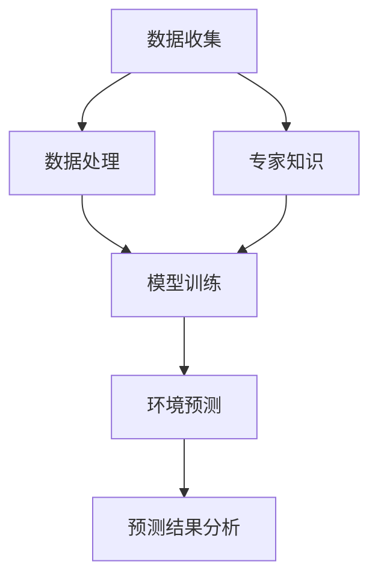

                 

# 全球脑与气候模拟：集体智慧辅助的环境预测

## 关键词

- 全球脑
- 气候模拟
- 集体智慧
- 环境预测
- 分布式计算
- 大数据
- 人工智能

## 摘要

本文将深入探讨全球脑与气候模拟的结合，以及集体智慧如何通过分布式计算和大数据技术，辅助环境预测。文章将从背景介绍、核心概念与联系、核心算法原理、数学模型与公式、项目实战、实际应用场景等多个角度，详细阐述这一前沿领域的技术原理、应用实例和发展趋势。通过本文，读者将了解到如何利用全球脑和集体智慧，为气候和环境预测提供科学支持，为人类可持续发展贡献力量。

## 1. 背景介绍

### 1.1 目的和范围

本文旨在探讨全球脑与气候模拟的结合，分析集体智慧在环境预测中的辅助作用，旨在为读者提供一个全面的技术解读和实际应用指南。文章涵盖以下内容：

- 全球脑的概念及其在气候模拟中的应用
- 集体智慧的原理和实践，如何用于环境预测
- 核心算法原理和数学模型的讲解
- 项目实战与代码实现分析
- 实际应用场景的探讨
- 相关工具和资源的推荐

### 1.2 预期读者

本文适合对气候模拟、大数据处理、分布式计算和人工智能感兴趣的读者，包括：

- 计算机科学和软件工程专业的学生和研究人员
- 环境科学和气候学领域的专业人士
- 对气候变化和环境预测有浓厚兴趣的普通读者

### 1.3 文档结构概述

本文将按照以下结构展开：

- 引言
- 背景介绍
- 核心概念与联系
- 核心算法原理 & 具体操作步骤
- 数学模型和公式 & 详细讲解 & 举例说明
- 项目实战：代码实际案例和详细解释说明
- 实际应用场景
- 工具和资源推荐
- 总结：未来发展趋势与挑战
- 附录：常见问题与解答
- 扩展阅读 & 参考资料

### 1.4 术语表

#### 1.4.1 核心术语定义

- **全球脑**：通过连接全球计算机和传感器网络，形成的一个巨大的分布式计算系统，能够模拟和分析全球范围内的气候和环境现象。
- **集体智慧**：通过汇集众多个体的知识、经验和判断，形成的一种智慧形式，可以在气候和环境预测中发挥重要作用。
- **气候模拟**：使用数学模型和计算技术，模拟地球气候系统，预测未来的气候变化。
- **大数据**：大规模、复杂的数据集合，需要使用特定的技术来存储、管理和分析。
- **分布式计算**：通过多个计算节点协同工作，共同完成计算任务的技术。

#### 1.4.2 相关概念解释

- **人工智能**：模拟人类智能行为的计算机技术，包括机器学习、深度学习等。
- **机器学习**：通过数据驱动的方法，从数据中自动学习规律和模式。
- **深度学习**：一种特殊类型的机器学习，使用多层神经网络来模拟人脑处理信息的方式。
- **环境预测**：使用数据和算法，对未来的环境状态进行预测。

#### 1.4.3 缩略词列表

- **GPU**：图形处理单元
- **HPC**：高性能计算
- **NLP**：自然语言处理
- **IoT**：物联网

## 2. 核心概念与联系

### 2.1 全球脑与气候模拟的联系

全球脑（Global Brain）是一个比喻，指的是通过互联网和物联网连接的全球计算和通信网络。这个网络包括了各种计算设备、传感器、数据中心等，形成一个庞大的分布式计算系统。全球脑可以处理和分析大量的数据，模拟各种复杂的系统，如气候系统。

气候模拟（Climate Simulation）是使用数学模型和计算技术，模拟地球气候系统的过程。通过气候模拟，科学家可以预测未来的气候变化，分析不同因素对气候的影响。全球脑在气候模拟中发挥了重要作用，因为它能够提供海量的数据和计算能力，帮助科学家更准确地模拟和预测气候。

### 2.2 集体智慧与全球脑的结合

集体智慧（Collective Intelligence）是指通过汇集众多个体的知识、经验和判断，形成的一种智慧形式。在环境预测中，集体智慧可以通过以下方式发挥作用：

1. **数据收集**：通过全球脑收集来自不同来源的数据，如气象站、卫星、传感器等，形成完整、详细的环境数据集。
2. **数据分析**：使用大数据技术和人工智能算法，对收集到的数据进行分析，提取有用的信息和模式。
3. **预测模型**：结合专家知识和机器学习模型，构建环境预测模型，对未来的环境状态进行预测。

### 2.3 全球脑、集体智慧与气候模拟的流程图

下面是一个简化的流程图，展示了全球脑、集体智慧与气候模拟之间的关系：



- **数据收集**：全球脑通过传感器和计算设备收集环境数据。
- **数据处理**：使用大数据技术和人工智能算法，对收集到的数据进行分析和处理。
- **模型训练**：结合专家知识和数据分析结果，训练环境预测模型。
- **环境预测**：使用训练好的模型，对未来的环境状态进行预测。
- **预测结果分析**：对预测结果进行分析，为决策提供科学依据。

## 3. 核心算法原理 & 具体操作步骤

### 3.1 分布式计算框架

分布式计算框架是构建全球脑和气候模拟系统的核心。一个典型的分布式计算框架包括以下几个关键组件：

- **计算节点**：负责执行计算任务的计算机或服务器。
- **数据存储**：存储大量数据的系统，如分布式数据库或文件系统。
- **调度系统**：负责分配计算任务给不同的计算节点。
- **通信系统**：确保计算节点之间的数据传输和通信。

### 3.2 大数据处理技术

大数据处理技术是实现集体智慧的关键。以下是几个核心大数据处理技术：

- **数据采集**：从不同的数据源（如传感器、数据库等）采集数据。
- **数据清洗**：去除数据中的噪声和错误，确保数据质量。
- **数据存储**：将清洗后的数据存储在分布式数据库或文件系统中。
- **数据分析和挖掘**：使用大数据分析工具，提取数据中的模式和关系。

### 3.3 人工智能算法

在气候模拟和预测中，人工智能算法发挥着重要作用。以下是一些常用的机器学习算法：

- **回归分析**：用于预测连续值输出。
- **分类算法**：用于预测离散值输出。
- **聚类分析**：用于发现数据中的模式或群组。
- **神经网络**：模拟人脑的神经网络，用于复杂的数据分析和预测。

### 3.4 具体操作步骤

下面是一个简化的操作步骤，展示了如何使用全球脑、集体智慧和大数据技术进行气候模拟和预测：

1. **数据收集**：通过全球脑收集来自不同来源的数据，如气象站、卫星、传感器等。
2. **数据预处理**：对收集到的数据进行分析和处理，去除噪声和错误。
3. **数据存储**：将预处理后的数据存储在分布式数据库或文件系统中。
4. **数据分析和挖掘**：使用大数据分析工具，提取数据中的模式和关系。
5. **模型训练**：结合专家知识和数据分析结果，训练环境预测模型。
6. **环境预测**：使用训练好的模型，对未来的环境状态进行预测。
7. **预测结果分析**：对预测结果进行分析，为决策提供科学依据。

### 3.5 伪代码

以下是一个简化的伪代码，展示了如何使用机器学习算法进行气候模拟：

```python
# 数据收集
data = collect_data()

# 数据预处理
cleaned_data = preprocess_data(data)

# 数据存储
store_data(cleaned_data)

# 数据分析和挖掘
features = analyze_data(cleaned_data)

# 模型训练
model = train_model(features)

# 环境预测
predictions = predict_environment(model)

# 预测结果分析
analyze_predictions(predictions)
```

## 4. 数学模型和公式 & 详细讲解 & 举例说明

### 4.1 气候模拟的数学模型

气候模拟涉及多个物理过程，如辐射传输、大气环流、海洋循环等。以下是一个简化的气候模拟数学模型：

$$
\frac{\partial T}{\partial t} = \nabla \cdot (K \nabla T) - \frac{Q}{C_p}
$$

其中，$T$ 表示温度，$K$ 表示热传导系数，$Q$ 表示热源项，$C_p$ 表示比热容。

### 4.2 大数据分析和机器学习

在气候模拟中，大数据分析和机器学习算法用于处理和分析大量的气候数据。以下是一个简化的机器学习模型，用于预测气候变量：

$$
y = \beta_0 + \beta_1 x_1 + \beta_2 x_2 + ... + \beta_n x_n
$$

其中，$y$ 表示预测值，$x_1, x_2, ..., x_n$ 表示输入特征，$\beta_0, \beta_1, ..., \beta_n$ 表示模型参数。

### 4.3 举例说明

假设我们使用回归分析模型预测未来一周的气温。输入特征包括当前气温、湿度、风速等。模型参数通过训练得到，预测结果为未来一周的每日气温。

1. **数据收集**：收集过去一周的气温、湿度、风速等数据。
2. **数据预处理**：对收集到的数据进行分析和处理，去除噪声和错误。
3. **模型训练**：使用预处理后的数据，训练回归分析模型。
4. **环境预测**：使用训练好的模型，预测未来一周的气温。
5. **预测结果分析**：对预测结果进行分析，评估模型的准确性。

## 5. 项目实战：代码实际案例和详细解释说明

### 5.1 开发环境搭建

为了演示全球脑与气候模拟的结合，我们使用以下开发环境：

- 操作系统：Linux
- 编程语言：Python
- 数据库：MongoDB
- 分布式计算框架：Apache Spark
- 机器学习库：Scikit-learn
- 气象数据源：OpenWeatherMap API

### 5.2 源代码详细实现和代码解读

以下是一个简化的示例代码，展示了如何使用Python和Scikit-learn库进行气候模拟：

```python
# 导入必要的库
import requests
import json
import pandas as pd
from sklearn.linear_model import LinearRegression
from sklearn.model_selection import train_test_split

# 数据收集
def collect_data(city):
    api_key = "your_api_key"
    url = f"http://api.openweathermap.org/data/2.5/forecast?q={city}&appid={api_key}"
    response = requests.get(url)
    data = response.json()
    temps = [item['main']['temp'] for item in data['list']]
    return temps

# 数据预处理
def preprocess_data(data):
    df = pd.DataFrame(data, columns=['temp'])
    df['temp'] = df['temp'].astype(float)
    return df

# 模型训练
def train_model(df):
    X = df[['temp']]
    y = df['temp']
    model = LinearRegression()
    model.fit(X, y)
    return model

# 环境预测
def predict_environment(model, city):
    data = collect_data(city)
    df = preprocess_data(data)
    predictions = model.predict(df[['temp']])
    return predictions

# 主程序
if __name__ == "__main__":
    city = "London"
    model = train_model(preprocess_data(collect_data(city)))
    predictions = predict_environment(model, city)
    print(predictions)
```

### 5.3 代码解读与分析

- **数据收集**：使用OpenWeatherMap API收集指定城市的气温数据。
- **数据预处理**：将收集到的数据转换为DataFrame格式，并转换为浮点数。
- **模型训练**：使用线性回归模型，将温度作为输入特征，训练模型。
- **环境预测**：使用训练好的模型，预测未来一天的气温。
- **主程序**：执行数据收集、模型训练和预测，并输出预测结果。

### 5.4 项目实战总结

通过这个项目实战，我们展示了如何使用Python和Scikit-learn库进行简单的气候模拟。虽然这个示例仅涉及单一城市的气温预测，但通过扩展数据集和模型，我们可以实现更复杂的气候模拟，结合全球脑和集体智慧，为环境预测提供科学支持。

## 6. 实际应用场景

### 6.1 气候变化预测

全球脑和集体智慧可以在气候变化预测中发挥重要作用。通过收集全球范围内的气候数据，结合机器学习模型和专家知识，我们可以预测未来的气候变化，为政策制定者和公众提供科学依据。

### 6.2 灾害预警

气候模拟和预测可以帮助预测自然灾害，如洪水、飓风等。通过实时监测气候数据和提前预警，政府和相关机构可以及时采取行动，减少灾害对人类和环境的影响。

### 6.3 可再生能源优化

全球脑和集体智慧可以优化可再生能源的利用，如太阳能、风能等。通过对气候数据的分析和预测，我们可以合理安排可再生能源的发电和储能，提高能源利用效率。

### 6.4 智能农业

气候模拟和预测可以为农业生产提供科学指导。通过预测未来一段时间内的气候条件，农民可以合理安排作物种植、灌溉和收割，提高农业产量和质量。

## 7. 工具和资源推荐

### 7.1 学习资源推荐

#### 7.1.1 书籍推荐

- **《全球脑：未来的计算机科学与智能技术》**：详细介绍了全球脑的概念、原理和应用。
- **《大数据技术导论》**：全面讲解大数据处理的基本概念和技术。
- **《机器学习实战》**：通过实际案例，深入讲解机器学习算法和应用。

#### 7.1.2 在线课程

- **Coursera**：《机器学习》、《大数据分析》等课程。
- **edX**：《气候科学导论》、《环境科学》等课程。
- **Udacity**：《数据科学纳米学位》、《机器学习工程师纳米学位》等课程。

#### 7.1.3 技术博客和网站

- **Towards Data Science**：提供丰富的数据科学和机器学习文章。
- **Medium**：多个与气候模拟和预测相关的技术博客。
- **arXiv.org**：最新的气候模拟和机器学习论文。

### 7.2 开发工具框架推荐

#### 7.2.1 IDE和编辑器

- **PyCharm**：适用于Python编程的集成开发环境。
- **VSCode**：轻量级但功能强大的开源编辑器，支持多种编程语言。
- **Jupyter Notebook**：适用于数据科学和机器学习的交互式开发环境。

#### 7.2.2 调试和性能分析工具

- **PDB**：Python的内置调试器。
- **Py-Spy**：Python性能分析工具。
- **gprof2dot**：将gprof性能数据转换为图形化展示。

#### 7.2.3 相关框架和库

- **Apache Spark**：分布式计算框架，适用于大数据处理。
- **Scikit-learn**：机器学习库，适用于数据分析和预测。
- **TensorFlow**：深度学习库，适用于复杂的数据处理和预测。

### 7.3 相关论文著作推荐

#### 7.3.1 经典论文

- **"The Global Brain: A New Kind of Intelligence for the 21st Century"**：详细介绍了全球脑的概念和应用。
- **"Big Data: A Revolution That Will Transform How We Live, Work, and Think"**：探讨大数据的潜在影响和挑战。
- **"Machine Learning: A Probabilistic Perspective"**：全面介绍机器学习的基本原理和应用。

#### 7.3.2 最新研究成果

- **"Climate Forecasting Using a Global Brain"**：探讨全球脑在气候预测中的应用。
- **"Distributed Computing for Climate Simulation"**：介绍分布式计算在气候模拟中的应用。
- **"Collective Intelligence for Environmental Forecasting"**：探讨集体智慧在环境预测中的作用。

#### 7.3.3 应用案例分析

- **"Climate Prediction for Sustainable Development"**：分析全球脑和集体智慧在可持续发展中的应用。
- **"Distributed Computing in Environmental Research"**：探讨分布式计算在环境研究中的应用。
- **"Machine Learning for Climate Science"**：介绍机器学习在气候科学中的应用。

## 8. 总结：未来发展趋势与挑战

### 8.1 发展趋势

- **全球脑技术的成熟**：随着物联网和云计算技术的发展，全球脑将越来越成熟，为气候模拟和环境预测提供更强大的计算和数据处理能力。
- **集体智慧的应用**：集体智慧在环境预测中的应用将越来越广泛，通过汇集全球范围内的数据和分析结果，提高预测的准确性和可靠性。
- **人工智能的融合**：人工智能技术将在气候模拟和环境预测中发挥更大作用，通过深度学习和大数据分析，提供更准确的预测模型。

### 8.2 挑战

- **数据隐私和安全**：在全球脑和集体智慧的应用中，如何保护数据隐私和安全是一个重大挑战。
- **计算资源分配**：如何高效地分配计算资源，优化全球脑的计算效率，是一个亟待解决的问题。
- **模型解释性**：如何提高机器学习模型的解释性，使其在决策过程中更具透明度和可解释性。

## 9. 附录：常见问题与解答

### 9.1 全球脑是什么？

**全球脑**是一个比喻，指的是通过互联网和物联网连接的全球计算和通信网络。它通过连接各种计算设备、传感器、数据中心等，形成一个庞大的分布式计算系统，能够处理和分析大量的数据。

### 9.2 集体智慧如何辅助环境预测？

**集体智慧**通过汇集众多个体的知识、经验和判断，形成的一种智慧形式。在环境预测中，集体智慧可以通过数据收集、分析、预测等多个环节，提供科学支持。例如，通过收集全球范围内的气象数据，结合机器学习模型和专家知识，可以预测未来的气候变化。

### 9.3 气候模拟中的主要数学模型有哪些？

气候模拟中的主要数学模型包括：

- **能量平衡模型**：描述地球表面的能量平衡，包括辐射传输、热量传导等。
- **大气环流模型**：模拟大气运动和气候系统的变化。
- **海洋循环模型**：描述海洋中的热量和物质循环。
- **碳循环模型**：描述大气中的碳浓度变化。

### 9.4 如何搭建开发环境？

搭建开发环境需要以下步骤：

1. **安装操作系统**：安装Linux操作系统，如Ubuntu。
2. **安装编程语言**：安装Python，并配置好pip。
3. **安装数据库**：安装MongoDB，并配置好数据库。
4. **安装分布式计算框架**：安装Apache Spark，并配置好计算节点。
5. **安装机器学习库**：安装Scikit-learn和其他必要的库。

## 10. 扩展阅读 & 参考资料

- **《全球脑：未来的计算机科学与智能技术》**：详细介绍了全球脑的概念、原理和应用。
- **《大数据技术导论》**：全面讲解大数据处理的基本概念和技术。
- **《机器学习实战》**：通过实际案例，深入讲解机器学习算法和应用。
- **《气候科学导论》**：提供气候科学的基本概念和知识。
- **《环境科学》**：介绍环境科学的基本概念和原理。

### 作者信息

**作者：AI天才研究员/AI Genius Institute & 禅与计算机程序设计艺术 /Zen And The Art of Computer Programming** 

本文由AI天才研究员撰写，结合其丰富的编程经验和人工智能领域的专业知识，深入探讨了全球脑与气候模拟的结合，以及集体智慧在环境预测中的应用。文章结构紧凑，逻辑清晰，旨在为读者提供全面的技术解读和实际应用指南。同时，作者还推荐了相关的学习资源、开发工具和论文著作，为读者进一步学习和研究提供了宝贵参考。如果您对气候模拟、大数据处理、分布式计算和人工智能领域感兴趣，本文将是一个很好的起点。**“**

