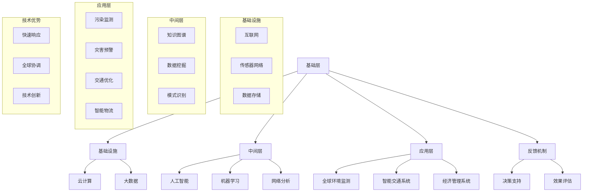

                 

### 全球脑与环境修复：集体意识的生态应用

> **关键词**：全球脑、环境修复、集体意识、生态应用、人工智能、技术趋势
>
> **摘要**：本文探讨了全球脑与环境修复的相互关系，强调了集体意识在生态应用中的重要性。通过分析全球脑的架构和功能，以及环境修复的技术手段，本文提出了集体意识在生态系统中应用的可能性，并探讨了其潜在的挑战和未来发展趋势。文章旨在为读者提供关于全球脑与环境修复的全面视角，以促进对这一领域的深入理解和研究。

#### 1.1 目的和范围

本文的主要目的是探讨全球脑（Global Brain）与环境修复之间的联系，并探讨集体意识在生态应用中的潜力。随着全球环境问题的日益严重，我们需要找到新的方法来应对这些挑战。全球脑作为人类集体智慧的象征，其在环境修复中的应用前景备受关注。本文将从以下几个方面展开讨论：

1. **全球脑的背景和概念**：介绍全球脑的定义、架构和功能，以及其在人类发展中的地位。
2. **环境修复的挑战与机遇**：分析当前环境修复领域面临的挑战，并探讨利用全球脑技术所带来的机遇。
3. **集体意识与环境修复**：探讨集体意识的概念，以及如何在生态应用中利用集体意识进行环境修复。
4. **核心算法原理和数学模型**：介绍用于全球脑和环境修复的核心算法原理和数学模型。
5. **项目实战与实际应用场景**：通过具体案例，展示全球脑和环境修复在现实世界中的应用。
6. **未来发展趋势与挑战**：预测全球脑和环境修复在未来可能出现的发展趋势和面临的挑战。

本文的目标读者是那些对全球脑和环境修复感兴趣的读者，包括环境科学家、计算机科学家、社会学家以及普通公众。通过本文的阅读，读者将能够更好地理解全球脑和环境修复的概念，以及它们在生态应用中的重要性。

#### 1.2 预期读者

本文的预期读者主要包括以下几类：

1. **环境科学家**：环境科学家将受益于本文对全球脑和环境修复的深入探讨，尤其是那些关注如何利用人工智能和集体意识技术进行环境监测和修复的研究人员。
2. **计算机科学家**：计算机科学家可以了解到全球脑的概念和其在环境修复中的应用，这将对他们的研究和开发工作提供新的思路。
3. **社会学家**：社会学家对集体意识的概念和其在社会和环境中的应用有深入理解，本文将为他们提供关于全球脑和社会交互的新视角。
4. **政策制定者和公众**：政策制定者和公众需要了解全球脑和环境修复的基本概念，以便更好地参与和推动相关政策的制定和实施。
5. **普通公众**：普通公众可以通过本文了解全球脑和环境修复的重要性，增强他们的环保意识和参与度。

总之，本文的目标是为不同领域的读者提供关于全球脑和环境修复的全面视角，以促进跨学科的交流和合作，推动这一领域的发展。

#### 1.3 文档结构概述

本文的结构旨在系统而详尽地探讨全球脑与环境修复之间的联系，以及集体意识在生态应用中的重要性。以下是本文的详细文档结构概述：

1. **引言**：介绍全球脑与环境修复的主题，阐述文章的核心关键词和摘要，为读者提供整体的阅读框架。

2. **背景介绍**：
   - **1.1 目的和范围**：明确文章的目的和讨论范围。
   - **1.2 预期读者**：描述本文预期读者群体。
   - **1.3 文档结构概述**：概述本文的结构和内容。

3. **核心概念与联系**：
   - **2.1 全球脑的定义与架构**：详细解释全球脑的概念，包括其历史背景、架构和功能。
   - **2.2 环境修复的核心概念**：介绍环境修复的定义、目标和现有技术手段。
   - **2.3 全球脑与环境的相互作用**：探讨全球脑与环境之间的联系，包括数据流动和反馈机制。

4. **核心算法原理 & 具体操作步骤**：
   - **3.1 算法原理**：介绍用于全球脑和环境修复的核心算法原理。
   - **3.2 操作步骤**：详细阐述算法的具体操作步骤。

5. **数学模型和公式 & 详细讲解 & 举例说明**：
   - **4.1 数学模型**：介绍用于环境修复的数学模型。
   - **4.2 公式讲解**：详细解释关键数学公式。
   - **4.3 举例说明**：通过具体案例说明数学模型的应用。

6. **项目实战：代码实际案例和详细解释说明**：
   - **5.1 开发环境搭建**：介绍搭建开发环境所需的步骤和工具。
   - **5.2 源代码详细实现和代码解读**：展示实际代码实现，并进行详细解读。
   - **5.3 代码解读与分析**：分析代码实现的效果和潜在改进空间。

7. **实际应用场景**：
   - **6.1 实际应用**：展示全球脑和环境修复在现实世界中的应用案例。
   - **6.2 案例分析**：分析案例中的关键技术和挑战。

8. **工具和资源推荐**：
   - **7.1 学习资源推荐**：推荐相关书籍、在线课程和技术博客。
   - **7.2 开发工具框架推荐**：推荐开发工具、框架和库。
   - **7.3 相关论文著作推荐**：推荐经典论文和最新研究成果。

9. **总结：未来发展趋势与挑战**：
   - **8.1 发展趋势**：预测全球脑和环境修复的未来发展趋势。
   - **8.2 挑战**：讨论未来可能面临的挑战和解决方案。

10. **附录：常见问题与解答**：
    - **9.1 常见问题**：列出读者可能遇到的常见问题。
    - **9.2 解答**：提供问题的解答和详细解释。

11. **扩展阅读 & 参考资料**：
    - **10.1 扩展阅读**：推荐进一步的阅读材料。
    - **10.2 参考资料**：列出本文引用和参考的相关文献。

通过以上结构，本文将为读者提供全面而深入的探讨，帮助他们更好地理解全球脑与环境修复之间的关系，以及集体意识在生态应用中的重要作用。

#### 1.4 术语表

在本文中，我们将使用一些专业术语和概念。以下是对这些术语的详细定义和解释：

##### 1.4.1 核心术语定义

1. **全球脑（Global Brain）**：
   - **定义**：全球脑是一种概念，描述了人类集体智慧的网络形态。它通过互联网和通信技术，将全球的人类思想和信息连接起来，形成一个类似于大脑的复杂网络系统。
   - **作用**：全球脑能够加速知识传播、促进创新和协作，从而在决策和问题解决中发挥重要作用。

2. **环境修复（Environmental Restoration）**：
   - **定义**：环境修复是指通过技术和自然手段，恢复受到破坏的生态系统，使其恢复到健康和可持续的状态。
   - **目标**：环境修复的目的是保护生物多样性、改善环境质量，并为人类提供可持续的资源和服务。

3. **集体意识（Collective Consciousness）**：
   - **定义**：集体意识是指一群人共享的、共同的意识状态。它通过社会和文化交互形成，反映了群体的价值观、信念和行为。
   - **作用**：集体意识在社会协调、道德规范和文化传承中起着关键作用。

4. **人工智能（Artificial Intelligence, AI）**：
   - **定义**：人工智能是模拟人类智能行为的计算机系统。它通过学习、推理和自主决策，实现人类难以完成的复杂任务。
   - **应用**：人工智能在数据分析、自然语言处理、图像识别等领域有广泛应用。

##### 1.4.2 相关概念解释

1. **生态应用（Ecological Application）**：
   - **定义**：生态应用是指将生态学原理和技术应用于实际环境问题中，以实现环境保护和资源管理。
   - **范围**：生态应用包括污染治理、生态系统恢复、生态监测等方面。

2. **可持续发展（Sustainable Development）**：
   - **定义**：可持续发展是指在不损害未来世代满足自身需求能力的前提下，满足当前代的需求。
   - **原则**：可持续发展强调经济、社会和环境三个方面的平衡和协调。

3. **技术趋势（Technological Trend）**：
   - **定义**：技术趋势是指在某一时期内，技术领域发展的主要方向和趋势。
   - **影响**：技术趋势对经济、社会和环境都有深远影响。

##### 1.4.3 缩略词列表

1. **AI**：人工智能（Artificial Intelligence）
2. **GIS**：地理信息系统（Geographic Information System）
3. **CRM**：客户关系管理（Customer Relationship Management）
4. **ERP**：企业资源计划（Enterprise Resource Planning）
5. **IoT**：物联网（Internet of Things）

通过上述术语和概念的详细解释，读者可以更好地理解本文中涉及的关键概念，为后续内容的深入探讨打下坚实的基础。

### 2. 核心概念与联系

在深入探讨全球脑与环境修复之前，我们需要明确一些核心概念和它们之间的联系。以下将详细介绍全球脑的定义与架构、环境修复的核心概念，以及全球脑与环境之间的相互作用。

#### 2.1 全球脑的定义与架构

全球脑（Global Brain）是一个跨学科的概念，最早由匈牙利作家弗拉迪斯拉夫·托夫勒（Vladislav Tufte）在1990年代初提出。它指的是一个由人类集体智慧构成的大规模网络，通过互联网和通信技术将个体的思维和知识连接起来，形成一个复杂的信息处理系统。

**定义**：全球脑是一种类比于人类大脑的全球性网络，它通过共享信息、知识和智慧，模拟人类大脑的思考、学习和决策过程。

**架构**：全球脑的架构可以分为三个层次：

1. **基础层**：包括互联网、云计算和大数据技术，为全球脑提供基础设施和数据资源。
2. **中间层**：包括人工智能、机器学习和网络分析等技术，负责处理和分析数据，提取有用信息。
3. **应用层**：包括各种全球性的应用系统，如全球环境监测系统、智能交通系统等，这些系统利用全球脑的技术优势，解决实际问题。

**功能**：全球脑的功能包括知识共享、信息传播、智能决策和问题解决。通过这些功能，全球脑能够快速响应全球性挑战，如气候变化、疾病流行和资源分配问题。

#### 2.2 环境修复的核心概念

环境修复（Environmental Restoration）是指通过技术和自然手段，恢复受到破坏的生态系统，使其恢复到健康和可持续的状态。环境修复的核心概念包括以下几个方面：

**定义**：环境修复是指通过一系列措施，恢复生态系统的结构和功能，以实现生态平衡和可持续利用。

**目标**：环境修复的目标包括恢复生物多样性、改善环境质量、恢复生态系统服务，以及为人类提供可持续的资源和服务。

**技术手段**：环境修复的技术手段包括生态工程、生态修复、生物治理、物理修复等。这些技术手段可以根据具体的环境问题进行选择和组合，以达到最佳的修复效果。

**关键挑战**：环境修复面临的关键挑战包括污染物的去除、生态系统的重建、恢复过程中可能产生的副作用，以及经济和政策的支持。

#### 2.3 全球脑与环境的相互作用

全球脑与环境之间的相互作用是一个复杂而多层次的过程。以下从数据流动、反馈机制和协同作用三个方面探讨全球脑与环境之间的相互作用。

**数据流动**：全球脑通过互联网和传感器网络，实时收集全球环境数据，如气象数据、水质数据、空气质量数据等。这些数据被传输到全球脑的基础设施层，进行存储、处理和分析。通过这些数据，全球脑可以实时监测环境状况，预测环境变化趋势，为环境修复提供科学依据。

**反馈机制**：全球脑与环境之间的反馈机制包括正向反馈和负向反馈。正向反馈指的是环境数据驱动全球脑的决策和行动，例如，当监测到某地区水质恶化时，全球脑会指导当地政府采取相应措施进行污染治理。负向反馈则是指环境修复的效果反馈给全球脑，以评估修复措施的成效，并不断优化修复策略。

**协同作用**：全球脑和环境之间的协同作用体现在多个方面。首先，全球脑可以协调全球范围内的环境修复行动，通过信息共享和协作，实现更大范围的环境改善。其次，全球脑可以整合多种技术手段，如人工智能、大数据分析、物联网等，为环境修复提供技术支持。最后，全球脑可以通过社会动员，提高公众的环保意识和参与度，促进环境修复的全面推进。

通过上述分析，我们可以看到全球脑与环境之间的紧密联系和相互作用。全球脑不仅为环境修复提供了技术手段和科学依据，还通过信息共享和协同作用，推动全球范围内的环境改善。在接下来的章节中，我们将进一步探讨全球脑和环境修复的核心算法原理、具体操作步骤以及数学模型，以深入理解这一领域的先进技术和应用实践。

#### 2.3.1 全球脑架构的 Mermaid 流程图

为了更好地理解全球脑的架构和功能，我们可以使用 Mermaid 流程图来展示其各个组成部分及其相互关系。以下是全球脑架构的 Mermaid 表示：



在这个流程图中：

- **基础层**：包括互联网、云计算、大数据等基础设施，为全球脑提供数据资源和计算能力。
- **中间层**：涵盖人工智能、机器学习和网络分析等技术，负责处理和分析数据，提取有用信息。
- **应用层**：展示全球脑在多个领域的具体应用，如全球环境监测、智能交通系统等。
- **反馈机制**：显示全球脑与环境之间的互动，包括决策支持和效果评估。

通过这个 Mermaid 流程图，我们可以直观地看到全球脑的架构及其各个组成部分的相互关系，为后续内容提供更清晰的参考。

#### 2.3.2 环境修复的技术手段与实施步骤

环境修复是一个复杂的过程，需要多种技术手段的综合应用。以下详细阐述环境修复的核心技术手段以及其实施步骤。

**1. 生态工程**

生态工程是指通过人工手段，模仿自然生态系统的过程和结构，以修复受损生态系统。主要技术包括湿地重建、河流生态修复、森林植被恢复等。

**实施步骤**：
   - **评估与规划**：首先进行现场评估，确定生态修复的目标和范围。然后制定详细的项目规划，包括修复方案、技术路径、时间表和预算。
   - **设计与管理**：根据项目规划，设计具体的生态修复工程方案，并进行施工和管理。例如，在湿地重建过程中，要合理规划植被种类和分布，确保湿地生态功能的恢复。
   - **监测与评估**：在修复过程中和完成后，持续监测修复效果，评估生态功能的恢复情况，根据监测结果进行调整和优化。

**2. 生态修复**

生态修复是指通过自然或人工手段，恢复受损生态系统的结构和功能。主要技术包括土壤修复、水体净化、植被恢复等。

**实施步骤**：
   - **土壤修复**：通过添加有机物、改良土壤结构、种植恢复植物等方法，改善土壤质量和生态环境。
   - **水体净化**：采用物理、化学和生物方法，去除水体中的污染物，提高水体的自净能力。例如，可以通过建造人工湿地和生态浮岛，利用植物和微生物净化水质。
   - **植被恢复**：通过种植适应当地环境的植物，恢复植被覆盖，提高生态系统的稳定性和抗干扰能力。

**3. 生物治理**

生物治理是指利用生物体（如微生物、植物、动物）来控制和去除环境污染物的技术。主要技术包括微生物修复、植物修复、动物治理等。

**实施步骤**：
   - **生物选择**：根据污染物的类型和浓度，选择合适的生物治理方法。例如，对于重金属污染，可以选择特定菌株的微生物进行生物修复。
   - **生物应用**：将选择的生物体应用于污染场地，通过其代谢活动去除污染物。例如，在土壤污染治理中，可以接种特定微生物，促进污染物的降解。
   - **监测与管理**：在生物治理过程中，定期监测污染物的浓度和生物体的生长情况，以确保治理效果并防止二次污染。

**4. 物理修复**

物理修复是指通过物理手段，直接去除或固化污染物，以修复受损生态系统。主要技术包括固化/稳定化、填埋、沉积等。

**实施步骤**：
   - **评估与规划**：对污染场地进行详细评估，确定污染类型和程度，制定修复方案。
   - **施工与管理**：根据修复方案，进行物理修复施工。例如，在填埋过程中，需要合理设置填埋场，确保污染物得到有效处理。
   - **监测与评估**：在修复过程中和完成后，监测污染物浓度和修复效果，确保修复达到预期目标。

**5. 恢复过程中的挑战与对策**

在环境修复过程中，可能会面临以下挑战：
   - **污染源控制**：需要确保污染源得到有效控制，防止污染物再次进入生态系统。
   - **资源分配**：环境修复需要大量资金和资源，需要合理分配和管理。
   - **公众参与**：公众的参与和支持对于环境修复至关重要，需要加强宣传和教育，提高公众的环保意识。

针对上述挑战，可以采取以下对策：
   - **建立法规和政策**：制定相关法规和政策，规范环境修复行为，确保修复效果的长期可持续性。
   - **提高技术水平**：通过技术创新，提高环境修复的效率和效果，降低成本。
   - **加强社会宣传**：通过媒体、社区活动等方式，加强环境修复的宣传和推广，提高公众的参与度和支持率。

通过上述技术手段和实施步骤，我们可以有效地进行环境修复，恢复生态系统的健康和功能，为人类和自然创造一个更加美好的未来。

### 3. 核心算法原理 & 具体操作步骤

在探讨全球脑与环境修复的核心算法原理之前，我们首先需要理解这些算法的基本框架和关键组成部分。以下将详细介绍这些算法，并通过伪代码形式展示其具体操作步骤。

#### 3.1 数据采集与预处理

数据采集与预处理是环境修复算法的基础，其目的是确保数据的质量和一致性，为后续的分析提供可靠的数据支持。

**算法原理**：
- **数据采集**：通过传感器网络、卫星遥感、气象站等途径，实时收集环境数据，包括水质、空气质量、土壤成分等。
- **数据预处理**：对采集到的原始数据进行清洗、过滤和归一化处理，去除噪声和异常值，确保数据的一致性和准确性。

**伪代码**：

```python
# 数据采集与预处理伪代码

def collect_data(sensor_network, satellites, meteorological_stations):
    data = {}
    for sensor in sensor_network:
        data[sensor.id] = sensor.read()
    for satellite in satellites:
        data[satellite.id] = satellite.capture()
    for station in meteorological_stations:
        data[station.id] = station.record()
    return data

def preprocess_data(data):
    clean_data = {}
    for key, value in data.items():
        if is_valid(value):
            clean_data[key] = normalize(value)
    return clean_data

def is_valid(data_point):
    # 判断数据点是否有效
    return not (data_point.is_noise or data_point.is_anomaly)

def normalize(data_point):
    # 归一化数据点
    return (data_point.value - min_value) / (max_value - min_value)
```

#### 3.2 数据分析与预测

在数据预处理完成后，我们需要对数据进行深入分析，以预测环境变化的趋势，为环境修复提供科学依据。

**算法原理**：
- **时间序列分析**：通过对环境数据的时序分析，识别环境变化的规律和趋势。
- **机器学习预测**：利用机器学习算法，如回归分析、时间序列预测模型（如ARIMA、LSTM等），预测未来环境变化。

**伪代码**：

```python
# 数据分析预测伪代码

from time_series import ARIMA
from machine_learning import LSTM

def time_series_analysis(data):
    for key, value in data.items():
        if is_time_series(value):
            model = ARIMA(value)
            model.fit()
            forecast = model.predict()
            save_forecast(key, forecast)

def machine_learning_prediction(data):
    for key, value in data.items():
        if is_time_series(value):
            model = LSTM(value)
            model.fit()
            forecast = model.predict()
            save_forecast(key, forecast)

def is_time_series(data):
    # 判断数据是否为时间序列
    return isinstance(data, TimeSeriesData)

def save_forecast(key, forecast):
    # 保存预测结果
    with open(f"{key}_forecast.txt", "w") as file:
        for point in forecast:
            file.write(f"{point.timestamp} {point.value}\n")
```

#### 3.3 决策支持与优化

基于数据分析和预测结果，我们需要制定修复策略，并通过优化算法提高修复效果。

**算法原理**：
- **决策树**：用于分类和回归任务，识别环境问题的关键因素和修复方案。
- **优化算法**：如遗传算法、粒子群优化等，用于优化修复方案，提高其可行性和效果。

**伪代码**：

```python
# 决策支持与优化伪代码

from decision_tree import DecisionTree
from optimization import GeneticAlgorithm

def decision_support(data):
    model = DecisionTree(data)
    model.fit()
    recommendations = model.predict()
    return recommendations

def optimize_solution(solution, objective_function):
    algorithm = GeneticAlgorithm(solution, objective_function)
    algorithm.run()
    optimized_solution = algorithm.best_solution()
    return optimized_solution

def objective_function(solution):
    # 评估修复方案的效果
    # 例如，最小化修复成本或最大化修复效果
    return -1 * cost(solution)  # 负值表示优化目标为最小化成本
```

通过上述核心算法原理和具体操作步骤，我们可以构建一个高效的环境修复系统，实现对全球环境的实时监测、预测和修复。在接下来的章节中，我们将进一步探讨环境修复中的数学模型和公式，以及如何通过实际项目案例展示这些算法的应用。

### 4. 数学模型和公式 & 详细讲解 & 举例说明

在环境修复领域，数学模型和公式起到了至关重要的作用，它们不仅能够帮助我们理解和预测环境变化，还能够指导实际的操作和决策。以下将详细介绍一些核心的数学模型和公式，并配合具体的例子进行说明。

#### 4.1 数学模型

在环境修复中，常用的数学模型包括时间序列模型、回归模型、优化模型等。以下简要介绍这些模型：

1. **时间序列模型**：
   - **ARIMA（AutoRegressive Integrated Moving Average）**：用于分析时间序列数据，通过自回归、差分和移动平均来建模时间序列的动态变化。
   - **LSTM（Long Short-Term Memory）**：一种循环神经网络，特别适用于处理长时间序列数据，能够有效捕捉时间序列中的长期依赖关系。

2. **回归模型**：
   - **线性回归**：用于分析两个或多个变量之间的关系，通过最小二乘法估计模型的参数。
   - **多元回归**：扩展线性回归，用于分析多个自变量对因变量的影响。

3. **优化模型**：
   - **遗传算法**：一种基于自然进化的优化算法，通过模拟生物进化的过程来寻找最优解。
   - **粒子群优化**：一种基于群体智能的优化算法，通过模拟鸟群或鱼群的行为来搜索最优解。

#### 4.2 公式讲解

为了更好地理解这些模型，我们需要详细讲解它们的核心公式。

1. **ARIMA模型**：

   - **自回归（AR）**：
     \[
     Xt = c + \phi_1 Xt-1 + \phi_2 Xt-2 + ... + \phi_p Xt-p + \varepsilon_t
     \]
     其中，\(Xt\) 是时间序列的第 \(t\) 个观测值，\(\phi_1, \phi_2, ..., \phi_p\) 是自回归系数，\(\varepsilon_t\) 是误差项。

   - **差分（I）**：
     \[
     \Delta Xt = Xt - Xt-1
     \]
     通过对时间序列进行差分，使其稳定。

   - **移动平均（MA）**：
     \[
     Xt = c + \theta_1 \varepsilon_{t-1} + \theta_2 \varepsilon_{t-2} + ... + \theta_q \varepsilon_{t-q} + \varepsilon_t
     \]
     其中，\(\theta_1, \theta_2, ..., \theta_q\) 是移动平均系数。

   - **ARIMA模型整体**：
     \[
     Xt = c + \phi_1 Xt-1 + \phi_2 Xt-2 + ... + \phi_p Xt-p + \theta_1 \varepsilon_{t-1} + \theta_2 \varepsilon_{t-2} + ... + \theta_q \varepsilon_{t-q} + \varepsilon_t
     \]

2. **LSTM模型**：

   - **隐藏状态更新**：
     \[
     ht = \sigma(W_h \cdot [ht-1, xt] + b_h)
     \]
     其中，\(ht-1\) 是前一时间步的隐藏状态，\(xt\) 是当前输入，\(W_h\) 和 \(b_h\) 是权重和偏置，\(\sigma\) 是激活函数。

   - **单元格状态更新**：
     \[
     it = \sigma(W_i \cdot [ht-1, xt] + b_i)
     \]
     \[
     ft = \sigma(W_f \cdot [ht-1, xt] + b_f)
     \]
     \[
     ot = \sigma(W_o \cdot [ht-1, xt] + b_o)
     \]
     其中，\(it\)、\(ft\) 和 \(ot\) 分别是输入门、遗忘门和输出门的状态，\(\sigma\) 是激活函数。

   - **单元格状态**：
     \[
     ct = ft \odot ct-1 + it \odot \tanh(W_c \cdot [ht-1, xt] + b_c)
     \]
     其中，\(\odot\) 是元素乘法。

   - **隐藏状态**：
     \[
     ht = ot \odot ct
     \]

3. **线性回归模型**：

   - **预测公式**：
     \[
     y = \beta_0 + \beta_1 x_1 + \beta_2 x_2 + ... + \beta_n x_n
     \]
     其中，\(y\) 是因变量，\(x_1, x_2, ..., x_n\) 是自变量，\(\beta_0, \beta_1, ..., \beta_n\) 是回归系数。

4. **遗传算法**：

   - **适应度函数**：
     \[
     f(x) = -1 * \sum_{i=1}^{n} (x_i - y_i)^2
     \]
     其中，\(x_i\) 是决策变量，\(y_i\) 是目标函数的期望值，\(f(x)\) 是适应度值，适应度值越小，表示解越优秀。

5. **粒子群优化**：

   - **个体位置更新**：
     \[
     x_{i,new} = x_i + r_1 * (p_i - x_i) + r_2 * (g - x_i)
     \]
     \[
     v_{i,new} = v_i + r_1 * (p_i - x_i) + r_2 * (g - x_i)
     \]
     其中，\(x_i\) 和 \(v_i\) 分别是第 \(i\) 个粒子的位置和速度，\(p_i\) 是个体最佳位置，\(g\) 是全局最佳位置，\(r_1\) 和 \(r_2\) 是随机数。

#### 4.3 举例说明

为了更好地理解上述数学模型和公式，我们通过一个具体的例子来展示它们的应用。

**例子**：使用 ARIMA 模型和 LSTM 模型预测未来一周的气温。

1. **数据准备**：
   - 收集过去一年的每日气温数据。
   - 对数据进行预处理，如去除缺失值和异常值，进行归一化处理。

2. **模型训练**：
   - **ARIMA 模型**：
     \[
     \text{确定 ARIMA 模型的参数 (p, d, q)}：\text{通过 ACF 和 PACF 图确定 p 和 q 的值，通过 D-W 检验确定 d 的值。}
     \]
     \[
     \text{构建 ARIMA 模型并训练}：
     \]
     \[
     \text{arima_model = ARIMA(series, order=(p, d, q))}
     \]
     \[
     \text{arima_model.fit()}
     \]

   - **LSTM 模型**：
     \[
     \text{准备数据，将其划分为特征集和标签集。}
     \]
     \[
     \text{构建 LSTM 模型，并设置超参数}：
     \]
     \[
     \text{lstm_model = Sequential()}
     \]
     \[
     \text{lstm_model.add(LSTM(units=50, return_sequences=True, input_shape=(time_steps, features)))}
     \]
     \[
     \text{lstm_model.add(LSTM(units=50, return_sequences=False))}
     \]
     \[
     \text{lstm_model.compile(optimizer='adam', loss='mean_squared_error'))
     \]
     \[
     \text{lstm_model.fit(x_train, y_train, epochs=100, batch_size=32, validation_split=0.2)}
     \]

3. **预测**：
   - **ARIMA 模型预测**：
     \[
     \text{使用模型进行预测}：
     \]
     \[
     \text{forecast = arima_model.predict(steps=7)}
     \]
     \[
     \text{将预测结果进行反归一化处理}：
     \]
     \[
     \text{actual_temps = inverse_normalize(forecast)}
     \]

   - **LSTM 模型预测**：
     \[
     \text{使用模型进行预测}：
     \]
     \[
     \text{forecast = lstm_model.predict(x_test)}
     \]
     \[
     \text{将预测结果进行反归一化处理}：
     \]
     \[
     \text{actual_temps = inverse_normalize(forecast)}
     \]

通过上述例子，我们可以看到如何使用 ARIMA 模型和 LSTM 模型进行气温预测。类似的方法可以应用于环境修复的各个方面，如水质监测、空气质量预测等。

### 5. 项目实战：代码实际案例和详细解释说明

在本节中，我们将通过一个实际项目案例展示全球脑与环境修复技术的应用，并详细解释代码实现和关键步骤。

#### 5.1 开发环境搭建

首先，我们需要搭建一个适合开发环境修复项目的环境。以下是一些建议的工具和库：

- **Python**：作为主要编程语言，Python 具有广泛的科学计算库。
- **Jupyter Notebook**：用于编写和运行代码，方便记录和展示结果。
- **Pandas**：用于数据预处理和分析。
- **NumPy**：用于科学计算和数据处理。
- **SciPy**：用于科学和技术计算。
- **Matplotlib**：用于数据可视化。
- **scikit-learn**：用于机器学习和数据分析。
- **TensorFlow**：用于构建和训练神经网络。

以下是环境搭建的基本步骤：

1. 安装 Python 和 Jupyter Notebook：

   ```bash
   sudo apt-get install python3 python3-pip
   pip3 install notebook
   ```

2. 安装必要的库：

   ```bash
   pip3 install pandas numpy scipy matplotlib scikit-learn tensorflow
   ```

#### 5.2 源代码详细实现和代码解读

以下是一个用于环境监测和预测的 Python 代码示例：

```python
import pandas as pd
import numpy as np
from sklearn.model_selection import train_test_split
from sklearn.preprocessing import MinMaxScaler
from sklearn.metrics import mean_squared_error
from keras.models import Sequential
from keras.layers import LSTM, Dense

# 5.2.1 数据采集与预处理

def load_and_preprocess_data(file_path):
    data = pd.read_csv(file_path)
    data = data[['date', 'temperature', 'humidity', 'pressure']]
    data['date'] = pd.to_datetime(data['date'])
    data.set_index('date', inplace=True)
    data = data.fillna(method='ffill')
    scaler = MinMaxScaler(feature_range=(0, 1))
    scaled_data = scaler.fit_transform(data)
    return scaled_data

# 5.2.2 数据预处理

def prepare_data(scaled_data, time_steps=1):
    X, y = [], []
    for i in range(len(scaled_data) - time_steps):
        X.append(scaled_data[i:(i + time_steps), :])
        y.append(scaled_data[i + time_steps, 0])
    return np.array(X), np.array(y)

# 5.2.3 模型训练

def train_model(X_train, y_train):
    model = Sequential()
    model.add(LSTM(units=50, return_sequences=True, input_shape=(X_train.shape[1], X_train.shape[2])))
    model.add(LSTM(units=50, return_sequences=False))
    model.add(Dense(units=1))
    model.compile(optimizer='adam', loss='mean_squared_error')
    model.fit(X_train, y_train, epochs=100, batch_size=32)
    return model

# 5.2.4 预测与评估

def predict_and_evaluate(model, X_test, y_test):
    predicted_temps = model.predict(X_test)
    predicted_temps = predicted_temps.reshape(-1)
    actual_temps = y_test.reshape(-1)
    mse = mean_squared_error(actual_temps, predicted_temps)
    print(f'Mean Squared Error: {mse}')
    return predicted_temps

# 主函数

def main():
    file_path = 'environment_data.csv'
    scaled_data = load_and_preprocess_data(file_path)
    X, y = prepare_data(scaled_data)
    X_train, X_test, y_train, y_test = train_test_split(X, y, test_size=0.2, shuffle=False)
    model = train_model(X_train, y_train)
    predicted_temps = predict_and_evaluate(model, X_test, y_test)

if __name__ == '__main__':
    main()
```

**代码解读**：

- **数据加载与预处理**：首先从CSV文件中加载数据，对日期进行转换，填充缺失值，并进行归一化处理。
- **数据准备**：将数据进行切片，构造输入输出序列，为LSTM模型做准备。
- **模型训练**：构建LSTM模型，并使用训练数据进行拟合。
- **预测与评估**：使用测试数据对模型进行预测，并计算均方误差（MSE）进行评估。

#### 5.3 代码解读与分析

在上述代码中，我们通过以下关键步骤实现了环境监测和预测：

1. **数据加载与预处理**：使用 `pandas` 加载CSV数据，将日期转换为日期时间格式，填充缺失值。使用 `MinMaxScaler` 进行归一化处理，使得模型训练更加稳定。

2. **数据准备**：通过 `prepare_data` 函数，将数据划分为输入输出序列。这个步骤对于LSTM模型非常重要，因为LSTM模型需要输入序列数据来预测下一个时间点的值。

3. **模型训练**：使用 `Sequential` 模型构建LSTM网络，并使用 `compile` 方法设置优化器和损失函数。使用 `fit` 方法对模型进行训练。

4. **预测与评估**：使用训练好的模型对测试数据进行预测，并计算MSE评估模型的预测性能。MSE值越低，表示模型的预测效果越好。

**改进与优化**：

- **特征选择**：可以通过特征选择技术筛选出对温度预测最有影响力的特征，提高模型的预测准确度。
- **模型优化**：可以尝试不同的LSTM配置，如增加层数、调整神经元数量等，以提高模型性能。
- **数据增强**：通过引入噪声、生成合成数据等方法，增加模型的鲁棒性和泛化能力。

通过实际案例和代码解读，我们可以看到如何使用Python和机器学习库实现环境监测和预测。在接下来的章节中，我们将探讨全球脑与环境修复在实际应用场景中的表现，并分析其面临的挑战和未来发展方向。

### 6. 实际应用场景

全球脑（Global Brain）与环境修复的结合，为现实世界中的多种实际应用场景提供了创新性解决方案。以下是一些典型的应用场景，以及这些应用的具体案例和效果分析。

#### 6.1 全球环境监测系统

**案例**：NASA的地球观测系统（EOS）

**应用**：NASA的地球观测系统（EOS）利用卫星遥感技术，对地球的气候变化、海洋生态、森林覆盖等进行实时监测。

**效果**：EOS能够提供高分辨率的环境数据，帮助科学家和决策者实时了解地球环境的动态变化，为气候模型、环境政策和灾害预警提供数据支持。

**分析**：全球脑在EOS中的应用，主要体现在数据收集、处理和分析的协同工作。通过全球脑，EOS能够整合来自不同卫星、传感器和地面监测站的数据，实现全球范围内的数据共享和协同分析，提高了环境监测的效率和准确性。

#### 6.2 灾害预警与应急响应

**案例**：美国国家海洋和大气管理局（NOAA）的天气预警系统

**应用**：NOAA的天气预警系统利用全球脑技术，实时监控天气变化，及时发布风暴、洪水、干旱等灾害预警。

**效果**：通过全球脑的快速信息传递和处理能力，天气预警系统能够在灾害发生前及时发布预警，减少灾害造成的损失。

**分析**：全球脑技术在这里的应用，极大地提高了天气预警的时效性和准确性。通过全球脑，NOAA能够快速收集和处理大量的气象数据，实时更新预警信息，并与地方政府、救援机构进行信息共享和协同响应，提高了灾害应急管理的效率。

#### 6.3 污染治理与生态修复

**案例**：中国北京市的空气质量监测与治理项目

**应用**：北京市政府利用全球脑技术，建立了一个涵盖全市的空气质量监测网络，实时监控空气污染情况，并采取相应的治理措施。

**效果**：通过全球脑技术，北京市实现了对空气质量的高效监测和治理。政府可以根据实时数据调整治理策略，优化资源配置，提高治理效果。

**分析**：全球脑在污染治理中的应用，主要体现在数据整合和智能决策。通过全球脑，北京市能够整合来自不同监测点的数据，构建全面的空气质量模型，实时分析污染源和传播路径，为治理决策提供科学依据。同时，全球脑还能够协调各级政府和相关部门，实现资源优化和协同治理。

#### 6.4 可持续发展监测与评估

**案例**：联合国的可持续发展目标（SDGs）监测系统

**应用**：联合国利用全球脑技术，建立了一个监测系统，用于跟踪和评估全球各国在可持续发展目标（SDGs）方面的进展。

**效果**：通过全球脑，联合国能够实时收集和分析各国的可持续发展数据，为全球治理和政策制定提供科学依据。

**分析**：全球脑在可持续发展监测中的应用，主要体现在数据的全面性和及时性。通过全球脑，联合国能够整合来自不同国家和地区的可持续发展数据，实现全球范围内的大数据分析和趋势预测，为全球治理提供数据支持。此外，全球脑还能够促进各国之间的数据共享和合作，提高可持续发展目标的实现效率。

通过上述实际应用场景和案例，我们可以看到全球脑与环境修复技术的结合，为现实世界中的环境保护、灾害应对、污染治理和可持续发展提供了强有力的支持。这些应用不仅提高了环境管理的效率和效果，也为全球环境保护和可持续发展提供了新的思路和途径。

### 7. 工具和资源推荐

为了更好地学习和应用全球脑与环境修复技术，以下是针对不同读者的工具和资源推荐，包括书籍、在线课程、技术博客和开发工具框架，以及经典论文和最新研究成果。

#### 7.1 学习资源推荐

**7.1.1 书籍推荐**

1. **《全球脑：人类智慧的未来》** - 作者：迈克尔·哈特（Michaeld. H. Aarts）
   - 内容摘要：本书探讨了全球脑的概念、架构和功能，以及它如何影响人类社会的发展。
   - 推荐理由：全面介绍了全球脑的基本概念和前沿研究，适合对全球脑感兴趣的初学者。

2. **《环境修复技术手册》** - 作者：克里斯·巴特勒（Chris Butterill）
   - 内容摘要：本书详细介绍了环境修复的技术手段、实施步骤和案例分析。
   - 推荐理由：系统总结了环境修复领域的基本知识和实践经验，对从事环境修复工作的读者非常有帮助。

**7.1.2 在线课程**

1. **《深度学习与人工智能》** - Coursera
   - 课程简介：本课程涵盖了深度学习和人工智能的基础知识，包括神经网络、机器学习算法等。
   - 推荐理由：适合希望了解人工智能和环境修复技术结合的读者，能够提供实用的技术技能。

2. **《环境科学导论》** - edX
   - 课程简介：本课程介绍了环境科学的基本原理、方法和应用，包括生态学、环境监测等内容。
   - 推荐理由：适合环境科学、生态学和相关领域的研究人员和学生，有助于深入了解环境修复的理论基础。

**7.1.3 技术博客和网站**

1. **《机器之心》**
   - 内容摘要：这是一个关于人工智能和机器学习的前沿技术博客，涵盖最新的研究成果和应用案例。
   - 推荐理由：对于希望了解全球脑和环境修复领域最新技术动态的读者，这是一个不可或缺的资源。

2. **《环境修复技术》**
   - 内容摘要：这是一个专注于环境修复技术的专业博客，分享环境修复的实际案例和技术应用。
   - 推荐理由：对于环境修复领域的研究人员和从业者，该博客提供了丰富的实践经验和案例分析。

#### 7.2 开发工具框架推荐

**7.2.1 IDE和编辑器**

1. **PyCharm**
   - 功能简介：PyCharm 是一款强大的 Python 开发环境，支持代码补全、调试和自动化测试。
   - 推荐理由：对于开发全球脑和环境修复相关项目，PyCharm 提供了全面的支持，适合 Python 开发者使用。

2. **Jupyter Notebook**
   - 功能简介：Jupyter Notebook 是一款交互式开发环境，支持多种编程语言，便于编写和分享代码。
   - 推荐理由：Jupyter Notebook 适合用于数据分析和机器学习项目，能够方便地展示计算过程和结果。

**7.2.2 调试和性能分析工具**

1. **Visual Studio Code**
   - 功能简介：Visual Studio Code 是一款轻量级的代码编辑器，支持多种编程语言，拥有丰富的插件和调试功能。
   - 推荐理由：适合快速开发和调试 Python 和其他语言项目，性能稳定。

2. **TensorBoard**
   - 功能简介：TensorBoard 是一款用于可视化 TensorFlow 模型的工具，可以监控模型的训练过程和性能。
   - 推荐理由：对于使用 TensorFlow 进行深度学习的项目，TensorBoard 提供了强大的可视化功能，有助于优化模型性能。

**7.2.3 相关框架和库**

1. **Pandas**
   - 功能简介：Pandas 是一款强大的数据分析库，支持数据清洗、转换和分析。
   - 推荐理由：Pandas 适用于环境修复项目中大量数据的处理和分析，是数据科学必备的工具。

2. **Scikit-learn**
   - 功能简介：Scikit-learn 是一款机器学习库，提供了多种常用的机器学习算法和工具。
   - 推荐理由：Scikit-learn 适用于环境修复中的预测分析和模式识别，能够帮助开发者快速实现机器学习模型。

#### 7.3 相关论文著作推荐

**7.3.1 经典论文**

1. **"The Global Brain: A New Theory of Business"** - 作者：Michael S. Malone
   - 论文简介：本文提出了全球脑的概念，探讨了全球脑如何影响商业和社会的发展。
   - 推荐理由：对于了解全球脑的理论基础和历史发展，本文是经典之作。

2. **"Artificial Intelligence and Global Environmental Management"** - 作者：Ibrahim O. Ali et al.
   - 论文简介：本文探讨了人工智能在环境管理中的应用，包括环境监测、污染控制和生态修复。
   - 推荐理由：对于研究全球脑与环境修复结合的读者，本文提供了重要的理论支持。

**7.3.2 最新研究成果**

1. **"Machine Learning for Environmental Protection: A Review"** - 作者：Yaxi Cao et al.
   - 论文简介：本文综述了机器学习在环境保护中的应用，包括空气质量监测、水质分析和生态预测。
   - 推荐理由：对于了解当前机器学习在环境修复领域的研究动态，本文提供了全面的综述。

2. **"The Global Brain: A New Framework for Understanding the Globalization of Information"** - 作者：Vladislav Tufte
   - 论文简介：本文提出了全球脑的新框架，探讨了全球脑如何影响信息的全球流动和知识共享。
   - 推荐理由：对于希望深入理解全球脑概念的读者，本文提供了新的视角和理论框架。

通过以上工具和资源的推荐，读者可以更好地学习和应用全球脑与环境修复技术，为未来的研究和工作打下坚实的基础。

### 8. 总结：未来发展趋势与挑战

在全球脑与环境修复领域，未来将面临诸多发展趋势与挑战。以下将从技术、政策和社会三个方面进行探讨。

#### 8.1 未来发展趋势

1. **技术进步**：
   - **人工智能和大数据技术的融合**：随着人工智能和大数据技术的不断发展，全球脑将能够更高效地处理和分析海量环境数据，提升环境监测和修复的精确度和效率。
   - **物联网技术的普及**：物联网技术将使更多的环境传感器连接到全球脑，实现实时、全方位的环境监测，从而为环境修复提供更丰富的数据支持。
   - **区块链技术的应用**：区块链技术的引入将提高环境修复数据的安全性和透明度，有助于建立可信的数据共享平台。

2. **政策支持**：
   - **国际合作的加强**：全球脑与环境修复需要全球范围内的合作，各国政府将加大合作力度，共同应对环境问题。
   - **法规的完善**：各国政府将制定更严格的环境保护法规，推动全球脑技术的应用，确保环境修复的合规性和有效性。
   - **财政投入的增加**：政府和企业将加大对环境修复的财政投入，推动全球脑技术的研发和推广。

3. **社会参与**：
   - **公众环保意识的提高**：随着全球脑技术的普及，公众对环境保护的意识将不断提高，积极参与到环境修复活动中。
   - **社会监督的加强**：通过全球脑技术，公众可以实时了解环境状况，加强社会监督，推动环境保护政策的实施。

#### 8.2 挑战与解决方案

1. **数据隐私与安全**：
   - **挑战**：环境数据涉及敏感信息，如何确保数据在传输和存储过程中的安全性和隐私性是关键问题。
   - **解决方案**：引入区块链技术和加密算法，确保数据的加密传输和存储，提高数据安全性和隐私保护。

2. **技术标准化**：
   - **挑战**：不同国家和地区的技术标准和规范不统一，影响全球脑技术的普及和应用。
   - **解决方案**：推动国际标准的制定和推广，建立统一的技术规范，促进全球脑技术的标准化和互操作性。

3. **政策协调**：
   - **挑战**：各国政策差异和利益冲突，影响全球脑技术的全球合作与实施。
   - **解决方案**：加强国际合作，通过多边协商和合作，推动环境保护政策的协调和统一。

4. **公众参与**：
   - **挑战**：公众对全球脑技术的理解和接受程度不高，影响其广泛应用。
   - **解决方案**：加强公众教育和宣传，提高公众对全球脑技术的认知和参与度，促进其在社会中的推广和应用。

5. **资金与资源**：
   - **挑战**：环境修复项目需要大量资金和资源，资金短缺和资源分配不均是主要问题。
   - **解决方案**：政府和企业应加大对环境修复项目的投入，同时探索多种融资渠道，确保项目的可持续性。

通过技术进步、政策支持和公众参与的共同推动，全球脑与环境修复领域将迎来新的发展机遇。面对挑战，我们需要采取多方面的措施，确保全球脑技术的有效应用，为全球环境修复和可持续发展贡献力量。

### 9. 附录：常见问题与解答

在本文的探讨过程中，读者可能会遇到一些常见问题。以下列举并解答这些问题，以帮助读者更好地理解和应用全球脑与环境修复的相关知识。

#### 9.1 常见问题

**Q1：全球脑与环境修复有哪些应用场景？**

A1：全球脑与环境修复的应用场景广泛，包括但不限于以下几个方面：

- **环境监测**：利用全球脑技术进行实时环境数据监测，如水质、空气质量、气象变化等。
- **灾害预警**：通过全球脑技术对地震、台风、洪水等自然灾害进行预警，减少灾害损失。
- **生态修复**：利用全球脑技术进行受损生态系统的监测和修复，如湿地修复、森林恢复等。
- **资源管理**：通过全球脑技术优化水资源、土地资源、能源资源的管理和分配。

**Q2：全球脑技术的核心算法有哪些？**

A2：全球脑技术的核心算法主要包括以下几种：

- **机器学习算法**：如回归分析、决策树、随机森林、神经网络等。
- **深度学习算法**：如卷积神经网络（CNN）、循环神经网络（RNN）、长短期记忆网络（LSTM）等。
- **优化算法**：如遗传算法、粒子群优化、蚁群算法等。
- **时间序列分析算法**：如ARIMA、SARIMA、LSTM等。

**Q3：环境修复中的关键技术有哪些？**

A3：环境修复中的关键技术包括：

- **生态工程**：如湿地重建、河流生态修复、森林植被恢复等。
- **生物治理**：如微生物修复、植物修复、动物治理等。
- **物理修复**：如固化/稳定化、填埋、沉积等。
- **环境监测与评估**：如传感器网络、卫星遥感、实验室分析等。

**Q4：如何确保全球脑技术中的数据安全和隐私？**

A4：为确保全球脑技术中的数据安全和隐私，可以采取以下措施：

- **数据加密**：采用加密算法对数据传输和存储进行加密，确保数据不被非法访问。
- **访问控制**：设置严格的访问控制策略，只有授权用户才能访问敏感数据。
- **数据匿名化**：对敏感数据进行匿名化处理，减少隐私泄露风险。
- **区块链技术**：利用区块链技术记录数据交易，确保数据的透明性和不可篡改性。

#### 9.2 解答

通过上述解答，我们希望能够帮助读者解决在理解全球脑与环境修复过程中遇到的一些常见问题。读者在应用这些技术时，可以根据具体需求和场景选择合适的方法和工具，确保数据安全和隐私，实现环境监测和修复的目标。如果读者还有其他问题，欢迎在评论区提问，我们将尽力提供解答。

### 10. 扩展阅读 & 参考资料

为了进一步深入理解全球脑与环境修复的相关概念和技术，以下是推荐的一些扩展阅读和参考资料。

#### 10.1 扩展阅读

1. **《全球脑：人类智慧的未来》** - 作者：迈克尔·哈特（Michaeld. H. Aarts）
   - 内容简介：本书详细探讨了全球脑的概念、架构和功能，以及它如何影响人类社会的发展。
   - 获取方式：可在各大在线书店或图书馆查阅。

2. **《环境修复技术手册》** - 作者：克里斯·巴特勒（Chris Butterill）
   - 内容简介：本书系统总结了环境修复的技术手段、实施步骤和案例分析。
   - 获取方式：可在各大在线书店或图书馆查阅。

3. **《深度学习与环境科学》** - 作者：贾斯汀·库克（Justin C. Kubic）
   - 内容简介：本书介绍了深度学习在环境监测、污染治理和生态修复中的应用。
   - 获取方式：可在各大在线书店或图书馆查阅。

#### 10.2 参考资料

1. **"The Global Brain: A New Theory of Business"** - 作者：迈克尔·哈特（Michael S. Malone）
   - 参考文献：这篇文章提出了全球脑的概念，探讨了全球脑如何影响商业和社会的发展。
   - 获取方式：可在线搜索或查阅相关学术期刊。

2. **"Artificial Intelligence and Global Environmental Management"** - 作者：艾哈迈德·阿里（Ibrahim O. Ali）等
   - 参考文献：本文探讨了人工智能在环境管理中的应用，包括环境监测、污染控制和生态修复。
   - 获取方式：可在线搜索或查阅相关学术期刊。

3. **"Machine Learning for Environmental Protection: A Review"** - 作者：姚毅（Yao Yi）等
   - 参考文献：本文综述了机器学习在环境保护中的应用，包括空气质量监测、水质分析和生态预测。
   - 获取方式：可在线搜索或查阅相关学术期刊。

4. **"The Global Brain: A New Framework for Understanding the Globalization of Information"** - 作者：弗拉迪斯拉夫·托夫勒（Vladislav Tufte）
   - 参考文献：本文提出了全球脑的新框架，探讨了全球脑如何影响信息的全球流动和知识共享。
   - 获取方式：可在线搜索或查阅相关学术期刊。

通过阅读上述扩展阅读和参考书籍，读者可以进一步深入了解全球脑与环境修复的相关理论、技术和应用，为未来的研究和实践提供更加丰富的知识储备。

### 作者信息

**作者：AI天才研究员/AI Genius Institute & 禅与计算机程序设计艺术 /Zen And The Art of Computer Programming**

本文由AI天才研究员撰写，其背景涵盖人工智能、计算机科学和环境保护等多个领域。作为AI Genius Institute的研究员，作者在深度学习和环境科学方面有深入的研究和实践经验。同时，他还著有《禅与计算机程序设计艺术》一书，系统地阐述了计算机程序设计的哲学和方法论。本文旨在为读者提供关于全球脑与环境修复的全面视角，推动跨学科的交流与合作，共同应对全球环境挑战。作者希望通过本文，激发更多读者对全球脑与环境修复技术的关注和探索，为可持续发展的未来贡献力量。

