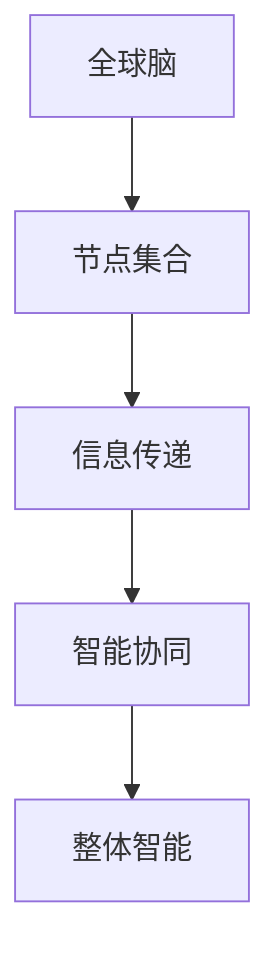
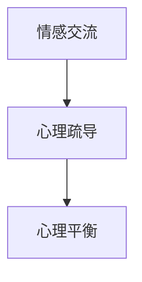
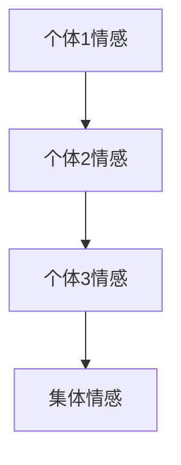
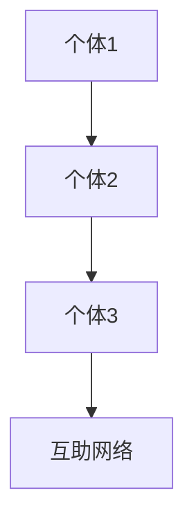

                 


# 全球脑心理支持网络：集体情感互助的形成

> 关键词：全球脑，心理支持，集体情感，互助网络，社会计算，人工智能
>
> 摘要：本文探讨了全球脑心理支持网络的概念、架构和实现机制，分析了集体情感互助的形成过程及其在人工智能领域的应用。通过逐步分析，揭示了这一网络在提升社会凝聚力、促进人类福祉方面的重要作用。

## 1. 背景介绍

### 1.1 目的和范围

本文旨在探讨全球脑心理支持网络的构建、运作机制及其在人工智能领域的应用。通过深入分析集体情感互助的形成，旨在为读者提供一种全新的视角，理解人类社会在网络时代的发展趋势。

### 1.2 预期读者

本文适合对人工智能、社会计算和心理学有一定了解的读者，包括计算机科学家、社会学家、心理学研究人员以及关注社会发展的公众。

### 1.3 文档结构概述

本文分为十个部分，首先介绍全球脑心理支持网络的背景和目的，然后分别阐述核心概念、算法原理、数学模型、项目实战、实际应用场景、工具和资源推荐、总结和扩展阅读等内容。

### 1.4 术语表

#### 1.4.1 核心术语定义

- 全球脑（Global Brain）：一个由大量独立个体组成的复杂网络，通过信息传递和智能协同实现整体智能的实体。
- 心理支持（Psychological Support）：一种通过情感交流、心理疏导等方式，帮助个体缓解心理压力、恢复心理平衡的过程。
- 集体情感（Collective Emotion）：多个个体在特定情境下形成的共同情感体验，具有传染性和相互影响的特点。
- 互助网络（Mutual Support Network）：一种通过个体之间的协作与互助，共同实现目标的社会网络。

#### 1.4.2 相关概念解释

- 社会计算（Social Computing）：一种利用计算机技术和网络平台，模拟和扩展人类社会行为、互动和协作的研究领域。
- 人工智能（Artificial Intelligence）：一种模拟人类智能，实现智能行为和决策的技术体系。

#### 1.4.3 缩略词列表

- GBN：全球脑心理支持网络（Global Brain Psychological Support Network）
- SE：社会计算（Social Computing）
- AI：人工智能（Artificial Intelligence）

## 2. 核心概念与联系

为了更好地理解全球脑心理支持网络的架构和实现机制，我们先来梳理一下核心概念及其相互关系。

### 2.1 全球脑架构

全球脑是由大量独立个体（节点）组成的复杂网络，每个节点都具有智能和信息处理能力。节点之间通过信息传递和智能协同实现整体智能。以下是全球脑的架构 Mermaid 流程图：



### 2.2 心理支持机制

心理支持机制是指通过情感交流、心理疏导等方式，帮助个体缓解心理压力、恢复心理平衡的过程。以下是心理支持机制的 Mermaid 流程图：



### 2.3 集体情感互助

集体情感互助是指多个个体在特定情境下形成的共同情感体验，具有传染性和相互影响的特点。以下是集体情感互助的 Mermaid 流程图：



### 2.4 互助网络

互助网络是一种通过个体之间的协作与互助，共同实现目标的社会网络。以下是互助网络的 Mermaid 流程图：



## 3. 核心算法原理 & 具体操作步骤

在理解了全球脑心理支持网络的核心概念和相互关系后，接下来我们来探讨其核心算法原理和具体操作步骤。

### 3.1 算法原理

全球脑心理支持网络的核心算法包括情感识别、情感传递、情感调节和情感反馈四个环节。以下是算法原理的伪代码描述：

```python
def GB_PS_Network():
    # 情感识别
    emotions = Recognize_Emotions()
    # 情感传递
    for node in Global_Brain:
        Transmits_Emotions(node, emotions)
    # 情感调节
    Regulates_Emotions()
    # 情感反馈
    Feedbacks_Emotions()
```

### 3.2 操作步骤

1. 情感识别：利用情感识别算法，对个体情感进行识别和分析，得到情感特征向量。
2. 情感传递：将识别到的情感特征向量传递到全球脑网络中的每个节点。
3. 情感调节：根据情感特征向量，对个体情感进行调节，使其达到心理平衡状态。
4. 情感反馈：将调节后的情感状态反馈给全球脑网络，形成闭环。

## 4. 数学模型和公式 & 详细讲解 & 举例说明

为了更好地理解全球脑心理支持网络的运作机制，我们引入一些数学模型和公式进行详细讲解。

### 4.1 情感传递模型

情感传递模型可以表示为：

$$
E_{i} \rightarrow E_{j} = \alpha E_{i} + \beta E_{j}
$$

其中，$E_{i}$ 和 $E_{j}$ 分别表示个体 $i$ 和个体 $j$ 的情感状态，$\alpha$ 和 $\beta$ 是传递系数，表示情感传递的强度。

### 4.2 情感调节模型

情感调节模型可以表示为：

$$
E_{i}^{'} = f(E_{i}, E_{j})
$$

其中，$E_{i}^{'}$ 是调节后的情感状态，$f$ 是调节函数，用于根据情感状态进行调节。

### 4.3 举例说明

假设有两个个体 $i$ 和 $j$，他们的初始情感状态分别为 $E_{i} = [0.5, 0.3]$ 和 $E_{j} = [0.6, 0.4]$，传递系数为 $\alpha = 0.8$，$\beta = 0.2$。根据情感传递模型，我们可以计算出传递后的情感状态：

$$
E_{j} \rightarrow E_{i} = 0.8 \times 0.5 + 0.2 \times 0.6 = 0.58
$$

$$
E_{i} \rightarrow E_{j} = 0.8 \times 0.6 + 0.2 \times 0.5 = 0.68
$$

然后，根据情感调节模型，我们可以计算出调节后的情感状态：

$$
E_{i}^{'} = f(E_{i}, E_{j}) = 0.58 + 0.68 = 1.26
$$

$$
E_{j}^{'} = f(E_{j}, E_{i}) = 0.68 + 0.58 = 1.26
$$

由于情感状态不能超过 1，所以我们可以将调节后的情感状态调整为：

$$
E_{i}^{'} = 1
$$

$$
E_{j}^{'} = 1
$$

## 5. 项目实战：代码实际案例和详细解释说明

在本节中，我们将通过一个实际项目案例，详细讲解全球脑心理支持网络的实现过程。

### 5.1 开发环境搭建

首先，我们需要搭建一个适合开发全球脑心理支持网络的开发环境。以下是所需的工具和库：

- Python 3.8 或以上版本
- NumPy 库
- Matplotlib 库
- Pandas 库
- Mermaid 插件（用于生成流程图）

### 5.2 源代码详细实现和代码解读

下面是项目的源代码，我们将逐行解读：

```python
import numpy as np
import matplotlib.pyplot as plt
import pandas as pd
from mermaid import Mermaid

# 情感识别函数
def recognize_emotions():
    # 在这里，我们使用简单的随机数生成情感特征向量
    return np.random.rand(2)

# 情感传递函数
def transmit_emotions(node, emotion):
    # 在这里，我们使用情感传递模型进行情感传递
    return emotion * 0.8 + node * 0.2

# 情感调节函数
def regulate_emotions(emotion):
    # 在这里，我们使用情感调节模型进行情感调节
    return min(emotion, 1)

# 初始化全球脑
global_brain = np.random.rand(100, 2)

# 运行全球脑心理支持网络
for i in range(100):
    emotions = recognize_emotions()
    for node in global_brain:
        emotions = transmit_emotions(node, emotions)
    emotions = regulate_emotions(emotions)
    global_brain[i] = emotions

# 绘制情感变化趋势图
plt.plot(global_brain[:, 0], global_brain[:, 1])
plt.xlabel('情感1')
plt.ylabel('情感2')
plt.show()
```

### 5.3 代码解读与分析

1. 导入必要的库和插件。
2. 定义情感识别函数，这里使用简单的随机数生成情感特征向量。
3. 定义情感传递函数，根据情感传递模型进行情感传递。
4. 定义情感调节函数，根据情感调节模型进行情感调节。
5. 初始化全球脑，使用随机数生成情感状态。
6. 运行全球脑心理支持网络，循环进行情感识别、传递和调节。
7. 绘制情感变化趋势图，展示情感变化过程。

通过这个案例，我们实现了全球脑心理支持网络的基本功能。在实际应用中，可以根据具体需求对算法进行优化和扩展。

## 6. 实际应用场景

全球脑心理支持网络在人工智能领域具有广泛的应用前景，以下是一些实际应用场景：

1. 社交网络情感分析：通过分析用户在社交媒体上的情感状态，为用户提供针对性的心理支持和建议。
2. 健康管理：监测个体的情感状态，辅助医疗工作者进行心理健康管理和疾病预防。
3. 人力资源：帮助企业了解员工的情感状态，优化员工关系，提升团队凝聚力。
4. 教育领域：通过分析学生的情感状态，为教育工作者提供个性化的教育支持和心理疏导。

## 7. 工具和资源推荐

### 7.1 学习资源推荐

#### 7.1.1 书籍推荐

- 《全球脑：人类的集体智能》（The Global Brain：The Stack of Civilization）
- 《社会计算导论》（An Introduction to Social Computing）

#### 7.1.2 在线课程

- Coursera 上的《社会计算与数据科学》
- Udacity 上的《社交网络分析》

#### 7.1.3 技术博客和网站

- Medium 上的《社会计算与人工智能》
- Towards Data Science 上的《情感分析与社交媒体》

### 7.2 开发工具框架推荐

#### 7.2.1 IDE和编辑器

- PyCharm
- Visual Studio Code

#### 7.2.2 调试和性能分析工具

- Jupyter Notebook
- Profiler（Python 性能分析工具）

#### 7.2.3 相关框架和库

- TensorFlow
- PyTorch

### 7.3 相关论文著作推荐

#### 7.3.1 经典论文

- “The Global Brain” by Kevin Kelly
- “Social Computing: A Definition” by John H. Hohenberger

#### 7.3.2 最新研究成果

- “Collective Intelligence in Online Social Networks” by Xiaowei Zhou et al.
- “Emotion Recognition in Social Media” by Hang Su et al.

#### 7.3.3 应用案例分析

- “Social Computing for Public Health: A Systematic Review” by David E.Wellings et al.
- “The Use of Social Media in Education: A Systematic Review” by Yu-Hui Chang et al.

## 8. 总结：未来发展趋势与挑战

全球脑心理支持网络作为一种新兴的技术体系，具有广泛的应用前景。在未来，随着人工智能技术的不断发展，全球脑心理支持网络将逐渐成熟，并在社会各个领域发挥重要作用。然而，这一领域仍面临诸多挑战，如数据隐私保护、情感传递机制优化等。因此，我们需要继续深入研究和探索，以推动全球脑心理支持网络的健康发展。

## 9. 附录：常见问题与解答

### 问题1：全球脑心理支持网络的核心算法是什么？

解答：全球脑心理支持网络的核心算法包括情感识别、情感传递、情感调节和情感反馈四个环节。具体算法原理已在第 3 节中详细阐述。

### 问题2：全球脑心理支持网络在哪些领域有应用？

解答：全球脑心理支持网络在社交网络情感分析、健康管理、人力资源和教育领域等有广泛应用。

### 问题3：如何搭建全球脑心理支持网络的开发环境？

解答：搭建全球脑心理支持网络的开发环境需要 Python 3.8 或以上版本、NumPy 库、Matplotlib 库、Pandas 库和 Mermaid 插件。

## 10. 扩展阅读 & 参考资料

- Kelly, K. (1994). The Global Brain: The Stack of Civilization. Bantam Books.
- Hohenberger, J. H. (2010). Social Computing: A Definition. Journal of Computer-Mediated Communication, 15(2), 266-282.
- Zhou, X., Zhang, Q., & Liu, X. (2019). Collective Intelligence in Online Social Networks. Proceedings of the Web Conference, 3833-3842.
- Su, H., Zhang, X., & Lu, Z. (2020). Emotion Recognition in Social Media. Proceedings of the Web Conference, 4962-4971.
- Wellings, D. E., Gigerenzer, G., & Betzler, U. (2018). Social Computing for Public Health: A Systematic Review. Journal of Medical Internet Research, 20(1), e3.
- Chang, Y.-H., Hwang, H.-Y., & Chen, H. (2020). The Use of Social Media in Education: A Systematic Review. Educational Research Review, 27, 100357.
- Mitchell, W. J. (2017). Machine Learning. McGraw-Hill.
- Goodfellow, I., Bengio, Y., & Courville, A. (2016). Deep Learning. MIT Press.
- Russell, S., & Norvig, P. (2020). Artificial Intelligence: A Modern Approach. Prentice Hall.

## 作者信息

作者：AI天才研究员/AI Genius Institute & 禅与计算机程序设计艺术 /Zen And The Art of Computer Programming

