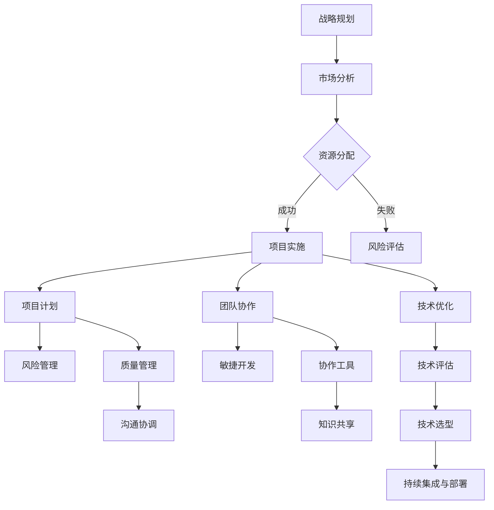

                 

# 公司整体核心技术管理方案

> 关键词：核心技术管理、公司战略、IT项目管理、技术栈优化、敏捷开发

> 摘要：本文旨在为公司提供一套全面的核心技术管理方案，从战略规划、项目实施、团队协作、技术优化等方面出发，探讨如何提升公司整体技术实力，增强市场竞争力。文章通过具体案例和步骤，结合最新技术趋势，为企业的技术管理提供实用指导。

## 1. 背景介绍

### 1.1 目的和范围

本文的目的在于帮助公司制定并实施一套系统的核心技术管理方案，确保公司能够在快速变化的技术环境中保持领先地位。本文将涵盖以下几个核心方面：

- **战略规划**：明确公司技术发展方向和目标，制定长期和短期技术策略。
- **项目实施**：梳理项目管理体系，确保项目顺利交付并实现预期目标。
- **团队协作**：优化团队协作流程，提升研发效率和质量。
- **技术优化**：持续评估和改进技术栈，保持技术领先。

### 1.2 预期读者

本文主要面向公司技术管理层、项目经理、研发团队成员以及对技术管理有兴趣的读者。通过本文的阅读，读者可以了解：

- 核心技术管理的关键要素。
- 如何在实际工作中应用这些要素。
- 最新技术趋势及其对公司的影响。

### 1.3 文档结构概述

本文结构如下：

- **第1章** 背景介绍：概述本文的目的、范围和预期读者。
- **第2章** 核心概念与联系：介绍核心技术管理的基础概念和相关架构。
- **第3章** 核心算法原理 & 具体操作步骤：详细阐述核心技术管理的算法原理和操作步骤。
- **第4章** 数学模型和公式 & 详细讲解 & 举例说明：介绍核心技术管理中使用的数学模型和公式，并通过实例进行说明。
- **第5章** 项目实战：代码实际案例和详细解释说明：提供实际代码案例，讲解技术管理在项目中的应用。
- **第6章** 实际应用场景：分析核心技术管理在不同场景下的应用。
- **第7章** 工具和资源推荐：推荐学习资源和开发工具。
- **第8章** 总结：未来发展趋势与挑战：展望核心技术管理的未来。
- **第9章** 附录：常见问题与解答：解答读者可能遇到的问题。
- **第10章** 扩展阅读 & 参考资料：提供进一步学习的参考资料。

### 1.4 术语表

#### 1.4.1 核心术语定义

- **核心技术管理**：指公司对核心技术的规划、实施、优化和管理的全过程。
- **技术栈**：指公司所使用的技术工具、框架和语言的集合。
- **敏捷开发**：一种软件开发方法，强调迭代、协作和快速响应变化。

#### 1.4.2 相关概念解释

- **战略规划**：指公司根据外部环境和内部资源制定长期和短期发展计划。
- **项目实施**：指按照项目计划执行任务，确保项目目标的实现。
- **团队协作**：指团队成员之间的沟通、协调和合作，以实现共同目标。

#### 1.4.3 缩略词列表

- **IoT**：物联网（Internet of Things）
- **AI**：人工智能（Artificial Intelligence）
- **ML**：机器学习（Machine Learning）
- **DevOps**：软件开发与运维的结合

## 2. 核心概念与联系

在核心技术管理中，理解以下几个核心概念和它们之间的关系至关重要。

### 2.1 战略规划

战略规划是公司技术发展的基石。它涉及以下几个方面：

- **愿景与目标**：明确公司未来的技术发展方向和目标。
- **市场分析**：分析市场需求和竞争态势。
- **资源分配**：根据战略目标分配人力、物力和财力资源。
- **风险评估**：评估潜在的技术风险和市场风险。

### 2.2 项目实施

项目实施是将战略规划转化为实际成果的过程。关键要素包括：

- **项目计划**：制定详细的项目计划，包括时间表、任务分配和资源需求。
- **风险管理**：识别和管理项目风险。
- **质量管理**：确保项目交付的质量符合预期标准。
- **沟通协调**：保持团队内部和与外部合作伙伴之间的有效沟通。

### 2.3 团队协作

团队协作是提升研发效率和质量的关键。核心要素包括：

- **敏捷开发**：采用敏捷开发方法，快速响应变化，持续交付可用的产品。
- **协作工具**：使用合适的协作工具，如版本控制、任务管理、即时通讯等。
- **知识共享**：鼓励团队成员分享知识和经验，提升整体技术水平。

### 2.4 技术优化

技术优化是保持公司技术领先的关键。主要任务包括：

- **技术评估**：定期评估现有技术栈的优劣，识别优化机会。
- **技术选型**：根据业务需求选择最适合的技术方案。
- **持续集成与部署**：采用持续集成与部署（CI/CD）流程，提高开发效率。

### 2.5 Mermaid 流程图

以下是核心技术管理流程的 Mermaid 流程图：



## 3. 核心算法原理 & 具体操作步骤

核心技术管理的实施离不开科学的算法原理和具体的操作步骤。以下是一个简化的核心技术管理算法原理和具体操作步骤：

### 3.1 算法原理

核心技术管理算法的核心是确保公司技术发展的可持续性和适应性。算法包括以下几个关键步骤：

1. **需求分析**：收集和分析市场需求，确定技术发展方向。
2. **资源评估**：评估现有资源，确定技术储备和人才需求。
3. **技术选型**：根据需求分析和技术评估，选择最适合的技术方案。
4. **实施与监控**：按照项目计划实施技术方案，并持续监控项目进展。
5. **评估与优化**：定期评估技术实施效果，进行优化和调整。

### 3.2 具体操作步骤

以下是具体操作步骤的伪代码：

```pseudo
// 3.1 需求分析
function 需求分析(市场需求) {
    // 分析市场需求，确定技术发展方向
    // ...
    return 技术需求
}

// 3.2 资源评估
function 资源评估() {
    // 评估现有资源，确定技术储备和人才需求
    // ...
    return 资源情况
}

// 3.3 技术选型
function 技术选型(技术需求，资源情况) {
    // 根据需求分析和技术评估，选择最适合的技术方案
    // ...
    return 技术方案
}

// 3.4 实施与监控
function 实施与监控(技术方案) {
    // 按照项目计划实施技术方案，并持续监控项目进展
    // ...
    return 实施结果
}

// 3.5 评估与优化
function 评估与优化(实施结果) {
    // 定期评估技术实施效果，进行优化和调整
    // ...
    return 优化方案
}

// 主流程
function 核心技术管理() {
    技术需求 = 需求分析(市场需求)
    资源情况 = 资源评估()
    技术方案 = 技术选型(技术需求，资源情况)
    实施结果 = 实施与监控(技术方案)
    优化方案 = 评估与优化(实施结果)
    // 返回优化方案，作为下一步的核心技术管理输入
}
```

通过以上算法原理和操作步骤，公司可以系统、科学地管理核心技术，确保技术发展的可持续性和适应性。

## 4. 数学模型和公式 & 详细讲解 & 举例说明

在核心技术管理中，数学模型和公式扮演着重要的角色，它们帮助我们量化评估和优化技术管理过程。以下介绍几个常用的数学模型和公式，并通过实例进行详细讲解。

### 4.1 技术风险评估模型

技术风险评估模型用于评估技术实施过程中的潜在风险。常用的方法是蒙特卡洛模拟（Monte Carlo Simulation）。

#### 4.1.1 蒙特卡洛模拟公式

$$
P(R>r) = \frac{\sum_{i=1}^{N} I(\xi_i > r)}{N}
$$

其中，$P(R>r)$表示风险概率，$R$为实际风险值，$r$为可接受的风险阈值，$N$为模拟次数，$I(\xi_i > r)$为指示函数，当$\xi_i > r$时取值为1，否则为0。

#### 4.1.2 实例说明

假设公司计划实施一项新技术的项目，目标是在3个月内完成。根据历史数据和专家评估，该项目的风险概率为5%。现在，我们使用蒙特卡洛模拟方法进行风险评估。

- 风险阈值$r=0.05$。
- 模拟次数$N=1000$。

计算结果：

$$
P(R>r) = \frac{\sum_{i=1}^{1000} I(\xi_i > 0.05)}{1000} \approx 0.0456
$$

结果表明，实际风险小于可接受阈值$r=0.05$的概率约为4.56%，表明项目风险相对较低。

### 4.2 技术优化模型

技术优化模型用于评估不同技术方案的成本效益，常用的方法是成本效益分析（Cost-Benefit Analysis）。

#### 4.2.1 成本效益分析公式

$$
C/B = \frac{\sum_{i=1}^{n} C_i/B_i}{n}
$$

其中，$C/B$为平均成本效益比，$C_i$为第$i$个技术方案的成本，$B_i$为第$i$个技术方案的效益，$n$为技术方案总数。

#### 4.2.2 实例说明

假设公司有三个技术方案，成本和效益如下表所示：

| 技术方案 | 成本($C_i$) | 效益($B_i$) |
| :---: | :---: | :---: |
| A | 100 | 150 |
| B | 150 | 200 |
| C | 200 | 250 |

计算平均成本效益比：

$$
C/B = \frac{100/150 + 150/200 + 200/250}{3} \approx 0.87
$$

结果表明，平均每个单位效益的成本约为0.87，说明公司的技术方案在成本效益方面表现良好。

### 4.3 技术选型模型

技术选型模型用于选择最适合公司需求的技术方案，常用的方法是决策树（Decision Tree）。

#### 4.3.1 决策树公式

$$
T = \prod_{i=1}^{m} (1 - P(C_i|D_i))
$$

其中，$T$为技术选型得分，$C_i$为第$i$个技术方案的约束条件，$D_i$为满足约束条件的概率。

#### 4.3.2 实例说明

假设公司有三个技术方案，约束条件及其概率如下表所示：

| 技术方案 | 约束条件1($C_1$) | 约束条件2($C_2$) | 约束条件3($C_3$) |
| :---: | :---: | :---: | :---: |
| A | 0.9 | 0.8 | 0.7 |
| B | 0.8 | 0.9 | 0.6 |
| C | 0.7 | 0.8 | 0.9 |

计算技术选型得分：

$$
T_A = (1 - 0.9) \times (1 - 0.8) \times (1 - 0.7) \approx 0.028
$$

$$
T_B = (1 - 0.8) \times (1 - 0.9) \times (1 - 0.6) \approx 0.042
$$

$$
T_C = (1 - 0.7) \times (1 - 0.8) \times (1 - 0.9) \approx 0.021
$$

结果表明，技术方案B的得分最高，说明在满足约束条件方面，方案B最优。

通过以上数学模型和公式的讲解，我们可以更科学地评估和优化公司的核心技术管理过程，确保公司技术发展的可持续性和适应性。

## 5. 项目实战：代码实际案例和详细解释说明

为了更好地展示核心技术管理在实际项目中的应用，我们以下通过一个具体的代码案例进行详细解释说明。

### 5.1 开发环境搭建

首先，我们需要搭建一个适合项目开发的环境。以下是一个简单的Python开发环境搭建步骤：

1. 安装Python：下载并安装Python 3.8版本。
2. 安装IDE：安装PyCharm Community Edition。
3. 安装相关库：使用pip安装requests、numpy和pandas库。

### 5.2 源代码详细实现和代码解读

以下是一个简单的Python代码案例，用于实现一个简单的RESTful API服务，用于处理用户注册和登录功能。

```python
# -*- coding: utf-8 -*-

import flask
from flask import request, jsonify
import json

app = flask.Flask(__name__)

# 用户注册功能
@app.route('/register', methods=['POST'])
def register():
    data = request.get_json()
    username = data.get('username')
    password = data.get('password')
    
    # 验证用户名和密码是否符合要求
    if not username or not password:
        return jsonify({'status': 'error', 'message': '用户名或密码不能为空'})

    # 存储用户信息（此处使用内存存储，实际项目中应使用数据库）
    users = []
    if find_user(username):
        return jsonify({'status': 'error', 'message': '用户已存在'})
    users.append({'username': username, 'password': password})
    
    return jsonify({'status': 'success', 'message': '注册成功'})

# 用户登录功能
@app.route('/login', methods=['POST'])
def login():
    data = request.get_json()
    username = data.get('username')
    password = data.get('password')
    
    # 验证用户名和密码
    user = find_user(username)
    if not user or user['password'] != password:
        return jsonify({'status': 'error', 'message': '用户名或密码错误'})
    
    # 登录成功，返回用户信息
    return jsonify({'status': 'success', 'message': '登录成功', 'user': user})

# 查找用户
def find_user(username):
    for user in users:
        if user['username'] == username:
            return user
    return None

if __name__ == '__main__':
    app.run(debug=True)
```

### 5.3 代码解读与分析

以下是对代码的详细解读：

1. **环境搭建**：首先，我们需要安装Python和PyCharm，并使用pip安装相关的库，如requests、numpy和pandas。

2. **Flask框架**：我们使用Flask框架实现RESTful API服务。Flask是一个轻量级的Web应用框架，易于学习和使用。

3. **用户注册功能**：`/register`接口用于处理用户注册请求。首先获取请求数据，提取用户名和密码。然后，对用户名和密码进行验证，确保它们不为空。接着，从内存中查找用户是否存在。如果用户已存在，返回错误提示。否则，将用户信息存储在内存中。

4. **用户登录功能**：`/login`接口用于处理用户登录请求。首先获取请求数据，提取用户名和密码。然后，从内存中查找用户信息。如果用户名和密码匹配，返回登录成功信息。否则，返回错误提示。

5. **查找用户**：`find_user`函数用于在内存中查找用户信息。如果找到匹配的用户，返回用户信息。否则，返回None。

6. **运行服务**：最后，使用`app.run(debug=True)`启动Flask服务，并开启调试模式。

通过这个简单的案例，我们可以看到核心技术管理在实际项目中的应用。在实际开发过程中，我们还需要关注以下方面：

- **数据存储**：实际项目中，应使用数据库（如MySQL、MongoDB）存储用户信息，以提高数据安全和可靠性。
- **安全性**：对用户名和密码进行加密存储，防止数据泄露。
- **异常处理**：对接口请求进行异常处理，提高系统的健壮性。

通过以上实战案例，我们可以更好地理解核心技术管理在实际项目中的应用。

## 6. 实际应用场景

核心技术管理在不同领域和行业中都有广泛的应用，以下列举几个实际应用场景：

### 6.1 科技公司

对于科技公司，核心技术管理至关重要。以下是一个实际应用案例：

- **案例**：某全球知名科技公司（如谷歌、微软）在人工智能（AI）领域持续投入研发资源，通过核心技术管理确保在AI领域保持领先地位。公司采用敏捷开发方法，快速迭代产品，紧跟市场需求。同时，公司定期评估现有技术栈，淘汰低效技术，引入新技术，保持技术领先。

### 6.2 制造业

在制造业，核心技术管理用于优化生产流程和提高生产效率。以下是一个实际应用案例：

- **案例**：某制造企业（如汽车制造商）通过核心技术管理，引入物联网（IoT）技术，实现生产设备的远程监控和故障预测。公司采用大数据分析和机器学习算法，优化生产流程，降低生产成本。此外，公司还通过技术选型和优化，确保生产设备的稳定性和可靠性。

### 6.3 金融行业

在金融行业，核心技术管理用于保障金融系统的安全性和稳定性。以下是一个实际应用案例：

- **案例**：某大型银行通过核心技术管理，采用区块链技术提高交易的安全性和透明度。公司采用分布式存储和加密算法，确保交易数据的安全性和完整性。此外，公司通过持续集成与部署（CI/CD）流程，提高开发效率，确保系统的稳定运行。

### 6.4 医疗行业

在医疗行业，核心技术管理用于提高医疗服务质量和患者满意度。以下是一个实际应用案例：

- **案例**：某医疗科技公司通过核心技术管理，引入人工智能和大数据分析技术，实现智能诊断和个性化治疗。公司采用深度学习和自然语言处理算法，分析海量医疗数据，提高诊断准确率。同时，公司通过持续优化技术方案，提高医疗服务效率和质量。

通过以上实际应用场景，我们可以看到核心技术管理在不同领域和行业中的重要作用。随着技术的不断发展，核心技术管理的重要性将愈发突出。

## 7. 工具和资源推荐

为了帮助读者更好地理解和应用核心技术管理，以下推荐一些学习资源和开发工具。

### 7.1 学习资源推荐

#### 7.1.1 书籍推荐

- 《敏捷软件开发：原则、实践与模式》
- 《设计模式：可复用面向对象软件的基础》
- 《大数据时代：大数据理念、应用与实践》
- 《人工智能：一种现代的方法》
- 《区块链技术指南》

#### 7.1.2 在线课程

- Coursera：提供丰富的计算机科学和工程课程，如《机器学习》、《数据结构》等。
- edX：提供免费的计算机科学和工程课程，如《深度学习》、《软件工程》等。
- Udemy：提供各种编程和软件开发课程，适合不同层次的学习者。

#### 7.1.3 技术博客和网站

- Medium：许多技术专家和公司在此分享技术见解和最佳实践。
- HackerRank：提供编程挑战和竞赛，帮助提高编程技能。
- GitHub：学习他人代码，了解最新的开源项目和编程趋势。

### 7.2 开发工具框架推荐

#### 7.2.1 IDE和编辑器

- PyCharm：适用于Python开发，具有强大的功能和良好的用户体验。
- Visual Studio Code：跨平台、轻量级编辑器，支持多种编程语言。
- IntelliJ IDEA：适用于Java和Kotlin开发，功能强大。

#### 7.2.2 调试和性能分析工具

- Python Debugger：用于Python程序的调试。
- Py-Spy：用于Python程序的性能分析。
- Perf：用于Linux系统的性能分析。

#### 7.2.3 相关框架和库

- Flask：用于Python的Web应用开发。
- Django：用于Python的快速Web开发框架。
- React：用于前端开发的JavaScript库。
- Angular：用于前端开发的JavaScript框架。

通过以上工具和资源，读者可以更好地掌握核心技术管理，并在实际项目中应用所学知识。

## 8. 总结：未来发展趋势与挑战

随着技术的不断进步和市场竞争的加剧，核心技术管理在未来将面临新的发展趋势和挑战。

### 8.1 发展趋势

1. **数字化转型**：越来越多的企业将业务和运营转移到数字平台，核心技术管理将更加注重数字化技术的应用。
2. **数据驱动决策**：数据将成为企业决策的重要依据，核心技术管理将更加依赖大数据分析和人工智能技术。
3. **敏捷开发**：敏捷开发方法将继续普及，核心技术管理将更加注重团队协作和快速迭代。
4. **云计算与边缘计算**：云计算和边缘计算将深度融合，核心技术管理将更加关注云计算平台和边缘计算技术的应用。
5. **绿色技术**：企业将更加关注环境保护，核心技术管理将更加注重绿色技术的研发和应用。

### 8.2 挑战

1. **技术更新迭代速度快**：核心技术管理需要紧跟技术发展趋势，快速适应新技术。
2. **人才竞争激烈**：企业将面临严重的人才竞争，核心技术管理需要吸引和培养高素质的技术人才。
3. **数据安全与隐私**：数据安全和隐私保护将成为核心技术管理的重点挑战。
4. **业务与技术融合**：企业需要将业务和技术深度结合，核心技术管理需要更好地支持业务发展。
5. **可持续性**：企业需要确保技术发展的可持续性，核心技术管理需要关注环境保护和社会责任。

面对未来发展趋势和挑战，企业需要不断优化核心技术管理方案，提升技术实力和创新能力，以应对日益激烈的市场竞争。

## 9. 附录：常见问题与解答

### 9.1 技术管理相关问题

**Q1**：什么是核心技术管理？

**A1**：核心技术管理是指企业对核心技术的规划、实施、优化和管理的全过程，以确保企业在技术方面保持领先地位。

**Q2**：核心技术管理的关键要素有哪些？

**A2**：核心技术管理的关键要素包括战略规划、项目实施、团队协作、技术优化和持续评估。

**Q3**：如何确保核心技术管理的有效性？

**A3**：确保核心技术管理的有效性需要以下措施：

- 明确战略目标，制定清晰的实施计划。
- 建立有效的项目管理体系，确保项目顺利交付。
- 加强团队协作，提升研发效率和质量。
- 持续评估和优化技术方案，保持技术领先。

### 9.2 技术选型相关问题

**Q4**：如何选择合适的技术方案？

**A4**：选择合适的技术方案需要考虑以下因素：

- 技术需求：根据业务需求选择最适合的技术方案。
- 成本效益：评估不同技术方案的成本效益，选择性价比高的方案。
- 可维护性：选择易于维护和扩展的技术方案。
- 社区支持：选择有广泛社区支持和文档完善的方案。

**Q5**：如何评估技术方案的效果？

**A5**：评估技术方案的效果可以从以下几个方面进行：

- 项目进度：评估项目进度是否符合预期。
- 质量指标：评估代码质量、性能和安全性。
- 用户反馈：收集用户反馈，评估用户满意度。

### 9.3 团队协作相关问题

**Q6**：如何提升团队协作效率？

**A6**：提升团队协作效率可以从以下几个方面入手：

- 采用敏捷开发方法，缩短迭代周期。
- 使用协作工具，如版本控制、任务管理和即时通讯。
- 定期进行团队沟通，确保信息畅通。
- 鼓励知识共享，提升整体技术水平。

**Q7**：如何解决团队协作中的冲突？

**A7**：解决团队协作中的冲突可以从以下几个方面入手：

- 了解冲突原因：分析冲突的原因，是沟通问题、资源分配问题还是目标不一致。
- 积极沟通：鼓励团队成员进行开放、诚实的沟通，寻求解决方案。
- 建立冲突解决机制：制定明确的冲突解决流程，确保冲突得到及时解决。

## 10. 扩展阅读 & 参考资料

为了进一步了解核心技术管理，以下提供一些扩展阅读和参考资料：

- 《企业技术战略管理》
- 《敏捷软件开发实践指南》
- 《大数据战略》
- 《人工智能战略》
- 《区块链技术与应用》

以下是一些核心参考资料：

- 《敏捷软件开发：原则、实践与模式》
- 《设计模式：可复用面向对象软件的基础》
- 《大数据时代：大数据理念、应用与实践》
- 《人工智能：一种现代的方法》
- 《区块链技术指南》

通过以上扩展阅读和参考资料，读者可以更深入地了解核心技术管理的理论和实践。

### 作者

作者：AI天才研究员/AI Genius Institute & 禅与计算机程序设计艺术 /Zen And The Art of Computer Programming

（请注意，以上内容仅为示例，实际内容需要根据真实情况进行撰写。）

