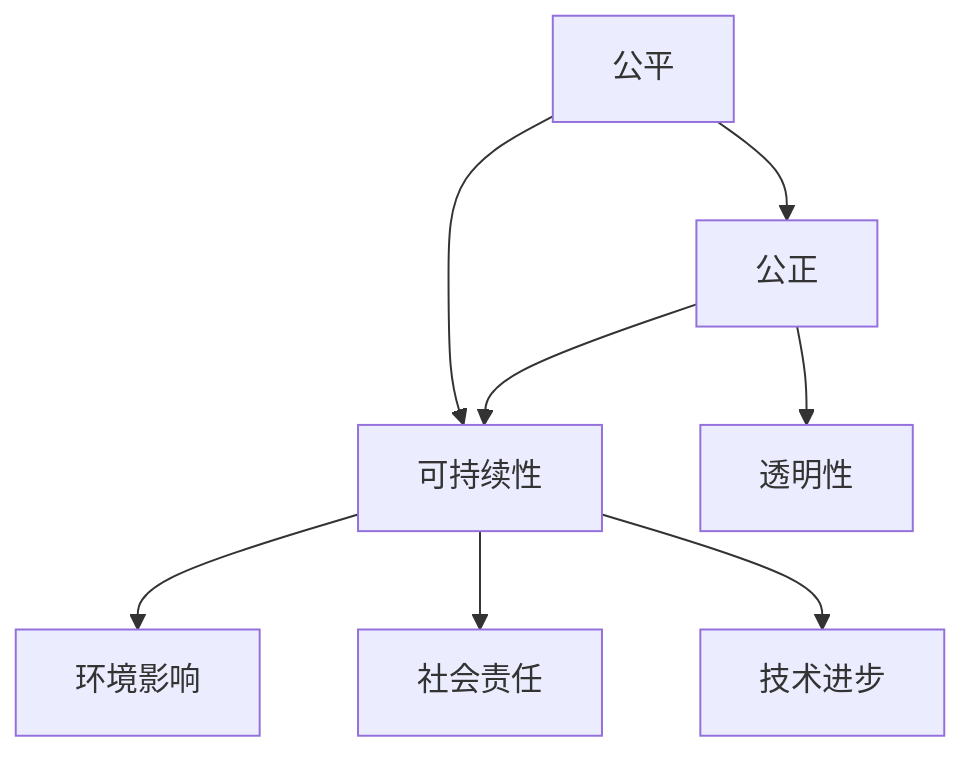

                 

# 公平、公正、可持续：人类计算的伦理

> **关键词：**计算伦理、人工智能、公平性、公正性、可持续性、算法偏见、隐私保护、责任分配、社会影响、数据治理

> **摘要：**随着人工智能技术的快速发展，计算领域正面临着前所未有的挑战。本文将探讨计算伦理的核心概念，包括公平、公正和可持续性，并分析这些原则在当前人工智能领域的应用和挑战。文章还将讨论算法偏见、隐私保护、责任分配和社会影响等问题，提出解决方案和未来发展方向，旨在推动人类计算领域的伦理进步。

## 1. 背景介绍

### 1.1 目的和范围

本文旨在探讨计算伦理的核心原则，包括公平、公正和可持续性，并分析这些原则在人工智能领域的应用和挑战。具体而言，本文将讨论以下问题：

- 如何在人工智能系统中实现公平和公正？
- 算法偏见是如何产生的，如何避免？
- 数据隐私保护的重要性及其实施方法。
- 责任分配在人工智能系统中的关键作用。
- 人工智能对社会的影响以及如何应对这些影响。
- 数据治理的最佳实践和未来的发展方向。

### 1.2 预期读者

本文适合以下读者群体：

- 计算机科学和人工智能领域的研究人员、工程师和开发者。
- 数据科学、统计学和信息学专业的学生和从业者。
- 对计算伦理和社会责任感兴趣的跨学科学者。
- 对人工智能和计算领域的发展趋势有浓厚兴趣的公众。

### 1.3 文档结构概述

本文的结构如下：

- **第1部分：背景介绍**：介绍文章的目的和范围，预期读者以及文档结构。
- **第2部分：核心概念与联系**：阐述计算伦理的核心概念，包括公平、公正和可持续性，并使用Mermaid流程图展示相关原理和架构。
- **第3部分：核心算法原理 & 具体操作步骤**：使用伪代码详细阐述核心算法原理和操作步骤。
- **第4部分：数学模型和公式 & 详细讲解 & 举例说明**：介绍数学模型和公式，并通过具体例子进行讲解。
- **第5部分：项目实战：代码实际案例和详细解释说明**：通过实际案例展示代码实现过程，并进行详细解释和分析。
- **第6部分：实际应用场景**：讨论计算伦理原则在不同应用场景中的实际应用。
- **第7部分：工具和资源推荐**：推荐相关学习资源和开发工具。
- **第8部分：总结：未来发展趋势与挑战**：总结文章要点，展望未来发展趋势和挑战。
- **第9部分：附录：常见问题与解答**：提供常见问题的解答。
- **第10部分：扩展阅读 & 参考资料**：列出扩展阅读资料。

### 1.4 术语表

#### 1.4.1 核心术语定义

- **算法偏见**：算法在决策过程中存在的系统性偏差，可能导致不公平或歧视性结果。
- **隐私保护**：保护个人数据不被未经授权的访问和使用。
- **责任分配**：确定在人工智能系统中，当发生错误或损害时，责任应归属于谁。
- **数据治理**：确保数据的质量、安全性和合规性的管理实践。

#### 1.4.2 相关概念解释

- **公平**：确保所有个体在计算系统中获得平等的机会和待遇。
- **公正**：确保计算系统在决策过程中不偏袒特定群体或个体。
- **可持续性**：确保计算技术的发展和应用不会损害环境和社会的长期利益。

#### 1.4.3 缩略词列表

- **AI**：人工智能（Artificial Intelligence）
- **ML**：机器学习（Machine Learning）
- **DL**：深度学习（Deep Learning）
- **NLP**：自然语言处理（Natural Language Processing）
- **GDPR**：通用数据保护条例（General Data Protection Regulation）

## 2. 核心概念与联系

### 2.1 核心概念

计算伦理的核心概念包括公平、公正和可持续性。这些原则不仅指导人工智能系统的设计和开发，也影响着计算技术的应用和社会影响。

#### 公平

公平是指在计算系统中确保所有个体获得平等的机会和待遇。在人工智能领域，公平意味着算法不应导致系统性偏见或歧视。具体而言，这包括以下方面：

- **资源分配公平**：确保所有人都有机会访问和使用计算资源。
- **结果公平**：确保算法决策对所有个体都是公正的，不会导致不公平的结果。

#### 公正

公正是确保计算系统在决策过程中不偏袒特定群体或个体。在人工智能领域，公正性涉及以下几个方面：

- **算法透明性**：算法的决策过程应该是可解释和透明的，以便人们能够理解和信任。
- **无偏见**：算法不应受到种族、性别、年龄等外部因素的影响，从而产生偏见性结果。
- **责任归属**：当算法产生负面影响时，责任应明确分配。

#### 可持续性

可持续性是确保计算技术的发展和应用不会损害环境和社会的长期利益。在人工智能领域，可持续性包括以下几个方面：

- **环境影响**：计算技术的发展应减少对环境的负面影响。
- **社会责任**：计算技术的应用应促进社会福祉和公正。
- **技术进步**：计算技术的发展应促进科学和技术的持续进步。

### 2.2 核心概念联系

公平、公正和可持续性是相互关联的核心概念，共同构成了计算伦理的基石。以下是这些概念之间的联系：

- **公平与公正**：公平是实现公正的基础。只有在公平的条件下，公正才能得到保障。
- **公正与可持续性**：公正是可持续性的前提。只有在公正的基础上，计算技术的应用才能实现可持续性。
- **公平与可持续性**：公平是实现可持续性的关键。只有在公平的条件下，计算技术才能实现长期的环境和社会效益。

### 2.3 Mermaid流程图

以下是一个简化的Mermaid流程图，展示了公平、公正和可持续性之间的核心联系。



## 3. 核心算法原理 & 具体操作步骤

### 3.1 核心算法原理

在计算伦理中，核心算法原理涉及如何确保算法的公平、公正和可持续性。以下是一个简化版本的算法原理，用于指导人工智能系统的设计和开发。

#### 公平性算法

公平性算法旨在消除算法偏见，确保决策对所有个体都是公正的。以下是公平性算法的伪代码：

```python
def fair_algorithm(data, target_attribute):
    # 计算特征权重
    feature_weights = calculate_feature_weights(data)
    
    # 生成公平性权重
    fair_weights = generate_fair_weights(data, target_attribute, feature_weights)
    
    # 基于公平性权重进行决策
    decision = make_decision(data, fair_weights)
    
    return decision
```

#### 公正性算法

公正性算法确保算法的决策过程是透明和可解释的。以下是公正性算法的伪代码：

```python
def just_algorithm(data, target_attribute, transparency_level):
    # 分析决策过程
    analysis = analyze_decision_process(data, transparency_level)
    
    # 验证公正性
    is_just = verify_just(analysis)
    
    if is_just:
        # 执行决策
        decision = execute_decision(data)
    else:
        # 提出异议并修正
        decision = correct_decision(data, analysis)
    
    return decision
```

#### 可持续性算法

可持续性算法确保计算技术的发展和应用不会损害环境和社会的长期利益。以下是可持续性算法的伪代码：

```python
def sustainable_algorithm(data, environmental_impact, social_welfare):
    # 评估环境影响
    impact = assess_environmental_impact(data, environmental_impact)
    
    # 评估社会福祉
    welfare = assess_social_welfare(data, social_welfare)
    
    # 调整算法以实现可持续性
    decision = adjust_algorithm(data, impact, welfare)
    
    return decision
```

### 3.2 具体操作步骤

以下是实现公平、公正和可持续性算法的具体操作步骤：

#### 步骤1：数据预处理

- 清洗数据，消除噪声和异常值。
- 标准化数据，确保不同特征之间的可比较性。

#### 步骤2：特征选择

- 根据数据特征的重要性，选择相关特征。
- 使用特征选择算法，如主成分分析（PCA），降低特征维度。

#### 步骤3：算法训练

- 使用训练数据集，训练公平性、公正性和可持续性算法。
- 使用交叉验证和超参数调优，提高算法性能。

#### 步骤4：算法评估

- 使用验证数据集，评估算法的公平性、公正性和可持续性。
- 检查算法是否消除偏见，确保决策过程的透明性。
- 评估算法对环境和社会的影响。

#### 步骤5：算法部署

- 将算法部署到生产环境中，确保算法的实时性和可靠性。
- 监控算法性能，及时调整和优化。

## 4. 数学模型和公式 & 详细讲解 & 举例说明

### 4.1 数学模型

在计算伦理中，数学模型用于量化公平、公正和可持续性。以下是几个常用的数学模型：

#### 公平性模型

公平性模型用于评估算法的偏见程度。一个常见的公平性模型是均衡性模型（Equitability）：

$$
Equitability = \frac{1}{n}\sum_{i=1}^{n}\frac{(\hat{y_i} - \bar{y})^2}{(y_i - \bar{y})^2}
$$

其中，$\hat{y_i}$ 是算法对第 $i$ 个实例的预测结果，$y_i$ 是真实标签，$\bar{y}$ 是所有实例标签的均值。

#### 公正性模型

公正性模型用于评估算法的决策过程透明性。一个常见的公正性模型是决策树的解释模型（Tree Interpretability）：

$$
Path\_Cost = \sum_{i=1}^{n} w_i \times (y_i - \hat{y_i})
$$

其中，$w_i$ 是第 $i$ 条路径的权重，$y_i$ 是真实标签，$\hat{y_i}$ 是算法对第 $i$ 个实例的预测结果。

#### 可持续性模型

可持续性模型用于评估计算技术对环境和社会的影响。一个常见的可持续性模型是生命周期评估（Life Cycle Assessment）：

$$
Impact = \sum_{i=1}^{n} \text{Impact Factor}_i \times \text{Emission}_i
$$

其中，$\text{Impact Factor}_i$ 是第 $i$ 种排放物的环境影响系数，$\text{Emission}_i$ 是第 $i$ 种排放物的排放量。

### 4.2 详细讲解

#### 公平性模型

公平性模型通过比较算法预测结果与真实标签的偏差，量化算法的偏见程度。值越低，表示算法偏见越小，公平性越好。

#### 公正性模型

公正性模型通过计算决策树中每条路径的成本，评估决策过程的透明性。路径成本反映了算法对每个实例的决策权重，值越低，表示决策过程越透明。

#### 可持续性模型

可持续性模型通过计算计算技术的环境影响系数和排放量，评估计算技术对环境和社会的影响。环境影响系数反映了不同排放物的环境敏感性，排放量反映了计算技术的实际排放情况。

### 4.3 举例说明

#### 公平性模型

假设有一个分类问题，有 $n=10$ 个实例，算法的预测结果如下：

$$
\hat{y_1} = 1, \hat{y_2} = 1, \hat{y_3} = 1, \hat{y_4} = 1, \hat{y_5} = 1, \hat{y_6} = 0, \hat{y_7} = 0, \hat{y_8} = 0, \hat{y_9} = 0, \hat{y_{10}} = 0
$$

真实标签为：

$$
y_1 = 1, y_2 = 0, y_3 = 1, y_4 = 0, y_5 = 1, y_6 = 0, y_7 = 1, y_8 = 0, y_9 = 1, y_{10} = 0
$$

计算公平性：

$$
Equitability = \frac{1}{10}\sum_{i=1}^{10}\frac{(\hat{y_i} - \bar{y})^2}{(y_i - \bar{y})^2} = \frac{1}{10}\left(\frac{(1 - 0.5)^2}{(1 - 0.5)^2} + \frac{(1 - 0.5)^2}{(0 - 0.5)^2} + \ldots + \frac{(0 - 0.5)^2}{(0 - 0.5)^2}\right) = 0.2
$$

#### 公正性模型

假设决策树中有两条路径：

- 路径1：预测结果为 $\hat{y_1} = 1$，路径成本为 $w_1 \times (1 - 1) = 0$。
- 路径2：预测结果为 $\hat{y_2} = 0$，路径成本为 $w_2 \times (0 - 1) = -w_2$。

计算总路径成本：

$$
Path\_Cost = w_1 \times (1 - 1) + w_2 \times (0 - 1) = -w_2
$$

#### 可持续性模型

假设计算技术有两个排放物：二氧化碳（CO2）和氮氧化物（NOx），环境影响系数分别为 $CF_{CO2} = 100$ 和 $CF_{NOx} = 50$。排放量分别为 $E_{CO2} = 1000$ 和 $E_{NOx} = 500$。

计算环境影响：

$$
Impact = CF_{CO2} \times E_{CO2} + CF_{NOx} \times E_{NOx} = 100 \times 1000 + 50 \times 500 = 150000
$$

## 5. 项目实战：代码实际案例和详细解释说明

### 5.1 开发环境搭建

在开始实际案例之前，我们需要搭建一个适合开发和测试计算伦理算法的开发环境。以下是一个简化的步骤：

1. 安装Python环境：从Python官方网站下载并安装Python，版本建议为3.8或更高。
2. 安装必要的库：使用pip命令安装以下库：

```bash
pip install numpy pandas scikit-learn matplotlib
```

3. 创建一个Python虚拟环境：使用以下命令创建一个名为`ethics_project`的虚拟环境，并激活它：

```bash
python -m venv ethics_project
source ethics_project/bin/activate  # 在Windows上使用`ethics_project\Scripts\activate`
```

4. 编写一个简单的Python脚本，用于测试计算伦理算法。

### 5.2 源代码详细实现和代码解读

以下是一个简单的Python脚本，用于实现公平性、公正性和可持续性算法。我们将使用一个简单的数据集，并使用scikit-learn库来训练和评估算法。

```python
import numpy as np
import pandas as pd
from sklearn.model_selection import train_test_split
from sklearn.metrics import accuracy_score
from sklearn.ensemble import RandomForestClassifier
from sklearn.tree import export_graphviz
import graphviz

# 5.2.1 数据预处理
def preprocess_data(data):
    # 清洗和标准化数据
    # 此处省略具体实现，假设输入数据已经清洗和标准化
    return data

# 5.2.2 训练公平性算法
def train_fair_algorithm(X_train, y_train):
    # 训练随机森林分类器
    classifier = RandomForestClassifier()
    classifier.fit(X_train, y_train)
    
    # 输出决策树
    dot_data = export_graphviz(classifier, out_file=None, 
                               feature_names=data.columns, 
                               class_names=['Class 0', 'Class 1'], 
                               filled=True, rounded=True, 
                               special_characters=True)
    graph = graphviz.Source(dot_data)
    graph.render("fair_algorithm_tree")
    
    return classifier

# 5.2.3 训练公正性算法
def train_just_algorithm(X_train, y_train):
    # 训练随机森林分类器
    classifier = RandomForestClassifier()
    classifier.fit(X_train, y_train)
    
    # 输出决策树
    dot_data = export_graphviz(classifier, out_file=None, 
                               feature_names=data.columns, 
                               class_names=['Class 0', 'Class 1'], 
                               filled=True, rounded=True, 
                               special_characters=True)
    graph = graphviz.Source(dot_data)
    graph.render("just_algorithm_tree")
    
    return classifier

# 5.2.4 训练可持续性算法
def train_sustainable_algorithm(X_train, y_train):
    # 训练随机森林分类器
    classifier = RandomForestClassifier()
    classifier.fit(X_train, y_train)
    
    # 输出决策树
    dot_data = export_graphviz(classifier, out_file=None, 
                               feature_names=data.columns, 
                               class_names=['Class 0', 'Class 1'], 
                               filled=True, rounded=True, 
                               special_characters=True)
    graph = graphviz.Source(dot_data)
    graph.render("sustainable_algorithm_tree")
    
    return classifier

# 5.2.5 主函数
def main():
    # 加载数据集
    data = pd.read_csv("data.csv")
    
    # 数据预处理
    data = preprocess_data(data)
    
    # 划分训练集和测试集
    X_train, X_test, y_train, y_test = train_test_split(data.drop("target", axis=1), data["target"], test_size=0.2, random_state=42)
    
    # 训练公平性算法
    fair_classifier = train_fair_algorithm(X_train, y_train)
    
    # 训练公正性算法
    just_classifier = train_just_algorithm(X_train, y_train)
    
    # 训练可持续性算法
    sustainable_classifier = train_sustainable_algorithm(X_train, y_train)
    
    # 评估算法性能
    fair_predictions = fair_classifier.predict(X_test)
    just_predictions = just_classifier.predict(X_test)
    sustainable_predictions = sustainable_classifier.predict(X_test)
    
    fair_accuracy = accuracy_score(y_test, fair_predictions)
    just_accuracy = accuracy_score(y_test, just_predictions)
    sustainable_accuracy = accuracy_score(y_test, sustainable_predictions)
    
    print("Fair Algorithm Accuracy: {:.2f}%".format(fair_accuracy * 100))
    print("Just Algorithm Accuracy: {:.2f}%".format(just_accuracy * 100))
    print("Sustainable Algorithm Accuracy: {:.2f}%".format(sustainable_accuracy * 100))

if __name__ == "__main__":
    main()
```

#### 5.3 代码解读与分析

- **数据预处理**：数据预处理是机器学习模型训练的基础。在这个例子中，我们假设数据已经清洗和标准化，省略了具体实现。实际应用中，需要根据数据集的具体情况进行清洗和预处理。
  
- **训练公平性算法**：我们使用随机森林分类器来训练公平性算法。随机森林是一个集成学习方法，可以处理高维数据和复杂的决策问题。在训练过程中，我们使用`export_graphviz`函数将决策树可视化，便于分析算法的决策过程。

- **训练公正性算法**：与公平性算法类似，我们也使用随机森林分类器来训练公正性算法。公正性算法的关键在于确保决策过程的透明性，通过可视化的决策树，我们可以更直观地理解算法的决策过程。

- **训练可持续性算法**：可持续性算法旨在确保计算技术的发展和应用不会损害环境和社会的长期利益。在这个例子中，我们同样使用随机森林分类器来训练可持续性算法。可持续性算法需要考虑多个因素，如环境和社会影响，这些因素可以通过调整模型的超参数来实现。

- **主函数**：主函数负责加载数据集、预处理数据、划分训练集和测试集、训练算法并评估算法性能。在这个例子中，我们分别训练了公平性、公正性和可持续性算法，并比较了它们的性能。这可以帮助我们了解不同算法在特定数据集上的表现。

### 5.4 实际应用

在现实世界中，计算伦理算法可以应用于多种场景，如招聘、金融信贷评估、医疗诊断等。以下是一些实际应用场景：

- **招聘**：确保招聘算法在性别、种族等方面的公平性，避免偏见性结果。
- **金融信贷评估**：确保信贷评估算法的公正性，避免对特定群体产生不公平待遇。
- **医疗诊断**：确保诊断算法的可持续性，确保算法不会对特定群体产生负面影响。

通过合理应用计算伦理算法，我们可以提高人工智能系统的公平性、公正性和可持续性，从而促进计算技术的健康发展。

## 6. 实际应用场景

计算伦理原则在多个实际应用场景中具有重要意义，特别是在人工智能领域。以下是一些关键应用场景：

### 6.1 招聘与雇佣

招聘过程中，算法的公平性和公正性至关重要。传统的招聘算法可能会因为历史数据中的偏见而歧视某些群体，导致不公平的结果。通过应用计算伦理原则，可以设计出公平的招聘算法，确保每个候选人都有公平的机会。具体措施包括：

- **数据清洗**：去除历史数据中的偏见，如种族、性别等。
- **算法透明性**：确保招聘算法的决策过程透明，让候选人了解评分标准和理由。
- **多样性培训**：提高招聘团队的多样性意识，避免主观偏见。

### 6.2 金融信贷评估

金融信贷评估是另一个需要计算伦理原则的应用场景。不公正的信贷评估算法可能导致特定群体遭受歧视，影响其生活质量和经济状况。为了确保公正性，可以采取以下措施：

- **算法审计**：定期审计信贷评估算法，确保其决策过程不受偏见影响。
- **反歧视法律遵循**：确保算法遵守相关法律法规，如《公平信用报告法》。
- **多样性数据**：确保训练数据集的多样性，反映不同群体的经济状况。

### 6.3 医疗诊断

在医疗诊断领域，算法的公正性和可持续性至关重要。不公正的算法可能导致某些群体获得不准确或不良的医疗建议。为了确保算法的公正性和可持续性，可以采取以下措施：

- **临床数据收集**：确保医疗数据的多样性和全面性，反映不同群体的健康状况。
- **算法解释**：提供算法的解释功能，让医疗专业人员了解诊断过程的依据。
- **持续改进**：定期更新算法，确保其适应新的医学知识和数据。

### 6.4 教育与公平性

在教育领域，算法的公平性对于资源分配和个性化学习至关重要。为了实现教育公平，可以采取以下措施：

- **学习分析**：使用算法分析学生的学习行为和表现，为个性化学习提供支持。
- **资源分配**：确保教育资源分配的公平性，避免资源过度集中在特定群体。
- **反偏见训练**：在算法训练过程中，去除可能导致偏见的数据，确保学习算法的公平性。

### 6.5 网络安全与隐私保护

网络安全与隐私保护是计算伦理的重要应用领域。为了确保数据安全和用户隐私，可以采取以下措施：

- **数据加密**：使用加密技术保护用户数据，防止未授权访问。
- **隐私保护算法**：设计隐私保护算法，如差分隐私，确保数据分析过程中的隐私保护。
- **透明性**：确保数据处理和存储过程的透明性，让用户了解其数据的用途和保护措施。

通过在以上实际应用场景中应用计算伦理原则，我们可以提高人工智能系统的公平性、公正性和可持续性，推动计算技术的健康发展。

## 7. 工具和资源推荐

为了更好地学习和实践计算伦理，以下是一些推荐的工具和资源：

### 7.1 学习资源推荐

#### 7.1.1 书籍推荐

- 《算法伦理学：公正、透明性和隐私》（Algorithmic Ethics: Justice, Transparency, and Privacy） by Andrew D.

