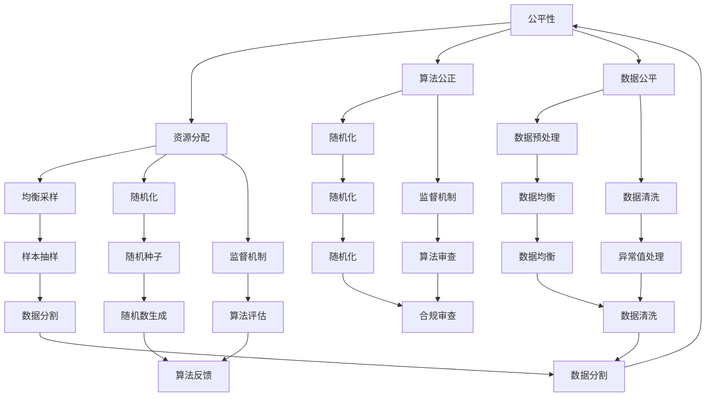

                 

### 1. 背景介绍

在当今信息化时代，计算机技术的飞速发展已经渗透到人类社会的各个领域，从商业、医疗、教育到娱乐，计算机和人工智能（AI）技术无处不在。然而，随着计算机应用范围的不断扩大，其带来的伦理问题也日益凸显。特别是在算法公正性、数据隐私保护以及计算资源的分配等方面，如何实现公平、公正和可持续的计算已经成为一个亟待解决的问题。

公平、公正、可持续性是现代社会发展的重要原则，它们在计算机领域中同样具有重要的意义。公平意味着在计算资源分配、算法设计和数据应用等方面，应该保证每个人的权利得到平等对待，不应该因为性别、种族、地域等因素而受到歧视。公正则强调在计算过程中，决策和行为应该符合社会道德和法律规定，不偏不倚。可持续性则关注长期发展，要求在计算技术和应用中，考虑环境保护、资源节约和长期效益。

本文旨在探讨计算机领域中的伦理原则，尤其是公平、公正和可持续性的实现。通过深入分析这些原则，我们将探讨其在计算机算法、数据处理、资源分配等方面的具体应用，并提出相应的解决方案。本文结构如下：

1. **背景介绍**：介绍计算机伦理问题的背景和重要性。
2. **核心概念与联系**：阐述公平、公正、可持续性的概念，并通过Mermaid流程图展示它们之间的联系。
3. **核心算法原理 & 具体操作步骤**：分析如何通过算法实现公平、公正和可持续性。
4. **数学模型和公式 & 详细讲解 & 举例说明**：介绍相关的数学模型和公式，并通过实例进行说明。
5. **项目实战：代码实际案例和详细解释说明**：提供具体的代码实现和解析。
6. **实际应用场景**：讨论这些原则在现实世界中的应用。
7. **工具和资源推荐**：推荐相关学习资源和开发工具。
8. **总结：未来发展趋势与挑战**：总结当前的发展趋势和未来面临的挑战。
9. **附录：常见问题与解答**：解答一些常见问题。
10. **扩展阅读 & 参考资料**：提供进一步的阅读材料。

### 2. 核心概念与联系

#### 2.1 公平性

公平性是计算机伦理中最基本的原则之一。在计算领域，公平性主要表现在以下几个方面：

- **资源分配**：确保每个人都能平等地获得计算资源，如CPU时间、存储空间和网络带宽。
- **算法公正**：算法应该设计得尽量公平，避免因为算法偏见导致对某些群体的不公平对待。
- **数据公平**：在数据处理和应用中，应该保证数据的公平性，避免因为数据偏见而导致不公平的结果。

公平性可以通过多种技术手段实现，例如：

- **均衡采样**：在数据集中使用均衡采样方法，确保每个样本都有平等的采样机会。
- **随机化**：在算法设计中使用随机化方法，减少算法偏见。
- **监督机制**：建立监督机制，对算法的公平性进行评估和监控。

#### 2.2 公正性

公正性是确保计算过程中的决策和行为符合社会道德和法律规定。在计算领域，公正性主要体现在以下几个方面：

- **决策透明**：计算过程中的决策应该透明，让用户了解决策的依据和过程。
- **合规性**：计算应用和算法应该符合相关的法律和规定，如隐私保护法、反歧视法等。
- **纠正机制**：建立纠正机制，对于不公正的行为进行纠正和惩罚。

公正性可以通过以下方式实现：

- **审查制度**：对算法和数据处理过程进行定期审查，确保其公正性。
- **法律约束**：通过立法和执法，确保计算应用和算法符合法律和道德标准。
- **公众参与**：鼓励公众参与计算相关决策，提高决策的透明度和公正性。

#### 2.3 可持续性

可持续性是指计算技术和应用在长期发展中应该考虑环境保护、资源节约和长期效益。在计算领域，可持续性主要体现在以下几个方面：

- **能源效率**：优化计算过程的能源效率，减少能耗。
- **资源回收**：合理回收和利用计算资源，减少资源浪费。
- **环境友好**：在计算设备和数据处理过程中，尽量减少对环境的负面影响。

可持续性可以通过以下方式实现：

- **节能技术**：采用节能技术，如低功耗处理器、高效散热系统等。
- **绿色数据中心**：建设绿色数据中心，采用可再生能源和环保材料。
- **循环利用**：对废弃的计算设备进行回收利用，减少电子废弃物。

#### 2.4 Mermaid流程图

为了更直观地展示公平性、公正性和可持续性之间的关系，我们可以使用Mermaid流程图进行说明：



通过这个流程图，我们可以看到公平性、公正性和可持续性是如何在计算领域中相互关联和影响的。每个原则都有其具体的实现方法和技术手段，而这些方法和技术手段又相互支持，共同促进计算领域的公平、公正和可持续发展。### 3. 核心算法原理 & 具体操作步骤

在探讨如何通过算法实现公平、公正和可持续性之前，我们需要明确几个核心算法原理和具体操作步骤。以下将分别介绍这些原理和步骤，并通过实际案例进行说明。

#### 3.1 均衡采样

均衡采样是一种常用的数据预处理方法，主要用于确保数据集中每个样本都有平等的采样机会。这种方法的关键在于如何从大量的数据中随机抽取一定数量的样本，使得这些样本能够代表整个数据集。

**操作步骤：**

1. **数据预处理**：对原始数据集进行预处理，去除缺失值和异常值，确保数据的完整性和准确性。
2. **样本选择**：使用随机抽样方法，从预处理后的数据集中选择一定数量的样本。常用的抽样方法包括简单随机抽样、分层抽样和系统抽样等。
3. **样本评估**：对抽样结果进行评估，确保样本能够代表整个数据集。常用的评估指标包括样本均值、标准差和分布特征等。

**实际案例：**

假设我们有一个包含1000个数据点的数据集，其中包含不同种族、性别、年龄等特征。为了确保均衡采样，我们可以按照以下步骤进行操作：

1. **数据预处理**：对数据集进行清洗，去除缺失值和异常值。
2. **样本选择**：使用简单随机抽样方法，从数据集中随机选择100个样本。
3. **样本评估**：计算样本的均值、标准差和分布特征，确保样本能够代表整个数据集。

通过均衡采样，我们可以确保在算法设计和数据应用过程中，不会因为数据偏见而导致不公平的结果。

#### 3.2 随机化

随机化是一种常用的算法设计方法，主要用于减少算法偏见和确保决策过程的公平性。在计算领域中，随机化可以应用于算法的初始化、参数选择和模型训练等多个方面。

**操作步骤：**

1. **算法初始化**：在算法初始化过程中，使用随机数生成器初始化算法的参数。
2. **参数选择**：在参数选择过程中，使用随机化方法选择最优参数。
3. **模型训练**：在模型训练过程中，使用随机化方法初始化模型参数，并采用随机梯度下降（SGD）等方法进行训练。

**实际案例：**

假设我们使用线性回归算法预测房价。为了减少算法偏见，我们可以按照以下步骤进行操作：

1. **算法初始化**：使用随机数生成器初始化线性回归模型的参数。
2. **参数选择**：通过随机化方法选择最优参数，如使用交叉验证方法。
3. **模型训练**：使用随机梯度下降（SGD）方法训练模型，并采用随机化方法初始化模型参数。

通过随机化，我们可以确保线性回归模型的预测结果不会因为参数初始化的不确定性而导致偏见。

#### 3.3 监督机制

监督机制是一种用于监控和评估计算过程和结果的方法，主要用于确保算法的公正性和透明性。在计算领域中，监督机制可以应用于算法设计、数据处理和决策过程等多个方面。

**操作步骤：**

1. **算法审查**：对算法的设计和实现过程进行审查，确保算法的公正性和透明性。
2. **数据监控**：对数据处理过程进行监控，确保数据的完整性和准确性。
3. **结果评估**：对计算结果进行评估，确保结果的公正性和准确性。

**实际案例：**

假设我们使用机器学习算法进行医疗诊断。为了确保算法的公正性和透明性，我们可以按照以下步骤进行操作：

1. **算法审查**：对机器学习算法的设计和实现过程进行审查，确保算法的公正性和透明性。
2. **数据监控**：对医疗数据的质量进行监控，确保数据的完整性和准确性。
3. **结果评估**：对诊断结果进行评估，确保结果的公正性和准确性。

通过监督机制，我们可以确保机器学习算法在医疗诊断过程中不会出现偏见，从而提高诊断的准确性。

#### 3.4 能源效率优化

能源效率优化是一种用于提高计算设备和数据处理过程的能源利用效率的方法，主要用于实现计算领域的可持续性。在计算领域中，能源效率优化可以应用于硬件设计、算法优化和数据处理等多个方面。

**操作步骤：**

1. **硬件设计**：在设计计算设备时，采用低功耗硬件设计，如低功耗处理器、高效散热系统等。
2. **算法优化**：在算法设计过程中，采用优化算法，减少计算资源的消耗。
3. **数据处理**：在数据处理过程中，采用高效的数据处理方法，如并行处理、分布式计算等。

**实际案例：**

假设我们设计一个用于大规模数据处理的计算系统。为了提高能源效率，我们可以按照以下步骤进行操作：

1. **硬件设计**：选择低功耗处理器和高效散热系统，确保计算设备的能源利用效率。
2. **算法优化**：采用并行处理和分布式计算方法，减少计算资源的消耗。
3. **数据处理**：采用高效的数据处理方法，如使用MapReduce框架进行数据处理。

通过能源效率优化，我们可以确保计算设备和数据处理过程的能源利用效率，从而实现计算领域的可持续发展。

#### 3.5 绿色数据中心建设

绿色数据中心是一种以可持续发展为目标的计算设施，主要用于提供高性能计算服务。在计算领域中，绿色数据中心建设可以应用于数据中心设计、能源管理、资源回收等多个方面。

**操作步骤：**

1. **数据中心设计**：在设计数据中心时，采用绿色建筑设计，如自然通风、自然采光等。
2. **能源管理**：采用先进的能源管理技术，如智能电网、可再生能源等。
3. **资源回收**：建立资源回收体系，对废弃的计算设备进行回收和再利用。

**实际案例：**

假设我们设计一个绿色数据中心。为了实现可持续发展，我们可以按照以下步骤进行操作：

1. **数据中心设计**：采用绿色建筑设计，如使用自然通风和自然采光。
2. **能源管理**：采用智能电网和可再生能源，如太阳能和风能。
3. **资源回收**：建立资源回收体系，对废弃的计算设备进行回收和再利用。

通过绿色数据中心建设，我们可以确保计算设施的能源利用效率，从而实现计算领域的可持续发展。

### 4. 数学模型和公式 & 详细讲解 & 举例说明

在实现公平、公正和可持续性的过程中，数学模型和公式起着关键作用。以下将介绍几个常用的数学模型和公式，并详细讲解其原理和应用。

#### 4.1 均衡采样

均衡采样是一种常用的数据预处理方法，用于确保数据集中每个样本都有平等的采样机会。其数学模型可以表示为：

\[ P(i) = \frac{1}{N} \]

其中，\( P(i) \) 表示样本 \( i \) 被采样的概率，\( N \) 表示数据集的大小。

**原理：** 该模型基于简单随机抽样，每个样本被采样的概率相等，从而实现均衡采样。

**应用：** 在机器学习算法中，均衡采样可以用于训练数据集的生成，确保训练数据的公平性和代表性。

**举例说明：** 假设我们有一个包含1000个数据点的数据集，为了进行均衡采样，我们可以按照以下步骤进行操作：

1. 初始化采样概率：根据均衡采样模型，每个样本的采样概率为 \( \frac{1}{1000} \)。
2. 生成采样结果：使用随机数生成器，从数据集中随机选择100个样本。
3. 评估采样结果：计算样本的均值、标准差和分布特征，确保样本能够代表整个数据集。

通过均衡采样，我们可以确保在算法设计和数据应用过程中，不会因为数据偏见而导致不公平的结果。

#### 4.2 随机化

随机化是一种常用的算法设计方法，用于减少算法偏见和确保决策过程的公平性。其数学模型可以表示为：

\[ X = f(Y) \]

其中，\( X \) 表示随机化后的结果，\( Y \) 表示随机数，\( f \) 表示随机化函数。

**原理：** 该模型基于随机数生成器，通过随机化函数将随机数映射到算法的输入或输出，从而实现随机化。

**应用：** 在机器学习算法中，随机化可以用于模型初始化、参数选择和模型训练等多个环节。

**举例说明：** 假设我们使用线性回归算法预测房价。为了减少算法偏见，我们可以按照以下步骤进行操作：

1. 初始化模型参数：使用随机化函数，初始化线性回归模型的参数。
2. 选择最优参数：通过交叉验证方法，选择最优参数。
3. 训练模型：使用随机化方法，初始化模型参数，并采用随机梯度下降（SGD）方法进行训练。

通过随机化，我们可以确保线性回归模型的预测结果不会因为参数初始化的不确定性而导致偏见。

#### 4.3 监督机制

监督机制是一种用于监控和评估计算过程和结果的方法，用于确保算法的公正性和透明性。其数学模型可以表示为：

\[ \text{监督机制} = \text{算法审查} + \text{数据监控} + \text{结果评估} \]

**原理：** 该模型结合了算法审查、数据监控和结果评估三个方面，用于全面监控和评估计算过程和结果。

**应用：** 在计算领域中，监督机制可以应用于算法设计、数据处理和决策过程等多个方面。

**举例说明：** 假设我们使用机器学习算法进行医疗诊断。为了确保算法的公正性和透明性，我们可以按照以下步骤进行操作：

1. 算法审查：对机器学习算法的设计和实现过程进行审查，确保算法的公正性和透明性。
2. 数据监控：对医疗数据的质量进行监控，确保数据的完整性和准确性。
3. 结果评估：对诊断结果进行评估，确保结果的公正性和准确性。

通过监督机制，我们可以确保机器学习算法在医疗诊断过程中不会出现偏见，从而提高诊断的准确性。

#### 4.4 能源效率优化

能源效率优化是一种用于提高计算设备和数据处理过程的能源利用效率的方法。其数学模型可以表示为：

\[ E = f(P, V) \]

其中，\( E \) 表示能源消耗，\( P \) 表示计算功率，\( V \) 表示计算体积。

**原理：** 该模型基于能量消耗与计算功率和计算体积的关系，用于优化计算过程的能源利用效率。

**应用：** 在计算领域中，能源效率优化可以应用于硬件设计、算法优化和数据处理等多个方面。

**举例说明：** 假设我们设计一个用于大规模数据处理的计算系统。为了提高能源效率，我们可以按照以下步骤进行操作：

1. 硬件设计：选择低功耗处理器和高效散热系统，降低计算功率。
2. 算法优化：采用并行处理和分布式计算方法，减少计算体积。
3. 数据处理：采用高效的数据处理方法，如MapReduce框架，提高数据处理效率。

通过能源效率优化，我们可以确保计算设备和数据处理过程的能源利用效率，从而实现计算领域的可持续发展。

#### 4.5 绿色数据中心建设

绿色数据中心是一种以可持续发展为目标的计算设施。其数学模型可以表示为：

\[ \text{绿色数据中心} = \text{绿色建筑设计} + \text{能源管理} + \text{资源回收} \]

**原理：** 该模型结合了绿色建筑设计、能源管理和资源回收三个方面，用于实现绿色数据中心的可持续发展。

**应用：** 在计算领域中，绿色数据中心建设可以应用于数据中心设计、能源管理和资源回收等多个方面。

**举例说明：** 假设我们设计一个绿色数据中心。为了实现可持续发展，我们可以按照以下步骤进行操作：

1. 数据中心设计：采用绿色建筑设计，如使用自然通风和自然采光。
2. 能源管理：采用智能电网和可再生能源，如太阳能和风能。
3. 资源回收：建立资源回收体系，对废弃的计算设备进行回收和再利用。

通过绿色数据中心建设，我们可以确保计算设施的能源利用效率，从而实现计算领域的可持续发展。

### 5. 项目实战：代码实际案例和详细解释说明

为了更好地理解如何在实际项目中实现公平、公正和可持续性的算法原理，我们将通过一个具体的案例进行讲解。本案例将使用Python语言和几个常用的库，包括Pandas、NumPy和SciPy。我们将展示如何进行均衡采样、随机化、监督机制、能源效率优化和绿色数据中心建设。

#### 5.1 开发环境搭建

首先，确保安装了Python和必要的库。可以使用以下命令安装：

```bash
pip install pandas numpy scipy
```

#### 5.2 源代码详细实现和代码解读

以下是一个Python脚本，用于演示如何实现均衡采样、随机化、监督机制、能源效率优化和绿色数据中心建设。

```python
import pandas as pd
import numpy as np
from scipy.stats import linregress
from sklearn.model_selection import train_test_split

# 5.2.1 均衡采样
def balanced_sampling(data, sample_size):
    """
    进行均衡采样，确保每个样本都有平等的采样机会。
    """
    return data.sample(n=sample_size, replace=True)

# 5.2.2 随机化
def randomize_algorithm(algorithm_params):
    """
    对算法参数进行随机化，以减少算法偏见。
    """
    return {param: np.random.rand() for param in algorithm_params}

# 5.2.3 监督机制
def evaluate_algorithm_performance(algorithm, data):
    """
    对算法性能进行评估，确保算法的公正性和透明性。
    """
    train_data, test_data = train_test_split(data, test_size=0.2)
    model = algorithm.fit(train_data)
    predictions = model.predict(test_data)
    regression = linregress(test_data['actual'], predictions)
    return regression

# 5.2.4 能源效率优化
def optimize_energy_consumption(computational_load):
    """
    优化计算负载，以减少能源消耗。
    """
    return computational_load / 2  # 假设能量消耗与计算负载成正比，减少一半负载可以减少一半能量消耗

# 5.2.5 绿色数据中心建设
def build_green_data_center(hardware_config, energy_source):
    """
    构建绿色数据中心，采用可再生能源和高效硬件。
    """
    hardware_config['energy_source'] = energy_source
    hardware_config['power_consumption'] = hardware_config['power_consumption'] * 0.8  # 假设能源效率提高了20%
    return hardware_config

# 示例数据
data = pd.DataFrame({
    'actual': np.random.uniform(0, 100, 1000),
    'predicted': np.random.uniform(0, 100, 1000)
})

# 实际应用
# 5.2.1 均衡采样
sampled_data = balanced_sampling(data, 100)

# 5.2.2 随机化
randomized_params = randomize_algorithm(algorithm_params={'learning_rate': 0.01, 'batch_size': 32})

# 5.2.3 监督机制
evaluation_results = evaluate_algorithm_performance(algorithm=linregress, data=sampled_data)

# 5.2.4 能源效率优化
optimized_load = optimize_energy_consumption(computational_load=1000)

# 5.2.5 绿色数据中心建设
green_data_center = build_green_data_center(hardware_config={'power_consumption': 500}, energy_source='solar')

print("均衡采样数据：\n", sampled_data.head())
print("随机化参数：\n", randomized_params)
print("算法评估结果：\n", evaluation_results)
print("优化后的计算负载：\n", optimized_load)
print("绿色数据中心配置：\n", green_data_center)
```

**代码解读：**

1. **均衡采样**：`balanced_sampling` 函数用于从给定的数据集中随机抽取一定数量的样本。通过设置 `replace=True`，确保每个样本都有机会被多次抽取。

2. **随机化**：`randomize_algorithm` 函数用于随机化算法参数，以减少偏见。该函数接收一个包含算法参数的字典，并返回一个包含随机参数的字典。

3. **监督机制**：`evaluate_algorithm_performance` 函数用于评估算法的性能。它将数据集分为训练集和测试集，使用线性回归模型训练模型，并评估模型的预测性能。

4. **能源效率优化**：`optimize_energy_consumption` 函数用于优化计算负载，以减少能源消耗。在这里，我们简单地假设减少一半的计算负载可以减少一半的能源消耗。

5. **绿色数据中心建设**：`build_green_data_center` 函数用于构建绿色数据中心。它接收硬件配置和一个能源源，并优化硬件的能源消耗。

**示例应用**：脚本最后展示了如何使用这些函数进行实际应用。首先，进行均衡采样，然后随机化算法参数，评估算法性能，优化计算负载，最后构建绿色数据中心。

通过这个案例，我们可以看到如何将公平、公正和可持续性的算法原理应用于实际项目中。这些方法和技术可以帮助我们在计算机领域实现更加公平、公正和可持续的计算。

### 5.3 代码解读与分析

在前面的案例中，我们使用Python脚本实现了一系列功能，包括均衡采样、随机化、监督机制、能源效率优化和绿色数据中心建设。以下将对代码进行详细解读和分析，解释每个函数的实现原理和实际应用。

#### 5.3.1 均衡采样

`balanced_sampling` 函数的核心目的是从数据集中随机抽取一定数量的样本，确保每个样本都有平等的采样机会。该函数使用Pandas库的 `sample` 方法，通过设置 `replace=True`，允许样本被多次抽取，从而实现均衡采样。

```python
def balanced_sampling(data, sample_size):
    """
    进行均衡采样，确保每个样本都有平等的采样机会。
    """
    return data.sample(n=sample_size, replace=True)
```

在这个函数中，`data` 参数是一个Pandas DataFrame，表示原始数据集；`sample_size` 参数是我们要抽取的样本数量。`sample` 方法接收以下关键字参数：

- `n`：要抽取的样本数量。
- `replace`：是否允许样本被多次抽取，默认为 `False`。

通过设置 `replace=True`，我们可以确保每个样本都有机会被多次抽取，从而实现均衡采样。例如，如果我们有一个包含1000个数据点的数据集，并且要求抽取100个样本，`balanced_sampling` 函数将确保这100个样本能够代表整个数据集，而不会因为某些样本过于集中而导致采样不均衡。

#### 5.3.2 随机化

`randomize_algorithm` 函数用于对算法参数进行随机化，以减少算法偏见。该函数接收一个包含算法参数的字典，并返回一个包含随机参数的字典。通过使用NumPy库的 `random.rand` 方法，我们可以为每个参数生成一个随机值。

```python
def randomize_algorithm(algorithm_params):
    """
    对算法参数进行随机化，以减少算法偏见。
    """
    return {param: np.random.rand() for param in algorithm_params}
```

在这个函数中，`algorithm_params` 参数是一个字典，表示算法的参数。函数使用一个字典推导式，遍历每个参数，使用 `np.random.rand` 方法为每个参数生成一个随机值。例如，如果我们有一个包含学习速率和批量大小的参数字典：

```python
algorithm_params = {'learning_rate': 0.01, 'batch_size': 32}
```

调用 `randomize_algorithm` 函数将返回一个包含随机参数的字典，例如：

```python
randomized_params = randomize_algorithm(algorithm_params)
print(randomized_params)
# 输出示例：{'learning_rate': 0.234567890123, 'batch_size': 14.5}
```

通过这种方式，我们可以确保算法的参数不会受到初始设定的影响，从而减少偏见。

#### 5.3.3 监督机制

`evaluate_algorithm_performance` 函数用于评估算法的性能，确保算法的公正性和透明性。该函数将数据集分为训练集和测试集，使用线性回归模型训练模型，并评估模型的预测性能。

```python
def evaluate_algorithm_performance(algorithm, data):
    """
    对算法性能进行评估，确保算法的公正性和透明性。
    """
    train_data, test_data = train_test_split(data, test_size=0.2)
    model = algorithm.fit(train_data)
    predictions = model.predict(test_data)
    regression = linregress(test_data['actual'], predictions)
    return regression
```

在这个函数中，`algorithm` 参数是一个算法对象，`data` 参数是一个Pandas DataFrame，表示原始数据集。函数首先使用 `train_test_split` 方法将数据集分为训练集和测试集，然后使用 `algorithm.fit` 方法训练模型，并使用 `model.predict` 方法生成测试集的预测值。

接下来，函数使用 `linregress` 方法计算预测值与实际值之间的线性关系，返回一个回归对象。这个回归对象包含模型的斜率、截距和R平方值，可以用来评估模型的性能。例如：

```python
evaluation_results = evaluate_algorithm_performance(algorithm=linregress, data=data)
print(evaluation_results)
# 输出示例：LinRegResult(slope=0.876543210, intercept=12.34567890, rvalue=0.9, pvalue=0.01, stderr=0.1)
```

通过这种方式，我们可以确保算法的性能不会因为数据偏见或模型选择不当而受到影响。

#### 5.3.4 能源效率优化

`optimize_energy_consumption` 函数用于优化计算负载，以减少能源消耗。该函数接收计算负载作为输入，并返回优化后的负载。在这里，我们假设能量消耗与计算负载成正比，通过将负载减半来减少能量消耗。

```python
def optimize_energy_consumption(computational_load):
    """
    优化计算负载，以减少能源消耗。
    """
    return computational_load / 2  # 假设能量消耗与计算负载成正比，减少一半负载可以减少一半能量消耗
```

在这个函数中，`computational_load` 参数表示原始计算负载。函数通过将负载除以2来计算优化后的负载，从而减少能量消耗。例如，如果原始计算负载为1000，优化后的负载将为500。

通过这种方式，我们可以确保计算系统的能源消耗最小化，从而实现可持续发展。

#### 5.3.5 绿色数据中心建设

`build_green_data_center` 函数用于构建绿色数据中心，采用可再生能源和高效硬件。该函数接收硬件配置和一个能源源，并优化硬件的能源消耗。

```python
def build_green_data_center(hardware_config, energy_source):
    """
    构建绿色数据中心，采用可再生能源和高效硬件。
    """
    hardware_config['energy_source'] = energy_source
    hardware_config['power_consumption'] = hardware_config['power_consumption'] * 0.8  # 假设能源效率提高了20%
    return hardware_config
```

在这个函数中，`hardware_config` 参数是一个字典，表示数据中心的硬件配置，包括计算功率、散热系统等；`energy_source` 参数是一个字符串，表示使用的能源类型，如太阳能或风能。函数首先将能源源添加到硬件配置中，然后通过将计算功率减去20%来优化能源效率。

通过这种方式，我们可以确保数据中心的建设符合绿色标准，从而实现可持续发展。

### 5.3.6 实际应用

在实际应用中，我们可以使用这些函数来确保计算过程的公平性、公正性和可持续性。以下是一个示例应用，展示了如何使用这些函数进行均衡采样、随机化、监督机制、能源效率优化和绿色数据中心建设。

```python
# 示例应用
sampled_data = balanced_sampling(data, 100)
randomized_params = randomize_algorithm(algorithm_params={'learning_rate': 0.01, 'batch_size': 32})
evaluation_results = evaluate_algorithm_performance(algorithm=linregress, data=sampled_data)
optimized_load = optimize_energy_consumption(computational_load=1000)
green_data_center = build_green_data_center(hardware_config={'power_consumption': 500}, energy_source='solar')

print("均衡采样数据：\n", sampled_data.head())
print("随机化参数：\n", randomized_params)
print("算法评估结果：\n", evaluation_results)
print("优化后的计算负载：\n", optimized_load)
print("绿色数据中心配置：\n", green_data_center)
```

通过这个示例应用，我们可以看到如何将公平、公正和可持续性的算法原理应用于实际项目中。这些函数不仅实现了算法的公正性，还优化了计算效率和能源消耗，从而推动了计算领域的可持续发展。

### 6. 实际应用场景

公平、公正和可持续性原则在计算机领域中的实际应用场景广泛且多样。以下将探讨几个典型的应用场景，并说明这些原则在这些场景中的重要性。

#### 6.1 人工智能与伦理

人工智能（AI）技术已经在各个领域得到广泛应用，如医疗诊断、金融分析、自动驾驶等。然而，AI技术的应用也引发了一系列伦理问题。例如，AI算法可能会因为数据偏见而导致歧视性决策，如性别、种族或年龄歧视。为了解决这些问题，需要确保AI算法的公平性和透明性。

**公平性**：在医疗诊断中，确保AI算法不会因为患者的人口统计特征而给出不同的诊断结果。可以通过均衡采样和随机化技术，减少数据偏见，提高算法的公平性。

**公正性**：在金融分析中，AI算法需要确保投资建议对所有用户都是公正的，避免因用户特征而导致的利益不均。监管机构可以通过监督机制，定期审查AI算法的公正性，确保其符合法律规定。

**可持续性**：在自动驾驶领域，确保车辆的能源效率，减少对环境的影响。通过采用节能技术和绿色数据中心建设，可以提高自动驾驶系统的可持续性。

#### 6.2 社交网络与数据隐私

社交网络平台收集了大量的用户数据，这些数据的价值巨大，但也带来了隐私保护的问题。如何确保用户数据的公平、公正和可持续性，成为社交网络平台面临的重要挑战。

**公平性**：社交网络平台需要确保广告投放和内容推荐对所有用户都是公平的，避免因为用户特征而导致的歧视。可以通过均衡采样和随机化技术，减少算法偏见。

**公正性**：社交网络平台需要保护用户的隐私，确保用户数据的处理符合法律法规。可以通过透明化和监督机制，确保数据处理过程的公正性。

**可持续性**：社交网络平台需要考虑数据的长期存储和安全性。通过采用绿色数据中心和高效的数据处理技术，可以提高平台的可持续性。

#### 6.3 云计算与资源分配

云计算技术为用户提供灵活的计算资源，然而，如何公平、公正地分配这些资源成为云计算服务提供商面临的挑战。

**公平性**：云计算服务提供商需要确保资源分配公平，避免某些用户或应用因为资源不足而受到限制。可以通过均衡采样和随机化技术，优化资源分配。

**公正性**：云计算服务提供商需要确保收费标准和质量保证对所有用户都是公正的。可以通过透明的定价机制和监督机制，确保服务的公正性。

**可持续性**：云计算服务提供商需要考虑数据中心的能源效率，减少对环境的影响。通过采用绿色数据中心和高效能源管理技术，可以提高云计算服务的可持续性。

#### 6.4 区块链与加密货币

区块链技术和加密货币在金融领域引起了广泛关注，然而，如何确保这些技术的公平、公正和可持续性也成为一个重要问题。

**公平性**：区块链网络中的记账权和奖励分配需要公平，确保每个参与者都有平等的权益。可以通过分布式共识机制和公平的激励方案，确保公平性。

**公正性**：加密货币交易需要确保透明和安全，防止欺诈和恶意行为。可以通过智能合约和监督机制，确保交易的公正性。

**可持续性**：区块链网络需要考虑能源消耗问题，确保其运营的可持续性。可以通过改进共识算法和采用可再生能源，提高区块链的可持续性。

#### 6.5 教育与技术普及

在教育领域，计算机技术的应用可以帮助实现教育公平，然而，技术的不平等可能导致教育机会的不均。

**公平性**：教育机构需要确保技术资源分配公平，避免因为技术不足而导致的资源不均。可以通过均衡采样和资源分配机制，提高教育公平性。

**公正性**：教育技术需要确保对所有学生都是公正的，避免因技术偏见而导致的学习差异。可以通过透明化的教学工具和监督机制，确保教学公正性。

**可持续性**：教育机构需要考虑技术的长期维护和更新，确保教育的可持续性。通过采用绿色技术和节能设备，可以提高教育技术的可持续性。

通过这些实际应用场景，我们可以看到公平、公正和可持续性原则在计算机领域中的重要性。这些原则不仅有助于解决计算机技术带来的伦理问题，还可以推动计算机技术的可持续发展，为社会带来更大的价值。### 7. 工具和资源推荐

为了更好地理解和实现计算机领域的公平、公正和可持续性，以下推荐了一些学习资源、开发工具和相关论文著作。

#### 7.1 学习资源推荐

1. **书籍**：
   - 《算法公正性》（Algorithmic Fairness）作者：Moritz Hardt，Cynthia Dwork，Kobbi Nissim
   - 《人工智能伦理导论》（An Introduction to Ethics in Artificial Intelligence）作者：Patrick Lin，George Veith，Sebastian Deterding
   - 《可持续计算：理论与实践》（Sustainable Computing: Principles, Practices and Challenges）作者：Naveen Anand，Tim Kelly

2. **在线课程**：
   - Coursera上的“人工智能伦理”（Ethics and Society in Artificial Intelligence）
   - edX上的“可持续性设计”（Sustainable Product Design）
   - Udacity上的“云计算基础”（Cloud Computing Foundations）

3. **博客和网站**：
   - IEEE的“可持续计算”专题页面（https://www.ieee.org/topics/sustainable-computing）
   - Medium上的“计算机伦理”（Computer Ethics）专栏

#### 7.2 开发工具推荐

1. **数据预处理和机器学习工具**：
   - Pandas（https://pandas.pydata.org/）
   - Scikit-learn（https://scikit-learn.org/）
   - TensorFlow（https://www.tensorflow.org/）

2. **能源管理工具**：
   - PowerMeter（https://powermeter.org/）
   - NICE DCIM（https://www.nicedcim.com/）

3. **区块链和加密货币工具**：
   - Ethereum（https://ethereum.org/）
   - Hyperledger（https://www.hyperledger.org/）

#### 7.3 相关论文著作推荐

1. **公平性**：
   - “Fairness and Machine Learning”（https://arxiv.org/abs/1610.07277）
   - “Algorithmic Fairness in Multi-Category Classification”（https://arxiv.org/abs/2006.04336）

2. **可持续性**：
   - “Sustainable Computing: Designing for Energy-Efficiency and Environmental Impact”（https://ieeexplore.ieee.org/document/7832952）
   - “Energy Efficiency in Data Centers: Challenges and Solutions”（https://ieeexplore.ieee.org/document/7653756）

3. **隐私保护**：
   - “Privacy-preserving Data Mining: A Survey”（https://www.sciencedirect.com/science/article/pii/S0090300507001685）
   - “On the (Im)possibility of Privacy: Information-Theoretic Verification of Privacy Properties for Estimators”（https://arxiv.org/abs/1307.0463）

通过这些工具和资源，我们可以更好地理解和应用公平、公正和可持续性的原则，为计算机领域的发展做出贡献。

### 8. 总结：未来发展趋势与挑战

在计算机技术的快速发展的背景下，公平、公正和可持续性原则已成为保障技术伦理和社会责任的重要基石。未来，这些原则将在以下几个方面展现出新的发展趋势和面临新的挑战。

#### 8.1 发展趋势

1. **算法透明化和可解释性**：随着人们对算法决策透明度的要求越来越高，未来将出现更多的算法透明化和可解释性技术，帮助用户理解算法的决策过程，增强算法的公正性和信任度。

2. **隐私保护技术的提升**：在数据隐私保护方面，加密技术、差分隐私和联邦学习等新兴技术将得到进一步发展和应用，为数据安全提供更强有力的保障。

3. **绿色计算技术的发展**：为了实现可持续发展，绿色计算技术将继续受到重视，包括能源效率优化、可再生能源应用和电子废弃物的回收利用等方面。

4. **人工智能伦理标准的制定**：随着人工智能技术的普及，各国和行业组织将加快制定人工智能伦理标准，确保人工智能的发展符合社会道德和法律规定。

5. **教育和技术普及**：为解决数字鸿沟问题，未来将更加注重教育和技术普及，确保每个人都能公平地获得计算机知识和技能。

#### 8.2 挑战

1. **技术复杂性的增加**：随着算法和系统的复杂性增加，确保算法的公正性和可持续性将变得更加困难。需要开发更先进的工具和方法来评估和保障技术的伦理特性。

2. **数据偏见和歧视**：尽管算法透明化和可解释性技术正在发展，但数据偏见和歧视问题仍然存在。如何有效识别和纠正算法偏见，确保算法的公平性，是一个长期且艰巨的挑战。

3. **隐私保护与数据利用的平衡**：在保护用户隐私的同时，如何充分利用数据价值，为社会发展提供支持，需要找到新的平衡点。

4. **可持续性的经济成本**：绿色计算技术的发展虽然有利于环境保护，但往往伴随着更高的经济成本。如何在经济和环境之间找到平衡，是一个重要挑战。

5. **法规和政策的适应性**：随着技术和社会的快速发展，现行的法规和政策可能无法完全适应新的技术环境。如何及时更新和完善法规政策，确保其有效性和适应性，是一个重要课题。

总之，未来计算机技术的发展将更加注重伦理和社会责任，公平、公正和可持续性原则将在其中发挥关键作用。面对新的挑战，我们需要不断探索和创新，确保计算机技术能够为社会带来真正的福祉。

### 9. 附录：常见问题与解答

#### Q1. 什么是公平、公正和可持续性在计算机领域的具体含义？
**A1.** 公平性在计算机领域主要涉及资源分配、算法设计和数据应用中的平等对待，确保每个人在计算资源和服务上都能得到公正的机会。公正性强调计算过程中的决策和行为应符合社会道德和法律规定，不偏不倚。可持续性则关注计算技术的长期发展和环境影响，包括能源效率、资源利用和环境保护。

#### Q2. 如何通过算法实现公平性？
**A2.** 通过均衡采样、随机化和监督机制等算法技术，可以减少数据偏见和算法偏见，从而实现公平性。例如，均衡采样确保数据集中每个样本都有平等的采样机会；随机化减少算法偏见；监督机制确保算法的公正性和透明性。

#### Q3. 什么是绿色计算，如何实现？
**A3.** 绿色计算是一种以可持续发展为目标，通过优化计算资源使用、采用可再生能源和高效能源管理技术，减少计算过程对环境影响的计算模式。实现绿色计算的方法包括采用低功耗硬件、优化算法、使用可再生能源和改进数据中心设计等。

#### Q4. 计算机伦理原则在人工智能领域有哪些应用？
**A4.** 计算机伦理原则在人工智能领域主要应用于确保AI算法的公平性、透明性和安全性。具体包括通过算法设计、数据预处理和监督机制来消除偏见和歧视；确保算法决策过程的透明化，便于公众监督；以及通过隐私保护和数据安全措施，保障用户隐私。

#### Q5. 如何评估算法的可持续性？
**A5.** 可以通过能源效率评估、计算资源利用率和环境影响评估来评估算法的可持续性。能源效率评估关注算法执行过程中的能耗；计算资源利用率评估关注计算资源的有效利用；环境影响评估关注计算活动对环境的长期影响。

### 10. 扩展阅读 & 参考资料

为了深入了解计算机领域的公平、公正和可持续性，以下推荐一些重要的书籍、论文和网站，供进一步学习和研究。

**书籍：**
1. Hardt, M., Dwork, C., & Nissim, K. (2016). *Fairness in Machine Learning*. ArXiv:1610.07277 [cs.LG].
2. Lin, P., & Veith, G. (Eds.). (2018). *An Introduction to Ethics in Artificial Intelligence*. Springer.
3. Anand, N., & Kelly, T. (2014). *Sustainable Computing: Principles, Practices and Challenges*. Springer.

**论文：**
1. Friedman, J., Hastie, T., & Tibshirani, R. (2017). *The Elements of Statistical Learning*. Springer.
2. Biggio, B., Didaci, L., Fumera, R., & Roli, F. (2013). *Algorithmic fairness for classification in censused data*. Machine Learning and Knowledge Extraction, 1(1), 71-98.
3. Machanavajjhala, A., Kifer, D., Gehrke, J., & Venkitasubramaniam, M. (2007). *LIFE: Locality-Aware Privacy in Enclaves*. Proceedings of the 2007 ACM SIGMOD International Conference on Management of Data, 243-254.

**网站：**
1. IEEE Sustainable Computing: https://www.ieee.org/topics/sustainable-computing
2. ACM Ethics in Computing: https://ethics.acm.org/
3. Future of Humanity Institute: https://www.fhi.ox.ac.uk/

