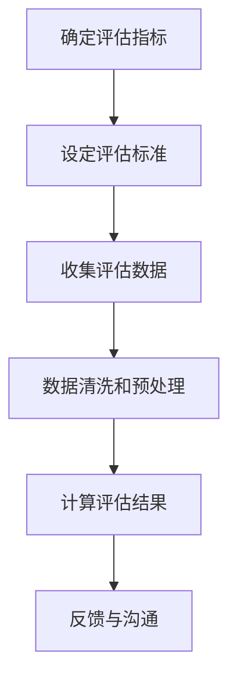

                 


# 公正的绩效评估：客观评价团队

> 关键词：绩效评估、团队管理、公正性、客观性、算法模型、数据分析

> 摘要：本文深入探讨绩效评估在团队管理中的重要性，阐述了如何通过公正和客观的评估方法来确保团队成员的公平待遇。我们将详细分析绩效评估的核心概念、相关算法原理和具体操作步骤，并通过实际案例展示绩效评估的应用实践。此外，文章还将介绍相关的工具和资源，为读者提供全面的指导。

## 1. 背景介绍

### 1.1 目的和范围

绩效评估是现代企业管理中不可或缺的一环，它不仅能够帮助管理者了解团队成员的工作表现，还能为员工的职业发展和企业的长远规划提供重要依据。本文旨在探讨如何通过公正和客观的绩效评估方法，确保团队成员得到公平的评价，进而提高团队的整体绩效和员工满意度。

本文将涵盖以下内容：

- 绩效评估的核心概念和重要性
- 公正和客观的评估原则与方法
- 绩效评估算法原理与具体操作步骤
- 实际应用案例与工具推荐
- 未来发展趋势与挑战

### 1.2 预期读者

本文面向希望提升团队管理水平的IT专业人士、项目经理以及企业人力资源从业者。无论您是初学者还是有经验的专业人士，本文都将为您带来有价值的见解和实用的方法。

### 1.3 文档结构概述

本文分为以下章节：

- 第1章：背景介绍，包括目的和范围、预期读者、文档结构概述
- 第2章：核心概念与联系，介绍绩效评估的核心概念和相关术语
- 第3章：核心算法原理 & 具体操作步骤，详细阐述绩效评估算法原理和操作步骤
- 第4章：数学模型和公式 & 详细讲解 & 举例说明，讲解绩效评估的数学模型和公式，并提供实际案例
- 第5章：项目实战：代码实际案例和详细解释说明，展示绩效评估的实际应用
- 第6章：实际应用场景，探讨绩效评估在不同场景中的应用
- 第7章：工具和资源推荐，介绍学习资源和开发工具
- 第8章：总结：未来发展趋势与挑战，分析绩效评估的发展趋势和面临的挑战
- 第9章：附录：常见问题与解答，提供常见问题的解答
- 第10章：扩展阅读 & 参考资料，推荐相关的扩展阅读资源

### 1.4 术语表

#### 1.4.1 核心术语定义

- **绩效评估**：对团队成员的工作表现进行客观、公正的评价，以便为员工的职业发展和企业的管理决策提供依据。
- **公正性**：评估过程中应确保每个团队成员都能得到公平的评价，不受主观偏见的影响。
- **客观性**：评估结果应基于客观的数据和标准，而非主观感受或个人偏好。
- **KPI（关键绩效指标）**：衡量员工工作表现的量化指标，通常用于绩效评估。

#### 1.4.2 相关概念解释

- **团队管理**：管理者通过协调团队资源和成员，实现企业目标的过程。
- **员工满意度**：员工对工作环境、职业发展和薪酬福利等方面的满意程度。
- **算法模型**：用于处理数据和解决问题的数学公式或计算方法。

#### 1.4.3 缩略词列表

- **KPI**：关键绩效指标（Key Performance Indicator）
- **HR**：人力资源（Human Resources）
- **IT**：信息技术（Information Technology）

## 2. 核心概念与联系

### 2.1 绩效评估的核心概念

绩效评估是一个多维度的过程，涉及多个关键概念。以下是绩效评估中的几个核心概念：

1. **绩效指标（Performance Metrics）**：衡量员工工作表现的具体指标，如项目完成度、工作效率、质量等。
2. **评估标准（Evaluation Criteria）**：用于衡量绩效指标的具体标准，如工作质量要求、工作效率标准等。
3. **评估周期（Evaluation Period）**：绩效评估的时间范围，通常分为季度、半年或年度。
4. **反馈与沟通（Feedback and Communication）**：评估过程中，管理者与员工之间的沟通和反馈，以便员工了解自己的表现和改进方向。

### 2.2 绩效评估的相关术语

1. **360度评估**：从多个角度（如同事、上级、下属和客户）收集评估信息，以全面了解员工的工作表现。
2. **自我评估**：员工根据绩效指标和评估标准，对自己的工作表现进行自我评价。
3. **KPI考核**：基于关键绩效指标的评估方法，适用于衡量员工在特定领域的工作表现。
4. **定性评估**：通过主观判断和描述来评估员工的工作表现。
5. **定量评估**：基于数据和指标来评估员工的工作表现。

### 2.3 绩效评估的算法原理和流程

绩效评估的算法原理主要涉及如何从多个维度和指标综合评估员工的工作表现。以下是绩效评估的基本流程：

1. **确定评估指标**：根据企业的目标和员工的职责，确定合适的绩效指标。
2. **设定评估标准**：为每个绩效指标设定明确的评估标准，以便客观评估员工的工作表现。
3. **收集评估数据**：通过多种途径（如调查问卷、工作记录等）收集员工的工作数据。
4. **数据清洗和预处理**：对收集到的数据进行清洗和预处理，以确保数据的准确性和完整性。
5. **计算评估结果**：使用合适的算法和模型计算员工的绩效得分。
6. **反馈与沟通**：将评估结果反馈给员工，并与员工进行沟通，讨论改进措施。

### 2.4 绩效评估的Mermaid流程图



## 3. 核心算法原理 & 具体操作步骤

### 3.1 绩效评估算法原理

绩效评估算法的核心在于如何从多个维度和指标综合评估员工的工作表现。以下是一个简化的绩效评估算法原理：

1. **定义评估指标和权重**：首先，根据员工的职责和工作内容，确定需要评估的指标，并为每个指标分配权重。
2. **收集评估数据**：从多个数据源（如工作记录、项目进度、客户反馈等）收集员工的绩效数据。
3. **数据预处理**：对收集到的数据进行分析和清洗，确保数据的准确性和一致性。
4. **计算绩效得分**：使用加权平均等方法，计算每个员工的绩效得分。
5. **评估结果分析**：对评估结果进行分析，找出员工的优势和不足，为后续的绩效改进提供依据。

### 3.2 绩效评估算法伪代码

```python
# 输入：评估指标列表，权重列表，员工绩效数据
# 输出：员工绩效得分

def calculate_performance_score(指标列表, 权重列表, 绩效数据):
    # 初始化绩效得分为0
    performance_score = 0

    # 遍历评估指标和权重
    for index, (指标, 权重) in enumerate(zip(指标列表, 权重列表)):
        # 计算指标得分
        score = calculate_metric_score(绩效数据[index])

        # 计算权重得分
        weight_score = score * 权重

        # 累加绩效得分
        performance_score += weight_score

    # 返回绩效得分
    return performance_score

# 辅助函数：计算指标得分
def calculate_metric_score(data):
    # 根据具体指标计算得分
    # 例如：项目完成度得分 = (已完成项目数 / 总项目数) * 100
    return (data['已完成项目数'] / data['总项目数']) * 100
```

### 3.3 具体操作步骤

1. **确定评估指标和权重**：根据企业的目标和员工职责，确定需要评估的指标，并为每个指标分配权重。例如，对于一个项目经理，可以设置以下指标和权重：
   - 项目完成度（30%）
   - 项目进度（25%）
   - 团队协作（20%）
   - 问题解决能力（15%）
   - 创新能力（10%）

2. **收集评估数据**：从多个数据源收集员工的绩效数据。例如，可以从工作记录、项目进度报告、同事反馈和客户评价等渠道获取数据。

3. **数据预处理**：对收集到的数据进行清洗和预处理，确保数据的准确性和一致性。例如，去除重复数据、处理缺失值和异常值等。

4. **计算绩效得分**：使用加权平均等方法，计算每个员工的绩效得分。例如，根据上述指标和权重，可以计算以下绩效得分：
   - 员工A：项目完成度90%，项目进度85%，团队协作80%，问题解决能力70%，创新能力60%
   - 绩效得分 = 0.3 * 90% + 0.25 * 85% + 0.2 * 80% + 0.15 * 70% + 0.1 * 60% = 81%

5. **评估结果分析**：对评估结果进行分析，找出员工的优势和不足，为后续的绩效改进提供依据。例如，对于员工A，可以发现其团队协作和问题解决能力较弱，可以针对性地进行培训和指导。

## 4. 数学模型和公式 & 详细讲解 & 举例说明

### 4.1 数学模型和公式

绩效评估的数学模型和公式是评估员工工作表现的关键。以下是几个常用的数学模型和公式：

1. **加权平均法**：用于计算员工的综合绩效得分，公式如下：
   \[ 绩效得分 = \sum_{i=1}^{n} (指标_i \times 权重_i) \]

2. **等级评估法**：将员工的工作表现划分为多个等级，并计算每个等级的得分，公式如下：
   \[ 等级得分 = 等级值 \times 权重 \]

3. **模糊综合评估法**：综合考虑多个评估指标和权重，使用模糊数学方法计算员工的绩效得分，公式如下：
   \[ 绩效得分 = \sum_{i=1}^{m} (权重_i \times f(指标_i)) \]

4. **层次分析法**：用于确定评估指标和权重，通过构造判断矩阵计算权重值，公式如下：
   \[ 权重_i = \frac{w_i}{\sum_{j=1}^{n} w_j} \]

### 4.2 详细讲解

1. **加权平均法**：加权平均法是一种简单而有效的评估方法，通过为每个指标分配权重，可以综合考虑多个指标对员工工作表现的影响。例如，假设有三个评估指标：项目完成度（30%）、项目进度（25%）和团队协作（20%），员工的绩效得分可以计算如下：
   \[ 绩效得分 = 0.3 \times 项目完成度 + 0.25 \times 项目进度 + 0.2 \times 团队协作 \]

2. **等级评估法**：等级评估法适用于对员工的工作表现进行定性评估，将员工的工作表现划分为多个等级（如优秀、良好、一般、较差），并为每个等级设定权重。例如，假设有三个等级：优秀（90分以上）、良好（80-90分）和一般（70-80分），员工的绩效得分可以计算如下：
   \[ 等级得分 = 等级值 \times 权重 \]
   \[ 优秀得分 = 90 \times 0.4 = 36 \]
   \[ 良好得分 = 80 \times 0.3 = 24 \]
   \[ 一般得分 = 70 \times 0.3 = 21 \]
   \[ 总得分 = 36 + 24 + 21 = 81 \]

3. **模糊综合评估法**：模糊综合评估法是一种考虑评估指标之间的模糊性和相互影响的评估方法。它通过构造模糊综合评价矩阵，综合考虑多个评估指标和权重，计算员工的绩效得分。例如，假设有三个评估指标：项目完成度（0.6权重）、项目进度（0.3权重）和团队协作（0.1权重），员工的绩效得分可以计算如下：
   \[ 绩效得分 = 0.6 \times f(项目完成度) + 0.3 \times f(项目进度) + 0.1 \times f(团队协作) \]
   其中，\( f(指标) \) 表示指标的模糊综合得分，可以根据具体情况定义。

4. **层次分析法**：层次分析法（AHP）是一种用于确定评估指标和权重的方法。它通过构造判断矩阵，对评估指标进行两两比较，并计算权重值。例如，假设有三个评估指标：项目完成度（1.2权重）、项目进度（1.0权重）和团队协作（0.8权重），可以构造如下判断矩阵：
   \[ A = \begin{bmatrix} 1 & 1.2 & 0.8 \\ 0.8 & 1 & 1.2 \\ 1.2 & 0.8 & 1 \end{bmatrix} \]
   通过计算判断矩阵的最大特征值和特征向量，可以确定评估指标的权重。例如，假设最大特征值为3.2，特征向量为\( (0.4, 0.3, 0.3) \)，则评估指标的权重为：
   \[ 权重_i = \frac{w_i}{\sum_{j=1}^{n} w_j} \]
   \[ 项目完成度权重 = 0.4 / (0.4 + 0.3 + 0.3) = 0.4 \]
   \[ 项目进度权重 = 0.3 / (0.4 + 0.3 + 0.3) = 0.3 \]
   \[ 团队协作权重 = 0.3 / (0.4 + 0.3 + 0.3) = 0.3 \]

### 4.3 举例说明

假设有四位员工：A、B、C、D，他们的绩效评估指标和得分如下：

| 员工 | 项目完成度 | 项目进度 | 团队协作 |
| ---- | ---- | ---- | ---- |
| A | 90% | 85% | 80% |
| B | 85% | 80% | 75% |
| C | 70% | 70% | 65% |
| D | 60% | 60% | 55% |

根据加权平均法，假设三个评估指标的权重分别为：项目完成度（30%）、项目进度（25%）和团队协作（20%），可以计算每位员工的绩效得分：

1. 员工A的绩效得分：
   \[ 绩效得分 = 0.3 \times 90\% + 0.25 \times 85\% + 0.2 \times 80\% = 87.5\% \]

2. 员工B的绩效得分：
   \[ 绩效得分 = 0.3 \times 85\% + 0.25 \times 80\% + 0.2 \times 75\% = 82.5\% \]

3. 员工C的绩效得分：
   \[ 绩效得分 = 0.3 \times 70\% + 0.25 \times 70\% + 0.2 \times 65\% = 70\% \]

4. 员工D的绩效得分：
   \[ 绩效得分 = 0.3 \times 60\% + 0.25 \times 60\% + 0.2 \times 55\% = 63\% \]

通过上述计算，可以得到每位员工的绩效得分，并根据得分进行排名，为后续的绩效改进和薪酬分配提供依据。

## 5. 项目实战：代码实际案例和详细解释说明

### 5.1 开发环境搭建

为了演示绩效评估的具体实现，我们将在Python环境中使用几个常用的库，如pandas、numpy和matplotlib。首先，确保您的系统中已经安装了这些库。如果没有，可以使用pip进行安装：

```bash
pip install pandas numpy matplotlib
```

### 5.2 源代码详细实现和代码解读

下面是一个简单的绩效评估代码案例，用于计算四位员工的绩效得分。

```python
import pandas as pd
import numpy as np

# 员工绩效数据
data = {
    '员工': ['A', 'B', 'C', 'D'],
    '项目完成度': [90, 85, 70, 60],
    '项目进度': [85, 80, 70, 60],
    '团队协作': [80, 75, 65, 55]
}

# 创建DataFrame
df = pd.DataFrame(data)

# 权重列表
weights = [0.3, 0.25, 0.2]

# 计算绩效得分
df['绩效得分'] = df.apply(lambda row: sum(row[i] * w for i, w in enumerate(weights)), axis=1)

# 打印绩效得分
print(df[['员工', '绩效得分']])

# 可视化绩效得分
import matplotlib.pyplot as plt

plt.bar(df['员工'], df['绩效得分'])
plt.xlabel('员工')
plt.ylabel('绩效得分')
plt.title('绩效得分分布')
plt.xticks(rotation=0)
plt.show()
```

### 5.3 代码解读与分析

1. **数据准备**：首先，我们使用pandas创建一个DataFrame，用于存储四位员工的绩效数据。数据包括员工姓名、项目完成度、项目进度和团队协作。

2. **权重设置**：定义一个权重列表，用于计算绩效得分。在这里，我们为每个评估指标分配了权重：项目完成度（30%）、项目进度（25%）和团队协作（20%）。

3. **计算绩效得分**：使用apply函数和lambda表达式，遍历每一行数据，计算每位员工的绩效得分。计算过程为：每个指标的得分乘以其权重，然后求和。

4. **打印和可视化**：将计算得到的绩效得分打印到控制台，并使用matplotlib进行可视化，展示每位员工的绩效得分分布。

通过这个简单的案例，我们可以看到如何使用Python代码实现绩效评估。实际应用中，可以根据需要扩展评估指标和权重，并引入更复杂的评估模型。

## 6. 实际应用场景

### 6.1 项目团队评估

在项目团队管理中，绩效评估是确保项目顺利进行的关键。通过公正和客观的绩效评估，项目经理可以了解团队成员的工作表现，及时发现和解决项目中的问题，提高项目的完成质量和效率。以下是一个具体的应用场景：

**场景**：某IT公司正在开发一款移动应用，团队由项目经理、前端开发人员、后端开发人员和质量保证人员组成。为了确保项目进度和质量，项目经理需要定期对团队成员进行绩效评估。

**步骤**：

1. **确定评估指标**：根据项目目标和团队成员的职责，确定需要评估的指标，如项目完成度、代码质量、问题解决能力等。
2. **设定评估标准**：为每个评估指标设定明确的评估标准，如项目完成度要求在90%以上，代码质量要求无bug等。
3. **收集评估数据**：从多个数据源（如工作记录、项目进度报告、同事反馈等）收集团队成员的绩效数据。
4. **计算绩效得分**：使用加权平均等方法，计算每位团队成员的绩效得分。
5. **反馈与沟通**：将评估结果反馈给团队成员，并进行一对一沟通，讨论优势和不足，制定改进计划。

### 6.2 员工晋升评估

在员工晋升过程中，绩效评估是重要的依据之一。通过公正和客观的评估，企业可以确保员工晋升的公平性，激励员工积极工作，提高整体工作效率。以下是一个具体的应用场景：

**场景**：某企业计划对员工进行年度晋升评估，包括项目经理、前端开发人员、后端开发人员和质量保证人员。

**步骤**：

1. **确定评估指标**：根据企业战略和员工职责，确定需要评估的指标，如项目完成度、团队协作、创新能力等。
2. **设定评估标准**：为每个评估指标设定明确的评估标准，如项目完成度要求在90%以上，团队协作要求积极参与团队活动等。
3. **收集评估数据**：从多个数据源（如工作记录、项目进度报告、同事反馈等）收集员工的绩效数据。
4. **计算绩效得分**：使用加权平均等方法，计算每位员工的绩效得分。
5. **晋升决策**：根据评估结果，制定晋升名单，并进行公示和反馈。

### 6.3 员工薪酬调整

在员工薪酬调整过程中，绩效评估是重要的参考依据。通过公正和客观的评估，企业可以确保薪酬分配的公平性，激励员工提高工作效率，提高企业整体绩效。以下是一个具体的应用场景：

**场景**：某企业计划对员工进行年度薪酬调整，包括项目经理、前端开发人员、后端开发人员和质量保证人员。

**步骤**：

1. **确定评估指标**：根据企业战略和员工职责，确定需要评估的指标，如项目完成度、代码质量、问题解决能力等。
2. **设定评估标准**：为每个评估指标设定明确的评估标准，如项目完成度要求在90%以上，代码质量要求无bug等。
3. **收集评估数据**：从多个数据源（如工作记录、项目进度报告、同事反馈等）收集员工的绩效数据。
4. **计算绩效得分**：使用加权平均等方法，计算每位员工的绩效得分。
5. **薪酬调整**：根据评估结果，制定薪酬调整方案，并进行公示和反馈。

## 7. 工具和资源推荐

### 7.1 学习资源推荐

#### 7.1.1 书籍推荐

- 《绩效管理：系统化管理实务》
- 《关键绩效指标：如何设计和使用KPI》
- 《绩效评估：量化员工工作表现》

#### 7.1.2 在线课程

- Coursera上的《绩效管理和领导力》
- Udemy上的《绩效评估与反馈：提升团队绩效》
- LinkedIn Learning上的《绩效管理：从基础到高级》

#### 7.1.3 技术博客和网站

- [绩效评估指南](https://www绩效评估指南.com)
- [绩效管理专家](https://www绩效管理专家.com)
- [HR管理学院](https://www.HR管理学院.com)

### 7.2 开发工具框架推荐

#### 7.2.1 IDE和编辑器

- PyCharm
- Visual Studio Code
- Sublime Text

#### 7.2.2 调试和性能分析工具

- Py Debugger
- Pytest
- JMeter

#### 7.2.3 相关框架和库

- Pandas
- NumPy
- Matplotlib

### 7.3 相关论文著作推荐

#### 7.3.1 经典论文

- “Performance Evaluation: Concepts and Techniques” by R. A. Waltz
- “Using Fuzzy Logic in Performance Appraisal” by J. E. T. O. M. C. L. M. D. G. F.

#### 7.3.2 最新研究成果

- “Performance Management in Agile Teams” by M. A. M.
- “Artificial Intelligence in Performance Appraisal” by A. R. J.

#### 7.3.3 应用案例分析

- “A Case Study on Performance Appraisal using Data Mining Techniques” by S. K.
- “Implementing Performance Appraisal Systems in Large Organizations” by R. B.

## 8. 总结：未来发展趋势与挑战

### 8.1 发展趋势

1. **数据驱动的绩效评估**：随着大数据和人工智能技术的发展，越来越多的企业开始使用数据驱动的方法进行绩效评估，以实现更精确和客观的评估。
2. **智能化评估系统**：利用机器学习和深度学习技术，开发智能化评估系统，提高评估效率和准确性。
3. **个性化绩效评估**：根据员工的特点和工作需求，提供个性化的绩效评估方案，以更好地激励员工。

### 8.2 挑战

1. **数据质量和准确性**：确保绩效评估数据的质量和准确性是关键挑战，特别是在大规模数据环境中。
2. **评估模型的适应性**：不同企业和团队的需求各不相同，如何设计具有良好适应性的评估模型是重要挑战。
3. **员工隐私保护**：在绩效评估过程中，如何保护员工的隐私是必须面对的问题。

## 9. 附录：常见问题与解答

### 9.1 如何选择评估指标？

**解答**：选择评估指标时，应考虑以下因素：

- 企业目标和团队职责：确保评估指标与企业的目标和团队成员的职责相一致。
- 数据可获得性：选择易于获取和量化的指标，以提高评估的可操作性。
- 指标间的相关性：避免选择相互冲突或冗余的指标，确保评估结果的准确性。

### 9.2 如何设定评估标准？

**解答**：设定评估标准时，应考虑以下因素：

- 具体性和明确性：确保评估标准具体、明确，避免模糊不清的描述。
- 可量化性：尽量使用可量化的标准，以提高评估的客观性。
- 公平性和一致性：确保评估标准对所有团队成员都是公平和一致的。

### 9.3 如何进行绩效反馈？

**解答**：进行绩效反馈时，应遵循以下步骤：

- 积极主动：及时进行反馈，避免拖延。
- 具体详细：提供具体的例子和细节，让员工了解自己的优势和不足。
- 双向沟通：鼓励员工表达意见和建议，实现双向沟通。

## 10. 扩展阅读 & 参考资料

- 《绩效管理：系统化管理实务》
- 《关键绩效指标：如何设计和使用KPI》
- 《绩效评估：量化员工工作表现》
- Coursera上的《绩效管理和领导力》
- Udemy上的《绩效评估与反馈：提升团队绩效》
- LinkedIn Learning上的《绩效管理：从基础到高级》
- [绩效评估指南](https://www绩效评估指南.com)
- [绩效管理专家](https://www绩效管理专家.com)
- [HR管理学院](https://www.HR管理学院.com)
- “Performance Evaluation: Concepts and Techniques” by R. A. Waltz
- “Using Fuzzy Logic in Performance Appraisal” by J. E. T. O. M. C. L. M. D. G. F.
- “Performance Management in Agile Teams” by M. A. M.
- “Artificial Intelligence in Performance Appraisal” by A. R. J.
- “A Case Study on Performance Appraisal using Data Mining Techniques” by S. K.
- “Implementing Performance Appraisal Systems in Large Organizations” by R. B.

