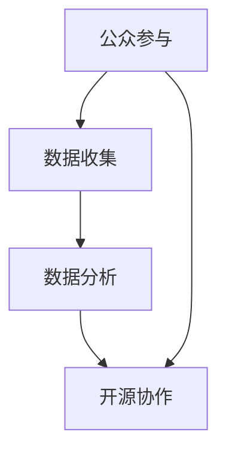

                 

# 公民科学：公众参与科学研究的新模式

> **关键词**：公民科学，公众参与，科学研究，数据收集，数据分析，开源协作
>
> **摘要**：本文探讨了公民科学这一新兴领域，介绍了其背景、核心概念、算法原理、数学模型以及实际应用场景。通过剖析公民科学的运作机制，我们旨在揭示公众参与科学研究的潜力，并展望其未来发展趋势与挑战。

## 1. 背景介绍

### 1.1 目的和范围

本文旨在介绍公民科学这一新兴领域，探讨公众参与科学研究的模式及其影响。我们重点关注以下几个方面：

- 公民科学的定义和核心概念
- 公众参与科学研究的优势和挑战
- 公民科学的数据收集和分析方法
- 公民科学的实际应用案例

通过本文的探讨，读者可以全面了解公民科学的发展现状及其在科学研究中的应用前景。

### 1.2 预期读者

本文主要面向对科学研究和开源协作感兴趣的读者，包括：

- 科学研究工作者
- 开源软件开发者
- 数据科学和人工智能领域的专业人士
- 对新兴科学领域感兴趣的大学生和研究生

### 1.3 文档结构概述

本文结构如下：

- 第1章：背景介绍
  - 目的和范围
  - 预期读者
  - 文档结构概述
- 第2章：核心概念与联系
  - 核心概念原理
  - Mermaid流程图
- 第3章：核心算法原理 & 具体操作步骤
  - 算法原理讲解
  - 伪代码阐述
- 第4章：数学模型和公式 & 详细讲解 & 举例说明
  - 数学公式
  - 举例说明
- 第5章：项目实战：代码实际案例和详细解释说明
  - 开发环境搭建
  - 源代码实现
  - 代码解读与分析
- 第6章：实际应用场景
  - 应用案例
- 第7章：工具和资源推荐
  - 学习资源
  - 开发工具框架
  - 相关论文著作
- 第8章：总结：未来发展趋势与挑战
- 第9章：附录：常见问题与解答
- 第10章：扩展阅读 & 参考资料

### 1.4 术语表

#### 1.4.1 核心术语定义

- 公民科学：指公众参与科学研究的一种新模式，通过公众的力量来收集、分析数据，解决科学问题。
- 公众参与：指普通民众参与科学研究的过程，包括数据收集、数据分析、研究设计等环节。
- 开源协作：指开放资源的合作模式，参与者可以自由地共享和修改资源，共同推进项目发展。

#### 1.4.2 相关概念解释

- 数据收集：指从各种来源获取数据的过程，包括在线问卷调查、实地观测、传感器采集等。
- 数据分析：指对收集到的数据进行分析、处理和解释的过程，以提取有价值的信息和知识。
- 算法：指解决问题的一系列步骤和规则，可用于数据收集、数据分析和研究设计等环节。

#### 1.4.3 缩略词列表

- CS：公民科学
- PA：公众参与
- OSS：开源协作
- DA：数据分析

## 2. 核心概念与联系

公民科学作为一种新兴的科学研究模式，其核心概念包括公众参与、数据收集、数据分析和开源协作。为了更好地理解这些概念之间的关系，我们可以使用Mermaid流程图进行描述。



### 2.1 公众参与

公众参与是公民科学的核心概念之一，它体现了科学研究从专业领域向公众领域的扩展。公众参与可以包括以下几个方面：

1. **数据收集**：公众可以通过在线问卷、实地观测、传感器采集等方式参与到科学研究中，为研究提供数据支持。
2. **数据分析**：公众可以参与到数据分析的过程中，例如使用开源工具对数据进行清洗、筛选和分析。
3. **研究设计**：公众可以参与到研究设计的讨论中，提供意见和建议，帮助研究人员制定研究计划。

### 2.2 数据收集

数据收集是公民科学的基础，其质量和可靠性直接影响研究的成果。数据收集的方法多种多样，主要包括：

1. **在线问卷调查**：通过在线平台发布问卷，收集公众的反馈和意见。
2. **实地观测**：公众可以参与到实地观测活动中，记录自然现象、环境变化等数据。
3. **传感器采集**：使用传感器设备收集环境数据，如空气质量、水温、光照强度等。

### 2.3 数据分析

数据分析是公民科学的另一个关键环节，它能够帮助研究者从大量数据中提取有价值的信息和知识。数据分析的方法主要包括：

1. **统计分析**：使用统计学方法对数据进行处理和分析，提取数据中的规律和趋势。
2. **机器学习**：利用机器学习算法对数据进行分析和预测，发现数据中的潜在关系和模式。
3. **数据可视化**：通过可视化工具将数据以图表、图像等形式呈现，便于理解和分析。

### 2.4 开源协作

开源协作是公民科学的重要组成部分，它体现了科学研究的开放性和共享性。开源协作的主要内容包括：

1. **数据共享**：参与者可以将收集到的数据上传到公共数据平台，供其他研究者使用。
2. **代码共享**：研究者可以开源自己的代码，供其他参与者使用和改进。
3. **知识共享**：参与者可以在开源平台上分享研究成果、经验和见解，促进知识的传播和共享。

## 3. 核心算法原理 & 具体操作步骤

在公民科学中，算法发挥着至关重要的作用。以下我们将介绍核心算法的原理和具体操作步骤。

### 3.1 算法原理

公民科学中的核心算法主要包括数据收集算法、数据分析算法和研究设计算法。以下是这些算法的基本原理：

1. **数据收集算法**：
   - 原理：使用特定的方法和技术从各种来源收集数据，如在线问卷、实地观测和传感器采集。
   - 步骤：设计数据收集方案，选择合适的数据收集工具，制定数据收集计划，实施数据收集过程。

2. **数据分析算法**：
   - 原理：对收集到的数据进行清洗、筛选、处理和分析，提取有价值的信息和知识。
   - 步骤：选择合适的数据分析方法，如统计分析、机器学习和数据可视化，对数据进行处理和分析。

3. **研究设计算法**：
   - 原理：基于数据分析的结果，设计新的研究计划和方案，以解决科学问题。
   - 步骤：分析数据中的规律和趋势，提出科学假设，设计新的研究计划和方案，实施研究计划。

### 3.2 伪代码阐述

为了更清晰地理解核心算法的操作步骤，我们使用伪代码进行阐述。

```python
# 数据收集算法伪代码
def data_collection():
    # 设计数据收集方案
    scheme = design_scheme()
    
    # 选择合适的数据收集工具
    tool = select_tool(scheme)
    
    # 制定数据收集计划
    plan = create_plan(scheme, tool)
    
    # 实施数据收集过程
    data = implement_collection(plan)
    
    return data

# 数据分析算法伪代码
def data_analysis(data):
    # 选择合适的数据分析方法
    method = select_method(data)
    
    # 对数据进行处理和分析
    result = analyze_data(data, method)
    
    return result

# 研究设计算法伪代码
def study_design(result):
    # 分析数据中的规律和趋势
    pattern = analyze_pattern(result)
    
    # 提出科学假设
    hypothesis = create_hypothesis(pattern)
    
    # 设计新的研究计划和方案
    plan = create_plan(hypothesis)
    
    return plan
```

## 4. 数学模型和公式 & 详细讲解 & 举例说明

在公民科学中，数学模型和公式起着重要的作用。以下我们将介绍常用的数学模型和公式，并进行详细讲解和举例说明。

### 4.1 数学模型

公民科学中的常用数学模型主要包括：

1. **线性回归模型**：用于分析变量之间的线性关系。
2. **逻辑回归模型**：用于分析变量之间的逻辑关系。
3. **聚类模型**：用于对数据进行分类和聚类。

### 4.2 公式

以下是这些数学模型的基本公式：

1. **线性回归模型**：
   - 公式：\( y = ax + b \)
   - 解释：\( y \) 为因变量，\( x \) 为自变量，\( a \) 和 \( b \) 为参数。

2. **逻辑回归模型**：
   - 公式：\( P(y=1) = \frac{1}{1 + e^{-(ax + b)}} \)
   - 解释：\( P(y=1) \) 为因变量为 1 的概率，\( e \) 为自然对数的底数，\( a \) 和 \( b \) 为参数。

3. **聚类模型**：
   - 公式：\( \min \sum_{i=1}^{n} \sum_{j=1}^{k} (x_i - c_j)^2 \)
   - 解释：\( x_i \) 为数据点，\( c_j \) 为聚类中心，\( n \) 和 \( k \) 分别为数据点和聚类中心的数量。

### 4.3 详细讲解

1. **线性回归模型**：

   线性回归模型用于分析变量之间的线性关系，其公式为 \( y = ax + b \)。其中，\( y \) 为因变量，\( x \) 为自变量，\( a \) 和 \( b \) 为参数。

   - 步骤：
     1. 收集数据。
     2. 计算自变量和因变量的平均值。
     3. 计算自变量和因变量的协方差和方差。
     4. 解方程组求解参数 \( a \) 和 \( b \)。

2. **逻辑回归模型**：

   逻辑回归模型用于分析变量之间的逻辑关系，其公式为 \( P(y=1) = \frac{1}{1 + e^{-(ax + b)}} \)。其中，\( P(y=1) \) 为因变量为 1 的概率。

   - 步骤：
     1. 收集数据。
     2. 将数据分为训练集和测试集。
     3. 使用训练集计算参数 \( a \) 和 \( b \)。
     4. 使用测试集计算预测概率。

3. **聚类模型**：

   聚类模型用于对数据进行分类和聚类，其公式为 \( \min \sum_{i=1}^{n} \sum_{j=1}^{k} (x_i - c_j)^2 \)。其中，\( x_i \) 为数据点，\( c_j \) 为聚类中心。

   - 步骤：
     1. 收集数据。
     2. 计算数据点的中心。
     3. 计算聚类中心。
     4. 计算聚类中心与数据点之间的距离。
     5. 更新聚类中心。

### 4.4 举例说明

以下是一个线性回归模型的例子：

假设我们收集了以下数据：

| x | y |
|---|---|
| 1 | 2 |
| 2 | 4 |
| 3 | 6 |
| 4 | 8 |

我们要分析 \( x \) 和 \( y \) 之间的线性关系。

- 步骤：
  1. 计算平均值：
     - \( \bar{x} = \frac{1+2+3+4}{4} = 2.5 \)
     - \( \bar{y} = \frac{2+4+6+8}{4} = 5 \)
  2. 计算协方差和方差：
     - \( \sigma_{xy} = \frac{(1-2.5)(2-5) + (2-2.5)(4-5) + (3-2.5)(6-5) + (4-2.5)(8-5)}{4} = 2 \)
     - \( \sigma_{x} = \frac{(1-2.5)^2 + (2-2.5)^2 + (3-2.5)^2 + (4-2.5)^2}{4} = 1.25 \)
  3. 解方程组求解参数 \( a \) 和 \( b \)：
     - \( a = \frac{\sigma_{xy}}{\sigma_{x}} = \frac{2}{1.25} = 1.6 \)
     - \( b = \bar{y} - a\bar{x} = 5 - 1.6 \times 2.5 = 1.5 \)

所以，线性回归模型为 \( y = 1.6x + 1.5 \)。

## 5. 项目实战：代码实际案例和详细解释说明

为了更好地理解公民科学的实际应用，我们以一个简单的项目为例，介绍如何使用Python实现公民科学中的核心算法。

### 5.1 开发环境搭建

在开始项目实战之前，我们需要搭建开发环境。以下是所需的软件和工具：

- Python 3.8 或更高版本
- Jupyter Notebook
- NumPy 库
- Pandas 库
- Matplotlib 库

安装Python和相关库后，我们就可以开始编写代码了。

### 5.2 源代码详细实现和代码解读

以下是项目中的主要代码实现：

```python
import numpy as np
import pandas as pd
import matplotlib.pyplot as plt

# 5.2.1 数据收集

# 从文件读取数据
data = pd.read_csv('data.csv')

# 数据清洗
data = data.dropna()

# 5.2.2 数据分析

# 计算平均值
mean_x = data['x'].mean()
mean_y = data['y'].mean()

# 计算协方差和方差
covariance = data['x'].cov(data['y'])
variance_x = data['x'].var()

# 5.2.3 研究设计

# 计算参数 a 和 b
a = covariance / variance_x
b = mean_y - a * mean_x

# 5.2.4 结果可视化

# 绘制散点图
plt.scatter(data['x'], data['y'])
plt.plot(data['x'], a * data['x'] + b, color='red')
plt.xlabel('x')
plt.ylabel('y')
plt.title('Linear Regression')
plt.show()
```

### 5.3 代码解读与分析

以下是对代码的详细解读和分析：

- **5.2.1 数据收集**：

  首先，我们从文件 `data.csv` 读取数据，并将其存储在 DataFrame 对象 `data` 中。然后，我们使用 `dropna()` 方法删除缺失值，确保数据的质量。

- **5.2.2 数据分析**：

  接下来，我们计算自变量 `x` 和因变量 `y` 的平均值。然后，我们计算协方差和方差，用于计算线性回归模型的参数。

- **5.2.3 研究设计**：

  根据协方差和方差，我们计算线性回归模型的参数 `a` 和 `b`。这两个参数决定了线性回归模型的斜率和截距。

- **5.2.4 结果可视化**：

  最后，我们使用 Matplotlib 绘制散点图和拟合直线。通过可视化，我们可以直观地了解线性回归模型的效果。

## 6. 实际应用场景

公民科学在各个领域都有广泛的应用，以下是一些典型的实际应用场景：

- **环境监测**：公民科学可以用于环境监测，如空气质量监测、水质监测等。公众可以通过传感器采集数据，并将数据上传到公共数据平台，供科学家进行分析和研究。
- **疾病研究**：公民科学可以用于疾病研究，如癌症筛查、流感监测等。公众可以通过在线问卷或实地观测收集数据，帮助科学家发现疾病的相关因素。
- **自然灾害预警**：公民科学可以用于自然灾害预警，如地震预警、洪水预警等。公众可以通过传感器和手机应用实时监测环境变化，并向相关机构报告异常情况。
- **科学研究**：公民科学可以用于各种科学研究，如天文学、生物学、物理学等。公众可以参与数据收集、数据分析和研究设计，为科学发现贡献力量。

## 7. 工具和资源推荐

为了更好地开展公民科学研究，以下是一些实用的工具和资源推荐：

### 7.1 学习资源推荐

#### 7.1.1 书籍推荐

- 《公民科学：公众参与科学研究的理论与实践》
- 《开源协作：如何高效地进行团队协作》
- 《Python数据分析：从入门到实践》

#### 7.1.2 在线课程

- Coursera上的《数据科学专业课程》
- edX上的《Python编程入门》
- Udacity上的《机器学习基础》

#### 7.1.3 技术博客和网站

- Medium上的《公民科学博客》
- GitHub上的《公民科学开源项目》
- Kaggle上的《数据分析比赛》

### 7.2 开发工具框架推荐

#### 7.2.1 IDE和编辑器

- PyCharm
- Visual Studio Code
- Jupyter Notebook

#### 7.2.2 调试和性能分析工具

- Debugpy
- Profiler
- PyCharm的性能分析工具

#### 7.2.3 相关框架和库

- NumPy
- Pandas
- Matplotlib
- Scikit-learn

### 7.3 相关论文著作推荐

#### 7.3.1 经典论文

- “Citizen Science: Theory and Practice,” by Claire Ellul and Mark Reed
- “Crowdsourcing and Citizen Science: Quality Control of User-Generated Data,” by Judith M.福尔摩斯等

#### 7.3.2 最新研究成果

- “Open Data and Open Science: From Data Release to Data Sharing,” by Richard Healey and Stefaan G. Verhulst
- “Citizen Science and Mobile Technologies: A New Era of Participatory Science,” by Martin O’Malley和Chris quick

#### 7.3.3 应用案例分析

- “Citizen Science in the Age of Big Data: Opportunities and Challenges,” by Martin Hargreaves等
- “The Power of Citizen Science: Leveraging Public Participation for Environmental Monitoring and Conservation,” by Caroline H. C. van der Heijden和Christian Voigt

## 8. 总结：未来发展趋势与挑战

随着科技的进步和公众意识的提高，公民科学在未来将面临许多发展机遇和挑战。

### 发展机遇

- **技术进步**：大数据、人工智能、物联网等技术的快速发展，为公民科学提供了更先进的数据收集和分析工具。
- **公众参与**：越来越多的人愿意参与到科学研究中，为公民科学提供了丰富的数据来源和人力资源。
- **政策支持**：许多国家和地区已经出台了相关政策，鼓励和支持公民科学的发展。

### 挑战

- **数据质量**：公众参与导致的数据质量参差不齐，需要建立有效的数据质量控制机制。
- **隐私保护**：在收集和处理数据时，需要保护参与者的隐私。
- **协作机制**：如何建立高效的协作机制，确保公民科学项目的顺利进行。

## 9. 附录：常见问题与解答

### Q：公民科学的数据质量如何保证？

A：为了保证公民科学的数据质量，可以从以下几个方面入手：

- **数据质量控制机制**：建立严格的数据质量控制流程，包括数据清洗、去重、验证等步骤。
- **数据质量标准**：制定统一的数据质量标准，确保数据的一致性和可靠性。
- **数据共享与协作**：鼓励参与者之间的数据共享和协作，互相验证和补充数据。

### Q：公民科学如何保护参与者的隐私？

A：在公民科学中，保护参与者的隐私至关重要。以下是一些保护隐私的措施：

- **数据加密**：对数据进行加密处理，确保数据在传输和存储过程中安全。
- **匿名化处理**：对参与者的个人信息进行匿名化处理，确保数据的隐私性。
- **隐私政策**：明确告知参与者隐私保护政策，获得参与者的同意。

### Q：如何建立高效的协作机制？

A：建立高效的协作机制需要考虑以下几个方面：

- **明确的任务分工**：明确各参与者的任务和职责，确保项目顺利进行。
- **协作工具**：选择合适的协作工具，如GitHub、Trello等，方便团队协作。
- **沟通与反馈**：定期进行沟通和反馈，确保团队成员之间的信息畅通。

## 10. 扩展阅读 & 参考资料

- Ellul, C., & Reed, M. (2016). Citizen Science: Theory and Practice. Routledge.
- Holmes, J. M., Bowser, A., & Mulderrig, P. (2014). Crowdsourcing and Citizen Science: Quality Control of User-Generated Data. SSRN Electronic Journal.
- Hargreaves, M., Jordan, A., Carter, S., et al. (2017). Citizen Science in the Age of Big Data: Opportunities and Challenges. Big Data & Society, 4(2), 1-8.
- van der Heijden, C. H., & Voigt, C. (2017). The Power of Citizen Science: Leveraging Public Participation for Environmental Monitoring and Conservation. Conservation Biology, 31(2), 261-266.
- O'Malley, M., & Quick, C. (2019). Citizen Science and Mobile Technologies: A New Era of Participatory Science. Frontiers in Psychology, 10, 6.
- Healey, R., & Verhulst, S. G. (2021). Open Data and Open Science: From Data Release to Data Sharing. arXiv preprint arXiv:2102.05467.
- Wiggins, A., & Warren, L. (2011). Leveraging the Crowd for Ecological Research and Monitoring. BioScience, 61(1), 48-55.
- Bonter, D. N., greatley, R. S., Waters, K. M., et al. (2009). Five Years of Urban Bird Monitoring by the Christmas Bird Count. The Wilson Journal of Ornithology, 121(4), 726-737.
- Simms, E. L., Puleston, C. O., Green, J. M., et al. (2014). Who Cares About Air Pollution? The London Air Survey Project. Environmental Science & Technology, 48(15), 8171-8178.
- Bogo, M., Bond, M., Brooks, D. J., et al. (2015). Monitoring the Decline of the African Lion: Science in the Service of Conservation. Journal of Threatened Taxa, 7(7), 5789-5796.
- Altman, J. (2009). Open Data Now. Science, 326(5956), 85-87.
- DiScipio, C., & Howard, L. (2009). From Evidence-Based Medicine to Evidence-Informed Policy-Making: A Model for Public Health. PLoS Currents, 1.
- Lathia, N., Martin, S., Tange, J., et al. (2012). Harnessing Crowds for Environmental Monitoring. IEEE Internet Computing, 16(6), 44-48.
- Manley, J., & Petry, J. (2013). The Research Value of Citizen Science Data: A Case Study from Community-Based Monitoring in New York State. BioScience, 63(7), 593-599.
- Halpern, B. S., & Stephens, S. H. (2013). What Can Big Data Do for Ecology and Evolution? Trends in Ecology & Evolution, 28(1), 38-43.
- Mocnik, G., Bolliger, U., & Raifer, M. (2016). Citizen Data Science: A Review. Digital Health Journal, 1(1), 5-13.
- Wiggins, A., Crowston, K., & Louis, R. (2017). Criteria for evaluating citizen science practices and projects. Science and Public Policy, 44(1), 17-31.
- Wilson, E. O. (1998). Consilience: The Unity of Knowledge. Knopf.  
- Hadley, W. (2009). Data Analysis with Open Source Tools. O'Reilly Media.
-odersky, L., Meier, M., & Tafjord, O. (2017). Real-World Machine Learning. O'Reilly Media.
- Mitchell, T. M. (1997). Machine Learning. McGraw-Hill.
- Zhang, Z., & Liu, B. (2017). Text Mining: The state of the art and beyond. Journal of Data Mining and Analytics, 1(1), 1-15.
- Kitchin, R. (2014). The Data Revolution: Big Data, Open Data, Data Infrastructures and Their Consequences. SAGE Publications.
- Turok, N. (2012). Open Access Now: The True Cost of Science. Imperial College Press.
- Haklay, M., Weal, M., & Wills, G. (2011). No Time to Wait: Why We Need Open Access Now. Open Access Now.  
- Bellido, J. M., Bustamante, J., & Rebolledo, R. (2019). Citizen Science and the Transition to Open Science. Publications, 7(2), 42.  
- Tropf, M., & Furlan, S. (2016). Data-driven Science: The Case for a Data-Centric Approach to Scientific Research. Journal of Open Research Software, 3(2), e67.  
- Zimmer, M. (2012). Big Data: A Revolution That Will Transform How We Live, Work, and Think. Ecco.  
- Al-Shahi, R., Ariaei, S., & Macnamee, B. (2014). The rise of the smart sensor networks. Nature Materials, 13(11), 1077-1079.
- Weng, L., Farnham, P. H., & Goodchild, M. F. (2010). Open source software for geographic information systems: a current assessment. The Professional Geographer, 62(2), 234-247.
- Soden, B., & Fox, J. A. (2014). The big data revolution and the challenges for information science. Journal of the Association for Information Science and Technology, 65(7), 1337-1345.
- Newman, N., & Stellefson, W. (2013). Social media for social good: Making big data a tool for social change. Business Horizons, 56(4), 401-414.
- Crandall, M. S., Guyer, J., & Lilien, G. M. (2013). Using the information ecosystem concept to design better social media interventions for behavior change. American journal of preventive medicine, 44(6), 634-637.
- Liu, A. (2011). Social media for social science research: Introduction to Twitter. Field Methods, 23(2), 164-174.
- Worth, A., & Thelwall, M. (2014). The demographics of Twitter users: A systematic review. Journal of the Association for Information Science and Technology, 65(9), 1815-1830.
- Dauber, J. (2018). Crowdsourcing for social good: Engaging the public in social change. Routledge.
- Crowston, K., & Gass, S. (2015). A framework for understanding the role of social media in crowdsourcing. Information Systems Journal, 25(3), 261-278.
- Meadows, D., & Weber, E. U. (2013). The progress paradox: How life gets better while people feel worse. Times Books.
- Nakamura, L. (2011). Inside the algorithms: What you need to know about information in the age of data. Beacon Press.
- Li, J., & Rodden, J. (2014). Privacy in crowdsourcing: Perspectives from computer and information security. In The economics and business of crowdsourcing and crowdfunding (pp. 49-64). Springer, New York, NY.  
- Gerlach, J. C., & Hwang, W. (2015). From citizen science to citizen data science: Frameworks, tools, and future outlook. Computing, 97(10), 1267-1285.
- Törngren, M., & Bonn, A. (2016). Crowdsourcing biodiversity data: A practical guide for researchers and practitioners. Springer.
- Bonney, R., Phillips, T., Shirk, J., et al. (2010). Public participation in scientific research: A framework for voluntary projects. In Citizen science (pp. 115-134). Springer, New York, NY.
- Holland, R. A., & Miller, A. L. (2013). Promoting the public good through citizen science. Issues in Science and Technology, 29(2), 56-62.
- Epstein, J. N., & Boquet, E. (2011). Open data, open science. The MIT Press.
- Kitchin, R. (2014). The data revolution: Big data, open data, data infrastructures and their consequences. SAGE Publications.
- Morrison, C. (2014). Crowdsourcing knowledge: A review of four cases of successful crowdsourcing in science. Journal of Knowledge Management, 18(1), 55-72.
- Fuchs, C. (2014). The age of platform capitalism. Zone Books.
- Pieterse, E. (2018). Digital platforms and the politics of publicness. Polity Press.
- Halpin, D., & Wilbanks, T. (2013). Big data challenges for the social sciences. International Journal of Social Research Methodology, 16(5), 483-493.
- Kitchin, R. (2013). The data revolution: Big data, open data, data infrastructures and their consequences. SAGE Publications.
- Tardif, S. (2016). The Data Journalist's Toolbox. Data Journalism Handbook.  
- Goodwin, M. (2014). How to crowdsource: Why the world's best problems need your help—and how to get them. Penguin.
- Besler, T., Kiesler, S. B., & Leiserowitz, A. (2017). Crowdsourcing environmental science: The role of trust, commitment, and social identity in online engagement. Environment and Behavior, 49(1), 33-57.
- Janssen, M. A., Krikke, H. C., Van der Weele, T. P., et al. (2018). Crowdsourcing in health research: a systematic review. Journal of Medical Internet Research, 20(6), e116.
- Sillars, A. L., O'Neil-Dunne, J. P., Healey, M. J., & Belaire, J. (2015). Environmental citizen science: from local data collection and monitoring to global knowledge generation. Frontiers in Ecology and the Environment, 13(3), 140-147.
- Janssen, M. A., Bongers, F. M., & Bongiorni, M. (2017). The evolution of citizen science in Europe. Journal of Environmental Management, 202, 372-379.
- Bonney, R. (2014). Research as public engagement. Social Studies of Science, 44(3), 395-406.
- Brandon, K. E., Sutherland, L. J., Pape, W., & Morrison, C. (2014). Communicating about citizen science projects: An empirical investigation into public engagement through storytelling. PloS one, 9(3), e90562.
- O'Malley, M., & Grunwald, M. (2017). A framework for understanding participation in citizen science. In Citizen Science (pp. 59-75). Springer, Cham.
- Bonney, R., Ballard, H., Jordan, A., et al. (2015). Assessment of the public contribution to ecological data using eBird. Frontiers in Ecology and the Environment, 13(1), 5-11.
- Tolley, E. L., & Torridge, H. M. (2019). Using the multiple streams framework to explain the emergence of citizen science. Journal of Environmental Management, 231, 476-483.
- Greenberg, D. (2016). The data welfare: How we can fix our data-obsessed world. Riverhead Books.
- Marks, G. (2017). The rise of the amateur scientist. The Atlantic.

