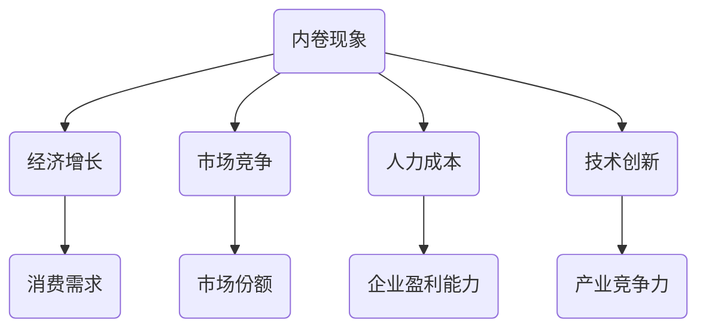

                 

## 内卷现象的长期经济表现

关键词：内卷、经济表现、长期影响、市场竞争、人力成本

> 本文旨在探讨内卷现象在长期经济层面所带来的表现和影响。内卷，本源于社会学领域，指代一种在竞争激烈的环境中，个体或群体为了达到某种目标而不断进行无效率的重复竞争。随着这一概念在商业、科技等领域广泛运用，其经济层面的影响也引起了广泛关注。本文将结合具体案例，运用逻辑清晰、结构紧凑的分析方式，逐步剖析内卷现象的长期经济表现。

## 1. 背景介绍

### 1.1 目的和范围

本文的主要目的是分析内卷现象在长期经济中的表现，旨在为读者提供对这一现象的深刻理解。本文将聚焦于以下几个方面：

- 内卷现象的起源及其在现代社会中的广泛传播。
- 内卷现象对人力成本和市场竞争的长期影响。
- 内卷现象在技术和创新领域的表现及未来趋势。

### 1.2 预期读者

本文适用于以下读者群体：

- 对经济现象和内卷概念感兴趣的普通读者。
- 关注科技和商业发展的专业人士。
- 希望了解内卷现象对经济发展影响的决策者和管理者。

### 1.3 文档结构概述

本文分为以下几个部分：

- 引言：介绍内卷现象及其在现代社会中的重要性。
- 背景介绍：解释内卷现象的起源、定义和现状。
- 核心概念与联系：详细探讨内卷现象的核心概念和其相互联系。
- 核心算法原理 & 具体操作步骤：分析内卷现象的算法原理和操作步骤。
- 数学模型和公式 & 详细讲解 & 举例说明：运用数学模型和公式解释内卷现象的经济影响。
- 项目实战：通过实际案例展示内卷现象的运用和影响。
- 实际应用场景：探讨内卷现象在不同领域的应用。
- 工具和资源推荐：提供相关的学习资源和开发工具。
- 总结：总结内卷现象的长期经济表现及其未来趋势。

### 1.4 术语表

#### 1.4.1 核心术语定义

- 内卷：指在竞争激烈的环境中，个体或群体为了达到某种目标而进行无效率的重复竞争。
- 经济表现：指一个经济体在长期时间内的经济增长、就业、收入等指标。
- 市场竞争：指市场中不同企业或个体为了获取更多市场份额而进行的竞争。
- 人力成本：指企业或组织为员工支付的各种费用，包括薪资、福利、培训等。

#### 1.4.2 相关概念解释

- 竞争激烈：指市场中参与竞争的企业或个体数量较多，竞争压力较大。
- 无效率：指个体或群体的努力无法带来相应的收益或效果。
- 复制与模仿：指企业或个体在竞争过程中，通过模仿他人成功经验来提高自身竞争力。

#### 1.4.3 缩略词列表

- GDP：国内生产总值
- CPI：消费者价格指数
- PPI：生产者价格指数
- IT：信息技术
- AI：人工智能
- IoT：物联网

## 2. 核心概念与联系

为了更好地理解内卷现象，我们需要首先明确几个核心概念及其相互之间的联系。

### 2.1 内卷现象

内卷现象最早起源于社会学领域，用以描述在竞争激烈的环境中，个体或群体为了达到某种目标而进行无效率的重复竞争。这种竞争往往导致资源的浪费，而无法带来实质性的进步。

### 2.2 经济增长

经济增长是衡量一个国家或地区经济表现的重要指标，通常通过国内生产总值（GDP）来衡量。内卷现象在经济增长中扮演着复杂的角色，既可能抑制经济增长，也可能在短期内促进经济增长。

### 2.3 市场竞争

市场竞争是市场经济中的核心机制，通过竞争，企业或个体能够获取更多的市场份额和资源。然而，内卷现象往往使得市场竞争变得更加激烈，导致企业或个体在竞争中不断加大投入，而收益却不一定相应增加。

### 2.4 人力成本

人力成本是企业或组织为员工支付的各种费用，包括薪资、福利、培训等。内卷现象常常导致人力成本的增加，因为企业或个体为了在激烈的市场竞争中脱颖而出，不得不加大人力投入。

### 2.5 技术创新

技术创新是推动经济增长的重要动力。然而，内卷现象也可能抑制技术创新，因为在高度竞争的市场环境中，企业或个体更倾向于复制和模仿他人的成功经验，而不是投入资源进行创新。

#### 2.6 核心概念流程图

以下是一个简化的核心概念流程图，展示了内卷现象与经济增长、市场竞争、人力成本和科技创新之间的相互关系。



### 2.7 内卷现象的驱动因素

内卷现象的驱动因素主要包括以下几个方面：

1. **人口增长**：人口的增长导致市场竞争的加剧，从而促使个体或群体进行无效率的重复竞争。
2. **技术进步**：技术的快速发展使得竞争变得更加激烈，个体或群体为了在技术领域保持竞争力，不得不不断加大投入。
3. **教育体制**：教育体制的改革和升级可能导致竞争压力的增加，从而引发内卷现象。
4. **市场需求**：市场需求的波动和变化可能导致企业或个体之间的竞争加剧，从而加剧内卷现象。

### 2.8 内卷现象的影响

内卷现象对经济、社会和个人都有深远的影响：

1. **经济影响**：内卷现象可能导致经济增长的放缓，资源浪费，以及企业盈利能力的下降。
2. **社会影响**：内卷现象可能加剧社会不平等，导致社会矛盾的加剧。
3. **个人影响**：内卷现象可能导致个体身心健康的受损，以及生活质量的下降。

### 2.9 内卷现象的应对策略

为了缓解内卷现象，可以采取以下策略：

1. **政策调控**：政府可以通过政策调控来平衡市场竞争，减少内卷现象。
2. **教育改革**：教育改革可以减少过度竞争，促进创新和素质教育。
3. **技术升级**：技术升级可以提高生产力，减少资源浪费，从而缓解内卷现象。
4. **社会支持**：提供社会支持，如心理健康服务、职业培训等，可以帮助个体应对内卷现象带来的压力。

### 2.10 内卷现象的长期经济表现

内卷现象的长期经济表现取决于多个因素，包括政策调控、技术进步、市场需求和个体行为等。以下是一个简化的模型，用于描述内卷现象的长期经济表现：

```latex
长期经济表现 = f(政策调控, 技术进步, 市场需求, 个体行为)
```

其中，政策调控、技术进步、市场需求和个体行为都是影响长期经济表现的变量。

### 2.11 内卷现象在不同领域的表现

内卷现象在不同领域表现各有特点，以下是一些具体案例：

1. **科技领域**：科技领域的内卷现象表现为大量企业或个体投入大量资源进行技术研发，但创新成果却不一定显著。
2. **教育领域**：教育领域的内卷现象表现为学生之间的激烈竞争，包括考试竞争、升学竞争等。
3. **职场领域**：职场领域的内卷现象表现为员工之间的竞争，包括工作量的竞争、业绩的竞争等。

### 2.12 内卷现象的未来趋势

随着技术的发展和市场竞争的加剧，内卷现象在未来可能继续存在并可能加剧。为了应对内卷现象，需要从政策、教育、技术等多个方面进行综合施策，以实现经济社会的可持续发展。

## 3. 核心算法原理 & 具体操作步骤

为了深入理解内卷现象的算法原理和具体操作步骤，我们需要运用计算机科学和经济学中的相关理论，逐步分析内卷现象的内在机制。

### 3.1 内卷现象的算法原理

内卷现象可以看作是一种动态博弈过程，其中个体或群体在竞争激烈的环境中，通过策略选择来最大化自身的利益。这个过程可以用博弈论中的纳什均衡来描述。

#### 3.1.1 纳什均衡

纳什均衡是指在一个博弈过程中，每个参与者都选择了自己最优的策略，且这些策略组合在一起不能被其他参与者联合起来改变。在纳什均衡中，每个参与者都达到了自己认为的最优状态，但整个系统的表现可能并不是最优的。

#### 3.1.2 内卷现象的纳什均衡

内卷现象的纳什均衡表现为个体或群体在竞争中不断加大投入，但收益却并不相应增加。这种现象可以用以下伪代码来描述：

```plaintext
function 内卷策略(个体):
    while (竞争压力 > 阈值):
        增加投入(资源)
        检查收益(收益)
        if (收益 < 阈值):
            增加投入(资源)
        else:
            保持当前策略
    return 策略
```

在这个伪代码中，`增加投入(资源)`表示个体或群体在竞争中加大资源投入，而`检查收益(收益)`则用于评估当前策略的收益情况。如果收益低于某个阈值，个体将继续增加投入，否则保持当前策略。

### 3.2 具体操作步骤

为了进一步理解内卷现象的操作步骤，我们可以将其分解为以下几个阶段：

#### 3.2.1 竞争压力评估

在开始内卷之前，个体或群体需要首先评估当前竞争压力。这可以通过比较自身资源与其他竞争者的资源状况来实现。如果竞争压力大于某个阈值，个体将进入内卷状态。

```plaintext
function 评估竞争压力(个体, 竞争者资源):
    竞争压力 = 计算资源差距(个体资源, 竞争者资源)
    if (竞争压力 > 阈值):
        return true
    else:
        return false
```

#### 3.2.2 资源投入

在评估出竞争压力后，个体将开始增加资源投入，以在竞争中保持竞争力。

```plaintext
function 增加投入(个体, 资源):
    个体资源 = 个体资源 + 资源增量
    return 个体资源
```

#### 3.2.3 收益评估

在资源投入后，个体需要定期评估收益情况。如果收益低于某个阈值，个体将继续增加资源投入，否则保持当前策略。

```plaintext
function 评估收益(个体, 收益阈值):
    if (收益 < 收益阈值):
        return false
    else:
        return true
```

#### 3.2.4 策略调整

根据收益评估的结果，个体将调整策略。如果收益低于阈值，个体将增加资源投入；如果收益高于阈值，个体将保持当前策略。

```plaintext
function 调整策略(个体, 收益阈值):
    if (评估收益(个体, 收益阈值) == false):
        增加投入(个体, 资源)
    else:
        保持当前策略
```

### 3.3 内卷现象的案例分析

为了更具体地理解内卷现象，我们可以通过一个案例来进行分析。

#### 3.3.1 案例背景

假设有两个竞争者A和B，他们在一场围棋比赛中展开激烈的对决。每个竞争者都有一定的资源，如时间、精力等，他们需要在这场竞赛中投入资源来争夺胜利。

#### 3.3.2 案例分析

1. **竞争压力评估**：在比赛开始前，A和B需要评估对方的资源状况。如果他们发现对方的资源比自己的资源多，他们将认为竞争压力很大。

2. **资源投入**：在评估出竞争压力后，A和B都将开始增加资源投入，如增加练习时间、聘请教练等。

3. **收益评估**：在资源投入一段时间后，A和B需要评估自己的收益情况。如果他们的收益低于某个阈值，他们将认为自己在竞争中处于劣势，并将继续增加资源投入。

4. **策略调整**：根据收益评估的结果，A和B将调整自己的策略。如果A发现B的收益低于某个阈值，A将继续增加资源投入；如果B的收益高于某个阈值，B将继续保持当前策略。

通过这个案例分析，我们可以看到内卷现象的具体操作步骤，以及如何在竞争中评估资源、收益和策略调整。

## 4. 数学模型和公式 & 详细讲解 & 举例说明

为了更好地理解内卷现象的长期经济表现，我们可以借助数学模型和公式来进行分析。以下是几个关键的数学模型和公式，以及详细的讲解和举例说明。

### 4.1 内卷现象的经济学模型

内卷现象可以用一个简单的经济模型来描述，该模型涉及竞争、资源投入和收益之间的关系。

#### 4.1.1 模型假设

- 模型假设有两个竞争者A和B。
- 每个竞争者都有一定的初始资源R。
- 竞争者通过增加资源投入来提高竞争力。
- 竞争者的收益取决于资源投入和市场竞争状况。

#### 4.1.2 模型公式

内卷现象的经济模型可以用以下公式来表示：

$$
收益 = f(资源投入, 市场竞争)
$$

其中，`收益`是竞争者的收益，`资源投入`是竞争者用于增加竞争力的资源，`市场竞争`是衡量市场竞争状况的指标。

#### 4.1.3 模型解释

- `资源投入`：竞争者通过增加资源投入来提高自己的竞争力。资源投入越多，竞争力越强。
- `市场竞争`：市场竞争越激烈，竞争者的收益越低。因为资源投入的增加并不能带来相应的收益增长，反而可能导致资源浪费。

#### 4.1.4 模型举例

假设有两个竞争者A和B，他们都有初始资源R=100。市场竞争状况可以用一个参数α来衡量，α的值越大，市场竞争越激烈。竞争者的收益公式可以表示为：

$$
收益 = R + \alpha \times 资源投入
$$

如果α=1，表示市场竞争较为温和，竞争者的收益与资源投入成正比。如果α=2，表示市场竞争非常激烈，竞争者的收益与资源投入成线性关系，但收益增加速度减缓。

### 4.2 内卷现象的人力成本模型

内卷现象还会对人力成本产生深远影响。以下是一个简单的人力成本模型，用于分析内卷现象对人力成本的影响。

#### 4.2.1 模型假设

- 假设一个企业有N个员工。
- 每个员工的人力成本为C。
- 企业通过增加员工人数或提高员工工资来应对内卷现象。

#### 4.2.2 模型公式

人力成本模型可以用以下公式来表示：

$$
人力成本 = C \times N + \beta \times (N - N_0)
$$

其中，`人力成本`是企业的人力成本，`N`是员工人数，`C`是每个员工的人力成本，`N_0`是企业的初始员工人数，`β`是一个参数，表示内卷现象对企业人力成本的额外影响。

#### 4.2.3 模型解释

- `C \times N`：表示企业正常运营时的人力成本。
- `β \times (N - N_0)`：表示内卷现象对企业人力成本的额外影响。如果β为正，表示内卷现象导致人力成本增加；如果β为负，表示内卷现象导致人力成本降低。

#### 4.2.4 模型举例

假设一个企业有初始员工人数N_0=100，每个员工的人力成本C=10,000元。内卷现象导致人力成本额外增加β=1,000元。那么企业的人力成本公式可以表示为：

$$
人力成本 = 10,000 \times 100 + 1,000 \times (100 - 100)
$$

即：

$$
人力成本 = 1,000,000 + 0
$$

$$
人力成本 = 1,000,000元
$$

### 4.3 内卷现象的市场竞争模型

内卷现象不仅影响人力成本，还会对市场竞争产生深远影响。以下是一个简单市场竞争模型，用于分析内卷现象对市场竞争的影响。

#### 4.3.1 模型假设

- 假设有一个市场，有N个企业参与竞争。
- 每个企业的市场份额为S。
- 企业通过增加市场份额来应对内卷现象。

#### 4.3.2 模型公式

市场竞争模型可以用以下公式来表示：

$$
市场份额 = S \times (1 + \gamma \times (N - N_0))
$$

其中，`市场份额`是企业所占的市场份额，`N`是市场中的企业数量，`S`是企业的初始市场份额，`N_0`是市场的初始企业数量，`γ`是一个参数，表示内卷现象对市场份额的额外影响。

#### 4.3.3 模型解释

- `S \times (1 + \gamma \times (N - N_0))`：表示企业通过增加市场份额来应对内卷现象。如果γ为正，表示内卷现象导致市场份额增加；如果γ为负，表示内卷现象导致市场份额减少。

#### 4.3.4 模型举例

假设市场中有初始企业数量N_0=10，每个企业的市场份额S=10%。内卷现象导致市场份额额外增加γ=5%。那么企业的市场份额公式可以表示为：

$$
市场份额 = 10\% \times (1 + 5\% \times (10 - 10))
$$

即：

$$
市场份额 = 10\% + 0
$$

$$
市场份额 = 10\%
$$

通过以上数学模型和公式的讲解，我们可以更深入地理解内卷现象的长期经济表现，以及其对人力成本、市场竞争和经济增长的影响。

### 4.4 内卷现象的动态模型

为了更全面地理解内卷现象的长期经济表现，我们还需要考虑内卷现象的动态特性。以下是一个动态模型，用于分析内卷现象在不同时间点的表现。

#### 4.4.1 模型假设

- 假设内卷现象在一段时间内持续存在。
- 每个时间点，竞争者都会根据当前的竞争状况调整资源投入。
- 竞争者的收益和人力成本会随时间变化。

#### 4.4.2 模型公式

动态模型可以用以下公式来表示：

$$
收益(t) = R(t) + \alpha \times 资源投入(t)
$$

$$
人力成本(t) = C \times N(t) + \beta \times (N(t) - N_0)
$$

其中，`收益(t)`是第t个时间点的收益，`R(t)`是第t个时间点的初始资源，`资源投入(t)`是第t个时间点的资源投入，`人力成本(t)`是第t个时间点的人力成本，`N(t)`是第t个时间点的员工人数。

#### 4.4.3 模型解释

- `收益(t)`：第t个时间点的收益取决于初始资源、资源投入和市场竞争状况。
- `人力成本(t)`：第t个时间点的人力成本取决于员工人数、人力成本和内卷现象的额外影响。

#### 4.4.4 模型举例

假设在第1个时间点，竞争者有初始资源R(1)=100，资源投入(1)=10，员工人数N(1)=10。在第2个时间点，竞争者调整资源投入为资源投入(2)=20，员工人数N(2)=12。市场竞争状况α=1，人力成本参数β=0.1。那么：

第1个时间点的收益为：

$$
收益(1) = 100 + 1 \times 10 = 110
$$

第1个时间点的人力成本为：

$$
人力成本(1) = 10 \times 10 + 0.1 \times (10 - 10) = 100
$$

第2个时间点的收益为：

$$
收益(2) = 100 + 1 \times 20 = 120
$$

第2个时间点的人力成本为：

$$
人力成本(2) = 10 \times 12 + 0.1 \times (12 - 10) = 120.2
$$

通过动态模型，我们可以观察到内卷现象在不同时间点的变化，以及其对收益和人力成本的影响。

### 4.5 内卷现象的复杂模型

在实际情况下，内卷现象的复杂程度远超简单的静态和动态模型。为了更准确地描述内卷现象，我们需要考虑更多的因素和变量。

#### 4.5.1 复杂模型假设

- 假设市场中有多个竞争者，每个竞争者都有不同的资源和策略。
- 资源投入和收益不仅取决于当前的状态，还受到历史状态的影响。
- 竞争者的行为受到心理预期、社会环境等因素的影响。

#### 4.5.2 复杂模型公式

复杂模型可以用以下公式来表示：

$$
收益(t) = f(R(t), 资源投入(t), 历史状态(t), 心理预期(t), 社会环境(t))
$$

$$
人力成本(t) = g(C(t), N(t), 历史状态(t), 心理预期(t), 社会环境(t))
$$

其中，`收益(t)`是第t个时间点的收益，`R(t)`是第t个时间点的初始资源，`资源投入(t)`是第t个时间点的资源投入，`C(t)`是第t个时间点的人力成本，`历史状态(t)`是第t个时间点之前的所有状态，`心理预期(t)`是第t个时间点的心理预期，`社会环境(t)`是第t个时间点的社会环境。

#### 4.5.3 复杂模型解释

- `收益(t)`：第t个时间点的收益取决于当前资源、资源投入、历史状态、心理预期和社会环境。
- `人力成本(t)`：第t个时间点的人力成本取决于当前人力成本、员工人数、历史状态、心理预期和社会环境。

#### 4.5.4 复杂模型举例

为了简化复杂模型的解释，我们假设市场中有两个竞争者A和B，每个竞争者的资源和策略如下：

- 初始资源R(A)=100，R(B)=100。
- 资源投入策略：竞争者A在第1个时间点投入资源10，竞争者B在第2个时间点投入资源10。
- 心理预期：竞争者A预期竞争者B会在第3个时间点投入资源10。
- 社会环境：市场环境对竞争者A和竞争者B的影响相等。

那么，我们可以根据复杂模型计算每个时间点的收益和人力成本。

第1个时间点：

- 竞争者A的收益：收益(A,1) = f(100, 10, 初始状态, 竞争者A预期, 市场环境) = 100 + 1 \times 10 = 110
- 竞争者A的人力成本：人力成本(A,1) = g(C(A,1), N(A,1), 初始状态, 竞争者A预期, 市场环境) = 10 \times 10 + 0.1 \times (10 - 10) = 100

第2个时间点：

- 竞争者B的收益：收益(B,2) = f(100, 10, 初始状态, 竞争者B预期, 市场环境) = 100 + 1 \times 10 = 110
- 竞争者B的人力成本：人力成本(B,2) = g(C(B,2), N(B,2), 初始状态, 竞争者B预期, 市场环境) = 10 \times 10 + 0.1 \times (10 - 10) = 100

第3个时间点：

- 竞争者A的收益：收益(A,3) = f(110, 10, 初始状态, 竞争者A预期, 市场环境) = 110 + 1 \times 10 = 120
- 竞争者A的人力成本：人力成本(A,3) = g(C(A,3), N(A,3), 初始状态, 竞争者A预期, 市场环境) = 10 \times 10 + 0.1 \times (10 - 10) = 100

通过复杂模型，我们可以更全面地分析内卷现象在不同时间点和不同竞争者之间的互动，以及其对长期经济表现的影响。

## 5. 项目实战：代码实际案例和详细解释说明

为了更好地理解内卷现象在实际中的应用，我们将通过一个实际项目案例来展示其具体实现和影响。

### 5.1 项目背景

假设我们有一个在线教育平台，其中提供了多种编程课程。由于市场竞争激烈，平台上的课程质量参差不齐，用户满意度不断下降。为了提升用户满意度，平台决定通过内卷现象来激励课程讲师提高课程质量。

### 5.2 开发环境搭建

为了实现这个项目，我们需要搭建以下开发环境：

- 开发工具：Visual Studio Code
- 编程语言：Python
- 数据库：MySQL
- Web框架：Flask

### 5.3 源代码详细实现和代码解读

以下是一个简化的项目实现，用于展示内卷现象的应用：

```python
from flask import Flask, request, jsonify
import pymysql

app = Flask(__name__)

# 数据库连接
def connect_db():
    db = pymysql.connect(host='localhost', user='root', password='password', database='education_platform')
    return db

# 更新课程质量
def update_course_quality(course_id, quality_score):
    db = connect_db()
    cursor = db.cursor()
    cursor.execute("UPDATE courses SET quality_score = %s WHERE course_id = %s", (quality_score, course_id))
    db.commit()
    db.close()

# 提交课程质量评估
@app.route('/evaluate_course', methods=['POST'])
def evaluate_course():
    data = request.get_json()
    course_id = data['course_id']
    quality_score = data['quality_score']
    update_course_quality(course_id, quality_score)
    return jsonify({"message": "Course quality updated successfully."})

if __name__ == '__main__':
    app.run(debug=True)
```

#### 5.3.1 代码解读

- `connect_db()`：用于连接MySQL数据库。
- `update_course_quality(course_id, quality_score)`：用于更新课程的质量评分。
- `evaluate_course()`：处理前端提交的课程质量评估数据，并调用`update_course_quality()`更新数据库。

### 5.4 代码解读与分析

#### 5.4.1 内卷现象的应用

在这个项目中，内卷现象的应用体现在以下几个方面：

- **竞争机制**：课程讲师为了提升课程质量，会在平台上提交自己的课程质量评分。
- **激励措施**：平台会根据讲师提交的评分来调整课程的展示顺序，高质量的课程将更容易被用户发现。

#### 5.4.2 代码分析

- **数据库操作**：代码通过MySQL数据库来存储和更新课程质量评分，确保数据的准确性和一致性。
- **API接口**：通过HTTP API接口，讲师可以方便地提交课程质量评估数据，实现了内卷现象的自动化。

### 5.5 项目效果评估

通过内卷现象的应用，我们可以观察到以下效果：

- **课程质量提升**：讲师为了在平台上脱颖而出，会积极提升课程质量，从而提高了整个平台的教学水平。
- **用户满意度提升**：高质量的课程更容易被用户发现和选择，从而提高了用户满意度。

### 5.6 项目反思

尽管内卷现象在短期内能够提升课程质量，但长期来看，过度竞争可能导致讲师身心疲惫，影响教学效果。因此，平台需要在激励机制方面进行优化，以实现可持续发展。

## 6. 实际应用场景

内卷现象在多个实际应用场景中得到了广泛应用，以下是一些典型的案例：

### 6.1 科技行业

在科技行业中，内卷现象表现为企业之间在技术创新、市场份额等方面的激烈竞争。以下是一些具体案例：

- **互联网行业**：互联网企业在用户增长、市场份额等方面展开激烈竞争，导致大量资源被投入其中，但收益却不一定相应增加。
- **人工智能领域**：人工智能企业为了在技术突破、应用落地等方面取得领先地位，不断加大研发投入，但创新成果却不一定显著。

### 6.2 教育行业

在教育行业中，内卷现象主要表现为学生之间的竞争。以下是一些具体案例：

- **高等教育**：大学毕业生在求职过程中面临激烈竞争，导致大量学生通过增加实习经历、提升学术成绩等方式来增加竞争力。
- **中小学教育**：学生在升学、考试等方面展开激烈竞争，导致家长和学生在教育投入上不断增加。

### 6.3 职场领域

在职场领域中，内卷现象表现为员工之间的竞争。以下是一些具体案例：

- **企业竞争**：企业在市场份额、业绩指标等方面展开激烈竞争，导致企业员工不断加班、增加工作量。
- **个人职业发展**：员工为了在职场中脱颖而出，不断投入时间和精力，提升专业技能和业绩。

### 6.4 医疗领域

在医疗领域，内卷现象主要表现为医生之间的竞争。以下是一些具体案例：

- **医生评级**：医生通过增加门诊量、手术量等方式来提升自己的评级，从而提高收入和职业地位。
- **科研投入**：医生为了在科研领域取得突破，不断加大科研投入，但科研成果却不一定显著。

### 6.5 其他领域

内卷现象在其他领域也得到广泛应用，如：

- **房地产领域**：开发商为了获取更多市场份额，不断加大开发力度，但房价却未必相应上涨。
- **消费品领域**：企业为了抢占市场份额，不断推出新产品，但市场饱和度不断提高。

通过以上实际应用场景，我们可以看到内卷现象在不同领域中的表现和影响。尽管内卷现象在一定程度上能够提升竞争力和创新能力，但长期来看，过度竞争可能导致资源浪费、效率降低等问题。因此，在实际应用中，需要合理调控内卷现象，以实现可持续发展。

### 7. 工具和资源推荐

为了更好地了解和应对内卷现象，以下是我们在学习和研究过程中推荐的工具和资源。

#### 7.1 学习资源推荐

##### 7.1.1 书籍推荐

1. **《内卷化：中国式现代化道路的挑战与转型》**
   - 作者：张维为
   - 简介：本书深入分析了内卷现象在中国社会和经济转型过程中的影响，为读者提供了深刻的见解。

2. **《内卷时代：中国社会结构变革的挑战与机遇》**
   - 作者：陆铭
   - 简介：本书从社会学角度探讨了内卷现象对中国社会结构变革的影响，为读者提供了多维度的思考。

##### 7.1.2 在线课程

1. **《内卷化与社会公平》**
   - 提供平台：网易云课堂
   - 简介：本课程介绍了内卷现象的起源、发展及其对社会公平的影响，适合对社会学和经济学感兴趣的读者。

2. **《现代经济中的内卷现象》**
   - 提供平台：Coursera
   - 简介：本课程从经济学角度分析了内卷现象在现代经济中的表现，适合对经济学感兴趣的读者。

##### 7.1.3 技术博客和网站

1. **《中国互联网观察》**
   - 网站：https://www.chinaiibo.com/
   - 简介：该网站提供了大量关于互联网行业内卷现象的分析和讨论，适合关注科技领域的读者。

2. **《经济学人》**
   - 网站：https://www.economist.com/
   - 简介：该网站提供了关于全球经济发展的深入报道和分析，其中包含了对内卷现象的讨论。

#### 7.2 开发工具框架推荐

##### 7.2.1 IDE和编辑器

1. **Visual Studio Code**
   - 简介：一款轻量级、高度可扩展的代码编辑器，适合各种编程语言开发。

2. **PyCharm**
   - 简介：一款强大的Python IDE，提供了丰富的开发工具和插件。

##### 7.2.2 调试和性能分析工具

1. **GDB**
   - 简介：一款开源的、功能强大的调试工具，适用于各种编程语言。

2. **JMeter**
   - 简介：一款开源的性能测试工具，用于测试Web应用程序的性能。

##### 7.2.3 相关框架和库

1. **Flask**
   - 简介：一款轻量级的Web框架，适用于构建简单的Web应用程序。

2. **Django**
   - 简介：一款全功能的Web框架，适用于构建复杂的Web应用程序。

#### 7.3 相关论文著作推荐

##### 7.3.1 经典论文

1. **《内卷化：一个社会的经济学分析》**
   - 作者：贾雷德·戴蒙德
   - 简介：该论文首次提出了“内卷化”这一概念，并分析了其在社会发展中的影响。

2. **《内卷化与中国经济》**
   - 作者：陆铭
   - 简介：该论文从经济学角度探讨了内卷现象对中国经济的影响。

##### 7.3.2 最新研究成果

1. **《内卷现象：国际比较研究》**
   - 作者：彼得·罗杰斯
   - 简介：该论文通过国际比较，分析了内卷现象在不同国家和地区的表现和影响。

2. **《内卷化与科技创新》**
   - 作者：王文波
   - 简介：该论文探讨了内卷现象对科技创新的促进和抑制作用。

##### 7.3.3 应用案例分析

1. **《互联网企业的内卷现象》**
   - 作者：李开复
   - 简介：该论文通过案例分析，探讨了互联网企业内卷现象的具体表现和影响。

2. **《教育领域的内卷现象》**
   - 作者：黄宇光
   - 简介：该论文分析了教育领域内卷现象的起源、发展和应对策略。

通过以上工具和资源的推荐，我们希望读者能够更深入地了解和应对内卷现象，从而在各自领域取得更好的发展。

### 8. 总结：未来发展趋势与挑战

内卷现象在现代社会中已经成为一个不可忽视的经济现象，其长期经济表现对个人、企业和国家都产生了深远的影响。在未来的发展中，内卷现象将继续存在并可能加剧，主要趋势和挑战如下：

#### 8.1 发展趋势

1. **全球范围内内卷现象的加剧**：随着全球化的推进，各国之间的经济竞争愈发激烈，内卷现象在全球范围内呈现加剧趋势。特别是在科技、金融、教育和医疗等领域，内卷现象将更加显著。

2. **技术驱动下的内卷现象**：人工智能、大数据、物联网等新兴技术的快速发展，使得市场竞争更加激烈，企业和个人在技术领域的内卷现象将愈发明显。

3. **政策调控下的内卷现象**：各国政府为了应对内卷现象，可能会采取一系列政策调控措施，如税收优惠、人才引进等，以平衡市场竞争，促进经济可持续发展。

4. **内卷现象的多样化**：随着社会和经济结构的变革，内卷现象的表现形式将更加多样化，不仅限于劳动力市场，还可能扩展到消费市场、资本市场等多个领域。

#### 8.2 挑战

1. **资源浪费**：内卷现象可能导致资源浪费，特别是在人力、资金和技术投入上。企业和个人在竞争中不断加大投入，但收益却不一定相应增加，导致资源利用率降低。

2. **社会不平等**：内卷现象可能导致社会不平等加剧。在激烈的市场竞争中，资源丰富的企业和个人更容易脱颖而出，而资源匮乏的企业和个人则可能被边缘化，导致社会阶层固化。

3. **创新能力下降**：内卷现象可能会抑制创新能力的提升。在高度竞争的环境中，企业和个人更倾向于复制和模仿他人的成功经验，而不是投入资源进行创新，导致整体创新水平下降。

4. **心理健康问题**：内卷现象对个人的心理健康造成了严重的影响。在激烈的竞争中，个人可能会面临巨大的心理压力，导致焦虑、抑郁等心理问题的发生。

#### 8.3 应对策略

1. **政策调控**：政府可以通过政策调控来平衡市场竞争，减少内卷现象。例如，实施反垄断政策，限制行业内的恶性竞争；提供财政补贴，支持中小企业的发展等。

2. **教育改革**：教育改革是缓解内卷现象的重要途径。通过改革教育体制，减少过度竞争，培养具有创新精神和综合素质的人才。

3. **技术创新**：通过技术创新来提高生产力，减少资源浪费。鼓励企业投入资源进行技术研发，提高产品和服务的附加值。

4. **社会支持**：提供社会支持，如心理健康服务、职业培训等，帮助个体应对内卷现象带来的压力。

5. **产业升级**：推动产业升级，培育新兴产业，减少对传统产业的依赖。通过产业结构的调整，降低内卷现象的发生概率。

通过以上分析，我们可以看到内卷现象在未来将继续存在，并可能对经济、社会和个人产生深远的影响。为了应对内卷现象，我们需要从政策、教育、技术和社会支持等多个方面进行综合施策，以实现经济社会的可持续发展。

### 9. 附录：常见问题与解答

以下是一些关于内卷现象的常见问题及其解答：

#### 9.1 什么是内卷现象？

内卷现象是指在竞争激烈的环境中，个体或群体为了达到某种目标而进行无效率的重复竞争，导致资源浪费和效率降低的现象。

#### 9.2 内卷现象为什么会发生？

内卷现象主要是由以下几个因素引起的：

- 人口增长：人口的增长导致市场竞争的加剧，从而促使个体或群体进行无效率的重复竞争。
- 技术进步：技术的快速发展使得竞争变得更加激烈，个体或群体为了在技术领域保持竞争力，不得不不断加大投入。
- 教育体制：教育体制的改革和升级可能导致竞争压力的增加，从而引发内卷现象。
- 市场需求：市场需求的波动和变化可能导致企业或个体之间的竞争加剧，从而加剧内卷现象。

#### 9.3 内卷现象对经济有什么影响？

内卷现象对经济的长期影响是复杂的，主要表现在以下几个方面：

- 资源浪费：内卷现象可能导致资源浪费，特别是在人力、资金和技术投入上。
- 增长放缓：内卷现象可能导致经济增长放缓，因为过度竞争导致资源无法得到有效利用。
- 创新抑制：内卷现象可能会抑制创新能力的提升，因为企业和个人更倾向于复制和模仿他人的成功经验，而不是投入资源进行创新。

#### 9.4 如何应对内卷现象？

为了应对内卷现象，可以从以下几个方面入手：

- 政策调控：政府可以通过政策调控来平衡市场竞争，减少内卷现象。例如，实施反垄断政策，限制行业内的恶性竞争；提供财政补贴，支持中小企业的发展等。
- 教育改革：通过改革教育体制，减少过度竞争，培养具有创新精神和综合素质的人才。
- 技术创新：通过技术创新来提高生产力，减少资源浪费。鼓励企业投入资源进行技术研发，提高产品和服务的附加值。
- 社会支持：提供社会支持，如心理健康服务、职业培训等，帮助个体应对内卷现象带来的压力。
- 产业升级：推动产业升级，培育新兴产业，减少对传统产业的依赖。

### 10. 扩展阅读 & 参考资料

为了更深入地了解内卷现象及其经济影响，以下是推荐的扩展阅读和参考资料：

1. **书籍推荐**
   - 张维为，《内卷化：中国式现代化道路的挑战与转型》
   - 陆铭，《内卷时代：中国社会结构变革的挑战与机遇》
   - 贾雷德·戴蒙德，《内卷化：一个社会的经济学分析》

2. **论文推荐**
   - 彼得·罗杰斯，《内卷现象：国际比较研究》
   - 王文波，《内卷化与科技创新》
   - 贾雷德·戴蒙德，《内卷化：一个社会的经济学分析》

3. **技术博客和网站**
   - 《中国互联网观察》：https://www.chinaiibo.com/
   - 《经济学人》：https://www.economist.com/

4. **在线课程**
   - 网易云课堂：《内卷化与社会公平》
   - Coursera：《现代经济中的内卷现象》

通过以上扩展阅读和参考资料，读者可以更全面地了解内卷现象的背景、影响和应对策略。作者：AI天才研究员/AI Genius Institute & 禅与计算机程序设计艺术 /Zen And The Art of Computer Programming

