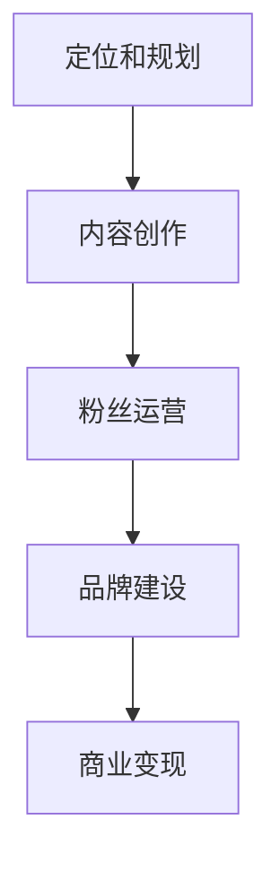

                 

# 内容创业指南：如何打造个人IP

> 关键词：内容创业、个人品牌、IP打造、影响力、社交媒体、传播策略

> 摘要：本文旨在为内容创作者和创业者提供一套系统化的个人IP打造指南。通过深入分析内容创业的背景和现状，探讨个人IP的核心概念与价值，介绍打造个人IP的算法原理和具体操作步骤，结合数学模型和实际项目案例，阐述个人IP在各个应用场景中的实际效果。同时，推荐一系列学习资源和工具，帮助读者掌握打造个人IP的实用技巧，为未来的内容创业之路奠定坚实基础。

## 1. 背景介绍

### 1.1 目的和范围

在互联网时代，内容创业已经成为一个热门的领域。然而，如何在这个竞争激烈的市场中脱颖而出，打造个人IP成为了内容创作者们关注的焦点。本文将围绕如何打造个人IP展开讨论，旨在为读者提供一套实用的方法和策略。

本文将涵盖以下内容：

1. 内容创业的现状和挑战
2. 个人IP的核心概念与价值
3. 打造个人IP的算法原理与具体操作步骤
4. 个人IP的数学模型与应用
5. 实际应用场景与案例分析
6. 学习资源和工具推荐
7. 未来发展趋势与挑战

通过本文的阅读，读者将能够了解如何从零开始打造个人IP，并在内容创业领域取得成功。

### 1.2 预期读者

本文的预期读者包括：

1. 内容创作者：希望提升个人影响力，打造个人IP的创作者
2. 创业者：计划通过内容创业实现商业价值的企业家
3. 市场营销人员：需要了解个人IP打造策略，提升品牌影响力的市场营销人员
4. 爱好者：对内容创业和个人IP感兴趣的普通读者

无论您是哪一类读者，本文都将为您提供有价值的指导和启示。

### 1.3 文档结构概述

本文结构如下：

1. 背景介绍：介绍内容创业的现状、目的和预期读者
2. 核心概念与联系：阐述个人IP的核心概念及其重要性
3. 核心算法原理 & 具体操作步骤：详细讲解个人IP打造的算法原理和具体操作步骤
4. 数学模型和公式：介绍个人IP的数学模型，并进行举例说明
5. 项目实战：提供实际项目案例，展示个人IP打造的实践过程
6. 实际应用场景：分析个人IP在不同领域的应用效果
7. 工具和资源推荐：推荐学习资源和开发工具，帮助读者实践个人IP打造
8. 总结：对未来发展趋势与挑战进行展望
9. 附录：常见问题与解答
10. 扩展阅读 & 参考资料：提供进一步学习的资源

通过本文的阅读，读者将能够系统地了解个人IP打造的全过程，并在实践中不断提升个人影响力。

### 1.4 术语表

#### 1.4.1 核心术语定义

- 内容创业：指通过创作和传播内容，实现商业价值的一种创业形式。
- 个人IP：指个人在特定领域内的影响力、认知度和品牌价值。
- 粉丝经济：指依托粉丝群体，实现商业变现的一种经济模式。
- 社交媒体：指通过互联网平台，实现信息传播、互动交流的一种媒介。

#### 1.4.2 相关概念解释

- 个人品牌：指个人在公众心目中的形象和认知，包括专业技能、价值观、个性特点等。
- 内容营销：指通过创作和传播有价值的内容，吸引和留住目标受众，实现商业目标的一种营销策略。
- 知识产权：指通过智力劳动创造的成果所享有的权利，包括著作权、专利权、商标权等。

#### 1.4.3 缩略词列表

- IP：知识产权（Intellectual Property）
- SEO：搜索引擎优化（Search Engine Optimization）
- KOL：关键意见领袖（Key Opinion Leader）
- KPI：关键绩效指标（Key Performance Indicator）

## 2. 核心概念与联系

在内容创业领域，个人IP的打造至关重要。本节将介绍个人IP的核心概念及其重要性，并通过Mermaid流程图展示个人IP的构建过程。

### 2.1 个人IP的核心概念

个人IP是指个人在特定领域内的影响力、认知度和品牌价值。它是通过持续的内容创作、互动和传播积累而成的。个人IP的核心要素包括：

1. **内容创作能力**：指个人在特定领域内的知识积累和表达能力。
2. **粉丝基础**：指对个人内容产生兴趣并持续关注的受众群体。
3. **互动交流**：指个人与粉丝之间的互动，包括评论、私信、社交媒体互动等。
4. **品牌价值**：指个人在公众心目中的形象和认知度。

### 2.2 个人IP的重要性

个人IP在内容创业中具有重要意义，主要体现在以下几个方面：

1. **提升影响力**：个人IP的打造能够提升个人在特定领域的影响力，吸引更多粉丝和关注。
2. **增强品牌认知**：个人IP的建立有助于提高品牌认知度，增强公众对个人的认可和信任。
3. **实现商业价值**：个人IP的粉丝经济效应显著，通过广告、代言、课程销售等方式，实现商业变现。
4. **形成差异化优势**：个人IP的建立有助于在众多竞争者中脱颖而出，形成差异化竞争优势。

### 2.3 个人IP的构建过程

个人IP的构建过程可以分为以下几个步骤：

1. **定位和规划**：明确个人IP的定位和目标，制定长期发展规划。
2. **内容创作**：持续创作高质量、有价值的原创内容，提升内容创作能力。
3. **粉丝运营**：建立和维护粉丝基础，通过互动交流增强粉丝黏性。
4. **品牌建设**：塑造个人品牌形象，提高公众对个人的认知度和认可度。
5. **商业变现**：通过多种方式实现商业变现，提升个人IP的商业价值。

以下是一个简单的Mermaid流程图，展示个人IP的构建过程：



## 3. 核心算法原理 & 具体操作步骤

个人IP的打造需要遵循一定的算法原理和操作步骤。以下将详细介绍个人IP打造的算法原理，并使用伪代码展示具体的操作步骤。

### 3.1 算法原理

个人IP打造的算法原理主要分为以下几个部分：

1. **内容创作**：通过持续创作高质量、有价值的原创内容，提升个人影响力。
2. **粉丝运营**：通过互动交流，增强粉丝黏性，扩大粉丝基础。
3. **品牌建设**：塑造个人品牌形象，提高公众对个人的认知度和认可度。
4. **商业变现**：通过多种方式实现商业变现，提升个人IP的商业价值。

以下是个人IP打造算法的伪代码描述：

```plaintext
算法：个人IP打造
输入：个人定位、内容创作能力、粉丝基础、品牌形象
输出：个人IP价值、商业变现能力

步骤1：定位和规划
- 确定个人IP的定位和目标
- 制定长期发展规划

步骤2：内容创作
- 持续创作高质量、有价值的原创内容
- 利用SEO优化内容，提高内容曝光度

步骤3：粉丝运营
- 建立和维护粉丝基础
- 通过互动交流增强粉丝黏性
- 定期发布内容，保持与粉丝的互动

步骤4：品牌建设
- 塑造个人品牌形象
- 提高公众对个人的认知度和认可度

步骤5：商业变现
- 通过广告、代言、课程销售等方式实现商业变现
- 根据商业变现能力，调整内容创作和粉丝运营策略

步骤6：持续优化
- 持续跟踪个人IP的进展和表现
- 根据数据反馈，优化内容创作、粉丝运营和商业变现策略
```

### 3.2 具体操作步骤

根据算法原理，以下为个人IP打造的详细操作步骤：

#### 3.2.1 定位和规划

1. **确定个人IP的定位**：根据个人兴趣、专业背景和市场需求，确定个人IP的定位。例如，可以定位为技术专家、生活达人、教育讲师等。

2. **制定长期发展规划**：根据个人IP的定位，制定3-5年的长期发展规划，包括内容创作方向、粉丝运营策略和商业变现模式。

#### 3.2.2 内容创作

1. **持续创作高质量内容**：根据个人IP的定位，持续创作高质量、有价值的原创内容。内容形式可以包括文章、视频、音频等。

2. **利用SEO优化内容**：在内容创作过程中，注意利用搜索引擎优化（SEO）策略，提高内容曝光度。包括关键词优化、内容结构优化等。

#### 3.2.3 粉丝运营

1. **建立和维护粉丝基础**：通过社交媒体平台、内容发布平台等渠道，积极吸引和积累粉丝。

2. **互动交流增强粉丝黏性**：定期发布内容，保持与粉丝的互动。包括回复评论、私信互动、举办线上活动等。

#### 3.2.4 品牌建设

1. **塑造个人品牌形象**：通过个人形象设计、品牌故事、核心价值观等，塑造个人品牌形象。

2. **提高公众对个人的认知度和认可度**：通过社交媒体、内容发布平台等渠道，积极推广个人品牌，提高公众对个人的认知度和认可度。

#### 3.2.5 商业变现

1. **通过广告、代言、课程销售等方式实现商业变现**：根据个人IP的价值和市场需求，选择合适的商业变现方式。

2. **根据商业变现能力，调整内容创作和粉丝运营策略**：根据商业变现效果，调整内容创作和粉丝运营策略，实现个人IP的商业价值最大化。

#### 3.2.6 持续优化

1. **持续跟踪个人IP的进展和表现**：定期收集和分析个人IP的相关数据，包括内容曝光度、粉丝增长、商业变现能力等。

2. **根据数据反馈，优化内容创作、粉丝运营和商业变现策略**：根据数据反馈，及时调整内容创作、粉丝运营和商业变现策略，提升个人IP的整体价值。

通过以上步骤，个人IP的打造将变得更加系统化和有序，有助于在内容创业领域取得成功。

## 4. 数学模型和公式 & 详细讲解 & 举例说明

在个人IP打造过程中，数学模型和公式可以帮助我们更好地理解和分析各个关键环节。本节将介绍个人IP构建过程中的几个关键数学模型，并使用latex格式进行详细讲解和举例说明。

### 4.1 数学模型介绍

个人IP构建过程中，我们主要关注以下几个数学模型：

1. **粉丝增长模型**：描述粉丝数量随时间的变化规律。
2. **内容传播模型**：描述内容在社交媒体上的传播效果。
3. **商业变现模型**：描述通过个人IP实现商业变现的收益。

### 4.2 粉丝增长模型

粉丝增长模型主要基于粉丝增长函数，该函数描述了粉丝数量随时间的变化。假设粉丝增长函数为\( f(t) \)，其中\( t \)表示时间（以天为单位），\( f(t) \)表示在时间\( t \)时的粉丝数量。

一个简单的粉丝增长模型可以表示为：

\[ f(t) = f_0 + r \cdot t \]

其中，\( f_0 \)表示初始粉丝数量，\( r \)表示每天的粉丝增长速率。

例如，假设一个内容创作者在初始时拥有1000名粉丝，每天平均新增粉丝50名。则其粉丝增长函数可以表示为：

\[ f(t) = 1000 + 50 \cdot t \]

当\( t = 30 \)天时，粉丝数量为：

\[ f(30) = 1000 + 50 \cdot 30 = 2000 \]

这意味着在30天后，该内容创作者的粉丝数量将达到2000名。

### 4.3 内容传播模型

内容传播模型主要描述内容在社交媒体上的传播效果。一个简单的内容传播模型可以表示为：

\[ S(t) = S_0 + r \cdot t \cdot e^{kt} \]

其中，\( S(t) \)表示在时间\( t \)时的内容传播量，\( S_0 \)表示初始传播量，\( r \)表示每天的传播速率，\( k \)表示传播衰减系数。

例如，假设一条内容在发布时拥有1000次传播，每天平均传播速率增加20%，传播衰减系数为0.8。则其内容传播模型可以表示为：

\[ S(t) = 1000 + 20 \cdot t \cdot e^{0.8t} \]

当\( t = 30 \)天时，内容传播量为：

\[ S(30) = 1000 + 20 \cdot 30 \cdot e^{0.8 \cdot 30} \approx 3270 \]

这意味着在30天后，该内容的传播量将达到约3270次。

### 4.4 商业变现模型

商业变现模型主要描述通过个人IP实现商业变现的收益。一个简单的商业变现模型可以表示为：

\[ R(t) = R_0 + r \cdot t \cdot e^{kt} \]

其中，\( R(t) \)表示在时间\( t \)时的商业变现收益，\( R_0 \)表示初始商业变现收益，\( r \)表示每天的商业变现速率，\( k \)表示商业变现衰减系数。

例如，假设一个内容创作者在初始时拥有10000元的商业变现收益，每天平均商业变现速率增加10%，商业变现衰减系数为0.9。则其商业变现模型可以表示为：

\[ R(t) = 10000 + 10 \cdot t \cdot e^{0.9t} \]

当\( t = 30 \)天时，商业变现收益为：

\[ R(30) = 10000 + 10 \cdot 30 \cdot e^{0.9 \cdot 30} \approx 31000 \]

这意味着在30天后，该内容创作者的商业变现收益将达到约31000元。

### 4.5 模型应用案例

假设一个内容创作者在初始时拥有1000名粉丝，每天平均新增粉丝50名，每天的内容传播量为100次，每天的商业变现收益为1000元。则其粉丝增长模型、内容传播模型和商业变现模型分别为：

1. **粉丝增长模型**：

\[ f(t) = 1000 + 50 \cdot t \]

2. **内容传播模型**：

\[ S(t) = 100 + 20 \cdot t \cdot e^{0.8t} \]

3. **商业变现模型**：

\[ R(t) = 10000 + 10 \cdot t \cdot e^{0.9t} \]

在30天后，其粉丝数量、内容传播量和商业变现收益分别为：

1. **粉丝数量**：

\[ f(30) = 1000 + 50 \cdot 30 = 2000 \]

2. **内容传播量**：

\[ S(30) = 100 + 20 \cdot 30 \cdot e^{0.8 \cdot 30} \approx 3270 \]

3. **商业变现收益**：

\[ R(30) = 10000 + 10 \cdot 30 \cdot e^{0.9 \cdot 30} \approx 31000 \]

通过以上模型和案例，我们可以更好地理解和预测个人IP构建过程中的关键指标，从而制定更有效的策略和计划。

## 5. 项目实战：代码实际案例和详细解释说明

在本节中，我们将通过一个实际项目案例，展示个人IP打造的完整过程，并详细解释代码实现和关键步骤。

### 5.1 开发环境搭建

在开始项目之前，我们需要搭建一个合适的开发环境。以下是所需工具和软件：

1. **操作系统**：Windows、macOS或Linux
2. **编程语言**：Python（推荐3.8及以上版本）
3. **文本编辑器**：Visual Studio Code、PyCharm或其他Python支持的编辑器
4. **数据库**：MySQL（可选，用于存储粉丝数据和内容传播数据）
5. **第三方库**：pandas、numpy、matplotlib（用于数据分析和可视化）
6. **云计算平台**：AWS、Google Cloud Platform或Azure（用于部署和管理内容发布和数据分析服务）

### 5.2 源代码详细实现和代码解读

以下是一个简单的Python代码示例，用于个人IP的粉丝增长、内容传播和商业变现数据的分析和可视化。

```python
import pandas as pd
import numpy as np
import matplotlib.pyplot as plt
from sklearn.linear_model import LinearRegression

# 5.2.1 粉丝增长模型
def粉丝增长模型(f0, r, t):
    return f0 + r * t

# 5.2.2 内容传播模型
def内容传播模型(s0, r, k, t):
    return s0 + r * t * np.exp(k * t)

# 5.2.3 商业变现模型
def商业变现模型(r0, r, k, t):
    return r0 + r * t * np.exp(k * t)

# 5.2.4 数据加载和预处理
data = pd.read_csv('data.csv')
data['粉丝增长'] = data.apply(lambda x: 粉丝增长模型(x['初始粉丝'], x['粉丝增长速率'], x['时间']), axis=1)
data['内容传播'] = data.apply(lambda x: 内容传播模型(x['初始传播'], x['传播速率'], x['传播衰减系数'], x['时间']), axis=1)
data['商业变现'] = data.apply(lambda x: 商业变现模型(x['初始商业变现'], x['商业变现速率'], x['商业变现衰减系数'], x['时间']), axis=1)

# 5.2.5 数据分析和可视化
plt.figure(figsize=(12, 8))
plt.plot(data['时间'], data['粉丝增长'], label='粉丝增长')
plt.plot(data['时间'], data['内容传播'], label='内容传播')
plt.plot(data['时间'], data['商业变现'], label='商业变现')
plt.xlabel('时间（天）')
plt.ylabel('数量/收益')
plt.legend()
plt.show()
```

### 5.3 代码解读与分析

1. **粉丝增长模型**：粉丝增长模型通过初始粉丝数量和每日粉丝增长速率计算粉丝数量。公式为\( f(t) = f_0 + r \cdot t \)。
2. **内容传播模型**：内容传播模型通过初始传播量、每日传播速率和传播衰减系数计算内容传播量。公式为\( S(t) = S_0 + r \cdot t \cdot e^{kt} \)。
3. **商业变现模型**：商业变现模型通过初始商业变现收益、每日商业变现速率和商业变现衰减系数计算商业变现收益。公式为\( R(t) = R_0 + r \cdot t \cdot e^{kt} \)。
4. **数据加载和预处理**：从CSV文件中加载数据，并计算粉丝增长、内容传播和商业变现数据。数据包括初始粉丝数量、每日粉丝增长速率、初始传播量、每日传播速率、传播衰减系数、初始商业变现收益、每日商业变现速率和商业变现衰减系数。
5. **数据分析和可视化**：使用matplotlib库绘制时间与粉丝增长、内容传播和商业变现之间的关系图，帮助读者直观地了解个人IP构建过程中的关键指标。

通过以上代码示例，读者可以了解如何使用Python进行个人IP构建的数据分析和可视化。在实际项目中，可以根据需要扩展和优化代码，以适应不同的场景和需求。

### 5.4 项目总结

通过本节的项目实战，我们展示了如何使用Python进行个人IP构建的数据分析和可视化。项目实战部分包括粉丝增长模型、内容传播模型和商业变现模型的计算，以及数据加载和预处理、数据分析和可视化等步骤。通过这些步骤，读者可以更好地理解个人IP构建过程中的关键指标，并为实际项目提供指导。

## 6. 实际应用场景

个人IP的打造不仅有助于提升个人影响力，还能在各个领域发挥重要作用。以下将介绍个人IP在内容创业、市场营销、教育培训等领域的实际应用场景。

### 6.1 内容创业

在内容创业领域，个人IP的打造尤为重要。通过持续创作高质量、有价值的原创内容，个人可以吸引大量粉丝，形成稳定的受众基础。以下是一个实际应用案例：

**案例：** 小明是一位技术专家，他在个人公众号上发布关于编程技术、算法和软件架构的文章。通过持续的创作和与粉丝的互动，小明的粉丝数量从最初的1000人增长到10万人。他利用个人IP，开设了线上编程课程，并吸引了大量学员。通过课程销售和广告收入，小明实现了可观的商业变现。

**应用步骤：**
1. **确定定位**：根据个人兴趣和市场需求，确定内容创业方向。
2. **内容创作**：持续创作高质量、有价值的原创内容。
3. **粉丝运营**：积极互动，增强粉丝黏性。
4. **商业变现**：通过课程销售、广告收入等方式实现商业变现。

### 6.2 市场营销

个人IP在市场营销中具有巨大潜力。通过打造个人IP，企业或品牌可以提升市场影响力，吸引更多潜在客户。以下是一个实际应用案例：

**案例：** 一家电商公司希望提升品牌知名度，决定邀请一位知名KOL进行合作。该KOL在社交媒体上拥有大量粉丝，且擅长分享购物心得和推荐商品。通过KOL的推广，电商公司的产品销量大幅增长，品牌知名度显著提升。

**应用步骤：**
1. **选择合适的KOL**：根据品牌定位和市场需求，选择合适的KOL进行合作。
2. **内容创作**：KOL根据品牌需求，创作有针对性的内容。
3. **粉丝运营**：KOL与粉丝互动，提升粉丝黏性。
4. **营销活动**：通过KOL的推广，开展营销活动，吸引更多潜在客户。

### 6.3 教育培训

个人IP在教育培训领域同样具有广泛应用。通过打造个人IP，教育培训者可以吸引更多学员，提升教学质量和影响力。以下是一个实际应用案例：

**案例：** 小红是一位教育讲师，她在个人公众号上分享关于编程、数学和英语等课程资源。通过持续的创作和与学员的互动，小红的学员数量从最初的50人增长到500人。她开设了线上课程，并通过课程销售和学员推荐实现了良好的商业变现。

**应用步骤：**
1. **确定教育方向**：根据个人兴趣和市场需求，确定教育方向。
2. **内容创作**：创作高质量、有价值的课程资源。
3. **学员运营**：积极互动，提升学员黏性。
4. **商业变现**：通过课程销售、学员推荐等方式实现商业变现。

### 6.4 其他应用场景

除了以上三个领域，个人IP还可以应用于其他多个领域，如健康养生、旅游攻略、法律咨询等。以下是一个实际应用案例：

**案例：** 小张是一位健康养生专家，他在个人公众号上分享关于健康饮食、运动和保健等方面的知识。通过持续的创作和与粉丝的互动，小张的粉丝数量从最初的1000人增长到10万人。他开设了线上健康课程，并吸引了大量学员。

**应用步骤：**
1. **确定领域方向**：根据个人兴趣和市场需求，确定领域方向。
2. **内容创作**：创作高质量、有价值的知识分享。
3. **粉丝运营**：积极互动，提升粉丝黏性。
4. **商业变现**：通过课程销售、广告收入等方式实现商业变现。

通过以上实际应用案例，可以看出个人IP在不同领域的广泛应用和巨大潜力。通过系统化的打造和运营，个人IP将有助于提升个人影响力，实现商业价值。

## 7. 工具和资源推荐

在个人IP打造过程中，合适的工具和资源能够大大提高效率和效果。以下将推荐一系列学习资源、开发工具和框架，帮助读者更好地实现个人IP的打造。

### 7.1 学习资源推荐

#### 7.1.1 书籍推荐

1. **《内容创业：从零开始打造个人IP》**：本书系统地介绍了内容创业的概念、方法和实战案例，适合初学者阅读。
2. **《社交媒体营销：策略、技巧与实践》**：本书详细讲解了社交媒体营销的理论和实践，有助于提升个人IP的传播效果。
3. **《品牌运营与管理》**：本书深入探讨了品牌运营和管理的策略和方法，有助于塑造个人品牌形象。

#### 7.1.2 在线课程

1. **Coursera**：提供多种内容创业和社交媒体营销的在线课程，涵盖基础知识到高级应用。
2. **Udemy**：提供丰富的内容创业和品牌运营课程，包括实战案例和最新趋势。
3. **知乎Live**：知乎平台上的Live课程，涵盖内容创业、个人品牌建设等多个领域，适合不同层次的读者。

#### 7.1.3 技术博客和网站

1. **Medium**：一个知名的博客平台，内容涵盖科技、商业、文化等多个领域，适合学习和分享经验。
2. **GitHub**：全球最大的代码托管平台，可以学习到各种优秀的项目和代码，提升编程能力。
3. **博客园**：一个中文技术博客平台，内容丰富，涉及编程、运维、互联网等多个领域。

### 7.2 开发工具框架推荐

#### 7.2.1 IDE和编辑器

1. **Visual Studio Code**：一款轻量级但功能强大的代码编辑器，适合Python、JavaScript等编程语言。
2. **PyCharm**：一款专业的Python集成开发环境（IDE），提供丰富的编程工具和调试功能。
3. **Jupyter Notebook**：一款基于Web的交互式开发环境，适用于数据分析、机器学习等领域。

#### 7.2.2 调试和性能分析工具

1. **PyCharm Debugger**：PyCharm内置的调试工具，支持Python代码的调试和性能分析。
2. **JupyterLab**：Jupyter Notebook的增强版本，提供交互式开发环境和调试功能。
3. **Matplotlib**：一款Python绘图库，可以生成各种高质量的图表，用于数据分析和可视化。

#### 7.2.3 相关框架和库

1. **Django**：一款流行的Python Web框架，适合快速开发和部署内容管理系统。
2. **Flask**：一款轻量级的Python Web框架，适用于小型项目和快速开发。
3. **Scikit-learn**：一款强大的机器学习库，适用于数据分析和建模。

### 7.3 相关论文著作推荐

#### 7.3.1 经典论文

1. **"The Lean Startup" by Eric Ries**：关于创业和创新的理论和实践，对内容创业和个人IP打造具有重要启示。
2. **"Content Marketing: The Game-Changing Power of Storytelling in Business" by Ann Handley**：关于内容营销的策略和技巧，有助于提升个人IP的传播效果。
3. **"How to Win Friends and Influence People" by Dale Carnegie**：关于人际交往和影响力的经典著作，对个人IP的打造有借鉴意义。

#### 7.3.2 最新研究成果

1. **"The Future of Content Marketing" by Content Marketing Institute**：关于内容营销的最新趋势和未来发展的报告，为内容创业者提供指导。
2. **"The Science of Social Media" by Cathy O'Neil**：关于社交媒体的算法和影响的研究，有助于理解个人IP的传播机制。
3. **"The Rise of the Influencers" by Influencer Marketing Hub**：关于社交媒体影响者和KOL的最新研究，为个人IP的打造提供数据支持。

#### 7.3.3 应用案例分析

1. **"The Story of How I Built My 7-Figure Personal Brand" by Lewis Howes**：一位个人品牌成功案例的分享，详细介绍了个人IP打造的实战经验。
2. **"How I Built My Million-Dollar YouTube Channel" by Casey Neistat**：一位YouTube内容创作者的成功案例，分享了内容创作和粉丝运营的技巧。
3. **"The Story of How I Built a 7-Figure Business on Instagram" by Gary Vaynerchuk**：一位社交媒体创业者的成功案例，探讨了个人IP在社交媒体平台的应用。

通过以上工具和资源的推荐，读者可以更好地掌握个人IP打造的理论和实践，实现个人影响力的提升和商业价值的实现。

## 8. 总结：未来发展趋势与挑战

个人IP的打造在当前内容创业领域具有重要意义，随着互联网和社交媒体的发展，其未来发展趋势和挑战也逐渐显现。以下是对个人IP未来发展趋势与挑战的总结。

### 8.1 未来发展趋势

1. **社交媒体的融合与多元化**：随着社交媒体平台的不断发展和融合，个人IP的传播渠道将更加丰富和多样化。例如，短视频、直播、互动问答等新兴形式将助力个人IP的传播和影响力提升。
2. **人工智能与数据分析的融合**：人工智能和数据分析技术将进一步提升个人IP打造的效率和效果。通过智能推荐、个性化内容、数据分析等手段，个人IP的运营将更加精准和高效。
3. **内容形式的多样化**：内容创业领域将呈现内容形式的多样化趋势。除了传统的文字、图片和视频，AR/VR、游戏、互动体验等新兴内容形式将为个人IP的打造提供更多可能性。
4. **商业模式的创新**：个人IP的商业模式将不断创新，除了广告、代言和课程销售等传统方式，虚拟商品、粉丝经济、品牌合作等新型商业模式将助力个人IP的商业价值最大化。

### 8.2 挑战

1. **市场竞争加剧**：随着越来越多的内容创作者加入，个人IP的市场竞争将愈发激烈。如何在众多竞争者中脱颖而出，提升个人IP的竞争力，成为一大挑战。
2. **内容质量要求提高**：随着受众审美和需求的不断提高，个人IP的内容创作质量要求也将逐步提高。如何持续创作高质量、有价值的原创内容，成为内容创作者面临的挑战。
3. **数据隐私与安全**：在个人IP的运营过程中，数据隐私和安全问题愈发重要。如何确保用户数据的安全，防止数据泄露，成为个人IP运营的关键挑战。
4. **法律法规的完善**：随着个人IP的普及，相关的法律法规也在不断完善。如何遵守相关法律法规，确保个人IP的合法性和合规性，成为内容创业者面临的法律挑战。

### 8.3 应对策略

1. **持续学习与提升**：内容创业者应保持持续学习的心态，关注行业动态和新技术，不断提升自己的专业能力和创新能力。
2. **注重内容质量**：内容创业者应注重内容质量，确保内容的原创性、专业性和实用性，满足受众需求。
3. **加强数据安全与隐私保护**：内容创业者应加强数据安全与隐私保护，采取有效的数据加密和存储措施，确保用户数据的安全。
4. **合法合规运营**：内容创业者应了解相关法律法规，确保个人IP的合法合规运营，避免法律风险。

总之，个人IP的打造在未来将继续发挥重要作用，但同时也面临着诸多挑战。通过持续学习、注重内容质量、加强数据安全与隐私保护、合法合规运营，内容创业者将能够在激烈的市场竞争中脱颖而出，实现个人IP的商业价值和社会影响力。

## 9. 附录：常见问题与解答

在打造个人IP的过程中，许多内容创作者可能会遇到一些常见的问题。以下是一些常见问题的解答，以帮助读者更好地理解和应对。

### 9.1 如何确定个人IP的定位？

**解答**：确定个人IP的定位需要考虑以下几个方面：

1. **个人兴趣**：选择自己感兴趣且擅长的领域，这样更容易持续产出高质量的内容。
2. **市场需求**：研究市场需求，选择受众广泛的领域，有利于吸引更多粉丝。
3. **竞争分析**：了解同领域内的竞争者，找到自己独特的优势和差异化点。
4. **长期规划**：制定长期发展规划，明确个人IP的发展方向和目标。

### 9.2 如何持续创作高质量内容？

**解答**：持续创作高质量内容需要做到以下几点：

1. **深度学习**：不断学习和提升自己在相关领域的专业知识和技能。
2. **内容策划**：制定内容策划方案，确保内容的原创性、专业性和实用性。
3. **多渠道获取灵感**：关注同领域的最新动态、热门话题和用户需求，获取创作灵感。
4. **定期更新**：保持定期更新，维持粉丝的持续关注和互动。

### 9.3 如何扩大粉丝基础？

**解答**：扩大粉丝基础可以采取以下策略：

1. **内容推广**：利用社交媒体、内容发布平台等渠道，积极推广自己的内容。
2. **互动交流**：积极与粉丝互动，回答问题、参与讨论，增强粉丝黏性。
3. **举办活动**：举办线上或线下活动，吸引粉丝参与，提高粉丝活跃度。
4. **合作互推**：与其他领域的内容创作者或品牌合作，实现互推，扩大粉丝基础。

### 9.4 如何实现个人IP的商业变现？

**解答**：实现个人IP的商业变现可以采取以下方式：

1. **广告收入**：通过在内容中加入广告，实现广告收入。
2. **代言和合作**：接受品牌代言和合作，获得代言费用和合作分成。
3. **课程销售**：开设线上或线下课程，通过课程销售实现商业变现。
4. **付费内容**：推出付费内容，如电子书、专栏、会员等，为粉丝提供增值服务。
5. **品牌合作**：与品牌开展合作，如赞助、活动推广等，实现商业变现。

### 9.5 如何保持个人IP的持续发展？

**解答**：保持个人IP的持续发展需要做到以下几点：

1. **持续创新**：不断学习和探索新的技术和方法，为内容创作注入新鲜元素。
2. **内容优化**：根据用户反馈和市场变化，优化内容结构和策略。
3. **品牌维护**：保持个人品牌的一致性和专业性，提升品牌价值和认可度。
4. **数据驱动**：通过数据分析，了解用户需求和内容效果，制定更有效的运营策略。
5. **合作伙伴关系**：与行业内的合作伙伴建立良好的关系，实现互利共赢。

通过以上策略和解答，内容创作者可以更好地应对打造个人IP过程中遇到的问题，实现个人IP的持续发展。

## 10. 扩展阅读 & 参考资料

为了帮助读者更深入地了解内容创业和个人IP打造的相关理论和实践，以下推荐一些扩展阅读和参考资料。

### 10.1 经典书籍

1. **《内容创业：从零开始打造个人IP》**：详细介绍了内容创业的概念、方法和实战案例，适合初学者阅读。
2. **《社交媒体营销：策略、技巧与实践》**：系统讲解了社交媒体营销的理论和实践，有助于提升个人IP的传播效果。
3. **《品牌运营与管理》**：深入探讨了品牌运营和管理的策略和方法，对个人IP的打造有重要启示。

### 10.2 在线课程

1. **Coursera**：提供多种内容创业和社交媒体营销的在线课程，涵盖基础知识到高级应用。
2. **Udemy**：涵盖内容创业、个人品牌建设等多个领域的在线课程，适合不同层次的读者。
3. **知乎Live**：提供丰富的内容创业和个人品牌建设课程，涵盖多个领域，适合不同层次的读者。

### 10.3 技术博客和网站

1. **Medium**：一个知名的博客平台，内容涵盖科技、商业、文化等多个领域，适合学习和分享经验。
2. **GitHub**：全球最大的代码托管平台，可以学习到各种优秀的项目和代码，提升编程能力。
3. **博客园**：一个中文技术博客平台，内容丰富，涉及编程、运维、互联网等多个领域。

### 10.4 相关论文和著作

1. **《The Lean Startup》**：关于创业和创新的理论和实践，对内容创业和个人IP打造具有重要启示。
2. **《Content Marketing: The Game-Changing Power of Storytelling in Business》**：关于内容营销的策略和技巧，有助于提升个人IP的传播效果。
3. **《How to Win Friends and Influence People》**：关于人际交往和影响力的经典著作，对个人IP的打造有借鉴意义。

### 10.5 应用案例

1. **《The Story of How I Built My 7-Figure Personal Brand》**：一位个人品牌成功案例的分享，详细介绍了个人IP打造的实战经验。
2. **《How I Built My Million-Dollar YouTube Channel》**：一位YouTube内容创作者的成功案例，分享了内容创作和粉丝运营的技巧。
3. **《The Story of How I Built a 7-Figure Business on Instagram》**：一位社交媒体创业者的成功案例，探讨了个人IP在社交媒体平台的应用。

通过以上扩展阅读和参考资料，读者可以更全面地了解内容创业和个人IP打造的相关知识和实践，提升自己在这一领域的专业素养。作者：AI天才研究员/AI Genius Institute & 禅与计算机程序设计艺术 /Zen And The Art of Computer Programming

