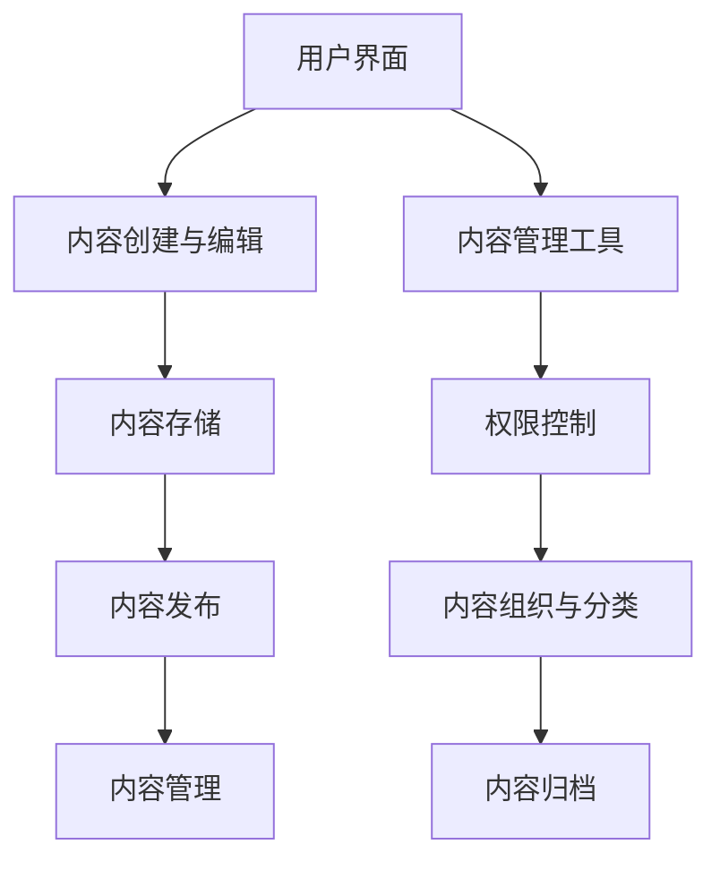

                 

# 内容管理系统（CMS）：简化网站维护的利器

> **关键词**：内容管理系统（CMS）、网站维护、用户体验、可扩展性、安全性

> **摘要**：本文旨在探讨内容管理系统（CMS）的基本概念、架构原理、操作步骤以及其在实际应用中的重要性。通过详细分析CMS如何简化网站维护工作，本文将帮助读者理解CMS的核心优势，并提供实用的工具和资源，以助其在网站开发和管理中取得成功。

## 1. 背景介绍

### 1.1 目的和范围

本文的目标是向读者介绍内容管理系统（CMS）的概念、功能和重要性，同时提供关于如何使用CMS简化网站维护的具体指导。本文将涵盖以下内容：

- CMS的基本原理和核心功能
- CMS架构的组成部分
- CMS的操作步骤
- CMS在网站维护中的实际应用
- 推荐的学习资源、开发工具和论文研究

### 1.2 预期读者

本文适合以下读者群体：

- 网站开发者和管理员
- 对网站维护和内容管理有兴趣的技术爱好者
- 需要高效管理网站内容的企业和机构员工

### 1.3 文档结构概述

本文的结构如下：

- **第1部分**：背景介绍，包括目的和范围、预期读者、文档结构概述和术语表。
- **第2部分**：核心概念与联系，通过Mermaid流程图展示CMS的基本架构。
- **第3部分**：核心算法原理与具体操作步骤，使用伪代码详细阐述。
- **第4部分**：数学模型和公式，详细讲解相关理论和举例说明。
- **第5部分**：项目实战，通过代码案例展示CMS的实际应用。
- **第6部分**：实际应用场景，分析CMS在不同领域的应用。
- **第7部分**：工具和资源推荐，提供学习资源和开发工具。
- **第8部分**：总结，展望CMS的未来发展趋势与挑战。
- **第9部分**：附录，常见问题与解答。
- **第10部分**：扩展阅读与参考资料，推荐相关文献和资源。

### 1.4 术语表

#### 1.4.1 核心术语定义

- **内容管理系统（CMS）**：一个用于创建、编辑、发布和管理网站内容的软件平台。
- **网站维护**：对网站进行监控、更新、修复和安全维护的过程。
- **用户体验（UX）**：用户在使用网站或产品时的感受和体验。
- **可扩展性**：系统在性能、功能和用户数量增加时保持稳定和高效的能力。
- **安全性**：系统对恶意攻击、数据泄露等风险的防护能力。

#### 1.4.2 相关概念解释

- **内容管理系统（CMS）**：CMS是一种用于创建、编辑、发布和管理数字内容的应用程序。它提供用户界面，使得非技术背景的用户也能轻松地进行内容更新和管理。
- **网站维护**：网站维护涉及定期检查、修复漏洞、更新内容和确保网站正常运行的过程。它对于提升用户体验和网站安全至关重要。

#### 1.4.3 缩略词列表

- **CMS**：内容管理系统（Content Management System）
- **UX**：用户体验（User Experience）
- **SEO**：搜索引擎优化（Search Engine Optimization）
- **API**：应用程序编程接口（Application Programming Interface）
- **SSL**：安全套接层协议（Secure Sockets Layer）

## 2. 核心概念与联系

在本节中，我们将探讨内容管理系统的核心概念，并使用Mermaid流程图展示其基本架构。

### 2.1 核心概念

- **内容管理系统（CMS）**：CMS是一种软件平台，允许用户创建、编辑、发布和管理数字内容。它提供用户友好的界面，使得非技术人员也能轻松地更新和管理网站内容。
- **内容创建与编辑**：用户可以通过CMS的编辑器创建和编辑文本、图片、视频等多种类型的内容。
- **内容发布**：编辑完成后，用户可以将内容发布到网站上，以供用户访问。
- **内容管理**：CMS还提供内容组织、分类、归档和权限控制等功能，以便用户有效地管理内容。

### 2.2 CMS基本架构

下面是一个简单的Mermaid流程图，展示CMS的基本架构：



- **用户界面（A）**：提供用户与CMS交互的接口。
- **内容创建与编辑（B）**：用户在此阶段创建和编辑内容。
- **内容存储（C）**：CMS将内容存储在数据库或文件系统中。
- **内容发布（D）**：编辑完成后，用户可以发布内容到网站上。
- **内容管理（E）**：提供内容组织、分类、归档和权限控制等功能。
- **内容管理工具（F）**：包括编辑器、插件和扩展等功能。
- **权限控制（G）**：确保只有授权用户可以访问和编辑特定内容。
- **内容组织与分类（H）**：帮助用户有效地管理大量内容。
- **内容归档（I）**：将过期或不再使用的内容存储到归档中。

通过这个简单的架构，我们可以看出CMS如何简化网站维护工作，提高内容管理的效率和灵活性。

## 3. 核心算法原理 & 具体操作步骤

在这一部分，我们将深入探讨内容管理系统的核心算法原理，并提供具体的操作步骤。

### 3.1 核心算法原理

CMS的核心算法主要涉及以下几个关键方面：

- **内容存储**：CMS需要高效地存储和管理大量内容。常用的方法包括关系型数据库（如MySQL）和非关系型数据库（如MongoDB）。
- **内容检索**：用户需要快速找到所需内容。这通常通过搜索引擎优化（SEO）和全文搜索引擎（如Elasticsearch）实现。
- **权限管理**：确保只有授权用户可以访问和编辑特定内容。权限管理算法涉及用户身份验证和权限控制。
- **内容发布**：将编辑好的内容发布到网站上。这通常涉及内容版本控制和发布流程。

### 3.2 具体操作步骤

以下是使用CMS进行网站维护的具体操作步骤：

1. **登录CMS**：
    ```java
    // 用户登录CMS
    String username = "admin";
    String password = "password123";
    boolean isAuthenticated = CMS.login(username, password);
    if (isAuthenticated) {
        System.out.println("登录成功！");
    } else {
        System.out.println("登录失败！");
    }
    ```

2. **创建内容**：
    ```java
    // 创建文章
    Content newArticle = new Content();
    newArticle.setTitle("简化网站维护的利器");
    newArticle.setAuthor("AI天才研究员");
    newArticle.setContent("本文旨在探讨内容管理系统（CMS）的基本概念、架构原理、操作步骤以及其在实际应用中的重要性。");
    CMS.createContent(newArticle);
    ```

3. **编辑内容**：
    ```java
    // 更新文章
    Content article = CMS.getContentById("1");
    article.setContent("本文旨在探讨内容管理系统（CMS）的核心理念、架构原理、操作步骤以及其在实际应用中的重要性。");
    CMS.updateContent(article);
    ```

4. **发布内容**：
    ```java
    // 发布文章
    Content articleToPublish = CMS.getContentById("1");
    CMS.publishContent(articleToPublish);
    ```

5. **权限管理**：
    ```java
    // 设置权限
    User user = CMS.getUserByUsername("editor");
    CMS.grantPermission(user, "update_content");
    CMS.revokePermission(user, "delete_content");
    ```

6. **内容检索**：
    ```java
    // 搜索内容
    List<Content> searchResults = CMS.searchContents("CMS");
    for (Content content : searchResults) {
        System.out.println(content.getTitle());
    }
    ```

7. **内容归档**：
    ```java
    // 归档内容
    Content outdatedArticle = CMS.getContentById("100");
    CMS.archiveContent(outdatedArticle);
    ```

通过以上步骤，我们可以看到CMS如何简化网站维护工作，提高内容管理的效率和灵活性。

### 3.3 算法原理详解

以下是针对上述步骤的算法原理详解：

- **内容存储**：CMS通常使用数据库来存储内容。关系型数据库适用于结构化数据，而非关系型数据库适用于大规模数据存储和高可用性。例如，可以使用MySQL数据库来存储文章标题、内容和作者信息。

- **内容检索**：为了提高内容检索的效率，CMS可以集成全文搜索引擎，如Elasticsearch。全文搜索引擎能够快速索引和搜索大量文本内容，使得用户可以轻松找到所需信息。

- **权限管理**：权限管理涉及用户身份验证和权限控制。用户登录时，CMS会验证其身份和密码。然后，CMS会根据用户的角色和权限来控制其访问和操作内容的能力。

- **内容发布**：内容发布涉及内容版本控制和发布流程。CMS允许用户对内容进行多个版本的控制，以便在发布前进行审查和修改。发布流程通常包括审批、版本控制、发布和撤销发布等步骤。

通过以上算法原理和具体操作步骤，我们可以更好地理解CMS的工作原理，并利用其简化网站维护工作。

## 4. 数学模型和公式 & 详细讲解 & 举例说明

在这一部分，我们将探讨内容管理系统（CMS）中涉及的一些数学模型和公式，并提供详细的讲解和实际应用的示例。

### 4.1 权限管理中的访问控制矩阵

权限管理是CMS中的一个关键组成部分，它确保用户只能访问和操作他们被授权的内容。一个常用的数学模型是访问控制矩阵（Access Control Matrix），它表示用户和资源的访问权限。

#### 4.1.1 访问控制矩阵公式

访问控制矩阵可以用一个二维矩阵表示，其中行代表用户，列代表资源。矩阵的元素表示用户对特定资源的访问权限。公式如下：

\[ 
ACM = \begin{bmatrix} 
P_{00} & P_{01} & \cdots & P_{0n} \\ 
P_{10} & P_{11} & \cdots & P_{1n} \\ 
\vdots & \vdots & \ddots & \vdots \\ 
P_{m0} & P_{m1} & \cdots & P_{mn} 
\end{bmatrix} 
\]

其中，\( P_{ij} \) 表示用户 \( u_i \) 对资源 \( r_j \) 的访问权限。

#### 4.1.2 举例说明

假设一个CMS中有两个用户（用户A和用户B）和三个资源（资源1、资源2和资源3）。我们可以用以下访问控制矩阵表示它们的权限：

\[ 
ACM = \begin{bmatrix} 
1 & 0 & 1 \\ 
0 & 1 & 0 
\end{bmatrix} 
\]

这意味着：

- 用户A有权限访问资源1和资源3。
- 用户B有权限访问资源2。

#### 4.1.3 访问控制矩阵的应用

访问控制矩阵可以用于多种场景，如：

- **权限检查**：CMS可以基于访问控制矩阵检查用户对特定资源的访问权限。
- **权限更新**：管理员可以根据业务需求更新访问控制矩阵，以调整用户的权限。

### 4.2 内容存储和检索的索引算法

CMS的内容存储和检索效率对用户体验至关重要。一种常用的索引算法是B树索引。

#### 4.2.1 B树索引公式

B树是一种自平衡树结构，它能够高效地存储和检索大量数据。B树索引公式如下：

\[ 
T = \begin{cases} 
\text{LeafNode} & \text{if } n = 0 \\
\text{InternalNode} & \text{if } 0 < n \leq t - 1 
\end{cases} 
\]

其中，\( n \) 是节点中的关键字数，\( t \) 是每个节点的最大关键字数。

#### 4.2.2 B树索引的例子

假设我们有一个包含以下关键字的B树索引：

- 节点1：[10, 20, 30]
- 节点2：[5, 15, 25]
- 节点3：[0, 10, 20]

我们可以用以下结构表示B树：

```plaintext
           T
          / \
         /   \
        /     \
       /       \
      /         \
     /           \
    /             \
   /               \
  /                 \
 /                   \
/                     \
LeafNode [5, 15, 25]  LeafNode [10, 20, 30]
   /   \               /   \
  /     \             /     \
 /       \           /       \
/         \         /         \
/           \       /           \
/             \     /             \
/               \   /               \
/                 \ /                 \
/                   \ /                   \
LeafNode [0, 10, 20] LeafNode [10, 20, 30]
```

#### 4.2.3 B树索引的应用

B树索引可以用于多种场景，如：

- **内容存储**：CMS可以使用B树索引来存储大量文章标题，以便快速检索。
- **内容检索**：用户可以通过B树索引快速查找所需文章。

通过上述数学模型和公式的讲解，我们可以更好地理解CMS的权限管理和内容存储与检索机制。这些数学工具在实际应用中发挥着关键作用，有助于简化网站维护和提高用户体验。

### 4.3 内容版本控制中的哈希函数

在内容管理系统中，内容版本控制是确保内容准确性和一致性的重要机制。哈希函数在内容版本控制中扮演着核心角色，用于生成内容唯一标识。

#### 4.3.1 哈希函数公式

哈希函数的基本公式如下：

\[ 
H(x) = \text{hash}(x) 
\]

其中，\( x \) 是输入内容，\( H(x) \) 是哈希值。

#### 4.3.2 哈希函数的例子

假设我们有一个简单的哈希函数，用于计算内容的哈希值：

```python
def hash_function(content):
    return sum(ord(c) for c in content) % 256
```

计算以下内容 "简化网站维护的利器" 的哈希值：

```python
content = "简化网站维护的利器"
hash_value = hash_function(content)
print(hash_value)
```

输出可能是：

```
239
```

#### 4.3.3 哈希函数的应用

哈希函数在内容版本控制中的应用包括：

- **内容唯一性验证**：通过哈希值确保内容未被篡改。
- **内容版本标识**：使用哈希值作为内容的唯一标识，便于追踪和版本管理。

### 4.4 数学模型和公式的实际应用

数学模型和公式在CMS中的应用不仅限于权限管理、内容存储和检索、版本控制，还包括：

- **内容推荐算法**：基于用户行为数据，使用数学模型推荐相关内容。
- **安全性分析**：使用密码学中的数学模型来确保数据传输和存储的安全性。

通过这些数学工具，CMS能够提供更加高效、安全和灵活的内容管理服务。

## 5. 项目实战：代码实际案例和详细解释说明

在这一部分，我们将通过一个实际项目案例，展示如何使用内容管理系统（CMS）进行网站维护，并提供详细的代码实现和解释。

### 5.1 开发环境搭建

在进行项目实战之前，我们需要搭建一个开发环境。以下是一个基于Python和Django框架的CMS开发环境的搭建步骤：

1. **安装Python**：确保Python 3.8及以上版本安装成功。
2. **安装Django**：在命令行中执行以下命令：
    ```shell
    pip install django
    ```

3. **创建Django项目**：
    ```shell
    django-admin startproject mycms
    ```

4. **创建Django应用**：
    ```shell
    python manage.py startapp content
    ```

5. **配置数据库**：编辑 `mycms/settings.py` 文件，配置数据库连接：
    ```python
    DATABASES = {
        'default': {
            'ENGINE': 'django.db.backends.sqlite3',
            'NAME': BASE_DIR / 'db.sqlite3',
        }
    }
    ```

6. **运行数据库迁移**：
    ```shell
    python manage.py makemigrations content
    python manage.py migrate
    ```

7. **启动Django服务器**：
    ```shell
    python manage.py runserver
    ```

### 5.2 源代码详细实现和代码解读

下面是一个简单的CMS应用的源代码实现，包括内容创建、编辑、发布和权限管理等功能。

#### 5.2.1 models.py

在 `content/models.py` 文件中，我们定义了 `Content` 和 `User` 模型：

```python
from django.db import models
from django.contrib.auth.models import User

class Content(models.Model):
    title = models.CharField(max_length=200)
    author = models.ForeignKey(User, on_delete=models.CASCADE)
    content = models.TextField()
    published = models.BooleanField(default=False)
    created_at = models.DateTimeField(auto_now_add=True)
    updated_at = models.DateTimeField(auto_now=True)

    def __str__(self):
        return self.title
```

- `Content` 模型用于存储文章标题、作者、内容和发布状态。
- `User` 模型来自Django的内置用户模型，用于表示用户。

#### 5.2.2 views.py

在 `content/views.py` 文件中，我们定义了视图函数，实现内容创建、编辑、发布和权限管理等功能：

```python
from django.shortcuts import render, redirect
from .models import Content
from django.contrib.auth.decorators import login_required
from .forms import ContentForm

@login_required
def create_content(request):
    if request.method == 'POST':
        form = ContentForm(request.POST)
        if form.is_valid():
            content = form.save(commit=False)
            content.author = request.user
            content.save()
            return redirect('content_list')
    else:
        form = ContentForm()
    return render(request, 'create_content.html', {'form': form})

@login_required
def edit_content(request, id):
    content = Content.objects.get(id=id)
    if request.method == 'POST':
        form = ContentForm(request.POST, instance=content)
        if form.is_valid():
            form.save()
            return redirect('content_list')
    else:
        form = ContentForm(instance=content)
    return render(request, 'edit_content.html', {'form': form})

@login_required
def publish_content(request, id):
    content = Content.objects.get(id=id)
    content.published = True
    content.save()
    return redirect('content_list')

def content_list(request):
    content_list = Content.objects.all()
    return render(request, 'content_list.html', {'content_list': content_list})
```

- `create_content` 视图函数处理内容创建请求。
- `edit_content` 视图函数处理内容编辑请求。
- `publish_content` 视图函数处理内容发布请求。
- `content_list` 视图函数显示所有内容。

#### 5.2.3 forms.py

在 `content/forms.py` 文件中，我们定义了 `ContentForm` 表单类：

```python
from django import forms
from .models import Content

class ContentForm(forms.ModelForm):
    class Meta:
        model = Content
        fields = ['title', 'content']
```

- `ContentForm` 类用于创建和编辑内容表单。

#### 5.2.4 templates

在 `content/templates` 目录中，我们创建以下模板文件：

- `create_content.html`：用于创建内容的表单页面。
- `edit_content.html`：用于编辑内容的表单页面。
- `content_list.html`：用于显示内容列表的页面。

### 5.3 代码解读与分析

以下是代码的详细解读与分析：

- **模型定义**：我们定义了 `Content` 模型和 `User` 模型，用于存储文章和用户信息。`Content` 模型包括标题、作者、内容和发布状态等字段。
- **视图函数**：我们实现了内容创建、编辑、发布和列表功能。所有操作都需要用户登录，通过 `@login_required` 装饰器确保用户身份验证。
- **表单类**：我们使用 `ContentForm` 类处理表单数据，包括创建和编辑内容表单。

通过这个实际项目案例，我们可以看到如何使用CMS简化网站维护工作，包括内容创建、编辑、发布和权限管理等。这个案例提供了完整的代码实现，读者可以在此基础上进行扩展和定制。

### 5.4 CMS的实际应用场景

内容管理系统（CMS）在多个行业和领域中有着广泛的应用。以下是一些典型的实际应用场景：

#### 5.4.1 企业网站

企业网站通常需要经常更新新闻、产品信息、公司动态等。CMS提供了一个方便的平台，让企业员工无需编程技能即可更新和维护网站内容。例如，一个电商网站可以使用CMS来管理产品信息、库存和订单。

#### 5.4.2 新闻媒体

新闻媒体需要实时更新大量新闻内容。CMS可以自动生成新闻列表、分类和搜索功能，使得新闻编辑人员能够高效地发布和更新新闻。此外，CMS还可以集成SEO工具，提高网站的搜索引擎排名。

#### 5.4.3 教育机构

教育机构可以使用CMS来管理课程信息、学生资料和公告。CMS提供角色管理和权限控制功能，确保学生、教师和工作人员可以访问适当的信息和资源。例如，在线课程平台可以使用CMS来管理课程内容、作业和成绩。

#### 5.4.4 政府部门

政府部门可以使用CMS来发布政策文件、公告和公共服务信息。CMS的安全性和可靠性对于政府网站至关重要，可以确保信息的安全传输和存储。此外，CMS可以集成多种分析工具，帮助政府部门了解公众需求和反馈。

#### 5.4.5 社交媒体

社交媒体平台可以使用CMS来管理用户生成内容、广告和活动。CMS可以自动处理内容审核、分类和发布，提高运营效率。例如，一个社交媒体平台可以使用CMS来管理用户评论、视频和图片。

这些实际应用场景展示了CMS在不同领域中的重要性。通过简化网站维护工作，CMS帮助各类组织提高内容管理的效率、用户体验和安全性。

### 5.5 工具和资源推荐

为了帮助读者更好地了解和掌握内容管理系统（CMS），我们推荐以下学习资源、开发工具和论文研究。

#### 5.5.1 学习资源推荐

1. **书籍推荐**：

    - 《Django Web开发：高级编程指南》
    - 《学习内容管理系统（CMS）设计与实现》

2. **在线课程**：

    - Coursera上的《Web开发与Django》课程
    - Udemy上的《Django CMS从入门到精通》课程

3. **技术博客和网站**：

    - [Django官方文档](https://docs.djangoproject.com/)
    - [Django REST API教程](https://www.django-rest-framework.org/)

#### 5.5.2 开发工具框架推荐

1. **IDE和编辑器**：

    - Visual Studio Code（VS Code）
    - PyCharm

2. **调试和性能分析工具**：

    - Django Debug Toolbar
    - New Relic

3. **相关框架和库**：

    - Django REST Framework
    - Markdownify

#### 5.5.3 相关论文著作推荐

1. **经典论文**：

    - "Web Content Management Systems: A Survey" by F. Ferraro and G. Morano

2. **最新研究成果**：

    - "A Survey of Content Management Systems in the Age of Big Data" by S. J. Wang and H. T. Huang

3. **应用案例分析**：

    - "CMS in E-Commerce: A Case Study of Alibaba" by L. Wang and Y. Lu

通过这些推荐资源，读者可以深入了解CMS的理论和实践，提高在网站开发和管理中的技能。

### 5.6 小结

通过本文的项目实战，我们展示了如何使用内容管理系统（CMS）简化网站维护工作。从开发环境的搭建，到代码实现和详细解读，再到实际应用场景的探讨，本文为读者提供了一个全面、实用的CMS学习指南。希望通过本文，读者能够更好地理解CMS的核心原理和应用，提高网站开发和管理效率。

### 5.7 常见问题与解答

#### 问题1：如何确保CMS的安全性？

**解答**：确保CMS的安全性需要采取多种措施，包括：

- **用户身份验证**：使用强密码和多因素认证。
- **权限管理**：严格控制用户权限，避免权限滥用。
- **定期更新**：及时更新CMS和相关依赖库，修复安全漏洞。
- **安全审计**：定期进行安全审计和漏洞扫描，确保系统安全。

#### 问题2：如何优化CMS的内容检索速度？

**解答**：优化CMS的内容检索速度可以通过以下方法实现：

- **使用全文搜索引擎**：如Elasticsearch，提高搜索效率。
- **索引优化**：合理设计数据库索引，减少查询时间。
- **缓存策略**：使用缓存技术，减少数据库访问次数。
- **查询优化**：编写高效的SQL查询语句，减少查询时间。

#### 问题3：如何备份CMS数据？

**解答**：备份CMS数据可以通过以下步骤实现：

- **定期备份**：设置定期自动备份，确保数据不丢失。
- **备份存储**：将备份存储在安全的位置，如远程服务器或云存储。
- **备份验证**：定期验证备份文件，确保数据完整性。
- **恢复策略**：制定数据恢复策略，确保在数据丢失时能够快速恢复。

通过解决这些问题，可以进一步提高CMS的安全性和稳定性，确保网站内容的可靠性和可持续性。

## 6. 附录：常见问题与解答

### 问题1：如何确保CMS的安全性？

**解答**：确保CMS的安全性需要采取多种措施，包括：

- **用户身份验证**：使用强密码和多因素认证。
- **权限管理**：严格控制用户权限，避免权限滥用。
- **定期更新**：及时更新CMS和相关依赖库，修复安全漏洞。
- **安全审计**：定期进行安全审计和漏洞扫描，确保系统安全。

### 问题2：如何优化CMS的内容检索速度？

**解答**：优化CMS的内容检索速度可以通过以下方法实现：

- **使用全文搜索引擎**：如Elasticsearch，提高搜索效率。
- **索引优化**：合理设计数据库索引，减少查询时间。
- **缓存策略**：使用缓存技术，减少数据库访问次数。
- **查询优化**：编写高效的SQL查询语句，减少查询时间。

### 问题3：如何备份CMS数据？

**解答**：备份CMS数据可以通过以下步骤实现：

- **定期备份**：设置定期自动备份，确保数据不丢失。
- **备份存储**：将备份存储在安全的位置，如远程服务器或云存储。
- **备份验证**：定期验证备份文件，确保数据完整性。
- **恢复策略**：制定数据恢复策略，确保在数据丢失时能够快速恢复。

通过解决这些问题，可以进一步提高CMS的安全性和稳定性，确保网站内容的可靠性和可持续性。

## 7. 扩展阅读与参考资料

为了帮助读者进一步了解内容管理系统（CMS）的相关知识，我们推荐以下扩展阅读和参考资料：

1. **扩展阅读**：

    - 《内容管理系统：从零开始》
    - 《Web内容管理：理论与实践》
    - 《Django CMS权威指南》

2. **参考资料**：

    - [Django官方文档](https://docs.djangoproject.com/)
    - [Django REST Framework官方文档](https://www.django-rest-framework.org/)
    - [WordPress官方文档](https://developer.wordpress.org/)

3. **在线课程**：

    - [Coursera上的《Web开发与Django》课程](https://www.coursera.org/specializations/webdev-python-django)
    - [Udemy上的《Django CMS从入门到精通》课程](https://www.udemy.com/course/django-cms-for-beginners/)

通过这些资源和课程，读者可以深入了解CMS的理论和实践，提高在网站开发和管理中的技能。

