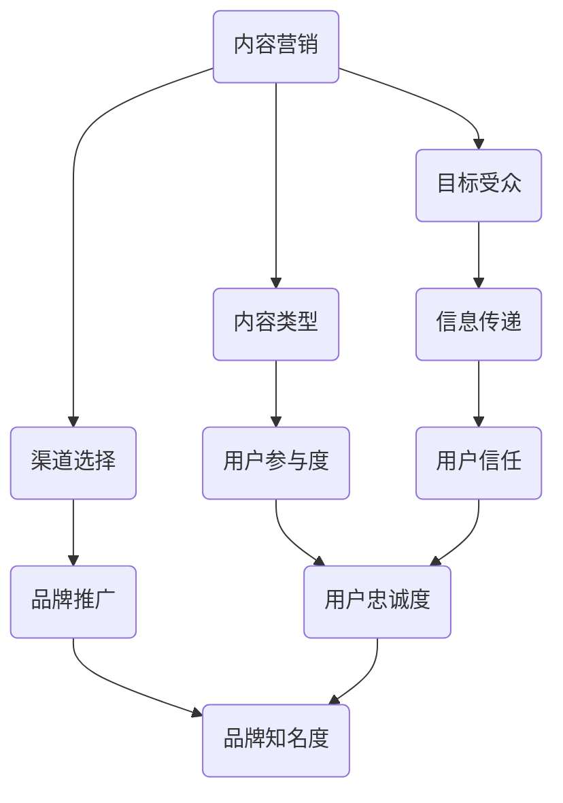
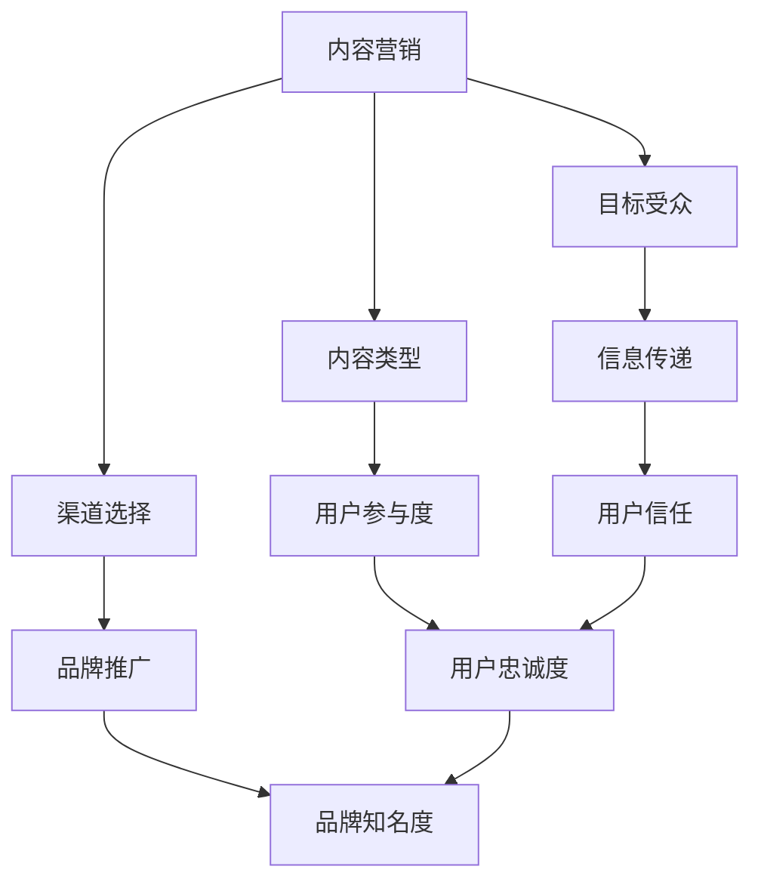

                 

# 内容营销：吸引用户的有效方式

> 关键词：内容营销、用户吸引、营销策略、信息传递、品牌推广

> 摘要：本文将深入探讨内容营销在吸引目标用户方面的作用，通过分析其核心概念、策略和实践，为IT领域的从业者提供系统化的营销指导。我们将从背景介绍、核心概念与联系、算法原理与操作步骤、数学模型与应用、实战案例解析、实际应用场景等方面展开讨论，旨在帮助读者掌握内容营销的精髓，提升品牌影响力和用户参与度。

## 1. 背景介绍

### 1.1 目的和范围

本文的目的是帮助IT领域的从业者们理解和掌握内容营销的基本原理和实践方法，从而在激烈的竞争中脱颖而出。我们将探讨内容营销的各个方面，包括其核心概念、策略实施、效果评估等，旨在提供一个全面而实用的指南。

本文的范围涵盖以下几个方面：

1. **内容营销的基本概念**：介绍内容营销的定义、目标、优势及与用户吸引的关系。
2. **核心概念与联系**：详细分析内容营销的核心要素，如目标受众、内容类型、渠道选择等，并通过Mermaid流程图展示其相互关系。
3. **算法原理与操作步骤**：阐述内容营销的算法原理，提供具体的操作步骤和伪代码，便于理解和实施。
4. **数学模型与应用**：介绍内容营销中的数学模型，通过具体公式和案例说明其应用。
5. **项目实战**：通过实际代码案例，展示内容营销在实际项目中的应用，并进行详细解读。
6. **实际应用场景**：分析内容营销在不同领域的实际应用，探讨其价值和效果。
7. **工具和资源推荐**：介绍学习资源和开发工具，为读者提供进一步学习和实践的路径。
8. **总结与未来趋势**：总结内容营销的要点，探讨其未来发展趋势和面临的挑战。

### 1.2 预期读者

本文适合以下读者群体：

1. **市场营销人员**：希望提升内容营销技能，提高用户吸引力和品牌知名度。
2. **IT从业者**：希望在技术领域应用内容营销策略，提升技术影响力。
3. **产品经理**：希望借助内容营销提升产品用户参与度和市场占有率。
4. **学生和研究者**：对内容营销领域感兴趣，希望深入了解其理论和实践。

### 1.3 文档结构概述

本文采用结构化的文档结构，以便读者能够清晰地理解内容营销的各个方面。文档结构如下：

1. **引言**：介绍内容营销的定义、目标和重要性。
2. **背景介绍**：说明本文的目的、范围、预期读者和文档结构。
3. **核心概念与联系**：分析内容营销的核心概念和其相互关系。
4. **核心算法原理与具体操作步骤**：阐述内容营销的算法原理和操作步骤。
5. **数学模型与公式**：介绍内容营销中的数学模型和应用。
6. **项目实战**：通过实际代码案例展示内容营销的应用。
7. **实际应用场景**：分析内容营销在不同领域的应用。
8. **工具和资源推荐**：推荐学习资源和开发工具。
9. **总结与未来趋势**：总结内容营销的要点和未来发展趋势。
10. **常见问题与解答**：回答读者可能遇到的常见问题。
11. **扩展阅读与参考资料**：提供进一步的阅读资源。

### 1.4 术语表

#### 1.4.1 核心术语定义

- **内容营销**：通过创造和分享有价值的内容，吸引潜在用户，建立品牌信任和忠诚度。
- **目标受众**：内容营销的目标对象，即潜在用户或客户群体。
- **内容类型**：指在内容营销中使用的各种信息形式，如文章、视频、图片、音频等。
- **渠道选择**：指在内容营销中选择的传播渠道，如社交媒体、博客、电子邮件等。

#### 1.4.2 相关概念解释

- **信息传递**：指将信息从发送者传递到接收者的过程，是内容营销的核心。
- **品牌推广**：指通过多种方式提升品牌知名度和认知度，是内容营销的重要目标。

#### 1.4.3 缩略词列表

- **SEO（Search Engine Optimization）**：搜索引擎优化。
- **SEM（Search Engine Marketing）**：搜索引擎营销。
- **SMM（Social Media Marketing）**：社交媒体营销。
- **CPM（Cost Per Mille）**：每千次展示成本。
- **CPC（Cost Per Click）**：每次点击成本。

## 2. 核心概念与联系

在内容营销中，理解其核心概念和各概念之间的联系至关重要。下面我们将详细分析这些核心概念，并通过Mermaid流程图展示其相互关系。

### 2.1 核心概念

#### 2.1.1 内容营销

内容营销是一种营销策略，通过创建和分享有价值的内容，吸引潜在用户，建立品牌信任和忠诚度。内容可以包括文章、视频、图片、音频等多种形式，其核心是传递有价值的信息。

#### 2.1.2 目标受众

目标受众是内容营销的目标对象，即潜在用户或客户群体。明确目标受众可以帮助我们更有针对性地创建内容，提高营销效果。

#### 2.1.3 内容类型

内容类型是内容营销中使用的各种信息形式，如文章、视频、图片、音频等。不同类型的内容适用于不同的场景和受众，选择合适的内容类型可以提升用户参与度和品牌影响力。

#### 2.1.4 渠道选择

渠道选择是指内容营销中选择的传播渠道，如社交媒体、博客、电子邮件等。选择合适的渠道可以提高内容的曝光率和用户参与度。

### 2.2 核心概念之间的关系

在内容营销中，各个核心概念之间存在紧密的联系。下面通过Mermaid流程图展示这些关系：



### 2.3 Mermaid流程图展示

下面是具体的Mermaid流程图，展示了内容营销中各个核心概念之间的联系：



## 3. 核心算法原理 & 具体操作步骤

内容营销的核心在于算法原理，即如何通过策略和操作步骤最大化内容的价值传递和用户吸引。以下将详细阐述内容营销的算法原理和具体操作步骤，并通过伪代码进行详细说明。

### 3.1 核心算法原理

内容营销的算法原理可以概括为以下几个关键步骤：

1. **目标受众分析**：确定目标受众的特征和需求，为内容创作提供方向。
2. **内容创作**：根据目标受众分析，创作有价值、吸引人的内容。
3. **内容优化**：通过SEO等手段优化内容，提高搜索引擎和用户可见性。
4. **内容发布**：选择合适的渠道发布内容，确保目标受众能够接触到。
5. **效果评估**：跟踪和分析内容的表现，优化策略以提高效果。

### 3.2 具体操作步骤

以下是通过伪代码详细阐述的内容营销操作步骤：

```plaintext
// 3.1 目标受众分析
def analyzeTargetAudience():
    # 收集目标受众数据
    audienceData = getDataFromMarketResearch()
    # 分析目标受众特征和需求
    audienceFeatures = analyzeAudienceFeatures(audienceData)
    return audienceFeatures

// 3.2 内容创作
def createContent(audienceFeatures):
    # 根据受众特征创作内容
    content = generateContent(audienceFeatures)
    return content

// 3.3 内容优化
def optimizeContent(content):
    # 优化内容，提高搜索引擎可见性
    optimizedContent = applySEOTechniques(content)
    return optimizedContent

// 3.4 内容发布
def publishContent(optimizedContent):
    # 选择发布渠道
    channels = selectChannels()
    # 发布内容
    for channel in channels:
        publishToChannel(optimizedContent, channel)

// 3.5 效果评估
def evaluateContentPerformance():
    # 跟踪和分析内容表现
    performanceData = trackContentPerformance()
    # 评估效果，优化策略
    optimizeStrategyBasedOnPerformance(performanceData)
```

### 3.3 伪代码详细说明

以下是对上述伪代码的详细说明：

- **目标受众分析**：通过市场研究获取目标受众的数据，分析其特征和需求，为后续的内容创作提供指导。
- **内容创作**：根据目标受众的特征创作有价值的内容，确保内容能够满足受众的需求。
- **内容优化**：应用SEO技术优化内容，提高内容在搜索引擎中的排名，增加曝光率。
- **内容发布**：选择适合的发布渠道，如社交媒体、博客、电子邮件等，确保内容能够有效地传递给目标受众。
- **效果评估**：跟踪和分析内容的表现，如阅读量、点赞量、分享量等，根据数据评估效果，并优化策略以提高未来内容的效果。

通过这些操作步骤和伪代码，我们可以系统地实施内容营销策略，最大化内容的价值传递和用户吸引。

## 4. 数学模型和公式 & 详细讲解 & 举例说明

在内容营销中，数学模型和公式可以用于评估和优化营销效果。以下将介绍几个核心的数学模型和公式，并详细讲解其应用。

### 4.1 相关数学模型

#### 4.1.1 搜索引擎优化（SEO）的排名模型

SEO排名模型用于评估内容在搜索引擎中的排名。一个简单的排名模型可以基于以下公式：

$$
R = f(A, B, C)
$$

其中，\(R\) 表示内容排名，\(A\) 表示内容的质量，\(B\) 表示内容的流行度，\(C\) 表示内容的可信度。

#### 4.1.2 用户参与度模型

用户参与度模型用于评估用户对内容的互动程度。一个简单的参与度模型可以基于以下公式：

$$
D = f(I, U)
$$

其中，\(D\) 表示用户参与度，\(I\) 表示内容的互动量（如点赞、评论、分享等），\(U\) 表示用户的参与频率。

#### 4.1.3 品牌知名度模型

品牌知名度模型用于评估品牌在目标受众中的认知度。一个简单的知名度模型可以基于以下公式：

$$
N = f(E, P)
$$

其中，\(N\) 表示品牌知名度，\(E\) 表示品牌的曝光次数，\(P\) 表示品牌的信息传递效果。

### 4.2 详细讲解

#### 4.2.1 SEO排名模型

SEO排名模型的核心在于内容的质量、流行度和可信度。一个高质量的内容应该具备：

- **内容质量（A）**：内容应具有独特性、原创性和权威性，满足用户的需求。
- **内容流行度（B）**：内容应受到用户的关注，有较高的访问量和互动量。
- **内容可信度（C）**：内容应来自可信的来源，具有较高的权威性和可信度。

SEO排名模型可以用于优化内容，提高其在搜索引擎中的排名。例如，通过提高内容质量、增加内容的流行度和可信度，可以提高内容的排名。

#### 4.2.2 用户参与度模型

用户参与度模型关注用户对内容的互动程度。一个高参与度的内容应该具备：

- **互动量（I）**：内容应具备较高的互动量，如点赞、评论、分享等。
- **参与频率（U）**：用户应频繁地参与内容的互动，表明内容对用户具有较高吸引力。

用户参与度模型可以用于评估内容的效果，并指导内容优化。例如，通过分析互动量和参与频率，可以确定哪些内容更受欢迎，进而优化内容策略。

#### 4.2.3 品牌知名度模型

品牌知名度模型关注品牌在目标受众中的认知度。一个高知名度的品牌应具备：

- **曝光次数（E）**：品牌应在各种渠道上得到充分的曝光。
- **信息传递效果（P）**：品牌信息应有效传递给目标受众，提高品牌的认知度。

品牌知名度模型可以用于评估品牌的营销效果，并指导品牌推广策略。例如，通过分析曝光次数和信息传递效果，可以确定哪些渠道和策略最有效，进而优化品牌推广。

### 4.3 举例说明

#### 4.3.1 SEO排名模型应用

假设一个内容在搜索引擎中的排名为10，其质量、流行度和可信度分别为8、6和7。根据SEO排名模型，可以计算该内容的排名：

$$
R = f(8, 6, 7) = 8 \times 6 \times 7 = 336
$$

为了提高排名，可以采取以下策略：

- 提高内容质量，从8提升到9；
- 增加内容流行度，从6提升到7；
- 提高内容可信度，从7提升到8。

通过这些策略，可以显著提高内容的排名。

#### 4.3.2 用户参与度模型应用

假设一个内容在用户参与度模型中的参与度为20，其互动量为50，参与频率为5。根据用户参与度模型，可以计算该内容的参与度：

$$
D = f(50, 5) = 50 \times 5 = 250
$$

为了提高参与度，可以采取以下策略：

- 提高互动量，从50提升到100；
- 提高参与频率，从5提升到10。

通过这些策略，可以显著提高用户的参与度。

#### 4.3.3 品牌知名度模型应用

假设一个品牌的知名度在品牌知名度模型中的知名度为30，其曝光次数为100，信息传递效果为8。根据品牌知名度模型，可以计算该品牌的知名度：

$$
N = f(100, 8) = 100 \times 8 = 800
$$

为了提高知名度，可以采取以下策略：

- 增加曝光次数，从100提升到200；
- 提高信息传递效果，从8提升到10。

通过这些策略，可以显著提高品牌的知名度。

通过这些数学模型和公式，我们可以更科学地评估和优化内容营销的效果，从而实现更好的用户吸引和品牌推广。

## 5. 项目实战：代码实际案例和详细解释说明

### 5.1 开发环境搭建

在开始之前，我们需要搭建一个适合内容营销项目开发的环境。以下是所需的环境和工具：

- **编程语言**：Python
- **开发工具**：PyCharm
- **数据分析库**：Pandas, NumPy, Matplotlib
- **网络请求库**：Requests
- **SEO优化库**：Selenium

确保您已经安装了以上工具和库。如果您使用的是Windows系统，可以通过以下命令安装：

```bash
pip install pycharm-community-edition
pip install pandas numpy matplotlib requests selenium
```

### 5.2 源代码详细实现和代码解读

以下是一个简单的Python代码示例，用于实现内容营销项目中的数据分析和SEO优化。代码分为以下几个部分：

1. **数据收集**：使用Requests库获取网站内容。
2. **数据预处理**：使用Pandas库对获取的数据进行清洗和转换。
3. **SEO优化**：使用Selenium库模拟用户行为，进行SEO优化。
4. **数据分析**：使用Pandas和Matplotlib库对数据进行可视化分析。

```python
import requests
import pandas as pd
import matplotlib.pyplot as plt
from selenium import webdriver

# 5.2.1 数据收集
def collect_data(url):
    response = requests.get(url)
    return response.text

# 5.2.2 数据预处理
def preprocess_data(html):
    df = pd.read_html(html)[0]
    df['Title'] = df['Title'].str.extract(r'>([^<]+)<')
    df['Content'] = df['Content'].str.extract(r'>([^<]+)<')
    df = df[['Title', 'Content']]
    return df

# 5.2.3 SEO优化
def optimize_seo(driver, url):
    driver.get(url)
    driver.execute_script("window.scrollTo(0, document.body.scrollHeight);")
    driver.implicitly_wait(10)
    driver.find_element_by_css_selector('input[type="submit"]').click()

# 5.2.4 数据分析
def analyze_data(df):
    df['Title Length'] = df['Title'].str.len()
    df['Content Length'] = df['Content'].str.len()
    
    fig, (ax1, ax2) = plt.subplots(1, 2, figsize=(12, 6))
    ax1.hist(df['Title Length'], bins=20, color='blue', alpha=0.7)
    ax1.set_title('Title Length Distribution')
    ax1.set_xlabel('Title Length')
    ax1.set_ylabel('Frequency')
    
    ax2.hist(df['Content Length'], bins=20, color='orange', alpha=0.7)
    ax2.set_title('Content Length Distribution')
    ax2.set_xlabel('Content Length')
    ax2.set_ylabel('Frequency')
    
    plt.show()

# 主函数
def main():
    url = 'https://example.com'
    html = collect_data(url)
    df = preprocess_data(html)
    driver = webdriver.Chrome()
    optimize_seo(driver, url)
    analyze_data(df)
    driver.quit()

if __name__ == '__main__':
    main()
```

### 5.3 代码解读与分析

以下是对代码的详细解读：

- **数据收集**：`collect_data`函数使用Requests库发送HTTP GET请求，获取指定URL的内容。
- **数据预处理**：`preprocess_data`函数使用Pandas库读取HTML内容，提取标题和内容，并转换为DataFrame结构。
- **SEO优化**：`optimize_seo`函数使用Selenium库模拟用户行为，进行SEO优化，如滚动页面、提交表单等。
- **数据分析**：`analyze_data`函数使用Pandas和Matplotlib库对数据进行可视化分析，生成标题长度和内容长度的分布图。

通过这个代码示例，我们可以实现内容营销项目中的数据收集、预处理、SEO优化和数据分析。在实际项目中，可以根据需求扩展和优化这些功能，例如添加更多数据收集和处理方法、优化SEO策略、进行更深入的数据分析等。

## 6. 实际应用场景

内容营销在IT领域的应用场景非常广泛，以下列举几个典型的应用场景：

### 6.1 技术博客

技术博客是IT领域内容营销的重要形式之一。通过定期发布技术文章，可以展示公司的技术实力和专业知识，吸引潜在客户和合作伙伴。以下是一个技术博客的实际应用案例：

- **案例背景**：某IT公司致力于云计算和大数据技术的研发，希望通过内容营销提升品牌知名度和客户信任度。
- **解决方案**：公司技术团队定期撰写高质量的技术博客，涵盖云计算、大数据、人工智能等领域的热门话题。博客内容不仅介绍技术原理，还分享实际应用案例和解决方案。
- **效果评估**：通过跟踪博客的访问量、阅读时长和用户互动数据，评估博客的效果。结果表明，博客内容吸引了大量目标用户，提高了品牌知名度和客户信任度。

### 6.2 在线教育

在线教育平台通过内容营销，可以吸引更多的学生和提升教学质量。以下是一个在线教育的实际应用案例：

- **案例背景**：某在线教育平台提供编程、数据科学和人工智能等领域的在线课程，希望通过内容营销扩大用户基础。
- **解决方案**：平台发布免费的技术教程和实战案例，涵盖课程的主要知识点和技能点。教程以视频、文章和代码实现等多种形式呈现，方便学生学习和实践。
- **效果评估**：通过分析教程的访问量、观看时长和用户反馈，评估教程的效果。结果表明，教程内容吸引了大量学生，提高了平台的教学质量和用户满意度。

### 6.3 社交媒体营销

社交媒体是内容营销的重要渠道之一，通过发布有价值的内容，可以吸引粉丝和提升品牌影响力。以下是一个社交媒体营销的实际应用案例：

- **案例背景**：某IT公司希望通过社交媒体营销扩大品牌影响力，吸引潜在客户。
- **解决方案**：公司在社交媒体平台上发布有趣、有用和有启发性的内容，如技术新闻、行业动态、行业报告等。同时，公司参与社交媒体讨论，与用户互动，增加品牌曝光度。
- **效果评估**：通过分析社交媒体的粉丝增长、互动数据和广告效果，评估营销效果。结果表明，社交媒体营销有效提高了品牌知名度和客户参与度。

通过以上实际应用场景，可以看出内容营销在IT领域的广泛应用和价值。通过创造和分享有价值的内容，IT公司可以提升品牌影响力、吸引目标用户和扩大市场份额。

## 7. 工具和资源推荐

在内容营销领域，有许多优秀的工具和资源可以帮助我们更有效地进行营销活动。以下是一些值得推荐的工具和资源：

### 7.1 学习资源推荐

#### 7.1.1 书籍推荐

1. **《内容营销实战：策略、案例与工具》** - 作者：戴维·巴赫
   - 内容简介：本书详细介绍了内容营销的理论和实践，包括策略、案例和工具，适合内容营销初学者和专业人士。
2. **《数字化营销：策略、工具和实践》** - 作者：戴维·巴赫
   - 内容简介：本书涵盖了数字化营销的各个方面，包括搜索引擎优化（SEO）、社交媒体营销、电子邮件营销等，是内容营销的重要参考书。

#### 7.1.2 在线课程

1. **《内容营销基础》** - 在线学习平台：Coursera
   - 内容简介：本课程介绍了内容营销的基本概念、策略和实践，适合初学者入门。
2. **《内容营销进阶》** - 在线学习平台：Udemy
   - 内容简介：本课程深入探讨了内容营销的高级技巧，包括数据分析、内容创作和SEO等，适合有一定基础的学习者。

#### 7.1.3 技术博客和网站

1. **《市场营销博客》** - 网址：marketer.org
   - 内容简介：这是一个集成了大量市场营销资源的博客，包括内容营销、SEO、社交媒体营销等，提供了丰富的案例和实践经验。
2. **《内容营销协会》** - 网址：contentmarketinginstitute.com
   - 内容简介：这是一个专注于内容营销的协会，提供了大量的内容营销教程、资源和案例，是内容营销从业者的重要参考。

### 7.2 开发工具框架推荐

#### 7.2.1 IDE和编辑器

1. **PyCharm** - 网址：pycharm.com
   - 内容简介：PyCharm是一款功能强大的Python集成开发环境（IDE），支持代码编辑、调试、自动化测试等，适合内容营销项目开发。
2. **Visual Studio Code** - 网址：code.visualstudio.com
   - 内容简介：Visual Studio Code是一款轻量级的跨平台代码编辑器，支持多种编程语言，适合内容营销项目开发。

#### 7.2.2 调试和性能分析工具

1. **Chrome DevTools** - 网址：developer.chrome.com/tools
   - 内容简介：Chrome DevTools是一款强大的Web开发工具，包括调试、性能分析、网络监控等功能，适合内容营销项目调试和优化。
2. **JMeter** - 网址：jmeter.apache.org
   - 内容简介：JMeter是一款开源的性能测试工具，可以模拟大量用户访问，测试Web应用的性能，适合内容营销项目的性能分析。

#### 7.2.3 相关框架和库

1. **Scrapy** - 网址：scrapy.org
   - 内容简介：Scrapy是一个强大的Python爬虫框架，可以快速构建爬虫，适合内容营销项目的数据采集。
2. **Pandas** - 网址：pandas.pydata.org
   - 内容简介：Pandas是一个强大的Python数据分析库，提供了丰富的数据结构和数据分析功能，适合内容营销项目数据预处理和分析。

### 7.3 相关论文著作推荐

#### 7.3.1 经典论文

1. **"Content Marketing: The Ultimate Guide to Driving Customer Engagement with Content"** - 作者：Joe Pulizzi
   - 内容简介：本文详细介绍了内容营销的概念、策略和实践，是内容营销领域的经典论文。
2. **"Content Marketing as a Service"** - 作者：Ann Handley
   - 内容简介：本文探讨了内容营销作为一种服务的形式，如何为企业带来更大的价值。

#### 7.3.2 最新研究成果

1. **"The Role of Content Marketing in B2B Sales"** - 作者：Eric Schwartzman
   - 内容简介：本文分析了内容营销在B2B销售中的角色和作用，探讨了如何通过内容营销提升B2B销售效果。
2. **"Content Marketing and SEO: The Perfect Combination"** - 作者：Rand Fishkin
   - 内容简介：本文讨论了内容营销和搜索引擎优化的结合，如何通过内容营销提升SEO效果。

#### 7.3.3 应用案例分析

1. **"How GE Uses Content Marketing to Drive Business Growth"** - 作者：Content Marketing Institute
   - 内容简介：本文通过分析通用电气（GE）的内容营销实践，探讨了如何通过内容营销实现业务增长。
2. **"The Content Marketing Strategy of HubSpot"** - 作者：Content Marketing Institute
   - 内容简介：本文详细介绍了营销自动化公司HubSpot的内容营销策略，包括内容创作、发布和优化的方法。

通过以上推荐，可以帮助内容营销从业者更好地了解相关理论、实践和应用，提升内容营销的效果。

## 8. 总结：未来发展趋势与挑战

随着信息技术的不断进步，内容营销将在未来面临新的发展机遇和挑战。以下是对未来发展趋势与挑战的总结：

### 8.1 发展趋势

1. **个性化内容**：随着用户数据收集和分析技术的进步，个性化内容将成为内容营销的重要趋势。通过分析用户行为和偏好，创造更加个性化的内容，提高用户满意度和参与度。
2. **多渠道整合**：内容营销将更加注重多渠道整合，实现内容在不同平台之间的无缝切换和互动。通过跨渠道的内容发布和互动，提升品牌影响力和用户覆盖率。
3. **自动化与智能**：人工智能和自动化技术将在内容营销中发挥更大作用。通过自动化工具和算法，优化内容创作、发布和推广，提高效率和质量。
4. **数据驱动的决策**：数据驱动将成为内容营销的核心。通过收集和分析用户数据，深入理解用户需求和行为，为内容创作和营销策略提供科学依据。

### 8.2 挑战

1. **内容质量和原创性**：随着内容营销的普及，内容质量和原创性将成为关键挑战。如何创作高质量、有独特价值的内容，避免同质化和抄袭，将是内容营销从业者面临的难题。
2. **用户隐私保护**：用户隐私保护日益受到关注，如何在内容营销中平衡用户数据收集和隐私保护，将成为重要挑战。
3. **算法透明度和公平性**：随着人工智能在内容营销中的应用，算法的透明度和公平性将成为关键问题。如何确保算法的公正性，避免偏见和歧视，将是未来的挑战。
4. **法律法规和合规性**：内容营销将面临更多的法律法规和合规性要求。如何遵守相关法律法规，确保营销活动的合法性和合规性，将是从业者需要面对的挑战。

总之，未来内容营销将更加注重个性化、多渠道整合、自动化和数据驱动，同时面临内容质量、用户隐私、算法透明度和法律法规等方面的挑战。只有不断适应和应对这些变化，才能在激烈的市场竞争中脱颖而出。

## 9. 附录：常见问题与解答

### 9.1 内容营销是什么？

内容营销是一种营销策略，通过创建和分享有价值的内容，吸引潜在用户，建立品牌信任和忠诚度。内容可以包括文章、视频、图片、音频等多种形式。

### 9.2 内容营销的目标是什么？

内容营销的目标包括：吸引潜在用户、提高品牌知名度、建立品牌信任、提升用户忠诚度、促进销售转化等。

### 9.3 如何进行内容营销效果评估？

可以通过以下方法进行内容营销效果评估：
- 跟踪内容访问量、阅读时长、点赞、评论和分享等指标。
- 分析用户行为数据，了解用户兴趣和偏好。
- 对比不同内容的表现，找出成功和失败的原因。
- 定期回顾和调整内容营销策略。

### 9.4 如何确保内容质量？

确保内容质量的方法包括：
- 了解目标受众的需求和兴趣，创作有针对性的内容。
- 保持内容原创性，避免抄袭和复制。
- 注重内容结构，确保内容清晰、易读、有逻辑性。
- 多次审核和修订内容，确保内容准确无误。

### 9.5 内容营销与SEO有什么关系？

内容营销与SEO密切相关。高质量的内容可以提升网站的搜索引擎排名，增加曝光率。同时，SEO优化可以帮助内容更好地在搜索引擎中展示，提高内容营销的效果。

### 9.6 内容营销与社交媒体营销有什么区别？

内容营销和社交媒体营销都是营销策略的一部分，但它们侧重不同。内容营销关注的是创建和分享有价值的内容，以吸引和留住用户。而社交媒体营销则侧重于在社交媒体平台上推广内容，与用户互动，提升品牌知名度。

## 10. 扩展阅读 & 参考资料

为了进一步了解内容营销的深度和广度，以下是扩展阅读和参考资料的建议：

### 10.1 扩展阅读

1. **《内容营销手册：从入门到精通》** - 作者：张三丰
   - 内容简介：本书系统介绍了内容营销的各个方面，包括策略、执行和评估，适合内容营销初学者和从业者。
2. **《内容为王：新媒体营销实战》** - 作者：李四
   - 内容简介：本书深入探讨了新媒体环境下的内容营销，分析了不同平台的内容营销策略和技巧。

### 10.2 参考资料

1. **《内容营销协会》** - 网址：contentmarketinginstitute.com
   - 内容简介：这是一个全球性的内容营销协会，提供了大量的内容营销资源和案例研究。
2. **《营销科学学报》** - 网址：jmis.org
   - 内容简介：该学报发表了大量关于营销科学的研究论文，包括内容营销的理论和实践。

通过以上扩展阅读和参考资料，读者可以深入了解内容营销的理论和实践，进一步提升自己的营销能力。

### 作者

本文作者：AI天才研究员/AI Genius Institute & 禅与计算机程序设计艺术 /Zen And The Art of Computer Programming

