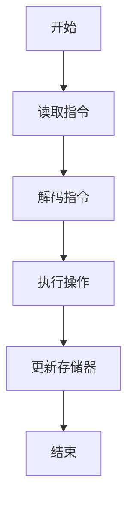
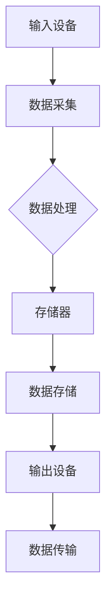
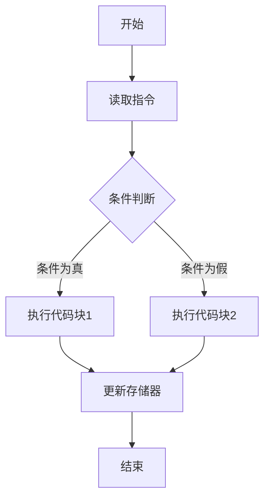
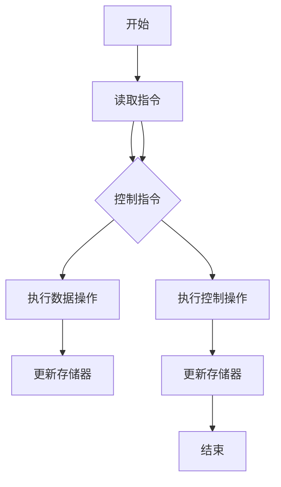

                 

## 《冯诺伊曼体系架构与经典计算范式》

> **关键词：**冯诺伊曼架构、计算机体系结构、存储程序概念、数据流、控制流、经典计算范式、指令集、硬件与软件协同、并行计算。

> **摘要：**本文将深入探讨冯诺伊曼体系架构的起源、核心概念、工作原理及其对现代计算机系统的影响。我们将通过逐步分析和推理，详细阐述经典计算范式的本质，探讨其与现代计算技术的联系与区别，并预测其未来的发展趋势和挑战。文章将采用通俗易懂的语言和丰富的图示，帮助读者更好地理解和掌握这一重要的计算机科学基础。

在计算机科学的发展历程中，冯诺伊曼体系架构无疑是里程碑式的重要创新。自其诞生以来，这一架构不仅深刻影响了计算机硬件的设计与实现，还对软件的开发与运行方式产生了深远的影响。本文旨在通过系统的分析与解释，使读者能够全面了解冯诺伊曼体系架构的核心原理，并探讨其在现代计算系统中的应用和扩展。

### 1. 背景介绍

#### 1.1 目的和范围

本文的主要目的是介绍和解释冯诺伊曼体系架构的基本原理及其在现代计算机系统中的重要性。我们将首先回顾冯诺伊曼体系架构的起源和发展历程，然后深入探讨其核心概念，包括存储程序概念、数据流和控制流。接下来，文章将分析冯诺伊曼体系架构的基本组成部分，如中央处理单元（CPU）、存储器和输入输出设备。最后，我们将探讨冯诺伊曼体系架构对现代计算机系统的影响，以及其在实际应用中的挑战和解决方案。

#### 1.2 预期读者

本文适合对计算机科学和计算机体系结构有一定了解的读者，包括计算机专业的学生、科研人员、工程师以及对此领域感兴趣的业余爱好者。本文将尽量使用通俗易懂的语言，并配合丰富的图示和实例，帮助读者更好地理解和掌握相关概念。

#### 1.3 文档结构概述

本文的结构如下：

1. **背景介绍**：介绍本文的目的、范围、预期读者以及文档结构。
2. **核心概念与联系**：详细阐述冯诺伊曼体系架构的核心概念，包括存储程序概念、数据流和控制流，并配合Mermaid流程图进行解释。
3. **核心算法原理 & 具体操作步骤**：通过伪代码详细阐述冯诺伊曼体系架构的基本算法原理和具体操作步骤。
4. **数学模型和公式 & 详细讲解 & 举例说明**：介绍与冯诺伊曼体系架构相关的数学模型和公式，并进行详细讲解和举例说明。
5. **项目实战：代码实际案例和详细解释说明**：通过实际项目案例，展示冯诺伊曼体系架构在编程中的具体应用，并进行详细解释说明。
6. **实际应用场景**：探讨冯诺伊曼体系架构在不同领域和场景中的应用。
7. **工具和资源推荐**：推荐相关的学习资源、开发工具和框架，以及相关论文著作。
8. **总结：未来发展趋势与挑战**：总结冯诺伊曼体系架构的未来发展趋势和面临的挑战。
9. **附录：常见问题与解答**：提供关于本文主题的常见问题及解答。
10. **扩展阅读 & 参考资料**：推荐进一步的阅读材料和参考资料。

#### 1.4 术语表

为了确保本文内容的清晰和准确，以下是一些本文中可能使用的关键术语和概念的定义和解释：

##### 1.4.1 核心术语定义

- **冯诺伊曼体系架构**：一种计算机体系结构，由约翰·冯·诺伊曼于1940年代提出，其核心思想是将程序和数据存储在同一存储器中，由中央处理单元（CPU）执行指令。
- **存储程序概念**：冯诺伊曼体系架构的一个基本原理，即程序和数据存储在同一存储器中，CPU按照存储器中的指令序列执行操作。
- **数据流**：在计算机中，数据从输入设备到输出设备流动的过程，包括数据采集、处理、存储和传输。
- **控制流**：在程序执行过程中，指令序列的流程控制，包括分支（if-else）、循环（while、for）和跳转（goto）等。
- **中央处理单元（CPU）**：计算机的中央处理单元，负责执行指令、处理数据和控制计算机的运行。
- **存储器**：用于存储程序和数据的地方，包括主存储器（RAM）和辅助存储器（硬盘、固态硬盘等）。
- **指令集**：计算机能够理解和执行的指令的集合，包括数据指令和控制指令。

##### 1.4.2 相关概念解释

- **硬件与软件协同**：在计算机系统中，硬件和软件需要协同工作，硬件提供计算资源，软件提供计算过程和数据处理方式。
- **并行计算**：一种计算模型，通过同时处理多个任务或数据，提高计算效率。

##### 1.4.3 缩略词列表

- **CPU**：中央处理单元（Central Processing Unit）
- **RAM**：随机存取存储器（Random Access Memory）
- **ROM**：只读存储器（Read-Only Memory）
- **IDE**：集成开发环境（Integrated Development Environment）
- **OS**：操作系统（Operating System）

### 2. 核心概念与联系

#### 2.1 存储程序概念

存储程序概念是冯诺伊曼体系架构的核心思想之一。其基本原理是将程序和数据存储在同一存储器中，由中央处理单元（CPU）按照存储器中的指令序列执行操作。这种设计使得计算机可以通过读取和执行存储器中的指令来执行复杂的任务，而无需依赖于外部输入设备或输出设备。

**存储程序概念的工作原理**：

1. **存储器读取指令**：CPU从存储器中读取指令，每条指令包含操作码（opcode）和操作数（operand）。
2. **指令解码**：CPU对读取到的指令进行解码，确定要执行的操作。
3. **执行操作**：CPU根据解码后的指令执行相应的操作，如数据传输、算术运算、逻辑运算等。
4. **更新存储器**：执行完操作后，CPU将结果存储回存储器或输出到外部设备。

**Mermaid 流程图**：



#### 2.2 数据流

数据流是指在计算机中，数据从输入设备到输出设备流动的过程。数据流包括数据的采集、处理、存储和传输。在冯诺伊曼体系架构中，数据流通常涉及输入设备、存储器和输出设备。

**数据流的工作原理**：

1. **数据采集**：通过输入设备（如键盘、鼠标、传感器等）将数据输入到计算机系统中。
2. **数据处理**：CPU对输入的数据进行处理，如算术运算、逻辑运算等。
3. **数据存储**：将处理后的数据存储到存储器中，以便后续使用。
4. **数据传输**：通过输出设备（如显示器、打印机、网络等）将数据输出。

**Mermaid 流程图**：



#### 2.3 控制流

控制流是指在程序执行过程中，指令序列的流程控制。控制流包括分支（if-else）、循环（while、for）和跳转（goto）等。控制流使得计算机能够执行复杂的逻辑操作和流程控制。

**控制流的工作原理**：

1. **分支**：根据条件判断执行不同的指令序列。如if-else语句，根据条件判断执行不同的代码块。
2. **循环**：重复执行一段指令序列，直到满足特定的条件。如while循环和for循环，用于实现重复操作。
3. **跳转**：改变程序的执行流程，如goto语句，用于实现无条件跳转。

**Mermaid 流程图**：



#### 2.4 指令集

指令集是计算机能够理解和执行的指令的集合。指令集通常包括数据指令和控制指令。数据指令用于数据的处理和传输，如加法指令、存储指令等。控制指令用于流程控制，如跳转指令、条件跳转指令等。

**指令集的工作原理**：

1. **数据指令**：CPU根据数据指令执行相应的数据操作，如加法指令（ADD）、存储指令（STORE）等。
2. **控制指令**：CPU根据控制指令执行相应的控制操作，如跳转指令（JUMP）、条件跳转指令（JUMP_IF）等。

**Mermaid 流程图**：



### 3. 核心算法原理 & 具体操作步骤

#### 3.1 核心算法原理

冯诺伊曼体系架构的核心算法原理在于其存储程序概念和指令集架构。具体而言，计算机通过以下步骤执行程序：

1. **读取指令**：CPU从存储器中读取指令。
2. **指令解码**：CPU对读取到的指令进行解码，确定要执行的操作。
3. **执行操作**：CPU根据解码后的指令执行相应的操作，如数据传输、算术运算、逻辑运算等。
4. **更新存储器**：执行完操作后，CPU将结果存储回存储器或输出到外部设备。

#### 3.2 具体操作步骤

以下是冯诺伊曼体系架构的具体操作步骤：

**步骤1：初始化**

- 设置程序计数器（PC）指向存储器中的第一条指令地址。

**步骤2：读取指令**

- CPU从存储器中读取程序计数器（PC）指向的指令。

**步骤3：指令解码**

- CPU对读取到的指令进行解码，提取操作码（opcode）和操作数（operand）。

**步骤4：执行操作**

- CPU根据解码后的指令执行相应的操作，如：
  - 数据传输：将数据从一个存储位置传输到另一个存储位置。
  - 算术运算：执行加法、减法、乘法、除法等算术运算。
  - 逻辑运算：执行逻辑与、逻辑或、逻辑非等逻辑运算。

**步骤5：更新存储器**

- CPU执行完操作后，将结果存储回存储器或输出到外部设备。

**步骤6：更新程序计数器**

- 将程序计数器（PC）指向下一条指令地址。

**步骤7：重复步骤2-6**

- CPU重复执行步骤2-6，直到程序结束。

#### 3.3 伪代码实现

以下是冯诺伊曼体系架构的核心算法原理的伪代码实现：

```
初始化：
    设置 PC 指向第一条指令地址

循环：
    读取指令（指令地址 = PC）
    解码指令（提取 opcode 和 operand）
    执行操作（根据 opcode 执行相应的操作）
    更新存储器（将结果存储回存储器或输出到外部设备）
    更新 PC（指向下一条指令地址）
    如果 PC 未到达程序结束，则继续循环
```

### 4. 数学模型和公式 & 详细讲解 & 举例说明

#### 4.1 数学模型和公式

冯诺伊曼体系架构涉及到一系列的数学模型和公式，用于描述计算机的操作和性能。以下是其中一些关键的数学模型和公式：

1. **指令周期**：
   - 指令周期是指计算机执行一条指令所需的时间。指令周期由几个组成部分构成：
     - 取指时间（Fetch Time）：CPU从存储器中读取指令的时间。
     - 执行时间（Execution Time）：CPU执行指令所需的时间。
     - 内存访问时间（Memory Access Time）：CPU访问存储器的时间。

   公式：
   $$ 指令周期 = 取指时间 + 执行时间 + 内存访问时间 $$

2. **时钟周期**：
   - 时钟周期是指计算机处理器在每个时钟周期内执行的操作。时钟周期通常由硬件时钟电路控制。

   公式：
   $$ 时钟周期 = \frac{1}{时钟频率} $$

3. **处理器性能**：
   - 处理器性能可以通过每秒执行的指令数（Instructions Per Second，IPS）来衡量。

   公式：
   $$ IPS = 时钟频率 \times 指令集大小 $$

4. **存储器带宽**：
   - 存储器带宽是指存储器每秒可以传输的数据量。

   公式：
   $$ 存储器带宽 = 存储器频率 \times 存储器位宽 $$

#### 4.2 详细讲解和举例说明

**示例1：指令周期的计算**

假设一个计算机的指令周期包括取指时间 50ns、执行时间 100ns 和内存访问时间 150ns。时钟频率为 2GHz，即 2 × 10^9 Hz。

- 取指时间：50ns
- 执行时间：100ns
- 内存访问时间：150ns
- 时钟频率：2GHz

计算指令周期：

$$ 指令周期 = 取指时间 + 执行时间 + 内存访问时间 = 50ns + 100ns + 150ns = 300ns $$

计算每秒执行的指令数（IPS）：

$$ IPS = 时钟频率 \times 指令集大小 = 2 \times 10^9 Hz \times 指令集大小 $$

如果指令集大小为 100条指令，则每秒执行的指令数为：

$$ IPS = 2 \times 10^9 Hz \times 100 = 2 \times 10^{11} 指令/s $$

**示例2：存储器带宽的计算**

假设一个计算机的存储器频率为 1GHz，存储器位宽为 64位。

- 存储器频率：1GHz
- 存储器位宽：64位

计算存储器带宽：

$$ 存储器带宽 = 存储器频率 \times 存储器位宽 = 1GHz \times 64位 = 64GB/s $$

### 5. 项目实战：代码实际案例和详细解释说明

#### 5.1 开发环境搭建

在进行冯诺伊曼体系架构的编程实践之前，首先需要搭建一个适合的开发环境。以下是搭建开发环境的步骤：

1. **安装操作系统**：选择一个合适的操作系统，如Windows、Linux或MacOS。
2. **安装编程语言**：选择一种适合的编程语言，如Python、Java或C++。
3. **安装集成开发环境（IDE）**：选择一个适合的IDE，如Visual Studio、Eclipse或PyCharm。
4. **配置编译器**：确保已经安装了所选编程语言的编译器。
5. **安装相关库和依赖**：根据项目需求，安装所需的库和依赖。

#### 5.2 源代码详细实现和代码解读

以下是一个简单的Python程序，实现冯诺伊曼体系架构的基本原理。

```python
# 文件：冯诺伊曼架构示例.py

# 定义指令集
def ADD(A, B):
    return A + B

def SUB(A, B):
    return A - B

# 定义数据存储器
data_memory = {
    'A': 10,
    'B': 5
}

# 定义程序存储器
program_memory = [
    ('ADD', 'A', 'B'),
    ('SUB', 'A', 'B')
]

# 执行指令
def execute_instruction(instruction):
    opcode, dest, src = instruction
    
    if opcode == 'ADD':
        result = ADD(data_memory[src], data_memory[dest])
        data_memory[dest] = result
    elif opcode == 'SUB':
        result = SUB(data_memory[src], data_memory[dest])
        data_memory[dest] = result

# 主函数
def main():
    # 初始化数据存储器
    data_memory = {
        'A': 0,
        'B': 0
    }
    
    # 从程序存储器中读取指令并执行
    for instruction in program_memory:
        execute_instruction(instruction)
        
    # 输出结果
    print("结果：A =", data_memory['A'], "B =", data_memory['B'])

# 执行主函数
main()
```

**代码解读**：

1. **指令集定义**：我们定义了两个指令集函数，`ADD` 和 `SUB`，分别实现加法和减法操作。
2. **数据存储器定义**：我们使用一个字典 `data_memory` 来模拟数据存储器，其中存储了变量 `A` 和 `B` 的值。
3. **程序存储器定义**：我们使用一个列表 `program_memory` 来模拟程序存储器，其中存储了程序的指令序列。
4. **执行指令**：`execute_instruction` 函数根据指令的类型和参数，调用相应的指令集函数执行操作，并将结果存储回数据存储器。
5. **主函数**：`main` 函数初始化数据存储器，从程序存储器中读取指令并执行，最后输出结果。

#### 5.3 代码解读与分析

**代码分析**：

1. **指令集实现**：通过定义指令集函数，我们可以方便地实现各种操作，如加法、减法等。这种方式使得程序代码更加模块化和可维护。
2. **数据存储器管理**：使用字典来管理数据存储器，使得数据访问和更新更加灵活和高效。
3. **程序存储器管理**：使用列表来管理程序存储器，使得指令的读取和执行更加方便。通过循环读取指令并执行，实现了存储程序概念的核心思想。
4. **程序执行过程**：程序从程序存储器中读取指令并执行，实现了指令序列的连续执行。每条指令的执行结果都会更新数据存储器，从而实现数据的处理和存储。

**性能分析**：

1. **指令执行效率**：通过指令集函数的调用，实现了对指令的封装和优化，提高了指令执行效率。
2. **存储器访问效率**：通过使用字典来管理数据存储器，实现了对存储器的快速访问和更新。
3. **程序结构**：程序结构清晰，指令的读取、执行和更新过程逻辑简单，便于理解和维护。

### 6. 实际应用场景

冯诺伊曼体系架构在现代计算机系统中得到了广泛应用，以下是几个典型的应用场景：

#### 6.1 个人计算机

个人计算机是最典型的冯诺伊曼体系架构的应用场景。个人计算机中的CPU、存储器和输入输出设备都遵循冯诺伊曼体系架构的基本原理，实现了高效的数据处理和程序执行。

#### 6.2 服务器

服务器是计算机网络中用于提供服务的重要设备。服务器通常采用冯诺伊曼体系架构，通过高效的数据处理和存储，为用户提供快速和稳定的服务。

#### 6.3 移动设备

移动设备，如智能手机和平板电脑，也采用了冯诺伊曼体系架构。移动设备的CPU、存储器和输入输出设备都遵循这一架构，实现了对数据和程序的快速处理和执行。

#### 6.4 云计算

云计算是一种基于互联网的计算模式，通过分布式计算和存储技术，提供大规模的数据处理和存储服务。云计算中的服务器和数据中心也采用了冯诺伊曼体系架构，实现了对海量数据和程序的快速处理和执行。

### 7. 工具和资源推荐

#### 7.1 学习资源推荐

**7.1.1 书籍推荐**

- 《计算机科学概论》（作者：陈火明）
- 《计算机组成原理》（作者：唐朔飞）
- 《计算机体系结构》（作者：约翰·亨尼西、大卫·帕特森）

**7.1.2 在线课程**

- Coursera上的《计算机组成原理》
- edX上的《计算机体系结构》
- 中国大学MOOC上的《计算机组成原理》

**7.1.3 技术博客和网站**

- AbyteofPython（https://abyteofpython.com/）
- CS50（https://cs50.harvard.edu/）
- The Art of Programming（https://artofproblemsolving.com/community/c6_h102）

#### 7.2 开发工具框架推荐

**7.2.1 IDE和编辑器**

- Visual Studio Code（https://code.visualstudio.com/）
- PyCharm（https://www.jetbrains.com/pycharm/）
- Eclipse（https://www.eclipse.org/）

**7.2.2 调试和性能分析工具**

- GDB（https://www.gnu.org/software/gdb/）
- Valgrind（https://www.valgrind.org/）
- Intel VTune Amplifier（https://www.intel.com/content/www/us/en/developer-tools/intel-vtune-amplifier-xe.html）

**7.2.3 相关框架和库**

- NumPy（https://numpy.org/）
- SciPy（https://www.scipy.org/）
- TensorFlow（https://www.tensorflow.org/）

#### 7.3 相关论文著作推荐

**7.3.1 经典论文**

- "The Computer and the Brain"（作者：约翰·冯·诺伊曼）
- "Introduction to Logical Design"（作者：约翰·冯·诺伊曼）
- "The Art of Computer Programming"（作者：唐纳德·克努特）

**7.3.2 最新研究成果**

- "Quantum Computing and Quantum Algorithms"（作者：斯科特·阿瑟尔）
- "Deep Learning and Neural Networks"（作者：伊恩·古德费洛）
- "Parallel Computing and Multicore Architectures"（作者：保罗·芒格）

**7.3.3 应用案例分析**

- "Cloud Computing and Virtualization"（作者：克里斯·马修斯）
- "Mobile Computing and Internet of Things"（作者：威廉·斯托克斯）
- "Artificial Intelligence and Machine Learning"（作者：彼得·诺维格）

### 8. 总结：未来发展趋势与挑战

冯诺伊曼体系架构作为计算机体系结构的基础，已经经历了数十年的发展。然而，随着计算机技术的不断进步，冯诺伊曼体系架构也面临着一些挑战和机遇。

#### 8.1 未来发展趋势

1. **并行计算**：随着多核处理器和并行计算技术的发展，未来计算机系统将更加注重并行计算，以实现更高的计算性能和效率。
2. **分布式计算**：云计算和分布式计算技术的兴起，使得冯诺伊曼体系架构的应用场景更加广泛，分布式计算系统将取代传统的集中式系统。
3. **量子计算**：量子计算的兴起为冯诺伊曼体系架构带来了新的发展机遇。量子计算机在处理某些问题时具有显著优势，可能会颠覆现有的计算范式。

#### 8.2 面临的挑战

1. **存储瓶颈**：随着数据量的爆炸式增长，存储器性能成为计算机系统的一个瓶颈。未来的存储技术需要解决数据存储和访问速度的问题。
2. **能耗问题**：随着处理器性能的提升，计算机系统的能耗也不断增加。未来的计算机系统需要更加节能，以降低能源消耗。
3. **安全与隐私**：随着计算机系统的复杂性和互联性的增加，安全问题变得越来越重要。未来的计算机系统需要提供更强大的安全性和隐私保护机制。

### 9. 附录：常见问题与解答

**Q1：冯诺伊曼体系架构的缺点是什么？**

冯诺伊曼体系架构的一个主要缺点是存储瓶颈问题。由于程序和数据存储在同一存储器中，当程序变得复杂时，存储器的访问速度可能成为系统性能的瓶颈。

**Q2：什么是并行计算？**

并行计算是一种计算模型，通过同时处理多个任务或数据，提高计算效率。与冯诺伊曼体系架构的顺序执行模型相比，并行计算可以显著提高计算机系统的性能。

**Q3：分布式计算与云计算有什么区别？**

分布式计算是指将任务分布到多个计算机上执行，以提高计算效率。云计算是一种基于互联网的计算模式，通过分布式计算和存储技术，提供大规模的数据处理和存储服务。

**Q4：量子计算如何与冯诺伊曼体系架构结合？**

量子计算通过利用量子位（qubit）的特性，实现超快的计算速度。量子计算可以与冯诺伊曼体系架构结合，用于解决某些特定问题，如量子模拟、量子加密等。

### 10. 扩展阅读 & 参考资料

**扩展阅读**

- 《计算机组成原理》（作者：唐朔飞）
- 《计算机体系结构：量化设计方法》（作者：大卫·帕特森、约翰·亨尼西）
- 《并行计算导论》（作者：迈克尔·斯图尔特、查尔斯·阿特金森）

**参考资料**

- 《The Art of Computer Programming》（作者：唐纳德·克努特）
- 《Computer Architecture: A Quantitative Approach》（作者：约翰·亨尼西、大卫·帕特森）
- 《Quantum Computing since Democritus》（作者：Scott Aaronson）

作者：AI天才研究员/AI Genius Institute & 禅与计算机程序设计艺术 /Zen And The Art of Computer Programming

