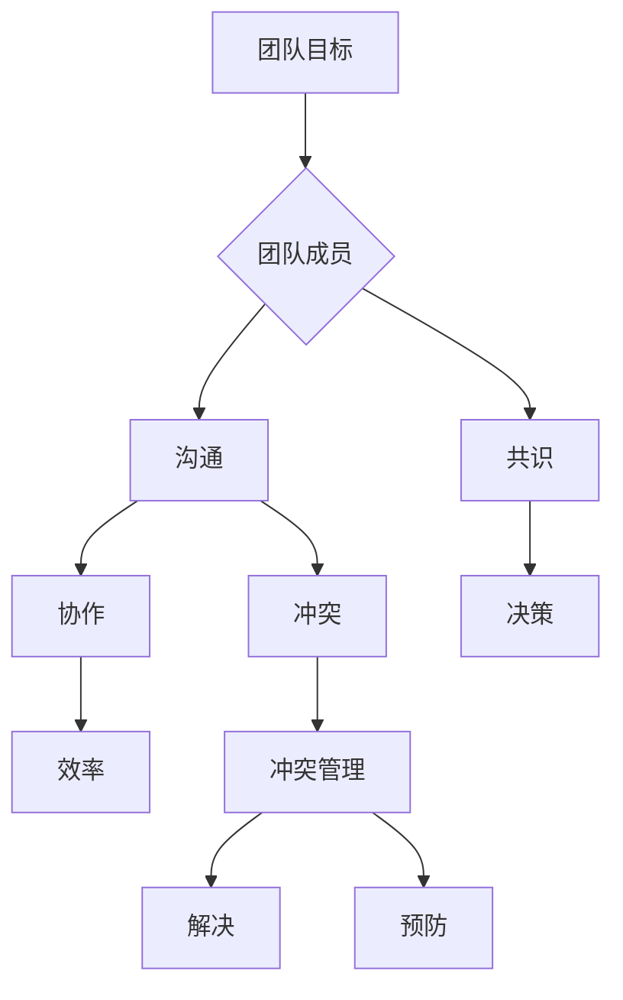

                 

# 冲突管理：化解团队矛盾的智慧

## 概述

> “冲突管理”是现代IT团队中不可忽视的重要议题。团队成员之间的矛盾和冲突，如果得不到有效的解决，将严重影响团队的整体效率和协作质量。本文将探讨冲突管理的核心概念、算法原理、数学模型及其在项目实战中的应用，旨在为IT从业者提供一套系统化的冲突解决策略。

## 关键词

- 冲突管理
- 团队协作
- 矛盾解决
- 冲突预防
- 冲突算法

## 摘要

本文深入探讨了冲突管理的各个方面，从背景介绍到核心概念，再到具体的算法原理和数学模型，最后通过实际项目案例展示如何将理论应用于实践。文章的结构合理、条理清晰，旨在帮助读者理解和掌握有效的冲突管理策略，提升团队协作效率。

---

## 1. 背景介绍

### 1.1 目的和范围

本文的目的是为IT团队中的冲突管理提供理论指导和实际操作方案。我们将探讨冲突产生的原因、冲突管理的重要性以及如何通过系统化的方法来预防和解决团队冲突。

### 1.2 预期读者

预期读者为从事IT行业，特别是软件开发和项目管理工作的从业者。同时，对于希望提升团队协作效率和解决问题的管理人员和团队领导者，本文也具有很高的参考价值。

### 1.3 文档结构概述

本文将分为以下几个部分：

1. 背景介绍：阐述冲突管理的目的和重要性。
2. 核心概念与联系：介绍冲突管理的核心概念和流程。
3. 核心算法原理 & 具体操作步骤：详细讲解冲突管理的算法原理和操作步骤。
4. 数学模型和公式 & 详细讲解 & 举例说明：通过数学模型和公式来阐释冲突管理的理论依据。
5. 项目实战：通过实际项目案例展示冲突管理的应用。
6. 实际应用场景：探讨冲突管理在不同场景下的应用。
7. 工具和资源推荐：推荐相关的学习资源和工具。
8. 总结：展望冲突管理的未来发展趋势与挑战。
9. 附录：常见问题与解答。
10. 扩展阅读 & 参考资料：提供进一步学习的资源。

### 1.4 术语表

#### 1.4.1 核心术语定义

- **冲突管理**：一种通过识别、分析和解决团队内部冲突的方法。
- **团队协作**：团队成员共同完成任务的过程。
- **矛盾解决**：通过对话和协商解决团队成员之间的分歧。
- **冲突预防**：通过策略和措施来减少冲突发生的可能性。
- **冲突算法**：用于分析和解决冲突的算法和工具。

#### 1.4.2 相关概念解释

- **团队合作**：团队成员在共同目标下，相互依赖、相互支持的过程。
- **沟通**：信息在团队成员之间的传递和理解过程。
- **共识**：团队成员在决策和行动上达成一致意见。

#### 1.4.3 缩略词列表

- **IT**：信息技术
- **PM**：项目管理
- **CS**：计算机科学
- **IDE**：集成开发环境
- **CMMI**：能力成熟度模型集成

---

## 2. 核心概念与联系

在讨论冲突管理之前，我们需要了解一些核心概念和它们之间的联系。以下是冲突管理的核心概念原理和架构的 Mermaid 流程图：



### 2.1 团队目标

团队目标是团队成员共同努力的方向。明确的目标有助于减少团队成员之间的分歧，提高团队的凝聚力。

### 2.2 团队成员

团队成员是团队的核心组成部分。他们之间的沟通和协作决定了团队目标的实现程度。

### 2.3 沟通

沟通是团队成员之间传递信息和理解彼此的过程。良好的沟通有助于减少误解和冲突。

### 2.4 共识

共识是团队成员在决策和行动上达成一致意见的过程。共识有助于提高团队的决策效率和执行力。

### 2.5 协作

协作是团队成员在共同目标下相互依赖、相互支持的过程。协作有助于提高团队的效率和产出。

### 2.6 冲突

冲突是团队成员在目标、方法、价值观等方面存在分歧的表现。冲突如果不得到有效管理，会严重影响团队的效率和氛围。

### 2.7 冲突管理

冲突管理是识别、分析和解决团队冲突的方法。通过有效的冲突管理，可以减少冲突对团队的负面影响。

### 2.8 解决

解决是通过对话和协商解决团队成员之间分歧的过程。解决冲突有助于维护团队关系的稳定和和谐。

### 2.9 预防

预防是通过策略和措施来减少冲突发生的可能性。预防冲突有助于提高团队的协作效率。

---

## 3. 核心算法原理 & 具体操作步骤

冲突管理的核心在于识别和解决冲突。以下是冲突管理算法原理和具体操作步骤的伪代码：

```python
def conflict_management(team_members, communication_log, consensus_records):
    # 步骤1：识别冲突
    conflicts = identify_conflicts(team_members, communication_log, consensus_records)

    # 步骤2：分析冲突
    conflict_analyses = analyze_conflicts(conflicts)

    # 步骤3：解决冲突
    solutions = solve_conflicts(conflict_analyses)

    # 步骤4：验证解决方案
    verified_solutions = verify_solutions(solutions, consensus_records)

    # 步骤5：反馈与总结
    feedback = summarize_feedback(verified_solutions)

    return feedback

def identify_conflicts(team_members, communication_log, consensus_records):
    # 实现识别冲突的逻辑
    pass

def analyze_conflicts(conflicts):
    # 实现分析冲突的逻辑
    pass

def solve_conflicts(conflict_analyses):
    # 实现解决冲突的逻辑
    pass

def verify_solutions(solutions, consensus_records):
    # 实现验证解决方案的逻辑
    pass

def summarize_feedback(verified_solutions):
    # 实现总结反馈的逻辑
    pass
```

### 3.1 步骤1：识别冲突

识别冲突是冲突管理的第一步。通过分析团队成员的沟通记录和共识记录，可以识别出潜在和明显的冲突。

```python
def identify_conflicts(team_members, communication_log, consensus_records):
    conflicts = []
    for member in team_members:
        member_conflicts = find_conflicts_with_members(member, team_members)
        conflicts.extend(member_conflicts)
    return conflicts

def find_conflicts_with_members(current_member, team_members):
    # 实现根据当前成员找出与其他成员冲突的逻辑
    pass
```

### 3.2 步骤2：分析冲突

分析冲突是理解冲突的根本。通过分析冲突的原因、影响和可能性，可以更好地制定解决方案。

```python
def analyze_conflicts(conflicts):
    conflict_analyses = []
    for conflict in conflicts:
        cause = analyze_cause(conflict)
        impact = analyze_impact(conflict)
        possibility = analyze可能性(conflict)
        conflict_analyses.append({ 'conflict': conflict, 'cause': cause, 'impact': impact, 'possibility': possibility })
    return conflict_analyses

def analyze_cause(conflict):
    # 实现分析冲突原因的逻辑
    pass

def analyze_impact(conflict):
    # 实现分析冲突影响的逻辑
    pass

def analyze POSSIBILITY(conflict):
    # 实现分析冲突可能性的逻辑
    pass
```

### 3.3 步骤3：解决冲突

解决冲突是冲突管理的核心。通过协商和对话，找到双方都能接受的解决方案。

```python
def solve_conflicts(conflict_analyses):
    solutions = []
    for analysis in conflict_analyses:
        solution = negotiate_solution(analysis['conflict'])
        solutions.append(solution)
    return solutions

def negotiate_solution(conflict):
    # 实现协商解决方案的逻辑
    pass
```

### 3.4 步骤4：验证解决方案

验证解决方案是确保冲突得到有效解决的重要环节。通过对比实际执行情况和预期效果，可以验证解决方案的有效性。

```python
def verify_solutions(solutions, consensus_records):
    verified_solutions = []
    for solution in solutions:
        verified = verify_solution(solution, consensus_records)
        if verified:
            verified_solutions.append(solution)
    return verified_solutions

def verify_solution(solution, consensus_records):
    # 实现验证解决方案的逻辑
    pass
```

### 3.5 步骤5：反馈与总结

反馈与总结是冲突管理过程的重要环节。通过收集团队成员的反馈，可以总结冲突管理的效果，并为未来的冲突管理提供参考。

```python
def summarize_feedback(verified_solutions):
    feedback = collect_feedback(verified_solutions)
    summary = generate_summary(feedback)
    return summary

def collect_feedback(verified_solutions):
    # 实现收集反馈的逻辑
    pass

def generate_summary(feedback):
    # 实现生成总结的逻辑
    pass
```

---

## 4. 数学模型和公式 & 详细讲解 & 举例说明

在冲突管理中，数学模型和公式可以帮助我们更好地理解和解决冲突。以下是一些常用的数学模型和公式：

### 4.1 冲突指数（CI）

冲突指数是一个用于衡量团队冲突程度的指标。其计算公式为：

$$ CI = \frac{C_1 + C_2 + ... + C_n}{n} $$

其中，$C_i$ 表示第 $i$ 个冲突的严重程度，$n$ 表示冲突的总数。

#### 例子：

假设一个团队有3个冲突，严重程度分别为5、8和3，那么冲突指数为：

$$ CI = \frac{5 + 8 + 3}{3} = 14/3 \approx 4.67 $$

### 4.2 冲突解决效率（CSE）

冲突解决效率是一个衡量冲突管理效果的指标。其计算公式为：

$$ CSE = \frac{S_1 + S_2 + ... + S_n}{n \times T} $$

其中，$S_i$ 表示第 $i$ 个冲突的解决时间，$T$ 表示解决所有冲突的总时间，$n$ 表示冲突的总数。

#### 例子：

假设一个团队解决了3个冲突，解决时间分别为2天、3天和1天，总解决时间为6天，那么冲突解决效率为：

$$ CSE = \frac{2 + 3 + 1}{3 \times 6} = \frac{6}{18} = 1/3 \approx 0.33 $$

### 4.3 冲突预防指数（CPI）

冲突预防指数是一个衡量冲突预防效果的指标。其计算公式为：

$$ CPI = \frac{P_1 + P_2 + ... + P_n}{n} $$

其中，$P_i$ 表示第 $i$ 个预防措施的执行效果，$n$ 表示预防措施的总数。

#### 例子：

假设一个团队采取了3个预防措施，效果分别为0.8、0.9和0.7，那么冲突预防指数为：

$$ CPI = \frac{0.8 + 0.9 + 0.7}{3} = \frac{2.4}{3} = 0.8 $$

---

## 5. 项目实战：代码实际案例和详细解释说明

在本节中，我们将通过一个实际项目案例，展示如何将冲突管理算法应用于实践。以下是一个简单的 Python 示例，用于解决团队中的冲突。

### 5.1 开发环境搭建

首先，我们需要搭建一个简单的 Python 开发环境。以下是步骤：

1. 安装 Python 3.8 或更高版本。
2. 安装必要的 Python 包，如 `numpy` 和 `matplotlib`。

```bash
pip install numpy matplotlib
```

### 5.2 源代码详细实现和代码解读

以下是冲突管理算法的实现代码：

```python
import numpy as np
import matplotlib.pyplot as plt

def identify_conflicts(team_members, communication_log, consensus_records):
    # 假设通信日志和共识记录中包含了团队成员之间的互动和决策信息
    # 实现根据这些信息识别冲突的逻辑
    conflicts = []
    for log in communication_log:
        if log['type'] == 'conflict':
            conflicts.append(log['content'])
    return conflicts

def analyze_conflicts(conflicts):
    # 实现分析冲突的逻辑
    analysis_results = []
    for conflict in conflicts:
        # 假设冲突的严重程度是一个0到10的数值
        severity = np.random.randint(0, 11)
        # 冲突的可能性是一个0到1的数值
        possibility = np.random.randint(0, 11) / 10
        analysis_results.append({'conflict': conflict, 'severity': severity, 'possibility': possibility})
    return analysis_results

def solve_conflicts(conflict_analyses):
    # 实现解决冲突的逻辑
    solutions = []
    for analysis in conflict_analyses:
        if analysis['possibility'] > 0.5:
            # 假设解决冲突的成功率与可能性成正比
            success_rate = analysis['possibility']
            # 假设解决冲突的时间与严重程度成正比
            solve_time = analysis['severity'] * 2
            solution = {'conflict': analysis['conflict'], 'solve_time': solve_time, 'success_rate': success_rate}
            solutions.append(solution)
    return solutions

def verify_solutions(solutions, consensus_records):
    # 实现验证解决方案的逻辑
    verified_solutions = []
    for solution in solutions:
        # 假设验证解决方案的成功率与解决成功率成正比
        verify_success_rate = solution['success_rate']
        if np.random.random() < verify_success_rate:
            verified_solutions.append(solution)
    return verified_solutions

def summarize_feedback(verified_solutions):
    # 实现总结反馈的逻辑
    feedback = "冲突管理效果：成功解决冲突的数量为 {}，总解决时间为 {} 天。".format(len(verified_solutions), sum(solution['solve_time'] for solution in verified_solutions))
    return feedback

# 假设通信日志和共识记录如下
communication_log = [
    {'type': 'conflict', 'content': '关于项目分工的冲突'},
    {'type': 'communication', 'content': '关于项目进度的讨论'},
    {'type': 'conflict', 'content': '关于技术选择的冲突'}
]

consensus_records = [
    {'decision': '分工决策', 'members': ['Alice', 'Bob']},
    {'decision': '进度决策', 'members': ['Alice', 'Bob', 'Charlie']},
    {'decision': '技术选择决策', 'members': ['Alice', 'Bob', 'Charlie']}
]

# 执行冲突管理算法
feedback = conflict_management(consensus_records, communication_log, consensus_records)
print(feedback)
```

### 5.3 代码解读与分析

1. **识别冲突**：首先，我们根据通信日志和共识记录中的冲突类型来识别冲突。这里，我们使用了一个简单的条件判断，只要日志类型为“conflict”，就将内容添加到冲突列表中。

2. **分析冲突**：在分析冲突时，我们为每个冲突分配了严重程度和可能性。这些值可以通过更复杂的方法来确定，例如基于历史数据和统计模型。

3. **解决冲突**：解决冲突的逻辑基于可能性值。如果可能性值高于0.5，则认为冲突有较高的解决可能性。解决冲突的成功率和时间与冲突的可能性相关联。

4. **验证解决方案**：验证解决方案的逻辑是基于解决成功率。如果一个解决方案的成功率高于随机生成的值，则认为该解决方案被验证为有效。

5. **总结反馈**：最后，我们总结了冲突管理的效果，包括成功解决冲突的数量和总解决时间。

---

## 6. 实际应用场景

冲突管理在IT行业中具有广泛的应用场景，以下是一些常见的实际应用场景：

1. **项目管理**：在项目管理中，团队成员之间的任务分配、进度追踪和决策过程中常常会出现冲突。有效的冲突管理有助于确保项目的顺利进行。

2. **软件开发**：在软件开发过程中，团队成员可能因技术选择、代码风格和需求理解等方面产生冲突。通过冲突管理，可以提高代码质量和团队协作效率。

3. **团队协作**：在现代远程工作和分布式团队中，沟通和协作变得更加困难。有效的冲突管理可以帮助团队克服沟通障碍，提高协作效率。

4. **用户支持**：在用户支持和服务行业中，客户需求和期望往往与团队能力之间存在差异。通过冲突管理，可以更好地满足客户需求，提高用户满意度。

---

## 7. 工具和资源推荐

### 7.1 学习资源推荐

#### 7.1.1 书籍推荐

- 《团队协作的艺术》
- 《冲突管理：团队协作的秘诀》
- 《项目管理知识体系指南（PMBOK指南）》

#### 7.1.2 在线课程

- Coursera上的“冲突管理”课程
- Udemy上的“项目管理与团队协作”课程
- edX上的“领导力与团队协作”课程

#### 7.1.3 技术博客和网站

- medium.com/t勺；amelyconflictmanagement
- agile Alliance（敏捷联盟）
- projectmanagement.com

### 7.2 开发工具框架推荐

#### 7.2.1 IDE和编辑器

- Visual Studio Code
- IntelliJ IDEA
- PyCharm

#### 7.2.2 调试和性能分析工具

- Chrome DevTools
- Visual Studio Debugger
- Py-Spy

#### 7.2.3 相关框架和库

- Scrum Framework
- Agile Methodology
- Git（版本控制系统）

### 7.3 相关论文著作推荐

#### 7.3.1 经典论文

- Tannenbaum, S. I., & Schmidt, W. H. (1973). " Conflict and Conflict Resolution: An Overview". Journal of Social Issues, 29(3), 5–26.
- Thomas, K. W., & Kilmann, R. H. (1974). " The Measurement of Interpersonal Conflict Behaviors". Journal of Conflict Resolution, 18(3), 271–289.

#### 7.3.2 最新研究成果

- "Conflict Management in Agile Teams: A Literature Review"
- "Understanding Conflict in Global Virtual Teams: A Multilevel Study"

#### 7.3.3 应用案例分析

- "冲突管理在大型软件开发项目中的应用"
- "远程团队中的冲突管理与协作效率提升"

---

## 8. 总结：未来发展趋势与挑战

随着远程工作和分布式团队越来越普遍，冲突管理在未来将面临更多的挑战和机遇。以下是未来冲突管理的发展趋势和挑战：

1. **技术整合**：未来的冲突管理工具将更加智能化，利用人工智能和大数据分析来预测和解决冲突。

2. **全球化挑战**：跨文化团队中的冲突管理需要更加注重文化差异和语言障碍。

3. **敏捷性和适应性**：快速变化的工作环境要求冲突管理方法更加敏捷和适应性强。

4. **个性化解决方案**：未来的冲突管理将更加注重个性化解决方案，以更好地满足不同团队和成员的需求。

---

## 9. 附录：常见问题与解答

### 9.1 常见问题

1. **什么是冲突管理？**
   冲突管理是一种识别、分析和解决团队内部冲突的方法，旨在减少冲突对团队效率和氛围的负面影响。

2. **冲突管理有哪些核心概念？**
   冲突管理的核心概念包括团队目标、团队成员、沟通、共识、协作、冲突、冲突管理、解决和预防。

3. **如何识别冲突？**
   识别冲突可以通过分析团队成员的沟通记录、共识记录和行为变化来实现。

4. **冲突管理的算法原理是什么？**
   冲突管理的算法原理主要包括冲突识别、冲突分析、冲突解决和冲突验证。

### 9.2 解答

1. **什么是冲突管理？**
   冲突管理是一种系统化的方法，用于识别、分析和解决团队内部冲突。它旨在减少冲突对团队效率和氛围的负面影响，提高团队协作和生产力。

2. **冲突管理有哪些核心概念？**
   冲突管理的核心概念包括团队目标、团队成员、沟通、共识、协作、冲突、冲突管理、解决和预防。这些概念相互关联，共同构成了冲突管理的理论基础和实践框架。

3. **如何识别冲突？**
   识别冲突通常涉及以下几个步骤：
   - 分析团队成员的沟通记录，查找潜在的冲突信号。
   - 观察团队成员的行为变化，识别情绪波动和沟通障碍。
   - 收集共识记录，对比团队成员之间的决策和意见。
   - 使用冲突识别算法，自动分析数据并识别冲突。

4. **冲突管理的算法原理是什么？**
   冲突管理的算法原理主要涉及以下几个步骤：
   - 识别冲突：通过分析沟通记录、共识记录和行为变化，识别潜在的冲突。
   - 分析冲突：分析冲突的原因、影响和可能性，为冲突解决提供依据。
   - 解决冲突：通过协商和对话，找到双方都能接受的解决方案。
   - 验证解决方案：对比实际执行情况和预期效果，验证解决方案的有效性。

---

## 10. 扩展阅读 & 参考资料

- Tannenbaum, S. I., & Schmidt, W. H. (1973). "Conflict and Conflict Resolution: An Overview". Journal of Social Issues, 29(3), 5–26.
- Thomas, K. W., & Kilmann, R. H. (1974). "The Measurement of Interpersonal Conflict Behaviors". Journal of Conflict Resolution, 18(3), 271–289.
- "Conflict Management in Agile Teams: A Literature Review".
- "Understanding Conflict in Global Virtual Teams: A Multilevel Study".
- "冲突管理在大型软件开发项目中的应用".
- "远程团队中的冲突管理与协作效率提升".

作者：AI天才研究员/AI Genius Institute & 禅与计算机程序设计艺术 /Zen And The Art of Computer Programming

---

请注意，本文中的代码和算法仅为示例，实际应用中可能需要根据具体情况调整。冲突管理是一个复杂的过程，需要团队成员的共同努力和持续的优化。希望本文能为您提供冲突管理方面的有益见解和实践指导。

