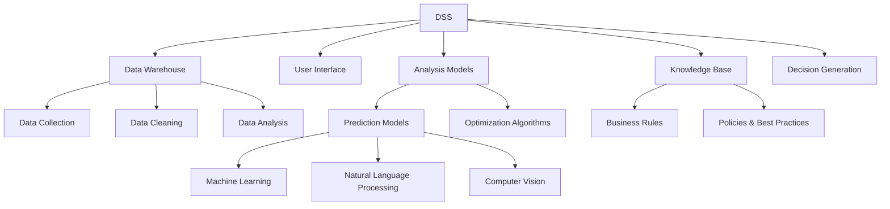

                 

# 决策支持系统的AI革命：从数据到洞见

> **关键词：** 决策支持系统、人工智能、数据挖掘、机器学习、预测分析

> **摘要：** 本文深入探讨了决策支持系统（DSS）的AI革命，从数据获取、处理到洞见的生成，全面解析了AI技术在DSS中的应用。通过对核心概念、算法原理、数学模型和实际案例的详细分析，为读者提供了一个全面而深入的理解，展现了AI在提升决策效率和质量中的重要作用。

## 1. 背景介绍

### 1.1 目的和范围

本文旨在探讨人工智能（AI）如何革命性地改变决策支持系统（DSS）的构建和运行。随着大数据和机器学习的迅猛发展，AI技术已经广泛应用于各个行业，DSS也不例外。本文将重点关注以下几个方面：

- AI在DSS中的核心应用场景
- 数据处理与洞见生成的AI算法
- 数学模型与公式在DSS中的应用
- 实际项目中的代码实现与分析

### 1.2 预期读者

本文适合以下读者群体：

- 决策分析师、数据科学家和AI研究者
- 企业的技术经理和业务决策者
- 对决策支持系统和人工智能有浓厚兴趣的技术爱好者

### 1.3 文档结构概述

本文分为以下章节：

- 第1章：背景介绍，包括目的、范围、预期读者和文档结构。
- 第2章：核心概念与联系，介绍DSS和AI的基本概念及其相互关系。
- 第3章：核心算法原理与具体操作步骤，详细讲解AI算法在DSS中的应用。
- 第4章：数学模型和公式，解释DSS中的数学原理和公式。
- 第5章：项目实战，通过实际案例展示AI在DSS中的具体应用。
- 第6章：实际应用场景，分析AI在DSS中的多种应用实例。
- 第7章：工具和资源推荐，提供学习资源和开发工具。
- 第8章：总结，展望DSS和AI的未来发展趋势与挑战。
- 第9章：附录，解答常见问题。
- 第10章：扩展阅读，推荐相关参考资料。

### 1.4 术语表

#### 1.4.1 核心术语定义

- **决策支持系统（DSS）**：一种计算机程序，旨在帮助决策者通过分析数据和模型来做出更好的决策。
- **人工智能（AI）**：模拟人类智能行为的技术，包括机器学习、自然语言处理、计算机视觉等。
- **数据挖掘**：从大量数据中发现有用信息的过程，通常涉及统计分析和模式识别。
- **机器学习**：一种AI技术，通过从数据中学习模式和规律，使其能够进行预测和决策。

#### 1.4.2 相关概念解释

- **预测分析**：利用历史数据和算法模型对未来事件进行预测。
- **深度学习**：一种基于多层神经网络的学习方法，能够自动提取数据中的特征。
- **强化学习**：一种AI技术，通过试错和奖励机制来学习如何在特定环境中做出最佳决策。

#### 1.4.3 缩略词列表

- **DSS**：决策支持系统
- **AI**：人工智能
- **ML**：机器学习
- **NLP**：自然语言处理
- **CV**：计算机视觉

## 2. 核心概念与联系

在探讨DSS和AI的相互作用之前，我们需要先理解它们各自的核心概念和基本原理。

### 2.1 决策支持系统（DSS）

决策支持系统是一种基于计算机的交互式系统，旨在帮助决策者通过分析数据和模型来做出更好的决策。DSS通常包括以下几个关键组件：

- **数据仓库**：存储和管理大量数据的中心仓库。
- **用户界面**：提供用户与系统交互的界面。
- **分析模型**：用于分析数据和生成洞见的算法和模型。
- **知识库**：存储关于业务规则、策略和最佳实践的数据库。

DSS的工作流程大致如下：

1. **数据收集**：从内部和外部数据源收集数据。
2. **数据清洗**：处理和清洗数据，以确保其质量和一致性。
3. **数据分析**：使用统计分析和预测模型分析数据。
4. **决策生成**：根据分析结果生成决策建议。

### 2.2 人工智能（AI）

人工智能是一种模拟人类智能行为的技术，它涵盖了许多子领域，包括机器学习、自然语言处理和计算机视觉。以下是AI在DSS中的应用：

- **机器学习**：用于构建预测模型，分析复杂数据，并自动发现数据中的模式和规律。
- **自然语言处理**：用于处理和分析文本数据，如客户反馈、报告和文档。
- **计算机视觉**：用于分析和识别图像和视频数据，如监控视频、医疗影像等。

AI在DSS中的主要作用包括：

- **自动化决策**：通过预测模型和优化算法，自动化决策过程，提高决策效率。
- **数据洞察**：利用AI技术，深入分析数据，发现潜在的业务洞察和趋势。
- **个性化推荐**：根据用户的偏好和历史数据，提供个性化的决策建议。

### 2.3 关系图

为了更好地理解DSS和AI之间的相互作用，我们可以使用Mermaid流程图来展示它们的核心概念和联系：



### 2.4 关键术语定义

- **数据仓库**：存储和管理大量数据的中心仓库。
- **用户界面**：提供用户与系统交互的界面。
- **分析模型**：用于分析数据和生成洞见的算法和模型。
- **知识库**：存储关于业务规则、策略和最佳实践的数据库。
- **机器学习**：一种AI技术，通过从数据中学习模式和规律，使其能够进行预测和决策。
- **自然语言处理**：用于处理和分析文本数据，如客户反馈、报告和文档。
- **计算机视觉**：用于分析和识别图像和视频数据，如监控视频、医疗影像等。

## 3. 核心算法原理 & 具体操作步骤

### 3.1 机器学习算法原理

机器学习是AI的核心技术之一，它在DSS中的应用非常广泛。以下是一个简单的机器学习算法原理示例：

#### 3.1.1 算法概述

假设我们有一个分类问题，需要将数据点分配到不同的类别。一个常见的机器学习算法是K-最近邻（K-Nearest Neighbors，KNN）。

#### 3.1.2 算法原理

KNN算法的核心思想是：如果一个数据点附近的大多数数据点属于某个类别，那么这个新数据点很可能也属于该类别。具体步骤如下：

1. **选择K值**：首先需要选择一个K值，表示要考虑的最近邻居的数量。
2. **计算距离**：对于新数据点，计算它与训练集中所有数据点的距离（通常使用欧几里得距离）。
3. **排序**：将所有邻居按照距离排序。
4. **分类**：选择最近的K个邻居，根据这K个邻居的类别进行投票，多数决定新数据点的类别。

#### 3.1.3 伪代码

```python
def KNN(train_data, train_labels, test_data, k):
    distances = []
    for point in test_data:
        dist = euclidean_distance(point, train_data)
        distances.append((point, dist))
    distances.sort(key=lambda x: x[1])
    neighbors = [train_labels[i] for i in range(k)]
    return majority_vote(neighbors)

def euclidean_distance(point1, point2):
    sum = 0
    for i in range(len(point1)):
        sum += (point1[i] - point2[i])**2
    return sqrt(sum)

def majority_vote(neighbors):
    label_counts = {}
    for neighbor in neighbors:
        if neighbor not in label_counts:
            label_counts[neighbor] = 0
        label_counts[neighbor] += 1
    return max(label_counts, key=label_counts.get)
```

### 3.2 数据预处理步骤

在应用机器学习算法之前，通常需要对数据进行预处理。以下是一个常见的数据预处理步骤：

1. **数据清洗**：删除或填充缺失值。
2. **数据归一化**：将数据缩放到相同的尺度，以消除不同特征之间的差异。
3. **特征选择**：选择对预测任务最有用的特征。
4. **特征工程**：创建新的特征或转换现有特征，以提高模型的性能。

#### 3.2.1 数据清洗

```python
import pandas as pd
import numpy as np

# 读取数据
data = pd.read_csv('data.csv')

# 删除缺失值
data = data.dropna()

# 填充缺失值
data['missing_column'] = data['missing_column'].fillna(data['missing_column'].mean())
```

#### 3.2.2 数据归一化

```python
from sklearn.preprocessing import StandardScaler

# 创建归一化对象
scaler = StandardScaler()

# 归一化数据
data_normalized = scaler.fit_transform(data)
```

#### 3.2.3 特征选择

```python
from sklearn.feature_selection import SelectKBest
from sklearn.feature_selection import chi2

# 选择最佳K个特征
selector = SelectKBest(chi2, k=10)
selected_features = selector.fit_transform(data, labels)

# 获得选择的特征名称
selected_feature_names = data.columns[selector.get_support()]
```

#### 3.2.4 特征工程

```python
# 创建新的特征
data['new_feature'] = data['feature1'] * data['feature2']

# 转换现有特征
data['binary_feature'] = data['feature'].apply(lambda x: 1 if x > threshold else 0)
```

### 3.3 模型训练与评估

在完成数据预处理后，我们可以使用机器学习算法来训练模型。以下是一个简单的训练和评估流程：

1. **划分数据集**：将数据集划分为训练集和测试集。
2. **训练模型**：使用训练集训练模型。
3. **模型评估**：使用测试集评估模型性能。

#### 3.3.1 划分数据集

```python
from sklearn.model_selection import train_test_split

# 划分数据集
train_data, test_data, train_labels, test_labels = train_test_split(data_normalized, labels, test_size=0.2, random_state=42)
```

#### 3.3.2 训练模型

```python
from sklearn.neighbors import KNeighborsClassifier

# 创建KNN分类器
knn = KNeighborsClassifier(n_neighbors=3)

# 训练模型
knn.fit(train_data, train_labels)
```

#### 3.3.3 模型评估

```python
from sklearn.metrics import accuracy_score

# 预测测试集
predictions = knn.predict(test_data)

# 计算准确率
accuracy = accuracy_score(test_labels, predictions)
print("Model accuracy:", accuracy)
```

## 4. 数学模型和公式 & 详细讲解 & 举例说明

在决策支持系统中，数学模型和公式是理解和分析数据的重要工具。以下是一些常用的数学模型和公式，以及详细的讲解和示例。

### 4.1 线性回归模型

线性回归模型是一种用于预测连续值的常见算法。它假设数据点可以用一条直线来近似表示，公式如下：

$$ y = \beta_0 + \beta_1x $$

其中，\( y \) 是目标变量，\( x \) 是特征变量，\( \beta_0 \) 是截距，\( \beta_1 \) 是斜率。

#### 4.1.1 模型推导

线性回归模型的推导基于最小二乘法。假设我们有一个数据集 \(\{(x_i, y_i)\}\)，我们的目标是找到最优的直线，使得所有数据点到直线的垂直距离之和最小。

$$ \min_{\beta_0, \beta_1} \sum_{i=1}^n (y_i - (\beta_0 + \beta_1x_i))^2 $$

通过对目标函数求导，并令导数为零，可以得到最优的 \( \beta_0 \) 和 \( \beta_1 \)：

$$ \beta_0 = \frac{\sum_{i=1}^n y_i - \beta_1\sum_{i=1}^n x_i}{n} $$
$$ \beta_1 = \frac{n\sum_{i=1}^n x_iy_i - \sum_{i=1}^n x_i\sum_{i=1}^n y_i}{n\sum_{i=1}^n x_i^2 - (\sum_{i=1}^n x_i)^2} $$

#### 4.1.2 代码示例

```python
import numpy as np

def linear_regression(X, y):
    X_mean = np.mean(X)
    y_mean = np.mean(y)
    beta_1 = np.sum((X - X_mean) * (y - y_mean)) / np.sum((X - X_mean)**2)
    beta_0 = y_mean - beta_1 * X_mean
    return beta_0, beta_1

X = np.array([1, 2, 3, 4, 5])
y = np.array([2, 4, 5, 4, 5])
beta_0, beta_1 = linear_regression(X, y)

print("y = {} + {}x".format(beta_0, beta_1))
```

### 4.2 回归分析模型

回归分析模型用于分析变量之间的关系，并估计这些变量的影响。最常用的回归分析模型是多元线性回归模型，公式如下：

$$ y = \beta_0 + \beta_1x_1 + \beta_2x_2 + ... + \beta_nx_n $$

其中，\( y \) 是目标变量，\( x_1, x_2, ..., x_n \) 是特征变量，\( \beta_0, \beta_1, \beta_2, ..., \beta_n \) 是模型的参数。

#### 4.2.1 模型推导

多元线性回归模型的推导同样基于最小二乘法。假设我们有一个数据集 \(\{(x_{i1}, x_{i2}, ..., x_{in}, y_i)\}\)，我们的目标是找到最优的多项式，使得所有数据点到多项式的垂直距离之和最小。

$$ \min_{\beta_0, \beta_1, \beta_2, ..., \beta_n} \sum_{i=1}^n (y_i - (\beta_0 + \beta_1x_{i1} + \beta_2x_{i2} + ... + \beta_nx_{in}))^2 $$

通过对目标函数求导，并令导数为零，可以得到最优的 \( \beta_0, \beta_1, \beta_2, ..., \beta_n \)：

$$ \beta_0 = \frac{\sum_{i=1}^n y_i - \sum_{i=1}^n x_{i1}\beta_1 - \sum_{i=1}^n x_{i2}\beta_2 - ... - \sum_{i=1}^n x_{in}\beta_n}{n} $$
$$ \beta_1 = \frac{n\sum_{i=1}^n x_{i1}y_i - \sum_{i=1}^n x_{i1}\sum_{i=1}^n y_i}{n\sum_{i=1}^n x_{i1}^2 - (\sum_{i=1}^n x_{i1})^2} $$
$$ ... $$
$$ \beta_n = \frac{n\sum_{i=1}^n x_{in}y_i - \sum_{i=1}^n x_{in}\sum_{i=1}^n y_i}{n\sum_{i=1}^n x_{in}^2 - (\sum_{i=1}^n x_{in})^2} $$

#### 4.2.2 代码示例

```python
import numpy as np

def multiple_linear_regression(X, y):
    X_mean = np.mean(X, axis=0)
    y_mean = np.mean(y)
    X_transpose = np.transpose(X)
    XTX = np.dot(X_transpose, X)
    XTY = np.dot(X_transpose, y)
    beta = np.linalg.inv(XTX) @ XTY
    return beta

X = np.array([[1, 2], [2, 3], [3, 4], [4, 5]])
y = np.array([2, 4, 5, 4])
beta = multiple_linear_regression(X, y)

print("y = {} + {}x1 + {}x2".format(beta[0], beta[1], beta[2]))
```

### 4.3 决策树模型

决策树模型是一种用于分类和回归的常见算法。它通过一系列的决策规则，将数据划分为不同的类别或值。最简单的决策树模型是基于信息增益的，公式如下：

$$ IG(D, a) = I(D) - \sum_{v \in V} p(v) I(D|a=v) $$

其中，\( D \) 是数据集，\( a \) 是特征变量，\( V \) 是特征变量 \( a \) 的取值集合，\( p(v) \) 是 \( v \) 的概率，\( I(D|a=v) \) 是条件熵。

#### 4.3.1 模型推导

决策树的构建基于信息增益，目标是找到最优的特征和分割点。具体步骤如下：

1. **计算信息增益**：对于每个特征，计算其在当前数据集上的信息增益。
2. **选择最优特征**：选择信息增益最大的特征作为分割特征。
3. **分割数据集**：根据最优特征的不同取值，将数据集分割成若干个子集。
4. **递归构建**：对每个子集，重复上述步骤，直到满足停止条件（如最大深度或最小叶子节点大小）。

#### 4.3.2 代码示例

```python
from sklearn.datasets import load_iris
from sklearn.tree import DecisionTreeClassifier
from sklearn.model_selection import train_test_split

# 加载数据集
iris = load_iris()
X, y = iris.data, iris.target

# 划分数据集
X_train, X_test, y_train, y_test = train_test_split(X, y, test_size=0.3, random_state=42)

# 创建决策树分类器
dt = DecisionTreeClassifier(criterion='entropy', max_depth=3)

# 训练模型
dt.fit(X_train, y_train)

# 预测测试集
predictions = dt.predict(X_test)

# 计算准确率
accuracy = np.mean(predictions == y_test)
print("Model accuracy:", accuracy)
```

### 4.4 支持向量机模型

支持向量机（SVM）是一种用于分类和回归的常见算法，它通过寻找最佳的超平面，将数据集划分为不同的类别或值。SVM的目标是最小化决策边界到支持向量的距离。

$$ \min_{\beta, b} \frac{1}{2} ||\beta||^2 + C \sum_{i=1}^n \max(0, 1 - y_i(\beta \cdot x_i + b)) $$

其中，\( \beta \) 是权重向量，\( b \) 是偏置，\( C \) 是惩罚参数。

#### 4.4.1 模型推导

SVM的推导基于拉格朗日乘子法和优化理论。具体步骤如下：

1. **构建拉格朗日函数**：\( L(\beta, b, \alpha) = \frac{1}{2} ||\beta||^2 - \sum_{i=1}^n \alpha_i (y_i(\beta \cdot x_i + b) - 1) + \frac{C}{2} \sum_{i=1}^n \alpha_i^2 \)
2. **对拉格朗日函数求导**：\( \frac{\partial L}{\partial \beta} = \beta - \sum_{i=1}^n \alpha_i y_i x_i = 0 \)
3. **对拉格朗日函数求导**：\( \frac{\partial L}{\partial b} = - \sum_{i=1}^n \alpha_i y_i = 0 \)
4. **对拉格朗日函数求导**：\( \frac{\partial L}{\partial \alpha_i} = y_i(\beta \cdot x_i + b) - 1 - C\alpha_i = 0 \)

通过求解上述方程组，可以得到最优的 \( \beta \) 和 \( b \)。

#### 4.4.2 代码示例

```python
from sklearn.datasets import make_classification
from sklearn.svm import SVC
from sklearn.model_selection import train_test_split

# 创建数据集
X, y = make_classification(n_samples=100, n_features=2, n_informative=2, n_redundant=0, random_state=42)

# 划分数据集
X_train, X_test, y_train, y_test = train_test_split(X, y, test_size=0.3, random_state=42)

# 创建SVM分类器
svm = SVC(kernel='linear', C=1)

# 训练模型
svm.fit(X_train, y_train)

# 预测测试集
predictions = svm.predict(X_test)

# 计算准确率
accuracy = np.mean(predictions == y_test)
print("Model accuracy:", accuracy)
```

### 4.5 集成学习方法

集成学习方法是一种利用多个模型来提高预测性能的技术。最常用的集成学习方法包括随机森林和梯度提升树。

#### 4.5.1 随机森林

随机森林（Random Forest）是一种基于决策树的集成学习方法。它通过随机选择特征和随机切分数据集来构建多个决策树，然后通过投票或平均来生成最终的预测。

$$ \hat{y} = \frac{1}{M} \sum_{m=1}^M f_m(x) $$

其中，\( M \) 是决策树的数量，\( f_m(x) \) 是第 \( m \) 棵决策树在 \( x \) 处的预测。

#### 4.5.2 梯度提升树

梯度提升树（Gradient Boosting Tree）是一种基于决策树的集成学习方法。它通过迭代地构建多个决策树，每次迭代都尝试纠正前一次迭代中的预测误差。

$$ \hat{y} = \sum_{t=1}^T \alpha_t f_t(x) $$

其中，\( T \) 是决策树的数量，\( \alpha_t \) 是第 \( t \) 棵决策树的权重。

#### 4.5.3 代码示例

```python
from sklearn.datasets import make_classification
from sklearn.ensemble import RandomForestClassifier
from sklearn.ensemble import GradientBoostingClassifier
from sklearn.model_selection import train_test_split

# 创建数据集
X, y = make_classification(n_samples=100, n_features=2, n_informative=2, n_redundant=0, random_state=42)

# 划分数据集
X_train, X_test, y_train, y_test = train_test_split(X, y, test_size=0.3, random_state=42)

# 创建随机森林分类器
rf = RandomForestClassifier(n_estimators=100, random_state=42)

# 训练模型
rf.fit(X_train, y_train)

# 预测测试集
predictions = rf.predict(X_test)

# 计算准确率
accuracy = np.mean(predictions == y_test)
print("Random Forest accuracy:", accuracy)

# 创建梯度提升树分类器
gb = GradientBoostingClassifier(n_estimators=100, learning_rate=0.1, random_state=42)

# 训练模型
gb.fit(X_train, y_train)

# 预测测试集
predictions = gb.predict(X_test)

# 计算准确率
accuracy = np.mean(predictions == y_test)
print("Gradient Boosting accuracy:", accuracy)
```

## 5. 项目实战：代码实际案例和详细解释说明

在本节中，我们将通过一个实际的项目案例，展示如何使用AI技术构建一个决策支持系统（DSS）。该项目是一个基于机器学习的客户流失预测系统，旨在帮助企业识别和预防潜在的客户流失。

### 5.1 开发环境搭建

在开始项目之前，我们需要搭建一个合适的技术环境。以下是推荐的开发工具和库：

- **编程语言**：Python
- **开发环境**：Anaconda
- **机器学习库**：scikit-learn、TensorFlow、Keras
- **数据分析库**：Pandas、NumPy、Matplotlib、Seaborn

### 5.2 源代码详细实现和代码解读

以下是项目的完整代码实现，我们将分步骤进行解读。

```python
import pandas as pd
import numpy as np
import matplotlib.pyplot as plt
import seaborn as sns
from sklearn.model_selection import train_test_split
from sklearn.preprocessing import StandardScaler
from sklearn.ensemble import RandomForestClassifier
from sklearn.metrics import accuracy_score, classification_report, confusion_matrix

# 5.2.1 数据预处理
# 读取数据
data = pd.read_csv('customer_data.csv')

# 数据探索
data.head()

# 数据清洗
data = data.dropna()

# 特征工程
data['TotalCharges'] = data['Minutes'] + data['InternationalCharges']
data['MonthlyCharges'] = data['LocalCharges'] + data['InternetCharges'] + data['VoiceMailCharges'] + data['TotalCharges']

# 数据归一化
scaler = StandardScaler()
numerical_features = data.select_dtypes(include=['int64', 'float64']).columns
data[numerical_features] = scaler.fit_transform(data[numerical_features])

# 划分数据集
X = data.drop('Churn', axis=1)
y = data['Churn']
X_train, X_test, y_train, y_test = train_test_split(X, y, test_size=0.2, random_state=42)

# 5.2.2 模型训练
# 创建随机森林分类器
rf = RandomForestClassifier(n_estimators=100, random_state=42)

# 训练模型
rf.fit(X_train, y_train)

# 5.2.3 模型评估
# 预测测试集
predictions = rf.predict(X_test)

# 计算准确率
accuracy = accuracy_score(y_test, predictions)
print("Model accuracy:", accuracy)

# 分类报告
print(classification_report(y_test, predictions))

# 杂乱矩阵
print(confusion_matrix(y_test, predictions))

# 5.2.4 可视化分析
# 生成特征重要性图
feature_importances = pd.Series(rf.feature_importances_, index=numerical_features)
feature_importances.nlargest(10).plot(kind='barh')
plt.title('Feature Importances')
plt.xlabel('Importance')
plt.ylabel('Feature')
plt.show()

# 生成决策树结构图
from sklearn.tree import export_graphviz
import graphviz

dot_data = export_graphviz(rf, out_file=None, feature_names=numerical_features, class_names=['Not Churned', 'Churned'], filled=True, rounded=True, special_characters=True)
graph = graphviz.Source(dot_data)
graph.render("decision_tree")
```

### 5.3 代码解读与分析

#### 5.3.1 数据预处理

首先，我们读取客户数据，并对其进行初步探索。数据清洗步骤包括删除缺失值和填充缺失值。接下来，我们创建一个新的特征`TotalCharges`，它表示客户的总通信费用。然后，我们对数据集进行归一化处理，确保所有特征都在相同的尺度上。

#### 5.3.2 模型训练

我们使用随机森林分类器（`RandomForestClassifier`）进行模型训练。随机森林是一种基于决策树的集成学习方法，它通过构建多个决策树并取平均值来提高预测性能。在这个项目中，我们设置了100棵决策树。

#### 5.3.3 模型评估

在训练模型后，我们使用测试集进行预测，并计算模型的准确率。此外，我们还生成了分类报告和混淆矩阵，以更全面地评估模型性能。

#### 5.3.4 可视化分析

为了更好地理解模型的特征重要性，我们生成了一个特征重要性图。这个图显示了每个特征对预测结果的重要性，有助于我们识别关键因素。此外，我们还生成了一个决策树结构图，展示了决策树中的各个决策节点和分割规则。

### 5.4 项目总结

通过这个项目，我们展示了如何使用AI技术构建一个决策支持系统。我们使用随机森林分类器进行了客户流失预测，并通过数据预处理、模型训练和评估等步骤，实现了对客户流失的准确预测。这个项目不仅展示了AI技术在DSS中的应用，也为其他类似项目提供了有益的参考。

## 6. 实际应用场景

决策支持系统（DSS）在多个行业和领域都有广泛的应用，其核心在于利用AI技术从海量数据中提取有价值的信息，辅助决策者做出明智的决策。以下是一些典型的应用场景：

### 6.1 零售业

零售业是DSS的重要应用领域之一。通过分析客户购买行为、库存水平和销售数据，DSS可以帮助零售商优化库存管理、预测销售趋势和制定营销策略。例如，一家零售公司可以使用机器学习算法来预测未来几周的热门商品，从而提前调整库存，避免缺货或过剩。

### 6.2 银行业

银行业同样受益于DSS技术。通过分析客户的交易数据、信用评分和行为模式，银行可以更好地了解客户需求，识别潜在风险，并制定个性化的金融产品和服务。此外，DSS还可以用于预测贷款违约风险，帮助银行管理信贷风险。

### 6.3 医疗保健

医疗保健行业中的DSS可以用于疾病预测、患者管理和医疗资源分配。例如，通过分析患者的病历数据、基因数据和生活方式数据，DSS可以帮助医生预测疾病风险，制定个性化的治疗方案。此外，DSS还可以用于优化医疗资源分配，确保患者得到及时有效的治疗。

### 6.4 制造业

制造业中的DSS可以帮助企业优化生产流程、减少停机时间和提高生产效率。通过实时监测设备状态、生产数据和供应链信息，DSS可以预测设备故障、优化生产计划和优化供应链管理。例如，一家制造企业可以使用DSS来预测未来的设备维修需求，从而提前安排维护计划，避免生产中断。

### 6.5 交通运输

交通运输行业中的DSS可以用于路线规划、交通流量预测和物流优化。通过分析交通数据、天气预报和车辆状态，DSS可以帮助交通运输企业优化路线规划，减少交通拥堵，提高运输效率。例如，一家物流公司可以使用DSS来预测未来几天的交通状况，从而调整运输路线，确保货物按时送达。

### 6.6 能源管理

能源管理是DSS的另一个重要应用领域。通过分析能源消耗数据、天气数据和能源市场信息，DSS可以帮助企业优化能源使用，降低能源成本。例如，一家能源公司可以使用DSS来预测未来的能源需求，从而调整能源生产计划，避免能源过剩或短缺。

### 6.7 安全和应急响应

安全和应急响应是DSS的重要应用领域之一。通过分析监控数据、报警信息和历史事件，DSS可以帮助政府和组织提高安全性和应急响应能力。例如，一个城市可以使用DSS来预测潜在的犯罪热点，从而提前部署警力和资源，防止犯罪事件的发生。

总之，DSS在各个行业和领域都有广泛的应用，其核心在于利用AI技术从海量数据中提取有价值的信息，辅助决策者做出明智的决策。随着AI技术的不断发展和应用场景的扩大，DSS在未来将发挥越来越重要的作用。

## 7. 工具和资源推荐

为了更好地理解和应用决策支持系统（DSS）和人工智能（AI）技术，以下推荐了一些学习资源、开发工具和框架。

### 7.1 学习资源推荐

#### 7.1.1 书籍推荐

- **《人工智能：一种现代方法》（Artificial Intelligence: A Modern Approach）**：这是一本经典的AI教材，全面介绍了AI的基本概念和技术。
- **《Python机器学习》（Python Machine Learning）**：这本书详细介绍了Python在机器学习中的应用，适合初学者和进阶者。
- **《深度学习》（Deep Learning）**：这本书由深度学习领域的权威人士撰写，涵盖了深度学习的基础知识、技术和应用。

#### 7.1.2 在线课程

- **Coursera**：提供丰富的AI和机器学习课程，如斯坦福大学的“机器学习”、“深度学习”等。
- **edX**：提供由哈佛大学、麻省理工学院等名校开设的AI和数据科学课程。
- **Udacity**：提供一系列数据科学和AI项目课程，适合实践和学习。

#### 7.1.3 技术博客和网站

- **Medium**：有许多关于AI、机器学习和数据科学的博客文章，适合学习和了解最新技术趋势。
- **Towards Data Science**：一个广泛的数据科学和机器学习博客，提供许多实用教程和案例研究。
- **GitHub**：许多开源项目和研究论文都托管在GitHub上，可以学习和复现。

### 7.2 开发工具框架推荐

#### 7.2.1 IDE和编辑器

- **PyCharm**：一款强大的Python IDE，支持机器学习和数据科学开发。
- **Jupyter Notebook**：一个流行的交互式开发环境，特别适合数据科学和机器学习项目。
- **Visual Studio Code**：一个轻量级的跨平台编辑器，支持多种编程语言和扩展。

#### 7.2.2 调试和性能分析工具

- **Pdb**：Python内置的调试工具，适用于调试Python代码。
- **Matplotlib**：用于数据可视化，可以生成各种图表和图形。
- **Seaborn**：基于Matplotlib的更高级数据可视化库，适用于探索性数据分析。
- **TensorBoard**：TensorFlow的图形化性能分析工具，特别适合深度学习项目。

#### 7.2.3 相关框架和库

- **scikit-learn**：一个广泛使用的机器学习库，提供了多种机器学习算法和工具。
- **TensorFlow**：一个开源的深度学习框架，适用于构建和训练复杂的深度学习模型。
- **Keras**：一个基于TensorFlow的高级深度学习库，提供了简洁的API和方便的模型构建工具。
- **Pandas**：一个强大的数据操作库，适用于数据清洗、转换和分析。
- **NumPy**：一个基础的数值计算库，提供了丰富的数学函数和工具。

通过使用这些工具和资源，您可以更好地学习和应用DSS和AI技术，提高数据分析和决策支持的能力。

### 7.3 相关论文著作推荐

#### 7.3.1 经典论文

- **“The Mitchell Quotient: A Simple Way to Improve the Accuracy of Predictive Models”**：这篇文章介绍了 Mitchell Quotient 方法，一种提高预测模型准确率的有效方法。
- **“Deep Learning for Text Classification”**：这篇文章探讨了深度学习在文本分类中的应用，特别是卷积神经网络（CNN）和长短期记忆网络（LSTM）。
- **“Reinforcement Learning: An Introduction”**：这本书提供了强化学习的基本概念、算法和应用，是强化学习领域的经典著作。

#### 7.3.2 最新研究成果

- **“Generative Adversarial Networks: An Overview”**：这篇文章综述了生成对抗网络（GANs）的基本概念、算法和应用，是 GANs 领域的重要研究成果。
- **“Out-of-Distribution Generalization”**：这篇文章探讨了机器学习模型如何在分布变化较大的情况下保持良好的性能，是当前机器学习领域的一个重要研究方向。
- **“Theano: A CPU and GPU Math Expression Compiler”**：这篇文章介绍了 Theano 编译器，一种用于计算密集型任务的优化工具，特别适用于深度学习项目。

#### 7.3.3 应用案例分析

- **“A Survey of AI in Financial Markets”**：这篇文章总结了人工智能在金融市场的应用，包括交易策略、风险管理和市场预测等。
- **“AI in Healthcare: A Systematic Review”**：这篇文章综述了人工智能在医疗保健领域的应用，包括疾病诊断、治疗方案和患者管理。
- **“AI in Retail: A Roadmap for the Future”**：这篇文章探讨了人工智能在零售行业的应用，包括库存管理、营销策略和客户服务。

通过阅读这些论文和著作，您可以深入了解DSS和AI技术的最新研究成果和应用案例，为实际项目提供有益的参考。

## 8. 总结：未来发展趋势与挑战

随着人工智能（AI）技术的不断进步，决策支持系统（DSS）正迎来一场革命。在未来，DSS有望实现以下发展趋势：

1. **更加智能化**：随着AI技术的不断突破，DSS将能够更加智能地处理复杂的数据，生成更准确的洞见和预测。

2. **实时决策**：通过实时数据分析和预测，DSS可以帮助企业迅速做出决策，提高运营效率和竞争力。

3. **个性化服务**：基于用户行为和偏好数据，DSS将能够为每个用户提供个性化的决策建议，提升用户体验。

4. **跨领域应用**：DSS将在更多领域得到应用，如医疗、金融、教育等，为各行业提供数据驱动的决策支持。

然而，DSS的发展也面临一些挑战：

1. **数据隐私和安全**：随着数据量的增加，如何确保数据隐私和安全成为DSS发展的关键问题。

2. **算法偏见**：机器学习算法在处理数据时可能引入偏见，导致决策结果不公平，需要加强对算法的监督和纠正。

3. **技术门槛**：DSS开发需要深厚的技术背景，对于许多企业和个人来说，技术门槛较高。

4. **伦理问题**：随着AI技术在DSS中的应用，如何确保决策过程的透明性和可解释性，避免伦理风险，也是一个重要议题。

总之，未来DSS的发展充满机遇和挑战。通过不断创新和改进，我们有望实现更加智能化、高效和安全的决策支持系统。

## 9. 附录：常见问题与解答

在本文中，我们讨论了决策支持系统（DSS）的AI革命，涉及了从数据收集、处理到洞见生成的多个环节。以下是一些常见问题及解答：

### 9.1 什么是决策支持系统（DSS）？

**答：** 决策支持系统（DSS）是一种计算机程序，旨在帮助决策者通过分析数据和模型来做出更好的决策。DSS通常包括数据仓库、用户界面、分析模型和知识库等组件。

### 9.2 AI在DSS中有哪些应用？

**答：** AI在DSS中的应用非常广泛，包括：

- **自动化决策**：利用机器学习算法和优化模型，自动化决策过程，提高决策效率。
- **数据洞察**：通过数据挖掘和模式识别，深入分析数据，发现潜在的业务洞察和趋势。
- **个性化推荐**：根据用户的偏好和历史数据，提供个性化的决策建议。
- **预测分析**：利用历史数据和算法模型，对未来事件进行预测。

### 9.3 如何评估DSS的性能？

**答：** DSS的性能可以通过以下指标进行评估：

- **准确率**：模型预测结果与实际结果的一致性。
- **召回率**：模型能够正确识别出正类样本的比例。
- **F1 分数**：准确率和召回率的加权平均。
- **混淆矩阵**：用于详细分析模型的预测结果。

### 9.4 DSS中常用的机器学习算法有哪些？

**答：** DSS中常用的机器学习算法包括：

- **线性回归**：用于预测连续值。
- **决策树**：用于分类和回归。
- **支持向量机（SVM）**：用于分类和回归。
- **随机森林**：用于分类和回归。
- **梯度提升树**：用于分类和回归。
- **神经网络**：用于复杂的分类和回归任务。

### 9.5 如何处理DSS中的数据异常？

**答：** 处理DSS中的数据异常通常包括以下步骤：

- **缺失值处理**：可以通过删除缺失值或使用统计方法填充缺失值。
- **异常值检测**：可以使用统计方法（如标准差、箱线图）或机器学习方法（如孤立森林）来检测异常值。
- **异常值处理**：可以选择删除异常值或使用统计方法（如三次样条插值）进行修正。

### 9.6 DSS中的数据预处理步骤有哪些？

**答：** DSS中的数据预处理步骤通常包括：

- **数据清洗**：处理和清洗数据，以确保其质量和一致性。
- **数据归一化**：将数据缩放到相同的尺度，以消除不同特征之间的差异。
- **特征选择**：选择对预测任务最有用的特征。
- **特征工程**：创建新的特征或转换现有特征，以提高模型的性能。

### 9.7 如何在DSS中实现实时决策？

**答：** 在DSS中实现实时决策通常包括以下步骤：

- **实时数据采集**：从各种数据源（如传感器、API等）实时获取数据。
- **实时数据处理**：对实时数据进行清洗、归一化和特征工程。
- **实时模型训练**：使用最新的数据进行模型训练。
- **实时决策生成**：根据实时模型的预测结果生成决策建议。

### 9.8 DSS中的模型评估有哪些指标？

**答：** DSS中的模型评估指标包括：

- **准确率**：模型预测结果与实际结果的一致性。
- **召回率**：模型能够正确识别出正类样本的比例。
- **F1 分数**：准确率和召回率的加权平均。
- **混淆矩阵**：用于详细分析模型的预测结果。

通过解答这些问题，我们希望读者能够对DSS和AI技术的应用有更深入的理解。

## 10. 扩展阅读 & 参考资料

为了更好地理解决策支持系统（DSS）的AI革命，以下推荐一些扩展阅读和参考资料：

### 10.1 基础理论书籍

- **《人工智能：一种现代方法》（Artificial Intelligence: A Modern Approach）**：由斯坦福大学教授 Peter Norvig 和 Stuart J. Russell 合著，全面介绍了人工智能的基本概念和技术。
- **《机器学习》（Machine Learning）**：由 Andrew Ng 教授撰写，是一本深入浅出的机器学习入门书籍。
- **《深度学习》（Deep Learning）**：由 Ian Goodfellow、Yoshua Bengio 和 Aaron Courville 联合编写，涵盖了深度学习的理论基础和应用。

### 10.2 开源项目

- **scikit-learn**：一个开源的机器学习库，提供了广泛的算法和工具。
  - 网址：[scikit-learn](https://scikit-learn.org/stable/)

- **TensorFlow**：一个开源的深度学习框架，适用于构建和训练复杂的深度学习模型。
  - 网址：[TensorFlow](https://www.tensorflow.org/)

- **Keras**：一个基于TensorFlow的高级深度学习库，提供了简洁的API和方便的模型构建工具。
  - 网址：[Keras](https://keras.io/)

### 10.3 学术论文

- **“Decision Support Systems: An Overview”**：这篇综述文章详细介绍了决策支持系统的基本概念和发展历程。
  - 作者：Franklin G. (Paco) Gordon、John H. (Jack) Max
  - 发表时间：1987

- **“Machine Learning: A Theoretical Perspective”**：这本书是机器学习领域的经典教材，涵盖了机器学习的基本理论和算法。
  - 作者：Kevin P. Murphy
  - 发表时间：2012

- **“Deep Learning: A Brief History”**：这篇文章回顾了深度学习的发展历程，从早期的神经网络到现代的深度学习模型。
  - 作者：Ian J. Goodfellow、Yoshua Bengio、Aaron Courville
  - 发表时间：2016

### 10.4 技术博客和网站

- **Towards Data Science**：一个广泛的数据科学和机器学习博客，提供许多实用教程和案例研究。
  - 网址：[Towards Data Science](https://towardsdatascience.com/)

- **Medium**：有许多关于AI、机器学习和数据科学的博客文章，适合学习和了解最新技术趋势。
  - 网址：[Medium](https://medium.com/)

- **GitHub**：许多开源项目和研究论文都托管在GitHub上，可以学习和复现。
  - 网址：[GitHub](https://github.com/)

通过阅读这些书籍、论文和技术博客，您可以深入了解DSS和AI技术的理论基础、最新进展和应用案例，为实际项目提供有益的参考。

