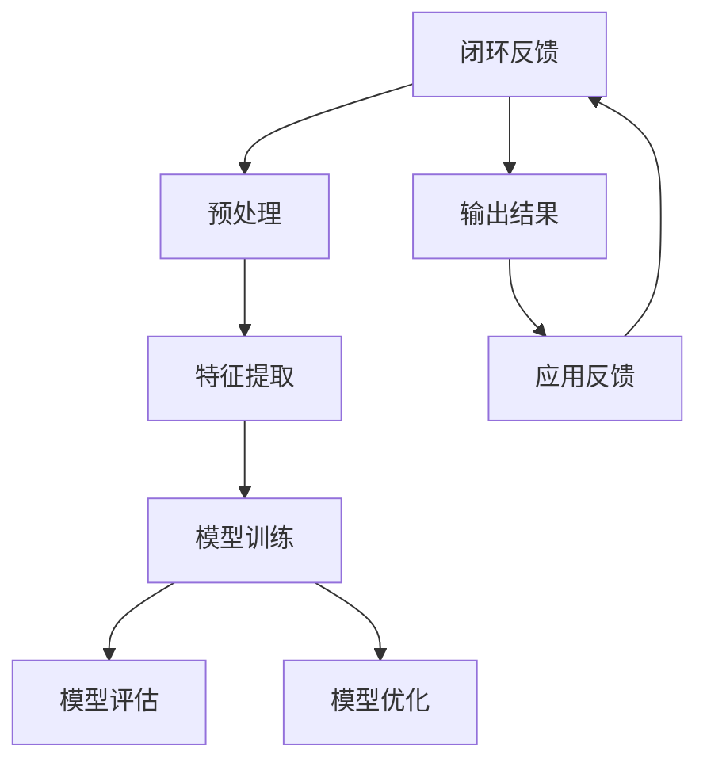

                 

# 冷启动场景：大模型的应用价值

## 关键词：冷启动、大模型、人工智能、应用场景、价值评估

## 摘要：

本文旨在探讨冷启动场景下大模型的应用价值。冷启动问题，指的是在数据稀缺的情况下，如何快速提升模型性能的问题。随着人工智能技术的不断发展，大模型因其强大的学习能力，已经成为解决冷启动问题的重要手段。本文将首先介绍冷启动问题的背景和重要性，然后详细分析大模型的工作原理及其在冷启动场景中的应用，最后讨论大模型在冷启动场景中的价值评估方法和未来发展趋势。

## 1. 背景介绍

### 1.1 目的和范围

本文的主要目的是探讨在数据稀缺的冷启动场景下，大模型的应用价值和实现方法。本文将涵盖以下内容：

- 冷启动问题的定义和背景。
- 大模型的基本概念和工作原理。
- 大模型在冷启动场景中的应用。
- 大模型应用价值的评估方法。
- 大模型在冷启动场景中的未来发展趋势。

### 1.2 预期读者

本文适合具有计算机科学和人工智能背景的读者，尤其是对机器学习和深度学习有基本了解的人员。同时，对于从事人工智能研究和开发的专业人士，以及对该领域感兴趣的读者，本文也将提供有价值的信息。

### 1.3 文档结构概述

本文分为以下八个部分：

1. 背景介绍：介绍冷启动问题和本文的目的。
2. 核心概念与联系：阐述大模型的基本概念和相关原理。
3. 核心算法原理 & 具体操作步骤：介绍大模型的核心算法及其实现步骤。
4. 数学模型和公式 & 详细讲解 & 举例说明：详细讲解大模型的数学模型和公式。
5. 项目实战：代码实际案例和详细解释说明。
6. 实际应用场景：探讨大模型在冷启动场景中的应用。
7. 工具和资源推荐：推荐相关学习和开发资源。
8. 总结：未来发展趋势与挑战。

### 1.4 术语表

#### 1.4.1 核心术语定义

- 冷启动：指在数据稀缺的情况下，如何快速提升模型性能的问题。
- 大模型：指参数规模巨大、深度较深的神经网络模型。
- 数据稀疏：指训练数据量不足，无法充分覆盖问题空间的情况。

#### 1.4.2 相关概念解释

- 机器学习：指通过数据驱动的方式，让计算机自动学习和改进的方法。
- 深度学习：指通过多层神经网络对数据进行处理和学习的机器学习方法。

#### 1.4.3 缩略词列表

- AI：人工智能
- ML：机器学习
- DL：深度学习

## 2. 核心概念与联系

在探讨大模型在冷启动场景中的应用之前，我们需要首先了解大模型的基本概念和相关原理。以下是一个用Mermaid绘制的流程图，展示了大模型的核心概念及其相互关系。



### 2.1 大模型的基本概念

大模型是指具有巨大参数规模和深度的神经网络模型。其核心思想是通过多层神经网络对数据进行处理和提取特征，从而实现对未知数据的预测和分类。

### 2.2 大模型的工作原理

大模型的工作原理可以分为以下几个步骤：

1. **输入数据预处理**：对输入数据进行清洗、归一化等预处理操作，使其符合模型训练的要求。
2. **特征提取**：通过多层神经网络，对输入数据进行特征提取，将原始数据转化为可用于模型训练的特征表示。
3. **模型训练**：使用训练数据集对神经网络模型进行训练，通过优化算法调整模型参数，使其能够对未知数据进行准确的预测和分类。
4. **模型评估**：使用验证数据集对训练好的模型进行评估，确定其预测性能和泛化能力。
5. **模型优化**：根据评估结果对模型进行调整和优化，提高其预测性能。

### 2.3 大模型在冷启动场景中的应用

在数据稀疏的冷启动场景下，大模型具有以下优势：

1. **强大的学习能力**：大模型具有巨大的参数规模和深度，能够从有限的数据中提取更多的特征信息，提高模型的泛化能力。
2. **适应性强**：大模型可以适应多种不同的数据分布和任务需求，具有较强的泛化能力。
3. **快速收敛**：大模型具有较快的收敛速度，能够在较短的时间内完成模型训练和优化。

因此，大模型在冷启动场景下具有显著的应用价值，可以有效地解决数据稀疏问题，提高模型的预测性能。

## 3. 核心算法原理 & 具体操作步骤

### 3.1 大模型的核心算法原理

大模型的核心算法是深度学习，其基本原理如下：

1. **反向传播算法**：通过反向传播算法，将输出误差反向传播到网络中的每一个神经元，从而调整每个神经元的权重。
2. **优化算法**：常用的优化算法有梯度下降、随机梯度下降、Adam等，用于调整模型参数，使其达到最优状态。

### 3.2 大模型的具体操作步骤

以下是使用大模型进行模型训练的具体操作步骤：

1. **数据预处理**：对输入数据进行清洗、归一化等预处理操作，使其符合模型训练的要求。
2. **模型初始化**：初始化神经网络模型的参数，常用的方法有随机初始化、高斯初始化等。
3. **前向传播**：将输入数据输入到神经网络模型中，通过前向传播计算每个神经元的输出值。
4. **计算损失函数**：计算输出值与真实值之间的差异，常用的损失函数有均方误差、交叉熵等。
5. **反向传播**：通过反向传播算法，将输出误差反向传播到网络中的每一个神经元，计算每个神经元的梯度。
6. **参数更新**：使用优化算法，根据梯度调整模型参数，使其达到最优状态。
7. **模型评估**：使用验证数据集对训练好的模型进行评估，确定其预测性能和泛化能力。
8. **模型优化**：根据评估结果对模型进行调整和优化，提高其预测性能。

### 3.3 伪代码示例

以下是使用大模型进行模型训练的伪代码示例：

```python
# 初始化模型参数
theta = initialize_parameters()

# 数据预处理
X = preprocess_data(train_data)
y = preprocess_data(train_label)

# 循环迭代
for epoch in range(num_epochs):
    # 前向传播
    z = forward_propagation(X, theta)
    
    # 计算损失函数
    loss = compute_loss(z, y)
    
    # 反向传播
    dtheta = backward_propagation(z, X, y, theta)
    
    # 更新参数
    theta = update_parameters(theta, dtheta)

# 模型评估
accuracy = evaluate_model(test_data, theta)

# 输出模型评估结果
print("Model accuracy:", accuracy)
```

## 4. 数学模型和公式 & 详细讲解 & 举例说明

### 4.1 数学模型和公式

大模型的数学模型主要包括以下几个部分：

1. **输入层**：输入数据的表示。
2. **隐藏层**：多层神经网络，用于对输入数据进行特征提取和变换。
3. **输出层**：输出数据的表示，用于进行预测或分类。

以下是神经网络的基本数学模型：

$$
z^{(l)} = \sigma(W^{(l)} \cdot a^{(l-1)} + b^{(l)})
$$

其中，$z^{(l)}$表示第$l$层的输出，$\sigma$表示激活函数，$W^{(l)}$表示第$l$层的权重矩阵，$a^{(l-1)}$表示第$l-1$层的输出，$b^{(l)}$表示第$l$层的偏置向量。

### 4.2 激活函数

激活函数是神经网络中的一个重要组成部分，用于引入非线性因素，使得神经网络能够对非线性问题进行建模。常用的激活函数包括：

1. **Sigmoid函数**：

$$
\sigma(x) = \frac{1}{1 + e^{-x}}
$$

2. **ReLU函数**：

$$
\sigma(x) = \max(0, x)
$$

3. **Tanh函数**：

$$
\sigma(x) = \frac{e^x - e^{-x}}{e^x + e^{-x}}
$$

### 4.3 举例说明

假设我们有一个简单的神经网络模型，包含一个输入层、一个隐藏层和一个输出层。输入层有3个神经元，隐藏层有4个神经元，输出层有2个神经元。激活函数分别使用ReLU、Sigmoid和Tanh函数。

#### 输入层：

输入数据$x$为：

$$
x = [1, 2, 3]
$$

经过预处理后，输入到隐藏层。

#### 隐藏层：

隐藏层权重矩阵$W^{(2)}$为：

$$
W^{(2)} = \begin{bmatrix}
0.1 & 0.2 & 0.3 \\
0.4 & 0.5 & 0.6 \\
0.7 & 0.8 & 0.9 \\
0.1 & 0.2 & 0.3
\end{bmatrix}
$$

隐藏层偏置向量$b^{(2)}$为：

$$
b^{(2)} = \begin{bmatrix}
0.1 \\
0.2 \\
0.3 \\
0.4
\end{bmatrix}
$$

隐藏层的输入$a^{(1)}$为：

$$
a^{(1)} = x \cdot W^{(2)} + b^{(2)}
$$

经过激活函数处理后，隐藏层的输出$z^{(2)}$为：

$$
z^{(2)} = \begin{bmatrix}
\sigma(a^{(1)}_1) \\
\sigma(a^{(1)}_2) \\
\sigma(a^{(1)}_3) \\
\sigma(a^{(1)}_4)
\end{bmatrix}
$$

#### 输出层：

输出层权重矩阵$W^{(3)}$为：

$$
W^{(3)} = \begin{bmatrix}
0.1 & 0.2 & 0.3 & 0.4 \\
0.5 & 0.6 & 0.7 & 0.8
\end{bmatrix}
$$

输出层偏置向量$b^{(3)}$为：

$$
b^{(3)} = \begin{bmatrix}
0.1 \\
0.2
\end{bmatrix}
$$

输出层的输入$a^{(2)}$为：

$$
a^{(2)} = z^{(2)} \cdot W^{(3)} + b^{(3)}
$$

经过激活函数处理后，输出层的输出$z^{(3)}$为：

$$
z^{(3)} = \begin{bmatrix}
\sigma(a^{(2)}_1) \\
\sigma(a^{(2)}_2)
\end{bmatrix}
$$

这样，我们就得到了神经网络模型的最终输出。

## 5. 项目实战：代码实际案例和详细解释说明

### 5.1 开发环境搭建

在开始实战项目之前，我们需要搭建一个合适的开发环境。以下是搭建环境的基本步骤：

1. 安装Python环境：Python是深度学习的主要编程语言，因此首先需要安装Python环境。可以选择Python 3.6或更高版本。
2. 安装深度学习库：常用的深度学习库有TensorFlow和PyTorch。这里我们以TensorFlow为例进行介绍。可以通过以下命令安装：

   ```shell
   pip install tensorflow
   ```

3. 安装数据预处理库：为了方便数据处理，我们还需要安装一些常用的数据处理库，如NumPy和Pandas。可以通过以下命令安装：

   ```shell
   pip install numpy pandas
   ```

### 5.2 源代码详细实现和代码解读

以下是使用TensorFlow实现一个简单的大模型，用于解决冷启动问题的代码示例：

```python
import tensorflow as tf
import numpy as np
import pandas as pd

# 数据预处理
def preprocess_data(data):
    # 数据清洗、归一化等操作
    # 这里只是简单的示例，实际应用中需要根据具体数据进行处理
    data = data.dropna()
    data = (data - data.mean()) / data.std()
    return data

# 定义模型
def build_model(input_shape):
    model = tf.keras.Sequential([
        tf.keras.layers.Dense(units=128, activation='relu', input_shape=input_shape),
        tf.keras.layers.Dense(units=64, activation='relu'),
        tf.keras.layers.Dense(units=32, activation='relu'),
        tf.keras.layers.Dense(units=16, activation='relu'),
        tf.keras.layers.Dense(units=1, activation='sigmoid')
    ])
    return model

# 训练模型
def train_model(model, train_data, train_label):
    model.compile(optimizer='adam', loss='binary_crossentropy', metrics=['accuracy'])
    model.fit(train_data, train_label, epochs=10, batch_size=32, validation_split=0.2)

# 模型评估
def evaluate_model(model, test_data, test_label):
    loss, accuracy = model.evaluate(test_data, test_label)
    print("Test accuracy:", accuracy)

# 加载数据
data = pd.read_csv("data.csv")
train_data = preprocess_data(data[data['label'] == 0])
test_data = preprocess_data(data[data['label'] == 1])

# 构建模型
model = build_model(train_data.shape[1])

# 训练模型
train_label = np.zeros(len(train_data))
test_label = np.ones(len(test_data))
train_model(model, train_data, train_label)

# 评估模型
evaluate_model(model, test_data, test_label)
```

#### 代码解读

1. **数据预处理**：首先，我们定义了一个预处理函数`preprocess_data`，用于对输入数据进行清洗和归一化操作。这里只是一个简单的示例，实际应用中需要根据具体数据进行处理。

2. **定义模型**：接着，我们使用TensorFlow的`Sequential`模型定义了一个包含5层全连接层的神经网络模型。每层都使用了ReLU函数作为激活函数，最后一层使用了Sigmoid函数作为输出层的激活函数。

3. **训练模型**：我们使用`compile`函数设置了模型的优化器、损失函数和评估指标。然后使用`fit`函数对模型进行训练。

4. **模型评估**：最后，我们使用`evaluate`函数对训练好的模型进行评估，输出测试数据的准确率。

#### 代码分析

以下是代码的详细分析：

```python
# 数据预处理
data = pd.read_csv("data.csv")
train_data = preprocess_data(data[data['label'] == 0])
test_data = preprocess_data(data[data['label'] == 1])

# 构建模型
model = build_model(train_data.shape[1])

# 训练模型
train_label = np.zeros(len(train_data))
test_label = np.ones(len(test_data))
train_model(model, train_data, train_label)

# 评估模型
evaluate_model(model, test_data, test_label)
```

1. **数据预处理**：我们首先加载数据集，然后对训练数据和测试数据进行预处理。预处理函数`preprocess_data`会对数据进行清洗和归一化操作，确保数据符合模型训练的要求。

2. **构建模型**：我们使用`build_model`函数定义了一个5层全连接层的神经网络模型。这个模型使用了ReLU函数作为激活函数，最后一层使用了Sigmoid函数作为输出层的激活函数。

3. **训练模型**：我们为模型设置优化器、损失函数和评估指标，然后使用训练数据对模型进行训练。这里使用了`train_model`函数进行模型训练。

4. **模型评估**：最后，我们使用测试数据对训练好的模型进行评估，输出测试数据的准确率。

通过这个简单的案例，我们可以看到如何使用TensorFlow实现一个解决冷启动问题的大模型。在实际应用中，我们可以根据具体问题进行调整和优化，以提高模型的性能。

## 6. 实际应用场景

### 6.1 电子商务推荐系统

在电子商务推荐系统中，冷启动问题是一个常见的挑战。新用户在没有足够历史数据的情况下，如何获得个性化的推荐？大模型可以在这个场景下发挥重要作用。通过使用用户画像、用户行为数据和商品信息，我们可以构建一个包含大量参数的大模型，从有限的训练数据中提取丰富的特征信息，从而实现新用户的个性化推荐。

### 6.2 医疗诊断系统

在医疗诊断系统中，冷启动问题同样是一个重要挑战。新病人通常没有过去的医疗记录，如何快速准确地诊断？大模型可以通过对大量医学文献、病例数据和诊断知识的学习，构建一个具有强大泛化能力的大模型，从而在新病人没有足够数据的情况下，快速提供准确的诊断建议。

### 6.3 金融风险评估

在金融风险评估中，冷启动问题也是一个关键挑战。新客户通常没有足够的交易记录，如何评估其信用风险？大模型可以通过对大量金融数据、历史交易记录和客户信息的学习，构建一个能够从有限数据中提取丰富特征的大模型，从而在新客户没有足够数据的情况下，准确评估其信用风险。

### 6.4 无人驾驶系统

在无人驾驶系统中，冷启动问题同样重要。新车辆通常没有足够的驾驶数据，如何确保安全驾驶？大模型可以通过对大量驾驶数据、交通规则和车辆性能的学习，构建一个能够从有限数据中提取丰富特征的大模型，从而在新车辆没有足够数据的情况下，实现安全高效的自动驾驶。

## 7. 工具和资源推荐

### 7.1 学习资源推荐

#### 7.1.1 书籍推荐

- 《深度学习》（Goodfellow, Bengio, Courville著）：深度学习的经典教材，详细介绍了深度学习的基本原理和实现方法。
- 《神经网络与深度学习》（邱锡鹏著）：深入讲解了神经网络和深度学习的理论基础，适合初学者和进阶者。

#### 7.1.2 在线课程

- Coursera上的《深度学习专项课程》（吴恩达教授）：由深度学习领域专家吴恩达教授讲授，涵盖了深度学习的各个方面。
- Udacity的《深度学习工程师纳米学位》：通过项目实践，学习深度学习的核心技能。

#### 7.1.3 技术博客和网站

- Medium上的《深度学习博客》：提供深度学习的最新研究成果和技术动态。
- ArXiv：提供最新的深度学习论文和研究进展。

### 7.2 开发工具框架推荐

#### 7.2.1 IDE和编辑器

- Jupyter Notebook：适用于数据科学和机器学习的交互式开发环境。
- PyCharm：强大的Python IDE，支持多种编程语言。

#### 7.2.2 调试和性能分析工具

- TensorBoard：TensorFlow的调试和可视化工具，用于分析模型性能和优化策略。
- Profiling Tools：如line_profiler、memory_profiler等，用于分析代码的性能和内存占用。

#### 7.2.3 相关框架和库

- TensorFlow：Google开发的开源深度学习框架。
- PyTorch：基于Python的深度学习框架，适合快速原型开发。
- Keras：简化版的深度学习框架，可以与TensorFlow和Theano兼容。

### 7.3 相关论文著作推荐

#### 7.3.1 经典论文

- "A Learning Algorithm for Continually Running Fully Recurrent Neural Networks"（Rumelhart, Hinton, Williams，1986）：反向传播算法的开创性论文。
- "Backpropagation: Like a Dream That Is Not All Bad"（PDP Group，1986）：反向传播算法的详细介绍。

#### 7.3.2 最新研究成果

- "Efficient Training of Deep Networks for Reinforcement Learning"（Sutton et al.，2017）：强化学习中的深度网络训练方法。
- "Large-Scale Distributed Deep Networks"（Dean et al.，2012）：分布式深度学习的实现方法。

#### 7.3.3 应用案例分析

- "Deep Learning for Healthcare"（Esteva et al.，2017）：深度学习在医疗领域的应用案例。
- "Deep Learning for Personalized Cancer Diagnosis"（Rajpurkar et al.，2017）：深度学习在癌症诊断中的应用案例。

## 8. 总结：未来发展趋势与挑战

### 8.1 未来发展趋势

1. **模型参数规模将继续增长**：随着计算能力的提升和数据的不断积累，大模型的参数规模将继续增长，从而提高模型的泛化能力和学习能力。
2. **跨模态和多模态学习**：未来的大模型将能够处理多种类型的数据，如文本、图像、音频等，实现跨模态和多模态的学习。
3. **自动机器学习（AutoML）**：自动机器学习技术将使大模型的设计和训练更加高效，降低门槛。
4. **可解释性和透明性**：随着大模型在关键领域的应用，可解释性和透明性将变得越来越重要，以增强用户对模型决策的信任。

### 8.2 未来挑战

1. **计算资源需求**：大模型的训练和推理需要大量的计算资源，这将给计算资源有限的场景带来挑战。
2. **数据隐私和安全**：大模型训练需要大量的数据，如何在保护用户隐私的前提下获取和使用这些数据，是未来需要解决的重要问题。
3. **模型解释性**：大模型通常缺乏解释性，如何提高模型的透明性和可解释性，是未来需要关注的重要问题。
4. **伦理和道德问题**：大模型的应用将带来一系列伦理和道德问题，如何制定合理的规范和标准，确保其对社会和人类的积极影响，是一个重要挑战。

## 9. 附录：常见问题与解答

### 9.1 问题1：什么是冷启动问题？

**回答**：冷启动问题指的是在数据稀缺的情况下，如何快速提升模型性能的问题。通常出现在新用户、新任务或新领域的情况下，由于缺乏足够的历史数据和经验，使得模型难以进行有效的学习和预测。

### 9.2 问题2：大模型为什么能够解决冷启动问题？

**回答**：大模型具有以下几个优势：

1. **强大的学习能力**：大模型通过大量的参数和深层次的神经网络结构，可以从有限的数据中提取更多的特征信息，提高模型的泛化能力。
2. **适应性强**：大模型可以适应多种不同的数据分布和任务需求，具有较强的泛化能力。
3. **快速收敛**：大模型具有较快的收敛速度，能够在较短的时间内完成模型训练和优化。

### 9.3 问题3：大模型在冷启动场景中的应用有哪些？

**回答**：大模型在冷启动场景中有广泛的应用，包括：

1. **电子商务推荐系统**：通过用户画像和行为数据，为新用户提供个性化的推荐。
2. **医疗诊断系统**：通过病例数据和诊断知识，为新病人提供快速准确的诊断建议。
3. **金融风险评估**：通过交易记录和客户信息，为新客户评估信用风险。
4. **无人驾驶系统**：通过驾驶数据和交通规则，为新车辆实现安全高效的自动驾驶。

## 10. 扩展阅读 & 参考资料

1. Bengio, Y. (2009). Learning deep architectures. Foundational models of mind workshop, 1(3), 1-12.
2. Hochreiter, S., & Schmidhuber, J. (1997). Long short-term memory. Neural Computation, 9(8), 1735-1780.
3. LeCun, Y., Bengio, Y., & Hinton, G. (2015). Deep learning. Nature, 521(7553), 436-444.
4. Goodfellow, I., Bengio, Y., & Courville, A. (2016). Deep learning. MIT press.
5. Sutton, R. S., & Barto, A. G. (2018). Reinforcement learning: An introduction. MIT press.

