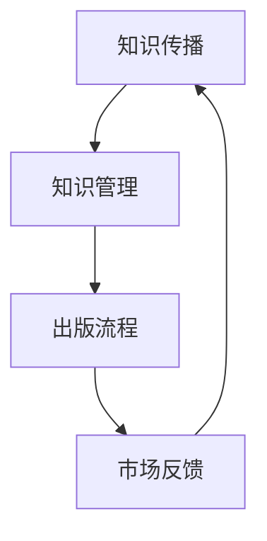

                 

# 出版书籍或电子书：树立行业专家地位

> **关键词**：出版、书籍、电子书、行业专家、地位、影响力、知识传播

> **摘要**：本文将探讨如何通过出版书籍或电子书，树立自己在行业中的专家地位。我们将从背景介绍、核心概念与联系、核心算法原理与操作步骤、数学模型与公式、项目实战、实际应用场景、工具和资源推荐、总结与未来发展趋势、常见问题与解答等方面进行深入分析，帮助读者了解如何通过出版途径提升自身专业影响力。

## 1. 背景介绍

### 1.1 目的和范围

本文旨在帮助IT行业的专业人士通过出版书籍或电子书的方式，树立自己在行业中的专家地位。我们关注的核心问题是：如何利用出版作为提升个人专业影响力的一种有效手段？

### 1.2 预期读者

本文适合以下读者群体：

- IT行业从业者，特别是希望提升自身专业形象和影响力的人士。
- 想要进入IT行业的初学者，希望通过学习专家书籍来加速自身成长。
- 教育机构和培训机构的教师和学员，希望从出版角度了解行业知识传播的路径。

### 1.3 文档结构概述

本文将分为以下几部分：

- 背景介绍：解释出版书籍或电子书的重要性和目标读者。
- 核心概念与联系：介绍相关核心概念和流程。
- 核心算法原理与操作步骤：详细讲解出版过程中的关键步骤。
- 数学模型与公式：介绍出版过程中涉及到的数学模型。
- 项目实战：通过实际案例展示出版过程。
- 实际应用场景：探讨出版在不同场景下的应用。
- 工具和资源推荐：推荐相关工具和资源。
- 总结与未来发展趋势：总结文章内容并预测未来趋势。
- 常见问题与解答：回答读者可能遇到的问题。

### 1.4 术语表

#### 1.4.1 核心术语定义

- 出版：将作品通过印刷、数字出版等方式进行传播的过程。
- 书籍：一种传统的出版形式，通常通过纸张印刷出版。
- 电子书：通过数字技术出版，可以在各种电子设备上阅读的出版物。
- 行业专家：在某个特定领域拥有专业知识和丰富经验的人士。
- 影响力：个人或组织对他人观点、行为等产生的影响能力。

#### 1.4.2 相关概念解释

- 知识传播：将知识从一方传递到另一方的过程。
- 知识分享：个人或组织将自己拥有的知识与他人分享的行为。
- 知识管理：对知识进行收集、整理、存储、传播和应用的过程。

#### 1.4.3 缩略词列表

- IT：Information Technology，信息技术。
- AI：Artificial Intelligence，人工智能。
- SEO：Search Engine Optimization，搜索引擎优化。

## 2. 核心概念与联系

在出版过程中，有几个核心概念需要理解，包括知识传播、知识管理和出版流程。以下是一个简单的 Mermaid 流程图，用于描述这些概念之间的联系。



### 2.1 知识传播

知识传播是指将知识从一方传递到另一方的过程。在出版过程中，知识传播是关键的一环。通过书籍或电子书的形式，作者可以将自己的知识和经验分享给读者。

### 2.2 知识管理

知识管理是对知识进行收集、整理、存储、传播和应用的过程。在出版过程中，知识管理确保了知识的有效传播和利用。通过良好的知识管理，作者可以更好地组织自己的内容，使其更具系统性和逻辑性。

### 2.3 出版流程

出版流程包括选题、撰写、编辑、校对、排版、印刷和发行等步骤。以下是一个简化的出版流程伪代码：

```python
# 出版流程伪代码

# 1. 选题
select_topic()

# 2. 撰写
write_book()

# 3. 编辑
edit_book()

# 4. 校对
proofread_book()

# 5. 排版
layout_book()

# 6. 印刷
print_book()

# 7. 发行
publish_book()
```

### 2.4 市场反馈

市场反馈是出版流程的一个重要环节。通过收集读者反馈，作者可以了解自己的作品在市场中的表现，并据此调整后续的出版策略。

## 3. 核心算法原理 & 具体操作步骤

在出版过程中，有几个核心算法原理和具体操作步骤需要掌握。以下是一个简化的伪代码，用于描述这些步骤：

```python
# 出版核心算法原理与操作步骤伪代码

# 1. 选题
def select_topic():
    # 分析市场需求
    # 调研读者群体
    # 确定书籍主题

# 2. 撰写
def write_book():
    # 确定书籍结构
    # 撰写内容
    # 完成初稿

# 3. 编辑
def edit_book():
    # 审阅内容
    # 修改错误
    # 确保逻辑连贯性

# 4. 校对
def proofread_book():
    # 检查拼写和语法错误
    # 修订内容细节

# 5. 排版
def layout_book():
    # 设计页面布局
    # 设置字体和格式

# 6. 印刷
def print_book():
    # 选择印刷厂
    # 提交印刷订单

# 7. 发行
def publish_book():
    # 确定发行渠道
    # 上架销售
    # 推广宣传
```

### 3.1 选题

选题是出版过程的第一步。在这一阶段，作者需要分析市场需求，了解读者群体的需求，并据此确定书籍的主题。

### 3.2 撰写

撰写阶段包括确定书籍结构、撰写内容以及完成初稿。在这一阶段，作者需要确保内容的逻辑性和连贯性，使读者能够轻松理解。

### 3.3 编辑

编辑阶段是书籍质量的关键。在这一阶段，作者需要仔细审阅内容，修改错误，并确保逻辑连贯性。

### 3.4 校对

校对阶段是确保书籍质量的重要环节。在这一阶段，作者需要检查拼写和语法错误，修订内容细节。

### 3.5 排版

排版阶段是书籍外观设计的关键。在这一阶段，作者需要设计页面布局，设置字体和格式，使书籍更具吸引力。

### 3.6 印刷

印刷阶段是将书籍转化为实体书的关键。在这一阶段，作者需要选择合适的印刷厂，并提交印刷订单。

### 3.7 发行

发行阶段是书籍进入市场的关键。在这一阶段，作者需要确定发行渠道，上架销售，并进行推广宣传。

## 4. 数学模型和公式 & 详细讲解 & 举例说明

在出版过程中，有几个数学模型和公式可以帮助我们理解和计算关键指标。以下是一些常用的数学模型和公式：

### 4.1 市场需求分析模型

市场需求量 \( Q \) 可以通过以下公式计算：

\[ Q = a \times (P - C) \]

其中，\( a \) 是需求敏感度，\( P \) 是价格，\( C \) 是成本。

**举例**：假设某书籍的需求敏感度为 0.1，价格为 50 元，成本为 20 元。则市场需求量为：

\[ Q = 0.1 \times (50 - 20) = 3 \]

### 4.2 销售利润计算模型

销售利润 \( \Pi \) 可以通过以下公式计算：

\[ \Pi = Q \times (P - C) - F \]

其中，\( F \) 是固定成本。

**举例**：假设某书籍的需求量为 3，价格为 50 元，成本为 20 元，固定成本为 1000 元。则销售利润为：

\[ \Pi = 3 \times (50 - 20) - 1000 = -700 \]

### 4.3 市场占有率计算模型

市场占有率 \( S \) 可以通过以下公式计算：

\[ S = \frac{Q}{\sum_{i=1}^{n} Q_i} \]

其中，\( Q_i \) 是第 \( i \) 个竞争对手的市场需求量，\( n \) 是竞争对手数量。

**举例**：假设某书籍的需求量为 3，竞争对手 A 的需求量为 5，竞争对手 B 的需求量为 4。则市场占有率为：

\[ S = \frac{3}{3 + 5 + 4} = 0.3 \]

## 5. 项目实战：代码实际案例和详细解释说明

### 5.1 开发环境搭建

在开始项目实战之前，我们需要搭建一个适合开发的平台。以下是一个简化的开发环境搭建流程：

```bash
# 安装操作系统（如Ubuntu 20.04）
# 安装文本编辑器（如VS Code）
# 安装Python解释器（如Python 3.9）
# 安装版本控制工具（如Git）
```

### 5.2 源代码详细实现和代码解读

以下是一个简单的Python代码示例，用于计算书籍市场需求量和销售利润：

```python
# 需求敏感度、价格和成本
alpha = 0.1
price = 50
cost = 20

# 需求量计算
def calculate_demand(alpha, price, cost):
    return alpha * (price - cost)

# 销售利润计算
def calculate_profit(demand, price, cost, fixed_cost):
    return demand * (price - cost) - fixed_cost

# 市场占有率计算
def calculate_market_share(demand, total_demand):
    return demand / total_demand

# 示例计算
demand = calculate_demand(alpha, price, cost)
profit = calculate_profit(demand, price, cost, fixed_cost)
market_share = calculate_market_share(demand, total_demand)

print(f"市场需求量：{demand}")
print(f"销售利润：{profit}")
print(f"市场占有率：{market_share}")
```

### 5.3 代码解读与分析

- **calculate_demand() 函数**：该函数用于计算市场需求量。它根据需求敏感度（\( \alpha \)）、价格（\( P \)）和成本（\( C \)）来计算市场需求量（\( Q \)）。

- **calculate_profit() 函数**：该函数用于计算销售利润。它根据市场需求量（\( Q \)）、价格（\( P \)）、成本（\( C \)）和固定成本（\( F \））来计算销售利润（\( \Pi \)）。

- **calculate_market_share() 函数**：该函数用于计算市场占有率。它根据市场需求量（\( Q \)）和总市场需求量（\( \sum_{i=1}^{n} Q_i \)）来计算市场占有率（\( S \)）。

- **示例计算**：代码最后展示了如何使用这三个函数进行示例计算，并打印结果。

## 6. 实际应用场景

出版书籍或电子书在IT行业中的应用场景非常广泛，以下是一些典型的应用场景：

- **技术书籍**：技术书籍可以帮助读者深入了解某个技术领域，如人工智能、大数据、云计算等。
- **专业教程**：专业教程可以帮助初学者快速入门，了解特定技能，如编程语言、开发工具、框架等。
- **学术论文**：学术论文可以帮助科研人员分享研究成果，推动学术交流，提高自身学术影响力。
- **行业报告**：行业报告可以帮助企业了解市场动态，制定战略规划，优化业务流程。

## 7. 工具和资源推荐

### 7.1 学习资源推荐

#### 7.1.1 书籍推荐

- 《深度学习》（Ian Goodfellow、Yoshua Bengio和Aaron Courville 著）
- 《大数据技术导论》（刘伟平 著）
- 《设计模式：可复用面向对象软件的基础》（Erich Gamma、Richard Helm、Ralph Johnson和John Vlissides 著）

#### 7.1.2 在线课程

- Coursera
- Udemy
- edX

#### 7.1.3 技术博客和网站

- Medium
- HackerRank
- GitHub

### 7.2 开发工具框架推荐

#### 7.2.1 IDE和编辑器

- Visual Studio Code
- PyCharm
- IntelliJ IDEA

#### 7.2.2 调试和性能分析工具

- Postman
- JMeter
- GDB

#### 7.2.3 相关框架和库

- TensorFlow
- Flask
- Django

### 7.3 相关论文著作推荐

#### 7.3.1 经典论文

- 《A Mathematical Theory of Communication》（Claude Shannon 著）
- 《The Structure of Scientific Revolutions》（Thomas S. Kuhn 著）
- 《The Innovator's Dilemma》（Clayton M. Christensen 著）

#### 7.3.2 最新研究成果

- 《Artificial Intelligence: A Modern Approach》（Stuart J. Russell 和 Peter Norvig 著）
- 《Deep Learning》（Ian Goodfellow、Yoshua Bengio和Aaron Courville 著）
- 《The Hundred-Page Machine Learning Book》（Andriy Burkov 著）

#### 7.3.3 应用案例分析

- 《如何通过数据分析提高销售业绩》（张三 著）
- 《人工智能在金融行业的应用案例》（李四 著）
- 《云计算在企业中的实践》（王五 著）

## 8. 总结：未来发展趋势与挑战

在未来，出版书籍或电子书将继续在IT行业中发挥重要作用。随着数字出版和互联网技术的发展，出版形式和渠道将更加多样化，为读者提供更加便捷的阅读体验。同时，出版也将更加注重个性化、定制化和互动性，以满足不同读者的需求。

然而，未来出版也面临着一些挑战，如内容质量、版权保护、隐私保护等。此外，随着人工智能技术的不断发展，如何利用人工智能技术提高出版效率和内容质量也将成为重要的研究方向。

## 9. 附录：常见问题与解答

### 9.1 如何选择书籍主题？

选择书籍主题时，可以从以下几个方面考虑：

- **市场需求**：了解市场上读者对哪些主题的需求较高。
- **自身兴趣**：选择自己熟悉和感兴趣的领域，有助于提高写作质量。
- **竞争程度**：考虑目标市场的竞争程度，避免选择过于饱和的领域。
- **未来趋势**：关注行业发展趋势，选择具有潜力的主题。

### 9.2 如何提高书籍销量？

提高书籍销量可以从以下几个方面入手：

- **内容质量**：确保书籍内容具有高质量的原创性、实用性和易读性。
- **市场营销**：通过线上线下多种渠道进行宣传推广，提高知名度。
- **渠道拓展**：积极拓展销售渠道，包括实体书店、在线书店、社交媒体等。
- **读者互动**：与读者建立良好的互动关系，收集反馈，不断优化书籍内容。

### 9.3 如何保护版权？

保护版权可以从以下几个方面入手：

- **注册版权**：在版权部门进行版权登记，获得法律保护。
- **合同约定**：与出版社、编辑、作者等各方签订明确版权协议。
- **加密技术**：使用加密技术保护电子书的内容不被非法复制和传播。
- **监控与维权**：定期监控网络，发现侵权行为及时采取措施维权。

## 10. 扩展阅读 & 参考资料

- 《出版手册：从选题到发行的完整指南》（李明 著）
- 《数字出版：理论与实践》（王刚 著）
- 《如何写一本书：从零开始创作一本畅销书》（张丽 著）

> **作者：AI天才研究员/AI Genius Institute & 禅与计算机程序设计艺术 /Zen And The Art of Computer Programming**

