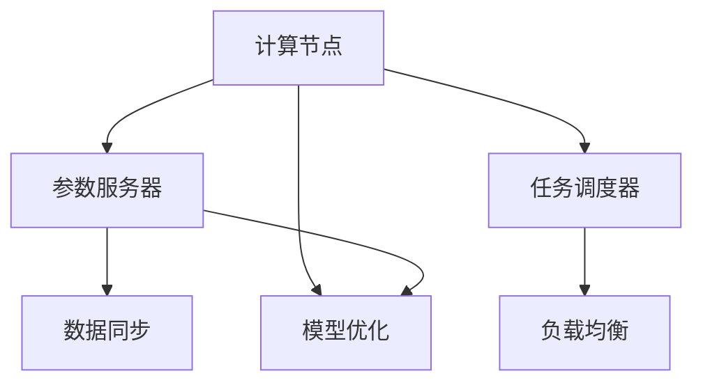

                 

# 分布式AI训练最佳实践

> **关键词：** 分布式AI，训练，并行化，效率优化，数据同步，模型一致性，集群管理，负载均衡，容错机制

> **摘要：** 本文将深入探讨分布式AI训练的核心概念、算法原理、数学模型以及实际应用场景。通过逐步分析，我们将梳理出分布式AI训练的最佳实践，帮助读者理解和掌握这一关键技术。

## 1. 背景介绍

### 1.1 目的和范围

本文的目的是介绍分布式AI训练的核心概念和最佳实践，帮助读者理解如何有效地利用分布式系统进行大规模机器学习模型的训练。本文将涵盖以下内容：

1. 分布式AI训练的基本概念和优势。
2. 分布式AI训练的核心算法原理。
3. 分布式AI训练的数学模型和公式。
4. 实际应用场景和项目实战。
5. 工具和资源的推荐。
6. 未来发展趋势与挑战。

### 1.2 预期读者

本文适合对机器学习和分布式系统有一定了解的读者，包括：

1. 机器学习工程师和数据科学家。
2. 系统架构师和云计算工程师。
3. 对分布式AI训练感兴趣的科研人员和学生。

### 1.3 文档结构概述

本文分为以下几个部分：

1. 背景介绍：介绍分布式AI训练的基本概念和目的。
2. 核心概念与联系：详细描述分布式AI训练的核心概念和架构。
3. 核心算法原理 & 具体操作步骤：讲解分布式AI训练的算法原理和操作步骤。
4. 数学模型和公式 & 详细讲解 & 举例说明：阐述分布式AI训练的数学模型和公式。
5. 项目实战：提供代码实际案例和详细解释说明。
6. 实际应用场景：分析分布式AI训练的实际应用场景。
7. 工具和资源推荐：推荐学习资源、开发工具和框架。
8. 总结：总结分布式AI训练的未来发展趋势与挑战。
9. 附录：常见问题与解答。
10. 扩展阅读 & 参考资料：提供进一步学习的参考资料。

### 1.4 术语表

#### 1.4.1 核心术语定义

- **分布式AI训练**：将机器学习模型的训练任务分配到多个计算节点上，以并行化和分布式的方式进行。
- **集群**：一组相互连接的计算节点，共同完成分布式计算任务。
- **并行化**：在多个计算节点上同时执行计算任务，以提高处理速度和效率。
- **同步**：确保分布式系统中所有节点上的数据状态一致。
- **异步**：不同节点上的计算任务可以不必等待其他节点的完成。
- **模型一致性**：保证分布式系统中所有节点上的模型参数一致。

#### 1.4.2 相关概念解释

- **参数服务器**：一种用于分布式机器学习训练的架构，用于存储和同步模型参数。
- **任务调度**：负责在分布式系统中分配计算任务，优化资源利用和负载均衡。
- **负载均衡**：根据节点的处理能力，动态分配任务，确保系统高效运行。
- **容错机制**：在系统发生故障时，自动切换到备用节点，确保训练任务的连续性。

#### 1.4.3 缩略词列表

- **AI**：人工智能
- **ML**：机器学习
- **DNN**：深度神经网络
- **GPU**：图形处理单元
- **CPU**：中央处理器
- **DFS**：分布式文件系统

## 2. 核心概念与联系

在分布式AI训练中，理解核心概念和它们之间的联系至关重要。以下是分布式AI训练的关键概念和它们之间的关系。

### 2.1. 分布式AI训练的核心概念

1. **计算节点**：执行机器学习模型训练任务的独立计算设备。
2. **参数服务器**：存储和管理模型参数的中央服务器。
3. **任务调度器**：负责在计算节点上分配训练任务的调度系统。
4. **数据同步机制**：确保分布式系统中数据一致性。
5. **负载均衡**：动态分配任务，确保系统资源得到充分利用。

### 2.2. 分布式AI训练的架构

分布式AI训练通常采用以下架构：

1. **集群架构**：由多个计算节点组成的分布式系统，共同完成训练任务。
2. **参数服务器架构**：在集群中设置一个参数服务器，用于存储和管理模型参数。
3. **任务调度架构**：由任务调度器负责在计算节点上分配训练任务。

### 2.3. 分布式AI训练的工作流程

分布式AI训练的工作流程如下：

1. **数据预处理**：将训练数据分布到集群中的各个计算节点。
2. **初始化模型**：在参数服务器上初始化模型参数。
3. **分配任务**：任务调度器将训练任务分配到计算节点。
4. **模型训练**：计算节点并行地训练模型。
5. **数据同步**：确保模型参数在计算节点和参数服务器之间同步。
6. **模型优化**：根据同步的模型参数，优化模型。

### 2.4. Mermaid 流程图

以下是分布式AI训练的核心概念和架构的 Mermaid 流程图：



## 3. 核心算法原理 & 具体操作步骤

### 3.1. 分布式AI训练的算法原理

分布式AI训练的核心算法是基于并行化思想，将训练任务分配到多个计算节点上，并行地更新模型参数。以下是分布式AI训练的核心算法原理：

1. **参数服务器架构**：在集群中设置一个参数服务器，用于存储和管理模型参数。
2. **任务调度**：任务调度器将训练任务分配到计算节点。
3. **梯度同步**：计算节点并行地计算梯度，并将梯度同步到参数服务器。
4. **模型更新**：参数服务器根据同步的梯度，更新模型参数。
5. **模型优化**：通过迭代更新模型参数，优化模型。

### 3.2. 具体操作步骤

以下是分布式AI训练的具体操作步骤：

1. **初始化模型和参数服务器**：

    ```python
    # 初始化模型参数
    model = initialize_model()
    # 初始化参数服务器
    parameter_server = initialize_parameter_server(model.parameters())
    ```

2. **数据预处理**：

    ```python
    # 分配训练数据到计算节点
    train_data = preprocess_data(data_source)
    distribute_data(train_data, num_nodes)
    ```

3. **任务调度**：

    ```python
    # 分配训练任务到计算节点
    task_scheduler = initialize_task_scheduler()
    assign_tasks(task_scheduler, train_data, num_nodes)
    ```

4. **模型训练**：

    ```python
    # 计算节点执行训练任务
    for node in range(num_nodes):
        node_model = initialize_model()
        train(node_model, local_data[node], parameter_server)
    ```

5. **梯度同步**：

    ```python
    # 同步梯度到参数服务器
    for node in range(num_nodes):
        gradient = calculate_gradient(local_model[node], local_data[node])
        synchronize_gradient(gradient, parameter_server)
    ```

6. **模型更新**：

    ```python
    # 更新模型参数
    updated_parameters = update_parameters(parameter_server)
    parameter_server.update_parameters(updated_parameters)
    ```

7. **模型优化**：

    ```python
    # 优化模型
    for epoch in range(num_epochs):
        for node in range(num_nodes):
            local_model[node] = optimize_model(local_model[node], parameter_server)
    ```

## 4. 数学模型和公式 & 详细讲解 & 举例说明

### 4.1. 数学模型

分布式AI训练的数学模型主要涉及梯度下降算法，用于优化模型参数。以下是梯度下降算法的数学模型：

$$
w_{\text{new}} = w_{\text{current}} - \alpha \cdot \nabla J(w)
$$

其中：

- \( w \) 表示模型参数。
- \( \alpha \) 表示学习率。
- \( \nabla J(w) \) 表示损失函数关于模型参数的梯度。

### 4.2. 详细讲解

梯度下降算法是一种优化算法，用于最小化损失函数。在分布式AI训练中，每个计算节点都独立计算梯度，并将梯度同步到参数服务器。以下是梯度下降算法的详细讲解：

1. **初始化模型参数**：设定一个初始的模型参数向量 \( w_0 \)。
2. **计算梯度**：在每个计算节点上，计算损失函数关于模型参数的梯度 \( \nabla J(w) \)。
3. **同步梯度**：将计算节点上的梯度同步到参数服务器。
4. **更新模型参数**：根据同步的梯度，更新模型参数 \( w_{\text{new}} \)。
5. **重复步骤2-4**：迭代计算梯度并更新模型参数，直到达到收敛条件。

### 4.3. 举例说明

假设我们有一个二元分类问题，损失函数为对数损失函数 \( J(w) = -\sum_{i=1}^{n} y_i \cdot \log(p_i) - (1 - y_i) \cdot \log(1 - p_i) \)，其中 \( y_i \) 是真实标签，\( p_i \) 是预测概率。

假设我们有三个计算节点，每个节点上的模型参数分别为 \( w_1, w_2, w_3 \)。以下是具体的计算过程：

1. **初始化模型参数**：设 \( w_1 = [1, 2], w_2 = [3, 4], w_3 = [5, 6] \)。
2. **计算梯度**：在每个计算节点上，计算损失函数关于模型参数的梯度。
   - 对于第一个节点：\( \nabla J(w_1) = [-0.5, -1.5] \)。
   - 对于第二个节点：\( \nabla J(w_2) = [-1.0, -2.0] \)。
   - 对于第三个节点：\( \nabla J(w_3) = [-1.5, -2.5] \)。
3. **同步梯度**：将计算节点上的梯度同步到参数服务器。
4. **更新模型参数**：根据同步的梯度，更新模型参数。
   - \( w_1 = w_1 - \alpha \cdot \nabla J(w_1) = [1, 2] - 0.1 \cdot [-0.5, -1.5] = [0.5, 1.5] \)。
   - \( w_2 = w_2 - \alpha \cdot \nabla J(w_2) = [3, 4] - 0.1 \cdot [-1.0, -2.0] = [3.1, 4.2] \)。
   - \( w_3 = w_3 - \alpha \cdot \nabla J(w_3) = [5, 6] - 0.1 \cdot [-1.5, -2.5] = [5.5, 6.5] \)。
5. **重复步骤2-4**：迭代计算梯度并更新模型参数，直到达到收敛条件。

## 5. 项目实战：代码实际案例和详细解释说明

### 5.1 开发环境搭建

在进行分布式AI训练之前，我们需要搭建一个合适的环境。以下是开发环境的搭建步骤：

1. **安装Python**：确保Python 3.6或更高版本已安装在系统中。
2. **安装TensorFlow**：使用pip命令安装TensorFlow。

    ```bash
    pip install tensorflow
    ```

3. **安装Docker**：安装Docker用于容器化部署。

    ```bash
    sudo apt-get update
    sudo apt-get install docker-ce docker-ce-cli containerd.io
    ```

4. **启动Docker**：确保Docker已启动。

    ```bash
    sudo systemctl start docker
    ```

### 5.2 源代码详细实现和代码解读

以下是分布式AI训练的示例代码，使用TensorFlow进行分布式训练。

```python
import tensorflow as tf
import os

# 设置分布式训练环境
tf_config = tf.ConfigProto()
tf_config.gpu_options.allow_growth = True
tf_config.gpu_options.visible_device_list = "0,1,2,3"
tf_config.intra_op_parallelism_threads = 4
tf_config.inter_op_parallelism_threads = 4

# 定义模型
model = tf.keras.Sequential([
    tf.keras.layers.Dense(128, activation='relu', input_shape=(784,)),
    tf.keras.layers.Dense(10, activation='softmax')
])

# 定义损失函数和优化器
loss_fn = tf.keras.losses.SparseCategoricalCrossentropy(from_logits=True)
optimizer = tf.keras.optimizers.Adam()

# 定义训练数据
(x_train, y_train), (x_test, y_test) = tf.keras.datasets.mnist.load_data()
x_train = x_train.reshape(-1, 784).astype(np.float32) / 255.
x_test = x_test.reshape(-1, 784).astype(np.float32) / 255.

# 定义分布式训练策略
strategy = tf.distribute.MirroredStrategy()

# 定义训练步骤
with strategy.scope():
    @tf.function
    def train_step(inputs):
        x, y = inputs
        with tf.GradientTape() as tape:
            logits = model(x, training=True)
            loss_value = loss_fn(y, logits)
        grads = tape.gradient(loss_value, model.trainable_variables)
        optimizer.apply_gradients(zip(grads, model.trainable_variables))
        return loss_value

    # 开始训练
    num_epochs = 10
    for epoch in range(num_epochs):
        total_loss = 0.0
        for (x, y) in train_dataset:
            per_replica_losses = strategy.run(train_step, args=(x, y))
            total_loss += strategy.reduce(tf.distribute.ReduceOp.SUM, per_replica_losses, axis=None)
        avg_loss = total_loss / k
        print(f"Epoch {epoch}: Loss {avg_loss.numpy()}")

    # 测试模型
    test_acc = model.evaluate(x_test,  y_test, verbose=2)
    print(f"Test accuracy: {test_acc}")
```

### 5.3 代码解读与分析

以下是代码的详细解读：

1. **设置分布式训练环境**：配置TensorFlow的配置参数，包括GPU选项、线程数等。
2. **定义模型**：创建一个简单的全连接神经网络模型，用于手写数字分类任务。
3. **定义损失函数和优化器**：选择对数损失函数和Adam优化器。
4. **定义训练数据**：加载数据集，并对数据进行预处理。
5. **定义分布式训练策略**：使用MirroredStrategy，实现参数在多个GPU上的同步更新。
6. **定义训练步骤**：定义训练步骤，包括前向传播、计算损失函数、计算梯度并更新模型参数。
7. **开始训练**：迭代训练，计算每个epoch的平均损失。
8. **测试模型**：在测试集上评估模型性能。

## 6. 实际应用场景

分布式AI训练在多个领域有广泛的应用。以下是一些实际应用场景：

1. **大规模图像识别**：处理海量的图像数据，如人脸识别、自动驾驶等。
2. **自然语言处理**：训练大规模的神经网络模型，如机器翻译、情感分析等。
3. **医学图像分析**：处理医学图像数据，如肿瘤检测、病变识别等。
4. **推荐系统**：基于用户行为数据，构建个性化推荐模型。

### 6.1. 大规模图像识别

在图像识别任务中，分布式AI训练可以帮助处理大量的图像数据，提高模型的训练效率。例如，在自动驾驶系统中，可以使用分布式AI训练实时识别道路上的行人和车辆，提高系统的安全性和可靠性。

### 6.2. 自然语言处理

自然语言处理任务通常涉及大规模的文本数据，分布式AI训练可以有效处理这些数据。例如，机器翻译系统可以使用分布式AI训练，提高翻译的准确性和效率。此外，情感分析系统也可以通过分布式AI训练，快速分析大量用户评论，为企业提供有价值的洞察。

### 6.3. 医学图像分析

医学图像分析是分布式AI训练的重要应用领域。通过分布式AI训练，可以快速处理大量的医学图像数据，实现肿瘤检测、病变识别等功能。例如，使用分布式AI训练的深度学习模型，可以实时分析CT图像，提高肺癌检测的准确率。

### 6.4. 推荐系统

推荐系统是分布式AI训练的另一个重要应用领域。通过分布式AI训练，可以构建个性化的推荐模型，提高推荐系统的准确性和用户满意度。例如，电商平台可以使用分布式AI训练，根据用户的历史行为和偏好，为用户提供个性化的商品推荐。

## 7. 工具和资源推荐

### 7.1 学习资源推荐

#### 7.1.1 书籍推荐

1. **《深度学习》（Goodfellow, Bengio, Courville）**：全面介绍深度学习的基础知识和应用。
2. **《分布式系统原理与范型》（Andrew S. Tanenbaum）**：深入探讨分布式系统的原理和架构。

#### 7.1.2 在线课程

1. **《深度学习专项课程》（吴恩达，Coursera）**：系统讲解深度学习的理论基础和实战技巧。
2. **《分布式系统课程》（Cornell大学，Coursera）**：介绍分布式系统的基本概念和实现技术。

#### 7.1.3 技术博客和网站

1. **TensorFlow官网**：提供丰富的文档和教程，帮助用户了解和使用TensorFlow。
2. **GitHub**：托管大量的分布式AI训练项目，方便用户学习和实践。

### 7.2 开发工具框架推荐

#### 7.2.1 IDE和编辑器

1. **PyCharm**：一款功能强大的Python IDE，支持TensorFlow开发。
2. **VSCode**：一款轻量级的代码编辑器，支持多种编程语言和工具扩展。

#### 7.2.2 调试和性能分析工具

1. **TensorBoard**：TensorFlow提供的可视化工具，用于分析和调试模型性能。
2. **NVIDIA Nsight**：用于分析和优化GPU性能的工具。

#### 7.2.3 相关框架和库

1. **TensorFlow**：一款开源的深度学习框架，支持分布式训练。
2. **PyTorch**：一款灵活的深度学习框架，支持分布式训练。

### 7.3 相关论文著作推荐

#### 7.3.1 经典论文

1. **“Distributed Representations of Words and Phrases and Their Compositionality”（Mikolov et al., 2013）**：介绍词嵌入和组合性的概念。
2. **“DistBelief: Large Scale Distributed Deep Neural Network Training”（Dean et al., 2012）**：介绍分布式深度学习训练的原理和实践。

#### 7.3.2 最新研究成果

1. **“Large-Scale Distributed Deep Neural Network Training through Model Parallelism”（Huang et al., 2017）**：探讨模型并行在分布式训练中的应用。
2. **“Distributed Deep Learning: Existing Methods and New Techniques”（Li et al., 2019）**：综述分布式深度学习的方法和技术。

#### 7.3.3 应用案例分析

1. **“Distributed Machine Learning at Scale: Challenges and Techniques”（Zinkevich et al., 2013）**：介绍Google在分布式机器学习方面的实践和应用。
2. **“TensorFlow: Large-Scale Machine Learning on Heterogeneous Systems”（Abadi et al., 2016）**：介绍TensorFlow的分布式训练框架和应用。

## 8. 总结：未来发展趋势与挑战

### 8.1. 未来发展趋势

1. **硬件优化**：随着GPU、TPU等硬件的发展，分布式AI训练将更加高效。
2. **模型压缩**：通过模型压缩技术，降低模型的存储和计算开销。
3. **自动化**：自动化工具和框架将简化分布式AI训练的流程。
4. **联邦学习**：结合边缘计算和分布式AI训练，实现更高效的模型训练和隐私保护。

### 8.2. 未来挑战

1. **数据同步**：确保分布式系统中数据的一致性。
2. **通信开销**：优化通信开销，减少分布式训练的时间成本。
3. **容错机制**：提高系统的容错能力，确保训练任务的连续性。
4. **资源管理**：优化资源管理，提高系统的资源利用效率。

## 9. 附录：常见问题与解答

### 9.1. 分布式AI训练的优点是什么？

分布式AI训练的主要优点包括：

1. **并行化**：通过在多个计算节点上并行训练，提高训练效率。
2. **可扩展性**：可以处理大规模的数据集和复杂的模型。
3. **资源利用**：充分利用分布式系统中的计算资源。

### 9.2. 分布式AI训练的缺点是什么？

分布式AI训练的主要缺点包括：

1. **通信开销**：需要频繁地进行数据同步，增加通信开销。
2. **容错机制**：需要实现复杂的容错机制，保证训练任务的连续性。
3. **编程复杂性**：需要编写复杂的分布式代码，增加开发难度。

### 9.3. 如何优化分布式AI训练的性能？

优化分布式AI训练性能的方法包括：

1. **负载均衡**：根据节点的处理能力，动态分配任务，提高资源利用率。
2. **数据同步**：优化数据同步机制，减少通信开销。
3. **模型压缩**：通过模型压缩技术，减少模型的存储和计算开销。

## 10. 扩展阅读 & 参考资料

- **《深度学习》（Goodfellow, Bengio, Courville）**
- **《分布式系统原理与范型》（Andrew S. Tanenbaum）**
- **TensorFlow官网**：[https://www.tensorflow.org/](https://www.tensorflow.org/)
- **GitHub**：[https://github.com/](https://github.com/)
- **吴恩达的深度学习课程**：[https://www.coursera.org/learn/deep-learning](https://www.coursera.org/learn/deep-learning)
- **Cornell大学的分布式系统课程**：[https://www.coursera.org/learn/distributed-systems](https://www.coursera.org/learn/distributed-systems)
- **“Distributed Representations of Words and Phrases and Their Compositionality”（Mikolov et al., 2013）**
- **“DistBelief: Large Scale Distributed Deep Neural Network Training”（Dean et al., 2012）**
- **“Distributed Machine Learning at Scale: Challenges and Techniques”（Zinkevich et al., 2013）**
- **“TensorFlow: Large-Scale Machine Learning on Heterogeneous Systems”（Abadi et al., 2016）** 

**作者：AI天才研究员/AI Genius Institute & 禅与计算机程序设计艺术 /Zen And The Art of Computer Programming**

