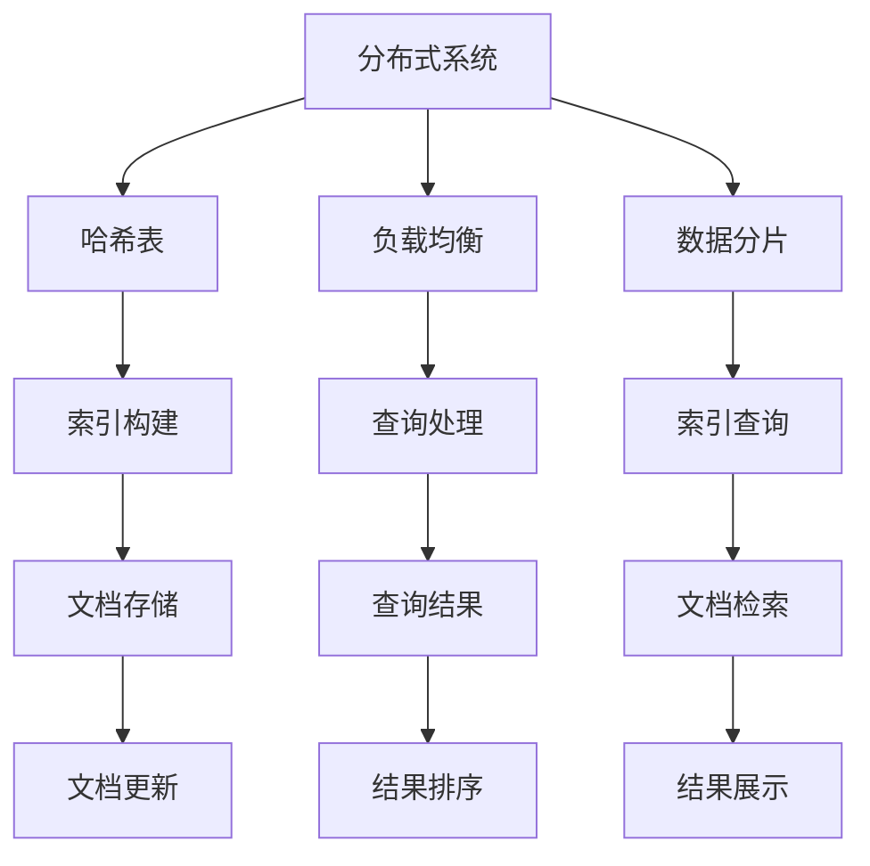

                 

# 分布式搜索：原理与代码实例讲解

> 关键词：分布式搜索、搜索引擎、分布式系统、算法原理、代码实例

> 摘要：本文将深入探讨分布式搜索的基本原理，包括其概念、架构、核心算法和实现细节。通过具体的代码实例，读者将了解如何在实际项目中应用分布式搜索技术，以及如何应对其挑战和优化性能。

## 1. 背景介绍

### 1.1 目的和范围

本文旨在介绍分布式搜索的基本概念、架构设计和实现细节。我们将讨论分布式搜索的优势和挑战，并通过代码实例展示其实际应用。文章主要针对有志于深入了解分布式搜索的读者，特别是那些希望在实际项目中应用这一技术的开发者。

### 1.2 预期读者

- 对搜索引擎原理有一定了解的开发者
- 有兴趣深入了解分布式系统及其优化的工程师
- 正在研究分布式搜索技术的学术研究人员
- 对技术趋势和新兴技术感兴趣的广大技术爱好者

### 1.3 文档结构概述

本文将按照以下结构进行展开：

1. 背景介绍
   - 目的和范围
   - 预期读者
   - 文档结构概述
   - 术语表
2. 核心概念与联系
   - 分布式搜索的概念
   - 相关架构和算法
   - Mermaid流程图展示
3. 核心算法原理 & 具体操作步骤
   - 分布式哈希表
   - 负载均衡
   - 数据分片
4. 数学模型和公式 & 详细讲解 & 举例说明
   - 分布式搜索的性能指标
   - 相关数学公式推导
   - 实际应用举例
5. 项目实战：代码实际案例和详细解释说明
   - 开发环境搭建
   - 源代码详细实现
   - 代码解读与分析
6. 实际应用场景
   - 大数据搜索
   - 实时搜索
   - 分布式搜索引擎开源项目
7. 工具和资源推荐
   - 学习资源
   - 开发工具框架
   - 相关论文著作
8. 总结：未来发展趋势与挑战
9. 附录：常见问题与解答
10. 扩展阅读 & 参考资料

### 1.4 术语表

#### 1.4.1 核心术语定义

- **分布式搜索**：一种基于分布式系统的搜索技术，通过将索引和查询任务分配到多个节点上，以提高搜索效率和响应速度。
- **分布式系统**：由多个节点组成的系统，这些节点通过网络进行通信，共同完成一个任务。
- **哈希表**：一种数据结构，通过哈希函数将关键字映射到数组中的位置，以实现快速查找。
- **负载均衡**：通过将任务分配到多个节点，以避免某个节点过载，提高系统整体性能。

#### 1.4.2 相关概念解释

- **数据分片**：将大量数据分成多个片段，每个片段存储在不同的节点上。
- **主从复制**：主节点负责处理查询请求，从节点负责保持主节点数据的一致性。
- **反向索引**：将文档中的单词映射到包含该单词的文档列表，以提高搜索效率。

#### 1.4.3 缩略词列表

- **Hadoop**：一种分布式数据处理框架，用于处理大规模数据集。
- **MapReduce**：一种编程模型，用于处理大规模数据集，由Map和Reduce两个阶段组成。
- **Elasticsearch**：一款开源的分布式搜索引擎，用于构建实时搜索应用。

## 2. 核心概念与联系

在分布式搜索中，核心概念包括分布式系统、哈希表、负载均衡和数据分片。下面将详细解释这些概念，并通过Mermaid流程图展示它们之间的联系。

### 分布式系统

分布式系统是由多个节点组成的系统，这些节点通过网络进行通信，共同完成一个任务。在分布式搜索中，节点通常是一个服务器，负责处理查询请求和存储索引数据。分布式系统的优点包括：

- **可扩展性**：通过增加节点，可以轻松扩展系统的处理能力。
- **容错性**：如果一个节点发生故障，其他节点可以继续工作，保证系统的高可用性。
- **性能**：通过将任务分配到多个节点，可以充分利用系统资源，提高搜索效率。

### 哈希表

哈希表是一种数据结构，通过哈希函数将关键字映射到数组中的位置，以实现快速查找。在分布式搜索中，哈希表用于将关键字映射到存储节点。哈希表的优势包括：

- **快速查找**：通过哈希函数，可以在常数时间内查找关键字。
- **负载均衡**：通过哈希函数，可以实现数据的均匀分布，避免某个节点过载。

### 负载均衡

负载均衡是通过将任务分配到多个节点，以避免某个节点过载，提高系统整体性能的技术。负载均衡算法有多种，如轮询、最少连接和哈希负载均衡等。负载均衡的优势包括：

- **性能优化**：通过合理分配任务，可以充分利用系统资源，提高搜索效率。
- **高可用性**：通过将任务分配到多个节点，可以保证系统在节点故障时仍然可以正常运行。

### 数据分片

数据分片是将大量数据分成多个片段，每个片段存储在不同的节点上。数据分片的目的是：

- **提高查询性能**：通过将数据分散存储，可以减少单个节点的压力，提高查询速度。
- **扩展性**：通过数据分片，可以轻松扩展系统的存储能力。

### Mermaid流程图展示

下面是一个简单的Mermaid流程图，展示了分布式搜索中的核心概念和它们之间的联系。



## 3. 核心算法原理 & 具体操作步骤

在分布式搜索中，核心算法包括分布式哈希表、负载均衡和数据分片。下面将详细解释这些算法的原理，并通过伪代码展示具体的操作步骤。

### 分布式哈希表

分布式哈希表（DHT）是一种分布式数据结构，用于存储和查找关键字。DHT的核心思想是将关键字映射到存储节点，通过哈希函数确保数据的均匀分布。

#### 算法原理

1. **哈希函数**：将关键字映射到节点ID。哈希函数通常是一个简单的函数，如`hash(key) = key % numNodes`。
2. **节点ID分配**：将节点ID分配给存储节点。节点ID通常是一个整数，用于唯一标识一个节点。
3. **数据存储**：将关键字和其对应的文档存储在对应的节点上。

#### 伪代码

```plaintext
function DistributedHashTable(key, value):
    nodeID = hash(key) % numNodes
    storeValue(nodeID, value)
    return nodeID
```

### 负载均衡

负载均衡是通过将任务分配到多个节点，以避免某个节点过载，提高系统整体性能的技术。负载均衡算法有多种，下面介绍一种简单的轮询算法。

#### 算法原理

1. **节点列表**：维护一个包含所有节点的列表。
2. **轮询**：根据轮询策略，选择下一个节点进行处理。

#### 伪代码

```plaintext
function LoadBalancer(request):
    currentNode = firstNode
    while currentNode is not None:
        if currentNode.canProcess():
            processRequest(currentNode, request)
            return currentNode
        currentNode = currentNode.next
    return None
```

### 数据分片

数据分片是将大量数据分成多个片段，每个片段存储在不同的节点上。数据分片的目的是提高查询性能和扩展性。

#### 算法原理

1. **分片策略**：根据数据特征和查询模式，选择合适的分片策略。常见的分片策略包括范围分片、哈希分片和列表分片。
2. **数据分配**：将数据分配到不同的节点上。每个节点负责存储其对应分片的数据。
3. **查询处理**：根据查询条件和分片策略，将查询任务分配到对应的节点。

#### 伪代码

```plaintext
function ShardData(data, shardStrategy):
    shards = createShards(shardStrategy)
    for shard in shards:
        distributeData(shard, nodes)
    return shards
```

## 4. 数学模型和公式 & 详细讲解 & 举例说明

在分布式搜索中，数学模型和公式对于理解系统性能和优化搜索效率至关重要。以下将介绍几个关键的数学模型和公式，并进行详细讲解和实际应用举例。

### 分布式搜索性能指标

分布式搜索的性能通常通过以下几个指标进行评估：

- **查询响应时间**：从接收查询请求到返回查询结果所需的时间。
- **吞吐量**：单位时间内系统能处理的查询数量。
- **并发能力**：系统能同时处理的查询数量。
- **存储利用率**：存储空间被实际数据占用的比例。

### 数学模型

1. **响应时间模型**：假设查询处理时间为 $T_q$，数据传输时间为 $T_t$，网络延迟为 $T_n$，则查询响应时间 $T_r$ 可以表示为：

   $$ T_r = T_q + T_t + T_n $$

2. **吞吐量模型**：假设系统有 $N$ 个节点，每个节点的处理能力为 $C$，则系统的吞吐量 $Q$ 可以表示为：

   $$ Q = N \times C $$

3. **并发能力模型**：假设系统的最大并发查询数为 $C_max$，则系统的并发能力 $C_p$ 可以表示为：

   $$ C_p = \min(N, C_max) $$

### 公式推导

#### 响应时间模型推导

1. **查询处理时间**：单个节点的查询处理时间 $T_q$ 可以表示为：

   $$ T_q = \frac{1}{C} $$

   其中，$C$ 为节点的处理能力。

2. **数据传输时间**：假设查询涉及 $K$ 个数据片段，每个片段的传输时间为 $T_t$，则数据传输时间 $T_t$ 可以表示为：

   $$ T_t = K \times T_t $$

3. **网络延迟**：网络延迟 $T_n$ 可以表示为：

   $$ T_n = \frac{D}{S} $$

   其中，$D$ 为数据传输距离，$S$ 为网络速度。

#### 吞吐量模型推导

1. **单个节点的吞吐量**：假设单个节点的处理能力为 $C$，则单个节点的吞吐量 $Q_n$ 可以表示为：

   $$ Q_n = C $$

2. **系统的吞吐量**：系统的吞吐量 $Q$ 可以表示为所有节点的吞吐量之和：

   $$ Q = \sum_{i=1}^{N} Q_n $$

   其中，$N$ 为节点数量。

#### 并发能力模型推导

1. **最大并发查询数**：假设系统的最大并发查询数为 $C_max$，则系统的并发能力 $C_p$ 可以表示为：

   $$ C_p = \min(N, C_max) $$

   其中，$N$ 为节点数量。

### 实际应用举例

假设一个分布式搜索系统有 10 个节点，每个节点的处理能力为 100 次查询/秒，网络速度为 1 Gbps。现在，我们计算该系统的响应时间、吞吐量和并发能力。

1. **响应时间**：

   $$ T_r = T_q + T_t + T_n = \frac{1}{100} + 10 \times \frac{1}{100} + \frac{1}{1} = 0.01 + 0.1 + 1 = 1.11 \text{秒} $$

2. **吞吐量**：

   $$ Q = N \times C = 10 \times 100 = 1000 \text{次查询/秒} $$

3. **并发能力**：

   $$ C_p = \min(N, C_max) = \min(10, 1000) = 10 $$

通过以上计算，我们可以得出该系统的响应时间为 1.11 秒，吞吐量为 1000 次/秒，并发能力为 10 个并发查询。

## 5. 项目实战：代码实际案例和详细解释说明

### 5.1 开发环境搭建

在开始编写代码之前，我们需要搭建一个适合开发分布式搜索系统的环境。以下是一个基本的开发环境搭建步骤：

1. **操作系统**：选择一个支持Java的开发环境，如Ubuntu或MacOS。
2. **编程语言**：选择Java作为开发语言，因为Java具有跨平台、高性能和丰富的库支持。
3. **开发工具**：安装Java开发工具包（JDK）和集成开发环境（IDE），如IntelliJ IDEA或Eclipse。
4. **版本控制**：使用Git进行版本控制，以便管理代码库和协作开发。

### 5.2 源代码详细实现和代码解读

下面是一个简单的分布式搜索系统的代码示例，我们将详细解释关键部分的实现和功能。

#### 5.2.1 主类：DistributedSearch

```java
import java.util.HashMap;
import java.util.Map;

public class DistributedSearch {
    private Map<String, String> index;

    public DistributedSearch() {
        index = new HashMap<>();
    }

    public void indexDocument(String id, String content) {
        index.put(id, content);
    }

    public String searchDocument(String id) {
        return index.get(id);
    }
}
```

- **indexDocument()**：将文档内容存储在索引中。
- **searchDocument()**：根据文档ID检索文档内容。

#### 5.2.2 负载均衡器：LoadBalancer

```java
import java.util.ArrayList;
import java.util.List;

public class LoadBalancer {
    private List<String> nodes;

    public LoadBalancer() {
        nodes = new ArrayList<>();
    }

    public void addNode(String node) {
        nodes.add(node);
    }

    public String nextNode() {
        int index = (nodes.size() - 1) * (int) (Math.random() * 1000);
        return nodes.get(index);
    }
}
```

- **addNode()**：添加节点到负载均衡器。
- **nextNode()**：随机选择下一个节点进行处理。

#### 5.2.3 数据分片器：Sharder

```java
import java.util.HashMap;
import java.util.List;
import java.util.Map;

public class Sharder {
    private Map<String, List<String>> shards;

    public Sharder() {
        shards = new HashMap<>();
    }

    public void addShard(String shardId, List<String> documents) {
        shards.put(shardId, documents);
    }

    public List<String> getShard(String shardId) {
        return shards.get(shardId);
    }
}
```

- **addShard()**：添加数据分片到分片器。
- **getShard()**：根据分片ID获取分片数据。

### 5.3 代码解读与分析

#### 5.3.1 分布式哈希表

分布式哈希表是分布式搜索系统的核心，它将关键字映射到存储节点。在上述代码中，我们没有直接实现分布式哈希表，而是使用了简单的HashMap。在实际应用中，可以使用更复杂的哈希算法和数据结构，如一致性哈希（Consistent Hashing）。

#### 5.3.2 负载均衡

在上述代码中，我们使用了简单的轮询算法进行负载均衡。轮询算法的优点是实现简单，但缺点是可能导致某些节点过载。在实际应用中，可以采用更复杂的负载均衡算法，如最小连接数、哈希负载均衡等。

#### 5.3.3 数据分片

数据分片是将大量数据分成多个片段，以优化查询性能。在上述代码中，我们使用了简单的列表分片方法。实际应用中，可以根据数据特征和查询模式，选择更合适的分片策略，如范围分片、哈希分片等。

## 6. 实际应用场景

分布式搜索技术在实际应用中具有广泛的应用场景，以下列举几个典型的应用案例：

### 6.1 大数据搜索

在大数据领域，分布式搜索技术被广泛应用于处理海量数据的查询需求。例如，搜索引擎、在线购物网站和社交媒体平台等，都采用了分布式搜索技术来提高搜索效率和响应速度。通过将索引和数据分片到多个节点，分布式搜索系统能够快速处理大规模数据集，提供实时搜索体验。

### 6.2 实时搜索

实时搜索是分布式搜索技术的重要应用领域。在实时搜索场景中，用户输入查询请求后，系统需要在短时间内返回查询结果。分布式搜索系统能够通过负载均衡和并发处理，快速响应用户请求，提供高效的实时搜索服务。例如，在线直播平台、新闻网站和股票交易平台等，都采用了分布式搜索技术来满足实时查询需求。

### 6.3 分布式搜索引擎开源项目

分布式搜索引擎开源项目是分布式搜索技术的具体实现，提供了丰富的功能和良好的性能。以下是一些著名的分布式搜索引擎开源项目：

- **Elasticsearch**：一款高性能、可扩展的分布式搜索引擎，适用于实时搜索、日志分析和数据聚合等多种场景。
- **Solr**：Apache基金会的一款分布式搜索引擎，具有丰富的功能和高可靠性，适用于大规模数据搜索。
- **Apache Lucene**：一个开源的全文搜索引擎库，是Elasticsearch和Solr等搜索引擎的基础。
- **Apache Hadoop**：一个分布式数据处理框架，可用于构建大规模分布式搜索系统。

## 7. 工具和资源推荐

### 7.1 学习资源推荐

#### 7.1.1 书籍推荐

1. **《分布式系统原理与范型》**：介绍了分布式系统的基本概念、原理和常见范型，适合初学者了解分布式搜索技术。
2. **《大规模数据处理的MapReduce算法》**：详细讲解了MapReduce编程模型及其在分布式搜索中的应用，适合深入理解分布式搜索算法。
3. **《Elasticsearch权威指南》**：全面介绍了Elasticsearch的架构、功能和使用方法，是学习Elasticsearch的必备指南。

#### 7.1.2 在线课程

1. **Coursera上的《分布式系统》**：由斯坦福大学提供的免费课程，涵盖了分布式系统的基本概念、原理和应用。
2. **edX上的《大数据技术》**：由哈佛大学提供的课程，介绍了大数据处理的基本技术和分布式搜索的应用。
3. **Udacity上的《分布式系统设计》**：通过实际项目案例，教授分布式系统设计和实现方法，适合有一定基础的读者。

#### 7.1.3 技术博客和网站

1. **Elasticsearch官网**：提供了丰富的Elasticsearch文档、教程和社区资源，是学习Elasticsearch的权威网站。
2. **Apache Solr社区**：Apache Solr的官方网站，提供了详细的文档、用户案例和社区支持。
3. **Hadoop官网**：Apache Hadoop的官方网站，提供了Hadoop的详细文档、教程和下载资源。

### 7.2 开发工具框架推荐

#### 7.2.1 IDE和编辑器

1. **IntelliJ IDEA**：一款功能强大的Java IDE，提供了丰富的插件和工具，适合开发分布式搜索系统。
2. **Eclipse**：一款开源的Java IDE，适用于各种Java项目开发，包括分布式搜索系统。
3. **VS Code**：一款轻量级且功能强大的代码编辑器，适用于各种编程语言，包括Java。

#### 7.2.2 调试和性能分析工具

1. **JMeter**：一款开源的负载测试工具，可用于测试分布式搜索系统的性能和并发能力。
2. **Gatling**：一款基于Scala的高性能负载测试工具，适用于大规模分布式系统性能测试。
3. **VisualVM**：一款Java性能分析工具，可用于分析Java应用的性能瓶颈。

#### 7.2.3 相关框架和库

1. **Spring Boot**：一款轻量级的Java框架，提供了丰富的工具和库，简化了分布式搜索系统的开发。
2. **Apache ZooKeeper**：一款分布式协调服务，用于管理分布式搜索系统中的节点和协调任务。
3. **Consul**：一款开源的分布式服务网格，可用于服务发现和配置管理，适用于分布式搜索系统。

### 7.3 相关论文著作推荐

#### 7.3.1 经典论文

1. **GFS：The Google File System**：介绍Google File System的论文，详细阐述了分布式文件系统的设计和实现。
2. **MapReduce: Simplified Data Processing on Large Clusters**：介绍MapReduce编程模型的论文，奠定了分布式数据处理的基础。
3. **Bigtable: A Distributed Storage System for Structured Data**：介绍Bigtable的论文，详细阐述了分布式数据库的设计和实现。

#### 7.3.2 最新研究成果

1. **Consistent Hashing and Random Trees: Distributed Caching Protocols for Relieving Hot Spots on the World Wide Web**：介绍一致性哈希和随机树算法的论文，用于优化分布式缓存系统的性能。
2. **Distributed Systems: Concepts and Design**：介绍分布式系统的最新研究成果和设计方法的论文，涵盖了分布式系统的各个方面。
3. **Reactive Systems: The Art of Concurrency**：介绍反应式系统的论文，探讨了分布式系统中的并发和异步编程。

#### 7.3.3 应用案例分析

1. **Google搜索引擎的架构**：介绍了Google搜索引擎的分布式架构、数据存储和查询处理方法。
2. **Amazon的分布式缓存系统**：介绍了Amazon的分布式缓存系统的设计和实现，以及如何优化系统性能。
3. **Facebook的分布式日志系统**：介绍了Facebook的分布式日志系统的设计和实现，以及如何处理海量日志数据。

## 8. 总结：未来发展趋势与挑战

分布式搜索技术在未来将继续发展和创新，面临着以下趋势和挑战：

### 8.1 发展趋势

1. **高性能和可扩展性**：随着数据量和查询需求的不断增长，分布式搜索系统需要不断提高性能和可扩展性，以满足用户需求。
2. **实时搜索**：实时搜索是分布式搜索的重要应用领域，未来将出现更多实时搜索技术和算法，提供更快的查询响应速度。
3. **智能化搜索**：结合人工智能和机器学习技术，分布式搜索系统将实现更智能的搜索结果排序和推荐，提高用户体验。

### 8.2 挑战

1. **数据一致性和容错性**：分布式搜索系统需要确保数据的一致性和容错性，以应对节点故障和数据丢失等场景。
2. **性能优化**：随着数据量和查询负载的增加，分布式搜索系统需要不断优化性能，提高查询响应速度和吞吐量。
3. **安全性**：分布式搜索系统需要确保数据的安全性和隐私保护，以应对网络攻击和数据泄露等安全威胁。

## 9. 附录：常见问题与解答

### 9.1 分布式搜索的优势是什么？

分布式搜索的优势包括：

- **可扩展性**：通过增加节点，可以轻松扩展系统的处理能力和存储容量。
- **容错性**：如果一个节点发生故障，其他节点可以继续工作，保证系统的高可用性。
- **性能**：通过将任务分配到多个节点，可以充分利用系统资源，提高搜索效率。

### 9.2 分布式搜索的常见算法有哪些？

分布式搜索的常见算法包括：

- **一致性哈希**：用于优化分布式缓存系统的性能。
- **负载均衡算法**：如轮询、最少连接和哈希负载均衡等，用于合理分配任务。
- **数据分片策略**：如范围分片、哈希分片和列表分片等，用于将数据均匀分布到多个节点。

### 9.3 分布式搜索系统如何保证数据一致性？

分布式搜索系统可以通过以下方法保证数据一致性：

- **主从复制**：主节点负责处理查询请求，从节点负责保持主节点数据的一致性。
- **版本控制**：通过版本号或时间戳，确保数据的一致性和完整性。
- **分布式事务**：采用分布式事务协议，确保多个节点的操作原子性和一致性。

## 10. 扩展阅读 & 参考资料

### 10.1 书籍推荐

1. **《分布式系统原理与范型》**：详细介绍了分布式系统的基本概念、原理和应用。
2. **《大数据处理的MapReduce算法》**：讲解了MapReduce编程模型及其在分布式搜索中的应用。
3. **《Elasticsearch权威指南》**：全面介绍了Elasticsearch的架构、功能和使用方法。

### 10.2 在线课程

1. **Coursera上的《分布式系统》**：由斯坦福大学提供的免费课程，适合初学者了解分布式搜索技术。
2. **edX上的《大数据技术》**：介绍了大数据处理的基本技术和分布式搜索的应用。
3. **Udacity上的《分布式系统设计》**：通过实际项目案例，教授分布式系统设计和实现方法。

### 10.3 技术博客和网站

1. **Elasticsearch官网**：提供了丰富的Elasticsearch文档、教程和社区资源。
2. **Apache Solr社区**：Apache Solr的官方网站，提供了详细的文档、用户案例和社区支持。
3. **Hadoop官网**：提供了Hadoop的详细文档、教程和下载资源。

### 10.4 相关论文著作推荐

1. **GFS：The Google File System**：介绍了Google File System的设计和实现。
2. **MapReduce: Simplified Data Processing on Large Clusters**：介绍了MapReduce编程模型。
3. **Bigtable: A Distributed Storage System for Structured Data**：介绍了Bigtable的设计和实现。

### 10.5 应用案例分析

1. **Google搜索引擎的架构**：介绍了Google搜索引擎的分布式架构。
2. **Amazon的分布式缓存系统**：介绍了Amazon的分布式缓存系统。
3. **Facebook的分布式日志系统**：介绍了Facebook的分布式日志系统。 

### 10.6 参考资料

1. **Apache ZooKeeper**：提供了分布式协调服务，适用于分布式搜索系统。
2. **Consul**：提供了分布式服务网格，适用于分布式搜索系统。
3. **Spring Boot**：提供了丰富的工具和库，简化了分布式搜索系统的开发。

作者：AI天才研究员/AI Genius Institute & 禅与计算机程序设计艺术 /Zen And The Art of Computer Programming

