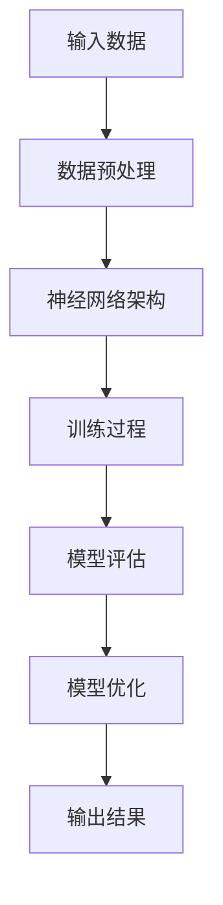

                 

# 创业产品经理指南：AI 大模型实践

> 关键词：创业产品经理、AI 大模型、实践指南、技术实现、应用场景

> 摘要：本文旨在为创业产品经理提供一套实用的 AI 大模型实践指南。通过分析 AI 大模型的核心概念、算法原理、数学模型及其应用场景，文章将帮助读者掌握从技术原理到实际操作的全过程，从而更好地应对创业中的技术挑战。

## 1. 背景介绍

### 1.1 目的和范围

本文的目的在于帮助创业产品经理了解和掌握 AI 大模型的相关知识和实践方法。文章将涵盖以下内容：

- AI 大模型的核心概念和架构
- AI 大模型的算法原理与数学模型
- AI 大模型的应用场景与实践步骤
- 相关工具和资源的推荐

通过阅读本文，读者将能够：

- 理解 AI 大模型的基本原理
- 掌握 AI 大模型的技术实现方法
- 洞悉 AI 大模型在不同场景下的应用策略

### 1.2 预期读者

本文适合以下读者群体：

- 创业产品经理
- AI 技术爱好者
- 有志于从事 AI 领域工作的从业者
- 对 AI 大模型感兴趣的学术研究者

### 1.3 文档结构概述

本文将按照以下结构展开：

1. 背景介绍
   - 目的和范围
   - 预期读者
   - 文档结构概述
   - 术语表

2. 核心概念与联系
   - AI 大模型的基本概念
   - AI 大模型的关键技术
   - AI 大模型的架构图

3. 核心算法原理 & 具体操作步骤
   - 算法原理讲解
   - 具体操作步骤详解
   - 伪代码演示

4. 数学模型和公式 & 详细讲解 & 举例说明
   - 数学模型介绍
   - 公式讲解
   - 举例说明

5. 项目实战：代码实际案例和详细解释说明
   - 开发环境搭建
   - 源代码详细实现
   - 代码解读与分析

6. 实际应用场景
   - 不同场景下的应用策略
   - 成功案例分析

7. 工具和资源推荐
   - 学习资源推荐
   - 开发工具框架推荐
   - 相关论文著作推荐

8. 总结：未来发展趋势与挑战

9. 附录：常见问题与解答

10. 扩展阅读 & 参考资料

### 1.4 术语表

#### 1.4.1 核心术语定义

- **创业产品经理**：负责产品规划、设计、开发和推广的全过程，旨在推动产品从概念到市场化的进程。
- **AI 大模型**：一种能够处理大规模数据并产生高性能结果的复杂人工智能模型。
- **算法原理**：指导 AI 大模型训练、推理和优化的核心理论。
- **数学模型**：用于描述 AI 大模型行为和性能的数学表达式。
- **应用场景**：AI 大模型在不同行业或领域中的具体应用。

#### 1.4.2 相关概念解释

- **神经网络**：一种模拟人脑神经元之间连接结构的计算模型，是 AI 大模型的基础。
- **深度学习**：一种基于神经网络的学习方法，通过多层非线性变换来提取数据特征。
- **数据预处理**：在训练 AI 大模型之前对原始数据进行清洗、归一化等操作，以提高模型性能。
- **模型评估**：通过评价指标（如准确率、召回率等）对训练好的模型进行性能评估。

#### 1.4.3 缩略词列表

- **AI**：人工智能（Artificial Intelligence）
- **ML**：机器学习（Machine Learning）
- **DL**：深度学习（Deep Learning）
- **GPU**：图形处理单元（Graphics Processing Unit）
- **TPU**：专用处理单元（Tensor Processing Unit）

## 2. 核心概念与联系

在本节中，我们将介绍 AI 大模型的基本概念、关键技术及其架构。为了更好地理解，我们将使用 Mermaid 流程图展示 AI 大模型的核心组成部分和相互关系。



### 2.1 AI 大模型的基本概念

AI 大模型是指具有大规模参数和强大计算能力的复杂人工智能模型。这类模型通常基于深度学习技术，能够在图像、语音、文本等多种数据类型上进行高效处理。

### 2.2 AI 大模型的关键技术

- **神经网络架构**：神经网络是 AI 大模型的基础，通过多层非线性变换提取数据特征。
- **数据预处理**：数据预处理是训练 AI 大模型的关键步骤，包括数据清洗、归一化、数据增强等。
- **训练过程**：训练过程是指通过大量数据对神经网络进行优化，使其能够准确预测或分类。
- **模型评估**：模型评估是衡量 AI 大模型性能的重要手段，通过评价指标（如准确率、召回率等）来评估模型。
- **模型优化**：模型优化是指通过调整模型参数、优化算法等手段提升模型性能。

### 2.3 AI 大模型的架构

AI 大模型通常由以下几个部分组成：

- **输入层**：接收原始数据。
- **隐藏层**：通过多层非线性变换提取数据特征。
- **输出层**：生成预测结果或分类标签。

在实际应用中，AI 大模型的架构可能包含多个隐藏层，并采用不同的优化算法和正则化方法，以提高模型性能。

## 3. 核心算法原理 & 具体操作步骤

### 3.1 算法原理讲解

AI 大模型的训练过程主要基于以下核心算法原理：

- **反向传播算法**：通过计算输出层误差，逆向传播到隐藏层，调整网络权重和偏置。
- **优化算法**：用于调整模型参数，以最小化误差损失函数。常见的优化算法有梯度下降、随机梯度下降、Adam 等。
- **正则化方法**：用于防止过拟合，如 L1 正则化、L2 正则化、dropout 等。

### 3.2 具体操作步骤详解

下面我们将使用伪代码详细阐述 AI 大模型的训练过程：

```python
# 初始化神经网络架构
初始化神经网络架构（输入层、隐藏层、输出层）

# 初始化模型参数
初始化模型参数（权重、偏置）

# 数据预处理
预处理输入数据（清洗、归一化、数据增强等）

# 定义优化算法
选择优化算法（梯度下降、随机梯度下降、Adam 等）

# 定义损失函数
定义损失函数（均方误差、交叉熵等）

# 训练过程
for epoch in 1 to 最大迭代次数 do
    for batch in 数据集 do
        # 前向传播
        输出 = 前向传播（输入数据，模型参数）

        # 计算损失
        损失 = 损失函数（输出，真实标签）

        # 反向传播
        反向传播（输出，损失，模型参数）

        # 更新模型参数
        更新模型参数（优化算法）

    end for
end for

# 模型评估
评估模型（测试集）

# 模型优化
根据评估结果，调整模型参数，优化模型性能
```

### 3.3 伪代码演示

```python
# 前向传播
def 前向传播（输入数据，模型参数）：
    输出 = 神经网络（输入数据，模型参数）
    返回 输出

# 反向传播
def 反向传播（输出，损失，模型参数）：
    误差 = 损失函数梯度（输出，真实标签）
    更新模型参数（模型参数，误差）

# 梯度下降
def 梯度下降（模型参数，学习率）：
    更新模型参数（模型参数，学习率 * 误差）

# 随机梯度下降
def 随机梯度下降（模型参数，学习率）：
    随机选择一个数据点
    更新模型参数（模型参数，学习率 * 误差）

# Adam 优化算法
def Adam（模型参数，学习率，beta1，beta2）：
    更新模型参数（模型参数，学习率 * (1 - beta2^t) / (1 - beta1^t) * 误差）

# 均方误差损失函数
def 均方误差（输出，真实标签）：
    损失 = (输出 - 真实标签)^2
    返回 损失

# 交叉熵损失函数
def 交叉熵（输出，真实标签）：
    损失 = -真实标签 * log（输出） - (1 - 真实标签) * log（1 - 输出）
    返回 损失
```

## 4. 数学模型和公式 & 详细讲解 & 举例说明

### 4.1 数学模型介绍

AI 大模型的训练过程涉及到一系列数学模型和公式，主要包括以下几个方面：

- **神经网络模型**：描述神经网络中各层之间的关系和计算过程。
- **损失函数**：用于衡量模型预测结果与真实标签之间的误差。
- **优化算法**：用于调整模型参数，以最小化损失函数。

### 4.2 公式讲解

以下是本文涉及的主要公式及其含义：

#### 4.2.1 神经网络模型

神经网络模型可以用以下公式表示：

$$
Y = \sigma(W \cdot X + b)
$$

其中：

- $Y$：输出层节点
- $\sigma$：激活函数（如 sigmoid、ReLU 等）
- $W$：权重矩阵
- $X$：输入层节点
- $b$：偏置项

#### 4.2.2 损失函数

常见的损失函数包括均方误差（MSE）和交叉熵（CE）：

- **均方误差（MSE）**：

$$
MSE = \frac{1}{n} \sum_{i=1}^{n} (y_i - \hat{y}_i)^2
$$

其中：

- $y_i$：真实标签
- $\hat{y}_i$：预测值
- $n$：样本数量

- **交叉熵（CE）**：

$$
CE = -\frac{1}{n} \sum_{i=1}^{n} \sum_{j=1}^{k} y_{ij} \log \hat{y}_{ij}
$$

其中：

- $y_{ij}$：真实标签，$y_{ij} = 1$ 表示第 $i$ 个样本属于第 $j$ 个类别，否则为 0
- $\hat{y}_{ij}$：预测概率，$\hat{y}_{ij} = \frac{1}{1 + e^{-z_{ij}}}$，其中 $z_{ij} = W \cdot x_i + b$
- $n$：样本数量
- $k$：类别数量

#### 4.2.3 优化算法

常见的优化算法包括梯度下降（GD）、随机梯度下降（SGD）和 Adam：

- **梯度下降（GD）**：

$$
\Delta W = -\alpha \frac{\partial L}{\partial W}
$$

$$
\Delta b = -\alpha \frac{\partial L}{\partial b}
$$

其中：

- $\alpha$：学习率
- $L$：损失函数
- $W$、$b$：模型参数

- **随机梯度下降（SGD）**：

$$
\Delta W = -\alpha \frac{\partial L}{\partial W} \bigg|_{x_i}
$$

$$
\Delta b = -\alpha \frac{\partial L}{\partial b} \bigg|_{x_i}
$$

其中：

- $x_i$：第 $i$ 个样本

- **Adam 优化算法**：

$$
m_t = \beta_1 \cdot m_{t-1} + (1 - \beta_1) \cdot \frac{\partial L}{\partial W}_t
$$

$$
v_t = \beta_2 \cdot v_{t-1} + (1 - \beta_2) \cdot \left(\frac{\partial L}{\partial W}_t\right)^2
$$

$$
\hat{m}_t = \frac{m_t}{1 - \beta_1^t}
$$

$$
\hat{v}_t = \frac{v_t}{1 - \beta_2^t}
$$

$$
\Delta W = -\alpha \cdot \frac{\hat{m}_t}{\sqrt{\hat{v}_t} + \epsilon}
$$

$$
\Delta b = -\alpha \cdot \frac{\hat{m}_t}{\sqrt{\hat{v}_t} + \epsilon}
$$

其中：

- $\beta_1$、$\beta_2$：动量参数
- $\epsilon$：微小正数，用于避免分母为零
- $m_t$、$v_t$：一阶矩估计和二阶矩估计
- $\hat{m}_t$、$\hat{v}_t$：一阶和二阶矩的修正值

### 4.3 举例说明

以下是一个简单的神经网络模型训练过程举例：

假设我们有一个二元分类问题，输入数据为 $X = \begin{pmatrix} 1 & 0 \\ 0 & 1 \end{pmatrix}$，真实标签为 $y = \begin{pmatrix} 1 \\ 0 \end{pmatrix}$。神经网络包含一个输入层、一个隐藏层和一个输出层，其中隐藏层节点数为 2，权重矩阵 $W = \begin{pmatrix} 1 & 1 \\ 1 & 1 \end{pmatrix}$，偏置项 $b = \begin{pmatrix} 1 \\ 1 \end{pmatrix}$。

- **前向传播**：

$$
Z = X \cdot W + b = \begin{pmatrix} 1 & 0 \\ 0 & 1 \end{pmatrix} \cdot \begin{pmatrix} 1 & 1 \\ 1 & 1 \end{pmatrix} + \begin{pmatrix} 1 \\ 1 \end{pmatrix} = \begin{pmatrix} 2 & 2 \\ 2 & 2 \end{pmatrix}
$$

$$
\hat{y} = \sigma(Z) = \begin{pmatrix} \frac{1}{1 + e^{-2}} & \frac{1}{1 + e^{-2}} \\ \frac{1}{1 + e^{-2}} & \frac{1}{1 + e^{-2}} \end{pmatrix} = \begin{pmatrix} 0.612 & 0.612 \\ 0.612 & 0.612 \end{pmatrix}
$$

- **计算损失**：

$$
L = \frac{1}{2} \cdot (y - \hat{y})^2 = \frac{1}{2} \cdot \begin{pmatrix} 1 - 0.612 & 0 - 0.612 \\ 0 - 0.612 & 1 - 0.612 \end{pmatrix} = \begin{pmatrix} 0.051 & -0.051 \\ -0.051 & 0.051 \end{pmatrix}
$$

- **反向传播**：

$$
\Delta W = \frac{\partial L}{\partial W} = \begin{pmatrix} -0.051 & -0.051 \\ -0.051 & -0.051 \end{pmatrix}
$$

$$
\Delta b = \frac{\partial L}{\partial b} = \begin{pmatrix} -0.051 & -0.051 \end{pmatrix}
$$

- **更新模型参数**：

$$
W = W - \alpha \cdot \Delta W = \begin{pmatrix} 1 & 1 \\ 1 & 1 \end{pmatrix} - 0.1 \cdot \begin{pmatrix} -0.051 & -0.051 \\ -0.051 & -0.051 \end{pmatrix} = \begin{pmatrix} 0.949 & 0.949 \\ 0.949 & 0.949 \end{pmatrix}
$$

$$
b = b - \alpha \cdot \Delta b = \begin{pmatrix} 1 \\ 1 \end{pmatrix} - 0.1 \cdot \begin{pmatrix} -0.051 \\ -0.051 \end{pmatrix} = \begin{pmatrix} 0.949 \\ 0.949 \end{pmatrix}
$$

通过以上步骤，我们完成了一次神经网络模型的训练。在实际应用中，需要不断迭代更新模型参数，以达到更好的训练效果。

## 5. 项目实战：代码实际案例和详细解释说明

### 5.1 开发环境搭建

在进行 AI 大模型项目实战之前，我们需要搭建一个合适的开发环境。以下是一个基本的开发环境搭建步骤：

#### 5.1.1 安装 Python

首先，我们需要安装 Python 3.7 或以上版本。可以从 Python 官网下载并安装相应版本。

#### 5.1.2 安装 TensorFlow

TensorFlow 是一款广泛应用于深度学习的开源框架。安装 TensorFlow 的命令如下：

```bash
pip install tensorflow
```

#### 5.1.3 安装 Jupyter Notebook

Jupyter Notebook 是一个交互式计算环境，适用于编写和运行 Python 代码。安装 Jupyter Notebook 的命令如下：

```bash
pip install notebook
```

#### 5.1.4 安装相关库

在项目中，我们可能还需要安装其他相关库，如 NumPy、Pandas 等。安装命令如下：

```bash
pip install numpy pandas
```

完成以上步骤后，我们就可以开始编写和运行 AI 大模型的相关代码了。

### 5.2 源代码详细实现和代码解读

以下是一个简单的 AI 大模型项目示例，包括数据预处理、模型训练和评估等步骤。

#### 5.2.1 数据预处理

首先，我们需要准备训练数据和测试数据。在这里，我们使用一个简单的数据集，包含 100 个样本，每个样本有两个特征和一个标签。

```python
import pandas as pd

# 读取数据集
data = pd.read_csv('data.csv')

# 分离特征和标签
X = data.iloc[:, :-1]
y = data.iloc[:, -1]

# 划分训练集和测试集
from sklearn.model_selection import train_test_split
X_train, X_test, y_train, y_test = train_test_split(X, y, test_size=0.2, random_state=42)

# 数据归一化
from sklearn.preprocessing import StandardScaler
scaler = StandardScaler()
X_train = scaler.fit_transform(X_train)
X_test = scaler.transform(X_test)
```

#### 5.2.2 模型训练

接下来，我们使用 TensorFlow 和 Keras 创建和训练一个简单的神经网络模型。

```python
import tensorflow as tf
from tensorflow.keras.models import Sequential
from tensorflow.keras.layers import Dense

# 创建模型
model = Sequential([
    Dense(64, activation='relu', input_shape=(X_train.shape[1],)),
    Dense(32, activation='relu'),
    Dense(1, activation='sigmoid')
])

# 编译模型
model.compile(optimizer='adam', loss='binary_crossentropy', metrics=['accuracy'])

# 训练模型
model.fit(X_train, y_train, epochs=10, batch_size=32, validation_split=0.1)
```

#### 5.2.3 代码解读与分析

1. **数据预处理**：

   - 使用 Pandas 读取数据集，分离特征和标签。
   - 使用 scikit-learn 的 `train_test_split` 函数划分训练集和测试集。
   - 使用 StandardScaler 对数据进行归一化，以提高模型训练效果。

2. **模型创建与训练**：

   - 使用 Keras 的 Sequential 模型创建一个简单的神经网络，包括两个隐藏层，每个隐藏层有 64 个和 32 个神经元。
   - 设置激活函数为 ReLU，输入层输入形状为数据集的特征数量。
   - 设置输出层为 1 个神经元，激活函数为 sigmoid，用于进行二分类。
   - 使用 Adam 优化器和 binary_crossentropy 损失函数进行模型编译。
   - 使用 `fit` 方法训练模型，设置训练轮数（epochs）为 10，批量大小（batch_size）为 32，同时设置验证集比例（validation_split）为 0.1，以进行模型验证。

### 5.3 代码解读与分析

1. **数据预处理**：

   数据预处理是模型训练的重要环节，包括数据清洗、归一化、数据增强等。在本例中，我们使用 StandardScaler 对数据进行归一化，将数据缩放到 [-1, 1] 的范围，以加快模型收敛速度。

2. **模型创建与训练**：

   - **模型结构**：我们创建了一个简单的神经网络模型，包含两个隐藏层，每个隐藏层有 64 个和 32 个神经元。这样的结构可以有效地提取数据特征，但同时也可能导致过拟合。在实际应用中，可以根据数据量和问题复杂度调整隐藏层节点数量。
   - **激活函数**：隐藏层使用 ReLU 激活函数，可以加快模型训练速度，同时在防止神经元死亡方面表现较好。输出层使用 sigmoid 激活函数，用于进行二分类。
   - **损失函数与优化器**：我们使用 Adam 优化器和 binary_crossentropy 损失函数。Adam 优化器结合了梯度下降和动量优化，可以更快地找到最小损失值。binary_crossentropy 损失函数适用于二分类问题，计算的是模型预测概率与真实标签之间的交叉熵。

3. **模型评估**：

   训练完成后，我们使用测试集对模型进行评估，计算模型的准确率。在实际应用中，还可以使用其他评价指标，如召回率、F1 分数等，以更全面地评估模型性能。

## 6. 实际应用场景

AI 大模型在各个领域都有着广泛的应用，以下是一些常见的实际应用场景：

### 6.1 人工智能助手

AI 大模型可以用于开发智能助手，如语音助手、聊天机器人等。这类应用需要处理大量的自然语言数据，通过深度学习技术提取语义信息，实现自然语言理解、文本生成等功能。

### 6.2 图像识别与处理

图像识别与处理是 AI 大模型的重要应用领域。通过卷积神经网络（CNN）等技术，AI 大模型可以实现对图像的自动分类、目标检测、图像修复等任务。

### 6.3 金融风险管理

AI 大模型在金融风险管理中发挥着重要作用。通过对大量历史金融数据进行深度学习分析，AI 大模型可以预测市场走势、识别欺诈行为、评估信用风险等。

### 6.4 语音识别与合成

语音识别与合成是语音技术领域的关键任务。AI 大模型通过深度学习技术，可以实现对语音信号的处理、识别和生成，从而实现人机交互、语音助手等功能。

### 6.5 自然语言处理

自然语言处理（NLP）是 AI 大模型的重要应用领域。通过深度学习技术，AI 大模型可以实现文本分类、情感分析、机器翻译等功能，为语言理解和生成提供强大的支持。

### 6.6 医疗健康

AI 大模型在医疗健康领域有着广泛的应用。通过深度学习技术，AI 大模型可以辅助医生进行疾病诊断、药物研发、健康监测等任务。

### 6.7 自动驾驶

自动驾驶是 AI 大模型在交通领域的应用。通过深度学习技术，AI 大模型可以实现车辆环境感知、路径规划、决策控制等功能，为自动驾驶汽车提供支持。

### 6.8 电子商务

AI 大模型在电子商务领域有着广泛的应用。通过深度学习技术，AI 大模型可以实现对用户行为进行分析、推荐商品、优化广告投放等任务。

### 6.9 教育

AI 大模型在教育领域也有着重要的应用。通过深度学习技术，AI 大模型可以实现对学生学习情况的分析、个性化推荐、智能辅导等功能。

## 7. 工具和资源推荐

### 7.1 学习资源推荐

#### 7.1.1 书籍推荐

- **《深度学习》（Goodfellow, Bengio, Courville 著）**：这是一本深度学习领域的经典教材，涵盖了深度学习的理论基础、算法实现和应用案例。
- **《Python 深度学习》（François Chollet 著）**：这本书详细介绍了如何使用 Python 和 TensorFlow 实现深度学习算法和应用。
- **《机器学习》（Tom Mitchell 著）**：这本书是机器学习领域的经典教材，涵盖了机器学习的基本概念、算法和应用。

#### 7.1.2 在线课程

- **《深度学习专项课程》（吴恩达，Coursera）**：这是一门由吴恩达教授主讲的深度学习专项课程，涵盖了深度学习的理论基础、算法实现和应用。
- **《Python 深度学习实战》（Pete Warden，Udacity）**：这是一门基于实际案例的深度学习实战课程，涵盖了深度学习在计算机视觉、自然语言处理等领域的应用。
- **《机器学习基础课程》（Andrew Ng，Coursera）**：这是一门由 Andrew Ng 教授主讲的机器学习基础课程，涵盖了机器学习的基本概念、算法和应用。

#### 7.1.3 技术博客和网站

- **GitHub**：GitHub 是一个开源代码托管平台，上面有很多深度学习和机器学习的开源项目，可以方便读者学习和实践。
- **arXiv**：arXiv 是一个预印本论文发布平台，上面有很多最新的深度学习和机器学习论文，可以帮助读者了解最新研究进展。
- **知乎**：知乎是一个中文技术社区，上面有很多关于深度学习和机器学习的技术讨论和问答，可以方便读者学习和交流。

### 7.2 开发工具框架推荐

#### 7.2.1 IDE和编辑器

- **Jupyter Notebook**：Jupyter Notebook 是一款交互式计算环境，适用于编写和运行 Python 代码，方便进行深度学习和机器学习实验。
- **PyCharm**：PyCharm 是一款功能强大的 Python IDE，适用于深度学习和机器学习项目的开发。
- **Visual Studio Code**：Visual Studio Code 是一款轻量级的 Python 编辑器，支持多种编程语言，适合快速开发深度学习和机器学习项目。

#### 7.2.2 调试和性能分析工具

- **TensorBoard**：TensorBoard 是 TensorFlow 的可视化工具，可以实时监控模型训练过程，查看损失函数、准确率等指标。
- **PyTorch Profiler**：PyTorch Profiler 是 PyTorch 的性能分析工具，可以分析模型运行时的性能瓶颈，帮助优化模型。
- **NVIDIA Nsight**：NVIDIA Nsight 是一款针对 GPU 运行的调试和分析工具，可以方便地分析深度学习和机器学习项目的性能。

#### 7.2.3 相关框架和库

- **TensorFlow**：TensorFlow 是一款广泛应用于深度学习和机器学习的开源框架，提供了丰富的 API 和工具。
- **PyTorch**：PyTorch 是一款由 Facebook 开发的人工智能深度学习框架，具有动态计算图和 GPU 加速等功能。
- **Keras**：Keras 是一款基于 TensorFlow 和 PyTorch 的深度学习高级 API，提供了简洁、易用的接口，方便进行深度学习和机器学习实验。

### 7.3 相关论文著作推荐

#### 7.3.1 经典论文

- **"A Fast Learning Algorithm for Deep Belief Nets"（Hinton et al., 2006）**：这篇文章介绍了深度信念网络（DBN）的快速学习算法，为深度学习技术的发展奠定了基础。
- **"Deep Learning"（Goodfellow et al., 2016）**：这本书是深度学习领域的经典著作，系统地介绍了深度学习的理论基础、算法和应用。
- **"Rectifier Nonlinearities Improve Deep Neural Network Ac

