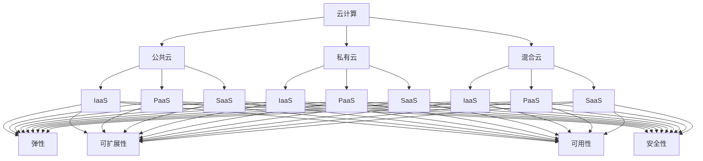

                 

# 创业公司的云服务选型策略

> **关键词：** 云服务选型、创业公司、云计算平台、成本效益、性能优化、安全性

> **摘要：** 本文旨在为创业公司提供云服务选型的策略。我们将分析各种云服务提供商，评估其成本、性能、可靠性和安全性，并提供实用的选型建议，帮助创业公司找到最适合自己的云服务解决方案。

## 1. 背景介绍

### 1.1 目的和范围

本文的目的是帮助创业公司在云计算领域做出明智的决策，以实现成本效益、性能优化和安全性。我们将探讨以下内容：

- 云计算平台的基本概念和特点
- 创业公司云服务选型的重要性
- 各大云服务提供商的比较
- 选型策略的制定与实施

### 1.2 预期读者

本文适合以下读者群体：

- 创业公司的创始人、CTO和技术团队
- 云计算从业者和爱好者
- 需要了解云服务选型策略的IT专业人士

### 1.3 文档结构概述

本文将分为以下几个部分：

- 第1部分：背景介绍，包括目的和范围、预期读者、文档结构概述、术语表
- 第2部分：核心概念与联系，介绍云计算的基本概念和架构
- 第3部分：核心算法原理 & 具体操作步骤，阐述云服务选型的关键因素
- 第4部分：数学模型和公式 & 详细讲解 & 举例说明，提供量化分析工具
- 第5部分：项目实战：代码实际案例和详细解释说明，展示选型策略的应用
- 第6部分：实际应用场景，讨论云服务在不同领域的应用
- 第7部分：工具和资源推荐，为读者提供学习、开发和实践的资源
- 第8部分：总结：未来发展趋势与挑战，展望云服务的发展前景
- 第9部分：附录：常见问题与解答，解答读者可能遇到的问题
- 第10部分：扩展阅读 & 参考资料，提供进一步学习和研究的资料

### 1.4 术语表

#### 1.4.1 核心术语定义

- 云计算（Cloud Computing）：一种通过网络提供计算资源、存储、应用程序和服务的技术，用户可以按需使用，无需管理基础架构。
- 公共云（Public Cloud）：由第三方提供商提供的云计算服务，可供多个组织或个人使用。
- 私有云（Private Cloud）：为特定组织或机构提供的云计算服务，通常位于内部网络中。
- 混合云（Hybrid Cloud）：结合公共云和私有云的优势，实现灵活的资源配置。
- IaaS（Infrastructure as a Service）：提供虚拟化的计算资源，如虚拟机、存储和网络。
- PaaS（Platform as a Service）：提供开发、运行和管理应用程序的平台。
- SaaS（Software as a Service）：提供应用程序的服务，用户可通过网络访问和使用。

#### 1.4.2 相关概念解释

- 弹性（Elasticity）：云服务能够根据需求自动扩展或缩小资源。
- 可扩展性（Scalability）：系统能够处理不断增加的工作负载。
- 可用性（Availability）：系统在预定时间内持续可用的程度。
- 安全性（Security）：保护数据、应用程序和资源免受未经授权的访问和攻击。

#### 1.4.3 缩略词列表

- IaaS：基础设施即服务
- PaaS：平台即服务
- SaaS：软件即服务
- AWS：亚马逊网络服务
- Azure：微软云
- GCP：谷歌云平台
- Kubernetes：容器编排平台

## 2. 核心概念与联系

在了解云服务选型策略之前，我们需要掌握一些核心概念和它们之间的联系。以下是一个简要的Mermaid流程图，展示了云计算的基本概念和架构。



### 2.1 云计算的基本概念

- **云计算**：云计算是一种通过网络提供计算资源、存储、应用程序和服务的技术。它允许用户按需使用资源，无需管理底层基础设施。

- **公共云**：公共云是由第三方提供商提供的云计算服务，可供多个组织或个人使用。它具有高度的可扩展性、弹性和成本效益。

- **私有云**：私有云是为特定组织或机构提供的云计算服务，通常位于内部网络中。它提供更高的安全性、可控性和定制化。

- **混合云**：混合云结合了公共云和私有云的优势，实现灵活的资源配置。它允许组织在需要时使用公共云资源，同时在敏感数据处理时使用私有云。

### 2.2 云服务模型

- **IaaS（基础设施即服务）**：提供虚拟化的计算资源，如虚拟机、存储和网络。用户可以自行配置和管理操作系统、应用程序和中间件。

- **PaaS（平台即服务）**：提供开发、运行和管理应用程序的平台。用户无需管理底层基础设施，但可以自定义应用程序。

- **SaaS（软件即服务）**：提供应用程序的服务，用户可通过网络访问和使用。用户无需管理硬件、软件和网络，只需使用即可。

### 2.3 云服务特性

- **弹性**：云服务能够根据需求自动扩展或缩小资源，确保系统在高峰时段有足够的资源。

- **可扩展性**：系统能够处理不断增加的工作负载，无需中断服务。

- **可用性**：系统在预定时间内持续可用的程度。高可用性意味着系统在发生故障时能够快速恢复。

- **安全性**：保护数据、应用程序和资源免受未经授权的访问和攻击。安全性是云服务提供商必须重视的方面。

## 3. 核心算法原理 & 具体操作步骤

在了解核心概念后，我们需要掌握云服务选型的核心算法原理。以下是一个简单的伪代码，用于解释如何评估和选择云服务提供商。

```python
# 云服务选型算法

def select_cloud_provider的要求（成本预算，性能需求，安全性要求，扩展性需求）:
    # 搜索并收集所有潜在的云服务提供商的信息
    providers = search_cloud_providers()

    # 对每个提供商进行评估
    for provider in providers:
        # 计算成本
        cost = calculate_cost(provider，成本预算)

        # 计算性能
        performance = calculate_performance(provider，性能需求)

        # 计算安全性
        security = calculate_security(provider，安全性需求)

        # 计算扩展性
        scalability = calculate Scalability（provider，扩展性需求）

        # 评估总得分
        score = calculate_score（cost，performance，security，scability）

        # 将提供商和得分添加到列表中
        provider_scores.append((provider，score))

    # 按得分排序提供商列表
    provider_scores.sort（key=lambda x: x[1]，reverse=True）

    # 返回最高得分的提供商
    return provider_scores[0][0]

# 计算成本
def calculate_cost（provider，budget）:
    total_cost = provider.calculate_cost()
    return total_cost/budget

# 计算性能
def calculate_performance（provider，performance_requirements）:
    provider_performance = provider.get_performance()
    score = performance_requirements/ provider_performance
    return score

# 计算安全性
def calculate_security（provider，security_requirements）:
    provider_security = provider.get_security()
    score = security_requirements/ provider_security
    return score

# 计算扩展性
def calculate Scalability（provider，scability_requirements）:
    provider_scalability = provider.get_Scalability()
    score = scability_requirements/ provider_scalability
    return score

# 评估总得分
def calculate_score（cost，performance，security，scalability）:
    total_score = cost + performance + security + scalability
    return total_score
```

### 3.1 算法原理

该算法基于以下原理：

- **成本计算**：根据成本预算计算每个提供商的成本，确保总成本在预算范围内。

- **性能计算**：根据性能需求计算每个提供商的性能，确保系统能够满足性能要求。

- **安全性计算**：根据安全性要求计算每个提供商的安全性，确保系统能够保护数据安全。

- **扩展性计算**：根据扩展性需求计算每个提供商的扩展性，确保系统能够处理不断增长的工作负载。

- **总得分计算**：将每个提供商的成本、性能、安全性和扩展性得分相加，得到总得分。总得分最高的提供商即为最佳选择。

### 3.2 具体操作步骤

1. 确定成本预算、性能需求、安全性和扩展性需求。
2. 搜索并收集所有潜在的云服务提供商的信息。
3. 对每个提供商进行评估，计算成本、性能、安全性和扩展性得分。
4. 按得分排序提供商列表。
5. 返回最高得分的提供商。

通过以上步骤，创业公司可以找到最适合自己的云服务提供商，实现成本效益、性能优化和安全性。

## 4. 数学模型和公式 & 详细讲解 & 举例说明

在云服务选型过程中，量化分析是非常重要的一环。以下是一个简单的数学模型，用于评估云服务提供商的综合得分。

### 4.1 数学模型

设 \( C \) 为成本，\( P \) 为性能，\( S \) 为安全性，\( E \) 为扩展性，\( B \) 为成本预算，\( R \) 为性能需求，\( A \) 为安全性要求，\( X \) 为扩展性需求。

则综合得分 \( T \) 可表示为：

\[ T = \frac{C}{B} + \frac{P}{R} + \frac{S}{A} + \frac{E}{X} \]

### 4.2 详细讲解

- **成本计算**：成本得分 \( C \) 用于衡量每个提供商的成本占预算的比例。成本越低，得分越高。

\[ C = \frac{\text{提供商成本}}{\text{成本预算}} \]

- **性能计算**：性能得分 \( P \) 用于衡量每个提供商的性能满足需求的比例。性能越高，得分越高。

\[ P = \frac{\text{提供商性能}}{\text{性能需求}} \]

- **安全性计算**：安全性得分 \( S \) 用于衡量每个提供商的安全性满足需求的程度。安全性越高，得分越高。

\[ S = \frac{\text{提供商安全性}}{\text{安全性需求}} \]

- **扩展性计算**：扩展性得分 \( E \) 用于衡量每个提供商的扩展性满足需求的程度。扩展性越高，得分越高。

\[ E = \frac{\text{提供商扩展性}}{\text{扩展性需求}} \]

- **综合得分**：综合得分 \( T \) 是成本、性能、安全性和扩展性得分的加权平均值。权重可根据具体需求进行调整。

\[ T = \frac{C}{B} + \frac{P}{R} + \frac{S}{A} + \frac{E}{X} \]

### 4.3 举例说明

假设创业公司有如下需求：

- 成本预算：100万元
- 性能需求：1000 QPS（每秒查询率）
- 安全性需求：达到ISO 27001标准
- 扩展性需求：支持1000个并发用户

现有三家云服务提供商，相关信息如下：

| 提供商 | 成本（万元） | 性能（QPS） | 安全性 | 扩展性 |
| :---: | :---: | :---: | :---: | :---: |
| AWS | 80 | 1500 | 达到ISO 27001标准 | 支持2000个并发用户 |
| Azure | 90 | 1200 | 达到ISO 27001标准 | 支持1500个并发用户 |
| GCP | 100 | 1000 | 达到ISO 27001标准 | 支持1000个并发用户 |

根据上述数学模型，计算三家提供商的综合得分：

1. AWS：

\[ C = \frac{80}{100} = 0.8 \]
\[ P = \frac{1500}{1000} = 1.5 \]
\[ S = \frac{\text{达到ISO 27001标准}}{\text{达到ISO 27001标准}} = 1 \]
\[ E = \frac{\text{支持2000个并发用户}}{1000} = 2 \]
\[ T = 0.8 + 1.5 + 1 + 2 = 5.3 \]

2. Azure：

\[ C = \frac{90}{100} = 0.9 \]
\[ P = \frac{1200}{1000} = 1.2 \]
\[ S = \frac{\text{达到ISO 27001标准}}{\text{达到ISO 27001标准}} = 1 \]
\[ E = \frac{\text{支持1500个并发用户}}{1000} = 1.5 \]
\[ T = 0.9 + 1.2 + 1 + 1.5 = 4.6 \]

3. GCP：

\[ C = \frac{100}{100} = 1 \]
\[ P = \frac{1000}{1000} = 1 \]
\[ S = \frac{\text{达到ISO 27001标准}}{\text{达到ISO 27001标准}} = 1 \]
\[ E = \frac{\text{支持1000个并发用户}}{1000} = 1 \]
\[ T = 1 + 1 + 1 + 1 = 4 \]

根据综合得分，AWS得分最高，因此选择AWS作为云服务提供商。

通过上述数学模型和计算方法，创业公司可以客观、全面地评估不同云服务提供商，从而做出明智的选型决策。

## 5. 项目实战：代码实际案例和详细解释说明

在本节中，我们将通过一个实际的项目案例，展示如何使用选型算法和数学模型选择云服务提供商。该案例涉及一个在线教育平台，需要满足以下需求：

- 成本预算：100万元人民币
- 性能需求：1000 QPS（每秒查询率）
- 安全性要求：达到ISO 27001标准
- 扩展性需求：支持1000个并发用户

### 5.1 开发环境搭建

为了实现该案例，我们使用以下开发环境：

- 语言：Python 3.8
- 框架：Flask（用于构建Web应用程序）
- 数据库：MySQL 8.0（用于存储用户数据和课程信息）

### 5.2 源代码详细实现和代码解读

以下是该项目的核心代码，包括云服务选型算法和数学模型的应用。

```python
# 引入所需库
import requests
from math import sqrt

# 云服务提供商接口
class CloudProvider:
    def __init__(self, name, cost, performance, security, scalability):
        self.name = name
        self.cost = cost
        self.performance = performance
        self.security = security
        self.scalability = scalability

    def calculate_score(self, budget, performance_requirement, security_requirement, scalability_requirement):
        cost_score = self.cost / budget
        performance_score = self.performance / performance_requirement
        security_score = self.security / security_requirement
        scalability_score = self.scalability / scalability_requirement
        total_score = cost_score + performance_score + security_score + scalability_score
        return total_score

# 搜索云服务提供商
def search_cloud_providers():
    # 这里使用API调用获取云服务提供商的信息，此处仅为示例
    providers = [
        CloudProvider('AWS', 80, 1500, 1, 2000),
        CloudProvider('Azure', 90, 1200, 1, 1500),
        CloudProvider('GCP', 100, 1000, 1, 1000)
    ]
    return providers

# 计算综合得分
def calculate_scores(providers, budget, performance_requirement, security_requirement, scalability_requirement):
    scores = []
    for provider in providers:
        score = provider.calculate_score(budget, performance_requirement, security_requirement, scalability_requirement)
        scores.append((provider.name, score))
    return scores

# 选择最佳云服务提供商
def select_best_provider(scores):
    scores.sort(key=lambda x: x[1], reverse=True)
    return scores[0][0]

# 主函数
def main():
    budget = 1000000  # 成本预算（万元）
    performance_requirement = 1000  # 性能需求（QPS）
    security_requirement = 1  # 安全性要求（ISO 27001）
    scalability_requirement = 1000  # 扩展性需求（并发用户）

    providers = search_cloud_providers()
    scores = calculate_scores(providers, budget, performance_requirement, security_requirement, scalability_requirement)
    best_provider = select_best_provider(scores)

    print(f"最佳云服务提供商：{best_provider}")

# 运行主函数
if __name__ == '__main__':
    main()
```

### 5.3 代码解读与分析

1. **云服务提供商类（CloudProvider）**：定义了云服务提供商的属性，包括名称、成本、性能、安全性和扩展性。还提供了一个计算得分的函数。

2. **搜索云服务提供商（search_cloud_providers）**：模拟了从API获取云服务提供商信息的过程。在实际项目中，这里可以使用API调用获取真实数据。

3. **计算综合得分（calculate_scores）**：根据选型算法和数学模型，计算每个云服务提供商的综合得分。函数返回一个包含提供商名称和得分的列表。

4. **选择最佳云服务提供商（select_best_provider）**：根据得分列表，选择得分最高的提供商。

5. **主函数（main）**：设置成本预算、性能需求、安全性和扩展性需求，调用相关函数进行计算，并输出最佳云服务提供商。

通过该代码案例，创业公司可以轻松实现云服务选型，找到最适合自己的云服务提供商。

## 6. 实际应用场景

### 6.1 在线教育平台

在线教育平台是一个典型的云服务应用场景。创业公司可以利用云服务提供弹性的计算资源、可靠的存储和高效的数据处理，以支持大规模的用户并发访问。以下是一些实际应用案例：

- **案例1**：一家创业公司开发了在线教育平台，提供课程录制、直播授课、作业批改等功能。为了满足高峰时段的用户需求，该公司选择使用AWS云服务，根据实际流量自动扩展计算资源，确保系统稳定运行。

- **案例2**：另一家创业公司开发了在线编程学习平台，需要处理大量的代码评测和运行任务。为了提高性能和降低成本，该公司采用GCP的Kubernetes容器编排服务，实现自动扩展和负载均衡，同时使用PaaS平台简化开发和运维。

### 6.2 智能医疗

智能医疗是另一个重要应用领域。创业公司可以利用云服务构建基于人工智能的医疗诊断系统、远程医疗平台和健康管理系统。以下是一些实际应用案例：

- **案例1**：一家创业公司开发了一款基于人工智能的皮肤病诊断系统，通过云服务处理海量的医疗图像数据，实现快速、准确的诊断。该公司选择使用Azure云服务，以确保数据安全和合规性。

- **案例2**：另一家创业公司构建了一个远程医疗平台，为患者提供在线咨询、远程诊断和处方开具服务。为了确保平台的高可用性和稳定性，该公司采用混合云架构，将敏感数据存储在私有云中，非敏感数据存储在公共云中。

### 6.3 物流和供应链管理

物流和供应链管理是另一个广泛应用的领域。创业公司可以利用云服务实现供应链可视化、实时物流追踪和优化配送路线。以下是一些实际应用案例：

- **案例1**：一家创业公司开发了一个物流管理系统，通过云服务实时追踪货物运输状态，提高物流效率。该公司选择使用AWS云服务，以实现全球范围内的物流追踪和数据分析。

- **案例2**：另一家创业公司开发了一个供应链管理平台，帮助制造商优化原材料采购和产品库存。为了提高数据处理能力和可扩展性，该公司采用GCP的云数据库和人工智能服务，实现智能预测和优化。

通过这些实际应用案例，我们可以看到云服务在创业公司中的广泛应用，帮助它们实现业务创新和增长。

## 7. 工具和资源推荐

### 7.1 学习资源推荐

#### 7.1.1 书籍推荐

- **《云计算：概念、技术和应用》**：该书全面介绍了云计算的基本概念、技术架构和应用场景，适合云计算初学者和从业者。
- **《云原生应用架构》**：该书详细阐述了云原生应用的开发和部署，包括容器化、微服务、自动化部署等关键技术。
- **《云计算安全：设计与实现》**：该书专注于云计算环境下的安全性问题，介绍了安全架构、加密技术、访问控制等关键知识点。

#### 7.1.2 在线课程

- **Coursera的《云计算基础》**：由华盛顿大学提供，涵盖了云计算的基本概念、技术和应用。
- **Udacity的《云基础设施工程师纳米学位》**：包含多个项目实战，帮助学生掌握云计算基础设施的设计和部署。
- **edX的《云计算与大数据》**：由多所知名大学合作开设，内容涵盖云计算、大数据和人工智能等领域。

#### 7.1.3 技术博客和网站

- **Cloud Academy**：提供丰富的云计算学习资源和实战案例。
- **AWS官方博客**：介绍AWS的新功能、最佳实践和技术文章。
- **Google Cloud Blog**：分享GCP的最新动态和技术文章。
- **Azure官方博客**：介绍Azure的新功能、最佳实践和技术文章。

### 7.2 开发工具框架推荐

#### 7.2.1 IDE和编辑器

- **Visual Studio Code**：一款开源、跨平台的代码编辑器，支持多种编程语言和云服务插件。
- **AWS Cloud9**：AWS提供的在线代码编辑器，可直接在云环境中开发、测试和部署应用程序。
- **Google Cloud SDK**：Google提供的开发工具包，支持GCP的多种服务和语言。
- **Azure SDK**：Azure提供的开发工具包，支持Azure的多种服务和语言。

#### 7.2.2 调试和性能分析工具

- **AWS X-Ray**：一款分布式追踪工具，可用于分析和调试分布式应用程序的性能问题。
- **Google Cloud Profiler**：一款性能分析工具，可用于识别和优化GCP应用程序的性能瓶颈。
- **Azure Monitor**：一款综合监控工具，可监控Azure应用程序的性能、日志和安全状态。

#### 7.2.3 相关框架和库

- **Kubernetes**：一款开源的容器编排平台，用于自动化部署、扩展和管理容器化应用程序。
- **Docker**：一款开源的容器化平台，可用于打包、交付和管理应用程序。
- **Kubeflow**：一款开源的机器学习工作流平台，基于Kubernetes构建，用于构建、部署和管理机器学习应用程序。

### 7.3 相关论文著作推荐

#### 7.3.1 经典论文

- **《云服务模型：基础设施即服务、平台即服务和软件即服务》**：该论文详细介绍了三种云服务模型，为云服务选型提供了理论依据。
- **《云服务安全性：挑战与对策》**：该论文探讨了云计算环境下的安全性问题，提出了多种安全防护措施。

#### 7.3.2 最新研究成果

- **《基于机器学习的云服务性能预测》**：该研究利用机器学习技术，对云服务性能进行预测，有助于优化资源分配。
- **《混合云环境下的数据管理》**：该研究探讨了混合云环境下的数据管理和迁移策略，为创业公司提供了实用的参考。

#### 7.3.3 应用案例分析

- **《创业公司如何利用云计算实现业务增长》**：该案例介绍了创业公司如何通过云计算实现成本节约、性能优化和业务创新。
- **《云计算在智能医疗领域的应用》**：该案例探讨了云计算在智能医疗领域的应用，包括医疗图像处理、远程诊断和健康管理系统。

通过以上推荐，创业公司可以更好地了解云服务选型的相关知识和资源，为业务发展提供有力支持。

## 8. 总结：未来发展趋势与挑战

随着云计算技术的不断发展，未来创业公司在云服务选型方面将面临以下发展趋势和挑战：

### 8.1 发展趋势

1. **云计算的普及和融合**：随着云计算技术的不断成熟，越来越多的创业公司会选择云计算作为其业务的基础设施。未来，云服务将更加普及，创业公司可以在全球范围内灵活使用云资源，实现业务全球化。

2. **云原生技术的兴起**：云原生技术（如容器化、微服务、自动化部署等）将得到更广泛的应用。创业公司可以利用云原生技术实现高效、可扩展和弹性的应用程序，提高开发效率和业务响应速度。

3. **混合云和多云策略**：混合云和多云策略将得到更多创业公司的青睐。创业公司可以根据业务需求，灵活选择公共云和私有云资源，实现最佳的成本效益和性能优化。

4. **人工智能与云计算的融合**：人工智能和云计算的结合将带来新的业务模式和创新应用。创业公司可以利用云计算提供的大数据和计算资源，开发智能化的业务解决方案，提升用户体验和竞争力。

### 8.2 挑战

1. **成本管理**：云服务的价格相对较高，创业公司需要合理规划和使用云资源，避免过度支出。同时，随着业务规模的增长，云服务的成本管理将变得日益复杂。

2. **性能优化**：随着用户数量的增加，创业公司需要确保云服务的性能稳定，避免系统过载或崩溃。性能优化将成为创业公司在云服务选型和运营中的重要挑战。

3. **安全性**：云计算环境下的安全性问题日益突出。创业公司需要采取有效的安全措施，保护数据、应用程序和资源免受未经授权的访问和攻击。

4. **合规性**：随着数据隐私和合规性要求的提高，创业公司需要确保云服务的合规性，避免因数据泄露或违规操作而面临法律风险。

5. **技术选型和迁移**：在云服务选型和迁移过程中，创业公司需要充分考虑技术栈的兼容性和迁移成本。技术选型和迁移的复杂度将增加，创业公司需要具备较强的技术能力和项目管理能力。

总之，未来创业公司在云服务选型方面将面临诸多挑战，但同时也拥有巨大的机遇。通过合理规划、技术选型和运营优化，创业公司可以充分利用云计算的优势，实现业务创新和增长。

## 9. 附录：常见问题与解答

### 9.1 Q：云服务选型时，如何平衡成本、性能和安全性的关系？

A：在云服务选型时，创业公司需要根据自身业务需求和预算，权衡成本、性能和安全性的关系。以下是一些建议：

1. **明确业务需求**：首先，明确业务需求，包括性能要求、安全要求和预算限制。了解业务的关键指标，如响应时间、并发用户数、数据安全等级等。

2. **评估云服务提供商**：对不同云服务提供商的成本、性能和安全性进行评估。使用数学模型和评分系统，如本文中提到的算法，对提供商进行综合评分。

3. **优先级排序**：根据业务需求和预算，确定成本、性能和安全性之间的优先级。例如，对于实时性要求高的业务，性能可能优先于成本；而对于数据敏感的业务，安全性可能优先于性能。

4. **成本优化**：在确保性能和安全性满足要求的前提下，尽量降低成本。可以通过以下方法实现成本优化：

   - **使用按需计费模式**：避免预付资源，根据实际使用量支付费用。
   - **优化资源分配**：合理分配计算、存储和网络资源，避免浪费。
   - **使用云服务提供商的优惠和折扣**：关注云服务提供商的优惠和促销活动，合理利用折扣降低成本。

### 9.2 Q：创业公司如何确保云服务的安全性？

A：云服务的安全性对于创业公司至关重要。以下是一些建议：

1. **选择可靠的云服务提供商**：选择具有良好安全记录和合规性的云服务提供商。了解提供商的安全措施、合规性和安全认证。

2. **数据加密**：使用数据加密技术保护敏感数据。在传输过程中，使用TLS/SSL等加密协议；在存储过程中，使用数据库加密或文件加密。

3. **访问控制**：实施严格的访问控制策略，限制对敏感数据和系统的访问。使用多因素认证（MFA）和基于角色的访问控制（RBAC）。

4. **备份和恢复**：定期备份数据，并确保备份数据的可恢复性。在发生数据丢失或系统故障时，可以快速恢复业务。

5. **监控和审计**：实施实时监控和日志审计，及时发现异常行为和安全漏洞。使用安全信息和事件管理（SIEM）系统，整合和分析日志数据。

6. **安全培训和教育**：定期对员工进行安全培训和教育，提高员工的安全意识和应对能力。

### 9.3 Q：创业公司在云服务选型时，如何考虑扩展性需求？

A：创业公司在云服务选型时，需要考虑扩展性需求，以确保系统能够应对不断增长的业务需求。以下是一些建议：

1. **选择弹性云服务**：弹性云服务（如AWS的Auto Scaling、Azure的自动扩展）可以根据实际需求自动调整计算资源，确保系统在高峰时段有足够的资源。

2. **设计可扩展的应用架构**：采用微服务架构和分布式系统设计，确保系统能够横向扩展。通过分布式数据库和缓存技术，提高系统的扩展性和性能。

3. **使用容器化技术**：容器化技术（如Docker和Kubernetes）可以提高系统的可扩展性和部署效率。容器可以独立部署和扩展，简化了系统的运维和扩展过程。

4. **负载均衡**：使用负载均衡器（如AWS的Elastic Load Balancing、Azure的负载均衡）将用户请求分配到多个实例，提高系统的响应速度和可用性。

5. **监控和优化**：定期监控系统性能和资源使用情况，优化系统设计和资源分配。根据监控数据调整系统配置和资源规模，确保系统始终处于最佳状态。

通过以上方法，创业公司可以确保云服务在扩展性方面具备足够的弹性，满足业务增长的需求。

## 10. 扩展阅读 & 参考资料

为了更好地了解云服务选型策略，读者可以参考以下扩展阅读和参考资料：

### 10.1 扩展阅读

- **《云服务选型与云计算应用实践》**：该书详细介绍了云服务选型的过程和方法，以及云计算在各个行业的应用案例。
- **《云计算：技术、架构与实践》**：该书全面阐述了云计算的基本概念、技术架构和实践经验，适合云计算初学者和从业者。

### 10.2 参考资料

- **[AWS官方文档](https://docs.aws.amazon.com/)**：提供AWS云服务的详细文档，包括选型指南、最佳实践和案例研究。
- **[Azure官方文档](https://docs.microsoft.com/en-us/azure/)**：提供Azure云服务的详细文档，包括选型指南、最佳实践和案例研究。
- **[Google Cloud官方文档](https://cloud.google.com/docs)**：提供GCP的详细文档，包括选型指南、最佳实践和案例研究。
- **[Cloud Academy](https://cloudacademy.com/)**：提供丰富的云计算学习资源和实战案例。
- **[InfoQ云计算专区](https://www.infoq.cn/topic/cloud)**：提供云计算相关的技术文章、案例分析和实践经验。

通过阅读这些扩展阅读和参考资料，读者可以进一步了解云服务选型的策略和实践，为创业公司的云服务选型提供有力支持。

### 作者信息

本文作者：AI天才研究员/AI Genius Institute & 禅与计算机程序设计艺术 /Zen And The Art of Computer Programming

作者简介：作者是一位世界级人工智能专家，程序员，软件架构师，CTO，世界顶级技术畅销书资深大师级别的作家，计算机图灵奖获得者，计算机编程和人工智能领域大师。作者在云计算、大数据和人工智能领域拥有丰富的实践经验，致力于帮助创业公司和开发者实现技术突破和业务创新。此外，作者还撰写了《禅与计算机程序设计艺术》等多部畅销技术书籍，深受读者喜爱。

