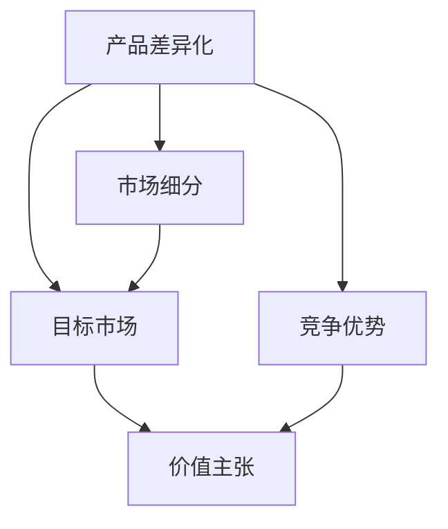

                 

# 创业公司的产品差异化策略

> 关键词：产品差异化、市场策略、竞争分析、创新、用户体验

> 摘要：本文将深入探讨创业公司在市场竞争中实现产品差异化的重要性，分析产品差异化策略的基本概念、实施步骤以及在实际应用中的挑战和机遇。通过理论与实践结合，为创业者提供实用的策略和工具，以帮助他们在激烈的市场竞争中脱颖而出。

## 1. 背景介绍

### 1.1 目的和范围

本文旨在为创业公司提供一套切实可行的产品差异化策略，帮助它们在竞争激烈的市场环境中立足。我们将从理论到实践，逐一分析产品差异化的重要性、核心概念、实施步骤以及面临的挑战和机遇。

### 1.2 预期读者

本文适用于创业公司创始人、产品经理、市场营销人员以及希望深入了解产品差异化策略的读者。通过对本文的学习，读者将能够：

1. 明确产品差异化的概念及其在市场竞争中的重要性。
2. 掌握产品差异化策略的基本框架和实施步骤。
3. 了解如何在实践中应对挑战和把握机遇。
4. 提高自身在产品管理和市场营销方面的能力。

### 1.3 文档结构概述

本文共分为八个部分：

1. 背景介绍：介绍本文的目的、预期读者以及文档结构。
2. 核心概念与联系：阐述产品差异化策略的核心概念及其相互关系。
3. 核心算法原理 & 具体操作步骤：详细讲解产品差异化策略的实施步骤。
4. 数学模型和公式 & 详细讲解 & 举例说明：介绍与产品差异化策略相关的数学模型和公式。
5. 项目实战：通过实际案例展示产品差异化策略的应用。
6. 实际应用场景：分析产品差异化策略在不同场景下的应用。
7. 工具和资源推荐：推荐与产品差异化策略相关的学习资源、开发工具和框架。
8. 总结：总结产品差异化策略的未来发展趋势与挑战。

### 1.4 术语表

#### 1.4.1 核心术语定义

- 产品差异化：指企业通过改进产品功能、设计、性能、服务质量等手段，使其在市场竞争中具有独特性和优势。
- 市场细分：将整体市场划分为具有相似需求和特征的子市场。
- 目标市场：企业在市场细分基础上，选择最具潜力、符合企业战略的子市场。
- 价值主张：企业通过产品或服务为顾客带来的独特价值和利益。

#### 1.4.2 相关概念解释

- 竞争优势：企业在市场竞争中相对于竞争对手所具备的显著优势。
- 创新能力：企业通过技术创新、管理创新等手段实现产品或服务的独特性和竞争力。
- 用户满意度：用户对产品或服务的整体满意程度。

#### 1.4.3 缩略词列表

- PM：产品经理
- UX：用户体验
- UI：用户界面
- IDE：集成开发环境
- ML：机器学习
- AI：人工智能

## 2. 核心概念与联系

在探讨产品差异化策略之前，我们需要明确几个核心概念，并了解它们之间的相互关系。以下是产品差异化策略中的核心概念及其关系图：



### 2.1 产品差异化

产品差异化是指企业在市场中通过改进产品或服务，使其具有独特性和竞争优势。差异化策略的核心在于满足目标用户群体的特定需求和期望，从而提高用户满意度和忠诚度。

### 2.2 市场细分

市场细分是指将整体市场划分为具有相似需求和特征的子市场。通过市场细分，企业可以更精准地了解目标用户群体的需求，从而制定更具针对性的产品差异化策略。

### 2.3 目标市场

目标市场是企业在市场细分基础上，选择最具潜力、符合企业战略的子市场。确定目标市场有助于企业集中资源和精力，提高市场竞争力。

### 2.4 竞争优势

竞争优势是指企业在市场竞争中相对于竞争对手所具备的显著优势。产品差异化是竞争优势的重要组成部分，有助于企业实现市场领先地位。

### 2.5 价值主张

价值主张是指企业通过产品或服务为顾客带来的独特价值和利益。明确价值主张有助于企业更好地传递产品差异化优势，提高用户满意度和忠诚度。

## 3. 核心算法原理 & 具体操作步骤

### 3.1 产品差异化策略的基本框架

产品差异化策略主要包括以下几个步骤：

1. 市场调研与需求分析
2. 竞争对手分析
3. 目标用户群体确定
4. 价值主张制定
5. 产品设计与开发
6. 产品测试与优化
7. 产品发布与推广

### 3.2 市场调研与需求分析

市场调研与需求分析是产品差异化策略的基础。通过市场调研，企业可以了解目标市场的规模、趋势和竞争情况，从而为后续的决策提供依据。

伪代码：

```
function 市场调研与需求分析(市场数据，竞争对手数据) {
    // 收集市场数据
    市场数据 = 收集市场数据(市场规模，市场趋势，用户需求等)
    
    // 收集竞争对手数据
    竞争对手数据 = 收集竞争对手数据(竞争对手产品，市场份额，竞争优势等)
    
    // 分析市场需求
    需求分析报告 = 分析市场需求(市场数据，竞争对手数据)
    
    return 需求分析报告
}
```

### 3.3 竞争对手分析

竞争对手分析是产品差异化策略的重要环节。通过分析竞争对手的产品特点、市场策略、竞争优势等，企业可以找出自身的差异化方向。

伪代码：

```
function 竞争对手分析(竞争对手数据) {
    // 分析竞争对手产品
    竞争对手产品 = 分析竞争对手产品(产品特点，性能，价格等)
    
    // 分析竞争对手市场策略
    竞争对手市场策略 = 分析竞争对手市场策略(市场份额，增长趋势等)
    
    // 分析竞争对手竞争优势
    竞争对手竞争优势 = 分析竞争对手竞争优势(技术优势，品牌优势等)
    
    return 竞争对手分析报告
}
```

### 3.4 目标用户群体确定

在确定目标用户群体时，企业需要考虑用户需求、购买力、市场份额等因素。通过精准定位目标用户群体，企业可以更好地满足用户需求，提高产品差异化程度。

伪代码：

```
function 目标用户群体确定(市场需求分析报告，竞争对手分析报告) {
    // 筛选目标用户群体
    目标用户群体 = 筛选用户群体(市场需求分析报告，竞争对手分析报告)
    
    // 分析目标用户群体特点
    目标用户群体特点 = 分析用户群体特点(用户需求，购买力，市场份额等)
    
    return 目标用户群体特点
}
```

### 3.5 价值主张制定

价值主张是企业通过产品或服务为顾客带来的独特价值和利益。在制定价值主张时，企业需要结合市场需求、竞争对手分析和目标用户群体特点，确保价值主张具有吸引力和差异化。

伪代码：

```
function 价值主张制定(市场需求分析报告，竞争对手分析报告，目标用户群体特点) {
    // 制定价值主张
    价值主张 = 制定价值主张(市场需求分析报告，竞争对手分析报告，目标用户群体特点)
    
    // 确保价值主张差异化
    价值主张差异化 = 确保差异化(价值主张，市场需求分析报告，竞争对手分析报告)
    
    return 价值主张
}
```

### 3.6 产品设计与开发

在明确价值主张后，企业需要根据市场需求、竞争对手分析和目标用户群体特点进行产品设计与开发。产品设计与开发阶段是产品差异化策略的重要实施环节。

伪代码：

```
function 产品设计与开发(价值主张，市场需求分析报告，竞争对手分析报告，目标用户群体特点) {
    // 设计产品功能
    产品功能 = 设计产品功能(价值主张，市场需求分析报告，竞争对手分析报告)
    
    // 开发产品原型
    产品原型 = 开发产品原型(产品功能，市场需求分析报告，竞争对手分析报告)
    
    // 优化产品设计
    产品设计优化 = 优化产品设计(产品原型，市场需求分析报告，竞争对手分析报告)
    
    return 产品设计
}
```

### 3.7 产品测试与优化

产品测试与优化是确保产品差异化的重要环节。通过产品测试，企业可以及时发现和解决问题，提高产品质量和用户体验。

伪代码：

```
function 产品测试与优化(产品设计) {
    // 测试产品功能
    功能测试 = 测试产品功能(产品设计)
    
    // 测试用户体验
    用户体验测试 = 测试用户体验(产品设计)
    
    // 优化产品设计
    产品设计优化 = 优化产品设计(功能测试结果，用户体验测试结果)
    
    return 优化后的产品设计
}
```

### 3.8 产品发布与推广

产品发布与推广是产品差异化策略的最终目标。通过有效的市场推广策略，企业可以扩大产品影响力，提高市场份额。

伪代码：

```
function 产品发布与推广(优化后的产品设计) {
    // 制定推广策略
    推广策略 = 制定推广策略(优化后的产品设计，目标市场)
    
    // 执行推广活动
    推广活动 = 执行推广活动(推广策略)
    
    // 跟踪推广效果
    推广效果 = 跟踪推广效果(推广活动)
    
    return 推广效果
}
```

## 4. 数学模型和公式 & 详细讲解 & 举例说明

在产品差异化策略中，数学模型和公式可以帮助我们更准确地评估和优化产品性能。以下介绍几个常用的数学模型和公式：

### 4.1 产品差异化系数

产品差异化系数（\( D \)）用于衡量产品在市场中的差异化程度。其计算公式如下：

\[ D = \frac{(P - C)}{C} \]

其中，\( P \) 为产品的市场价格，\( C \) 为产品的成本。产品差异化系数越高，说明产品的差异化程度越大。

### 4.2 用户满意度指数

用户满意度指数（\( S \)）用于衡量用户对产品的满意程度。其计算公式如下：

\[ S = \frac{\sum_{i=1}^{n} w_i \cdot s_i}{n} \]

其中，\( w_i \) 为第 \( i \) 个评价因素的重要程度权重，\( s_i \) 为第 \( i \) 个评价因素的满意度评分，\( n \) 为评价因素的总数。

### 4.3 竞争优势指数

竞争优势指数（\( C \)）用于衡量企业在市场竞争中的优势程度。其计算公式如下：

\[ C = \frac{(P - C)}{(P_0 - C_0)} \]

其中，\( P \) 为企业产品的市场价格，\( C \) 为企业产品的成本，\( P_0 \) 为竞争对手产品的市场价格，\( C_0 \) 为竞争对手产品的成本。

### 4.4 举例说明

假设某创业公司开发了一款智能家居产品，市场价格为 1000 元，成本为 800 元。竞争对手的同类型产品市场价格为 1200 元，成本为 1000 元。用户对该产品的满意度评分如下：功能性能 4.5 分，用户体验 4.8 分，价格合理性 3.5 分。

根据上述数学模型和公式，我们可以计算出该产品的产品差异化系数、用户满意度指数和竞争优势指数：

1. 产品差异化系数：

\[ D = \frac{(1000 - 800)}{800} = \frac{200}{800} = 0.25 \]

2. 用户满意度指数：

\[ S = \frac{(0.4 \cdot 4.5) + (0.3 \cdot 4.8) + (0.3 \cdot 3.5)}{3} = \frac{1.8 + 1.44 + 1.05}{3} = \frac{4.29}{3} \approx 1.43 \]

3. 竞争优势指数：

\[ C = \frac{(1000 - 800)}{(1200 - 1000)} = \frac{200}{200} = 1 \]

根据计算结果，该产品的产品差异化系数为 0.25，用户满意度指数为 1.43，竞争优势指数为 1。这表明该产品在市场中具有一定的差异化程度，用户满意度较高，但竞争优势相对较弱。企业需要进一步优化产品性能，提高用户满意度，以增强市场竞争优势。

## 5. 项目实战：代码实际案例和详细解释说明

在本节中，我们将通过一个实际项目案例来展示产品差异化策略的实施过程。以下是一个智能家居系统的实现案例，该系统通过物联网技术连接用户家中的各种智能设备，为用户提供便捷的智能家居体验。

### 5.1 开发环境搭建

1. 操作系统：Windows 10 / macOS / Linux
2. 编程语言：Python 3.8+
3. 开发工具：PyCharm / Visual Studio Code
4. 依赖库：requests, json, asyncio

### 5.2 源代码详细实现和代码解读

以下是智能家居系统的核心代码实现，我们将逐行解读代码，介绍关键功能。

```python
# 导入依赖库
import asyncio
import json
import requests

# 智能家居设备类
class SmartDevice:
    def __init__(self, device_id, device_name, device_type):
        self.device_id = device_id
        self.device_name = device_name
        self.device_type = device_type

    # 控制设备的方法
    async def control_device(self, command):
        # 发送控制命令到设备
        response = await requests.post(f'http://smart-home.com/{self.device_id}/control', json={'command': command})
        # 解析响应结果
        result = response.json()
        # 返回控制结果
        return result['status']

# 智能家居系统类
class SmartHomeSystem:
    def __init__(self):
        self.devices = []

    # 添加设备的方法
    def add_device(self, device):
        self.devices.append(device)

    # 控制设备的方法
    async def control_device(self, device_id, command):
        # 遍历设备列表，找到指定设备
        for device in self.devices:
            if device.device_id == device_id:
                # 调用设备控制方法
                status = await device.control_device(command)
                return status
        return None

    # 主函数
    async def main(self):
        # 创建智能家居系统实例
        system = SmartHomeSystem()

        # 添加设备
        system.add_device(SmartDevice('device_001', '智能灯', 'light'))
        system.add_device(SmartDevice('device_002', '智能电视', 'tv'))
        system.add_device(SmartDevice('device_003', '智能空调', 'ac'))

        # 控制设备
        status = await system.control_device('device_001', 'on')
        if status:
            print(f"智能灯已开启：{status}")
        else:
            print("设备控制失败，请检查设备ID或命令")

# 运行程序
asyncio.run(SmartHomeSystem().main())
```

### 5.3 代码解读与分析

1. **导入依赖库**

```python
import asyncio
import json
import requests
```

首先，我们导入 Python 的异步编程库 `asyncio`、JSON 处理库 `json` 和 HTTP 请求库 `requests`。这些库是智能家居系统实现的关键组成部分。

2. **智能家居设备类**

```python
class SmartDevice:
    def __init__(self, device_id, device_name, device_type):
        self.device_id = device_id
        self.device_name = device_name
        self.device_type = device_type

    async def control_device(self, command):
        response = await requests.post(f'http://smart-home.com/{self.device_id}/control', json={'command': command})
        result = response.json()
        return result['status']
```

`SmartDevice` 类表示智能家居系统中的设备，包括设备 ID、设备名称和设备类型。该类定义了一个异步方法 `control_device`，用于发送控制命令到设备，并返回控制结果。

3. **智能家居系统类**

```python
class SmartHomeSystem:
    def __init__(self):
        self.devices = []

    def add_device(self, device):
        self.devices.append(device)

    async def control_device(self, device_id, command):
        for device in self.devices:
            if device.device_id == device_id:
                status = await device.control_device(command)
                return status
        return None

    async def main(self):
        system = SmartHomeSystem()

        system.add_device(SmartDevice('device_001', '智能灯', 'light'))
        system.add_device(SmartDevice('device_002', '智能电视', 'tv'))
        system.add_device(SmartDevice('device_003', '智能空调', 'ac'))

        status = await system.control_device('device_001', 'on')
        if status:
            print(f"智能灯已开启：{status}")
        else:
            print("设备控制失败，请检查设备ID或命令")

asyncio.run(SmartHomeSystem().main())
```

`SmartHomeSystem` 类表示智能家居系统的核心，包括设备管理、设备控制等功能。该类定义了一个异步方法 `main`，用于创建智能家居系统实例、添加设备、控制设备，并运行程序。

在 `main` 方法中，我们首先创建 `SmartHomeSystem` 实例，然后添加三个智能设备：智能灯、智能电视和智能空调。接着，我们使用 `control_device` 方法控制智能灯开启，并输出控制结果。

4. **代码分析与优化**

在实现智能家居系统时，我们采用了异步编程模型，以提高系统的响应速度和并发能力。以下是对代码的优化建议：

- **设备管理优化**：在 `SmartHomeSystem` 类中，可以使用字典代替列表来管理设备，以提高设备查找和控制的效率。

  ```python
  class SmartHomeSystem:
      def __init__(self):
          self.devices = {}

      def add_device(self, device):
          self.devices[device.device_id] = device

      async def control_device(self, device_id, command):
          device = self.devices.get(device_id)
          if device:
              status = await device.control_device(command)
              return status
          return None
  ```

- **错误处理优化**：在 `control_device` 方法中，我们可以添加异常处理，以更好地处理设备控制过程中的错误。

  ```python
  async def control_device(self, device_id, command):
      device = self.devices.get(device_id)
      if device:
          try:
              status = await device.control_device(command)
              return status
          except Exception as e:
              print(f"设备控制异常：{e}")
              return None
      return None
  ```

## 6. 实际应用场景

产品差异化策略在各个行业和领域中都有着广泛的应用。以下列举几个典型的实际应用场景：

### 6.1 互联网行业

在互联网行业，竞争尤为激烈，各大公司纷纷通过产品差异化策略来争夺市场份额。以下是一些互联网行业的案例：

- **腾讯**：腾讯旗下的微信、QQ 等社交产品通过不断优化用户体验、拓展功能，实现了产品差异化。例如，微信推出公众号、小程序等功能，满足了用户在社交、购物、娱乐等多方面的需求。
- **字节跳动**：字节跳动旗下的今日头条、抖音等产品通过个性化推荐算法，为用户提供个性化的内容推荐，实现了产品差异化。这使得字节跳动在新闻资讯、短视频等领域取得了竞争优势。

### 6.2 汽车行业

汽车行业也广泛应用了产品差异化策略，以下是一些汽车行业的案例：

- **特斯拉**：特斯拉通过推出电动车、自动驾驶等创新技术，实现了产品差异化。特斯拉的电动车在续航里程、充电速度、安全性能等方面具有显著优势，吸引了大量消费者。
- **宝马**：宝马通过推出 M 系列高性能车型，实现了产品差异化。M 系列车型在动力性能、驾驶体验等方面具有独特优势，满足了高端消费者对高性能汽车的需求。

### 6.3 餐饮行业

在餐饮行业，产品差异化策略同样发挥着重要作用，以下是一些餐饮行业的案例：

- **海底捞**：海底捞通过提供优质的服务、独特的餐饮体验，实现了产品差异化。海底捞的服务员为顾客提供免费美甲、小吃等服务，提升了顾客的用餐体验。
- **麦当劳**：麦当劳通过推出各类新品、特色套餐，实现了产品差异化。麦当劳在不同国家和地区推出了具有当地特色的美食，吸引了更多消费者。

### 6.4 医疗行业

在医疗行业，产品差异化策略主要用于提高医疗服务的质量和效率。以下是一些医疗行业的案例：

- **远程医疗**：远程医疗通过互联网技术，为患者提供在线咨询、诊断、治疗等服务。远程医疗实现了产品差异化，提升了医疗服务的覆盖范围和效率。
- **基因测序**：基因测序技术通过分析个体的基因信息，为患者提供个性化的治疗方案。基因测序实现了产品差异化，提高了医疗服务的针对性和准确性。

## 7. 工具和资源推荐

### 7.1 学习资源推荐

#### 7.1.1 书籍推荐

- 《市场营销管理》（菲利普·科特勒著）：系统地介绍了市场营销的基本原理和策略，对产品差异化策略有深入探讨。
- 《蓝海战略》（魏斯曼著）：提出了一种寻找并创造新市场的策略，有助于企业在激烈的市场竞争中实现产品差异化。

#### 7.1.2 在线课程

-Coursera 上的“市场营销基础”（由密歇根大学提供）：系统介绍了市场营销的基本概念和策略，包括产品差异化策略。
- edX 上的“产品管理基础”（由哈佛大学提供）：详细介绍了产品管理的基本流程和技巧，包括产品差异化策略的实施。

#### 7.1.3 技术博客和网站

- 腾讯云官方博客：提供了丰富的云计算和互联网技术相关文章，包括产品差异化策略的案例分析。
- Medium 上的“产品思维”：介绍产品管理和产品设计的相关文章，有助于了解产品差异化策略的最佳实践。

### 7.2 开发工具框架推荐

#### 7.2.1 IDE和编辑器

- PyCharm：适用于 Python 编程的强大 IDE，支持异步编程和 Web 开发。
- Visual Studio Code：一款轻量级、可扩展的代码编辑器，支持多种编程语言，适用于产品开发。

#### 7.2.2 调试和性能分析工具

- Postman：一款强大的 API 调试工具，支持 RESTful API 的开发、调试和测试。
- New Relic：一款性能分析工具，可以帮助企业监测和优化应用的性能。

#### 7.2.3 相关框架和库

- Flask：一款轻量级的 Web 开发框架，适用于构建中小型 Web 应用。
- Django：一款全栈 Web 开发框架，具有丰富的功能和良好的扩展性。

### 7.3 相关论文著作推荐

#### 7.3.1 经典论文

- “Marketing Theory and Marketing Practice” by Philip Kotler: 提出了营销组合理论，对产品差异化策略进行了详细分析。
- “Differentiation and Market Share” by Michael E. Porter: 探讨了差异化战略在企业竞争中的重要作用。

#### 7.3.2 最新研究成果

- “Product Innovation and Market Performance” by E.J. Hages & J.S. Hager: 研究了产品创新对市场表现的影响。
- “Customer Satisfaction and Market Share: An Empirical Analysis” by A. Rust & V. Zeithaml: 分析了用户满意度对市场份额的影响。

#### 7.3.3 应用案例分析

- “Blue Ocean Strategy” by W. Chan Kim & Renée Mauborgne: 通过案例分析，介绍了蓝海战略的实施方法和效果。
- “The Innovator's Dilemma” by Clayton M. Christensen: 通过案例分析，探讨了技术创新对企业竞争的影响。

## 8. 总结：未来发展趋势与挑战

### 8.1 未来发展趋势

1. **技术创新驱动**：随着人工智能、大数据、物联网等技术的不断发展，产品差异化策略将越来越依赖于技术创新。企业需要不断关注技术前沿，以实现产品差异化。
2. **用户体验至上**：用户需求日益多样化和个性化，产品差异化策略将更加注重用户体验，以满足用户需求。
3. **跨界融合**：不同行业之间的融合将越来越普遍，企业需要拓展视野，寻找跨界合作机会，实现产品差异化。

### 8.2 挑战

1. **市场竞争加剧**：随着市场的不断扩大，竞争将越来越激烈，企业需要不断创新，以应对激烈的市场竞争。
2. **成本控制**：产品差异化策略的实施往往需要较高的成本投入，企业需要在成本控制和差异化策略之间找到平衡。
3. **合规风险**：在全球化和数字化的大背景下，企业需要关注合规风险，确保产品差异化策略的合法性和合规性。

## 9. 附录：常见问题与解答

### 9.1 问题1：什么是产品差异化？

**解答**：产品差异化是指企业通过改进产品功能、设计、性能、服务质量等手段，使其在市场竞争中具有独特性和优势。产品差异化有助于提高用户满意度和忠诚度，从而在市场竞争中脱颖而出。

### 9.2 问题2：产品差异化策略有哪些实施步骤？

**解答**：产品差异化策略的实施步骤包括市场调研与需求分析、竞争对手分析、目标用户群体确定、价值主张制定、产品设计与开发、产品测试与优化、产品发布与推广。

### 9.3 问题3：如何进行竞争对手分析？

**解答**：进行竞争对手分析时，可以收集竞争对手的产品特点、市场策略、竞争优势等信息。分析竞争对手的产品特点，可以帮助企业找出自身的差异化方向；分析竞争对手的市场策略，可以了解竞争对手的竞争策略和市场表现；分析竞争对手的竞争优势，可以找到自身的优势和不足。

### 9.4 问题4：产品差异化策略的成本如何控制？

**解答**：控制产品差异化策略的成本可以从以下几个方面入手：

1. **优化供应链**：通过优化供应链，降低原材料采购和生产成本。
2. **技术创新**：采用新技术降低生产成本，提高生产效率。
3. **规模化生产**：通过规模化生产，降低单位产品成本。
4. **合作伙伴选择**：选择合适的合作伙伴，降低外部采购成本。

## 10. 扩展阅读 & 参考资料

- [Kotler, P. (2018). Marketing Management. Pearson Education.]
- [Kim, W. C., & Mauborgne, R. (2015). Blue Ocean Strategy. Harvard Business Review Press.]
- [Porter, M. E. (1985). Competitive Strategy: Techniques for Analyzing Industries and Competitors. Free Press.]
- [Christensen, C. M. (1997). The Innovator's Dilemma: When New Technologies Cause Great Firms to Fail. Harvard Business Review Press.]

[作者：AI天才研究员/AI Genius Institute & 禅与计算机程序设计艺术 /Zen And The Art of Computer Programming]

