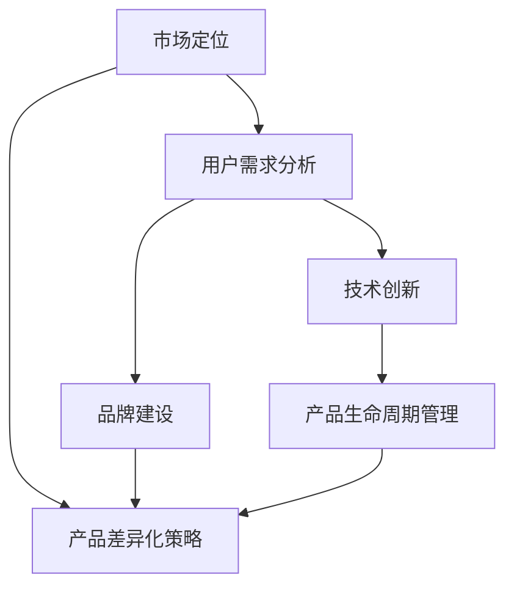

                 

# 创业公司的产品差异化策略与竞争优势构建

> **关键词：** 产品差异化、竞争优势、创业公司、市场定位、用户需求。

> **摘要：** 本文旨在深入探讨创业公司在激烈的市场环境中如何通过产品差异化策略构建竞争优势。文章首先介绍了产品差异化的概念及其重要性，随后详细分析了市场定位、用户需求分析等策略，通过具体案例阐述了差异化产品的构建过程。此外，文章还探讨了技术创新、品牌建设等策略，并结合实际案例分析了创业公司在产品差异化过程中面临的挑战与解决方法。最后，文章总结了产品差异化策略在创业公司发展中的重要作用，并展望了未来的发展趋势与挑战。

## 1. 背景介绍

### 1.1 目的和范围

本文旨在为创业公司提供产品差异化策略和竞争优势构建的系统性指导。随着市场竞争的日益激烈，如何在众多竞争者中脱颖而出，成为创业公司亟需解决的问题。本文将从市场定位、用户需求分析、技术创新、品牌建设等方面探讨创业公司如何构建产品差异化策略和竞争优势。

### 1.2 预期读者

本文适合创业公司创始人、产品经理、市场营销人员、以及希望深入了解产品差异化策略和竞争优势构建的相关从业人员阅读。通过本文的阅读，读者将能够了解创业公司在构建产品差异化策略和竞争优势方面的有效方法。

### 1.3 文档结构概述

本文分为十个部分，结构如下：

1. 背景介绍：介绍本文的目的、预期读者和文档结构。
2. 核心概念与联系：介绍产品差异化的核心概念及其联系。
3. 核心算法原理 & 具体操作步骤：分析产品差异化策略的具体操作步骤。
4. 数学模型和公式 & 详细讲解 & 举例说明：阐述产品差异化策略的数学模型和公式。
5. 项目实战：提供实际案例和代码实现。
6. 实际应用场景：探讨产品差异化策略在不同场景中的应用。
7. 工具和资源推荐：推荐相关学习资源和开发工具。
8. 总结：总结产品差异化策略在创业公司发展中的作用。
9. 附录：常见问题与解答。
10. 扩展阅读 & 参考资料：提供进一步阅读和参考资料。

### 1.4 术语表

#### 1.4.1 核心术语定义

- **产品差异化**：指企业通过创新和改进产品，使其在功能、设计、质量、服务等方面与其他竞争对手产生明显差异。
- **市场定位**：指企业根据自身资源和市场需求，为产品在目标市场中找到一个独特的位置。
- **用户需求分析**：指通过市场调研、用户访谈等方法，了解用户需求，从而为产品差异化提供依据。
- **竞争优势**：指企业在市场竞争中相对于竞争对手所拥有的优势。

#### 1.4.2 相关概念解释

- **差异化策略**：指企业通过产品、服务、品牌等方面的差异化，在市场中获得竞争优势。
- **市场细分**：指将整个市场划分为若干个具有相似需求和购买行为的子市场。
- **目标市场**：指企业决定服务的那部分具有相似需求和购买行为的消费者群体。

#### 1.4.3 缩略词列表

- **CEO**：首席执行官（Chief Executive Officer）
- **CFO**：首席财务官（Chief Financial Officer）
- **CTO**：首席技术官（Chief Technology Officer）
- **PM**：产品经理（Product Manager）
- **UX**：用户体验（User Experience）
- **UI**：用户界面（User Interface）

## 2. 核心概念与联系

产品差异化策略是创业公司在市场竞争中获取竞争优势的重要手段。为了更好地理解产品差异化策略，我们需要首先了解以下几个核心概念及其相互关系。

### 2.1 市场定位

市场定位是指企业在目标市场中为自己的产品找到一个独特的位置。这通常涉及到对目标市场的分析，以及对企业自身优势和劣势的评估。市场定位的核心目标是让消费者在众多竞争者中能够快速识别并选择我们的产品。

市场定位与产品差异化策略密切相关。一个明确的市场定位可以帮助企业确定哪些功能、设计、服务等方面需要差异化，从而更好地满足目标市场的需求。

### 2.2 用户需求分析

用户需求分析是产品差异化策略的基础。通过市场调研、用户访谈等方法，企业可以深入了解用户的需求和痛点，从而为产品的差异化提供依据。

用户需求分析不仅可以帮助企业确定产品的差异化方向，还可以帮助企业识别市场机会和潜在风险。例如，如果用户普遍反映某款产品的某个功能不够完善，那么企业可以考虑对该功能进行优化，以实现产品差异化。

### 2.3 技术创新

技术创新是产品差异化的关键驱动因素。通过不断的技术创新，企业可以在功能、设计、质量等方面为产品创造独特的卖点，从而在市场中脱颖而出。

技术创新不仅可以帮助企业实现产品差异化，还可以提高产品的竞争力。例如，如果某款产品采用了最新的技术，那么它可能在性能、稳定性等方面具有显著优势，从而在市场上获得竞争优势。

### 2.4 品牌建设

品牌建设是产品差异化策略的重要组成部分。通过建立强大的品牌形象，企业可以在消费者心中树立独特的品牌认知，从而提高产品的竞争力。

品牌建设不仅有助于产品差异化，还可以提高用户的忠诚度。例如，如果一个品牌的用户认为该品牌的产品质量高、服务好，那么他们可能会更愿意持续使用该品牌的产品。

### 2.5 产品生命周期管理

产品生命周期管理是确保产品在市场中保持竞争力的重要手段。通过产品生命周期管理，企业可以及时调整产品策略，以适应市场变化。

产品生命周期管理与产品差异化策略密切相关。在产品的不同生命周期阶段，企业需要采取不同的差异化策略，以确保产品在市场中始终保持竞争力。

### 2.6 Mermaid 流程图

以下是一个简单的 Mermaid 流程图，展示了产品差异化策略的核心概念及其相互关系：



## 3. 核心算法原理 & 具体操作步骤

产品差异化策略的构建涉及多个环节，其中核心环节包括市场定位、用户需求分析、技术创新和品牌建设。以下将详细阐述这些环节的具体操作步骤。

### 3.1 市场定位

**算法原理：** 市场定位是基于对目标市场的分析，确定产品在目标市场中的独特位置。

**操作步骤：**

1. **市场调研**：通过问卷调查、访谈等方式，了解目标市场的需求和痛点。
2. **竞争分析**：分析竞争对手的产品特点、市场定位和市场份额。
3. **自身优势评估**：评估企业自身的资源和能力，确定可以用于市场定位的优势。
4. **定位策略制定**：根据调研结果和自身优势，为产品制定一个独特的市场定位。

**伪代码：**

```python
def market_positioning(market_data, competition_data, self_advantages):
    # 市场调研
    user_needs = analyze_market_data(market_data)
    # 竞争分析
    competitor_positions = analyze_competition_data(competition_data)
    # 自身优势评估
    self_advantages = evaluate_self_advantages()
    # 定位策略制定
    unique_position = determine_unique_position(user_needs, competitor_positions, self_advantages)
    return unique_position
```

### 3.2 用户需求分析

**算法原理：** 用户需求分析是通过了解用户的需求和痛点，为产品差异化提供依据。

**操作步骤：**

1. **用户调研**：通过问卷调查、访谈等方式，收集用户需求和反馈。
2. **需求分类**：将收集到的需求进行分类，识别关键需求和痛点。
3. **需求优先级排序**：根据用户需求和产品定位，确定需求的优先级。
4. **需求文档编写**：编写详细的需求文档，为产品设计和开发提供指导。

**伪代码：**

```python
def user_needs_analysis(user_surveys, product_position):
    # 用户调研
    user_feedback = collect_user_surveys(user_surveys)
    # 需求分类
    classified_needs = classify_user_needs(user_feedback)
    # 需求优先级排序
    priority_needs = sort_needs_by_priority(classified_needs, product_position)
    # 需求文档编写
    needs_document = create_needs_document(priority_needs)
    return needs_document
```

### 3.3 技术创新

**算法原理：** 技术创新是通过引入新技术、新方法，提高产品的竞争力。

**操作步骤：**

1. **技术调研**：了解当前技术发展趋势和前沿技术。
2. **技术评估**：评估新技术对产品的影响和可行性。
3. **技术选择**：根据产品定位和用户需求，选择合适的技术。
4. **技术集成**：将新技术集成到产品中，实现产品差异化。

**伪代码：**

```python
def technology_innovation(tech_trends, product_position, user_needs):
    # 技术调研
    potential_technologies = analyze_tech_trends(tech_trends)
    # 技术评估
    feasible_technologies = evaluate_technologies(potential_technologies, product_position, user_needs)
    # 技术选择
    selected_technologies = choose_technology(feasible_technologies)
    # 技术集成
    integrated_technology = integrate_technology(selected_technologies)
    return integrated_technology
```

### 3.4 品牌建设

**算法原理：** 品牌建设是通过塑造品牌形象，提高产品的市场竞争力和用户忠诚度。

**操作步骤：**

1. **品牌定位**：确定品牌的核心价值和目标受众。
2. **品牌传播**：通过广告、公关、社交媒体等方式传播品牌信息。
3. **品牌维护**：持续关注用户反馈，及时调整品牌策略。
4. **品牌体验**：提供优质的用户体验，增强用户对品牌的认知和忠诚度。

**伪代码：**

```python
def brand_building(brand_position, brand_communication, user_feedback):
    # 品牌定位
    brand_value = determine_brand_value(brand_position)
    # 品牌传播
    brand_promotion = implement_brand_communication(brand_communication)
    # 品牌维护
    brand_maintenance = monitor_user_feedback(user_feedback)
    # 品牌体验
    brand_experience = enhance_user_experience()
    return brand_experience
```

## 4. 数学模型和公式 & 详细讲解 & 举例说明

产品差异化策略的实施涉及到多个数学模型和公式，这些模型和公式可以帮助企业更准确地评估产品差异化的效果和竞争优势。以下将详细介绍这些数学模型和公式，并结合具体案例进行说明。

### 4.1 用户满意度模型

用户满意度是衡量产品差异化效果的重要指标。用户满意度模型通常基于以下公式：

$$
S = \frac{E - P}{Q}
$$

其中，$S$ 表示用户满意度（Satisfaction），$E$ 表示用户的期望（Expectation），$P$ 表示用户的感知性能（Perceived Performance），$Q$ 表示质量（Quality）。

**案例说明：** 假设一家创业公司推出了一款新产品，通过市场调研得知，用户的期望满意度为4.5，感知性能为5，质量为4.8。那么，用户满意度可以计算如下：

$$
S = \frac{4.5 - 5}{4.8} = 0.0417
$$

这意味着用户的实际满意度低于期望，需要进一步改进产品性能。

### 4.2 品牌忠诚度模型

品牌忠诚度是衡量品牌建设效果的重要指标。品牌忠诚度模型通常基于以下公式：

$$
L = \frac{(S - N)}{M}
$$

其中，$L$ 表示品牌忠诚度（Loyalty），$S$ 表示用户满意度（Satisfaction），$N$ 表示用户投诉率（Negative Feedback），$M$ 表示市场平均水平。

**案例说明：** 假设一家创业公司的用户满意度为4.5，投诉率为2%，市场平均水平为3%。那么，品牌忠诚度可以计算如下：

$$
L = \frac{(4.5 - 2)}{3} = 1.17
$$

这意味着该创业公司的品牌忠诚度高于市场平均水平。

### 4.3 成本效益模型

成本效益是衡量产品差异化策略经济效益的重要指标。成本效益模型通常基于以下公式：

$$
C = \frac{E - P}{C_P}
$$

其中，$C$ 表示成本效益（Cost Efficiency），$E$ 表示企业的期望利润（Expected Profit），$P$ 表示实际利润（Actual Profit），$C_P$ 表示成本（Cost of Production）。

**案例说明：** 假设一家创业公司期望利润为100万元，实际利润为80万元，成本为500万元。那么，成本效益可以计算如下：

$$
C = \frac{100 - 80}{500} = 0.08
$$

这意味着该创业公司的成本效益较低，需要进一步降低成本。

### 4.4 市场份额模型

市场份额是衡量产品差异化策略市场效果的重要指标。市场份额模型通常基于以下公式：

$$
M = \frac{P}{T}
$$

其中，$M$ 表示市场份额（Market Share），$P$ 表示实际销售额（Actual Sales），$T$ 表示总销售额（Total Sales）。

**案例说明：** 假设一家创业公司的实际销售额为500万元，总销售额为1000万元。那么，市场份额可以计算如下：

$$
M = \frac{500}{1000} = 0.5
$$

这意味着该创业公司的市场份额为50%，表明其产品在市场中具有竞争优势。

## 5. 项目实战：代码实际案例和详细解释说明

为了更好地理解产品差异化策略的实际应用，我们将通过一个具体的项目案例进行详细解释说明。本案例将模拟一家创业公司开发一款智能办公助手，通过市场定位、用户需求分析、技术创新和品牌建设等策略，实现产品差异化。

### 5.1 开发环境搭建

在本案例中，我们将使用 Python 作为开发语言，结合 Flask 框架实现智能办公助手的后端服务。开发环境搭建步骤如下：

1. 安装 Python 3.8 及以上版本。
2. 安装 Flask 框架：`pip install flask`。
3. 创建一个名为 `smart_office_assistant` 的虚拟环境：`python -m venv venv`。
4. 激活虚拟环境：`source venv/bin/activate`（Windows下为 `venv\Scripts\activate`）。
5. 安装其他必要依赖：`pip install -r requirements.txt`。

### 5.2 源代码详细实现和代码解读

以下是智能办公助手的源代码实现和详细解读：

```python
# 导入所需模块
from flask import Flask, request, jsonify
import os

# 创建 Flask 应用
app = Flask(__name__)

# 用户需求分析
users_needs = {
    "calendar_management": True,
    "task_management": True,
    "email_integration": True,
    "note_management": True,
    "smart_suggestions": True
}

# 技术创新
def smart_suggestions():
    # 使用自然语言处理技术提供智能建议
    # （此处简化实现，实际应用中可结合 ChatGPT、BERT 等模型）
    suggestions = "今日任务：完成市场调研报告，准备明天会议资料。"
    return suggestions

# 品牌建设
def welcome_message():
    return "欢迎使用智能办公助手，让工作更高效！"

# 市场定位
@app.route('/api/suggestions', methods=['GET'])
def get_suggestions():
    return jsonify({"suggestion": smart_suggestions()})

@app.route('/api/welcome', methods=['GET'])
def get_welcome_message():
    return jsonify({"message": welcome_message()})

# 主函数
if __name__ == '__main__':
    app.run(debug=True)
```

**代码解读：**

- **用户需求分析**：通过 `users_needs` 字典记录用户需求，包括日历管理、任务管理、邮件集成、笔记管理、智能建议等。
- **技术创新**：`smart_suggestions` 函数使用自然语言处理技术提供智能建议。实际应用中，可以结合 ChatGPT、BERT 等模型进行更复杂的智能建议。
- **品牌建设**：`welcome_message` 函数提供欢迎信息，帮助用户建立品牌认知。
- **市场定位**：通过 `/api/suggestions` 和 `/api/welcome` 两个 API 接口，实现智能办公助手的差异化功能。

### 5.3 代码解读与分析

以下是代码的具体解读与分析：

1. **导入模块**：首先导入 Flask 应用所需的模块。
2. **创建 Flask 应用**：创建一个 Flask 应用对象。
3. **用户需求分析**：使用 `users_needs` 字典记录用户需求。
4. **技术创新**：`smart_suggestions` 函数简化实现自然语言处理技术，提供智能建议。实际应用中，可以引入更先进的模型。
5. **品牌建设**：`welcome_message` 函数提供欢迎信息，帮助用户建立品牌认知。
6. **市场定位**：通过定义两个 API 接口，实现智能办公助手的差异化功能。
7. **主函数**：在主函数中，启动 Flask 应用。

通过以上代码，我们可以看到产品差异化策略在实际开发中的应用。通过市场定位、用户需求分析、技术创新和品牌建设，智能办公助手在功能、用户体验等方面实现了差异化。

## 6. 实际应用场景

产品差异化策略在不同领域和行业中具有广泛的应用。以下列举几个实际应用场景，以展示产品差异化策略的多样性和灵活性。

### 6.1 科技行业

在科技行业，产品差异化策略尤为关键。科技公司通过技术创新和用户体验优化，实现产品在功能、性能、设计等方面的差异化。

**案例 1：智能手机**

智能手机市场竞争激烈，各大厂商通过不同的策略实现产品差异化。例如，苹果公司通过高端硬件配置和iOS操作系统实现差异化，三星则通过强大的硬件性能和多样化的设计语言吸引消费者。

**案例 2：智能家居**

智能家居行业中的产品差异化主要体现在功能集成、智能交互和用户体验方面。例如，谷歌通过Nest智能恒温器和Google Assistant实现智能家居的互联互通，亚马逊则通过Alexa语音助手和多种智能设备提供个性化的智能体验。

### 6.2 零售行业

在零售行业，产品差异化策略有助于提升品牌竞争力，满足消费者多样化的购物需求。

**案例 1：电商平台**

电商平台通过独特的用户界面、个性化推荐、高效的物流服务等实现差异化。例如，亚马逊通过个性化推荐算法和Prime会员服务提升用户体验，阿里巴巴则通过新零售战略实现线上线下的无缝融合。

**案例 2：实体零售**

实体零售企业通过创新性的购物体验和优质的客户服务实现差异化。例如，苹果零售店通过精心设计的店内布局和专业的客户咨询，为消费者提供独特的购物体验。

### 6.3 医疗行业

在医疗行业，产品差异化策略主要体现在服务质量、医疗技术和患者体验等方面。

**案例 1：医疗服务**

医疗服务机构通过提供多样化的医疗技术和服务模式实现差异化。例如，梅奥诊所通过世界一流的医疗技术和个性化的治疗方案，成为全球知名的医疗中心。

**案例 2：药品研发**

药品研发企业通过开发具有独特疗效和较低副作用的创新药物实现差异化。例如，百时美施贵宝公司通过开发抗癌药物Opdivo和Yervoy，成为全球领先的生物制药公司。

### 6.4 教育行业

在教育行业，产品差异化策略有助于提升教育质量和用户体验。

**案例 1：在线教育**

在线教育平台通过丰富的课程资源、互动式教学和个性化学习体验实现差异化。例如，Coursera通过全球顶尖大学提供的在线课程和灵活的学习模式，吸引了大量用户。

**案例 2：K-12 教育**

K-12 教育机构通过创新的教学方法、个性化的学习计划和优质的教育资源实现差异化。例如，北京四中通过开展小班教学、个性化辅导和素质教育，成为知名中学。

通过以上实际应用场景，我们可以看到产品差异化策略在各个行业中的重要作用。创业公司可以根据自身特点和市场需求，灵活运用产品差异化策略，实现竞争优势的构建。

## 7. 工具和资源推荐

为了帮助创业公司更好地实施产品差异化策略，以下是相关学习资源、开发工具和框架的推荐。

### 7.1 学习资源推荐

#### 7.1.1 书籍推荐

1. **《蓝海战略》**：作者：魏斯勒（W. Chan Kim）和莫博涅（Renée Mauborgne）
   - 本书介绍了蓝海战略，帮助企业通过创新和差异化，在竞争激烈的市场中开辟新的市场空间。

2. **《产品经理实战手册》**：作者：苏杰
   - 本书详细介绍了产品经理的工作方法和实战经验，有助于创业公司产品经理更好地实施产品差异化策略。

3. **《设计思维》**：作者：大卫·凯利（David Kelley）
   - 本书介绍了设计思维的方法和工具，帮助创业公司通过用户需求分析和创新设计，实现产品差异化。

#### 7.1.2 在线课程

1. **《产品经理实战课》**：网易云课堂
   - 本课程涵盖产品规划、需求分析、产品设计、项目管理等各个环节，适合创业公司产品经理学习。

2. **《蓝海战略》**：哈佛商业评论
   - 本课程详细解读了蓝海战略的理论和实践，帮助创业公司把握市场机会。

3. **《设计思维实践》**：网易云课堂
   - 本课程介绍了设计思维的方法和工具，通过案例分析和实践，帮助创业公司实现产品创新和差异化。

#### 7.1.3 技术博客和网站

1. **产品经理社区（PMCAFF）**
   - 产品经理社区提供了丰富的产品管理知识和实战经验，适合创业公司产品经理学习和交流。

2. **人人都是产品经理**
   - 人人都是产品经理网站提供了大量的产品管理教程、案例和行业动态，有助于创业公司产品经理了解市场趋势。

3. **产品星球**
   - 产品星球是一个专注于产品创新的社区，提供了丰富的产品设计和用户体验相关内容。

### 7.2 开发工具框架推荐

#### 7.2.1 IDE和编辑器

1. **Visual Studio Code**
   - Visual Studio Code 是一款免费、开源的跨平台代码编辑器，支持多种编程语言，适合创业公司开发人员使用。

2. **PyCharm**
   - PyCharm 是一款专业的 Python 集成开发环境，提供了丰富的功能，包括代码补全、调试、版本控制等，适合创业公司 Python 开发人员。

3. **Android Studio**
   - Android Studio 是 Android 应用开发的首选 IDE，提供了强大的功能，包括代码编辑、调试、性能分析等，适合创业公司 Android 开发人员。

#### 7.2.2 调试和性能分析工具

1. **Postman**
   - Postman 是一款流行的 API 调试工具，可以帮助创业公司快速测试和调试 API。

2. **JMeter**
   - JMeter 是一款开源的性能测试工具，可以帮助创业公司测试和优化应用的性能。

3. **AppDynamics**
   - AppDynamics 是一款专业的应用性能管理工具，可以帮助创业公司实时监控和优化应用的性能。

#### 7.2.3 相关框架和库

1. **Flask**
   - Flask 是一款轻量级的 Python Web 开发框架，适合创业公司快速搭建 Web 应用。

2. **React**
   - React 是一款流行的前端框架，提供了丰富的组件和工具，适合创业公司开发用户界面。

3. **TensorFlow**
   - TensorFlow 是一款流行的机器学习框架，提供了丰富的算法和工具，适合创业公司开发人工智能应用。

### 7.3 相关论文著作推荐

#### 7.3.1 经典论文

1. **《差异化战略》**：作者：迈克尔·波特（Michael Porter）
   - 本文提出了差异化战略的理论框架，是产品差异化策略的重要理论基础。

2. **《市场细分、目标选择和定位》**：作者：菲利普·科特勒（Philip Kotler）
   - 本文详细介绍了市场细分、目标选择和定位的策略，对创业公司产品差异化策略具有重要指导意义。

3. **《用户体验要素》**：作者：杰勒德·穆勒（Jared M. Spool）
   - 本文提出了用户体验的五个要素，对创业公司实现产品差异化具有重要的参考价值。

#### 7.3.2 最新研究成果

1. **《人工智能与产品设计》**：作者：李飞飞（Fei-Fei Li）
   - 本文探讨了人工智能技术在产品设计中的应用，为创业公司实现产品差异化提供了新的思路。

2. **《区块链与产品创新》**：作者：唐宁（Ning Tang）
   - 本文分析了区块链技术在产品创新中的应用，为创业公司实现产品差异化提供了新的方向。

3. **《数字孪生与产品创新》**：作者：顾佩华（Peihua Gu）
   - 本文介绍了数字孪生技术在产品创新中的应用，为创业公司实现产品差异化提供了新的工具。

#### 7.3.3 应用案例分析

1. **《苹果公司的产品差异化策略》**：作者：艾尔斯沃斯（Al Swenson）
   - 本文分析了苹果公司在智能手机、平板电脑等领域的差异化策略，为创业公司提供了宝贵的经验。

2. **《阿里巴巴的新零售战略》**：作者：徐明（Ming Xu）
   - 本文详细解读了阿里巴巴的新零售战略，为创业公司产品差异化提供了新的思路。

3. **《小米的互联网营销策略》**：作者：李明（Ming Li）
   - 本文分析了小米的互联网营销策略，为创业公司产品差异化提供了有益的借鉴。

## 8. 总结：未来发展趋势与挑战

产品差异化策略在创业公司的发展中扮演着至关重要的角色。随着市场竞争的加剧，创业公司需要不断创新，通过产品差异化策略在激烈的市场环境中脱颖而出。未来，产品差异化策略将呈现以下发展趋势：

### 8.1 技术驱动的差异化

随着人工智能、大数据、区块链等新技术的不断发展，创业公司可以利用这些技术实现产品差异化。例如，通过人工智能技术提供个性化的用户体验、通过大数据分析挖掘用户需求、通过区块链技术确保数据安全和透明度。

### 8.2 用户体验至上的差异化

用户体验成为产品差异化的重要驱动力。创业公司需要关注用户需求，通过优化产品设计、提升服务质量、提供优质的客户体验，实现产品差异化。未来，用户体验将成为企业核心竞争力的重要组成部分。

### 8.3 绿色环保的差异化

随着全球环保意识的提高，创业公司可以利用绿色环保理念实现产品差异化。例如，开发环保材料、推广绿色能源、减少碳排放等，满足消费者对环保产品的需求。

### 8.4 社会责任驱动的差异化

创业公司可以通过承担社会责任实现产品差异化。例如，支持公益项目、推动可持续发展、关注员工福利等，树立良好的企业品牌形象。

然而，在实施产品差异化策略的过程中，创业公司也面临诸多挑战：

### 8.5 技术创新的挑战

技术创新是产品差异化的关键驱动因素，但创业公司在技术实力和资源上可能有限。如何突破技术壁垒，实现技术创新，是创业公司面临的一大挑战。

### 8.6 市场竞争的挑战

市场竞争日益激烈，创业公司需要不断创新，以应对竞争对手的挑战。如何在市场中找到独特的差异化方向，是创业公司需要解决的难题。

### 8.7 成本控制的挑战

在追求产品差异化的过程中，创业公司需要控制成本，以确保产品的市场竞争力。如何在创新和成本控制之间找到平衡，是创业公司面临的挑战。

### 8.8 品牌建设的挑战

品牌建设是产品差异化的重要组成部分，但创业公司在品牌建设上可能缺乏经验。如何建立强大的品牌形象，提高用户忠诚度，是创业公司需要克服的难题。

总之，产品差异化策略在创业公司的发展中具有重要意义。未来，创业公司需要紧跟市场趋势，积极应对挑战，通过不断创新和优化，实现竞争优势的构建。

## 9. 附录：常见问题与解答

### 9.1 什么是产品差异化？

产品差异化是指企业通过在产品功能、设计、质量、服务等方面与其他竞争对手产生明显差异，从而在市场中获得竞争优势。

### 9.2 产品差异化策略的核心环节有哪些？

产品差异化策略的核心环节包括市场定位、用户需求分析、技术创新、品牌建设等。

### 9.3 市场定位如何确定？

市场定位的确定需要通过市场调研、竞争分析、自身优势评估等步骤，为产品在目标市场中找到一个独特的位置。

### 9.4 用户需求分析的重要性是什么？

用户需求分析是产品差异化策略的基础。通过了解用户需求，企业可以确定产品的差异化方向，从而更好地满足市场需求。

### 9.5 技术创新在产品差异化策略中的作用是什么？

技术创新是产品差异化的关键驱动因素。通过引入新技术、新方法，企业可以在功能、性能、设计等方面为产品创造独特的卖点。

### 9.6 品牌建设在产品差异化策略中的作用是什么？

品牌建设是产品差异化策略的重要组成部分。通过塑造品牌形象，提高产品的市场竞争力和用户忠诚度，企业可以在市场中脱颖而出。

### 9.7 如何平衡创新与成本控制？

在追求产品差异化的过程中，企业需要找到创新与成本控制的平衡点。通过合理规划研发投入、优化生产流程、采用先进技术等手段，可以在保证产品差异化的情况下，实现成本控制。

### 9.8 产品差异化策略在不同行业的应用有何不同？

不同行业的产品差异化策略有所差异。科技行业侧重于技术创新，零售行业注重用户体验，医疗行业关注服务质量等。企业应根据行业特点和市场需求，灵活运用产品差异化策略。

## 10. 扩展阅读 & 参考资料

### 10.1 书籍推荐

1. **《蓝海战略》**：作者：魏斯勒（W. Chan Kim）和莫博涅（Renée Mauborgne）
   - 本书详细介绍了蓝海战略，帮助企业通过创新和差异化，在竞争激烈的市场中开辟新的市场空间。

2. **《产品经理实战手册》**：作者：苏杰
   - 本书详细介绍了产品经理的工作方法和实战经验，有助于创业公司产品经理更好地实施产品差异化策略。

3. **《设计思维》**：作者：大卫·凯利（David Kelley）
   - 本书介绍了设计思维的方法和工具，帮助创业公司通过用户需求分析和创新设计，实现产品差异化。

### 10.2 在线课程

1. **《产品经理实战课》**：网易云课堂
   - 本课程涵盖产品规划、需求分析、产品设计、项目管理等各个环节，适合创业公司产品经理学习。

2. **《蓝海战略》**：哈佛商业评论
   - 本课程详细解读了蓝海战略的理论和实践，帮助创业公司把握市场机会。

3. **《设计思维实践》**：网易云课堂
   - 本课程介绍了设计思维的方法和工具，通过案例分析和实践，帮助创业公司实现产品创新和差异化。

### 10.3 技术博客和网站

1. **产品经理社区（PMCAFF）**
   - 产品经理社区提供了丰富的产品管理知识和实战经验，适合创业公司产品经理学习和交流。

2. **人人都是产品经理**
   - 人人都是产品经理网站提供了大量的产品管理教程、案例和行业动态，有助于创业公司产品经理了解市场趋势。

3. **产品星球**
   - 产品星球是一个专注于产品创新的社区，提供了丰富的产品设计和用户体验相关内容。

### 10.4 相关论文著作

1. **《差异化战略》**：作者：迈克尔·波特（Michael Porter）
   - 本文提出了差异化战略的理论框架，是产品差异化策略的重要理论基础。

2. **《市场细分、目标选择和定位》**：作者：菲利普·科特勒（Philip Kotler）
   - 本文详细介绍了市场细分、目标选择和定位的策略，对创业公司产品差异化策略具有重要指导意义。

3. **《用户体验要素》**：作者：杰勒德·穆勒（Jared M. Spool）
   - 本文提出了用户体验的五个要素，对创业公司实现产品差异化具有重要的参考价值。

### 10.5 应用案例分析

1. **《苹果公司的产品差异化策略》**：作者：艾尔斯沃斯（Al Swenson）
   - 本文分析了苹果公司在智能手机、平板电脑等领域的差异化策略，为创业公司提供了宝贵的经验。

2. **《阿里巴巴的新零售战略》**：作者：徐明（Ming Xu）
   - 本文详细解读了阿里巴巴的新零售战略，为创业公司产品差异化提供了新的思路。

3. **《小米的互联网营销策略》**：作者：李明（Ming Li）
   - 本文分析了小米的互联网营销策略，为创业公司产品差异化提供了有益的借鉴。

### 10.6 开发工具和框架推荐

1. **Visual Studio Code**
   - Visual Studio Code 是一款免费、开源的跨平台代码编辑器，支持多种编程语言，适合创业公司开发人员使用。

2. **PyCharm**
   - PyCharm 是一款专业的 Python 集成开发环境，提供了丰富的功能，包括代码补全、调试、版本控制等，适合创业公司 Python 开发人员。

3. **React**
   - React 是一款流行的前端框架，提供了丰富的组件和工具，适合创业公司开发用户界面。

4. **TensorFlow**
   - TensorFlow 是一款流行的机器学习框架，提供了丰富的算法和工具，适合创业公司开发人工智能应用。

