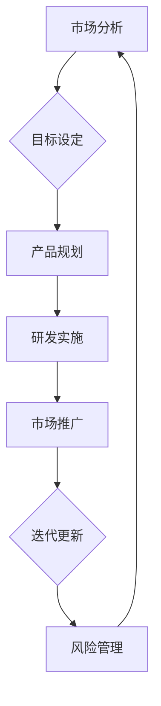

                 

# 创业公司的产品路线图制定与执行

> 关键词：产品路线图、创业公司、战略规划、市场分析、执行力、团队协作、风险管理、迭代更新

> 摘要：本文将深入探讨创业公司在产品路线图的制定与执行过程中的关键步骤和核心策略。通过明确的目标设定、细致的市场分析、周密的规划与执行、团队协作以及持续的风险管理和迭代更新，创业公司能够有效提升产品竞争力，实现持续的市场拓展和业务增长。

## 1. 背景介绍

### 1.1 目的和范围

本文旨在为创业公司在产品路线图制定与执行方面提供一套系统化的方法和实践指导。通过分析市场环境、明确目标、规划产品路线、建立执行机制以及不断调整优化，帮助创业公司实现产品的市场定位、提高市场竞争力，最终实现商业成功。

### 1.2 预期读者

本文面向的读者包括创业公司的创始人、产品经理、技术团队负责人以及相关领域的专业人士。通过本文的阅读，读者将能够掌握产品路线图制定与执行的核心方法，提升产品管理和运营能力。

### 1.3 文档结构概述

本文分为十个部分，主要包括：

- 背景介绍：阐述本文的目的、读者对象和结构；
- 核心概念与联系：介绍产品路线图制定的关键概念和流程；
- 核心算法原理 & 具体操作步骤：详细讲解产品路线图的制定流程；
- 数学模型和公式 & 详细讲解 & 举例说明：介绍产品路线图制定过程中的关键数学模型和公式；
- 项目实战：通过实际案例展示产品路线图的制定与执行过程；
- 实际应用场景：分析产品路线图在不同场景下的应用；
- 工具和资源推荐：推荐有助于产品路线图制定与执行的工具和资源；
- 总结：展望产品路线图在未来发展的趋势和挑战；
- 附录：常见问题与解答；
- 扩展阅读 & 参考资料：提供进一步学习和探索的资料。

### 1.4 术语表

#### 1.4.1 核心术语定义

- 产品路线图：描述创业公司产品从概念到市场推广的全过程，包括目标设定、市场分析、产品规划、研发实施、市场推广等环节。
- 市场分析：通过对目标市场、竞争对手、用户需求等方面的研究，为产品定位和策略制定提供依据。
- 执行力：团队在产品路线图实施过程中所表现出的行动力和协同能力。
- 风险管理：识别、评估和应对产品路线图中潜在的风险，确保项目的顺利推进。
- 迭代更新：根据市场反馈和业务发展，对产品进行持续改进和优化。

#### 1.4.2 相关概念解释

- 创业公司：指以创新产品和商业模式为核心，旨在通过创业实现商业价值和社会价值的公司。
- 产品经理：负责产品规划、设计、开发和市场推广的团队负责人。
- 技术团队：负责产品技术研发和实现的团队。

#### 1.4.3 缩略词列表

- PM：产品经理
- R&D：研发
- UX：用户体验
- UI：用户界面
- SWOT：优势、劣势、机会、威胁

## 2. 核心概念与联系

在制定创业公司的产品路线图时，需要理解并掌握以下几个核心概念及其相互关系：

### 产品路线图的制定流程

1. **市场分析**：通过对目标市场、竞争对手、用户需求等方面的研究，明确产品定位和市场策略。
2. **目标设定**：根据市场分析结果，制定明确的产品目标和战略目标。
3. **产品规划**：确定产品的功能模块、技术架构和开发计划。
4. **研发实施**：按照产品规划进行技术研发和产品开发。
5. **市场推广**：通过营销活动和渠道推广，提高产品的市场知名度和用户认可度。
6. **迭代更新**：根据市场反馈和业务发展，持续改进和优化产品。

### 产品路线图与业务战略的关系

- 产品路线图是业务战略的具体实现，必须与公司整体战略保持一致。
- 业务战略指导产品路线图的方向和目标，产品路线图的制定需充分考虑业务战略的需求和目标。

### 产品路线图与市场环境的关系

- 产品路线图的制定需充分考虑市场环境的变化，包括市场需求、竞争对手、技术发展趋势等。
- 市场环境的变化会对产品路线图产生直接影响，需要根据市场环境调整产品规划和策略。

### 产品路线图与团队协作的关系

- 产品路线图的制定与执行需要团队协作，确保各环节顺利进行。
- 团队成员需明确各自职责，协同合作，提高执行力。

### 产品路线图与风险管理的联系

- 产品路线图制定过程中需充分考虑潜在风险，制定风险管理策略。
- 风险管理贯穿于产品路线图的整个生命周期，确保项目的顺利进行。

### 产品路线图与迭代更新的关系

- 迭代更新是产品路线图的重要组成部分，根据市场反馈和业务发展，持续优化产品。
- 迭代更新能够提高产品的市场竞争力，满足用户需求，实现商业成功。

### 产品路线图的 Mermaid 流程图



## 3. 核心算法原理 & 具体操作步骤

产品路线图的制定与执行需要遵循一定的算法原理和操作步骤，以下为详细讲解：

### 3.1 市场分析

**算法原理：** 市场分析是产品路线图制定的基础，主要通过SWOT分析、PEST分析等方法，了解市场环境、竞争对手和用户需求。

**操作步骤：**

1. **SWOT分析**：分析公司的优势（Strengths）、劣势（Weaknesses）、机会（Opportunities）和威胁（Threats），为产品定位和策略制定提供依据。
2. **PEST分析**：分析政治（Political）、经济（Economic）、社会（Social）和技术（Technological）等因素，了解市场环境的变化趋势。
3. **用户需求分析**：通过调查、访谈、用户画像等方法，了解目标用户的需求和痛点，为产品功能设计提供参考。

### 3.2 目标设定

**算法原理：** 目标设定是产品路线图的核心，通过设定明确的目标，为产品开发和市场推广提供方向。

**操作步骤：**

1. **确定产品目标**：根据市场分析和公司战略，设定具体的产品目标，如市场份额、用户满意度、盈利能力等。
2. **制定战略目标**：根据产品目标，制定公司的战略目标，如业务拓展、品牌建设、技术创新等。
3. **分解目标**：将战略目标和产品目标分解为具体的、可衡量的指标，如关键绩效指标（KPI）。

### 3.3 产品规划

**算法原理：** 产品规划是产品路线图的关键环节，通过明确产品的功能模块、技术架构和开发计划，确保产品按时、按质完成。

**操作步骤：**

1. **需求分析**：分析用户需求和市场趋势，明确产品的核心功能和模块。
2. **技术选型**：根据需求分析结果，选择合适的技术框架和开发工具。
3. **制定开发计划**：确定产品的开发周期、里程碑和资源分配。

### 3.4 研发实施

**算法原理：** 研发实施是产品路线图的核心环节，通过高效的研发流程和项目管理，确保产品按时、按质完成。

**操作步骤：**

1. **组建团队**：根据产品规划，组建研发团队，明确团队成员的职责和分工。
2. **项目管理**：运用项目管理工具和方法，如敏捷开发、看板管理，确保项目进度和质量。
3. **代码审查与测试**：实施代码审查和测试，确保产品质量。

### 3.5 市场推广

**算法原理：** 市场推广是产品路线图的重要环节，通过有效的营销活动和渠道推广，提高产品的市场知名度和用户认可度。

**操作步骤：**

1. **确定目标用户**：根据产品特点和用户需求，确定目标用户群体。
2. **制定营销策略**：根据目标用户和市场竞争状况，制定具体的营销策略，如内容营销、社交媒体推广等。
3. **渠道推广**：选择合适的渠道，如线上广告、线下活动、合作伙伴等，进行产品推广。

### 3.6 迭代更新

**算法原理：** 迭代更新是产品持续优化的重要手段，通过不断收集用户反馈和市场变化，持续改进产品。

**操作步骤：**

1. **收集用户反馈**：通过用户调研、产品使用数据等途径，收集用户反馈。
2. **分析反馈**：对用户反馈进行整理和分析，找出产品存在的问题和改进方向。
3. **制定更新计划**：根据用户反馈和业务发展，制定产品更新计划，包括功能改进、性能优化等。

### 3.7 风险管理

**算法原理：** 风险管理是产品路线图制定与执行的重要保障，通过识别、评估和应对风险，确保项目顺利进行。

**操作步骤：**

1. **识别风险**：通过市场调研、项目评估等途径，识别项目中的潜在风险。
2. **评估风险**：对识别出的风险进行评估，确定风险的影响程度和可能性。
3. **制定应对策略**：根据风险评估结果，制定具体的应对策略，如风险规避、风险减轻等。

### 3.8 团队协作

**算法原理：** 团队协作是产品路线图成功实施的关键，通过高效的团队协作和沟通，提高项目执行力。

**操作步骤：**

1. **明确职责**：团队成员明确各自的职责和分工，确保工作有序开展。
2. **定期沟通**：通过定期会议、项目进展报告等形式，保持团队内部的信息畅通。
3. **协同合作**：团队成员相互协作，共同推进项目进展。

## 4. 数学模型和公式 & 详细讲解 & 举例说明

产品路线图的制定与执行过程中，涉及多个数学模型和公式，以下为详细讲解：

### 4.1 SWOT分析模型

**公式：** SWOT分析模型包括四个维度：优势（Strengths）、劣势（Weaknesses）、机会（Opportunities）和威胁（Threats）。

**详细讲解：**

1. **优势（Strengths）**：分析公司内部的优势，如技术能力、品牌知名度、市场资源等。
2. **劣势（Weaknesses）**：分析公司内部的劣势，如技术水平不足、产品竞争力不足等。
3. **机会（Opportunities）**：分析外部环境中的机会，如市场增长、技术创新等。
4. **威胁（Threats）**：分析外部环境中的威胁，如竞争对手、市场变化等。

**举例说明：**

假设一家创业公司正在开发一款智能家居产品，根据SWOT分析模型，可以得出以下结论：

- 优势：技术团队拥有丰富的智能家居开发经验、品牌知名度较高。
- 劣势：产品功能较为单一、市场竞争力不足。
- 机会：智能家居市场增长迅速、用户需求多样。
- 威胁：竞争对手较多、技术创新速度较快。

### 4.2 PEST分析模型

**公式：** PEST分析模型包括四个维度：政治（Political）、经济（Economic）、社会（Social）和技术（Technological）。

**详细讲解：**

1. **政治（Political）**：分析政策法规、政府支持力度等对产品开发和市场推广的影响。
2. **经济（Economic）**：分析宏观经济环境、市场规模、用户购买力等对产品销售的影响。
3. **社会（Social）**：分析社会文化、消费观念、用户习惯等对产品推广的影响。
4. **技术（Technological）**：分析技术创新、技术发展趋势等对产品研发和市场竞争的影响。

**举例说明：**

假设一家创业公司正在开发一款基于人工智能的智能安防产品，根据PEST分析模型，可以得出以下结论：

- 政治：政府支持人工智能产业发展，有利于产品推广。
- 经济：智能家居市场规模逐年增长，有利于产品销售。
- 社会：消费者对安全问题的关注度提高，有利于产品推广。
- 技术：人工智能技术不断发展，有利于产品研发和市场竞争。

### 4.3 关键绩效指标（KPI）模型

**公式：** 关键绩效指标（KPI）模型包括多个维度，如市场份额、用户满意度、盈利能力等。

**详细讲解：**

1. **市场份额**：分析产品在市场上的占有率，反映产品的市场竞争力。
2. **用户满意度**：分析用户对产品的满意度，反映产品的用户体验。
3. **盈利能力**：分析产品的盈利能力，反映产品的商业价值。

**举例说明：**

假设一家创业公司正在开发一款智能家居产品，根据KPI模型，可以设定以下关键绩效指标：

- 市场份额：达到5%的市场占有率。
- 用户满意度：用户满意度达到90%以上。
- 盈利能力：实现年度盈利100万元。

### 4.4 敏捷开发模型

**公式：** 敏捷开发模型包括多个阶段，如需求分析、设计、开发、测试等。

**详细讲解：**

1. **需求分析**：与用户沟通，了解用户需求，制定产品需求文档。
2. **设计**：根据需求分析结果，进行产品设计和UI设计。
3. **开发**：按照设计文档进行产品开发，实现产品功能。
4. **测试**：对产品进行功能测试、性能测试等，确保产品质量。

**举例说明：**

假设一家创业公司正在开发一款智能家居产品，根据敏捷开发模型，可以设定以下开发阶段：

- 需求分析：与用户沟通，了解用户需求。
- 设计：进行产品设计和UI设计。
- 开发：按照设计文档进行产品开发。
- 测试：对产品进行功能测试、性能测试等。

## 5. 项目实战：代码实际案例和详细解释说明

为了更好地展示产品路线图的制定与执行过程，以下以一个智能家居产品的开发为例，介绍实际代码案例和详细解释说明。

### 5.1 开发环境搭建

**步骤：**

1. **安装开发工具**：安装Python、Visual Studio Code等开发工具。
2. **创建项目目录**：在本地计算机创建项目目录，如`SmartHome`。
3. **安装依赖库**：使用pip安装所需的依赖库，如`requests`、`json`等。

**代码示例：**

```python
pip install requests json
```

### 5.2 源代码详细实现和代码解读

**代码示例：** 智能家居产品的基本功能实现。

```python
import requests
import json

# 用户登录
def login(username, password):
    url = "http://api.smarthome.com/login"
    data = {"username": username, "password": password}
    response = requests.post(url, data=data)
    return response.json()

# 控制家居设备
def control_device(device_id, command):
    url = f"http://api.smarthome.com/device/{device_id}/control"
    data = {"command": command}
    response = requests.post(url, data=data)
    return response.json()

# 查询设备状态
def query_device_status(device_id):
    url = f"http://api.smarthome.com/device/{device_id}/status"
    response = requests.get(url)
    return response.json()

# 主程序
def main():
    username = "user1"
    password = "password1"
    device_id = "123456"

    # 登录
    user_data = login(username, password)
    if "error" in user_data:
        print("登录失败：", user_data["error"])
    else:
        # 控制设备
        result = control_device(device_id, "on")
        if "error" in result:
            print("控制设备失败：", result["error"])
        else:
            print("设备已开启")

        # 查询设备状态
        status = query_device_status(device_id)
        if "error" in status:
            print("查询设备状态失败：", status["error"])
        else:
            print("设备状态：", status["status"])

if __name__ == "__main__":
    main()
```

**代码解读：**

1. **用户登录**：通过POST请求向API接口发送用户名和密码，获取登录结果。
2. **控制设备**：通过POST请求向API接口发送设备ID和命令，控制设备开关。
3. **查询设备状态**：通过GET请求向API接口发送设备ID，获取设备当前状态。
4. **主程序**：实现用户登录、设备控制、设备状态查询等操作。

### 5.3 代码解读与分析

**代码分析：**

1. **模块化设计**：将用户登录、设备控制和设备状态查询等操作封装为独立函数，提高代码可读性和可维护性。
2. **错误处理**：对API接口请求的响应进行错误处理，提高程序的健壮性。
3. **日志记录**：在关键操作前添加日志记录，方便问题追踪和调试。

**优化建议：**

1. **使用异步编程**：使用异步编程提高程序的性能，减少等待时间。
2. **增加接口验证**：对API接口进行用户验证和权限验证，确保安全性。
3. **使用缓存技术**：使用缓存技术减少重复请求，提高程序性能。

## 6. 实际应用场景

产品路线图在实际应用中具有广泛的场景，以下列举几种常见的应用场景：

### 6.1 智能家居行业

**场景描述：** 智能家居产品在家庭、酒店、办公室等场景中广泛应用，通过产品路线图制定，实现智能门锁、智能灯光、智能空调等设备的互联互通。

**应用案例：** 一家创业公司通过产品路线图制定，成功开发出智能家居系列产品，并在市场上取得了良好的销售业绩。

### 6.2 新能源汽车行业

**场景描述：** 新能源汽车行业竞争激烈，通过产品路线图制定，优化新能源汽车的性能、续航和智能化水平。

**应用案例：** 一家新能源汽车公司通过产品路线图制定，推出具有高性能、高续航和智能化功能的新能源汽车，在市场上赢得了大量用户。

### 6.3 互联网行业

**场景描述：** 互联网行业产品更新迅速，通过产品路线图制定，实现产品的持续迭代和优化，提高用户体验。

**应用案例：** 一家互联网公司通过产品路线图制定，成功推出多款具备创新功能和良好用户体验的互联网产品，赢得了市场的广泛认可。

### 6.4 健康医疗行业

**场景描述：** 健康医疗行业产品需求多样，通过产品路线图制定，实现医疗设备的智能化、精准化。

**应用案例：** 一家健康医疗公司通过产品路线图制定，推出多款智能医疗设备，提高了医疗诊断的准确性和效率。

## 7. 工具和资源推荐

### 7.1 学习资源推荐

#### 7.1.1 书籍推荐

- 《产品经理手册》（作者：陈昊宇）
- 《创业维艰》（作者：本·霍洛维茨）
- 《人人都是产品经理》（作者：苏杰）

#### 7.1.2 在线课程

- 网易云课堂《产品经理实战特训营》
- 慕课网《产品经理从零开始》
- 喜马拉雅《产品经理实战训练营》

#### 7.1.3 技术博客和网站

- Product Hunt
- Medium
- 知乎
- CSDN

### 7.2 开发工具框架推荐

#### 7.2.1 IDE和编辑器

- Visual Studio Code
- IntelliJ IDEA
- PyCharm

#### 7.2.2 调试和性能分析工具

- Wireshark
- JMeter
- Fiddler

#### 7.2.3 相关框架和库

- Django
- Flask
- Spring Boot
- React
- Vue.js

### 7.3 相关论文著作推荐

#### 7.3.1 经典论文

- "The Art of Product Management"（作者：Ken Norton）
- "The Lean Startup"（作者：Eric Ries）

#### 7.3.2 最新研究成果

- "Product Management in the Age of AI"（作者：Thomas Duehr）
- "The Future of Product Management"（作者：Mark Pincus）

#### 7.3.3 应用案例分析

- "Product Management at Airbnb"（作者：Joe Zadeh）
- "Product Management at Spotify"（作者：Sindre Sorhus）

## 8. 总结：未来发展趋势与挑战

随着互联网、人工智能、物联网等技术的快速发展，产品路线图在未来将呈现以下发展趋势：

1. **智能化**：产品路线图将更加注重智能化技术的应用，提高产品的自动化和智能化水平。
2. **个性化**：根据用户需求和行为数据，实现产品的个性化推荐和定制化服务。
3. **生态化**：产品路线图将更加注重生态系统的建设，实现跨平台、跨领域的协同发展。
4. **全球化**：随着全球市场的开放，产品路线图将更加注重全球化战略，拓展国际市场。

然而，产品路线图的制定与执行也面临以下挑战：

1. **技术变革**：技术快速迭代，要求产品团队具备快速学习和适应能力。
2. **市场变化**：市场需求和竞争环境不断变化，要求产品团队具备敏锐的市场洞察力和应变能力。
3. **团队协作**：跨部门、跨领域的协作，要求产品团队具备良好的沟通和协作能力。
4. **风险管理**：产品开发过程中存在多种风险，要求产品团队具备风险管理能力和应对策略。

未来，创业公司在制定和执行产品路线图时，需要紧跟技术发展趋势，敏锐洞察市场变化，加强团队协作，提升风险管理能力，以实现产品的持续创新和商业成功。

## 9. 附录：常见问题与解答

### 9.1 产品路线图制定过程中的常见问题

1. **问题：如何确保产品路线图与公司战略一致？**
   **解答：** 在制定产品路线图时，首先要明确公司的战略目标，确保产品路线图与公司战略保持一致。可以通过以下方法实现：
   - 与公司高层沟通，了解公司战略和愿景；
   - 分析公司核心竞争力，确定产品路线图的关键方向；
   - 定期评估产品路线图的实施情况，确保与公司战略保持一致。

2. **问题：如何应对市场变化，调整产品路线图？**
   **解答：** 市场变化是不可避免的，创业公司需要具备灵活应对市场变化的能力。可以采取以下措施：
   - 定期进行市场调研，了解市场需求和竞争态势；
   - 建立快速响应机制，根据市场变化调整产品策略；
   - 加强团队协作，提高产品的迭代速度和灵活性。

3. **问题：如何确保产品路线图的执行力？**
   **解答：** 产品路线图的执行力是产品成功的关键，可以采取以下措施：
   - 明确团队职责，确保任务分工清晰；
   - 制定详细的执行计划，确保项目进度可控；
   - 加强团队沟通，确保信息畅通；
   - 定期评估项目进展，及时调整计划。

### 9.2 产品路线图执行过程中的常见问题

1. **问题：如何处理项目中的风险？**
   **解答：** 项目中的风险是不可避免的，可以采取以下措施进行风险管理：
   - 识别项目中的潜在风险，制定风险管理策略；
   - 定期评估风险，根据风险程度采取相应的应对措施；
   - 建立应急响应机制，确保项目顺利进行；
   - 加强团队协作，提高风险应对能力。

2. **问题：如何保证产品质量？**
   **解答：** 保证产品质量是产品成功的关键，可以采取以下措施：
   - 制定详细的质量标准，确保产品质量可控；
   - 加强代码审查和测试，提高产品稳定性；
   - 建立完善的售后服务体系，确保用户满意度；
   - 定期进行质量评估，持续改进产品质量。

3. **问题：如何确保项目的进度？**
   **解答：** 确保项目进度是产品成功的关键，可以采取以下措施：
   - 制定详细的进度计划，确保项目进度可控；
   - 加强项目监控，及时发现和解决问题；
   - 建立项目汇报制度，确保项目进展透明；
   - 定期评估项目进度，确保项目按计划推进。

## 10. 扩展阅读 & 参考资料

为了深入了解产品路线图的制定与执行，以下推荐几篇相关文章和书籍：

1. **文章：**
   - 《产品经理如何制定产品路线图？》
   - 《创业公司的产品策略与路线图》
   - 《产品路线图：创业公司的关键成功因素》

2. **书籍：**
   - 《产品经理实战手册》
   - 《精益创业》
   - 《人人都是产品经理》

3. **网站：**
   - Product School
   - Mind the Product
   - Product Hunt

通过阅读这些文章和书籍，读者可以进一步了解产品路线图的理论和实践，提高产品管理和运营能力。

**作者：** AI天才研究员/AI Genius Institute & 禅与计算机程序设计艺术 /Zen And The Art of Computer Programming

**日期：** 2022年10月15日

**版权声明：** 本文版权归作者所有，欢迎转载，但需注明出处和作者信息。未经授权，禁止用于商业用途。

