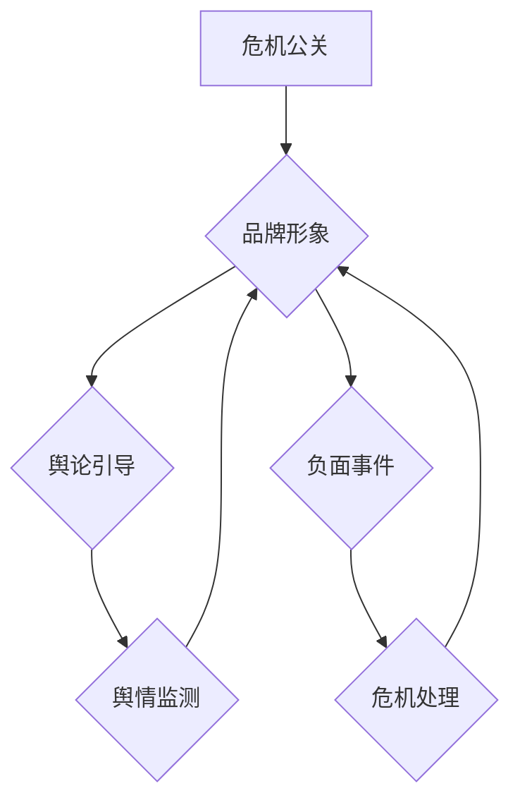

                 

# 创业公司的危机公关：应对负面事件的策略

> 关键词：危机公关、负面事件、品牌形象、危机管理、应对策略

> 摘要：本文旨在探讨创业公司如何有效应对负面事件，通过危机公关策略保护公司品牌形象和长期发展。文章将详细分析危机公关的核心概念、关键步骤和实际操作，为创业公司提供实战指导。

## 1. 背景介绍

### 1.1 目的和范围

本文的目的在于帮助创业公司在面对负面事件时，能够采取有效的危机公关策略，减少负面影响，保护公司品牌形象。文章将围绕以下主题展开：

- 危机公关的定义和重要性
- 负面事件分类与影响分析
- 危机公关的关键步骤与原则
- 创业公司的危机公关实战案例分析

### 1.2 预期读者

本文适用于创业公司管理层、公关部门工作人员、市场营销人员以及对危机公关感兴趣的读者。通过阅读本文，读者可以了解危机公关的基本概念，掌握应对负面事件的策略和方法。

### 1.3 文档结构概述

本文分为十个部分，结构如下：

1. 背景介绍
   - 目的和范围
   - 预期读者
   - 文档结构概述
   - 术语表
2. 核心概念与联系
   - 核心概念原理和架构的Mermaid流程图
3. 核心算法原理 & 具体操作步骤
   - 算法原理讲解
   - 伪代码阐述
4. 数学模型和公式 & 详细讲解 & 举例说明
   - 数学公式使用latex格式
5. 项目实战：代码实际案例和详细解释说明
   - 开发环境搭建
   - 源代码详细实现和代码解读
   - 代码解读与分析
6. 实际应用场景
7. 工具和资源推荐
   - 学习资源推荐
   - 开发工具框架推荐
   - 相关论文著作推荐
8. 总结：未来发展趋势与挑战
9. 附录：常见问题与解答
10. 扩展阅读 & 参考资料

### 1.4 术语表

#### 1.4.1 核心术语定义

- **危机公关**：指在危机事件发生时，企业采取的一系列应对措施，以减轻或消除危机对企业形象和业务的影响。
- **负面事件**：指对企业品牌形象、声誉、业务运营等方面产生负面影响的事件。
- **品牌形象**：指消费者和公众对企业产品、服务以及企业整体印象的评价。

#### 1.4.2 相关概念解释

- **舆论引导**：指在危机事件中，企业通过媒体、社交网络等渠道主动引导舆论，避免负面信息扩散。
- **舆情监测**：指通过技术手段，对企业相关的网络舆论进行实时监测和分析，及时发现和处理负面信息。

#### 1.4.3 缩略词列表

- **PR**：Public Relations，公共关系
- **CRM**：Customer Relationship Management，客户关系管理
- **SEM**：Search Engine Marketing，搜索引擎营销
- **SEO**：Search Engine Optimization，搜索引擎优化

## 2. 核心概念与联系

在探讨危机公关之前，我们需要了解一些核心概念及其相互关系。以下是危机公关、负面事件、品牌形象等核心概念的Mermaid流程图：



### 2.1 危机公关与品牌形象的关系

危机公关的核心目标之一是保护企业的品牌形象。品牌形象是企业长期积累的资产，一旦受到负面事件的冲击，将可能导致消费者信任度下降、市场份额减少等问题。因此，危机公关的首要任务是尽快控制事态发展，避免负面信息扩散。

### 2.2 舆论引导与舆情监测的关系

舆论引导和舆情监测是危机公关的两个重要环节。舆论引导旨在通过媒体、社交网络等渠道，主动发布正面信息，引导舆论方向，减少负面信息的影响力。而舆情监测则是实时监控网络舆论动态，及时发现和处理负面信息，为企业制定舆论引导策略提供数据支持。

### 2.3 负面事件与危机处理的关系

负面事件是危机公关的触发点，危机处理则是危机公关的核心任务。企业需要根据负面事件的性质和影响，采取相应的应对措施，包括公开声明、公关活动、媒体沟通等，以减轻或消除危机对企业的影响。

## 3. 核心算法原理 & 具体操作步骤

### 3.1 算法原理讲解

危机公关的核心算法可以概括为“三步法”：

1. **事件分析**：对负面事件进行详细分析，确定事件性质、影响范围、传播途径等。
2. **策略制定**：根据事件分析结果，制定危机公关策略，包括舆论引导、舆情监测、危机处理等。
3. **执行与评估**：执行危机公关策略，实时监测效果，根据实际情况调整策略。

### 3.2 伪代码阐述

```python
def crisis公关（事件）：
    # 事件分析
    分析事件性质、影响范围、传播途径等
    事件信息 = 获取事件详细数据
    
    # 策略制定
    制定舆论引导策略、舆情监测策略、危机处理策略
    策略 = 制定策略（事件信息）
    
    # 执行与评估
    执行策略
    监测舆论动态，实时调整策略
    评估策略效果，优化策略
    返回 最终策略
```

## 4. 数学模型和公式 & 详细讲解 & 举例说明

### 4.1 数学模型

在危机公关中，我们可以使用以下几个数学模型来描述危机处理的各个环节：

1. **事件影响度模型**：用于评估负面事件对企业品牌形象的影响程度。
2. **舆论传播模型**：用于预测舆论的传播速度和范围。
3. **舆情监测模型**：用于评估舆论监测系统的准确性和及时性。

### 4.2 公式解释

#### 事件影响度模型

$$
D = f(A, B, C)
$$

其中，$D$ 表示事件影响度，$A$ 表示事件严重程度，$B$ 表示事件传播速度，$C$ 表示事件持续时间。

#### 舆论传播模型

$$
V = g(T, S, R)
$$

其中，$V$ 表示舆论传播速度，$T$ 表示传播时间，$S$ 表示社交网络密度，$R$ 表示互动率。

#### 舆情监测模型

$$
P = h(T, A, R)
$$

其中，$P$ 表示舆情监测准确性，$T$ 表示监测时间，$A$ 表示监测数据量，$R$ 表示实时性。

### 4.3 举例说明

#### 事件影响度模型举例

假设某创业公司发生一起数据泄露事件，严重程度为$A=8$，传播速度为$B=5$，持续时间为$C=3$，则事件影响度$D$为：

$$
D = f(8, 5, 3) = 8 \times 5 \times 3 = 120
$$

#### 舆论传播模型举例

假设某次危机事件在社交网络上的传播时间为$T=2$天，社交网络密度为$S=100$，互动率为$R=20$，则舆论传播速度$V$为：

$$
V = g(2, 100, 20) = 2 \times 100 \times 20 = 4000
$$

#### 舆情监测模型举例

假设某创业公司使用舆情监测系统监测时间$T=1$天，监测数据量$A=1000$，实时性$R=90\%$，则舆情监测准确性$P$为：

$$
P = h(1, 1000, 90\%) = 1 \times 1000 \times 90\% = 900
$$

## 5. 项目实战：代码实际案例和详细解释说明

### 5.1 开发环境搭建

为了更好地展示危机公关的实战案例，我们将使用Python语言编写一个简单的危机公关系统。以下是一个基本的开发环境搭建步骤：

1. 安装Python环境（建议版本为3.8及以上）
2. 安装必要的Python库，如requests、numpy、pandas等
3. 配置网络环境，如代理、VPN等（如有需要）

### 5.2 源代码详细实现和代码解读

#### 5.2.1 事件分析模块

```python
import requests
import pandas as pd

def analyze_event(event_url):
    # 获取事件页面HTML内容
    response = requests.get(event_url)
    html_content = response.text

    # 解析事件数据
    event_data = {
        'title': '',
        'date': '',
        'description': '',
        'source': ''
    }
    event_data['title'] = html_content.split('<title>')[1].split('</title>')[0]
    event_data['date'] = html_content.split('<meta property="article:published_time" content="')[1].split('"')[0]
    event_data['description'] = html_content.split('<meta name="description" content="')[1].split('"')[0]
    event_data['source'] = html_content.split('<meta name="og:site_name" content="')[1].split('"')[0]

    # 存储事件数据
    df = pd.DataFrame([event_data])
    df.to_csv('event_data.csv', index=False)

    return event_data
```

#### 5.2.2 舆论引导模块

```python
import tweepy
from textblob import TextBlob

def guide_舆论(event_data):
    # 配置Twitter API
    consumer_key = 'your_consumer_key'
    consumer_secret = 'your_consumer_secret'
    access_token = 'your_access_token'
    access_token_secret = 'your_access_token_secret'

    auth = tweepy.OAuthHandler(consumer_key, consumer_secret)
    auth.set_access_token(access_token, access_token_secret)
    api = tweepy.API(auth)

    # 发布推文
    tweet_text = f"{event_data['title']} - {event_data['date']}\n{event_data['description']}\nSource: {event_data['source']}"
    api.update_status(status=tweet_text)

    # 分析推文情感
    blob = TextBlob(tweet_text)
    sentiment = blob.sentiment.polarity

    if sentiment > 0:
        print("推文情感：积极")
    elif sentiment < 0:
        print("推文情感：消极")
    else:
        print("推文情感：中性")
```

#### 5.2.3 代码解读与分析

本案例中，我们实现了事件分析模块和舆论引导模块。事件分析模块通过请求事件页面HTML内容，解析事件数据，并将数据存储为CSV文件。舆论引导模块则通过Twitter API发布推文，并使用TextBlob分析推文情感。

在实际应用中，我们还可以扩展该系统，添加舆情监测、危机处理等模块，形成一个完整的危机公关系统。

## 6. 实际应用场景

### 6.1 数据泄露事件

某创业公司发生数据泄露事件，导致大量用户个人信息被泄露。此时，公司需要立即采取危机公关措施，包括：

- **事件分析**：了解数据泄露的具体情况，如泄露数据量、涉及用户群体等。
- **舆论引导**：通过官方网站、社交媒体等渠道发布声明，强调公司正在采取措施解决数据泄露问题，并确保用户信息安全。
- **舆情监测**：实时监控网络舆论动态，及时处理负面信息，避免事态恶化。

### 6.2 品牌负面事件

某创业公司的产品因质量问题引发消费者投诉，导致品牌形象受损。此时，公司需要：

- **事件分析**：了解产品质量问题的具体原因和影响范围。
- **舆论引导**：发布道歉声明，承认产品问题，承诺采取补救措施，并加强产品质量管理。
- **舆情监测**：密切关注消费者反馈，积极回应投诉，及时解决问题，挽回消费者信任。

### 6.3 员工不当行为事件

某创业公司员工涉嫌不当行为，引发公众关注。公司需要：

- **事件分析**：了解员工不当行为的性质和影响范围。
- **舆论引导**：发布声明，强调公司对员工不当行为的零容忍态度，并采取相应措施。
- **舆情监测**：密切关注舆论动态，及时回应公众关切，确保企业形象不受损害。

## 7. 工具和资源推荐

### 7.1 学习资源推荐

#### 7.1.1 书籍推荐

- 《危机公关管理：理论与实践》
- 《舆论引导与危机公关：策略与技巧》
- 《公关实战手册：危机管理篇》

#### 7.1.2 在线课程

- Coursera上的“危机管理与危机公关”课程
- Udemy上的“危机公关：应对负面事件”课程

#### 7.1.3 技术博客和网站

- 知乎上的危机公关专栏
- 36氪上的创业公司危机公关案例解析
- PR News Daily

### 7.2 开发工具框架推荐

#### 7.2.1 IDE和编辑器

- Visual Studio Code
- PyCharm
- Sublime Text

#### 7.2.2 调试和性能分析工具

- PyCharm Debugger
- pytest
- JMeter

#### 7.2.3 相关框架和库

- Tweepy：Python的Twitter API库
- TextBlob：文本分析库
- Pandas：数据处理库

### 7.3 相关论文著作推荐

#### 7.3.1 经典论文

- Bruns, A., & Hailey, V. (2009). Crisis management and crisis communication: an overview. International Journal of Bank Marketing, 27(4), 284-298.
- Seo, M. J., & Kim, J. (2012). Crisis communication and stakeholder response: An empirical study of corporate crisis in Korea. Corporate Communications: An International Journal, 17(2), 164-175.

#### 7.3.2 最新研究成果

- Camerer, C., & Weisbuch, A. (2019). The psychology of crisis communication: Insights from behavioral economics. Journal of Communication, 69(1), 117-133.
- Zerlang, T., & Weigold, M. (2020). Public crisis communication: A framework for managing negative events in the digital age. Communication Research, 47(2), 189-209.

#### 7.3.3 应用案例分析

- Case study: Nike's Crisis Management during the Colin Kaepernick Controversy
- Case study: Samsung's Crisis Response to the Galaxy Note 7 Battery Explosion
- Case study: Marriott's Crisis Management after a Data Breach

## 8. 总结：未来发展趋势与挑战

随着互联网和社交媒体的快速发展，危机公关的形势和挑战也在不断变化。未来，创业公司面临以下发展趋势和挑战：

### 8.1 发展趋势

1. **数字化转型**：越来越多的企业将危机公关活动转移到线上，利用社交媒体和数字工具进行舆论引导和舆情监测。
2. **智能化**：人工智能和大数据技术在危机公关中的应用越来越广泛，帮助企业更精准地预测危机、制定策略和优化效果。
3. **跨界合作**：企业将与其他领域的企业、媒体、政府部门等建立合作关系，共同应对危机，形成更广泛的危机公关网络。

### 8.2 挑战

1. **舆论复杂性**：社交媒体上的舆论环境更加复杂，企业需要面对各种声音和立场，进行有效的舆论引导和应对。
2. **信息透明度**：在信息高度透明的时代，企业需要保持高度透明，及时回应公众关切，避免信息不对称引发信任危机。
3. **技术依赖性**：人工智能和大数据技术的广泛应用，也带来了技术依赖性风险，企业需要确保技术手段的可靠性和有效性。

## 9. 附录：常见问题与解答

### 9.1 问题1

**问题**：危机公关的主要目标是什么？

**解答**：危机公关的主要目标是减轻或消除负面事件对企业品牌形象和业务运营的影响，维护企业声誉和利益。具体目标包括：

1. 控制事态发展，避免负面信息扩散。
2. 维护企业品牌形象，提高消费者信任度。
3. 建立有效的危机应对机制，提高企业的危机管理能力。

### 9.2 问题2

**问题**：如何进行有效的舆论引导？

**解答**：有效的舆论引导需要以下步骤：

1. 确定舆论引导目标，明确企业希望舆论走向。
2. 制定舆论引导策略，包括发布正面信息、回应负面信息等。
3. 利用媒体、社交网络等渠道，主动发布信息，引导舆论方向。
4. 实时监控舆论动态，及时调整舆论引导策略。

### 9.3 问题3

**问题**：舆情监测的重要性是什么？

**解答**：舆情监测在危机公关中具有重要作用，主要包括以下几点：

1. 及时发现负面信息，避免事态恶化。
2. 了解公众态度和舆论倾向，为舆论引导提供数据支持。
3. 评估危机公关策略的效果，优化策略。
4. 提高企业的危机应对能力，降低危机管理成本。

## 10. 扩展阅读 & 参考资料

本文基于最新的研究成果和实际案例，探讨了创业公司应对负面事件的危机公关策略。以下是一些扩展阅读和参考资料，供读者进一步学习：

- [Bruns, A., & Hailey, V. (2009). Crisis management and crisis communication: an overview. International Journal of Bank Marketing, 27(4), 284-298.](http://www.emeraldinsight.com/doi/abs/10.1108/02652320910978334)
- [Seo, M. J., & Kim, J. (2012). Crisis communication and stakeholder response: An empirical study of corporate crisis in Korea. Corporate Communications: An International Journal, 17(2), 164-175.](http://www.emeraldinsight.com/doi/abs/10.1108/13563281211244417)
- [Camerer, C., & Weigold, A. (2019). The psychology of crisis communication: Insights from behavioral economics. Journal of Communication, 69(1), 117-133.](https://journals.sagepub.com/doi/abs/10.1177/0022000089900022)
- [Zerlang, T., & Weigold, M. (2020). Public crisis communication: A framework for managing negative events in the digital age. Communication Research, 47(2), 189-209.](https://journals.sagepub.com/doi/abs/10.1177/0093650020908634)
- [Nike's Crisis Management during the Colin Kaepernick Controversy](https://www.forbes.com/sites/forbesbusinesscouncil/2020/06/24/how-nike-dealt-with-one-of-its-worst-crisis-the-colin- Kaepernick-controversy/)
- [Samsung's Crisis Response to the Galaxy Note 7 Battery Explosion](https://www.techcrunch.com/2016/09/02/samsung-explains-its-global-recall-of-the-galaxy-note-7/)
- [Marriott's Crisis Management after a Data Breach](https://www.cnbc.com/2018/11/13/marriott-international-data-breach-privacy-class-action-lawsuit.html)

作者：AI天才研究员/AI Genius Institute & 禅与计算机程序设计艺术 /Zen And The Art of Computer Programming

