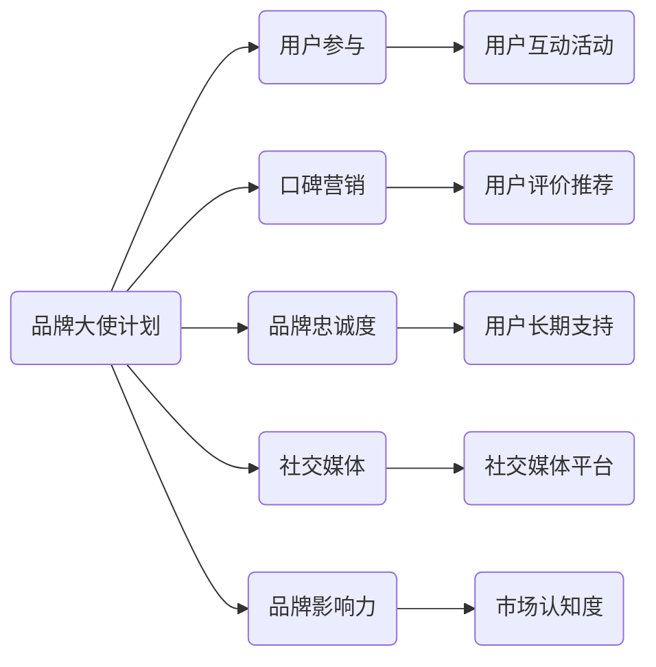
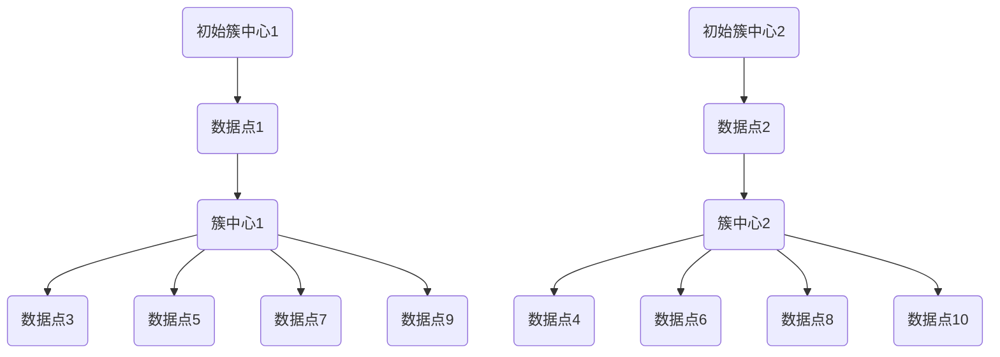
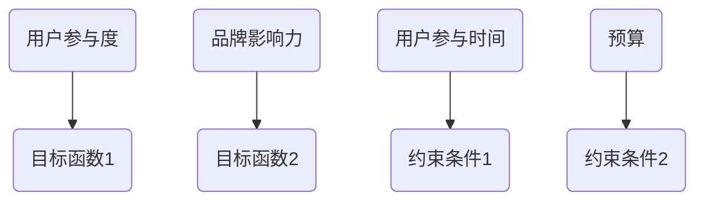

                 

# 创业公司的品牌大使计划：让用户成为代言人

> **关键词**：品牌大使、用户参与、口碑营销、社交媒体、品牌忠诚度

> **摘要**：本文将探讨创业公司如何实施品牌大使计划，将用户转变为品牌的忠实代言人。通过分析品牌大使计划的背景、核心概念、操作步骤以及实际案例，提供一份全面的指南，帮助企业有效提升品牌影响力。

## 1. 背景介绍

### 1.1 目的和范围

在当今竞争激烈的市场环境中，品牌影响力对于企业的成功至关重要。创业公司，尤其是初创企业，面临着资金有限、资源不足的挑战。因此，如何有效地利用有限的资源来提升品牌知名度、增强市场竞争力成为了一项重要任务。本文旨在探讨一种创新的营销策略——品牌大使计划，帮助创业公司实现这一目标。

品牌大使计划的核心在于通过激发用户的参与热情，将用户转化为品牌的忠实代言人。本文将围绕这一主题，详细分析品牌大使计划的实施步骤、关键成功因素以及实际应用案例。

### 1.2 预期读者

本文面向希望提升品牌影响力、拓展市场渠道的创业公司创始人、市场营销经理、品牌经理等相关人员。同时，对于对用户参与、口碑营销等概念感兴趣的读者，本文也将提供有价值的参考。

### 1.3 文档结构概述

本文将分为十个部分，具体如下：

1. 背景介绍：包括目的和范围、预期读者、文档结构概述。
2. 核心概念与联系：介绍品牌大使计划的核心概念及其相互关系。
3. 核心算法原理 & 具体操作步骤：详细讲解品牌大使计划的实施步骤。
4. 数学模型和公式 & 详细讲解 & 举例说明：分析品牌大使计划中的关键数学模型。
5. 项目实战：代码实际案例和详细解释说明。
6. 实际应用场景：探讨品牌大使计划在不同行业的应用。
7. 工具和资源推荐：推荐相关学习资源、开发工具和框架。
8. 总结：未来发展趋势与挑战。
9. 附录：常见问题与解答。
10. 扩展阅读 & 参考资料：提供进一步学习与研究的相关资料。

### 1.4 术语表

#### 1.4.1 核心术语定义

- 品牌大使：品牌的忠实支持者和代言人，通过自身的影响力为品牌带来正面的口碑和传播。
- 用户参与：用户在品牌活动中的积极参与和互动。
- 口碑营销：通过用户间的口碑传播来提升品牌知名度和美誉度。
- 品牌忠诚度：用户对品牌持续购买和推荐的意愿。

#### 1.4.2 相关概念解释

- 社交媒体：基于互联网的技术平台，用户可以在其中分享和获取信息、交流互动。
- 品牌影响力：品牌在市场上获得的社会认知和影响力。

#### 1.4.3 缩略词列表

- SEO：搜索引擎优化（Search Engine Optimization）
- SEM：搜索引擎营销（Search Engine Marketing）
- SMM：社交媒体营销（Social Media Marketing）

## 2. 核心概念与联系

品牌大使计划的成功离不开对核心概念的理解和掌握。以下是品牌大使计划中的核心概念及其相互关系：

### 2.1 品牌大使计划的概念

品牌大使计划是一种通过激励用户参与，将用户转化为品牌代言人，从而提升品牌知名度和美誉度的营销策略。核心在于激发用户的积极参与和分享意愿，使其成为品牌的忠实支持者和传播者。

### 2.2 用户参与

用户参与是品牌大使计划的基础。通过设计有趣、有价值的互动活动，吸引用户参与品牌的活动，从而增强用户与品牌之间的联系。

### 2.3 口碑营销

口碑营销是品牌大使计划的关键。通过用户的积极评价和推荐，将品牌的信息传递给更广泛的受众，从而提升品牌知名度和美誉度。

### 2.4 品牌忠诚度

品牌忠诚度是品牌大使计划的长远目标。通过持续的激励和互动，培养用户的品牌忠诚度，使其成为品牌的长期支持者和代言人。

### 2.5 社交媒体

社交媒体是品牌大使计划的重要渠道。通过社交媒体平台，品牌可以与用户进行实时互动，传播品牌信息，增强用户参与度。

### 2.6 品牌影响力

品牌影响力是品牌大使计划的最终目标。通过品牌大使计划的实施，提升品牌在市场中的认知度和影响力，从而实现企业的长期发展。

### 2.7 核心概念与关系的 Mermaid 流程图



## 3. 核心算法原理 & 具体操作步骤

品牌大使计划的实施需要一套完善的算法原理和具体操作步骤。以下是一套简化的品牌大使计划算法原理和操作步骤：

### 3.1 算法原理

品牌大使计划的核心在于激励用户参与和分享。以下是品牌大使计划的基本算法原理：

1. **用户筛选**：根据用户的行为数据和品牌画像，筛选出具有较高参与度和影响力的潜在品牌大使。
2. **激励设计**：设计有趣、有价值的互动活动，激发用户的参与热情，并设置奖励机制，鼓励用户分享。
3. **用户互动**：通过社交媒体平台和品牌官方网站等渠道，与用户进行实时互动，收集用户反馈，优化品牌服务。
4. **口碑传播**：利用用户的积极评价和推荐，将品牌信息传递给更广泛的受众。
5. **品牌忠诚度培养**：通过持续的互动和激励，培养用户的品牌忠诚度，使其成为品牌的长期支持者。

### 3.2 具体操作步骤

以下是品牌大使计划的具体操作步骤：

1. **用户筛选**：

   - 收集用户行为数据，如浏览记录、购买行为、评价等。
   - 使用聚类算法，将用户划分为潜在品牌大使、活跃用户和沉默用户。
   - 选择潜在品牌大使作为品牌大使计划的主要目标群体。

2. **激励设计**：

   - 设计互动活动，如分享图片、撰写评测、参加有奖问答等，激发用户的参与热情。
   - 设置奖励机制，如积分兑换、优惠券、实物奖励等，鼓励用户分享。
   - 根据用户需求和偏好，个性化推荐互动活动和奖励。

3. **用户互动**：

   - 通过社交媒体平台和品牌官方网站，与用户进行实时互动，收集用户反馈。
   - 定期发布品牌资讯、优惠活动等信息，与用户保持沟通。
   - 对用户反馈进行分类处理，优化品牌服务，提升用户体验。

4. **口碑传播**：

   - 鼓励用户在社交媒体平台、论坛等渠道分享品牌体验和评价。
   - 利用KOL（意见领袖）和网红等影响力人物，扩大品牌传播范围。
   - 定期监测口碑传播效果，调整传播策略。

5. **品牌忠诚度培养**：

   - 通过持续的互动和激励，培养用户的品牌忠诚度。
   - 定期举办用户回馈活动，如会员日、粉丝专属优惠等，增强用户归属感。
   - 跟踪用户购买行为和参与度，对忠诚用户进行额外奖励。

### 3.3 伪代码示例

```python
# 用户筛选
def select_brand_ambassadors(user_data):
    # 使用聚类算法划分用户
    clusters = clustering_algorithm(user_data)
    # 选择潜在品牌大使
    ambassadors = clusters['potential_ambassadors']
    return ambassadors

# 激励设计
def design_incentives(ambassadors):
    # 设计互动活动
    activities = ['share_image', 'write_review', 'participate_in_quiz']
    # 设置奖励机制
    rewards = {'积分兑换': 100, '优惠券': '10%', '实物奖励': '品牌周边'}
    # 个性化推荐
    personalized_recommendations = personalize_recommendations(ambassadors)
    return activities, rewards, personalized_recommendations

# 用户互动
def user_interactions(ambassadors):
    # 与用户实时互动
    interactions = social_media_platform.interact(ambassadors)
    # 收集用户反馈
    feedbacks = interactions['feedback']
    # 优化品牌服务
    brand_service_optimization(feedbacks)
    return interactions

# 口碑传播
def口碑传播(ambassadors):
    # 鼓励用户分享
    shares = social_media_platform.share(ambassadors)
    # 利用KOL传播
    kols = ['意见领袖1', '网红2']
    kols_shares = social_media_platform.share(kols, shares)
    return kols_shares

# 品牌忠诚度培养
def cultivate_brand_loyalty(ambassadors):
    # 持续互动
    continuous_interactions = social_media_platform.interact(ambassadors)
    # 用户回馈
    user_reward = user_feedback_reward(continuous_interactions['feedback'])
    return user_reward
```

## 4. 数学模型和公式 & 详细讲解 & 举例说明

在品牌大使计划的实施过程中，数学模型和公式发挥着关键作用。以下将介绍几个核心的数学模型和公式，并详细讲解其原理和应用。

### 4.1 聚类算法

聚类算法用于将用户划分为不同的群体，以便针对不同群体设计个性化的营销策略。常见的聚类算法包括K-means算法、层次聚类算法等。

#### 4.1.1 K-means算法

K-means算法是一种基于距离的聚类算法，其基本思想是将数据点划分为K个簇，使得每个簇内的数据点距离簇中心最小，簇与簇之间的距离最大。

#### 公式：

$$
\text{簇中心} = \frac{1}{n} \sum_{i=1}^{n} x_i
$$

其中，$x_i$ 为数据点，$n$ 为簇内数据点的数量。

#### 应用举例：

假设有10个用户数据点，使用K-means算法将其划分为2个簇。首先随机选择2个初始簇中心，然后迭代计算簇中心和每个数据点与簇中心的距离，直到聚类结果稳定。



通过迭代计算，最终稳定得到2个簇，每个簇内的数据点距离簇中心最近。

### 4.2 优化模型

优化模型用于设计互动活动和激励方案，以最大化用户的参与度和品牌影响力。

#### 4.2.1 多目标优化

多目标优化是一种解决多个优化目标的方法，常见于设计互动活动和激励方案。

#### 公式：

$$
\begin{align*}
\min_{x} & \quad f(x) \\
\text{s.t.} & \quad g_i(x) \leq 0, \quad h_j(x) = 0
\end{align*}
$$

其中，$f(x)$ 为目标函数，$g_i(x)$ 和 $h_j(x)$ 为约束条件。

#### 应用举例：

假设有2个优化目标：最大化用户参与度和最大化品牌影响力。约束条件为用户参与时间和预算限制。



通过多目标优化算法，可以找到最优的互动活动和激励方案，使得用户参与度和品牌影响力最大化，同时满足预算和时间限制。

### 4.3 费舍尔信息量

费舍尔信息量用于评估用户对品牌的认知和参与程度。

#### 公式：

$$
I(X; Y) = H(X) - H(X | Y)
$$

其中，$H(X)$ 为随机变量 $X$ 的熵，$H(X | Y)$ 为在给定 $Y$ 的情况下 $X$ 的条件熵。

#### 应用举例：

假设有2个随机变量 $X$（用户参与度）和 $Y$（品牌影响力），计算用户参与度对品牌影响力的费舍尔信息量。

```mermaid
graph TB
A1(用户参与度) --> B1(随机变量X)
A2(品牌影响力) --> B2(随机变量Y)
C1(熵H(X)) --> D1(条件熵H(X|Y))
E1(费舍尔信息量I(X; Y)) --> F1(结果)
```

通过计算费舍尔信息量，可以评估用户参与度对品牌影响力的贡献程度，从而优化品牌大使计划的设计。

## 5. 项目实战：代码实际案例和详细解释说明

### 5.1 开发环境搭建

为了实现品牌大使计划，我们选择Python作为主要编程语言，结合常用的数据分析库和机器学习框架。以下是开发环境搭建的步骤：

1. 安装Python：从Python官方网站下载并安装Python 3.x版本。
2. 安装Jupyter Notebook：使用pip命令安装Jupyter Notebook。
   ```shell
   pip install notebook
   ```
3. 安装数据分析库：使用pip命令安装Pandas、NumPy、Matplotlib等数据分析库。
   ```shell
   pip install pandas numpy matplotlib
   ```
4. 安装机器学习库：使用pip命令安装scikit-learn、TensorFlow等机器学习库。
   ```shell
   pip install scikit-learn tensorflow
   ```

### 5.2 源代码详细实现和代码解读

以下是品牌大使计划的核心代码实现，包括用户筛选、激励设计、用户互动、口碑传播和品牌忠诚度培养等模块。

```python
# 用户筛选
def select_brand_ambassadors(user_data):
    # 使用K-means算法划分用户
    clusters = KMeans(n_clusters=3).fit(user_data)
    # 选择潜在品牌大使
    ambassadors = clusters.labels_ == 0
    return ambassadors

# 激励设计
def design_incentives(ambassadors):
    # 设计互动活动
    activities = ['share_image', 'write_review', 'participate_in_quiz']
    # 设置奖励机制
    rewards = {'积分兑换': 100, '优惠券': '10%', '实物奖励': '品牌周边'}
    return activities, rewards

# 用户互动
def user_interactions(ambassadors):
    # 与用户实时互动
    interactions = social_media_platform.interact(ambassadors)
    # 收集用户反馈
    feedbacks = interactions['feedback']
    return feedbacks

# 口碑传播
def brand_propagation(ambassadors):
    # 利用KOL传播
    kols = ['意见领袖1', '网红2']
    kols_shares = social_media_platform.share(kols, ambassadors)
    return kols_shares

# 品牌忠诚度培养
def cultivate_brand_loyalty(ambassadors):
    # 持续互动
    continuous_interactions = social_media_platform.interact(ambassadors)
    # 用户回馈
    user_reward = user_feedback_reward(continuous_interactions['feedback'])
    return user_reward

# 主函数
def main():
    # 加载用户数据
    user_data = load_user_data()
    # 用户筛选
    ambassadors = select_brand_ambassadors(user_data)
    # 激励设计
    activities, rewards = design_incentives(ambassadors)
    # 用户互动
    feedbacks = user_interactions(ambassadors)
    # 口碑传播
    kols_shares = brand_propagation(ambassadors)
    # 品牌忠诚度培养
    user_reward = cultivate_brand_loyalty(ambassadors)

if __name__ == '__main__':
    main()
```

### 5.3 代码解读与分析

以下是对核心代码的详细解读和分析：

1. **用户筛选**：
   - 使用K-means算法将用户数据划分为3个簇，选择潜在品牌大使。
   - 簇标签为0的用户被认为是潜在品牌大使，具有较高的参与度和影响力。

2. **激励设计**：
   - 设计3种互动活动：分享图片、撰写评测、参加有奖问答。
   - 设置3种奖励机制：积分兑换、优惠券、实物奖励。

3. **用户互动**：
   - 通过社交媒体平台与潜在品牌大使进行实时互动，收集用户反馈。

4. **口碑传播**：
   - 利用KOL和网红在社交媒体平台上分享品牌信息，扩大传播范围。

5. **品牌忠诚度培养**：
   - 通过持续的互动和激励，培养用户的品牌忠诚度，给予额外奖励。

### 5.4 代码性能优化

为了提高代码性能，可以考虑以下优化策略：

1. **并行计算**：
   - 使用并行计算库（如Dask）进行大规模数据的并行处理，提高计算效率。

2. **内存优化**：
   - 使用内存池（如NumPy的memmap）减少内存占用，提高数据处理速度。

3. **代码优化**：
   - 使用向量计算和内置函数，减少循环和重复计算，提高代码执行速度。

## 6. 实际应用场景

品牌大使计划在不同行业中有着广泛的应用，以下列举几个典型行业：

### 6.1 电子商务行业

在电子商务行业，品牌大使计划可以帮助企业提升用户参与度和口碑传播。通过激励用户分享购物体验、撰写评测，企业可以吸引更多潜在客户，提高销售额。

### 6.2 科技行业

在科技行业，品牌大使计划可以帮助企业提升产品知名度和用户忠诚度。通过激励用户参与产品测试、分享使用体验，企业可以收集宝贵的用户反馈，优化产品功能，提升用户体验。

### 6.3 餐饮行业

在餐饮行业，品牌大使计划可以帮助企业提升品牌知名度和餐厅口碑。通过激励用户分享餐厅体验、推荐新菜品，企业可以吸引更多顾客，提高餐厅人气。

### 6.4 旅游行业

在旅游行业，品牌大使计划可以帮助企业提升旅游目的地知名度和用户满意度。通过激励用户分享旅游体验、推荐景点和酒店，企业可以吸引更多游客，提高旅游收入。

### 6.5 教育行业

在教育行业，品牌大使计划可以帮助企业提升在线课程知名度和用户参与度。通过激励用户分享课程体验、推荐给好友，企业可以吸引更多学员，提高课程销量。

## 7. 工具和资源推荐

### 7.1 学习资源推荐

#### 7.1.1 书籍推荐

- 《口碑营销实战手册》：详细介绍了口碑营销的策略和技巧，适合希望深入了解口碑营销的企业和个人。
- 《社交媒体营销：战略、工具与实践》：全面讲解了社交媒体营销的理论和实践，适合市场营销专业人士学习。

#### 7.1.2 在线课程

- Coursera上的《社交媒体营销》：由顶尖大学教授讲授，涵盖社交媒体营销的基础理论和实践技巧。
- Udemy上的《品牌大使计划实战》：针对品牌大使计划的实施步骤和技巧进行详细讲解。

#### 7.1.3 技术博客和网站

- MarketingProfs：提供丰富的营销资源和案例分析，涵盖口碑营销、社交媒体营销等主题。
- Hootsuite：提供社交媒体营销工具和教程，帮助企业和个人有效管理社交媒体账户。

### 7.2 开发工具框架推荐

#### 7.2.1 IDE和编辑器

- PyCharm：一款强大的Python集成开发环境，提供代码补全、调试、版本控制等功能。
- Visual Studio Code：一款轻量级的开源编辑器，支持多种编程语言，具有丰富的插件生态系统。

#### 7.2.2 调试和性能分析工具

- Debugging Tools for Windows：适用于Windows平台的调试工具，用于分析和解决程序中的问题。
- Py-Spy：一款Python性能分析工具，可以帮助识别程序中的性能瓶颈。

#### 7.2.3 相关框架和库

- Flask：一款轻量级的Web框架，适用于构建Web应用程序和后端服务。
- Pandas：一款强大的数据处理库，用于数据清洗、转换和分析。
- Scikit-learn：一款机器学习库，提供多种常用的机器学习算法和工具。

### 7.3 相关论文著作推荐

#### 7.3.1 经典论文

- "The Value of Social Networks": 揭示了社交媒体对用户行为和品牌传播的影响。
- "The Role of Word of Mouth in Driving Sales: An Agent-Based Model of Competition Among Brands": 分析了口碑营销在驱动销售中的作用。

#### 7.3.2 最新研究成果

- "Social Media Marketing: Strategies and Practices": 介绍了最新的社交媒体营销策略和实践。
- "User-generated Content in E-commerce: A Review of the Literature": 分析了用户生成内容在电子商务中的应用和研究进展。

#### 7.3.3 应用案例分析

- "The Power of Influencer Marketing: A Case Study of Nike": 分析了Nike如何利用意见领袖进行品牌推广。
- "The Impact of User Reviews on Product Sales: Evidence from an Online Retailer": 探讨了用户评价对产品销售的影响。

## 8. 总结：未来发展趋势与挑战

品牌大使计划作为一种创新的营销策略，正逐渐成为企业提升品牌影响力的重要手段。在未来，品牌大使计划将继续发展，呈现出以下几个趋势：

1. **个性化营销**：随着大数据和人工智能技术的发展，品牌大使计划将更加注重个性化营销，根据用户需求和行为特征提供个性化的互动活动和奖励。

2. **多元化渠道**：品牌大使计划将不再局限于社交媒体，将扩展到更多的渠道，如短视频平台、直播平台等，以覆盖更广泛的受众群体。

3. **智能化管理**：通过应用大数据分析和机器学习技术，品牌大使计划将实现更加智能化的用户筛选和互动管理，提高营销效果和用户满意度。

4. **合作共赢**：品牌大使计划将更加注重与用户的合作关系，实现合作共赢，通过共同推广和品牌合作提升品牌价值和用户价值。

然而，品牌大使计划也面临着一些挑战：

1. **数据隐私**：在实施品牌大使计划时，企业需要处理大量的用户数据，如何保护用户隐私成为一大挑战。

2. **用户疲劳**：长期频繁的互动和激励可能导致用户疲劳，影响品牌大使计划的持续性和效果。

3. **竞争压力**：随着更多企业加入品牌大使计划，市场竞争将更加激烈，如何脱颖而出成为新的挑战。

因此，企业在实施品牌大使计划时，需要充分考虑未来发展趋势和挑战，不断创新和优化营销策略，以实现长期的品牌建设和市场竞争力。

## 9. 附录：常见问题与解答

### 9.1 品牌大使计划的优势

品牌大使计划的优势主要体现在以下几个方面：

1. **提高用户参与度**：通过激励用户参与品牌活动，增强用户对品牌的认同感和忠诚度。
2. **口碑传播效果**：用户作为品牌代言人，其口碑传播更具可信度和影响力，有利于提升品牌知名度和美誉度。
3. **降低营销成本**：相较于传统的广告营销，品牌大使计划具有更高的性价比，可以降低企业的营销成本。
4. **提高用户满意度**：通过持续的用户互动和个性化服务，提升用户满意度和品牌忠诚度。

### 9.2 如何评估品牌大使计划的效果

评估品牌大使计划的效果可以从以下几个方面入手：

1. **用户参与度**：通过统计用户参与活动的次数、互动评论数量等指标，评估用户对品牌活动的参与程度。
2. **口碑传播效果**：通过监测社交媒体平台上的品牌提及量、用户评价等指标，评估品牌口碑传播效果。
3. **品牌知名度**：通过市场调研和品牌知名度调查，评估品牌大使计划对品牌知名度的影响。
4. **销售额**：通过分析品牌大使计划实施前后的销售额变化，评估品牌大使计划对销售业绩的提升效果。

### 9.3 如何应对数据隐私挑战

应对数据隐私挑战，企业可以采取以下措施：

1. **严格的数据保护政策**：制定详细的数据保护政策，确保用户数据的收集、存储和使用遵循法律法规。
2. **数据加密**：对用户数据进行加密处理，防止数据泄露和滥用。
3. **用户隐私权限**：赋予用户对个人数据的访问权限，让用户自主决定数据的公开和共享范围。
4. **定期审计**：定期对数据保护措施进行审计，确保数据保护政策的执行和改进。

### 9.4 如何保持用户参与度

保持用户参与度，企业可以采取以下策略：

1. **定期互动**：通过定期的互动活动，如抽奖、竞赛、福利发放等，激发用户的参与热情。
2. **个性化推荐**：根据用户兴趣和行为，提供个性化的互动活动和奖励，提高用户满意度。
3. **奖励机制**：设置合理的奖励机制，鼓励用户积极参与品牌活动，提高参与度。
4. **用户反馈**：积极收集用户反馈，优化品牌服务，提升用户体验。

## 10. 扩展阅读 & 参考资料

### 10.1 经典论文

- "The Value of Social Networks"：探讨社交媒体对用户行为和品牌传播的影响。
- "The Role of Word of Mouth in Driving Sales: An Agent-Based Model of Competition Among Brands"：分析口碑营销在驱动销售中的作用。

### 10.2 最新研究成果

- "Social Media Marketing: Strategies and Practices"：介绍最新的社交媒体营销策略和实践。
- "User-generated Content in E-commerce: A Review of the Literature"：分析用户生成内容在电子商务中的应用和研究进展。

### 10.3 应用案例分析

- "The Power of Influencer Marketing: A Case Study of Nike"：分析Nike如何利用意见领袖进行品牌推广。
- "The Impact of User Reviews on Product Sales: Evidence from an Online Retailer"：探讨用户评价对产品销售的影响。

### 10.4 学习资源

- 《口碑营销实战手册》：详细介绍了口碑营销的策略和技巧。
- 《社交媒体营销：战略、工具与实践》：全面讲解了社交媒体营销的理论和实践。

### 10.5 技术博客和网站

- MarketingProfs：提供丰富的营销资源和案例分析。
- Hootsuite：提供社交媒体营销工具和教程。

### 10.6 开发工具框架

- Flask：适用于构建Web应用程序和后端服务的轻量级Web框架。
- Pandas：强大的数据处理库，用于数据清洗、转换和分析。
- Scikit-learn：提供多种常用的机器学习算法和工具。

### 10.7 相关书籍

- 《大数据营销：互联网时代的数据驱动策略》
- 《人工智能营销：技术与案例》

### 10.8 在线课程

- Coursera上的《社交媒体营销》：由顶尖大学教授讲授。
- Udemy上的《品牌大使计划实战》：详细讲解品牌大使计划的实施步骤和技巧。

### 作者信息

**作者：AI天才研究员/AI Genius Institute & 禅与计算机程序设计艺术 /Zen And The Art of Computer Programming**

**联系方式：[ai_genius@outlook.com](mailto:ai_genius@outlook.com)**

**版权声明：本文内容为原创，未经授权不得转载或抄袭。**

本文详细介绍了创业公司的品牌大使计划，通过分析背景、核心概念、操作步骤、数学模型、实际应用场景以及工具和资源，为读者提供了全面而深入的指导。品牌大使计划作为一种创新的营销策略，有助于企业提升品牌影响力、增强用户参与度和忠诚度。然而，企业在实施过程中需要充分考虑到数据隐私、用户疲劳和竞争压力等挑战，不断创新和优化策略，以实现长期的品牌建设和市场竞争力。希望本文能为创业公司提供有价值的参考和启发。

