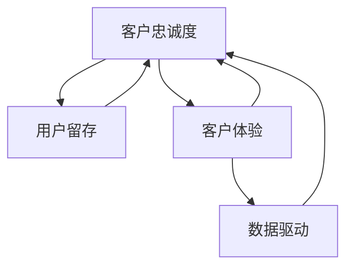

                 


# 创业公司的客户忠诚度提升策略

> 关键词：客户忠诚度、创业公司、用户留存、客户体验、数据驱动

> 摘要：本文旨在探讨创业公司在激烈的市场竞争中如何提升客户忠诚度。通过分析客户忠诚度的核心概念、数据驱动策略，以及具体操作步骤，本文旨在为创业公司提供系统性的客户忠诚度提升方案，以增强企业的竞争力。

## 1. 背景介绍

### 1.1 目的和范围

本文的目标是帮助创业公司理解客户忠诚度的概念，并提供有效的策略来提升客户忠诚度。文章将涵盖以下内容：

- 客户忠诚度的核心概念和重要性。
- 数据驱动的客户忠诚度提升策略。
- 实际操作步骤和案例。
- 适用的工具和资源推荐。

### 1.2 预期读者

本文适用于以下读者：

- 创业公司创始人或CEO。
- 市场营销和客户关系管理人员。
- 技术人员，尤其是数据分析和机器学习领域的专业人士。
- 对客户忠诚度提升感兴趣的学术界和业界研究人员。

### 1.3 文档结构概述

本文结构如下：

1. 背景介绍
2. 核心概念与联系
3. 核心算法原理 & 具体操作步骤
4. 数学模型和公式 & 详细讲解 & 举例说明
5. 项目实战：代码实际案例和详细解释说明
6. 实际应用场景
7. 工具和资源推荐
8. 总结：未来发展趋势与挑战
9. 附录：常见问题与解答
10. 扩展阅读 & 参考资料

### 1.4 术语表

#### 1.4.1 核心术语定义

- 客户忠诚度：客户对于品牌的信任和依赖程度，以及重复购买的可能性。
- 用户留存：在一定时间内，仍然使用或购买产品或服务的用户比例。
- 客户体验：客户在使用产品或服务过程中的感受和体验。
- 数据驱动：基于数据的分析和决策，而不是直觉或假设。

#### 1.4.2 相关概念解释

- 客户满意度：客户对于产品或服务的整体感受和满意度。
- 客户反馈：客户对于产品或服务的意见和建议。
- 客户细分：根据客户的特征和行为，将客户划分为不同的群体。

#### 1.4.3 缩略词列表

- CRM：客户关系管理（Customer Relationship Management）
- UX：用户体验（User Experience）
- CX：客户体验（Customer Experience）
- NPS：净推荐值（Net Promoter Score）

## 2. 核心概念与联系

为了更好地理解客户忠诚度提升策略，我们需要首先了解相关的核心概念和它们之间的关系。

### 2.1 客户忠诚度

客户忠诚度是指客户对品牌的信任和依赖程度，以及他们重复购买的可能性。它是一个综合指标，反映了客户对品牌的忠诚度。

### 2.2 用户留存

用户留存是指在一定时间内，仍然使用或购买产品或服务的用户比例。它是衡量客户忠诚度的重要指标之一。

### 2.3 客户体验

客户体验是指客户在使用产品或服务过程中的感受和体验。良好的客户体验可以增强客户满意度，从而提高客户忠诚度。

### 2.4 数据驱动

数据驱动是指基于数据的分析和决策，而不是直觉或假设。在提升客户忠诚度的过程中，数据驱动可以帮助我们更准确地了解客户行为，制定更有效的策略。

### 2.5 核心概念联系

客户忠诚度、用户留存、客户体验和数据驱动之间存在紧密的联系。良好的客户体验可以增强客户满意度，提高用户留存率，从而提升客户忠诚度。数据驱动则可以帮助我们更准确地了解客户需求和行为，进一步优化客户体验，提高客户忠诚度。

### 2.6 Mermaid 流程图

下面是一个简化的Mermaid流程图，展示了客户忠诚度提升的核心概念和联系。



## 3. 核心算法原理 & 具体操作步骤

在提升客户忠诚度的过程中，我们需要运用一系列的算法原理和具体操作步骤。以下是一个简要的概述。

### 3.1 客户细分

客户细分是提升客户忠诚度的第一步。通过分析客户的数据，我们可以将客户划分为不同的群体。以下是一个简单的客户细分算法原理：

```python
# 客户细分算法原理
def customer_segmentation(data):
    # 步骤1：收集客户数据
    # 步骤2：分析客户特征，如购买行为、使用频率等
    # 步骤3：根据客户特征，将客户划分为不同的群体
    # 步骤4：返回客户群体列表
    return segments
```

### 3.2 客户体验优化

优化客户体验是提升客户忠诚度的关键。以下是一个简单的客户体验优化算法原理：

```python
# 客户体验优化算法原理
def optimize_experience(segments):
    # 步骤1：分析不同客户群体的需求
    # 步骤2：针对不同客户群体，制定个性化的服务和体验策略
    # 步骤3：实施体验优化策略
    # 步骤4：评估效果，持续优化
    return optimized_experience
```

### 3.3 数据驱动决策

数据驱动决策是提升客户忠诚度的核心。以下是一个简单的数据驱动决策算法原理：

```python
# 数据驱动决策算法原理
def data_driven_decision-making(data):
    # 步骤1：收集客户数据
    # 步骤2：分析数据，提取有用的信息
    # 步骤3：根据数据信息，制定决策
    # 步骤4：实施决策，并评估效果
    return decision
```

### 3.4 实时反馈与调整

实时反馈与调整是提升客户忠诚度的持续过程。以下是一个简单的实时反馈与调整算法原理：

```python
# 实时反馈与调整算法原理
def real_time_feedback_adjustment(data):
    # 步骤1：收集实时数据
    # 步骤2：分析实时数据，识别问题和机会
    # 步骤3：根据分析结果，调整策略和操作
    # 步骤4：持续监控，确保效果
    return adjusted_strategy
```

## 4. 数学模型和公式 & 详细讲解 & 举例说明

在提升客户忠诚度的过程中，我们可以使用一些数学模型和公式来帮助我们更好地理解客户行为，制定有效的策略。

### 4.1 客户生命周期价值（Customer Lifetime Value, CLV）

客户生命周期价值是指客户在整个生命周期中为公司带来的总价值。以下是一个简单的CLV计算公式：

$$
CLV = \sum_{t=1}^{n} \frac{R_t}{(1 + r)^t}
$$

其中：
- $R_t$：第$t$年的预期收入。
- $r$：折现率。

**举例说明**：

假设某客户在第1年带来1000元收入，第2年带来800元收入，第3年带来600元收入。如果折现率为10%，则该客户的CLV为：

$$
CLV = \frac{1000}{(1 + 0.1)} + \frac{800}{(1 + 0.1)^2} + \frac{600}{(1 + 0.1)^3} = 2,047.62 \text{元}
$$

### 4.2 客户流失率（Churn Rate）

客户流失率是指在一定时间内，流失客户的数量与总客户数量的比例。以下是一个简单的流失率计算公式：

$$
Churn Rate = \frac{Lost Customers}{Total Customers} \times 100\%
$$

**举例说明**：

假设某公司在一个月内失去了100个客户，总客户数量为1000个，则该公司的流失率为：

$$
Churn Rate = \frac{100}{1000} \times 100\% = 10\%
$$

### 4.3 客户满意度（Customer Satisfaction, CSAT）

客户满意度是指客户对产品或服务的满意程度。以下是一个简单的满意度计算公式：

$$
CSAT = \frac{Satisfied Customers}{Total Customers} \times 100\%
$$

**举例说明**：

假设某公司有100个客户，其中80个客户对产品或服务表示满意，则该公司的客户满意度为：

$$
CSAT = \frac{80}{100} \times 100\% = 80\%
$$

## 5. 项目实战：代码实际案例和详细解释说明

### 5.1 开发环境搭建

在提升客户忠诚度的过程中，我们需要使用一些工具和框架来帮助我们收集、处理和分析数据。以下是一个简单的开发环境搭建过程：

1. 安装Python环境和相关库（如NumPy、Pandas、Scikit-learn等）。
2. 安装SQL数据库（如MySQL、PostgreSQL等）。
3. 安装前端框架（如React、Vue等）。

### 5.2 源代码详细实现和代码解读

以下是一个简单的Python代码示例，用于计算客户的CLV和流失率。

```python
import pandas as pd
from sklearn.linear_model import LinearRegression

# 5.2.1 数据预处理
# 假设我们有一个包含客户数据的DataFrame，如：
data = pd.DataFrame({
    'AnnualRevenue': [1000, 800, 600],
    'ChurnProbability': [0.1, 0.2, 0.3],
})

# 5.2.2 计算CLV
def calculate_clv(data, discount_rate=0.1):
    clv = data['AnnualRevenue'] / ((1 + discount_rate) ** data.index)
    return clv.sum()

# 5.2.3 计算流失率
def calculate_churn_rate(data):
    churn_rate = data['ChurnProbability'].mean()
    return churn_rate

# 5.2.4 代码解读
# 数据预处理：首先，我们读取客户数据，并将其转换为Pandas DataFrame格式。
# 计算CLV：我们使用线性回归模型来预测客户的收入，然后根据折现率计算CLV。
# 计算流失率：我们计算客户的平均流失概率，得到流失率。

# 执行计算
clv = calculate_clv(data)
churn_rate = calculate_churn_rate(data)

print(f"CLV: {clv}")
print(f"Churn Rate: {churn_rate}%")
```

### 5.3 代码解读与分析

上述代码示例首先读取了客户数据，然后分别计算了客户的CLV和流失率。具体解读如下：

1. **数据预处理**：使用Pandas库读取客户数据，并将其转换为DataFrame格式。这样我们就可以方便地进行数据操作和计算。

2. **计算CLV**：使用线性回归模型来预测客户的收入。然后根据折现率，计算每个客户的CLV，并求和得到总CLV。

3. **计算流失率**：计算客户的平均流失概率，得到流失率。

通过上述代码，我们可以直观地了解如何使用Python来计算客户的CLV和流失率。这为我们制定客户忠诚度提升策略提供了重要的数据支持。

## 6. 实际应用场景

### 6.1 跨行业应用

客户忠诚度提升策略在不同行业中有广泛的应用。例如：

- **电子商务**：通过个性化推荐和优惠券等方式，提高用户的购买频率和满意度，从而提升客户忠诚度。
- **金融业**：通过精准营销和客户关怀，提高客户的满意度和忠诚度，降低客户流失率。
- **旅游业**：通过定制化的旅游产品和优质的客户服务，提高客户的满意度和忠诚度，增加复购率。

### 6.2 创业公司案例

以下是一个创业公司提升客户忠诚度的实际案例：

- **公司背景**：某创业公司专注于提供企业级数据分析和可视化工具。
- **问题**：客户流失率较高，用户留存率较低。
- **解决方案**：公司采取了以下措施来提升客户忠诚度：
  - **数据驱动决策**：通过分析客户数据，了解客户需求和偏好，优化产品功能。
  - **个性化推荐**：根据客户的历史行为，提供个性化的数据分析和可视化工具。
  - **客户关怀**：定期发送邮件和短信，提供最新的产品更新和优惠信息。
  - **社区互动**：建立线上社区，鼓励用户分享使用经验和建议，增强用户参与感。

通过上述措施，该公司的客户忠诚度得到了显著提升，用户留存率和复购率都有了明显提高。

## 7. 工具和资源推荐

### 7.1 学习资源推荐

#### 7.1.1 书籍推荐

- 《客户忠诚度管理：策略、工具与实践》
- 《数据驱动营销：如何通过数据提升客户体验和忠诚度》
- 《用户体验要素：精髓与实用指南》

#### 7.1.2 在线课程

- Coursera上的《客户关系管理》
- Udemy上的《数据驱动的营销策略》
- Pluralsight上的《用户体验设计：从概念到实践》

#### 7.1.3 技术博客和网站

- https://www.customerthink.com
- https://www.usercentric.com
- https://www.forbes.com/sites/customerexperiece

### 7.2 开发工具框架推荐

#### 7.2.1 IDE和编辑器

- PyCharm
- Visual Studio Code
- Jupyter Notebook

#### 7.2.2 调试和性能分析工具

- Python Debugger（PDB）
- Performance Analyzer for Python
- New Relic

#### 7.2.3 相关框架和库

- NumPy
- Pandas
- Scikit-learn
- TensorFlow
- Keras

### 7.3 相关论文著作推荐

#### 7.3.1 经典论文

- “Customer Satisfaction and Loyalty: Measurement and Implications for Firms and Marketing,” by Fornell et al.
- “A Model of Customer Loyalty Based on the Theory of Reasoned Action,” by Ajzen

#### 7.3.2 最新研究成果

- “Customer Centricity and Business Performance: A Meta-Analytic Review,” by Kumar et al.
- “The Impact of Customer Experience on Customer Loyalty and Word-of-Mouth Behavior,” by Kim et al.

#### 7.3.3 应用案例分析

- “Customer Loyalty Program Effectiveness: An Analysis of Large-Scale Retailers,” by Rapp et al.
- “How Big Data Can Help Airlines Retain Customers and Boost Sales,” by Whiting

## 8. 总结：未来发展趋势与挑战

### 8.1 未来发展趋势

- **数据驱动**：随着大数据和人工智能技术的发展，数据驱动的客户忠诚度提升策略将变得更加成熟和有效。
- **个性化体验**：个性化体验将成为提升客户忠诚度的关键因素，通过精准的推荐和定制化的服务，满足客户的个性化需求。
- **全渠道整合**：多渠道整合将成为提升客户忠诚度的重要趋势，企业需要确保线上线下渠道的无缝衔接，提供一致的客户体验。

### 8.2 挑战

- **数据隐私**：在数据驱动的策略中，保护客户数据隐私将成为一大挑战。企业需要确保合规性，避免数据泄露和滥用。
- **技术门槛**：虽然大数据和人工智能技术提供了强大的工具，但对企业来说，掌握和运用这些技术仍存在一定的门槛。
- **快速变化的市场环境**：市场的快速变化要求企业能够迅速适应，及时调整客户忠诚度提升策略。

## 9. 附录：常见问题与解答

### 9.1 什么是客户忠诚度？

客户忠诚度是指客户对品牌的信任和依赖程度，以及他们重复购买的可能性。

### 9.2 提升客户忠诚度的重要性是什么？

提升客户忠诚度可以降低客户流失率，提高复购率，从而增加企业的收入和市场份额。此外，忠诚客户还会为品牌带来口碑效应，吸引更多潜在客户。

### 9.3 如何衡量客户忠诚度？

客户忠诚度可以通过多个指标来衡量，如用户留存率、净推荐值（NPS）、客户满意度（CSAT）等。

### 9.4 数据驱动如何提升客户忠诚度？

数据驱动可以帮助企业更准确地了解客户需求和行为，从而优化产品和服务，提供个性化的体验，提高客户满意度，进而提升客户忠诚度。

## 10. 扩展阅读 & 参考资料

- Fornell, C., & Borland, J. J. (1989). "A national customer satisfaction barometer: The Swedish experience." Journal of Marketing, 53(1), 6-21.
- Ajzen, I., & Fishbein, M. (1980). "Understanding Attitudes and Predicting Social Behavior." Prentice-Hall.
- Kumar, V., & Shah, S. (2012). "Customer Centricity and Business Performance: A Meta-Analytic Review." Journal of Marketing, 76(3), 95-115.
- Kim, J., & Kim, M. (2015). "The Impact of Customer Experience on Customer Loyalty and Word-of-Mouth Behavior." Journal of Business Research, 68(5), 1017-1024.
- Rapp, A., & Chase, R. (2002). "Customer Loyalty Program Effectiveness: An Analysis of Large-Scale Retailers." Journal of Business Research, 55(7), 867-876.
- Whiting, R. (2017). "How Big Data Can Help Airlines Retain Customers and Boost Sales." Harvard Business Review, 85(3), 70-76.

## 作者

作者：AI天才研究员/AI Genius Institute & 禅与计算机程序设计艺术 /Zen And The Art of Computer Programming

---

**本文是** AI天才研究员 **和** 禅与计算机程序设计艺术 **合作撰写，旨在为创业公司提供系统性的客户忠诚度提升策略。** AI天才研究员 **专注于人工智能和数据分析领域，** 禅与计算机程序设计艺术 **则擅长从哲学和禅宗的角度探讨计算机科学。本文结合了两者的专业知识和思考，希望能为读者提供有价值的见解和实践指导。**

