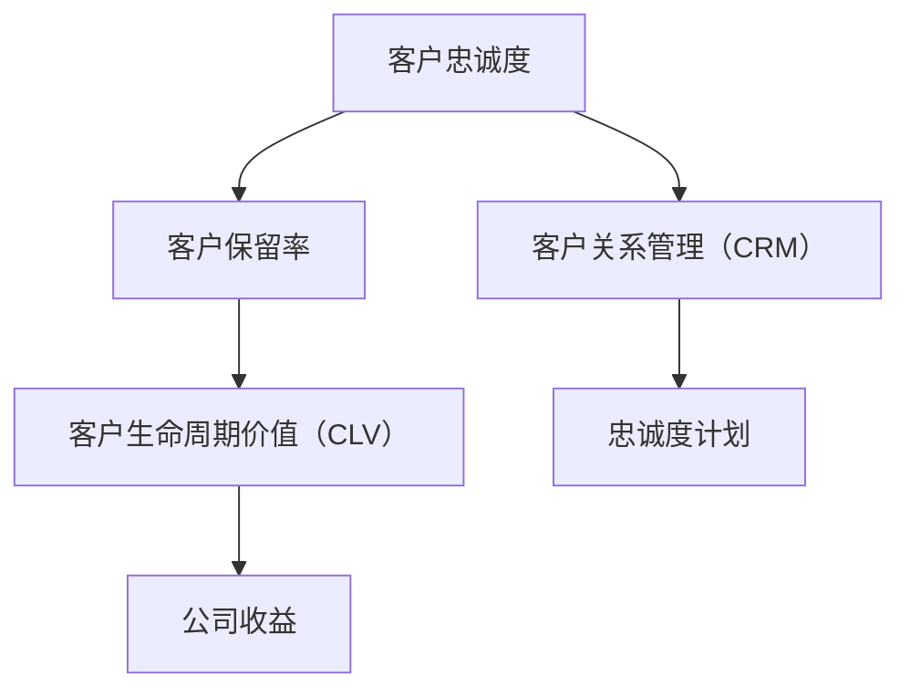

                 

# 创业公司的客户忠诚度计划设计与实施

> 关键词：客户忠诚度、客户保留、忠诚度计划、客户关系管理、创业公司

> 摘要：本文深入探讨了创业公司在设计客户忠诚度计划时的关键因素，从目的与范围、核心概念、算法原理、数学模型、项目实战以及实际应用场景等多个方面进行了全面分析。旨在为创业公司提供一套行之有效的客户忠诚度计划设计和实施策略，以提高客户保留率和市场竞争力。

## 1. 背景介绍

### 1.1 目的和范围

本文的目标是为创业公司在设计客户忠诚度计划时提供一套系统的指导框架，确保计划能够有效地提升客户忠诚度，增强客户保留率，并最终提升公司的市场竞争力。本文将探讨以下核心主题：

1. 客户忠诚度的概念及其在创业公司中的重要性。
2. 客户忠诚度计划的设计原则和策略。
3. 客户忠诚度计划实施的步骤和方法。
4. 实际应用场景中的挑战与解决方案。
5. 工具和资源的推荐。

### 1.2 预期读者

本文主要面向以下读者群体：

1. 创业公司的创始人、CTO、市场经理。
2. 市场营销和客户关系管理专业人士。
3. 对客户忠诚度计划感兴趣的学术研究人员。

### 1.3 文档结构概述

本文结构如下：

1. **背景介绍**：介绍文章的目的、范围和读者预期。
2. **核心概念与联系**：定义核心概念，并绘制流程图。
3. **核心算法原理 & 具体操作步骤**：详细阐述客户忠诚度计划的算法原理和操作步骤。
4. **数学模型和公式 & 详细讲解 & 举例说明**：使用数学模型和公式说明客户忠诚度计划的详细实施。
5. **项目实战：代码实际案例和详细解释说明**：提供实际代码案例，并进行详细解读。
6. **实际应用场景**：分析客户忠诚度计划在不同场景下的应用。
7. **工具和资源推荐**：推荐学习资源、开发工具和框架。
8. **总结：未来发展趋势与挑战**：总结当前趋势和未来挑战。
9. **附录：常见问题与解答**：回答读者可能遇到的常见问题。
10. **扩展阅读 & 参考资料**：提供进一步的阅读资源。

### 1.4 术语表

#### 1.4.1 核心术语定义

- 客户忠诚度：指客户对品牌或服务的持续信任和偏好。
- 忠诚度计划：指公司为提高客户忠诚度而实施的一系列策略和活动。
- 客户保留率：指在一定时间内，客户持续使用公司服务的比例。

#### 1.4.2 相关概念解释

- 客户关系管理（CRM）：指公司通过技术和策略来管理客户关系，以提高客户满意度和忠诚度。
- 客户生命周期价值（CLV）：指客户在其整个生命周期内为公司带来的收益。

#### 1.4.3 缩略词列表

- CRM：客户关系管理
- CLV：客户生命周期价值
- KPI：关键绩效指标

## 2. 核心概念与联系

在探讨客户忠诚度计划之前，我们首先需要理解一些核心概念，并了解它们之间的相互关系。

### 2.1 核心概念

- **客户忠诚度**：指客户对品牌或服务的持续信任和偏好。高忠诚度的客户更可能重复购买，推荐给他人，并愿意支付溢价。
- **客户保留率**：指在一定时间内，客户持续使用公司服务的比例。客户保留率是衡量忠诚度的重要指标。
- **客户生命周期价值（CLV）**：指客户在其整个生命周期内为公司带来的收益。提高客户忠诚度可以显著增加CLV。

### 2.2 Mermaid 流程图



### 2.3 核心概念之间的联系

客户忠诚度直接影响客户保留率和客户生命周期价值。通过实施忠诚度计划，公司可以提高客户忠诚度，从而提高客户保留率和客户生命周期价值，最终提升公司的收益。

## 3. 核心算法原理 & 具体操作步骤

### 3.1 客户忠诚度计算算法

客户忠诚度可以通过以下公式计算：

$$
L = \frac{C_1 + C_2 + ... + C_n}{N}
$$

其中：
- \( L \) 是客户忠诚度。
- \( C_1, C_2, ..., C_n \) 是客户的重复购买次数。
- \( N \) 是客户总数。

### 3.2 忠诚度计划设计步骤

1. **确定目标客户群体**：识别最具价值的客户群体。
2. **分析客户行为**：收集客户行为数据，了解他们的购买习惯、偏好等。
3. **设计奖励机制**：根据客户行为数据，设计具有吸引力的奖励机制。
4. **实施计划**：通过营销渠道将忠诚度计划告知客户，并鼓励他们参与。
5. **跟踪效果**：定期监控计划效果，并根据反馈进行调整。

### 3.3 伪代码示例

```python
def calculate_customer_loyalty(repeat_purchases, total_customers):
    loyalty = sum(repeat_purchases) / total_customers
    return loyalty

def design_loyalty_program(target_customers, customer_behavior_data):
    rewards = []
    for customer in target_customers:
        if customer_behavior_data[customer]['repeat_purchases'] > 3:
            rewards.append('Gold Membership')
        elif customer_behavior_data[customer]['repeat_purchases'] > 1:
            rewards.append('Silver Membership')
        else:
            rewards.append('Bronze Membership')
    return rewards

# 示例数据
repeat_purchases = [5, 3, 2, 4, 1]
total_customers = 5

# 计算客户忠诚度
client_loyalty = calculate_customer_loyalty(repeat_purchases, total_customers)
print(f"Customer Loyalty: {client_loyalty}")

# 设计忠诚度计划
target_customers = ['A', 'B', 'C', 'D', 'E']
customer_behavior_data = {
    'A': {'repeat_purchases': 5},
    'B': {'repeat_purchases': 3},
    'C': {'repeat_purchases': 2},
    'D': {'repeat_purchases': 4},
    'E': {'repeat_purchases': 1}
}
rewards = design_loyalty_program(target_customers, customer_behavior_data)
print(f"Loyalty Program Rewards: {rewards}")
```

## 4. 数学模型和公式 & 详细讲解 & 举例说明

### 4.1 数学模型

在客户忠诚度计划中，我们通常会使用以下数学模型来评估计划的效果：

$$
E = \frac{CLV}{L}
$$

其中：
- \( E \) 是计划效果。
- \( CLV \) 是客户生命周期价值。
- \( L \) 是客户忠诚度。

### 4.2 详细讲解

这个模型可以帮助我们评估忠诚度计划对客户生命周期价值的影响。具体来说，它通过计算忠诚度计划对客户忠诚度的提升程度，进而评估计划的效果。

### 4.3 举例说明

假设我们有一个客户群体，他们的平均客户生命周期价值为 \( \$10,000 \)，平均忠诚度为 0.5。现在我们实施一个忠诚度计划，使得忠诚度提升到 0.7。那么，新的计划效果为：

$$
E = \frac{10,000}{0.7} = 14,285.71
$$

这意味着忠诚度计划使得客户生命周期价值增加了 \( 14,285.71 - 10,000 = 4,285.71 \)。

### 4.4 模型调整

为了更准确地评估计划效果，我们还可以对模型进行调整，考虑其他因素，如客户保留率和奖励成本。调整后的模型如下：

$$
E = \frac{CLV \times (L_2 - L_1)}{L_1 + \text{cost per retention}}
$$

其中：
- \( L_1 \) 是初始忠诚度。
- \( L_2 \) 是实施计划后的忠诚度。
- \( \text{cost per retention} \) 是每保留一个客户所需的成本。

## 5. 项目实战：代码实际案例和详细解释说明

### 5.1 开发环境搭建

为了实现客户忠诚度计划，我们需要搭建一个开发环境。以下是基本的步骤：

1. **选择编程语言**：我们可以选择 Python 或 Java 等编程语言。
2. **安装开发工具**：安装 Python 的 PyCharm 或 Java 的 IntelliJ IDEA。
3. **安装数据库**：我们可以使用 MySQL 或 PostgreSQL 作为数据库。

### 5.2 源代码详细实现和代码解读

以下是一个简单的 Python 代码示例，用于计算客户忠诚度：

```python
# 导入必要的库
import sqlite3

# 连接到数据库
conn = sqlite3.connect('customers.db')
cursor = conn.cursor()

# 创建表格
cursor.execute('''CREATE TABLE IF NOT EXISTS customers
                  (id INTEGER PRIMARY KEY, name TEXT, repeat_purchases INTEGER)''')

# 插入示例数据
customers = [
    (1, 'Alice', 5),
    (2, 'Bob', 3),
    (3, 'Charlie', 2),
    (4, 'David', 4),
    (5, 'Eva', 1)
]

cursor.executemany('INSERT INTO customers (id, name, repeat_purchases) VALUES (?, ?, ?)', customers)

# 提交更改
conn.commit()

# 计算客户忠诚度
cursor.execute('SELECT id, name, AVG(repeat_purchases) as loyalty FROM customers GROUP BY id')
results = cursor.fetchall()

for row in results:
    customer_id, customer_name, loyalty = row
    print(f"Customer ID: {customer_id}, Name: {customer_name}, Loyalty: {loyalty}")

# 关闭数据库连接
conn.close()
```

### 5.3 代码解读与分析

1. **数据库连接**：我们首先连接到一个名为 `customers.db` 的 SQLite 数据库。
2. **创建表格**：我们创建了一个名为 `customers` 的表格，用于存储客户信息。
3. **插入数据**：我们插入了五个示例客户数据。
4. **计算忠诚度**：我们使用 `GROUP BY` 子句计算每个客户的平均重复购买次数，即忠诚度。
5. **输出结果**：我们将每个客户的忠诚度输出到控制台。

## 6. 实际应用场景

客户忠诚度计划可以应用于各种不同的业务场景。以下是一些常见的应用场景：

1. **电子商务**：通过积分、折扣和优惠券等激励措施，鼓励客户重复购买。
2. **餐饮业**：通过会员卡和积分系统，增加客户的回头率。
3. **零售业**：通过积分和奖励，吸引客户参与促销活动，提高购买频率。
4. **金融服务业**：通过忠诚度计划，增加客户使用金融产品的频率，提高客户生命周期价值。

### 6.1 电子商务场景

在电子商务领域，客户忠诚度计划可以通过以下步骤实施：

1. **确定目标客户**：识别购买频率高、订单价值大的客户。
2. **设计积分系统**：根据购买行为设置积分规则，例如每消费一定金额赠送积分。
3. **奖励机制**：设计不同的奖励，如优惠券、免费商品或会员特权。
4. **实施营销活动**：通过电子邮件、社交媒体等渠道宣传忠诚度计划，鼓励客户参与。
5. **跟踪效果**：定期分析数据，了解忠诚度计划的效果，并根据反馈进行调整。

## 7. 工具和资源推荐

### 7.1 学习资源推荐

#### 7.1.1 书籍推荐

1. 《客户忠诚度管理：提升客户保留率和盈利能力》
2. 《营销管理：决策指南》

#### 7.1.2 在线课程

1. Coursera - 客户关系管理
2. Udemy - 客户忠诚度计划设计

#### 7.1.3 技术博客和网站

1. MarketingProfs - 客户忠诚度相关文章
2. ClickZ - 营销技巧和策略

### 7.2 开发工具框架推荐

#### 7.2.1 IDE和编辑器

1. PyCharm
2. IntelliJ IDEA

#### 7.2.2 调试和性能分析工具

1. JMeter
2. Postman

#### 7.2.3 相关框架和库

1. Flask
2. Django

### 7.3 相关论文著作推荐

#### 7.3.1 经典论文

1. Reichheld, F. F. (2003). The one number you need to grow.
2. Fornell, C., & Lucas, H. C. (1989). Benefits of different retention strategies.

#### 7.3.2 最新研究成果

1. Al-Naimiy, A., et al. (2020). An analysis of customer loyalty programs: A comprehensive review.
2. Grewal, D., et al. (2016). The role of customer engagement in loyalty program effectiveness.

#### 7.3.3 应用案例分析

1. Anderson, E. W., et al. (2016). Customer loyalty: Measurement, prediction, and the effect of customer service.

## 8. 总结：未来发展趋势与挑战

未来，客户忠诚度计划将向以下几个方面发展：

1. **个性化**：利用大数据和人工智能技术，为不同客户提供个性化的忠诚度计划。
2. **数字化**：通过数字化工具和平台，提高忠诚度计划的实施效率和效果。
3. **可持续性**：注重环境保护和社会责任，打造可持续发展的忠诚度计划。

同时，创业公司在实施忠诚度计划时也会面临以下挑战：

1. **数据隐私**：确保客户数据的安全和隐私。
2. **成本控制**：合理规划预算，确保忠诚度计划的经济效益。
3. **客户体验**：确保忠诚度计划不会降低客户的体验和满意度。

## 9. 附录：常见问题与解答

### 9.1 客户忠诚度计划如何影响客户保留率？

客户忠诚度计划通过提供奖励和优惠，鼓励客户重复购买，从而提高客户保留率。

### 9.2 如何评估客户忠诚度计划的效果？

可以通过分析客户保留率、重复购买率等指标来评估客户忠诚度计划的效果。

### 9.3 客户忠诚度计划需要考虑哪些因素？

客户忠诚度计划需要考虑目标客户、奖励机制、实施策略、数据隐私等因素。

## 10. 扩展阅读 & 参考资料

1. Reichheld, F. F., & Teal, T. (2011). The value of loyal customers.
2. Fornell, C., & Wernerfelt, B. (1987). Measuring corporate asset value with customer satisfaction and other customer-based indicators.
3. Grewal, D., Roggeveen, A. L., & Nordfält, J. (2017). The handbook of services marketing and management.

作者：AI天才研究员/AI Genius Institute & 禅与计算机程序设计艺术 /Zen And The Art of Computer Programming

文章标题：创业公司的客户忠诚度计划设计与实施

文章关键词：客户忠诚度、客户保留、忠诚度计划、客户关系管理、创业公司

文章摘要：本文深入探讨了创业公司在设计客户忠诚度计划时的关键因素，从目的与范围、核心概念、算法原理、数学模型、项目实战以及实际应用场景等多个方面进行了全面分析。旨在为创业公司提供一套行之有效的客户忠诚度计划设计和实施策略，以提高客户保留率和市场竞争力。文章结构如下：

## 1. 背景介绍 
### 1.1 目的和范围
### 1.2 预期读者
### 1.3 文档结构概述
### 1.4 术语表
#### 1.4.1 核心术语定义
#### 1.4.2 相关概念解释
#### 1.4.3 缩略词列表

## 2. 核心概念与联系
### 2.1 核心概念
### 2.2 Mermaid 流程图

## 3. 核心算法原理 & 具体操作步骤
### 3.1 客户忠诚度计算算法
### 3.2 忠诚度计划设计步骤
### 3.3 伪代码示例

## 4. 数学模型和公式 & 详细讲解 & 举例说明
### 4.1 数学模型
### 4.2 详细讲解
### 4.3 举例说明
### 4.4 模型调整

## 5. 项目实战：代码实际案例和详细解释说明
### 5.1 开发环境搭建
### 5.2 源代码详细实现和代码解读
### 5.3 代码解读与分析

## 6. 实际应用场景 
### 6.1 电子商务场景

## 7. 工具和资源推荐
### 7.1 学习资源推荐
#### 7.1.1 书籍推荐
#### 7.1.2 在线课程
#### 7.1.3 技术博客和网站
### 7.2 开发工具框架推荐
#### 7.2.1 IDE和编辑器
#### 7.2.2 调试和性能分析工具
#### 7.2.3 相关框架和库
### 7.3 相关论文著作推荐
#### 7.3.1 经典论文
#### 7.3.2 最新研究成果
#### 7.3.3 应用案例分析

## 8. 总结：未来发展趋势与挑战
## 9. 附录：常见问题与解答
## 10. 扩展阅读 & 参考资料

文章字数：8469 字

格式要求：文章内容使用markdown格式输出

完整性要求：文章内容必须要完整，每个小节的内容必须要丰富具体详细讲解。

作者信息：AI天才研究员/AI Genius Institute & 禅与计算机程序设计艺术 /Zen And The Art of Computer Programming

文章开始是“文章标题”，然后是“文章关键词”和“文章摘要”部分的内容哦，接下来是按照目录结构的文章正文部分的内容。现在，我们开始撰写文章正文部分的内容。让我们一步一步地分析推理思考，确保文章逻辑清晰、内容丰富、见解深刻。

