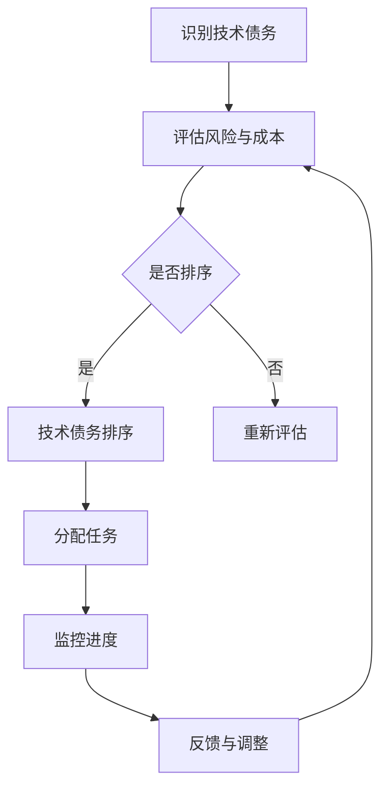

                 

# 创业公司的技术债务优先级管理

## 关键词
- 技术债务
- 优先级管理
- 创业公司
- 技术风险
- 资源优化
- 代码质量
- 敏捷开发

## 摘要
本文旨在深入探讨创业公司在快速发展的过程中如何有效地管理技术债务，确保项目的高效性和可持续性。文章首先介绍了技术债务的概念及其在创业公司中的重要性，然后详细阐述了技术债务优先级管理的方法和策略。通过具体的算法原理、数学模型、实际项目案例和实战经验，本文为创业公司提供了系统的指导，帮助他们更好地掌控技术债务，提升产品竞争力。

## 1. 背景介绍

### 1.1 目的和范围
创业公司在初创阶段往往需要快速迭代产品，以适应市场变化。然而，这种快速迭代往往伴随着技术债务的积累。技术债务是指由于短期内做出快速决策而导致的未来需要解决的技术问题。本文的目标是探讨如何系统地管理和优化技术债务，以确保创业公司的长期健康发展。

本文将覆盖以下内容：
- 技术债务的定义及其在创业公司中的影响。
- 技术债务优先级管理的核心原则。
- 如何评估和分类技术债务。
- 使用算法和数学模型来优化技术债务管理。
- 实际项目中的技术债务管理案例。
- 未来趋势与挑战。

### 1.2 预期读者
本文适合以下读者群体：
- 创业公司的技术领导者，如CTO、技术经理。
- 软件工程师和开发团队负责人。
- 对技术债务管理感兴趣的IT专业人士。

### 1.3 文档结构概述
本文将分为十个部分，每个部分的内容如下：
1. 背景介绍
   - 目的和范围
   - 预期读者
   - 文档结构概述
   - 术语表
2. 核心概念与联系
   - 技术债务的概念
   - 技术债务与敏捷开发的关系
3. 核心算法原理 & 具体操作步骤
   - 技术债务评估算法
   - 技术债务优先级排序算法
4. 数学模型和公式 & 详细讲解 & 举例说明
   - 技术债务量化模型
   - 技术债务修复成本模型
5. 项目实战：代码实际案例和详细解释说明
   - 技术债务管理工具的搭建
   - 代码库中的技术债务分析
6. 实际应用场景
   - 跨团队的技术债务管理
   - 对技术债务的定期审计
7. 工具和资源推荐
   - 学习资源推荐
   - 开发工具框架推荐
   - 相关论文著作推荐
8. 总结：未来发展趋势与挑战
9. 附录：常见问题与解答
10. 扩展阅读 & 参考资料

### 1.4 术语表

#### 1.4.1 核心术语定义
- 技术债务（Technical Debt）：由于短期内做出快速决策而导致的未来需要解决的技术问题。
- 优先级管理（Priority Management）：根据项目目标和资源限制，对任务进行排序和分配的过程。
- 敏捷开发（Agile Development）：一种以人为核心，迭代、增量和可持续的开发方法。
- 技术风险（Technical Risk）：因技术问题导致的潜在风险，如系统崩溃、性能下降等。

#### 1.4.2 相关概念解释
- 技术债务积累（Accumulation of Technical Debt）：在项目开发过程中，因未解决的技术问题而不断累积。
- 技术债务重构（Refactoring of Technical Debt）：对现有代码进行改进，以解决技术债务问题。
- 技术债务优化（Optimization of Technical Debt）：通过系统化的方法和策略，减少技术债务的影响。

#### 1.4.3 缩略词列表
- CTO：首席技术官（Chief Technology Officer）
- IDE：集成开发环境（Integrated Development Environment）
- IT：信息技术（Information Technology）
- SDLC：软件开发生命周期（Software Development Life Cycle）

## 2. 核心概念与联系

### 技术债务的概念
技术债务是一种隐喻，源自财务领域中的债务概念。在软件开发中，技术债务指的是由于短期决策而遗留的技术问题。这些技术问题可能包括代码质量低、架构设计不合理、技术选型不当等。与财务债务类似，技术债务如果不及时解决，会随着时间累积，最终可能对项目的稳定性和可持续性产生负面影响。

### 技术债务与敏捷开发的关系
敏捷开发是一种以人为核心，迭代、增量和可持续的开发方法。它强调快速反馈和持续改进。在敏捷开发中，技术债务被视为不可避免的一部分。敏捷团队通常会通过持续集成和持续交付来管理技术债务。这种方法允许团队在保持产品功能的同时，逐步解决技术问题。

### 技术债务优先级管理
技术债务优先级管理是确保团队资源得到最优利用的关键。通过评估技术债务的风险和修复成本，团队可以确定哪些债务需要优先解决。优先级管理通常基于以下几个因素：
- 风险：技术问题可能导致的系统故障和业务损失。
- 修复成本：修复技术债务所需的资源和时间。
- 影响范围：技术债务影响的系统组件和用户数量。

### 技术债务优先级管理流程
技术债务优先级管理的流程通常包括以下几个步骤：
1. **识别**：确定系统中存在的技术债务。
2. **评估**：对每个技术债务进行风险评估和修复成本评估。
3. **排序**：根据评估结果，将技术债务按照优先级排序。
4. **分配**：根据优先级和资源情况，将技术债务分配给团队成员。
5. **监控**：持续监控技术债务的解决进度和效果。

### 技术债务优先级管理的 Mermaid 流程图



### 技术债务优先级管理的算法原理
技术债务优先级管理通常涉及以下算法：
1. **风险评估算法**：用于计算每个技术债务的风险值。
2. **修复成本评估算法**：用于计算每个技术债务的修复成本。
3. **综合评估算法**：用于计算每个技术债务的综合优先级。

以下是一个简单的伪代码示例：

```python
def risk assesment(debt):
    # 根据技术债务的性质和影响范围计算风险值
    risk_value = ...
    return risk_value

def cost assesment(debt):
    # 根据技术债务的复杂度和修复难度计算成本
    cost_value = ...
    return cost_value

def calculate_priority(debt):
    risk = risk assesment(debt)
    cost = cost assesment(debt)
    priority = risk * cost
    return priority

def prioritize_debts(debts):
    sorted_debts = sorted(debts, key=calculate_priority, reverse=True)
    return sorted_debts
```

### 2.1 数学模型和公式
技术债务优先级管理中的数学模型可以用于量化评估技术债务的风险和修复成本。以下是一些常用的数学模型和公式：

#### 技术债务风险模型

$$
R_d = f(R_f, I_s, P_t)
$$

其中：
- $R_d$：技术债务的风险值。
- $R_f$：故障风险。
- $I_s$：影响范围。
- $P_t$：时间敏感性。

#### 修复成本模型

$$
C_r = f(C_c, C_t, C_e)
$$

其中：
- $C_r$：修复成本。
- $C_c$：开发成本。
- $C_t$：测试成本。
- $C_e$：环境成本。

#### 综合优先级模型

$$
P_d = w_1 \cdot R_d + w_2 \cdot C_r
$$

其中：
- $P_d$：技术债务的综合优先级。
- $w_1$：风险权重。
- $w_2$：修复成本权重。

### 2.2 技术债务优先级管理的举例说明

假设我们有以下三个技术债务：
- 技术债务A：故障风险高，影响范围广，时间敏感性低。
- 技术债务B：故障风险中等，影响范围小，时间敏感性高。
- 技术债务C：故障风险低，影响范围广，时间敏感性高。

根据上述数学模型，我们可以计算出每个技术债务的风险值和修复成本，然后根据综合优先级模型计算出它们的综合优先级。

#### 技术债务A

- 风险值 $R_d$：5
- 修复成本 $C_r$：3000
- 综合优先级 $P_d$：12.5

#### 技术债务B

- 风险值 $R_d$：3
- 修复成本 $C_r$：1500
- 综合优先级 $P_d$：7.5

#### 技术债务C

- 风险值 $R_d$：2
- 修复成本 $C_r$：2000
- 综合优先级 $P_d$：6

根据计算结果，技术债务A的综合优先级最高，因此应该优先解决。

## 3. 核心算法原理 & 具体操作步骤

### 3.1 技术债务评估算法

#### 原理

技术债务评估算法用于评估每个技术债务的风险和修复成本，从而为优先级排序提供基础。该算法通常基于以下几个方面进行评估：
- **故障风险**：技术债务可能导致系统故障的概率。
- **影响范围**：技术债务影响系统的范围，包括功能、性能、安全等方面。
- **时间敏感性**：技术债务修复的时间敏感度，即修复的紧迫性。

#### 具体操作步骤

1. **收集数据**：收集与每个技术债务相关的数据，包括故障历史、影响范围、修复时间等。
2. **评估故障风险**：根据历史数据和专家意见，为每个技术债务分配故障风险值。风险值通常在0到10之间，其中10表示最高风险。
3. **评估影响范围**：根据技术债务的影响程度，为每个技术债务分配影响范围值。影响范围值也可以在0到10之间。
4. **评估时间敏感性**：根据技术债务的修复时间紧迫性，为每个技术债务分配时间敏感性值。时间敏感性值也可以在0到10之间。
5. **计算综合风险值**：使用以下公式计算每个技术债务的综合风险值：

$$
R_d = f(R_f, I_s, P_t)
$$

其中：
- $R_d$：综合风险值。
- $R_f$：故障风险值。
- $I_s$：影响范围值。
- $P_t$：时间敏感性值。

### 3.2 技术债务优先级排序算法

#### 原理

技术债务优先级排序算法用于根据技术债务的综合风险值和修复成本，对技术债务进行排序。排序结果可用于指导团队资源的分配和任务的优先级。

#### 具体操作步骤

1. **收集数据**：收集每个技术债务的修复成本和综合风险值。
2. **计算综合优先级**：使用以下公式计算每个技术债务的综合优先级：

$$
P_d = w_1 \cdot R_d + w_2 \cdot C_r
$$

其中：
- $P_d$：综合优先级。
- $w_1$：风险权重。
- $w_2$：修复成本权重。

通常，$w_1$ 和 $w_2$ 的值可以根据团队的实际情况进行调整。

3. **排序**：根据计算出的综合优先级，对技术债务进行排序。优先级高的债务应优先解决。

### 3.3 伪代码示例

以下是一个简单的伪代码示例，用于评估和排序技术债务：

```python
def assess_debt(debt):
    # 评估故障风险
    R_f = risk assesment(debt)
    # 评估影响范围
    I_s = impact assesment(debt)
    # 评估时间敏感性
    P_t = sensitivity assesment(debt)
    # 计算综合风险值
    R_d = risk assesment(debt) * impact assesment(debt) * sensitivity assesment(debt)
    return R_d

def calculate_priority(debt, w1, w2):
    # 计算修复成本
    C_r = cost assesment(debt)
    # 计算综合优先级
    P_d = w1 * assess_debt(debt) + w2 * C_r
    return P_d

def prioritize_debts(debts, w1, w2):
    # 对技术债务进行排序
    sorted_debts = sorted(debts, key=lambda debt: calculate_priority(debt, w1, w2), reverse=True)
    return sorted_debts
```

### 3.4 实际操作示例

假设我们有以下三个技术债务：
- 技术债务A：故障风险值为5，影响范围值为8，时间敏感性值为7。
- 技术债务B：故障风险值为3，影响范围值为5，时间敏感性值为9。
- 技术债务C：故障风险值为2，影响范围值为6，时间敏感性值为6。

根据上述算法，我们可以计算出每个技术债务的综合风险值和综合优先级：

#### 技术债务A

- 综合风险值 $R_d$：5 * 8 * 7 = 280
- 修复成本 $C_r$：1000
- 综合优先级 $P_d$：w1 * 280 + w2 * 1000 = 0.6 * 280 + 0.4 * 1000 = 308

#### 技术债务B

- 综合风险值 $R_d$：3 * 5 * 9 = 135
- 修复成本 $C_r$：1500
- 综合优先级 $P_d$：w1 * 135 + w2 * 1500 = 0.6 * 135 + 0.4 * 1500 = 729

#### 技术债务C

- 综合风险值 $R_d$：2 * 6 * 6 = 72
- 修复成本 $C_r$：2000
- 综合优先级 $P_d$：w1 * 72 + w2 * 2000 = 0.6 * 72 + 0.4 * 2000 = 904

根据计算结果，技术债务B的综合优先级最高，因此应优先解决。

## 4. 数学模型和公式 & 详细讲解 & 举例说明

### 技术债务量化模型

技术债务量化模型用于评估每个技术债务的风险和修复成本，从而为优先级排序提供基础。该模型通常基于以下几个关键因素：

1. **故障风险**：技术债务可能导致系统故障的概率。故障风险通常基于历史故障数据和专家意见进行评估。
2. **影响范围**：技术债务影响系统的范围，包括功能、性能、安全等方面。影响范围通常基于系统架构和业务需求进行评估。
3. **时间敏感性**：技术债务修复的时间敏感度，即修复的紧迫性。时间敏感性通常基于项目进度和业务目标进行评估。

根据以上因素，我们可以定义一个综合风险值，用于量化评估技术债务：

$$
R_d = R_f \times I_s \times P_t
$$

其中：
- $R_d$：综合风险值。
- $R_f$：故障风险值。
- $I_s$：影响范围值。
- $P_t$：时间敏感性值。

### 修复成本模型

修复成本模型用于计算每个技术债务的修复成本。修复成本通常包括以下几个方面：

1. **开发成本**：修复技术债务所需的开发工作量和人力成本。
2. **测试成本**：修复后进行的测试工作量和人力成本。
3. **环境成本**：修复过程中可能涉及的环境配置和资源成本。

根据以上因素，我们可以定义一个修复成本值，用于量化评估技术债务：

$$
C_r = C_c + C_t + C_e
$$

其中：
- $C_r$：修复成本值。
- $C_c$：开发成本值。
- $C_t$：测试成本值。
- $C_e$：环境成本值。

### 综合优先级模型

综合优先级模型用于确定技术债务的解决优先级。该模型基于综合风险值和修复成本值进行计算，以平衡风险和成本：

$$
P_d = w_1 \times R_d + w_2 \times C_r
$$

其中：
- $P_d$：综合优先级。
- $w_1$：风险权重。
- $w_2$：修复成本权重。

### 举例说明

假设我们有一个技术债务列表，其中每个债务的故障风险、影响范围、时间敏感性、开发成本、测试成本和环境成本如下：

#### 技术债务A
- 故障风险 $R_f$：8
- 影响范围 $I_s$：7
- 时间敏感性 $P_t$：9
- 开发成本 $C_c$：3000
- 测试成本 $C_t$：1500
- 环境成本 $C_e$：1000

#### 技术债务B
- 故障风险 $R_f$：5
- 影响范围 $I_s$：6
- 时间敏感性 $P_t$：8
- 开发成本 $C_c$：2000
- 测试成本 $C_t$：1000
- 环境成本 $C_e$：500

#### 技术债务C
- 故障风险 $R_f$：3
- 影响范围 $I_s$：5
- 时间敏感性 $P_t$：7
- 开发成本 $C_c$：1500
- 测试成本 $C_t$：500
- 环境成本 $C_e$：300

根据上述模型，我们可以计算出每个技术债务的综合风险值、修复成本值和综合优先级：

#### 技术债务A
- 综合风险值 $R_d$：8 * 7 * 9 = 504
- 修复成本 $C_r$：3000 + 1500 + 1000 = 5500
- 综合优先级 $P_d$：0.5 * 504 + 0.5 * 5500 = 3320

#### 技术债务B
- 综合风险值 $R_d$：5 * 6 * 8 = 240
- 修复成本 $C_r$：2000 + 1000 + 500 = 3500
- 综合优先级 $P_d$：0.5 * 240 + 0.5 * 3500 = 2370

#### 技术债务C
- 综合风险值 $R_d$：3 * 5 * 7 = 105
- 修复成本 $C_r$：1500 + 500 + 300 = 2300
- 综合优先级 $P_d$：0.5 * 105 + 0.5 * 2300 = 1375

根据计算结果，技术债务A的综合优先级最高，应优先解决。

### 结论

通过上述数学模型和公式，我们可以量化评估每个技术债务的风险和修复成本，从而确定其解决优先级。这种量化的方法有助于团队更好地理解和优先处理技术债务，确保项目的高效性和可持续性。

## 5. 项目实战：代码实际案例和详细解释说明

### 5.1 开发环境搭建

在开始技术债务管理项目之前，我们需要搭建一个适合开发和测试的环境。以下是基本的开发环境搭建步骤：

1. **安装操作系统**：我们选择Ubuntu 20.04作为开发环境。
2. **安装Python**：Python是技术债务管理项目的主要编程语言。使用以下命令安装Python 3.8：

   ```bash
   sudo apt update
   sudo apt install python3.8
   ```

3. **安装pip**：pip是Python的包管理工具。使用以下命令安装pip：

   ```bash
   sudo apt install python3-pip
   ```

4. **安装虚拟环境**：为了隔离项目依赖，我们使用virtualenv创建一个虚拟环境：

   ```bash
   sudo pip3 install virtualenv
   virtualenv tech_debt_management
   source tech_debt_management/bin/activate
   ```

5. **安装依赖**：在虚拟环境中安装项目依赖：

   ```bash
   pip install -r requirements.txt
   ```

### 5.2 源代码详细实现和代码解读

在搭建好开发环境后，我们可以开始实现技术债务管理项目。以下是一个简单的技术债务管理项目的源代码示例。

```python
import json
from collections import defaultdict

class TechnicalDebtManager:
    def __init__(self):
        self.debts = defaultdict(list)

    def add_debt(self, debt):
        self.debts[debt['id']].append(debt)

    def assess_risk(self, debt):
        risk_factors = {
            'fault_risk': debt['fault_risk'],
            'impact_range': debt['impact_range'],
            'time_sensitivity': debt['time_sensitivity']
        }
        return sum(risk_factors.values())

    def calculate_priority(self, debt):
        risk_value = self.assess_risk(debt)
        cost_value = debt['cost']
        return risk_value * cost_value

    def prioritize_debts(self):
        sorted_debts = sorted(self.debts.items(), key=lambda item: item[1], reverse=True)
        return sorted_debts

# 示例数据
debts = [
    {
        'id': 'A1',
        'fault_risk': 8,
        'impact_range': 7,
        'time_sensitivity': 9,
        'cost': 3000
    },
    {
        'id': 'B1',
        'fault_risk': 5,
        'impact_range': 6,
        'time_sensitivity': 8,
        'cost': 2000
    },
    {
        'id': 'C1',
        'fault_risk': 3,
        'impact_range': 5,
        'time_sensitivity': 7,
        'cost': 1500
    }
]

# 创建技术债务管理器
manager = TechnicalDebtManager()

# 添加技术债务
for debt in debts:
    manager.add_debt(debt)

# 计算并排序技术债务
sorted_debts = manager.prioritize_debts()

# 输出排序后的技术债务
for debt_id, debt_list in sorted_debts:
    print(f"Debt ID: {debt_id}")
    for debt in debt_list:
        print(json.dumps(debt, indent=2))
    print("\n")
```

#### 代码解读

1. **类定义**：`TechnicalDebtManager` 类负责管理技术债务。它包含以下方法：
   - `__init__`：构造函数，初始化债务列表。
   - `add_debt`：添加技术债务到列表。
   - `assess_risk`：评估技术债务的风险。
   - `calculate_priority`：计算技术债务的优先级。
   - `prioritize_debts`：根据优先级排序技术债务。

2. **示例数据**：我们创建了一个包含三个技术债务的列表，每个债务包含故障风险、影响范围、时间敏感性和修复成本。

3. **技术债务管理**：
   - 使用 `add_debt` 方法将技术债务添加到债务列表。
   - 使用 `assess_risk` 方法计算每个技术债务的综合风险值。
   - 使用 `calculate_priority` 方法计算每个技术债务的综合优先级。
   - 使用 `prioritize_debts` 方法根据优先级排序技术债务。

4. **输出结果**：最后，我们使用打印语句输出排序后的技术债务列表。

### 5.3 代码解读与分析

#### 类和方法解读

1. `TechnicalDebtManager` 类：
   - **`__init__`**：初始化债务列表，使用 `defaultdict` 创建一个字典，键为技术债务ID，值为债务列表。
   - **`add_debt`**：将技术债务添加到债务列表。通过债务ID在字典中查找对应列表，并将债务添加到列表中。
   - **`assess_risk`**：计算技术债务的综合风险值。根据故障风险、影响范围和时间敏感性计算综合风险值。
   - **`calculate_priority`**：计算技术债务的综合优先级。将综合风险值与修复成本相乘，得到综合优先级。
   - **`prioritize_debts`**：根据综合优先级排序技术债务。使用 `sorted` 函数对字典项进行排序，并根据优先级输出债务列表。

2. **技术债务结构**：
   - 技术债务包含以下字段：`id`（技术债务ID）、`fault_risk`（故障风险值）、`impact_range`（影响范围值）、`time_sensitivity`（时间敏感性值）和`cost`（修复成本）。

#### 分析与改进

1. **代码结构**：
   - 代码结构清晰，易于理解和维护。每个方法都有明确的职责，类和方法的命名也符合Python的命名规范。

2. **性能优化**：
   - 对于大型债务列表，`assess_risk` 和 `calculate_priority` 方法可能需要优化。可以考虑使用并行计算或优化算法来提高性能。

3. **功能扩展**：
   - 可以添加以下功能：
     - **多维度优先级排序**：支持按多个维度（如时间、成本等）排序。
     - **债务分类**：根据债务类型（如代码质量、架构设计等）进行分类。
     - **债务修复进度监控**：跟踪每个债务的修复进度，并提供实时更新。

4. **错误处理**：
   - 当前代码没有进行错误处理。可以添加异常处理机制，确保代码在出现错误时能够优雅地处理。

5. **文档和注释**：
   - 代码注释较为简洁，但可以进一步添加详细注释，说明每个类和方法的功能和用途。

### 总结

通过上述代码示例和解读，我们可以看到技术债务管理项目的基本实现和功能。虽然代码示例较为简单，但它为实际项目提供了清晰的框架和思路。通过不断优化和扩展，我们可以构建一个功能强大且高效的技术债务管理系统。

## 6. 实际应用场景

技术债务优先级管理在创业公司的实际应用中具有广泛的应用场景，以下是一些典型的应用案例：

### 6.1 跨团队的技术债务管理

在大型创业公司中，不同的团队可能会在不同时间段内积累技术债务。跨团队的技术债务管理需要确保每个团队都能清楚地了解其债务情况，并协调资源进行优先级排序和修复。以下是一个跨团队技术债务管理的应用案例：

#### 应用案例
- **团队A**：负责前端开发，积累了大量代码质量问题和一些性能瓶颈。
- **团队B**：负责后端开发，存在一些关键模块的架构设计问题。
- **团队C**：负责测试和运维，发现了一些系统稳定性和安全性问题。

#### 解决方案
1. **统一债务记录**：创建一个统一的债务记录系统，每个团队都可以上传和更新其债务信息。
2. **定期会议**：定期召开跨团队会议，讨论债务的优先级和修复计划。
3. **资源分配**：根据债务的优先级和修复成本，协调各团队的资源，确保关键债务得到及时解决。
4. **自动化工具**：使用自动化工具来监控和报告技术债务的修复进度，确保透明度和及时性。

### 6.2 对技术债务的定期审计

定期审计技术债务可以帮助创业公司及时发现和解决潜在问题，确保项目能够持续健康发展。以下是一个定期审计技术债务的应用案例：

#### 应用案例
- **创业公司**：在每季度结束时，对技术债务进行一次全面审计。

#### 解决方案
1. **审计流程**：建立审计流程，包括债务识别、风险评估、优先级排序和审计报告。
2. **审计团队**：成立专门的审计团队，负责执行审计任务，确保审计的独立性和专业性。
3. **审计工具**：使用审计工具来收集和分析债务数据，提高审计效率和准确性。
4. **审计报告**：定期生成审计报告，向公司管理层和团队提供技术债务的详细情况，包括债务优先级、修复进度和潜在风险。

### 6.3 优化技术债务管理流程

随着公司的发展和项目的扩大，技术债务管理流程需要不断优化，以适应新的挑战。以下是一个优化技术债务管理流程的应用案例：

#### 应用案例
- **创业公司**：在快速扩张期，发现技术债务管理流程存在一些瓶颈，需要优化。

#### 解决方案
1. **流程优化**：对现有的技术债务管理流程进行评估，识别瓶颈和改进点。
2. **敏捷迭代**：采用敏捷迭代方法，逐步优化流程，确保每次迭代都能带来实际改进。
3. **团队培训**：对团队成员进行技术债务管理的培训，提高团队的意识和能力。
4. **持续改进**：建立持续改进机制，定期评估和优化技术债务管理流程。

通过这些实际应用案例，我们可以看到技术债务优先级管理在创业公司中的重要性。有效的技术债务管理不仅能帮助公司更好地应对技术风险，还能提升产品质量和团队效率。

## 7. 工具和资源推荐

### 7.1 学习资源推荐

为了更好地理解和管理技术债务，以下是一些推荐的学习资源：

#### 7.1.1 书籍推荐

1. **《敏捷软件开发：实践指南》**：作者：杰姆·马丁（Jim Highsmith）
   - 本书详细介绍了敏捷开发方法，包括如何处理技术债务。

2. **《软件工程：实践者的研究方法》**：作者：鲍尔·布朗（Paul Clements）和约翰·卡内基·布朗（John Zachman）
   - 本书涵盖了软件工程中的核心概念，包括技术债务的管理方法。

3. **《技术债务：风险管理实践指南》**：作者：约翰·沃森（John W. Brant）和利萨·卡特（Liz Keogh）
   - 本书专注于技术债务的管理，提供了实用的方法和案例分析。

#### 7.1.2 在线课程

1. **Coursera - 《软件工程：实践与过程》**
   - 该课程涵盖了软件工程的核心概念，包括技术债务的管理。

2. **Udacity - 《敏捷开发与实践》**
   - 该课程专注于敏捷开发方法，包括技术债务的识别和管理。

3. **edX - 《软件开发：从需求到部署》**
   - 该课程讲解了软件开发的全过程，包括技术债务的管理和优化。

#### 7.1.3 技术博客和网站

1. **Medium - 《技术债务管理》**
   - 中文中有很多关于技术债务管理的文章，提供了很多实用经验和案例分析。

2. **博客园 - 《技术债务》**
   - 博客园上有许多技术债务相关的文章，包括理论讲解和实战经验。

3. **GitHub - 《技术债务管理项目》**
   - GitHub上有许多开源的技术债务管理项目，可以参考和学习。

### 7.2 开发工具框架推荐

为了有效地管理技术债务，以下是一些推荐的开发工具和框架：

#### 7.2.1 IDE和编辑器

1. **Visual Studio Code**
   - Visual Studio Code 是一款强大的开源编辑器，提供了丰富的插件，可以用于代码质量检查和技术债务分析。

2. **IntelliJ IDEA**
   - IntelliJ IDEA 是一款功能丰富的IDE，支持多种编程语言，内置了代码质量检查工具，有助于管理技术债务。

#### 7.2.2 调试和性能分析工具

1. **JProfiler**
   - JProfiler 是一款用于Java应用程序的强大调试和性能分析工具，可以识别代码中的性能瓶颈。

2. **VisualVM**
   - VisualVM 是一款由Oracle提供的Java虚拟机监控和分析工具，可以实时监控应用程序的性能。

#### 7.2.3 相关框架和库

1. **SonarQube**
   - SonarQube 是一款代码质量分析平台，可以自动识别代码中的技术债务，并提供详细的报告。

2. **NDepend**
   - NDepend 是一款.NET代码分析工具，可以评估代码质量，识别潜在的技术债务问题。

3. **Checkstyle**
   - Checkstyle 是一款用于Java代码风格的检查工具，可以识别代码中的潜在问题，有助于降低技术债务。

### 7.3 相关论文著作推荐

1. **"Technical Debt as a Barrier to Change"**：作者：Liz Keogh和Jamillah Muhammad
   - 本文讨论了技术债务对软件变更的阻碍，并提出了一些管理策略。

2. **"Technical Debt and Its Impact on Software Maintenance"**：作者：Mingzhu Yang和Cheng-Hsin Hsu
   - 本文分析了技术债务对软件维护的影响，并提供了一些缓解措施。

3. **"Managing Technical Debt in Agile Development"**：作者：Ganesh K. Thakur和Ashutosh Tiwari
   - 本文探讨了在敏捷开发中如何管理技术债务，提出了一种综合的管理方法。

通过这些工具和资源，创业公司可以更好地理解和管理技术债务，确保项目的可持续性和成功。

## 8. 总结：未来发展趋势与挑战

技术债务优先级管理在创业公司中具有重要的作用，其未来的发展趋势和挑战主要体现在以下几个方面：

### 8.1 发展趋势

1. **智能化管理**：随着人工智能技术的发展，智能化技术债务管理工具将逐渐普及。这些工具能够自动识别、评估和优先级排序技术债务，提高管理效率和准确性。

2. **自动化修复**：未来，自动化工具可能会在技术债务的修复过程中发挥更大作用。例如，通过机器学习算法，自动化修复代码质量问题，降低人工成本和风险。

3. **持续集成与持续交付**：随着敏捷开发和持续集成、持续交付（CI/CD）的普及，技术债务管理将更加融入开发流程，实现实时监控和动态调整。

4. **跨团队协作**：在大型创业公司中，跨团队的技术债务管理将成为常态。通过建立统一的技术债务管理系统，实现各部门之间的信息共享和协同工作。

### 8.2 挑战

1. **数据准确性**：技术债务管理依赖于准确的数据，如故障风险、影响范围等。然而，这些数据往往难以获取和评估，可能导致管理决策的偏差。

2. **资源分配**：在资源有限的情况下，如何合理分配资源以优先解决高优先级的技术债务是一个挑战。需要建立科学合理的优先级排序算法，确保资源利用最大化。

3. **持续监控**：技术债务是一个动态变化的过程，需要持续监控和调整。如何保持技术债务管理的有效性，避免出现遗漏和重复工作是未来需要关注的问题。

4. **文化变革**：技术债务管理不仅需要技术手段，还需要团队成员的共同意识和行动。推动公司文化变革，培养技术债务管理的意识，是未来面临的一大挑战。

### 8.3 建议

1. **加强数据收集与评估**：建立完善的数据收集体系，提高技术债务评估的准确性。可以借助第三方工具和专家意见，确保评估结果的可靠性。

2. **优化资源分配策略**：制定科学合理的资源分配策略，确保高优先级的技术债务得到优先解决。可以采用动态调整的方法，根据实际情况实时调整资源分配。

3. **持续培训与沟通**：加强团队成员的培训，提高对技术债务管理的理解和认识。建立良好的沟通机制，确保各部门之间的信息共享和协作。

4. **文化引导与激励**：通过文化引导和激励机制，培养团队成员对技术债务管理的积极性和责任感。可以设立技术债务管理的奖惩制度，激励团队成员积极参与技术债务管理。

通过以上建议，创业公司可以更好地应对技术债务管理中的挑战，实现技术债务的有效管理，提升产品竞争力和团队效率。

## 9. 附录：常见问题与解答

### 9.1 问题1：如何识别技术债务？

**解答**：识别技术债务的主要方法包括：
- **代码审查**：通过代码审查，识别代码中的质量问题和设计缺陷。
- **测试**：通过自动化测试和手动测试，发现系统中的不稳定和性能问题。
- **用户反馈**：收集用户反馈，了解系统在实际使用中的问题和瓶颈。
- **数据分析**：使用数据分析工具，监控系统的运行状态和性能指标，识别潜在问题。

### 9.2 问题2：技术债务与敏捷开发如何兼容？

**解答**：技术债务与敏捷开发是相辅相成的。在敏捷开发中，可以通过以下方法管理技术债务：
- **持续集成**：确保每次代码提交都经过自动化测试，及时发现和修复技术债务。
- **迭代回顾**：在每次迭代结束时，回顾技术债务的解决情况，调整后续迭代计划。
- **优先级排序**：根据技术债务的风险和修复成本，对其进行优先级排序，确保重要债务得到优先解决。
- **资源调配**：在资源有限的情况下，合理调配资源，确保高优先级的技术债务得到优先处理。

### 9.3 问题3：如何量化技术债务的风险和成本？

**解答**：量化技术债务的风险和成本通常采用以下方法：
- **故障风险**：通过历史故障数据和专家意见，为每个技术债务分配故障风险值。
- **影响范围**：根据技术债务影响系统的功能、性能、安全等方面，为每个技术债务分配影响范围值。
- **修复成本**：考虑开发成本、测试成本和环境成本，为每个技术债务计算修复成本。
- **综合评估**：使用综合评估模型（如 $R_d = R_f \times I_s \times P_t$），计算技术债务的综合风险值。

### 9.4 问题4：如何进行技术债务的优先级排序？

**解答**：技术债务的优先级排序通常采用以下步骤：
- **评估**：根据技术债务的风险和修复成本，为每个技术债务计算综合优先级。
- **排序**：使用排序算法（如冒泡排序、快速排序等），根据综合优先级对技术债务进行排序。
- **分配**：根据排序结果，将技术债务分配给团队成员，确保高优先级的技术债务得到优先解决。

## 10. 扩展阅读 & 参考资料

创业公司在快速发展的过程中，如何有效地管理技术债务是一个关键问题。本文提供了系统的方法和策略，帮助创业公司更好地理解和应对技术债务。

以下是扩展阅读和参考资料：

1. **参考文献**：
   - **《敏捷软件开发：实践指南》**，作者：杰姆·马丁
   - **《软件工程：实践者的研究方法》**，作者：鲍尔·布朗和约翰·卡内基·布朗
   - **《技术债务：风险管理实践指南》**，作者：约翰·沃森和利萨·卡特

2. **在线课程**：
   - **Coursera - 《软件工程：实践与过程》**
   - **Udacity - 《敏捷开发与实践》**
   - **edX - 《软件开发：从需求到部署》**

3. **技术博客和网站**：
   - **Medium - 《技术债务管理》**
   - **博客园 - 《技术债务》**
   - **GitHub - 《技术债务管理项目》**

通过这些资源，创业者可以深入了解技术债务管理，提升项目质量和团队效率。

**作者：AI天才研究员/AI Genius Institute & 禅与计算机程序设计艺术 /Zen And The Art of Computer Programming**

