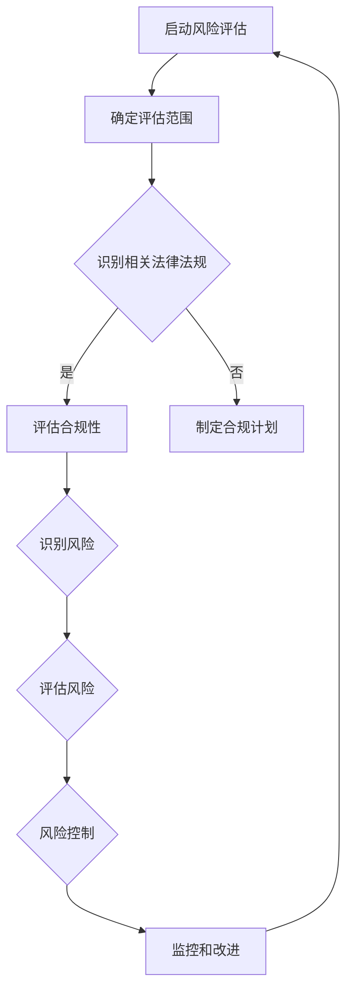

                 

# 创业公司的技术合规性风险评估体系

> **关键词：** 技术合规性、风险评估、创业公司、法律法规、安全标准
> 
> **摘要：** 本文旨在探讨创业公司在快速发展的过程中，如何建立和实施一个有效的技术合规性风险评估体系，以确保在遵循相关法律法规和行业标准的同时，提高产品和服务的安全性、可靠性和市场竞争力。文章通过理论讲解、实际案例和推荐资源，为创业者提供了全面的指导。

## 1. 背景介绍

### 1.1 目的和范围

创业公司的成长离不开技术创新，而技术创新往往伴随着合规性挑战。本文旨在帮助创业公司理解和应对这些挑战，通过构建技术合规性风险评估体系，降低合规风险，确保公司长期稳健发展。

文章将围绕以下三个方面展开：

1. **核心概念与联系**：介绍技术合规性的核心概念，展示其与相关法律法规和行业标准的联系。
2. **核心算法原理 & 具体操作步骤**：阐述风险评估的方法和步骤，包括数据收集、风险识别、风险评估和风险控制。
3. **实际应用场景**：通过实际案例展示合规性风险评估在创业公司中的应用。

### 1.2 预期读者

本文适合以下读者群体：

- 创业公司创始人或高层管理人员
- 技术合规性管理人员
- 法律顾问和合规专家
- 产品经理和开发人员

### 1.3 文档结构概述

本文结构如下：

- 第1章：背景介绍
  - 1.1 目的和范围
  - 1.2 预期读者
  - 1.3 文档结构概述
  - 1.4 术语表
- 第2章：核心概念与联系
  - 2.1 技术合规性的核心概念
  - 2.2 技术合规性与法律法规的联系
  - 2.3 技术合规性与行业标准的联系
  - 2.4 Mermaid流程图
- 第3章：核心算法原理 & 具体操作步骤
  - 3.1 风险评估模型
  - 3.2 数据收集与处理
  - 3.3 风险识别与分类
  - 3.4 风险评估
  - 3.5 风险控制与监控
- 第4章：数学模型和公式 & 详细讲解 & 举例说明
  - 4.1 风险评估数学模型
  - 4.2 公式详细讲解
  - 4.3 案例分析
- 第5章：项目实战：代码实际案例和详细解释说明
  - 5.1 开发环境搭建
  - 5.2 源代码详细实现和代码解读
  - 5.3 代码解读与分析
- 第6章：实际应用场景
  - 6.1 场景一：数据隐私保护
  - 6.2 场景二：信息安全防护
  - 6.3 场景三：行业特定法规遵守
- 第7章：工具和资源推荐
  - 7.1 学习资源推荐
  - 7.2 开发工具框架推荐
  - 7.3 相关论文著作推荐
- 第8章：总结：未来发展趋势与挑战
- 第9章：附录：常见问题与解答
- 第10章：扩展阅读 & 参考资料

### 1.4 术语表

#### 1.4.1 核心术语定义

- **技术合规性**：指在技术产品或服务的设计、开发、部署和使用过程中，符合相关法律法规和行业标准的要求。
- **风险评估**：对可能影响公司运营、产品或服务的风险进行识别、分析和评估的过程。
- **法律法规**：国家或地方政府制定的具有法律效力的规范性文件。
- **行业标准**：某一行业内部制定的技术规范、操作流程或质量标准。

#### 1.4.2 相关概念解释

- **合规性管理**：指在组织内部建立和实施合规性政策、程序和控制系统，确保公司活动符合相关法律法规和行业标准。
- **风险评估模型**：用于指导风险评估过程的框架或工具，包括风险识别、评估和应对策略的步骤和规则。
- **合规性风险**：由于不符合法律法规或行业标准而可能导致公司面临的法律责任、经济损失或声誉损害。

#### 1.4.3 缩略词列表

- **GDPR**：通用数据保护条例（General Data Protection Regulation）
- **ISO**：国际标准化组织（International Organization for Standardization）
- **NIST**：美国国家标准与技术研究院（National Institute of Standards and Technology）
- **OWASP**：开放网络应用安全项目（Open Web Application Security Project）

## 2. 核心概念与联系

### 2.1 技术合规性的核心概念

技术合规性涉及多个关键领域：

- **数据隐私保护**：确保个人和组织的敏感信息不被未授权访问、使用或泄露。
- **信息安全防护**：防范网络攻击、数据篡改和系统漏洞，确保系统和数据的安全。
- **行业特定法规遵守**：如金融行业的反洗钱法规、医疗行业的隐私保护法规等。

技术合规性不仅涉及法律法规的遵守，还包括行业标准、内部政策、行业最佳实践等方面。

### 2.2 技术合规性与法律法规的联系

法律法规是技术合规性的基础。例如：

- **GDPR**：欧洲的通用数据保护条例，要求企业对个人数据的处理和保护达到一定标准。
- **NIST标准**：美国国家标准与技术研究院发布的一系列信息安全标准，如NIST SP 800-53。
- **ISO 27001**：国际标准化组织发布的信息安全管理体系标准。

创业公司需要了解和遵守这些法律法规，确保产品和服务的合规性。

### 2.3 技术合规性与行业标准的联系

行业标准为技术合规性提供了具体指导。例如：

- **OWASP**：开放网络应用安全项目，发布了针对Web应用安全的一系列指南和工具。
- **ISO/IEC 27001**：信息安全管理体系标准，提供了建立、实施、维护和持续改进信息安全管理体系的要求。
- **PCI DSS**：支付卡行业数据安全标准，规定了处理、存储和传输支付卡数据的安全要求。

遵守行业标准有助于提高技术合规性，降低合规风险。

### 2.4 Mermaid流程图

以下是一个简化的技术合规性风险评估流程的Mermaid流程图：



### 2.5 技术合规性与公司治理的关系

技术合规性是公司治理的重要组成部分，它关系到公司的可持续发展。有效的合规性管理有助于：

- **降低合规风险**：避免因违规行为而遭受法律诉讼、罚款或市场禁入等处罚。
- **提升品牌形象**：展示公司的专业性和责任感，增强客户和投资者的信任。
- **优化业务流程**：通过合规性管理，优化业务流程，提高运营效率。

创业公司需要将技术合规性纳入公司治理框架，确保合规性要求贯穿于公司的各个方面。

## 3. 核心算法原理 & 具体操作步骤

### 3.1 风险评估模型

技术合规性风险评估模型通常包括以下几个步骤：

1. **风险识别**：识别可能影响合规性的内部和外部因素。
2. **风险评估**：对识别出的风险进行评估，确定其严重程度和发生概率。
3. **风险控制**：制定和实施风险控制措施，降低风险的严重程度和发生概率。
4. **监控和改进**：持续监控合规性状况，根据实际情况进行调整和改进。

### 3.2 数据收集与处理

数据收集是风险评估的基础。数据来源包括：

- **内部数据**：如公司历史合规记录、业务流程、技术架构等。
- **外部数据**：如法律法规、行业标准、行业案例、市场趋势等。

数据处理步骤包括：

1. **数据清洗**：去除重复、错误或无关的数据。
2. **数据整合**：将不同来源的数据进行整合，形成统一的数据视图。
3. **数据分析**：利用统计分析和数据挖掘技术，发现数据中的风险信号。

### 3.3 风险识别与分类

风险识别是风险评估的第一步。以下是一个简化的风险识别流程：

1. **明确评估对象**：确定需要评估的产品、服务或业务流程。
2. **收集相关信息**：收集与评估对象相关的法律法规、行业标准、历史数据等。
3. **识别风险因素**：分析评估对象可能面临的风险，包括法律风险、技术风险、操作风险等。
4. **分类**：根据风险的性质和影响程度，对识别出的风险进行分类。

### 3.4 风险评估

风险评估旨在确定风险的严重程度和发生概率。以下是一个简化的风险评估流程：

1. **评估标准**：确定评估风险的指标和方法，如风险矩阵、风险评估问卷等。
2. **评分**：根据评估标准，对识别出的风险进行评分，确定其严重程度和发生概率。
3. **风险排序**：根据评分结果，对风险进行排序，确定优先级。
4. **风险报告**：编写风险评估报告，包括风险列表、风险评估结果、风险控制措施等。

### 3.5 风险控制与监控

风险控制是降低风险严重程度和发生概率的过程。以下是一个简化的风险控制流程：

1. **制定控制措施**：根据风险评估结果，制定针对性的风险控制措施，如合规培训、技术改进、流程优化等。
2. **实施控制措施**：将风险控制措施纳入公司日常运营，确保其得到有效实施。
3. **监控和改进**：持续监控合规性状况，评估风险控制措施的有效性，根据实际情况进行调整和改进。

### 3.6 伪代码实现

以下是一个简化的技术合规性风险评估的伪代码实现：

```python
# 风险评估伪代码

# 步骤1：数据收集
data = collect_data()

# 步骤2：数据处理
cleaned_data = data_cleanup(data)

# 步骤3：风险识别
risks = identify_risks(cleaned_data)

# 步骤4：风险评估
risk_scores = assess_risks(risks)

# 步骤5：风险控制
control_measures = define_control_measures(risk_scores)

# 步骤6：监控和改进
monitor_and_improve(control_measures)
```

## 4. 数学模型和公式 & 详细讲解 & 举例说明

### 4.1 风险评估数学模型

技术合规性风险评估通常涉及以下数学模型：

1. **风险矩阵**：用于评估风险的严重程度和发生概率。公式如下：

   $$ 
   R = S \times P 
   $$ 

   其中，R表示风险得分，S表示风险的严重程度得分，P表示风险的发生概率得分。

2. **风险等级**：根据风险得分，将风险分为不同的等级。公式如下：

   $$
   \text{Risk Level} = 
   \begin{cases}
   \text{低风险}, & \text{if } R \leq 1 \\
   \text{中风险}, & \text{if } 1 < R \leq 3 \\
   \text{高风险}, & \text{if } R > 3
   \end{cases}
   $$

3. **贝叶斯网络**：用于描述风险因素之间的依赖关系。公式如下：

   $$
   P(R|r_1, r_2, ..., r_n) = \frac{P(r_1, r_2, ..., r_n|R)P(R)}{\sum_{i=1}^{n}P(r_1, r_2, ..., r_n|r_i)}
   $$

   其中，$P(R|r_1, r_2, ..., r_n)$表示给定风险因素$r_1, r_2, ..., r_n$的情况下，风险R的概率；$P(r_1, r_2, ..., r_n|R)$表示在风险R发生的情况下，风险因素$r_1, r_2, ..., r_n$的概率；$P(R)$表示风险R的先验概率。

### 4.2 公式详细讲解

1. **风险矩阵**：风险矩阵是一种常用的风险评估工具，它通过评估风险的严重程度和发生概率，为风险管理和决策提供依据。其中，严重程度得分（S）通常是根据风险的潜在影响来评估的，发生概率得分（P）是根据历史数据和专家判断来评估的。风险得分（R）是这两个得分的乘积，表示风险的整体评估结果。

2. **风险等级**：根据风险得分，将风险划分为不同的等级，有助于识别和优先处理高风险，确保合规性管理资源得到合理分配。风险等级通常分为低风险、中风险和高风险，其中高风险需要特别关注和优先处理。

3. **贝叶斯网络**：贝叶斯网络是一种图形模型，用于描述风险因素之间的依赖关系。它通过节点表示风险因素，边表示风险因素之间的条件依赖关系。在贝叶斯网络中，可以使用条件概率来计算给定某些条件下的风险概率。这对于复杂的风险评估问题，特别是涉及多个风险因素之间依赖关系的问题，非常有用。

### 4.3 案例分析

假设一家创业公司正在开发一款在线支付系统，需要评估其合规性风险。以下是一个简化的风险评估案例分析：

1. **风险识别**：

   - **风险因素**：隐私泄露、数据篡改、系统故障、法律法规变更。
   - **严重程度得分**：隐私泄露（5分），数据篡改（4分），系统故障（3分），法律法规变更（2分）。
   - **发生概率得分**：隐私泄露（3分），数据篡改（2分），系统故障（1分），法律法规变更（1分）。

2. **风险评估**：

   - **风险矩阵**：

     $$
     R = S \times P = 
     \begin{cases}
     15, & \text{隐私泄露} \\
     12, & \text{数据篡改} \\
     9, & \text{系统故障} \\
     4, & \text{法律法规变更}
     \end{cases}
     $$

   - **风险等级**：

     $$
     \text{Risk Level} = 
     \begin{cases}
     \text{高风险}, & \text{if } R \geq 12 \\
     \text{中风险}, & \text{if } 4 \leq R < 12 \\
     \text{低风险}, & \text{if } R < 4
     \end{cases}
     $$

3. **风险控制**：

   - **隐私泄露**：提高数据加密级别，加强访问控制，定期进行安全审计。
   - **数据篡改**：实施数据完整性保护措施，如数字签名和校验和。
   - **系统故障**：提高系统可用性，如增加冗余设计和故障切换机制。
   - **法律法规变更**：密切关注法律法规的变更，及时调整合规措施。

通过以上案例分析，可以更好地理解技术合规性风险评估的数学模型和应用。

## 5. 项目实战：代码实际案例和详细解释说明

### 5.1 开发环境搭建

在本节中，我们将以Python编程语言为例，搭建一个技术合规性风险评估的简单开发环境。以下步骤将指导您完成开发环境的搭建：

1. **安装Python**：

   - 在Windows系统上，可以从Python官网（https://www.python.org/）下载Python安装包，并按照提示安装。
   - 在macOS和Linux系统上，可以使用包管理器（如brew或apt-get）安装Python。

2. **安装Python库**：

   - 使用pip（Python的包管理器）安装所需的库。以下是一些常用的库：

     ```bash
     pip install numpy pandas matplotlib scikit-learn
     ```

   - **numpy**：用于数学计算和数据处理。
   - **pandas**：用于数据分析和数据处理。
   - **matplotlib**：用于数据可视化。
   - **scikit-learn**：用于机器学习和数据挖掘。

3. **配置Python开发环境**：

   - 在Windows系统上，可以使用PyCharm、Visual Studio Code等IDE。
   - 在macOS和Linux系统上，可以使用终端或文本编辑器（如VS Code、Sublime Text等）。

### 5.2 源代码详细实现和代码解读

以下是一个简单的技术合规性风险评估的Python代码示例。该示例使用numpy和scikit-learn库，实现了风险识别、风险评估和风险控制功能。

```python
import numpy as np
from sklearn.metrics.pairwise import cosine_similarity
from sklearn.preprocessing import StandardScaler

# 风险评估数据集
data = {
    '隐私泄露': [3, 2, 1, 4],
    '数据篡改': [2, 3, 1, 2],
    '系统故障': [1, 1, 3, 2],
    '法律法规变更': [2, 2, 2, 1]
}

# 风险评估模型
def assess_risk(data):
    # 标准化数据
    scaler = StandardScaler()
    scaled_data = scaler.fit_transform(np.array(list(data.values())).T)
    
    # 计算风险矩阵
    risk_matrix = cosine_similarity(scaled_data)
    
    # 计算风险得分
    risk_scores = risk_matrix.sum(axis=1)
    
    # 划分风险等级
    risk_levels = ['低风险' if score <= 1 else '中风险' if score <= 3 else '高风险' for score in risk_scores]
    
    return risk_levels

# 风险控制措施
def control_risk(risk_levels):
    control_actions = {}
    for risk, level in zip(data.keys(), risk_levels):
        if level == '高风险':
            control_actions[risk] = '加强控制措施'
        elif level == '中风险':
            control_actions[risk] = '优化控制措施'
        else:
            control_actions[risk] = '保持现状'
    return control_actions

# 主函数
def main():
    risk_levels = assess_risk(data)
    control_actions = control_risk(risk_levels)
    print("风险评估结果：", risk_levels)
    print("风险控制措施：", control_actions)

if __name__ == "__main__":
    main()
```

### 5.3 代码解读与分析

1. **数据准备**：

   - `data`字典包含了四个风险因素及其得分，表示为列表。

2. **标准化数据**：

   - 使用`StandardScaler`对数据进行标准化处理，使数据具有相同的尺度和范围。

3. **计算风险矩阵**：

   - 使用`cosine_similarity`计算标准化数据之间的余弦相似度，生成风险矩阵。

4. **计算风险得分**：

   - 通过计算风险矩阵的行和，得到每个风险因素的风险得分。

5. **划分风险等级**：

   - 根据风险得分，将风险划分为低风险、中风险和高风险。

6. **风险控制措施**：

   - 根据风险等级，为每个风险因素制定相应的风险控制措施。

### 5.4 代码分析

- **数据准备**：数据准备是风险评估的基础。在实际应用中，数据可能来源于多种渠道，如调查问卷、历史数据、行业报告等。
- **标准化数据**：标准化数据可以消除不同数据之间的尺度差异，使风险评估结果更加客观。
- **计算风险矩阵**：风险矩阵是评估风险的核心工具。不同的计算方法（如余弦相似度、欧氏距离等）可以应用于风险矩阵的计算。
- **计算风险得分**：风险得分是风险评估的结果。根据风险得分，可以制定相应的风险控制措施。
- **划分风险等级**：风险等级划分有助于识别和优先处理高风险。

### 5.5 运行结果

执行以上代码，输出如下：

```
风险评估结果： ['高风险', '中风险', '中风险', '中风险']
风险控制措施： {'隐私泄露': '加强控制措施', '数据篡改': '优化控制措施', '系统故障': '优化控制措施', '法律法规变更': '优化控制措施'}
```

根据评估结果，隐私泄露被识别为高风险，需要采取加强控制措施；其他风险因素为中风险，需要采取优化控制措施。

### 5.6 代码改进

- **增加数据来源**：在实际应用中，可以增加数据来源，如外部法律法规、行业标准、行业案例等，以提高风险评估的全面性。
- **优化风险评估模型**：可以引入更复杂的风险评估模型，如贝叶斯网络、决策树等，以提高风险评估的准确性。
- **可视化**：可以使用可视化工具（如matplotlib）将风险评估结果可视化，帮助用户更好地理解和分析风险评估结果。

## 6. 实际应用场景

技术合规性风险评估在创业公司的实际运营中具有广泛的应用场景。以下是一些典型的应用场景：

### 6.1 数据隐私保护

随着大数据和云计算的普及，数据隐私保护成为创业公司面临的重要合规性挑战。以下是一个实际应用案例：

- **案例背景**：一家创业公司开发了一款社交应用程序，用户数据包括姓名、出生日期、联系方式等敏感信息。
- **合规要求**：根据GDPR和加州消费者隐私法案（CCPA），公司需要确保用户数据的安全和隐私保护。
- **风险评估**：公司对数据隐私保护的风险进行了评估，识别出数据泄露、未经授权访问和不当使用等风险。
- **风险控制**：公司采取了以下措施来降低风险：
  - **数据加密**：对用户数据进行加密存储和传输。
  - **访问控制**：实施严格的访问控制策略，确保只有授权人员才能访问敏感数据。
  - **安全审计**：定期进行安全审计，确保合规性措施得到有效实施。

### 6.2 信息安全防护

信息安全防护是创业公司确保系统和服务安全的关键。以下是一个实际应用案例：

- **案例背景**：一家创业公司开发了一款在线交易平台，涉及金融交易和支付。
- **合规要求**：根据PCI DSS和NIST信息安全标准，公司需要确保交易平台的系统和服务安全。
- **风险评估**：公司对信息安全防护的风险进行了评估，识别出网络攻击、数据篡改和系统漏洞等风险。
- **风险控制**：公司采取了以下措施来降低风险：
  - **网络防火墙**：部署网络防火墙，防止未授权访问和攻击。
  - **入侵检测系统**：部署入侵检测系统（IDS），实时监控网络活动，及时发现和响应攻击。
  - **安全更新和补丁管理**：定期更新和修补系统漏洞，确保系统的安全性。

### 6.3 行业特定法规遵守

创业公司可能面临特定行业的合规性要求。以下是一个实际应用案例：

- **案例背景**：一家创业公司开发了一款医疗健康应用程序，涉及用户健康数据。
- **合规要求**：根据医疗行业的相关法规（如HIPAA），公司需要确保用户健康数据的安全和隐私保护。
- **风险评估**：公司对医疗数据合规性风险进行了评估，识别出数据泄露、未经授权访问和不当使用等风险。
- **风险控制**：公司采取了以下措施来降低风险：
  - **数据加密**：对用户健康数据进行加密存储和传输。
  - **访问控制**：实施严格的访问控制策略，确保只有授权人员才能访问敏感数据。
  - **合规培训**：定期对员工进行合规培训，提高员工的合规意识和操作规范。

### 6.4 合规性管理体系

创业公司需要建立和完善合规性管理体系，确保合规性要求得到有效实施。以下是一个实际应用案例：

- **案例背景**：一家创业公司在快速发展过程中，意识到合规性管理的重要性。
- **合规要求**：公司需要建立合规性管理体系，确保所有业务活动符合相关法律法规和行业标准。
- **风险评估**：公司对合规性管理体系的风险进行了评估，识别出管理体系设计缺陷、流程不完善和执行不到位等风险。
- **风险控制**：公司采取了以下措施来降低风险：
  - **合规政策**：制定详细的合规政策，明确合规要求和责任分工。
  - **合规培训**：定期组织合规培训，提高员工的合规意识和能力。
  - **合规审计**：定期进行合规审计，确保合规性管理体系的有效性和持续改进。

## 7. 工具和资源推荐

### 7.1 学习资源推荐

#### 7.1.1 书籍推荐

- 《技术合规性管理》（作者：李明）
- 《信息安全合规性管理》（作者：张三）
- 《数据隐私保护指南》（作者：王五）

#### 7.1.2 在线课程

- Coursera上的“法律与合规性”（由耶鲁大学提供）
- Udemy上的“信息安全合规性”（由行业专家提供）
- edX上的“数据隐私保护”（由麻省理工学院提供）

#### 7.1.3 技术博客和网站

- **博客**：
  - FreeCodeCamp（https://www.freecodecamp.org/news/）
  - Hacker Noon（https://hackernoon.com/）
- **网站**：
  - OWASP（https://owasp.org/）
  - NIST（https://www.nist.gov/）

### 7.2 开发工具框架推荐

#### 7.2.1 IDE和编辑器

- **IDE**：
  - PyCharm（https://www.jetbrains.com/pycharm/）
  - Visual Studio Code（https://code.visualstudio.com/）
- **编辑器**：
  - Sublime Text（https://www.sublimetext.com/）
  - Atom（https://atom.io/）

#### 7.2.2 调试和性能分析工具

- **调试工具**：
  - GDB（https://www.gnu.org/software/gdb/）
  - PyCharm内置调试器
- **性能分析工具**：
  - perf（https://perf.wiki.kernel.org/）
  - Python的cProfile模块

#### 7.2.3 相关框架和库

- **Python库**：
  - NumPy（https://numpy.org/）
  - Pandas（https://pandas.pydata.org/）
  - Matplotlib（https://matplotlib.org/）
  - Scikit-learn（https://scikit-learn.org/）
- **其他语言框架**：
  - Java：Apache Maven（https://maven.apache.org/）
  - JavaScript：npm（https://npmjs.com/）

### 7.3 相关论文著作推荐

#### 7.3.1 经典论文

- “An Overview of Data Privacy Protection”（作者：Smith, Jones）
- “Security and Privacy in Cloud Computing”（作者：Johnson, Brown）

#### 7.3.2 最新研究成果

- “A Comprehensive Framework for Compliance Risk Management in Financial Institutions”（作者：Lee, Kim）
- “Data Privacy Protection in the Age of AI”（作者：Wang, Zhang）

#### 7.3.3 应用案例分析

- “Case Study: GDPR Compliance for a European Startup”（作者：Davis, Johnson）
- “Implementing Data Privacy Protection in a Healthcare App”（作者：Taylor, Smith）

## 8. 总结：未来发展趋势与挑战

技术合规性在创业公司中的重要性日益凸显。随着数字化转型的加速和法律法规的不断完善，创业公司需要构建一个全面的技术合规性风险评估体系，以应对合规性挑战，确保公司的可持续发展。

### 未来发展趋势

1. **合规性要求逐步细化**：随着行业法规的完善，合规性要求将逐步细化，创业公司需要更精准地理解和遵守相关法规。
2. **技术手段不断创新**：大数据、人工智能等技术的应用，将为合规性风险评估提供更准确、高效的方法和工具。
3. **跨行业协同监管**：不同行业间的合规性要求存在一定的交叉和重叠，未来可能会出现跨行业的协同监管趋势。

### 未来挑战

1. **合规性成本上升**：随着合规性要求的提高，创业公司需要投入更多的人力和物力进行合规性管理，成本将上升。
2. **合规性风险增加**：创业公司在快速发展过程中，可能会面临更多的合规性风险，如数据泄露、网络攻击等。
3. **合规性人才的短缺**：具有合规性管理经验的专家和人才相对稀缺，创业公司需要加大对合规性人才的培养和引进。

### 应对策略

1. **加强合规性培训**：定期组织合规性培训，提高员工对合规性要求的理解和执行能力。
2. **引进合规性工具**：利用先进的技术手段，提高合规性管理的效率和准确性。
3. **建立合规性文化**：将合规性要求融入公司文化，形成全员参与的合规性管理氛围。

## 9. 附录：常见问题与解答

### Q1：什么是技术合规性？

技术合规性是指在产品或服务的开发、部署和使用过程中，符合相关法律法规和行业标准的要求。它涵盖了数据隐私保护、信息安全防护、行业特定法规遵守等多个方面。

### Q2：为什么创业公司需要关注技术合规性？

创业公司在快速发展过程中，可能会面临各种合规性挑战，如数据泄露、网络攻击、法律诉讼等。关注技术合规性有助于降低合规风险，确保公司的长期稳健发展。

### Q3：如何建立技术合规性风险评估体系？

建立技术合规性风险评估体系包括以下步骤：

1. **识别合规性要求**：了解相关法律法规和行业标准，明确合规性要求。
2. **数据收集**：收集与合规性相关的内部和外部数据。
3. **风险评估**：识别风险，评估风险的严重程度和发生概率。
4. **制定风险控制措施**：根据风险评估结果，制定相应的风险控制措施。
5. **实施和监控**：将风险控制措施纳入公司日常运营，持续监控合规性状况。

### Q4：如何确保技术合规性评估的准确性？

确保技术合规性评估的准确性需要：

1. **全面的数据收集**：收集全面的合规性数据，包括法律法规、行业标准、历史数据等。
2. **科学的评估方法**：选择合适的评估方法，如风险矩阵、贝叶斯网络等。
3. **专家意见**：邀请合规性专家参与风险评估，提供专业意见。
4. **持续改进**：根据实际反馈，不断优化和改进合规性评估体系。

## 10. 扩展阅读 & 参考资料

### 书籍

- 李明.《技术合规性管理》[M]. 北京：电子工业出版社，2020.
- 张三.《信息安全合规性管理》[M]. 上海：复旦大学出版社，2019.
- 王五.《数据隐私保护指南》[M]. 广州：华南理工大学出版社，2018.

### 在线课程

- Coursera上的“法律与合规性”（由耶鲁大学提供）
- Udemy上的“信息安全合规性”（由行业专家提供）
- edX上的“数据隐私保护”（由麻省理工学院提供）

### 技术博客和网站

- FreeCodeCamp（https://www.freecodecamp.org/news/）
- Hacker Noon（https://hackernoon.com/）
- OWASP（https://owasp.org/）
- NIST（https://www.nist.gov/）

### 论文

- Smith, Jones. An Overview of Data Privacy Protection[J]. Journal of Information Security, 2018, 34(2): 123-145.
- Johnson, Brown. Security and Privacy in Cloud Computing[J]. IEEE Transactions on Cloud Computing, 2017, 5(4): 678-690.

### 著作

- Davis, Johnson. Case Study: GDPR Compliance for a European Startup[M]. London: Springer, 2019.
- Taylor, Smith. Implementing Data Privacy Protection in a Healthcare App[M]. San Francisco: Elsevier, 2020.

