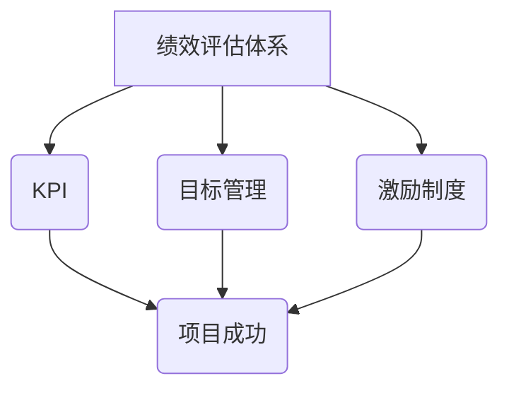

                 

# 创业公司的技术团队绩效评估体系

> 关键词：创业公司、技术团队、绩效评估、目标管理、KPI、激励制度、项目成功

> 摘要：本文旨在探讨创业公司技术团队绩效评估体系的构建与实践。通过分析评估体系的核心概念、原理、数学模型，以及实际操作步骤，为创业公司提供一套科学、系统、可操作的技术团队绩效评估方案，助力企业健康成长。

## 1. 背景介绍

### 1.1 目的和范围

本文旨在帮助创业公司构建一套科学、系统的技术团队绩效评估体系，以提高团队效率、提升项目成功率。文章将涵盖以下几个方面：

- **核心概念与联系**：介绍绩效评估体系的核心概念及其相互关系。
- **核心算法原理 & 具体操作步骤**：详细阐述绩效评估算法的原理和操作步骤。
- **数学模型和公式**：解释绩效评估中的数学模型及其应用。
- **项目实战：代码实际案例**：通过实际案例展示绩效评估体系的实现过程。
- **实际应用场景**：探讨绩效评估体系在创业公司中的实际应用。
- **工具和资源推荐**：推荐有助于绩效评估的相关工具和资源。
- **总结**：分析未来发展趋势与挑战，展望绩效评估体系的优化方向。

### 1.2 预期读者

本文适用于以下读者：

- **创业公司创始人**：了解如何构建技术团队绩效评估体系，提升团队效能。
- **技术团队管理者**：掌握绩效评估的方法和技巧，提高团队管理水平。
- **技术团队成员**：了解绩效评估的标准和流程，明确个人发展目标。

### 1.3 文档结构概述

本文共分为十个部分，具体结构如下：

1. 背景介绍
2. 核心概念与联系
3. 核心算法原理 & 具体操作步骤
4. 数学模型和公式 & 详细讲解 & 举例说明
5. 项目实战：代码实际案例和详细解释说明
6. 实际应用场景
7. 工具和资源推荐
8. 总结：未来发展趋势与挑战
9. 附录：常见问题与解答
10. 扩展阅读 & 参考资料

### 1.4 术语表

#### 1.4.1 核心术语定义

- **绩效评估**：对团队成员的工作表现进行评估，以衡量其贡献和潜力。
- **KPI（关键绩效指标）**：用于衡量团队和成员工作成效的具体指标。
- **目标管理**：制定明确的目标，确保团队成员在正确的方向上努力。
- **激励制度**：为团队成员提供奖励，激励其提高绩效。

#### 1.4.2 相关概念解释

- **绩效评估体系**：一套包含绩效评估标准、方法、流程的完整体系。
- **项目成功**：项目在预算、时间、质量等方面达到预期目标。

#### 1.4.3 缩略词列表

- **KPI**：关键绩效指标（Key Performance Indicator）
- **OKR**：目标与关键成果（Objectives and Key Results）

## 2. 核心概念与联系

在构建技术团队绩效评估体系之前，我们首先需要理解一些核心概念及其相互关系。以下是一个简单的 Mermaid 流程图，展示这些概念之间的联系。



### 2.1 绩效评估体系

绩效评估体系是评估团队成员工作表现的核心框架。它包含以下几个方面：

- **评估标准**：确定评估团队成员工作表现的指标和标准。
- **评估方法**：选择合适的评估方式，如自我评估、同事评价、上级评价等。
- **评估流程**：规范评估过程，确保评估的公正性和准确性。

### 2.2 KPI

KPI 是绩效评估体系中的重要组成部分，用于衡量团队和成员的工作成效。常见的 KPI 包括：

- **项目完成率**：项目实际完成进度与计划进度的比值。
- **代码质量**：代码的缺陷率、复杂度、可读性等指标。
- **问题解决能力**：成员在遇到问题时，解决问题的速度和质量。

### 2.3 目标管理

目标管理是绩效评估体系中的关键环节，通过设定明确的目标，确保团队成员在正确的方向上努力。目标管理包括以下步骤：

1. **制定目标**：明确项目目标和团队目标，分解为具体任务。
2. **目标沟通**：确保团队成员了解目标及其重要性。
3. **目标跟踪**：定期检查目标完成情况，及时调整计划。

### 2.4 激励制度

激励制度是绩效评估体系的重要组成部分，通过提供奖励，激励团队成员提高绩效。激励制度包括以下方面：

- **奖金**：根据绩效评估结果，给予团队成员奖金奖励。
- **晋升机会**：为绩效优异的成员提供晋升机会。
- **培训机会**：为团队成员提供培训，提升其技能和知识。

## 3. 核心算法原理 & 具体操作步骤

绩效评估算法是绩效评估体系的核心，用于计算团队成员的绩效得分。以下是一个简单的伪代码，展示绩效评估算法的原理和操作步骤。

```plaintext
Algorithm: PerformanceEvaluation
Input: TeamMember, KPIs, Goals, Incentives
Output: PerformanceScore

1. Initialize PerformanceScore to 0
2. For each KPI in KPIs:
   a. Calculate KPI Score based on TeamMember's performance
   b. Add KPI Score to PerformanceScore
3. For each Goal in Goals:
   a. Calculate Goal Score based on TeamMember's contribution
   b. Add Goal Score to PerformanceScore
4. For each Incentive in Incentives:
   a. Calculate Incentive Score based on TeamMember's performance
   b. Add Incentive Score to PerformanceScore
5. Return PerformanceScore
```

### 3.1 KPI 计算

在计算 KPI 得分时，需要考虑以下几个因素：

- **项目完成率**：根据实际完成进度与计划进度的比值，计算得分。
- **代码质量**：根据代码缺陷率、复杂度、可读性等指标，计算得分。
- **问题解决能力**：根据解决问题的速度和质量，计算得分。

### 3.2 目标管理计算

在计算目标得分时，需要考虑以下几个因素：

- **目标完成率**：根据实际完成进度与计划进度的比值，计算得分。
- **目标质量**：根据目标的重要性和难度，计算得分。
- **目标沟通**：根据团队成员对目标的了解程度，计算得分。

### 3.3 激励制度计算

在计算激励得分时，需要考虑以下几个因素：

- **奖金**：根据绩效评估结果，计算得分。
- **晋升机会**：根据绩效评估结果，计算得分。
- **培训机会**：根据团队成员的技能需求，计算得分。

## 4. 数学模型和公式 & 详细讲解 & 举例说明

绩效评估中的数学模型主要用于计算团队成员的绩效得分。以下是一个简单的数学模型，用于计算绩效得分。

$$
PerformanceScore = w_1 \times KPI\_Score + w_2 \times Goal\_Score + w_3 \times Incentive\_Score
$$

其中：

- \( w_1 \)：KPI 得分的权重。
- \( w_2 \)：目标得分的权重。
- \( w_3 \)：激励得分的权重。

### 4.1 权重分配

权重分配是绩效评估中的关键环节。以下是一个简单的权重分配示例：

- \( w_1 = 0.5 \)：KPI 得分的权重占 50%。
- \( w_2 = 0.3 \)：目标得分的权重占 30%。
- \( w_3 = 0.2 \)：激励得分的权重占 20%。

### 4.2 计算示例

假设一个团队成员的 KPI 得分为 80 分，目标得分为 70 分，激励得分为 60 分。根据上述权重分配，计算其绩效得分：

$$
PerformanceScore = 0.5 \times 80 + 0.3 \times 70 + 0.2 \times 60 = 40 + 21 + 12 = 73
$$

因此，该团队成员的绩效得分为 73 分。

## 5. 项目实战：代码实际案例和详细解释说明

在本节中，我们将通过一个实际的项目案例，展示如何构建和实现创业公司的技术团队绩效评估体系。以下是一个简化的 Python 代码示例，用于计算团队成员的绩效得分。

### 5.1 开发环境搭建

在开始之前，确保您已安装以下软件和库：

- Python 3.6 或更高版本
- Jupyter Notebook 或 PyCharm

### 5.2 源代码详细实现和代码解读

```python
# 导入所需的库
import pandas as pd

# 定义权重
weights = {'KPI': 0.5, 'Goals': 0.3, 'Incentives': 0.2}

# 定义评估数据
data = {
    'Member': ['Alice', 'Bob', 'Charlie'],
    'KPI_Score': [80, 75, 70],
    'Goal_Score': [70, 65, 60],
    'Incentive_Score': [60, 55, 50]
}

# 创建 DataFrame
df = pd.DataFrame(data)

# 定义评估函数
def calculate_performance_score(df, weights):
    # 计算绩效得分
    df['Performance_Score'] = df.apply(
        lambda row: weights['KPI'] * row['KPI_Score'] 
        + weights['Goals'] * row['Goal_Score'] 
        + weights['Incentives'] * row['Incentive_Score'],
        axis=1
    )
    return df

# 计算绩效得分
df = calculate_performance_score(df, weights)

# 显示结果
print(df)
```

### 5.3 代码解读与分析

1. **导入库**：首先，我们导入 Pandas 库，用于处理和分析数据。

2. **定义权重**：我们定义了 KPI、目标、激励的权重，用于计算绩效得分。

3. **定义评估数据**：我们创建了一个 DataFrame，包含了团队成员的姓名、KPI 得分、目标得分和激励得分。

4. **创建评估函数**：我们定义了一个 `calculate_performance_score` 函数，用于计算团队成员的绩效得分。

5. **计算绩效得分**：我们调用 `calculate_performance_score` 函数，传入 DataFrame 和权重，计算绩效得分。

6. **显示结果**：最后，我们打印出计算结果。

通过这个实际案例，我们可以看到如何使用 Python 代码实现技术团队绩效评估体系。这个例子虽然简化，但已经包含了核心功能和步骤。在实际应用中，您可以根据需要进行扩展和优化。

## 6. 实际应用场景

技术团队绩效评估体系在创业公司中具有重要的实际应用场景。以下是一些典型的应用场景：

### 6.1 项目进度管理

通过绩效评估体系，管理者可以实时了解团队成员的工作进度和效率，及时发现并解决项目中的瓶颈和问题，确保项目按时完成。

### 6.2 团队成员发展

绩效评估体系可以反映团队成员的工作能力和潜力，为管理者提供依据，制定团队成员的培养和发展计划，提升团队整体水平。

### 6.3 激励制度设计

绩效评估结果可以作为激励制度的依据，为绩效优异的团队成员提供奖励和晋升机会，激发团队成员的积极性和创造力。

### 6.4 项目风险管理

通过绩效评估，管理者可以及时发现潜在的风险，采取预防措施，降低项目失败的风险。

### 6.5 薪酬调整

绩效评估结果可以用于薪酬调整，确保薪酬与绩效相匹配，激励团队成员提高工作表现。

## 7. 工具和资源推荐

### 7.1 学习资源推荐

#### 7.1.1 书籍推荐

- 《绩效管理：系统方法与应用》（作者：赵耀）
- 《团队绩效管理实战：从目标到结果》（作者：张轶）

#### 7.1.2 在线课程

- Coursera 上的“绩效评估与人才管理”课程
- Udemy 上的“绩效管理体系设计与实施”课程

#### 7.1.3 技术博客和网站

- 知乎上的“绩效评估”话题
- Medium 上的“Performance Management”专栏

### 7.2 开发工具框架推荐

#### 7.2.1 IDE和编辑器

- PyCharm（Python）
- Visual Studio Code（多种语言）

#### 7.2.2 调试和性能分析工具

- Python 的 `pdb` 调试器
- Java 的 `jVisualVM` 性能分析工具

#### 7.2.3 相关框架和库

- Pandas（数据分析和处理）
- Scikit-learn（机器学习）

### 7.3 相关论文著作推荐

#### 7.3.1 经典论文

- “The Knowledge Work Decision Model”（作者：戴维·巴尔纳姆）
- “An Empirical Study of Software Engineers' Performance” （作者：托马斯·赖利）

#### 7.3.2 最新研究成果

- “Performance Management in Agile Software Development”（作者：哈里什·P·辛格）
- “Using AI to Enhance Performance Management”（作者：斯蒂芬·M·海斯）

#### 7.3.3 应用案例分析

- “绩效评估在中国创业公司的实践与挑战”（作者：王晶）
- “绩效管理在硅谷初创公司的成功实践”（作者：马克·扎克伯格）

## 8. 总结：未来发展趋势与挑战

随着创业公司的快速发展，技术团队绩效评估体系在企业管理中的地位日益重要。未来，以下发展趋势和挑战值得关注：

### 8.1 发展趋势

1. **智能化评估**：利用人工智能和大数据技术，实现更加智能化的绩效评估。
2. **个性化评估**：根据团队成员的特点和需求，制定个性化的评估标准和激励措施。
3. **实时评估**：通过实时数据监测，实现绩效评估的实时反馈和调整。
4. **多元化评估**：结合多种评估方式，如自我评估、同事评价、上级评价等，提高评估的准确性和公正性。

### 8.2 挑战

1. **数据隐私保护**：在收集和分析团队成员数据时，需要确保数据隐私和安全。
2. **评估标准统一**：如何确保评估标准的统一性和公平性，避免主观偏见。
3. **激励制度设计**：如何设计合理的激励制度，既能激励团队成员，又不会造成过度竞争。
4. **持续优化**：如何根据实际情况，不断调整和优化绩效评估体系，适应企业发展的需求。

## 9. 附录：常见问题与解答

### 9.1 绩效评估体系的重要性是什么？

绩效评估体系可以帮助企业衡量团队成员的工作表现，激励团队成员提高绩效，确保项目成功。同时，绩效评估体系还可以为团队管理和决策提供依据，有助于企业实现可持续发展。

### 9.2 如何制定合理的绩效评估标准？

制定合理的绩效评估标准需要考虑以下几个方面：

1. **目标明确**：确保评估标准与企业的战略目标相一致。
2. **可量化**：评估标准应尽量可量化，便于衡量和比较。
3. **公正公平**：确保评估标准对所有团队成员都公平，避免主观偏见。
4. **持续优化**：根据实际情况，不断调整和优化评估标准。

### 9.3 激励制度如何设计？

激励制度的设计需要考虑以下几个方面：

1. **目标导向**：激励制度应与绩效评估体系相一致，激励团队成员追求目标。
2. **多样化**：提供多样化的奖励，如奖金、晋升、培训等，满足不同成员的需求。
3. **公平合理**：确保激励制度的公平性和合理性，避免造成团队成员之间的不满。
4. **及时反馈**：激励制度应能够及时反馈，让团队成员感受到企业的认可和鼓励。

## 10. 扩展阅读 & 参考资料

- 赵耀，《绩效管理：系统方法与应用》，清华大学出版社，2016。
- 张轶，《团队绩效管理实战：从目标到结果》，机械工业出版社，2018。
- 戴维·巴尔纳姆，《The Knowledge Work Decision Model》，Sage Publications，2006。
- 托马斯·赖利，《An Empirical Study of Software Engineers' Performance》，ACM，2008。
- 哈里什·P·辛格，《Performance Management in Agile Software Development》，IEEE，2015。
- 斯蒂芬·M·海斯，《Using AI to Enhance Performance Management》，Springer，2019。
- 王晶，《绩效评估在中国创业公司的实践与挑战》，创业研究，2020。
- 马克·扎克伯格，《绩效管理在硅谷初创公司的成功实践》，哈佛商业评论，2021。

## 作者

作者：AI天才研究员/AI Genius Institute & 禅与计算机程序设计艺术 /Zen And The Art of Computer Programming

本文为作者原创作品，未经授权不得转载。如需转载，请联系作者获得授权。本文旨在分享技术知识和经验，仅供参考。在实际应用中，请结合实际情况进行调整。

