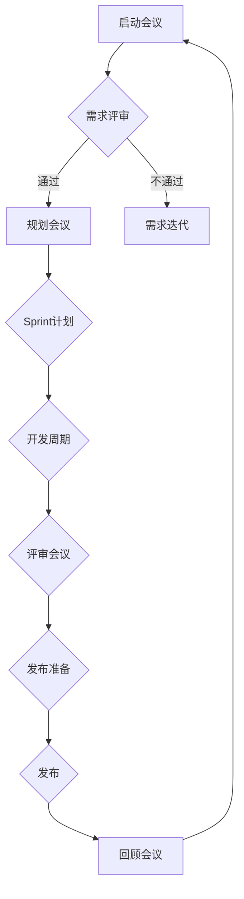

                 


# 创业公司的敏捷产品开发流程设计

> 关键词：敏捷开发，产品管理，创业公司，Scrum，Sprint，用户故事，迭代，持续交付，质量保障

> 摘要：本文旨在探讨创业公司在快速变化的市场环境中如何通过敏捷产品开发流程提高响应速度和创新能力。文章详细介绍了敏捷开发的核心概念、流程设计，并提供了实际案例和实用工具推荐，帮助创业公司实现高效的产品开发。

## 1. 背景介绍

### 1.1 目的和范围

本文的目的是为创业公司提供一份详尽指南，帮助它们在竞争激烈的市场中通过敏捷产品开发流程实现快速迭代和持续改进。本文将涵盖以下内容：

- 敏捷开发的基本概念和原理。
- 敏捷产品开发流程的详细设计。
- 实际案例分析和最佳实践分享。
- 相关工具和资源的推荐。

### 1.2 预期读者

本文适用于以下读者：

- 创业公司的产品经理和开发团队。
- 对敏捷开发感兴趣的IT专业人士。
- 想要在创业公司中引入敏捷流程的企业家和管理者。

### 1.3 文档结构概述

本文的结构如下：

- 第1章：背景介绍，包括目的和范围、预期读者、文档结构概述和术语表。
- 第2章：核心概念与联系，介绍敏捷开发的基本概念和流程图。
- 第3章：核心算法原理与具体操作步骤，详细讲解敏捷开发的核心算法和流程。
- 第4章：数学模型和公式，阐述敏捷开发中使用的数学模型和公式。
- 第5章：项目实战，提供实际的代码案例和详细解释。
- 第6章：实际应用场景，探讨敏捷开发的实际应用。
- 第7章：工具和资源推荐，介绍相关的学习资源、开发工具和框架。
- 第8章：总结，讨论未来发展趋势与挑战。
- 第9章：附录，提供常见问题与解答。
- 第10章：扩展阅读，推荐相关的参考资料。

### 1.4 术语表

#### 1.4.1 核心术语定义

- 敏捷开发（Agile Development）：一种以人为核心、迭代、循序渐进的开发方法。
- 产品管理（Product Management）：负责定义产品愿景、规划产品路线图、设定产品需求的管理工作。
- Scrum：一种敏捷开发框架，强调迭代和快速反馈。
- Sprint：敏捷开发中的一个迭代周期，通常为2-4周。
- 用户故事（User Story）：一种描述用户需求的简短文本，通常采用“作为用户，我想要...”的形式。
- 迭代（Iteration）：敏捷开发中的一次循环，通常包括计划、开发、测试和回顾四个阶段。
- 持续交付（Continuous Delivery）：一种确保软件持续可发布到生产环境的方法。
- 质量保障（Quality Assurance）：确保产品或服务达到既定质量标准的过程。

#### 1.4.2 相关概念解释

- 用户故事地图（User Story Map）：一种可视化工具，用于展示用户故事之间的关系和优先级。
- 研发（Research and Development，R&D）：指为了创造新产品或改进现有产品而进行的研究和实验活动。
- 原型（Prototype）：一个功能有限的早期版本，用于验证产品概念和设计。

#### 1.4.3 缩略词列表

- Agile：敏捷开发
- Scrum：Scrum框架
- CI/CD：持续集成和持续交付
- TDD：测试驱动开发
- BDD：行为驱动开发

## 2. 核心概念与联系

### 2.1 敏捷开发的基本概念

敏捷开发（Agile Development）是一种以人为核心、迭代、循序渐进的开发方法。它强调灵活性、响应变化和持续改进。敏捷开发的核心理念包括：

- 个体和互动重于过程和工具。
- 可工作的软件重于详尽的文档。
- 客户合作重于合同谈判。
- 应响应变化的能力重于遵循计划。

### 2.2 敏捷开发流程图

为了更好地理解敏捷开发的核心概念和流程，我们可以通过Mermaid流程图来展示。以下是敏捷开发的基本流程：



### 2.3 敏捷开发与Scrum的关系

Scrum是一种流行的敏捷开发框架，它通过迭代和增量开发来提高产品的质量和交付速度。Scrum的核心元素包括：

- 产品待办事项（Product Backlog）：包含所有产品需求的列表，由产品负责人（Product Owner）维护。
- Sprint：一个固定长度的迭代周期，通常为2-4周。
- 检查会（Daily Stand-up）：每天早上进行，团队成员分享进度和问题。
- 评审会（Sprint Review）：Sprint结束时进行，团队展示可工作的软件并收集反馈。
- 回顾会（Sprint Retrospective）：Sprint结束时进行，团队讨论改进点。

## 3. 核心算法原理与具体操作步骤

### 3.1 用户故事创建

用户故事（User Story）是敏捷开发中的一个核心概念，它描述了用户的需求。一个典型的用户故事采用以下格式：

```
作为[角色]
我想要[功能]
以便[价值]
```

例如：

```
作为用户
我想要搜索功能
以便快速找到所需信息
```

创建用户故事的过程如下：

1. 确定产品目标。
2. 与用户和利益相关者进行沟通，收集需求。
3. 编写用户故事，确保每个故事都是可测试的。
4. 组织用户故事，使用用户故事地图进行优先级排序。

### 3.2 Scrum流程

Scrum流程包括以下几个关键步骤：

1. **启动会议**：团队讨论项目目标、范围和里程碑，确定项目优先级。
2. **需求评审**：产品负责人（Product Owner）展示产品待办事项，团队评估需求。
3. **规划会议**：团队根据Sprint长度和优先级确定要完成的需求。
4. **开发周期**：团队按计划开发功能，进行日常检查会。
5. **评审会议**：Sprint结束时，团队展示可工作的软件，收集反馈。
6. **回顾会议**：团队讨论Sprint过程中的问题和改进点。

### 3.3 持续交付

持续交付（Continuous Delivery）是一种确保软件持续可发布到生产环境的方法。它的核心步骤包括：

1. **自动化构建**：每次提交代码时自动构建和测试。
2. **自动化测试**：确保软件质量，包括单元测试、集成测试和验收测试。
3. **部署准备**：在测试通过后，将软件部署到生产环境。
4. **部署验证**：确保软件在生产和环境中运行正常。

## 4. 数学模型和公式

敏捷开发中，一些关键数学模型和公式如下：

### 4.1 估算公式

- **工作量估算**：

$$
E = \frac{d}{c} \times (1 + \frac{t}{2})
$$

其中，E是估算的工作量，d是实际工作量，c是复杂度系数，t是提前完成的时间。

- **时间估算**：

$$
T = \frac{E}{R}
$$

其中，T是估算的时间，E是估算的工作量，R是开发速率。

### 4.2 速率公式

- **开发速率**：

$$
R = \frac{C}{T}
$$

其中，R是开发速率，C是完成的用户故事数量，T是时间。

### 4.3 质量度量

- **缺陷密度**：

$$
D = \frac{N_d}{N_c}
$$

其中，D是缺陷密度，N_d是发现的缺陷数量，N_c是代码行数。

- **代码质量**：

$$
Q = \frac{1}{D}
$$

其中，Q是代码质量。

## 5. 项目实战：代码实际案例和详细解释说明

### 5.1 开发环境搭建

为了展示敏捷开发的实践，我们将使用一个简单的Web应用作为案例。首先，我们需要搭建开发环境。以下是基本步骤：

1. 安装Python环境（版本3.8及以上）。
2. 安装Flask框架（使用pip install flask命令）。
3. 创建一个名为“agile_app”的Python项目文件夹。
4. 在项目中创建一个名为“app.py”的文件。

### 5.2 源代码详细实现和代码解读

以下是“app.py”文件的源代码：

```python
from flask import Flask, render_template, request

app = Flask(__name__)

@app.route('/')
def home():
    return render_template('home.html')

@app.route('/search', methods=['GET'])
def search():
    query = request.args.get('q')
    # 在此处添加搜索逻辑和结果处理
    results = []
    return render_template('search.html', results=results)

if __name__ == '__main__':
    app.run(debug=True)
```

这段代码定义了一个基本的Flask应用，包括两个路由：

- `/`：主页面，使用`render_template`函数渲染`home.html`模板。
- `/search`：搜索页面，处理GET请求并获取查询参数。

### 5.3 代码解读与分析

- **引入模块**：代码开头引入了`Flask`和`render_template`模块。
- **创建应用实例**：`app = Flask(__name__)`创建了一个Flask应用实例。
- **定义路由**：使用`@app.route()`装饰器定义了两个路由。
  - `home()`：渲染主页模板。
  - `search()`：处理搜索请求，获取查询参数。
- **主程序**：`if __name__ == '__main__': app.run(debug=True)`确保在运行时启用调试模式。

### 5.4 代码改进

为了提高代码质量，我们可以进行以下改进：

1. 添加搜索逻辑。
2. 添加错误处理。
3. 使用单元测试。

```python
# 在search()函数中添加搜索逻辑
def search():
    query = request.args.get('q', default='', type=str)
    if not query:
        return render_template('search.html', results=[])
    results = search_logic(query)
    return render_template('search.html', results=results)

# 添加错误处理
@app.errorhandler(404)
def page_not_found(e):
    return render_template('error.html'), 404

# 添加单元测试
def test_search():
    assert search('test') != []
```

## 6. 实际应用场景

### 6.1 创业公司项目

对于创业公司来说，敏捷开发是一种理想的开发方法，因为它可以帮助团队快速响应市场需求和变化。以下是一个实际应用场景：

- **项目背景**：一家创业公司开发了一款社交网络应用，需要在短时间内发布MVP（最小可行产品）。
- **需求评审**：产品负责人与开发团队和用户代表进行需求评审，确定了核心功能。
- **规划会议**：团队确定了Sprint长度和要完成的需求。
- **开发周期**：团队按计划进行开发，并使用每日检查会跟踪进度。
- **评审会议**：Sprint结束时，团队展示了可工作的软件，并收集了用户反馈。
- **回顾会议**：团队讨论了改进点，为下一个Sprint做好准备。

### 6.2 企业内部项目

企业内部项目也可以采用敏捷开发，以提高项目的灵活性和响应能力。以下是一个实际应用场景：

- **项目背景**：一家大型企业决定开发一个内部协作平台，用于提高团队间的沟通和协作。
- **需求评审**：产品负责人与各部门代表进行需求评审，确定了平台的核心功能。
- **规划会议**：团队确定了Sprint长度和要完成的需求。
- **开发周期**：团队按计划进行开发，并使用每日检查会跟踪进度。
- **评审会议**：Sprint结束时，团队展示了可工作的软件，并收集了用户反馈。
- **回顾会议**：团队讨论了改进点，为下一个Sprint做好准备。

## 7. 工具和资源推荐

### 7.1 学习资源推荐

#### 7.1.1 书籍推荐

- 《敏捷软件开发：原则、实践与模式》（Agile Software Development: Principles, Patterns, and Practices）
- 《Scrum精髓：掌握最高效的敏捷开发》（Scrum精髓：掌握最高效的敏捷开发）
- 《敏捷团队管理：创建、领导和激励高效敏捷团队》（Agile Team Development：Creating High Performance Teams）

#### 7.1.2 在线课程

- Coursera上的“敏捷开发基础”（Agile Development Foundations）
- Udemy上的“敏捷方法论：Scrum、Kanban、XP和Lean”（Agile Methodology: Scrum, Kanban, XP and Lean）

#### 7.1.3 技术博客和网站

- Agile Alliance（https://www.agilealliance.org/）
- Scrum官方网站（https://www.scrum.org/）

### 7.2 开发工具框架推荐

#### 7.2.1 IDE和编辑器

- PyCharm（https://www.jetbrains.com/pycharm/）
- Visual Studio Code（https://code.visualstudio.com/）

#### 7.2.2 调试和性能分析工具

- Xdebug（https://xdebug.org/）
- New Relic（https://newrelic.com/）

#### 7.2.3 相关框架和库

- Flask（https://flask.palletsprojects.com/）
- Django（https://www.djangoproject.com/）

### 7.3 相关论文著作推荐

#### 7.3.1 经典论文

- 《敏捷开发：拥抱变化》（Agile Software Development: The Cooperative Game）
- 《Scrum：The Art of Doing Twice the Work in Half the Time》

#### 7.3.2 最新研究成果

- 《敏捷开发与数字化转型》（Agile Development and Digital Transformation）
- 《敏捷产品管理：产品经理的实战指南》（Agile Product Management: Creating Great Products for the Market）

#### 7.3.3 应用案例分析

- 《敏捷实践指南：全球顶级企业的敏捷转型之路》（The Agile Practice Guide: Case Studies of Agile Transformation）

## 8. 总结：未来发展趋势与挑战

### 8.1 发展趋势

- 敏捷开发将继续在企业中广泛应用，特别是在创业公司和数字化转型项目中。
- 敏捷开发将与其他开发方法（如DevOps、Kanban、XP等）结合，形成更完善的开发体系。
- 自动化和人工智能将在敏捷开发中发挥更大作用，提高开发效率和产品质量。

### 8.2 挑战

- 敏捷开发对团队协作和沟通要求高，需要团队成员具备良好的沟通能力和合作精神。
- 敏捷开发中的持续交付和质量保障需要大量自动化测试和部署工具的支持。
- 敏捷开发可能面临团队成员流动快、经验不足等挑战。

## 9. 附录：常见问题与解答

### 9.1 敏捷开发与传统开发方法的区别

- **敏捷开发**：强调灵活性、用户参与、迭代开发。
- **传统开发方法**：强调计划性、标准化、严格的管理和控制。

### 9.2 敏捷开发中的角色和职责

- **产品负责人（Product Owner）**：负责定义产品愿景、设定产品需求。
- **开发团队**：负责开发功能、确保产品质量。
- **Scrum Master**：负责确保Scrum流程的顺利执行。

### 9.3 敏捷开发中的常见误区

- **过度追求敏捷性**：导致开发质量下降。
- **忽视测试和质量保障**：可能导致后期维护成本增加。

## 10. 扩展阅读 & 参考资料

- 《敏捷开发实践指南》（Agile Project Management: Creating Innovative Products）
- 《Scrum实战》（Scrum: The Art of Doing Twice the Work in Half the Time）
- 《敏捷团队管理》（Agile Team Development：Creating High Performance Teams）
- 《敏捷开发：拥抱变化》（Agile Software Development: The Cooperative Game）

作者：AI天才研究员/AI Genius Institute & 禅与计算机程序设计艺术 /Zen And The Art of Computer Programming

