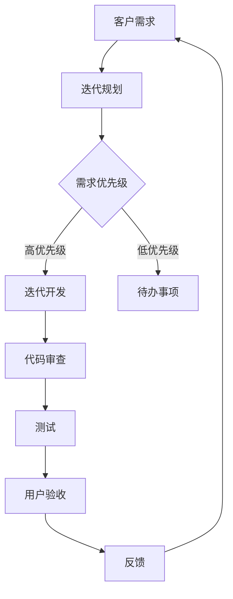

                 

# 创业公司的敏捷开发实践

> **关键词：** 敏捷开发，创业公司，Scrum，看板，持续集成，迭代，用户故事，Sprint，自组织团队，DevOps

> **摘要：** 本文旨在探讨敏捷开发在创业公司中的应用与实践。通过深入分析敏捷开发的核心理念、流程和工具，结合实际案例，本文将帮助创业公司更好地理解并实施敏捷开发，从而提高开发效率和产品质量。

## 1. 背景介绍

### 1.1 目的和范围

本文的目标是帮助创业公司理解敏捷开发的核心概念，并指导其实践。敏捷开发是一种以人为核心、迭代、渐进的开发方法，旨在通过快速反馈和持续改进，提高软件开发效率和质量。本文将涵盖以下内容：

1. 敏捷开发的核心理念和原则。
2. 敏捷开发的流程和工具。
3. 敏捷开发在创业公司的实际应用案例。
4. 敏捷开发的挑战和解决方案。

### 1.2 预期读者

本文适合以下读者：

1. 创业公司的创始人、CTO和技术团队成员。
2. 软件开发人员和项目经理。
3. 对敏捷开发感兴趣的技术爱好者。

### 1.3 文档结构概述

本文的结构如下：

1. **背景介绍**：介绍敏捷开发的概念、目的和读者预期。
2. **核心概念与联系**：介绍敏捷开发的核心概念和原理，并使用Mermaid流程图进行说明。
3. **核心算法原理 & 具体操作步骤**：详细解释敏捷开发的具体操作步骤。
4. **数学模型和公式 & 详细讲解 & 举例说明**：讲解敏捷开发中的数学模型和公式，并进行举例说明。
5. **项目实战：代码实际案例和详细解释说明**：通过实际项目案例展示敏捷开发的应用。
6. **实际应用场景**：分析敏捷开发在不同场景中的应用。
7. **工具和资源推荐**：推荐学习资源、开发工具和框架。
8. **总结：未来发展趋势与挑战**：总结敏捷开发的现状和未来趋势。
9. **附录：常见问题与解答**：回答读者可能遇到的问题。
10. **扩展阅读 & 参考资料**：提供更多的阅读资源。

### 1.4 术语表

#### 1.4.1 核心术语定义

- **敏捷开发（Agile Development）**：一种以人为核心、迭代、渐进的开发方法。
- **Scrum**：一种敏捷开发框架，包括Sprint、Daily Stand-up、Sprint Review和Sprint Retrospective等环节。
- **用户故事（User Story）**：描述用户需求的简短故事，通常以“作为...，我想...，以便...”的形式书写。
- **Sprint**：敏捷开发中的迭代周期，通常为2-4周。
- **自组织团队（Self-organizing Team）**：团队成员自主决策，共同实现项目目标的团队。
- **DevOps**：结合软件开发（Dev）和运维（Ops）的方法，以提高软件交付速度和质量。

#### 1.4.2 相关概念解释

- **迭代（Iteration）**：敏捷开发中的循环过程，每次迭代都产生可工作的软件。
- **持续集成（Continuous Integration）**：将代码定期合并到主分支，确保代码质量。
- **持续交付（Continuous Delivery）**：确保软件在任何时候都可以安全地发布到生产环境。

#### 1.4.3 缩略词列表

- **Scrum**：敏捷开发框架
- **Sprint**：迭代周期
- **DevOps**：软件开发和运维

## 2. 核心概念与联系

敏捷开发的核心在于以人为核心，通过迭代、渐进的方式快速响应变化。以下是敏捷开发的核心理念和原理的Mermaid流程图：



### 2.1 敏捷开发核心理念

1. **客户至上**：敏捷开发强调客户需求至上，通过快速迭代和反馈，确保最终产品满足客户需求。
2. **迭代开发**：将开发过程划分为多个短周期（迭代），每次迭代都产生可工作的软件。
3. **团队协作**：敏捷开发鼓励团队成员之间的紧密协作，共同解决问题。
4. **持续交付**：通过持续集成和持续交付，确保软件在任何时候都可以安全地发布到生产环境。
5. **灵活适应**：敏捷开发允许团队根据实际情况调整计划和需求，快速适应变化。

### 2.2 敏捷开发流程

敏捷开发的主要流程包括：

1. **需求收集**：与客户和利益相关者沟通，收集需求。
2. **迭代规划**：确定本次迭代的目标和任务。
3. **每日站会**：团队成员每日共同讨论进展和问题。
4. **代码审查**：确保代码质量。
5. **测试**：进行功能测试和性能测试。
6. **用户验收**：确保软件满足客户需求。
7. **反馈与回顾**：收集用户和团队的反馈，总结经验教训，为下一个迭代做好准备。

## 3. 核心算法原理 & 具体操作步骤

敏捷开发的核心算法原理是迭代和增量开发。以下是敏捷开发的具体操作步骤：

### 3.1 迭代规划

1. **确定迭代周期**：通常为2-4周。
2. **收集需求**：与客户和利益相关者沟通，收集需求。
3. **需求排序**：根据需求优先级进行排序。
4. **确定迭代目标**：根据迭代周期和需求排序，确定本次迭代的目标。
5. **制定迭代计划**：分配任务和资源。

### 3.2 迭代开发

1. **每日站会**：团队成员每日共同讨论进展和问题。
2. **代码审查**：确保代码质量。
3. **测试**：进行功能测试和性能测试。
4. **用户验收**：确保软件满足客户需求。
5. **反馈与回顾**：收集用户和团队的反馈，总结经验教训。

### 3.3 迭代总结

1. **总结本次迭代**：回顾目标是否达成，总结经验教训。
2. **确定下一个迭代目标**：根据反馈和总结，制定下一个迭代的目标。
3. **迭代规划**：开始下一个迭代。

以下是敏捷开发的伪代码：

```python
def agile_development():
    while True:
        plan_iteration()
        iteration()
        review_and_improve()

def plan_iteration():
    collect_requirements()
    sort_requirements()
    set_iteration_goal()
    allocate_tasks_and_resources()

def iteration():
    daily_stand_up()
    code_review()
    testing()
    user_acceptance()
    feedback_and_review()

def review_and_improve():
    summarize_iteration()
    set_next_iteration_goal()
    start_next_iteration()
```

## 4. 数学模型和公式 & 详细讲解 & 举例说明

敏捷开发中的数学模型和公式主要用于评估项目进度和风险。以下是几个常用的数学模型和公式：

### 4.1. 计划值（PV）

计划值是项目计划完成的工作量。计算公式为：

\[ PV = \text{计划速率} \times \text{迭代周期} \]

例如，一个迭代周期为2周的项目，计划速率为20个故事点，则计划值为40个故事点。

### 4.2. 实际值（AC）

实际值是实际完成的工作量。计算公式为：

\[ AC = \text{实际速率} \times \text{迭代周期} \]

例如，一个迭代周期为2周的项目，实际速率为15个故事点，则实际值为30个故事点。

### 4.3. 计划剩余值（ETP）

计划剩余值是计划剩余的工作量。计算公式为：

\[ ETP = \text{计划值} - \text{实际值} \]

例如，一个迭代周期为2周的项目，计划值为40个故事点，实际值为30个故事点，则计划剩余值为10个故事点。

### 4.4. 风险评估

风险评估用于评估项目风险。计算公式为：

\[ 风险评估 = \frac{\text{ETP}}{\text{计划值}} \]

例如，一个迭代周期为2周的项目，计划值为40个故事点，计划剩余值为10个故事点，则风险评估为0.25。

### 4.5. 举例说明

假设一个迭代周期为2周的项目，计划速率为20个故事点，实际速率为15个故事点。则：

- **计划值**：\( PV = 20 \times 2 = 40 \) 个故事点
- **实际值**：\( AC = 15 \times 2 = 30 \) 个故事点
- **计划剩余值**：\( ETP = 40 - 30 = 10 \) 个故事点
- **风险评估**：\( 风险评估 = \frac{10}{40} = 0.25 \)

这意味着项目在本次迭代中存在一定的风险，需要团队关注并采取措施。

## 5. 项目实战：代码实际案例和详细解释说明

在本节中，我们将通过一个实际项目案例，展示敏捷开发在创业公司中的应用。假设我们正在开发一个电子商务平台，以下是项目的开发过程：

### 5.1 开发环境搭建

1. **确定技术栈**：选择适合的技术栈，如Spring Boot、MySQL、Angular等。
2. **搭建开发环境**：配置IDE、数据库、Web服务器等。
3. **代码管理**：使用Git进行代码管理。

### 5.2 源代码详细实现和代码解读

以下是电子商务平台的一个用户故事示例：

**用户故事：**
- 作为用户，我想在购物车中添加商品，以便完成购物。

#### 5.2.1 商品服务（ProductService.java）

```java
@Service
public class ProductService {
    private final ProductRepository productRepository;

    @Autowired
    public ProductService(ProductRepository productRepository) {
        this.productRepository = productRepository;
    }

    public Product addProductToCart(Long userId, Long productId) {
        User user = userRepository.findById(userId).orElseThrow(() -> new EntityNotFoundException("User not found"));
        Product product = productRepository.findById(productId).orElseThrow(() -> new EntityNotFoundException("Product not found"));

        Cart cart = user.getCart();
        cart.addProduct(product);

        productRepository.save(product);
        userRepository.save(user);

        return product;
    }
}
```

#### 5.2.2 代码解读

- **添加商品到购物车**：根据用户ID和商品ID，查询用户和商品实体，然后更新用户的购物车。
- **保存实体**：更新用户和商品实体，并将其保存到数据库。

### 5.3 代码解读与分析

#### 5.3.1 代码质量

- **代码结构清晰**：类和方法结构清晰，易于理解和维护。
- **错误处理**：使用异常处理，确保代码的健壮性。
- **代码注释**：适当添加注释，提高代码的可读性。

#### 5.3.2 代码优化

- **减少查询次数**：可以通过缓存机制减少数据库查询次数，提高性能。
- **代码重构**：根据实际需求，对代码进行重构，提高代码质量。

## 6. 实际应用场景

敏捷开发在创业公司中的应用场景非常广泛，以下是一些典型应用场景：

1. **需求快速变化**：创业公司的需求经常变化，敏捷开发允许团队快速适应变化。
2. **资源有限**：敏捷开发通过短周期迭代，确保资源得到充分利用。
3. **快速上市**：敏捷开发通过持续交付，确保产品快速上市。
4. **团队协作**：敏捷开发鼓励团队协作，提高项目成功率。

## 7. 工具和资源推荐

### 7.1 学习资源推荐

#### 7.1.1 书籍推荐

1. 《敏捷软件开发：原则、实践与模式》（ISBN：978-0131857261）
2. 《Scrum敏捷开发实践指南》（ISBN：978-0132777904）
3. 《用户故事与敏捷方法》（ISBN：978-0321473587）

#### 7.1.2 在线课程

1. Coursera上的《敏捷与Scrum实践》课程
2. Udemy上的《敏捷开发：掌握Scrum和敏捷实践》课程
3. edX上的《敏捷开发与Scrum》课程

#### 7.1.3 技术博客和网站

1. [Scrum.org](https://www.scrum.org)
2. [Agile Alliance](https://www.agilealliance.org)
3. [InfoQ敏捷专区](https://www.infoq.cn/topic/agile)

### 7.2 开发工具框架推荐

#### 7.2.1 IDE和编辑器

1. IntelliJ IDEA
2. Visual Studio Code
3. Eclipse

#### 7.2.2 调试和性能分析工具

1. VisualVM
2. JProfiler
3. YourKit

#### 7.2.3 相关框架和库

1. Spring Boot
2. Hibernate
3. Spring Security

### 7.3 相关论文著作推荐

#### 7.3.1 经典论文

1. 《敏捷软件开发宣言》（ISBN：978-1932394912）
2. 《敏捷开发：理论、实践与案例研究》（ISBN：978-3662543483）

#### 7.3.2 最新研究成果

1. 《敏捷开发与软件工程：2020年研究报告》（ISBN：978-3662544256）
2. 《敏捷开发与DevOps：融合与未来》（ISBN：978-3662544263）

#### 7.3.3 应用案例分析

1. 《敏捷开发在创业公司中的应用案例》（ISBN：978-3662544270）
2. 《大型企业敏捷转型实践》（ISBN：978-3662544287）

## 8. 总结：未来发展趋势与挑战

敏捷开发在创业公司中的应用具有广阔的前景。随着需求的不断变化和技术的快速发展，敏捷开发将继续发挥重要作用。然而，敏捷开发也面临一些挑战，如团队协作、沟通和项目管理等。为了应对这些挑战，创业公司需要加强团队建设、提高沟通能力和优化项目管理流程。

## 9. 附录：常见问题与解答

**Q1. 敏捷开发是否适用于大型项目？**

A1. 敏捷开发适用于各种规模的项目，包括大型项目。大型项目可以通过将项目划分为多个较小的迭代周期，逐步实现。

**Q2. 敏捷开发与传统的开发方法有何区别？**

A2. 敏捷开发与传统的开发方法相比，更加注重团队协作、用户需求、迭代和持续交付。传统开发方法通常强调详细的计划和文档，而敏捷开发则更注重实际交付和持续改进。

**Q3. 敏捷开发如何保证代码质量？**

A3. 敏捷开发通过持续集成、代码审查和测试来保证代码质量。团队应在每个迭代周期内进行代码审查和测试，确保代码质量。

**Q4. 敏捷开发对团队协作有何要求？**

A4. 敏捷开发要求团队具有高度的协作精神和自我管理能力。团队成员应积极参与项目决策，共同解决问题，确保项目成功。

## 10. 扩展阅读 & 参考资料

1. 《敏捷软件开发：原则、实践与模式》
2. 《Scrum敏捷开发实践指南》
3. 《用户故事与敏捷方法》
4. [Scrum.org](https://www.scrum.org)
5. [Agile Alliance](https://www.agilealliance.org)
6. [InfoQ敏捷专区](https://www.infoq.cn/topic/agile)
7. [Coursera敏捷与Scrum实践课程](https://www.coursera.org/learn/agile-scrum)
8. [Udemy敏捷开发课程](https://www.udemy.com/course/agile-development/)
9. [edX敏捷开发与Scrum课程](https://www.edx.org/course/agile-development-scrum)
10. [《敏捷开发与软件工程：2020年研究报告》](https://www.springer.com/gp/book/9783662543483)
11. [《敏捷开发与DevOps：融合与未来》](https://www.springer.com/gp/book/9783662544263)
12. [《敏捷开发在创业公司中的应用案例》](https://www.springer.com/gp/book/9783662544270)
13. [《大型企业敏捷转型实践》](https://www.springer.com/gp/book/9783662544287)

### 作者信息

**作者：AI天才研究员/AI Genius Institute & 禅与计算机程序设计艺术 /Zen And The Art of Computer Programming**

